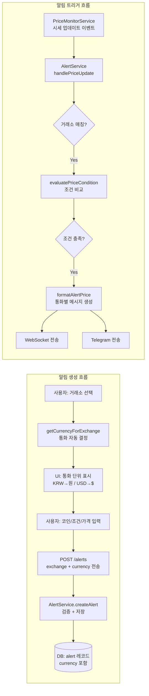
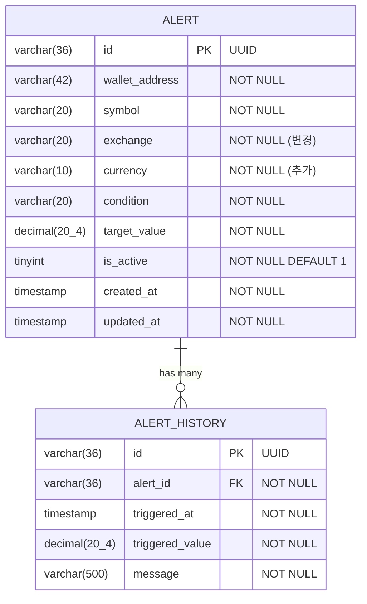
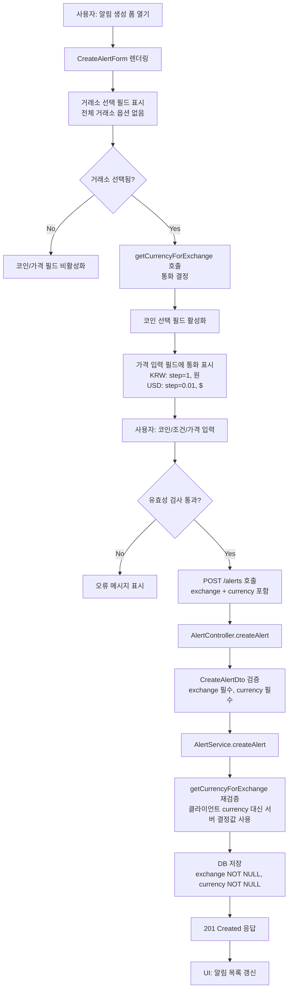
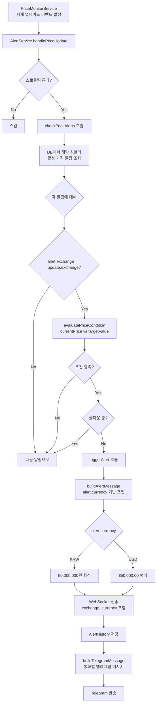
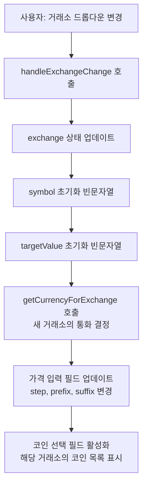
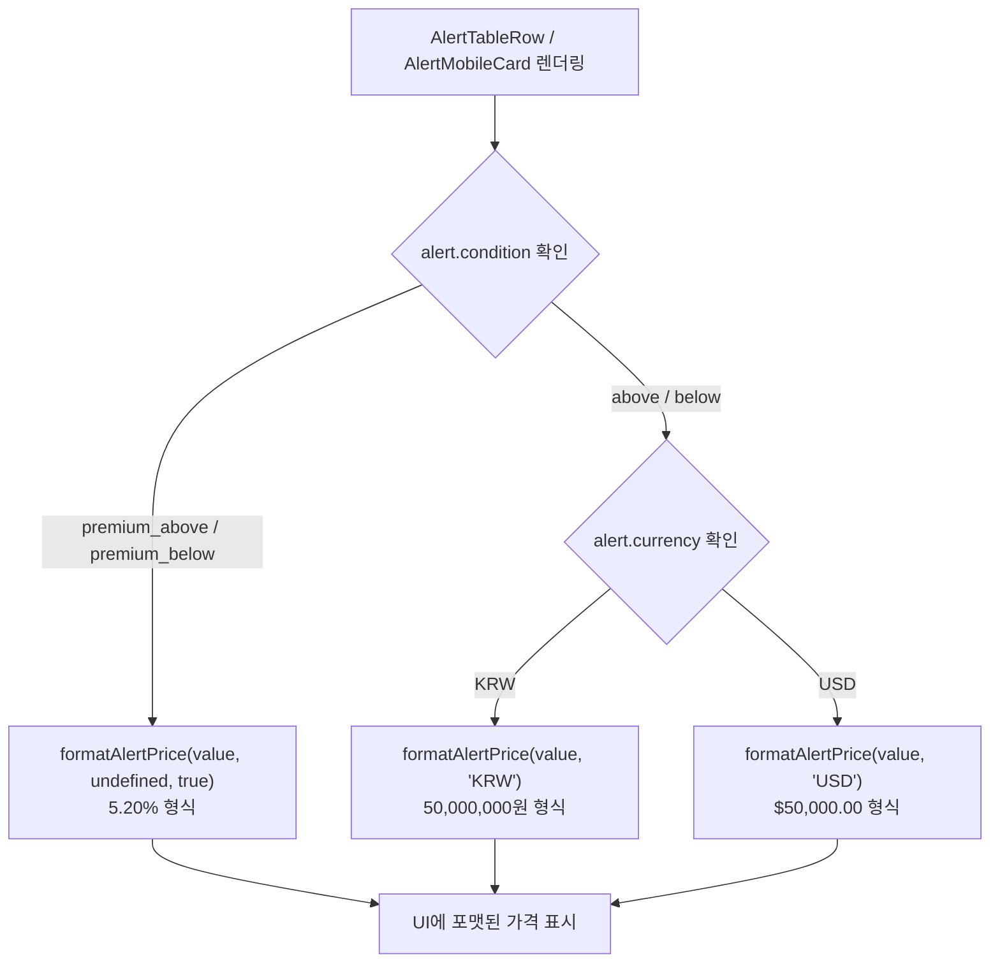

# 알림 통화 구분 기능 (Alert Currency Support) 설계 문서

## 개요

BitScope 알림 시스템에서 거래소 유형에 따라 통화 단위를 자동으로 구분하는 기능을 설계한다. 현재 모든 가격 알림이 KRW(원) 기준으로만 동작하고 있으나, 해외거래소(Binance, Bybit, OKX, Gate, Bitget) 및 DEX(Hyperliquid) 지원에 따라 USD($) 기준 알림이 필요하다.

### 설계 목표

1. 거래소 유형에 따른 자동 통화 결정 (KRW/USD)
2. shared 패키지의 단일 유틸리티로 프론트/백엔드 일관성 보장
3. UI 흐름 변경: 거래소(필수) → 코인 → 조건 → 가격
4. DB 스키마 변경: currency NOT NULL 추가, exchange NOT NULL 변경
5. 알림 메시지(WebSocket, Telegram)에 올바른 통화 표시

### 설계 원칙

- **단일 진실 원천(Single Source of Truth)**: 통화 결정 로직은 shared 패키지에만 존재
- **동기적 결정**: 거래소 식별자만으로 통화를 결정, 추가 I/O 없음
- **클린 스타트**: 기존 알림 데이터 삭제, 하위 호환성 불필요
- **확장성**: 새 거래소 추가 시 매핑 데이터만 수정

---

## 아키텍처 설계

### 시스템 아키텍처 다이어그램

```mermaid
graph TB
    subgraph "packages/shared"
        CU[getCurrencyForExchange<br/>통화 결정 유틸리티]
        FU[formatAlertPrice<br/>알림 가격 포맷 유틸리티]
        AT[AlertCurrency 타입<br/>'KRW' | 'USD']
        EM[EXCHANGE_CURRENCY_MAP<br/>거래소→통화 매핑]
    end

    subgraph "apps/web (Next.js)"
        UI[CreateAlertForm<br/>알림 생성 폼]
        AL[AlertList / AlertTableRow<br/>알림 목록 표시]
        UH[useAlerts Hook<br/>API 호출 + 상태 관리]
    end

    subgraph "apps/api (NestJS)"
        AC[AlertController<br/>REST 엔드포인트]
        AS[AlertService<br/>비즈니스 로직]
        AE[AlertEntity<br/>TypeORM 엔티티]
        MG[마이그레이션<br/>스키마 변경]
        TG[TelegramService<br/>텔레그램 알림]
    end

    subgraph "Database (MySQL)"
        DB[(alert 테이블<br/>+currency NOT NULL<br/>exchange NOT NULL)]
    end

    UI --> CU
    UI --> FU
    AL --> CU
    AL --> FU
    UH --> AC

    AC --> AS
    AS --> CU
    AS --> FU
    AS --> AE
    AS --> TG
    AE --> DB
    MG --> DB

    CU --> EM
    CU --> AT
```

### 데이터 흐름 다이어그램



---

## 컴포넌트 설계

### 컴포넌트 1: 통화 결정 유틸리티 (packages/shared)

**파일**: `packages/shared/src/utils/currency.ts`

**책임**: 거래소 식별자로부터 통화 단위를 결정하고, 통화별 가격 포맷팅을 제공한다.

**인터페이스**:

```typescript
import type { ExchangeType } from '../types/exchange';
import { DOMESTIC_EXCHANGES } from '../constants/exchanges';

/** 알림에서 사용하는 통화 단위 */
export type AlertCurrency = 'KRW' | 'USD';

/** 거래소별 통화 매핑 */
export const EXCHANGE_CURRENCY_MAP: Record<ExchangeType, AlertCurrency> = {
  upbit: 'KRW',
  bithumb: 'KRW',
  coinone: 'KRW',
  binance: 'USD',
  bybit: 'USD',
  okx: 'USD',
  gate: 'USD',
  bitget: 'USD',
  hyperliquid: 'USD',
};

/**
 * 거래소 식별자로부터 알림 통화 단위를 결정한다.
 *
 * @param exchange - 거래소 식별자
 * @returns 'KRW' 또는 'USD'
 */
export function getCurrencyForExchange(exchange: ExchangeType): AlertCurrency;

/**
 * 국내 거래소인지 여부를 반환한다.
 *
 * @param exchange - 거래소 식별자
 * @returns true이면 국내 거래소
 */
export function isDomesticExchange(exchange: ExchangeType): boolean;

/**
 * 알림 가격을 통화에 맞게 포맷팅한다.
 * - KRW: "50,000,000원" (정수, 원 접미사)
 * - USD: "$50,000.00" (소수점 2자리, $ 접두사)
 * - %: "5.20%" (김프 알림용)
 *
 * @param value - 가격 또는 프리미엄 비율
 * @param currency - 통화 단위 (김프 알림이면 undefined)
 * @param isPremium - 김프 알림 여부
 * @returns 포맷된 문자열
 */
export function formatAlertPrice(
  value: number,
  currency?: AlertCurrency,
  isPremium?: boolean,
): string;

/**
 * 통화에 따른 가격 입력 step 값을 반환한다.
 * - KRW: '1' (정수 입력)
 * - USD: '0.01' (소수점 입력)
 *
 * @param currency - 통화 단위
 * @returns step 문자열
 */
export function getInputStepForCurrency(currency: AlertCurrency): string;

/**
 * 통화에 따른 접미사/접두사를 반환한다.
 * - KRW: { prefix: '', suffix: '원' }
 * - USD: { prefix: '$', suffix: '' }
 *
 * @param currency - 통화 단위
 * @returns { prefix, suffix }
 */
export function getCurrencyDisplay(currency: AlertCurrency): {
  prefix: string;
  suffix: string;
};
```

**의존성**: `ExchangeType` 타입, `DOMESTIC_EXCHANGES` 상수

---

### 컴포넌트 2: 공유 타입 변경 (packages/shared)

**파일**: `packages/shared/src/types/alert.ts`

**변경 사항**:

```typescript
import type { ExchangeType } from './exchange';
import type { AlertCurrency } from '../utils/currency';

/** 알림 설정 */
export interface AlertConfig {
  symbol: string;
  /** 대상 거래소 (필수) */
  exchange: ExchangeType;                // 변경: optional → required
  /** 통화 단위 (거래소에 의해 자동 결정) */
  currency: AlertCurrency;               // 추가
  condition: AlertCondition;
  targetValue: number;
  isActive: boolean;
}

/** 알림 엔티티 */
export interface Alert {
  id: string;
  walletAddress: string;
  config: AlertConfig;
  createdAt: Date;
  updatedAt: Date;
}
```

**AlertNotification 타입 확장**:

```typescript
export interface AlertNotification {
  alertId: string;
  symbol: string;
  /** 거래소 (추가) */
  exchange: ExchangeType;                // 추가
  /** 통화 (추가) */
  currency: AlertCurrency;               // 추가
  condition: AlertCondition;
  targetValue: number;
  triggeredValue: number;
  message: string;
  triggeredAt: Date;
}
```

---

### 컴포넌트 3: DB 엔티티 변경 (apps/api)

**파일**: `apps/api/src/modules/alert/entities/alert.entity.ts`

**변경 사항**:

```typescript
@Entity('alert')
@Index('idx_alert_wallet_active', ['walletAddress', 'isActive'])
export class AlertEntity {
  // ... 기존 필드 ...

  /** 대상 거래소 (NOT NULL) */
  @Column({ type: 'varchar', length: 20, nullable: false })  // 변경: nullable: true → false
  exchange!: string;                                           // 변경: string | null → string

  /** 통화 단위 ('KRW' | 'USD') */
  @Column({ type: 'varchar', length: 10, nullable: false })   // 추가
  currency!: string;

  // ... 나머지 필드 ...
}
```

---

### 컴포넌트 4: DTO 변경 (apps/api)

**파일**: `apps/api/src/modules/alert/dto/create-alert.dto.ts`

**변경 사항**:

```typescript
export class CreateAlertDto {
  @IsString()
  @Matches(/^0x[a-fA-F0-9]{40}$/, {
    message: 'walletAddress는 유효한 이더리움 지갑 주소여야 합니다.',
  })
  walletAddress!: string;

  @IsString()
  symbol!: string;

  /** 대상 거래소 (필수) */
  @IsString()                                            // 변경: @IsOptional() 제거
  @IsIn([...SUPPORTED_EXCHANGES], {
    message: '유효한 거래소를 선택해야 합니다.',
  })
  exchange!: string;                                      // 변경: optional → required

  /** 통화 단위 (서버에서 거래소 기반으로 자동 설정, 클라이언트 전송값은 검증용) */
  @IsString()
  @IsIn(['KRW', 'USD'], {
    message: 'currency는 KRW 또는 USD여야 합니다.',
  })
  currency!: string;                                      // 추가

  @IsString()
  @IsIn(['above', 'below', 'premium_above', 'premium_below'], {
    message: 'condition은 above, below, premium_above, premium_below 중 하나여야 합니다.',
  })
  condition!: string;

  @IsNumber()
  @Min(0, { message: 'targetValue는 0 이상이어야 합니다.' })
  targetValue!: number;

  @IsOptional()
  @IsBoolean()
  isActive?: boolean;
}
```

---

### 컴포넌트 5: AlertService 변경 (apps/api)

**파일**: `apps/api/src/modules/alert/alert.service.ts`

**변경 사항**:

1. **createAlert**: currency를 서버 측에서 재검증 (getCurrencyForExchange로 exchange 기반 재계산)
2. **buildAlertMessage**: 통화별 메시지 포맷 분기 (formatAlertPrice 사용)
3. **buildTelegramMessage**: 통화별 텔레그램 메시지 포맷 분기
4. **checkPriceAlerts**: 거래소 필터링 로직 단순화 (exchange가 항상 NOT NULL)
5. **triggerAlert**: AlertNotification에 exchange, currency 필드 추가

**인터페이스 변경**:

```typescript
/** 알림 생성 */
async createAlert(dto: CreateAlertDto): Promise<AlertEntity> {
  // 서버 측에서 exchange 기반으로 currency를 재결정 (클라이언트 값 무시)
  const currency = getCurrencyForExchange(dto.exchange as ExchangeType);

  const alert = this.alertRepository.create({
    walletAddress: dto.walletAddress.toLowerCase(),
    symbol: dto.symbol.toUpperCase(),
    exchange: dto.exchange,          // NOT NULL
    currency: currency,              // 추가: 서버가 결정
    condition: dto.condition,
    targetValue: dto.targetValue,
    isActive: dto.isActive ?? true,
  });

  return this.alertRepository.save(alert);
}

/** 알림 메시지 생성 (통화 반영) */
private buildAlertMessage(alert: AlertEntity, triggeredValue: number): string {
  const currency = alert.currency as AlertCurrency;
  // formatAlertPrice 활용
}
```

---

### 컴포넌트 6: 알림 생성 폼 UI 변경 (apps/web)

**파일**: `apps/web/app/(dashboard)/alerts/page.tsx`

**변경 사항**:

1. **입력 순서 변경**: 거래소(필수) → 코인 → 조건 → 가격
2. **거래소 필수 선택**: "전체 거래소" 옵션 제거, 미선택 시 코인/가격 비활성화
3. **통화 단위 동적 표시**: 거래소 선택 시 getCurrencyForExchange로 통화 결정, 가격 입력 필드에 반영
4. **가격 입력 step**: KRW는 정수(step="1"), USD는 소수점(step="0.01")
5. **거래소 변경 시 초기화**: 코인, 가격 값 리셋

**상태 관리 변경**:

```typescript
function CreateAlertForm({ type, isLoading, error, onSubmit, onCancel }) {
  const [exchange, setExchange] = useState<string>('');       // 1순위
  const [symbol, setSymbol] = useState('');                    // 2순위 (거래소 의존)
  const [condition, setCondition] = useState<AlertCondition>(...);
  const [targetValue, setTargetValue] = useState('');

  // 거래소에 따른 통화 결정
  const currency = exchange
    ? getCurrencyForExchange(exchange as ExchangeType)
    : null;

  // 거래소 변경 시 하위 필드 초기화
  const handleExchangeChange = (newExchange: string) => {
    setExchange(newExchange);
    setSymbol('');
    setTargetValue('');
  };

  // 코인 필드 비활성화: 거래소 미선택 시
  const isCoinDisabled = !exchange;

  // 가격 입력 필드: 통화에 따른 step, 접두사/접미사
  const inputStep = currency ? getInputStepForCurrency(currency) : '1';
  const { prefix, suffix } = currency
    ? getCurrencyDisplay(currency)
    : { prefix: '', suffix: '' };

  // 폼 유효성: 거래소 필수
  const isFormValid =
    exchange.trim() !== '' &&
    symbol.trim() !== '' &&
    targetValue.trim() !== '' &&
    !isNaN(parseFloat(targetValue)) &&
    (type === 'premium' || parseFloat(targetValue) >= 0);

  // 전송 시 currency 포함
  const handleSubmit = (e: React.FormEvent) => {
    e.preventDefault();
    onSubmit({
      symbol: symbol.toUpperCase(),
      exchange: exchange as ExchangeType,
      currency: currency!,
      condition,
      targetValue: parseFloat(targetValue),
    });
  };
}
```

---

### 컴포넌트 7: 알림 목록 표시 변경 (apps/web)

**파일**: `apps/web/app/(dashboard)/alerts/page.tsx`

**변경 사항**:

1. **AlertTableRow / AlertMobileCard**: 목표 가격을 alert.currency 기반으로 포맷
2. **기존 하드코딩 "KRW" 제거**: formatAlertPrice(alert.targetValue, alert.currency) 사용

```typescript
// 기존 (하드코딩 KRW)
{`${Number(alert.targetValue).toLocaleString('ko-KR')} KRW`}

// 변경 (통화 기반 포맷)
{formatAlertPrice(Number(alert.targetValue), alert.currency as AlertCurrency)}
```

---

### 컴포넌트 8: useAlerts 훅 변경 (apps/web)

**파일**: `apps/web/hooks/useAlerts.ts`

**변경 사항**:

1. **AlertResponse 타입**: `exchange: string` (NOT NULL), `currency: string` 추가
2. **CreateAlertParams 타입**: `exchange: ExchangeType` (필수), `currency: AlertCurrency` 추가

```typescript
export interface AlertResponse {
  id: string;
  walletAddress: string;
  symbol: string;
  exchange: string;            // 변경: string | null → string
  currency: string;            // 추가
  condition: string;
  targetValue: number;
  isActive: boolean;
  createdAt: string;
  updatedAt: string;
}

export interface CreateAlertParams {
  walletAddress: string;
  symbol: string;
  exchange: ExchangeType;      // 변경: optional → required
  currency: AlertCurrency;     // 추가
  condition: AlertCondition;
  targetValue: number;
  isActive?: boolean;
}
```

---

## 데이터 모델

### 핵심 데이터 구조 정의

```typescript
// packages/shared/src/utils/currency.ts

/** 알림 통화 단위 */
type AlertCurrency = 'KRW' | 'USD';

/** 거래소→통화 매핑 (읽기 전용) */
const EXCHANGE_CURRENCY_MAP: Readonly<Record<ExchangeType, AlertCurrency>>;
```

### 데이터 모델 다이어그램



### DB 스키마 변경 (마이그레이션)

새 마이그레이션 파일: `apps/api/src/migrations/1746500000000-AlertCurrencySupport.ts`

```sql
-- 1. 기존 alert_history 데이터 삭제 (FK 제약 때문에 먼저)
DELETE FROM alert_history;

-- 2. 기존 alert 데이터 삭제
DELETE FROM alert;

-- 3. currency 컬럼 추가 (NOT NULL)
ALTER TABLE alert ADD COLUMN currency varchar(10) NOT NULL AFTER exchange;

-- 4. exchange 컬럼을 NOT NULL로 변경
ALTER TABLE alert MODIFY COLUMN exchange varchar(20) NOT NULL;
```

---

## 비즈니스 프로세스

### 프로세스 1: 알림 생성 (통화 결정 포함)



### 프로세스 2: 가격 알림 트리거 (통화별 메시지)



### 프로세스 3: 거래소 변경 시 UI 초기화



### 프로세스 4: 알림 목록 통화별 가격 표시



---

## 에러 처리 전략

### 1. 유효성 검증 에러

| 상황 | 처리 방식 |
|------|-----------|
| 거래소 미선택 상태로 저장 시도 | 프론트: 폼 유효성 검사로 버튼 비활성화 + 에러 메시지. 백엔드: class-validator로 400 반환 |
| 유효하지 않은 거래소 값 | 백엔드: @IsIn 검증으로 400 Bad Request |
| currency와 exchange 불일치 | 백엔드: 클라이언트 currency를 무시하고 서버에서 getCurrencyForExchange로 재결정. 불일치 자체가 에러가 되지 않음 |
| targetValue가 음수 (가격 알림) | 프론트: min="0" + 폼 검증. 백엔드: @Min(0) 검증 |

### 2. 마이그레이션 에러

| 상황 | 처리 방식 |
|------|-----------|
| 마이그레이션 실패 시 롤백 | down() 메서드에서 currency 컬럼 삭제 + exchange nullable 복원 |
| 기존 데이터 삭제 실패 | FK 제약으로 alert_history 먼저 삭제 후 alert 삭제 (순서 보장) |

### 3. 런타임 에러

| 상황 | 처리 방식 |
|------|-----------|
| 알 수 없는 거래소 값이 DB에 존재 | getCurrencyForExchange에서 기본값 'USD' 반환 (방어적 처리) |
| WebSocket 알림 전송 실패 | 기존과 동일: 로그만 남기고 진행 |
| Telegram 알림 전송 실패 | 기존과 동일: catch 블록에서 로그만 남기고 다음 알림 진행 |

### 4. 하위 호환성

- **클린 스타트 정책**: 기존 데이터를 모두 삭제하므로 하위 호환성 문제 없음
- **API 응답 변경**: exchange가 null → string, currency 필드 추가. 프론트엔드가 동시에 배포되므로 문제 없음
- **프론트에서 null exchange 처리 코드**: 기존 "전체 거래소" 표시 로직 제거 필요

---

## 테스트 전략

### 1. 유닛 테스트 (packages/shared)

**파일**: `packages/shared/src/utils/currency.test.ts`

| 테스트 항목 | 내용 |
|-------------|------|
| getCurrencyForExchange - 국내거래소 | upbit, bithumb, coinone → 'KRW' 반환 |
| getCurrencyForExchange - 해외거래소 | binance, bybit, okx, gate, bitget → 'USD' 반환 |
| getCurrencyForExchange - DEX | hyperliquid → 'USD' 반환 |
| isDomesticExchange | 국내 true, 해외 false 확인 |
| formatAlertPrice - KRW | 50000000 → "50,000,000원" |
| formatAlertPrice - USD | 50000 → "$50,000.00" |
| formatAlertPrice - 프리미엄 | 5.2 → "5.20%" |
| getInputStepForCurrency | KRW → '1', USD → '0.01' |
| getCurrencyDisplay | KRW → {prefix:'', suffix:'원'}, USD → {prefix:'$', suffix:''} |
| EXCHANGE_CURRENCY_MAP 완전성 | 모든 ExchangeType 키가 매핑에 존재하는지 확인 |

### 2. 유닛 테스트 (apps/api)

**파일**: `apps/api/src/modules/alert/__tests__/alert.service.spec.ts`

| 테스트 항목 | 내용 |
|-------------|------|
| createAlert - currency 자동 결정 | exchange='upbit' → currency='KRW' 저장 확인 |
| createAlert - exchange 필수 | exchange 없이 호출 시 에러 |
| buildAlertMessage - KRW | "BTC 가격이 50,000,000원 이상에 도달했습니다." |
| buildAlertMessage - USD | "BTC 가격이 $50,000.00 이상에 도달했습니다." |
| buildAlertMessage - 김프 | "BTC 김치 프리미엄이 5.20% 이상에 도달했습니다." |
| buildTelegramMessage - KRW | 원화 포맷 메시지 확인 |
| buildTelegramMessage - USD | 달러 포맷 메시지 확인 |
| checkPriceAlerts - 거래소 매칭 | exchange NOT NULL에 의한 정확한 필터링 |

### 3. DTO 검증 테스트 (apps/api)

| 테스트 항목 | 내용 |
|-------------|------|
| CreateAlertDto - exchange 필수 | exchange 누락 시 검증 실패 |
| CreateAlertDto - currency 필수 | currency 누락 시 검증 실패 |
| CreateAlertDto - 유효한 currency | 'KRW', 'USD' 허용, 그 외 거부 |
| CreateAlertDto - 유효한 exchange | SUPPORTED_EXCHANGES에 포함된 값만 허용 |

### 4. E2E / 통합 테스트

| 테스트 항목 | 내용 |
|-------------|------|
| 마이그레이션 적용 | 기존 데이터 삭제 + 스키마 변경 정상 완료 |
| POST /alerts - KRW 알림 생성 | exchange=upbit, currency=KRW로 정상 생성 |
| POST /alerts - USD 알림 생성 | exchange=binance, currency=USD로 정상 생성 |
| POST /alerts - exchange 누락 | 400 Bad Request |
| GET /alerts/:wallet - 통화 포함 응답 | 응답에 currency 필드 포함 확인 |

### 5. 프론트엔드 테스트 (수동/E2E)

| 테스트 항목 | 내용 |
|-------------|------|
| 거래소 미선택 시 코인/가격 비활성화 | 거래소 선택 전 disabled 상태 확인 |
| 국내거래소 선택 시 원화 표시 | "원" 접미사, step=1 확인 |
| 해외거래소 선택 시 달러 표시 | "$" 접두사, step=0.01 확인 |
| 거래소 변경 시 코인/가격 초기화 | 값 리셋 확인 |
| 알림 목록 통화별 표시 | KRW 알림은 "원", USD 알림은 "$" 표시 |
| 김프 알림 % 유지 | 거래소 선택과 무관하게 % 표시 |

---

## 설계 결정 및 근거

### 결정 1: 서버 측 currency 재결정

**결정**: 클라이언트가 보내는 currency 값을 무시하고 서버에서 exchange 기반으로 재계산한다.

**근거**: 클라이언트 값을 신뢰하면 exchange='upbit'인데 currency='USD'인 비정상 데이터가 저장될 수 있다. 서버가 단일 진실 원천(getCurrencyForExchange)으로 결정하면 데이터 무결성이 보장된다.

### 결정 2: AlertCurrency를 기존 Currency 타입과 분리

**결정**: 기존 `Currency = 'KRW' | 'BTC' | 'USDT' | 'USDC'`와 별도로 `AlertCurrency = 'KRW' | 'USD'`를 정의한다.

**근거**: 기존 Currency는 마켓 거래 통화(BTC 마켓, USDT 마켓 등)를 나타내고, AlertCurrency는 알림 표시용 통화 단위이다. 의미와 사용 맥락이 다르므로 별도 타입으로 분리하여 혼동을 방지한다.

### 결정 3: DTO에 currency 필드 포함

**결정**: CreateAlertDto에 currency 필드를 포함하되, 서버에서 재결정한다.

**근거**: 클라이언트에서 currency를 보내면 API 문서화 및 디버깅이 용이하다. 서버에서 재결정하므로 잘못된 값이 저장되는 것을 방지한다. 향후 클라이언트가 표시한 통화와 서버가 결정한 통화가 다른 경우를 감지하는 용도로도 활용할 수 있다.

### 결정 4: 클린 스타트 (기존 데이터 삭제)

**결정**: 마이그레이션에서 기존 alert, alert_history 데이터를 모두 삭제하고 새로운 스키마로 시작한다.

**근거**: 기존 알림의 exchange가 NULL인 레코드를 의미 있게 마이그레이션할 수 없다. 어떤 거래소에 대한 알림이었는지 알 수 없으므로 currency도 결정할 수 없다. 데이터 양이 적고 사용자가 재설정할 수 있으므로 클린 스타트가 가장 안전하다.

### 결정 5: 김프 알림에서의 거래소 필수화

**결정**: 김프 알림도 거래소를 필수로 선택하게 한다 (기존과 동일하게 % 기준 동작).

**근거**: DB 스키마에서 exchange가 NOT NULL이므로 김프 알림도 거래소가 필요하다. 김프 알림은 exchange를 "기준 거래소"로 해석할 수 있고, UI에서 거래소 선택과 무관하게 % 입력 필드를 표시하므로 사용자 경험에 영향이 없다.
