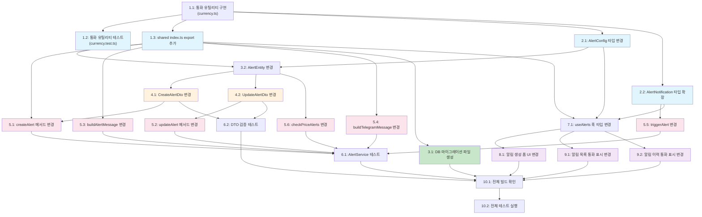

# 알림 통화 구분 기능 (Alert Currency Support) 구현 계획

## 구현 태스크

- [x] 1. shared 패키지에 통화 결정 유틸리티 생성 및 테스트
- [x] 1.1 `packages/shared/src/utils/currency.ts` 파일을 생성하고 통화 관련 유틸리티를 구현한다
  - `AlertCurrency` 타입 (`'KRW' | 'USD'`) 정의
  - `EXCHANGE_CURRENCY_MAP` 상수 정의 (모든 ExchangeType에 대한 통화 매핑)
  - `getCurrencyForExchange(exchange)` 함수 구현: 거래소 식별자로부터 통화 반환
  - `isDomesticExchange(exchange)` 함수 구현: 국내 거래소 여부 판별
  - `formatAlertPrice(value, currency?, isPremium?)` 함수 구현: KRW는 "50,000,000원", USD는 "$50,000.00", 프리미엄은 "5.20%" 형식
  - `getInputStepForCurrency(currency)` 함수 구현: KRW → '1', USD → '0.01'
  - `getCurrencyDisplay(currency)` 함수 구현: KRW → {prefix:'', suffix:'원'}, USD → {prefix:'$', suffix:''}
  - `DOMESTIC_EXCHANGES` 상수를 `../constants/exchanges`에서 import하여 활용
  - _요구사항: 5.1, 5.2, 5.3, NFR-1.1, NFR-1.2, NFR-3.1, NFR-4.1_

- [x] 1.2 `packages/shared/src/utils/currency.test.ts` 유닛 테스트를 작성한다
  - `getCurrencyForExchange`: 국내거래소(upbit, bithumb, coinone) → 'KRW' 반환 확인
  - `getCurrencyForExchange`: 해외거래소(binance, bybit, okx, gate, bitget) → 'USD' 반환 확인
  - `getCurrencyForExchange`: DEX(hyperliquid) → 'USD' 반환 확인
  - `isDomesticExchange`: 국내 true, 해외/DEX false 확인
  - `formatAlertPrice`: KRW 50000000 → "50,000,000원", USD 50000 → "$50,000.00", 프리미엄 5.2 → "5.20%"
  - `getInputStepForCurrency`: KRW → '1', USD → '0.01'
  - `getCurrencyDisplay`: KRW → {prefix:'', suffix:'원'}, USD → {prefix:'$', suffix:''}
  - `EXCHANGE_CURRENCY_MAP` 완전성: 모든 ExchangeType 키가 매핑에 존재하는지 확인
  - _요구사항: 5.1, 5.2, 5.3, NFR-1.1_

- [x] 1.3 `packages/shared/src/index.ts`에 통화 유틸리티 export를 추가한다
  - `AlertCurrency` 타입 export
  - `EXCHANGE_CURRENCY_MAP` 상수 export
  - `getCurrencyForExchange`, `isDomesticExchange`, `formatAlertPrice`, `getInputStepForCurrency`, `getCurrencyDisplay` 함수 export
  - shared 패키지 빌드가 정상적으로 완료되는지 확인
  - _요구사항: 5.1, NFR-1.1_

- [x] 2. shared 패키지 알림 타입 변경
- [x] 2.1 `packages/shared/src/types/alert.ts`에서 `AlertConfig` 인터페이스를 변경한다
  - `exchange` 필드: `ExchangeType?` (optional) → `ExchangeType` (required)로 변경
  - `currency: AlertCurrency` 필드 추가 (거래소에 의해 자동 결정)
  - `AlertCurrency`를 `../utils/currency`에서 import
  - _요구사항: 1.2, 5.4, 9.2_

- [x] 2.2 `packages/shared/src/types/alert.ts`에서 `AlertNotification` 인터페이스를 확장한다
  - `exchange: ExchangeType` 필드 추가
  - `currency: AlertCurrency` 필드 추가
  - _요구사항: 6.1, 6.2, 8.2_

- [x] 3. DB 마이그레이션 및 엔티티 변경 (apps/api)
- [x] 3.1 `apps/api/src/migrations/`에 새 마이그레이션 파일 `1746500000000-AlertCurrencySupport.ts`를 생성한다
  - up(): alert_history 데이터 전체 삭제 (FK 제약 순서), alert 데이터 전체 삭제, `currency varchar(10) NOT NULL` 컬럼 추가, `exchange` 컬럼을 `NOT NULL`로 변경
  - down(): `currency` 컬럼 삭제, `exchange` 컬럼을 `nullable`로 복원
  - _요구사항: 9.1, 9.2, 9.3, 1.4, NFR-2.1_

- [x] 3.2 `apps/api/src/modules/alert/entities/alert.entity.ts`에서 AlertEntity를 변경한다
  - `exchange` 컬럼: `nullable: true` → `nullable: false`로 변경, 타입 `string | null` → `string`으로 변경
  - `currency` 컬럼 추가: `type: 'varchar', length: 10, nullable: false`
  - _요구사항: 9.1, 9.2, 5.4_

- [x] 4. DTO 변경 (apps/api)
- [x] 4.1 `apps/api/src/modules/alert/dto/create-alert.dto.ts`에서 CreateAlertDto를 변경한다
  - `exchange` 필드: `@IsOptional()` 제거, `!: string` (required)으로 변경
  - `currency` 필드 추가: `@IsString()`, `@IsIn(['KRW', 'USD'])`, `!: string`
  - _요구사항: 1.2, 1.3, 5.4_

- [x] 4.2 `apps/api/src/modules/alert/dto/update-alert.dto.ts`에서 UpdateAlertDto를 변경한다
  - `exchange` 필드: `string | null` → `string` (optional이지만 null 불가)으로 변경
  - `currency` 필드 추가: optional, `@IsIn(['KRW', 'USD'])`
  - _요구사항: 1.2, 5.4_

- [x] 5. AlertService 비즈니스 로직 변경 (apps/api)
- [x] 5.1 `apps/api/src/modules/alert/alert.service.ts`의 `createAlert` 메서드를 변경한다
  - `getCurrencyForExchange`를 import하여 서버 측에서 exchange 기반 currency를 재결정 (클라이언트 값 무시)
  - 엔티티 생성 시 `exchange: dto.exchange` (NOT NULL), `currency` 필드 포함
  - `exchange: dto.exchange || null` → `exchange: dto.exchange`로 변경
  - _요구사항: 3.3, 4.4, 5.1_

- [x] 5.2 `alert.service.ts`의 `updateAlert` 메서드를 변경한다
  - exchange가 변경되면 currency도 `getCurrencyForExchange`로 재결정하여 함께 업데이트
  - `exchange: dto.exchange` 할당 시 null 할당 코드 제거
  - _요구사항: 5.1_

- [x] 5.3 `alert.service.ts`의 `buildAlertMessage` 메서드를 변경한다
  - `alert.currency`를 `AlertCurrency`로 캐스팅하여 `formatAlertPrice` 사용
  - 기존 하드코딩 "원" → `formatAlertPrice(targetValue, currency)` / `formatAlertPrice(triggeredValue, currency)` 사용
  - 김프 알림은 기존 % 형식 유지 (`formatAlertPrice(value, undefined, true)`)
  - _요구사항: 6.1, 6.2, 6.3, 6.4, 7.3_

- [x] 5.4 `alert.service.ts`의 `buildTelegramMessage` 메서드를 변경한다
  - 기존 하드코딩 "KRW" → `formatAlertPrice` 사용하여 통화별 포맷 적용
  - `exchangeNameMap`에 해외거래소(binance, bybit, okx, gate, bitget, hyperliquid) 추가
  - exchange가 항상 NOT NULL이므로 조건부 표시 로직 단순화
  - _요구사항: 6.3, 6.4_

- [x] 5.5 `alert.service.ts`의 `triggerAlert` 메서드를 변경한다
  - `AlertNotification` 객체에 `exchange: alert.exchange as ExchangeType`, `currency: alert.currency as AlertCurrency` 필드 추가
  - _요구사항: 6.1, 6.2, 8.2_

- [x] 5.6 `alert.service.ts`의 `checkPriceAlerts` 메서드를 변경한다
  - exchange가 항상 NOT NULL이므로 `if (alert.exchange && ...)` 조건을 `if (alert.exchange !== update.exchange)` 로 단순화
  - _요구사항: 6.5_

- [x] 6. AlertService 유닛 테스트 작성 (apps/api)
- [x] 6.1 `apps/api/src/modules/alert/__tests__/alert.service.spec.ts`에 테스트를 추가/수정한다
  - `createAlert`: exchange='upbit' → currency='KRW' 저장 확인
  - `createAlert`: exchange='binance' → currency='USD' 저장 확인
  - `buildAlertMessage`: KRW 알림 → "50,000,000원" 형식 메시지 확인
  - `buildAlertMessage`: USD 알림 → "$50,000.00" 형식 메시지 확인
  - `buildAlertMessage`: 김프 알림 → "5.20%" 형식 메시지 확인
  - `buildTelegramMessage`: KRW/USD 통화별 메시지 형식 확인
  - `checkPriceAlerts`: exchange NOT NULL에 의한 정확한 거래소 매칭 확인
  - `triggerAlert`: AlertNotification에 exchange, currency 필드 포함 확인
  - _요구사항: 6.1, 6.2, 6.3, 6.4, 6.5_

- [x] 6.2 DTO 검증 테스트를 추가한다
  - `CreateAlertDto`: exchange 누락 시 검증 실패 확인
  - `CreateAlertDto`: currency 누락 시 검증 실패 확인
  - `CreateAlertDto`: currency에 'KRW', 'USD'만 허용 확인
  - `CreateAlertDto`: 유효한 exchange 값만 허용 확인
  - _요구사항: 1.2, 1.3_

- [x] 7. 프론트엔드 useAlerts 훅 타입 변경 (apps/web)
- [x] 7.1 `apps/web/hooks/useAlerts.ts`의 타입과 API 호출 로직을 변경한다
  - `AlertResponse` 인터페이스: `exchange: string | null` → `exchange: string`, `currency: string` 필드 추가
  - `CreateAlertParams` 인터페이스: `exchange?: ExchangeType` → `exchange: ExchangeType` (필수), `currency: AlertCurrency` 필드 추가
  - `UpdateAlertParams` 인터페이스: `exchange?: ExchangeType | null` → `exchange?: ExchangeType` (null 제거)
  - `AlertCurrency`를 `@bitscope/shared`에서 import
  - _요구사항: 8.1, 8.2_

- [x] 8. 프론트엔드 알림 생성 폼 UI 변경 (apps/web)
- [x] 8.1 `apps/web/app/(dashboard)/alerts/page.tsx`의 `CreateAlertForm` 컴포넌트를 변경한다
  - 입력 필드 순서를 "거래소 → 코인 → 조건 → 가격"으로 변경 (현재: 코인 → 거래소 → 조건 → 가격)
  - "전체 거래소" (`<option value="">`) 옵션 제거, 거래소 선택을 필수로 변경
  - 거래소 선택 필드를 가격 알림/김프 알림 모두에서 표시 (현재: 가격 알림에서만)
  - 거래소 미선택 시 코인 선택 필드를 `disabled` 상태로 표시
  - `getCurrencyForExchange`를 import하여 선택된 거래소에 따른 통화 결정
  - 가격 입력 필드의 `step`을 통화에 따라 동적 변경 (KRW: '1', USD: '0.01')
  - 가격 입력 필드에 통화 접두사/접미사 표시 (`getCurrencyDisplay` 활용)
  - `handleExchangeChange` 구현: 거래소 변경 시 symbol, targetValue 초기화
  - `handleSubmit`에서 `currency` 포함하여 전송
  - `isFormValid`에 `exchange.trim() !== ''` 조건 추가
  - _요구사항: 1.1, 1.2, 1.3, 2.1, 2.2, 2.3, 2.4, 3.1, 3.2, 4.1, 4.2, 4.3, 7.1, 7.2_

- [x] 9. 프론트엔드 알림 목록/이력 통화별 표시 변경 (apps/web)
- [x] 9.1 `alerts/page.tsx`의 `AlertTableRow`, `AlertMobileCard` 컴포넌트를 변경한다
  - 목표 가격 표시: 기존 하드코딩 `KRW` → `formatAlertPrice(alert.targetValue, alert.currency as AlertCurrency)` 사용
  - 김프 알림은 기존 `%` 형식 유지 (`formatAlertPrice(value, undefined, true)`)
  - 거래소 이름 표시: `alert.exchange`가 항상 NOT NULL이므로 "전체 거래소" 표시 로직 제거
  - `formatAlertPrice`, `AlertCurrency`를 `@bitscope/shared`에서 import
  - _요구사항: 8.1, 8.2, 8.3_

- [x] 9.2 `alerts/page.tsx`의 `AlertHistoryRow`, `AlertHistoryMobileCard` 컴포넌트를 변경한다
  - 이력의 triggeredValue 표시에도 통화별 포맷 적용 (alert 정보에서 currency 참조)
  - _요구사항: 8.1_

- [x] 10. 통합 검증 및 빌드 확인
- [x] 10.1 전체 프로젝트 빌드 및 타입 체크를 수행한다
  - `packages/shared` 빌드 확인 (tsup)
  - `apps/api` 빌드 확인 (NestJS)
  - `apps/web` 빌드 확인 (Next.js)
  - 타입 에러 없이 전체 빌드 성공 확인
  - _요구사항: NFR-1.1, NFR-1.2_

- [x] 10.2 전체 테스트 스위트를 실행한다
  - shared 패키지 유닛 테스트 통과 확인
  - API 유닛 테스트 통과 확인
  - 기존 테스트가 타입/로직 변경으로 깨지지 않았는지 확인
  - _요구사항: NFR-1.1_

---

## 태스크 의존성 다이어그램

