# BitScope - 설계 문서

## 1. 개요

BitScope는 한국 3대 암호화폐 거래소(업비트, 빗썸, 코인원)의 포트폴리오를 하나의 대시보드에서 통합 조회하는 웹 서비스이다. 핵심 보안 원칙으로 **API Key가 절대 브라우저 밖으로 전송되지 않는 클라이언트 사이드 서명 아키텍처**를 채택하며, Web3 지갑 기반 인증으로 별도 회원가입 없이 서비스를 이용할 수 있다.

### 설계 목표

- **보안 우선**: API Key 원문이 서버에 전달되지 않는 Zero-Knowledge 프록시 구조
- **실시간성**: WebSocket 기반 실시간 시세 수신 및 클라이언트 푸시
- **확장성**: 거래소 어댑터 패턴을 통한 신규 거래소 추가 용이성
- **사용성**: 반응형 UI, 다크/라이트 모드, 직관적 온보딩 경험

### 기술 스택

| 영역 | 기술 |
|------|------|
| 프론트엔드 | Next.js 15 (App Router), TypeScript, React 19 |
| 상태 관리 | Zustand (전역), TanStack Query (서버 상태) |
| UI/스타일링 | Tailwind CSS, shadcn/ui, Recharts (차트) |
| Web3 | wagmi v2, viem, RainbowKit |
| 암호화 | crypto-js (AES-256), SHA-256 키 도출 |
| 백엔드 API | NestJS 10, TypeORM, Socket.IO |
| 데이터베이스 | MySQL (OCI Free Tier) |
| 모노레포 | Turborepo, pnpm |
| 인프라 | OCI ARM VM, Docker Compose, nginx, GitHub Actions |

---

## 2. 아키텍처 설계

### 2.1 시스템 아키텍처 다이어그램

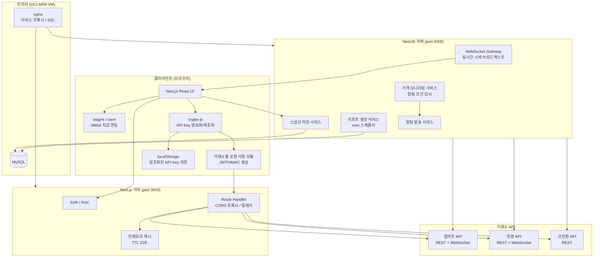

### 2.2 데이터 흐름 다이어그램

#### 2.2.1 인증이 필요한 거래소 API 호출 흐름 (포트폴리오 조회)

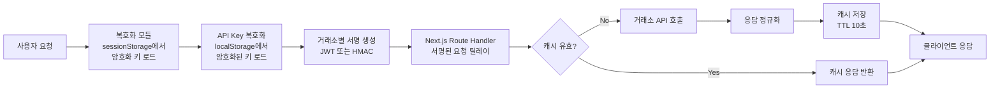

#### 2.2.2 실시간 시세 데이터 흐름

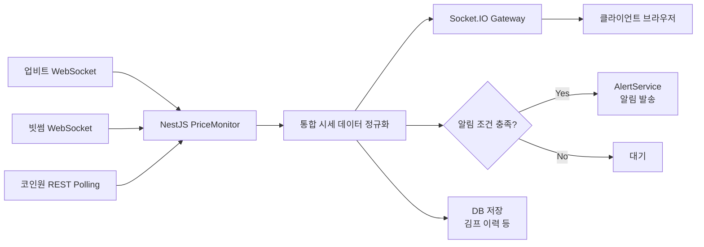

---

## 3. 컴포넌트 설계

### 3.1 클라이언트 컴포넌트

#### 3.1.1 WalletAuthManager (Web3 지갑 인증 관리)

- **책임**: Web3 지갑 연결, 세션 관리, 서명 요청
- **인터페이스**:
  ```typescript
  interface WalletAuthManager {
    connectWallet(): Promise<WalletConnection>;
    disconnectWallet(): void;
    signMessage(message: string): Promise<string>;
    getWalletAddress(): string | null;
    isConnected(): boolean;
    onAccountChanged(callback: (address: string) => void): void;
  }
  ```
- **의존성**: wagmi, viem, RainbowKit

#### 3.1.2 EncryptionService (API Key 암호화 서비스)

- **책임**: 지갑 서명 기반 암호화 키 도출, API Key AES 암호화/복호화
- **인터페이스**:
  ```typescript
  interface EncryptionService {
    deriveEncryptionKey(walletAddress: string, nonce: string, signFn: SignFunction): Promise<string>;
    encryptApiKey(apiKey: ApiKeyPair, encryptionKey: string): EncryptedApiKey;
    decryptApiKey(encryptedData: EncryptedApiKey, encryptionKey: string): ApiKeyPair;
    generateNonce(): string;
    storeEncryptedKey(exchange: ExchangeType, encryptedData: EncryptedApiKey, nonce: string): void;
    loadEncryptedKey(exchange: ExchangeType): { encryptedData: EncryptedApiKey; nonce: string } | null;
    removeEncryptedKey(exchange: ExchangeType): void;
    cacheEncryptionKey(key: string): void;  // sessionStorage 또는 메모리
    getCachedEncryptionKey(): string | null;
  }
  ```
- **의존성**: crypto-js, WalletAuthManager

#### 3.1.3 ExchangeSignerFactory (거래소 요청 서명 팩토리)

- **책임**: 거래소별 인증 방식에 따른 요청 서명 생성
- **인터페이스**:
  ```typescript
  interface ExchangeSigner {
    signRequest(params: SignRequestParams): Promise<SignedRequest>;
    validateApiKey(apiKey: ApiKeyPair): Promise<ApiKeyValidationResult>;
    getExchangeType(): ExchangeType;
  }

  interface ExchangeSignerFactory {
    createSigner(exchange: ExchangeType): ExchangeSigner;
  }

  // 업비트 서명: JWT (HS256/HS512) 토큰 생성
  // 빗썸 서명: JWT (HS256) 토큰 생성 (access_key, nonce, timestamp, query_hash)
  // 코인원 서명: HMAC-SHA512 (X-COINONE-PAYLOAD, X-COINONE-SIGNATURE)
  ```
- **의존성**: crypto-js, jsonwebtoken (브라우저용)

#### 3.1.4 PortfolioAggregator (포트폴리오 통합기)

- **책임**: 여러 거래소 데이터를 통합, 코인별 합산, 수익률 계산
- **인터페이스**:
  ```typescript
  interface PortfolioAggregator {
    aggregatePortfolios(portfolios: ExchangePortfolio[]): AggregatedPortfolio;
    calculateProfitLoss(holdings: Holding[], currentPrices: PriceMap): ProfitLossResult;
    getAssetDistribution(portfolio: AggregatedPortfolio): AssetDistribution;
    getCoinSummary(coin: string, portfolios: ExchangePortfolio[]): CoinSummary;
    sortHoldings(holdings: Holding[], criteria: SortCriteria): Holding[];
    filterHoldings(holdings: Holding[], filter: HoldingFilter): Holding[];
  }
  ```
- **의존성**: 없음 (순수 비즈니스 로직)

#### 3.1.5 ExchangeApiClient (거래소 API 클라이언트)

- **책임**: Next.js Route Handler를 통한 거래소 API 호출 관리
- **인터페이스**:
  ```typescript
  interface ExchangeApiClient {
    fetchBalance(exchange: ExchangeType, signedRequest: SignedRequest): Promise<ExchangeBalance>;
    fetchOrderHistory(exchange: ExchangeType, signedRequest: SignedRequest, params: OrderHistoryParams): Promise<OrderHistory>;
    fetchTicker(exchange: ExchangeType, symbol: string): Promise<Ticker>;
    fetchOrderbook(exchange: ExchangeType, symbol: string): Promise<Orderbook>;
  }
  ```
- **의존성**: TanStack Query, ExchangeSignerFactory

### 3.2 Next.js Route Handler 컴포넌트

#### 3.2.1 ExchangeProxyHandler (거래소 프록시 핸들러)

- **책임**: 클라이언트의 서명된 요청을 거래소 API로 릴레이, 응답 정규화, 캐싱
- **인터페이스**:
  ```typescript
  interface ExchangeProxyHandler {
    relayRequest(exchange: ExchangeType, signedRequest: SignedRequest): Promise<NormalizedResponse>;
    getCachedResponse(cacheKey: string): NormalizedResponse | null;
    setCachedResponse(cacheKey: string, response: NormalizedResponse, ttl: number): void;
  }
  ```
- **의존성**: 없음 (HTTP relay)

#### 3.2.2 RateLimiter (요청 제한기)

- **책임**: 거래소별 Rate Limit 준수, 지수 백오프 재시도
- **인터페이스**:
  ```typescript
  interface RateLimiter {
    acquireToken(exchange: ExchangeType): Promise<void>;
    isRateLimited(exchange: ExchangeType): boolean;
    retryWithBackoff<T>(fn: () => Promise<T>, maxRetries: number): Promise<T>;
  }
  ```
- **의존성**: 없음

#### 3.2.3 ResponseNormalizer (응답 정규화기)

- **책임**: 거래소별 상이한 응답 형식을 통일된 내부 데이터 모델로 변환
- **인터페이스**:
  ```typescript
  interface ResponseNormalizer {
    normalizeBalance(exchange: ExchangeType, rawResponse: unknown): NormalizedBalance;
    normalizeTicker(exchange: ExchangeType, rawResponse: unknown): NormalizedTicker;
    normalizeOrderbook(exchange: ExchangeType, rawResponse: unknown): NormalizedOrderbook;
    normalizeOrderHistory(exchange: ExchangeType, rawResponse: unknown): NormalizedOrderHistory;
  }
  ```
- **의존성**: 없음

### 3.3 NestJS 백엔드 컴포넌트

#### 3.3.1 PriceMonitorService (시세 모니터링 서비스)

- **책임**: 거래소 WebSocket/REST를 통한 실시간 시세 수신 및 관리
- **인터페이스**:
  ```typescript
  interface PriceMonitorService {
    startMonitoring(): void;
    stopMonitoring(): void;
    getCurrentPrice(exchange: ExchangeType, symbol: string): Price | null;
    getAllPrices(): PriceMap;
    subscribeToSymbol(symbol: string): void;
    unsubscribeFromSymbol(symbol: string): void;
    onPriceUpdate(callback: (update: PriceUpdate) => void): void;
  }
  ```
- **의존성**: 거래소 WebSocket 클라이언트

#### 3.3.2 WebSocketGateway (WebSocket 게이트웨이)

- **책임**: 클라이언트에 실시간 시세 데이터 브로드캐스트
- **인터페이스**:
  ```typescript
  interface RealtimeGateway {
    broadcastPrice(update: PriceUpdate): void;
    broadcastAlert(walletAddress: string, alert: AlertNotification): void;
    handleSubscription(client: Socket, symbols: string[]): void;
    handleUnsubscription(client: Socket, symbols: string[]): void;
  }
  ```
- **의존성**: Socket.IO, PriceMonitorService

#### 3.3.3 SnapshotService (스냅샷 서비스)

- **책임**: 클라이언트로부터 수신한 포트폴리오 스냅샷을 DB에 저장 및 조회
- **인터페이스**:
  ```typescript
  interface SnapshotService {
    saveSnapshot(walletAddress: string, snapshot: PortfolioSnapshot): Promise<void>;
    getSnapshots(walletAddress: string, period: TimePeriod): Promise<PortfolioSnapshot[]>;
    getLatestSnapshot(walletAddress: string): Promise<PortfolioSnapshot | null>;
    aggregateSnapshots(walletAddress: string, interval: AggregationInterval): Promise<AggregatedSnapshot[]>;
  }
  ```
- **의존성**: TypeORM, MySQL

#### 3.3.4 AlertService (알림 서비스)

- **책임**: 가격 알림 조건 관리, 조건 충족 시 알림 발송
- **인터페이스**:
  ```typescript
  interface AlertService {
    createAlert(walletAddress: string, config: AlertConfig): Promise<Alert>;
    updateAlert(alertId: string, config: Partial<AlertConfig>): Promise<Alert>;
    deleteAlert(alertId: string): Promise<void>;
    getAlerts(walletAddress: string): Promise<Alert[]>;
    getAlertHistory(walletAddress: string, limit: number): Promise<AlertHistory[]>;
    checkAlertConditions(priceUpdate: PriceUpdate): Promise<TriggeredAlert[]>;
    sendNotification(walletAddress: string, alert: TriggeredAlert): Promise<void>;
  }
  ```
- **의존성**: PriceMonitorService, WebSocketGateway, TypeORM

#### 3.3.5 ReportService (리포트 서비스)

- **책임**: 정기/수동 리포트 생성, 리포트 이력 관리
- **인터페이스**:
  ```typescript
  interface ReportService {
    generateReport(walletAddress: string, type: ReportType): Promise<Report>;
    scheduleReport(walletAddress: string, schedule: ReportSchedule): Promise<void>;
    cancelSchedule(walletAddress: string, scheduleId: string): Promise<void>;
    getReportHistory(walletAddress: string): Promise<Report[]>;
    exportData(walletAddress: string, format: ExportFormat, options: ExportOptions): Promise<Buffer>;
  }
  ```
- **의존성**: SnapshotService, TypeORM

#### 3.3.6 KimchiPremiumService (김치 프리미엄 서비스)

- **책임**: 거래소 간 시세 차이 계산, 이력 관리
- **인터페이스**:
  ```typescript
  interface KimchiPremiumService {
    calculatePremium(symbol: string): KimchiPremiumData;
    getPremiumHistory(symbol: string, period: TimePeriod): Promise<KimchiPremiumHistory[]>;
    getTopPremiumCoins(limit: number): KimchiPremiumData[];
    savePremiumSnapshot(): Promise<void>;
  }
  ```
- **의존성**: PriceMonitorService, TypeORM

---

## 4. 데이터 모델

### 4.1 핵심 데이터 구조 정의

```typescript
// ===== 공통 타입 =====

type ExchangeType = 'upbit' | 'bithumb' | 'coinone';

type Currency = 'KRW' | 'BTC' | 'USDT';

interface ApiKeyPair {
  accessKey: string;
  secretKey: string;
}

interface EncryptedApiKey {
  encryptedAccessKey: string;
  encryptedSecretKey: string;
  iv: string;  // AES 초기화 벡터
}

// ===== 지갑 / 인증 =====

interface WalletConnection {
  address: string;
  chainId: number;
  isConnected: boolean;
}

interface EncryptionKeyDerivation {
  walletAddress: string;
  nonce: string;           // crypto.randomUUID()
  signatureMessage: string; // "BitScope:encrypt:{address}:{nonce}"
  signature: string;        // personal_sign 결과
  derivedKey: string;       // SHA-256(signature)
}

// ===== 거래소 API 서명 =====

interface SignRequestParams {
  method: 'GET' | 'POST' | 'DELETE';
  endpoint: string;
  queryParams?: Record<string, string>;
  body?: Record<string, unknown>;
  apiKey: ApiKeyPair;
}

interface SignedRequest {
  url: string;
  method: string;
  headers: Record<string, string>;
  body?: string;
}

// ===== 포트폴리오 =====

interface Holding {
  exchange: ExchangeType;
  symbol: string;          // 예: "BTC", "ETH"
  currency: Currency;      // 마켓 통화
  balance: number;         // 보유 수량
  lockedBalance: number;   // 잠김 수량 (주문 중)
  avgBuyPrice: number;     // 매수 평균가
  currentPrice: number;    // 현재가
  evaluationAmount: number; // 평가 금액 (KRW)
  profitLoss: number;      // 손익 금액
  profitLossRate: number;  // 수익률 (%)
}

interface ExchangePortfolio {
  exchange: ExchangeType;
  holdings: Holding[];
  totalEvaluation: number;  // 총 평가금액 (KRW)
  totalInvestment: number;  // 총 투자금액 (KRW)
  totalProfitLoss: number;  // 총 손익
  profitLossRate: number;   // 총 수익률 (%)
  krwBalance: number;       // 원화 잔고
  lastUpdated: Date;
  status: 'connected' | 'error' | 'loading';
  errorMessage?: string;
}

interface AggregatedPortfolio {
  portfolios: ExchangePortfolio[];
  mergedHoldings: MergedHolding[];  // 코인별 통합
  totalEvaluation: number;
  totalInvestment: number;
  totalProfitLoss: number;
  profitLossRate: number;
  totalKrwBalance: number;
  lastUpdated: Date;
}

interface MergedHolding {
  symbol: string;
  totalBalance: number;
  weightedAvgBuyPrice: number;
  currentPrice: number;
  totalEvaluation: number;
  totalProfitLoss: number;
  profitLossRate: number;
  exchanges: {
    exchange: ExchangeType;
    balance: number;
    avgBuyPrice: number;
    evaluation: number;
    profitLoss: number;
    profitLossRate: number;
  }[];
}

// ===== 시세 =====

interface Ticker {
  exchange: ExchangeType;
  symbol: string;
  currentPrice: number;
  openPrice: number;
  highPrice: number;
  lowPrice: number;
  prevClosePrice: number;
  changeRate: number;       // 24시간 변동률 (%)
  changePrice: number;      // 24시간 변동 금액
  volume24h: number;        // 24시간 거래량
  volumeAmount24h: number;  // 24시간 거래금액 (KRW)
  timestamp: number;
}

interface Orderbook {
  exchange: ExchangeType;
  symbol: string;
  asks: OrderbookEntry[];  // 매도 호가
  bids: OrderbookEntry[];  // 매수 호가
  timestamp: number;
}

interface OrderbookEntry {
  price: number;
  quantity: number;
}

// ===== 김치 프리미엄 =====

interface KimchiPremiumData {
  symbol: string;
  prices: Record<ExchangeType, number>;
  maxPrice: { exchange: ExchangeType; price: number };
  minPrice: { exchange: ExchangeType; price: number };
  premiumAmount: number;    // 최대 - 최소 가격 차이
  premiumRate: number;      // 프리미엄 비율 (%)
  timestamp: number;
}

// ===== 알림 =====

type AlertCondition = 'above' | 'below' | 'premium_above' | 'premium_below';

interface AlertConfig {
  symbol: string;
  exchange?: ExchangeType;  // null이면 모든 거래소
  condition: AlertCondition;
  targetValue: number;      // 목표 가격 또는 프리미엄 (%)
  isActive: boolean;
}

interface Alert {
  id: string;
  walletAddress: string;
  config: AlertConfig;
  createdAt: Date;
  updatedAt: Date;
}

interface AlertHistory {
  id: string;
  alertId: string;
  triggeredAt: Date;
  triggeredValue: number;
  message: string;
}

// ===== 스냅샷 (DB 저장용) =====

interface PortfolioSnapshot {
  walletAddress: string;
  timestamp: Date;
  totalEvaluation: number;
  totalInvestment: number;
  totalProfitLoss: number;
  profitLossRate: number;
  holdings: SnapshotHolding[];
}

interface SnapshotHolding {
  symbol: string;
  exchange: ExchangeType;
  balance: number;
  avgBuyPrice: number;
  currentPrice: number;
  evaluation: number;
}

// ===== 리포트 =====

type ReportType = 'daily' | 'weekly' | 'monthly' | 'custom';
type ExportFormat = 'csv' | 'json' | 'pdf';

interface Report {
  id: string;
  walletAddress: string;
  type: ReportType;
  generatedAt: Date;
  periodStart: Date;
  periodEnd: Date;
  summary: ReportSummary;
  data: PortfolioSnapshot;
}

interface ReportSummary {
  totalEvaluation: number;
  evaluationChange: number;
  evaluationChangeRate: number;
  topGainers: { symbol: string; rate: number }[];
  topLosers: { symbol: string; rate: number }[];
  newCoins: string[];
  removedCoins: string[];
}

interface ReportSchedule {
  id: string;
  walletAddress: string;
  type: ReportType;
  isActive: boolean;
  nextRunAt: Date;
}

// ===== 워치리스트 =====

interface WatchlistItem {
  symbol: string;
  addedAt: Date;
  alertConfigs: AlertConfig[];
}
```

### 4.2 데이터 모델 다이어그램 (DB 엔티티)

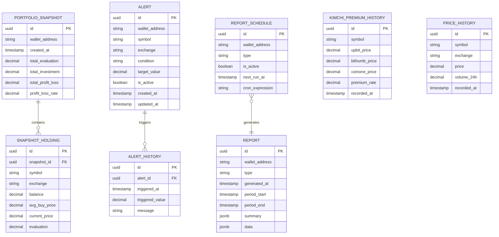

### 4.3 클라이언트 localStorage 데이터 구조

```typescript
// localStorage 키 구조
// 모든 사용자 데이터는 지갑 주소별로 분리 저장 (계정 간 데이터 격리)
// {addr} = 지갑 주소 (소문자, 예: "0x1234...abcd")
interface LocalStorageSchema {
  // 암호화된 API Key (지갑 주소 + 거래소별)
  'bitscope:{addr}:apikey:upbit': {
    encryptedAccessKey: string;
    encryptedSecretKey: string;
    iv: string;
    nonce: string;         // 서명 메시지용 nonce
    registeredAt: string;  // ISO 8601
  };
  'bitscope:{addr}:apikey:bithumb': { /* 동일 구조 */ };
  'bitscope:{addr}:apikey:coinone': { /* 동일 구조 */ };

  // 워치리스트 (지갑 주소별)
  'bitscope:{addr}:watchlist': WatchlistItem[];

  // 사용자 설정 (지갑 주소별)
  'bitscope:{addr}:settings': {
    theme: 'light' | 'dark' | 'system';
    language: 'ko' | 'en';
    refreshInterval: number;  // 초 단위 (기본 30)
    premiumThreshold: number; // 김프 알림 임계값 (%)
  };

  // 마지막 연결된 지갑 주소 (자동 재연결용, 공용)
  'bitscope:wallet:lastAddress': string;
}

// sessionStorage 키 구조 (탭 닫으면 삭제)
interface SessionStorageSchema {
  'bitscope:encryptionKey': string;  // AES 암호화 키 (지갑 서명에서 도출)
}
```

---

## 5. 비즈니스 프로세스

### 5.1 프로세스 1: Web3 지갑 연결 및 API Key 등록

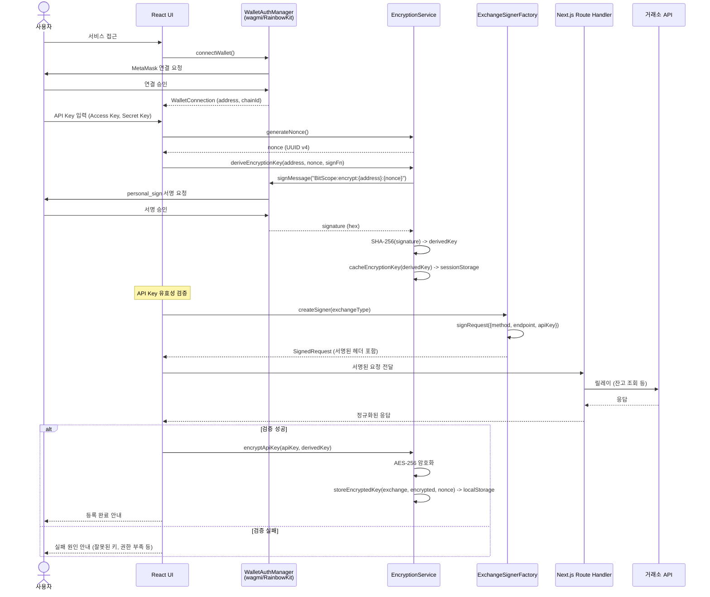

### 5.2 프로세스 2: 대시보드 포트폴리오 통합 조회

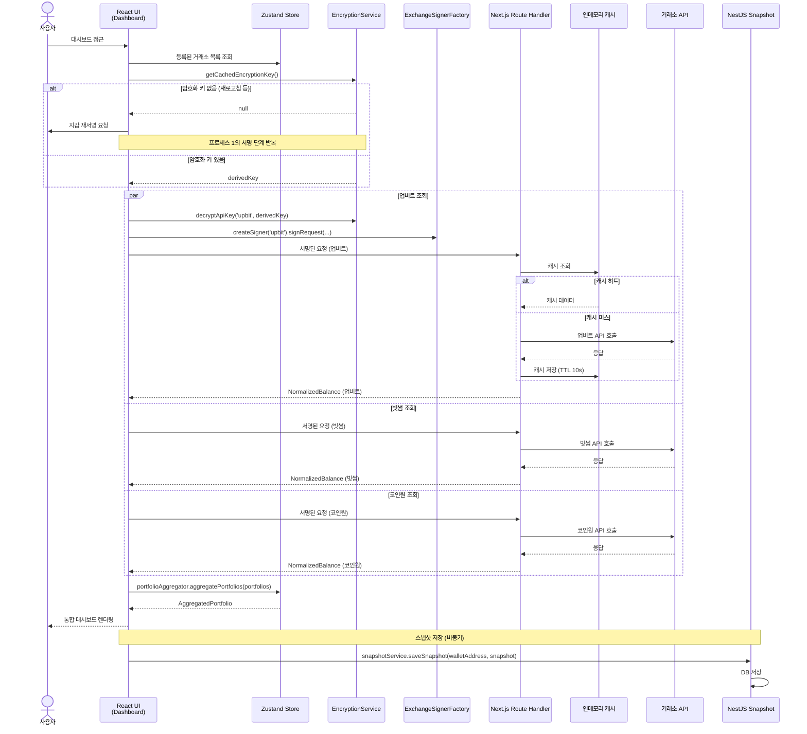

### 5.3 프로세스 3: 실시간 시세 및 김치 프리미엄 모니터링

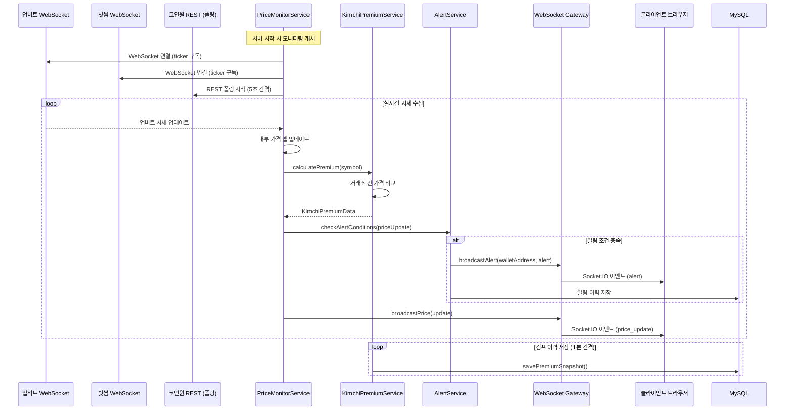

### 5.4 프로세스 4: 자동 새로고침 및 오류 처리

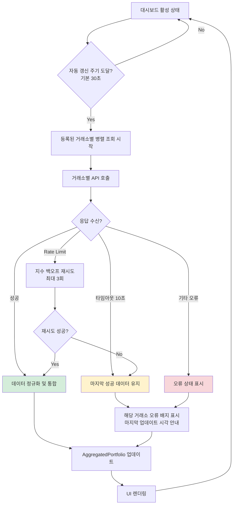

### 5.5 프로세스 5: 리포트 생성 및 데이터 내보내기

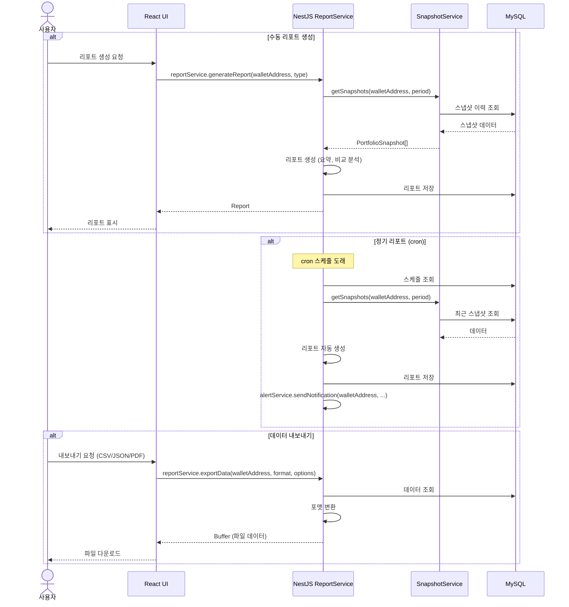

### 5.6 프로세스 6: 지갑 변경 시 처리 흐름

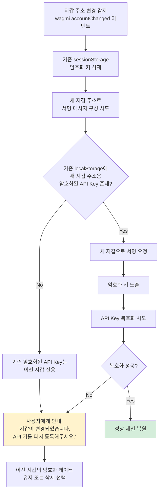

---

## 6. 오류 처리 전략

### 6.1 오류 분류 및 처리 방침

| 오류 유형 | 원인 | 처리 전략 | 사용자 안내 |
|-----------|------|-----------|-------------|
| **거래소 API 타임아웃** | 네트워크 지연, 거래소 과부하 | 10초 타임아웃, 마지막 캐시 데이터 반환 | "업비트 데이터가 지연되고 있습니다 (마지막 업데이트: HH:mm)" |
| **Rate Limit 초과** | 요청 빈도 초과 | 지수 백오프 재시도 (1s, 2s, 4s), 최대 3회 | 재시도 중 로딩 표시, 실패 시 대기 안내 |
| **잘못된 API Key** | 키 입력 오류, 만료 | 즉시 오류 반환, 재등록 유도 | "API 키가 유효하지 않습니다. 키를 확인해주세요." |
| **권한 부족** | Read-Only 외 권한 | 보안 경고 표시 | "Read-Only 권한의 API 키로 재발급해주세요." |
| **거래소 점검** | 거래소 서버 점검 | 마지막 캐시 데이터 반환 | "빗썸이 점검 중입니다. 마지막 데이터를 표시합니다." |
| **지갑 연결 해제** | MetaMask 잠금, 네트워크 변경 | 세션 유지하되 API 호출 중단 | "지갑 연결이 해제되었습니다. 다시 연결해주세요." |
| **복호화 실패** | 지갑 변경, localStorage 손상 | 재서명 또는 재등록 유도 | "API 키를 복호화할 수 없습니다. 지갑을 확인해주세요." |
| **WebSocket 연결 끊김** | 네트워크 불안정 | 자동 재연결 (최대 5회, 지수 백오프) | 재연결 중 표시, 실패 시 폴링 모드 전환 |
| **스냅샷 저장 실패** | NestJS/DB 오류 | 로컬 큐에 저장 후 재시도 | 백그라운드 처리, 사용자에게 알리지 않음 |

### 6.2 Graceful Degradation 전략

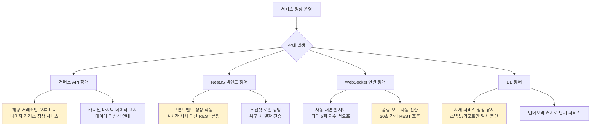

### 6.3 클라이언트 오류 복구 패턴

```typescript
// 오류 복구 인터페이스
interface ErrorRecoveryStrategy {
  // 재시도 가능 여부 판단
  isRetryable(error: ExchangeApiError): boolean;

  // 지수 백오프 재시도
  retryWithBackoff<T>(
    fn: () => Promise<T>,
    options: {
      maxRetries: number;
      baseDelay: number;    // ms
      maxDelay: number;     // ms
      onRetry?: (attempt: number, error: Error) => void;
    }
  ): Promise<T>;

  // 폴백 데이터 제공
  getFallbackData(exchange: ExchangeType): CachedExchangeData | null;

  // 오류 상태 관리
  reportError(exchange: ExchangeType, error: ExchangeApiError): void;
  clearError(exchange: ExchangeType): void;
  getErrorState(exchange: ExchangeType): ErrorState | null;
}
```

---

## 7. 테스팅 전략

### 7.1 테스트 피라미드

```
        /  E2E  \           ← Playwright: 핵심 시나리오 (지갑 연결, 대시보드 조회)
       / 통합 테스트 \       ← Route Handler + 모의 거래소 API, NestJS 서비스 통합
      /   단위 테스트   \    ← 각 컴포넌트/서비스의 비즈니스 로직
     /  정적 분석/타입   \   ← TypeScript strict, ESLint, Prettier
```

### 7.2 단위 테스트

| 대상 컴포넌트 | 테스트 항목 | 도구 |
|--------------|------------|------|
| **EncryptionService** | 암호화/복호화 대칭성, nonce 고유성, 키 도출 결정론적 검증 | Vitest |
| **ExchangeSignerFactory** | 업비트 JWT 생성 검증, 빗썸 JWT 검증, 코인원 HMAC-SHA512 검증 | Vitest |
| **PortfolioAggregator** | 코인별 통합, 가중평균 계산, 수익률 정확성, 정렬/필터링 | Vitest |
| **ResponseNormalizer** | 거래소별 응답 파싱, 에지 케이스 (빈 잔고, 특수 코인) | Vitest |
| **RateLimiter** | 토큰 버킷 동작, 지수 백오프 타이밍 | Vitest |
| **KimchiPremiumService** | 프리미엄 계산 정확성, 이력 집계 | Jest (NestJS) |
| **AlertService** | 조건 매칭 로직, 알림 중복 방지 | Jest (NestJS) |

### 7.3 통합 테스트

| 테스트 시나리오 | 범위 | 도구 |
|---------------|------|------|
| Route Handler 프록시 동작 | 서명된 요청 릴레이 → 모의 거래소 → 정규화 응답 | Vitest + MSW |
| 캐시 동작 검증 | 캐시 히트/미스, TTL 만료 | Vitest |
| NestJS WebSocket 브로드캐스트 | 시세 수신 → 게이트웨이 → 클라이언트 | Jest + socket.io-client |
| 스냅샷 저장/조회 | API → Service → Repository → DB | Jest + TestContainers |
| 알림 파이프라인 | 시세 변동 → 조건 매칭 → 알림 발송 | Jest |

### 7.4 E2E 테스트

| 시나리오 | 검증 항목 |
|---------|----------|
| 지갑 연결 → API Key 등록 → 대시보드 조회 | 전체 플로우 정상 동작 |
| 복수 거래소 등록 → 통합 포트폴리오 표시 | 데이터 통합 정확성 |
| 거래소 오류 시 Graceful Degradation | 부분 장애 시 나머지 정상 표시 |
| 반응형 레이아웃 (모바일/데스크톱) | 화면 크기별 UI 적응 |
| 다크/라이트 모드 전환 | 테마 즉시 적용 |

### 7.5 모의 데이터 전략

- **개발/테스트용 모의 거래소 서버**: MSW(Mock Service Worker)로 거래소 API 응답 모사
- **데모 모드**: API Key 미등록 사용자에게 고정 모의 데이터로 서비스 체험 제공
- **Fixture 데이터**: 각 거래소 실제 응답 구조를 기반으로 한 JSON fixture 파일 관리

---

## 8. 프로젝트 구조

```
bit-scope/
├── apps/
│   ├── web/                          # Next.js 프론트엔드
│   │   ├── app/
│   │   │   ├── (auth)/               # 인증 관련 페이지
│   │   │   │   └── connect/          # 지갑 연결 페이지
│   │   │   ├── (dashboard)/          # 대시보드 레이아웃
│   │   │   │   ├── page.tsx          # 통합 포트폴리오 대시보드
│   │   │   │   ├── premium/          # 김치 프리미엄 분석
│   │   │   │   ├── market/           # 마켓 시세
│   │   │   │   ├── analytics/        # 성과 분석
│   │   │   │   ├── alerts/           # 알림 관리
│   │   │   │   ├── reports/          # 리포트 및 내보내기
│   │   │   │   ├── watchlist/        # 워치리스트
│   │   │   │   └── settings/         # API Key 관리 / 설정
│   │   │   ├── api/                  # Route Handler (CORS 프록시)
│   │   │   │   └── exchange/
│   │   │   │       ├── [exchange]/
│   │   │   │       │   ├── balance/route.ts
│   │   │   │       │   ├── ticker/route.ts
│   │   │   │       │   ├── orderbook/route.ts
│   │   │   │       │   └── orders/route.ts
│   │   │   │       └── _lib/
│   │   │   │           ├── proxy.ts
│   │   │   │           ├── cache.ts
│   │   │   │           ├── rate-limiter.ts
│   │   │   │           └── normalizer/
│   │   │   │               ├── index.ts
│   │   │   │               ├── upbit.ts
│   │   │   │               ├── bithumb.ts
│   │   │   │               └── coinone.ts
│   │   │   ├── layout.tsx
│   │   │   └── providers.tsx         # wagmi, QueryClient 등 Provider
│   │   ├── lib/
│   │   │   ├── exchange/             # 거래소별 서명 모듈
│   │   │   │   ├── signer-factory.ts
│   │   │   │   ├── upbit-signer.ts
│   │   │   │   ├── bithumb-signer.ts
│   │   │   │   └── coinone-signer.ts
│   │   │   ├── crypto/              # 암호화 모듈
│   │   │   │   ├── encryption-service.ts
│   │   │   │   └── key-derivation.ts
│   │   │   ├── portfolio/           # 포트폴리오 로직
│   │   │   │   ├── aggregator.ts
│   │   │   │   └── calculator.ts
│   │   │   ├── api-client.ts        # 거래소 API 클라이언트
│   │   │   ├── wallet.ts            # wagmi 설정
│   │   │   └── constants.ts
│   │   ├── hooks/                   # 커스텀 React Hooks
│   │   │   ├── useWalletAuth.ts
│   │   │   ├── usePortfolio.ts
│   │   │   ├── useExchangeApi.ts
│   │   │   ├── useRealTimePrice.ts
│   │   │   ├── useKimchiPremium.ts
│   │   │   └── useAlerts.ts
│   │   ├── store/                   # Zustand 상태 관리
│   │   │   ├── portfolio-store.ts
│   │   │   ├── price-store.ts
│   │   │   └── settings-store.ts
│   │   └── components/
│   │       ├── ui/                  # shadcn/ui 기반 기본 컴포넌트
│   │       ├── dashboard/           # 대시보드 전용 컴포넌트
│   │       ├── charts/              # 차트 컴포넌트
│   │       ├── exchange/            # 거래소 관련 컴포넌트
│   │       └── layout/              # 레이아웃 컴포넌트
│   │
│   └── api/                         # NestJS 백엔드
│       ├── src/
│       │   ├── modules/
│       │   │   ├── price/           # 시세 모니터링
│       │   │   │   ├── price.module.ts
│       │   │   │   ├── price-monitor.service.ts
│       │   │   │   ├── exchange-ws/
│       │   │   │   │   ├── upbit-ws.client.ts
│       │   │   │   │   ├── bithumb-ws.client.ts
│       │   │   │   │   └── coinone-polling.client.ts
│       │   │   │   └── price.gateway.ts    # Socket.IO Gateway
│       │   │   ├── snapshot/        # 포트폴리오 스냅샷
│       │   │   │   ├── snapshot.module.ts
│       │   │   │   ├── snapshot.service.ts
│       │   │   │   ├── snapshot.controller.ts
│       │   │   │   └── entities/
│       │   │   ├── alert/           # 알림
│       │   │   │   ├── alert.module.ts
│       │   │   │   ├── alert.service.ts
│       │   │   │   ├── alert.controller.ts
│       │   │   │   └── entities/
│       │   │   ├── report/          # 리포트
│       │   │   │   ├── report.module.ts
│       │   │   │   ├── report.service.ts
│       │   │   │   ├── report.controller.ts
│       │   │   │   └── entities/
│       │   │   └── premium/         # 김치 프리미엄
│       │   │       ├── premium.module.ts
│       │   │       ├── premium.service.ts
│       │   │       └── entities/
│       │   ├── common/
│       │   │   ├── decorators/
│       │   │   ├── filters/
│       │   │   ├── guards/
│       │   │   └── interceptors/
│       │   ├── app.module.ts
│       │   └── main.ts
│       └── test/
│
├── packages/
│   └── shared/                      # 공유 패키지
│       ├── src/
│       │   ├── types/               # 공유 타입 정의
│       │   │   ├── exchange.ts
│       │   │   ├── portfolio.ts
│       │   │   ├── ticker.ts
│       │   │   ├── alert.ts
│       │   │   └── report.ts
│       │   ├── constants/           # 공유 상수
│       │   │   ├── exchanges.ts
│       │   │   └── symbols.ts
│       │   └── utils/               # 공유 유틸리티
│       │       ├── format.ts        # 숫자/통화 포맷
│       │       └── validation.ts
│       └── package.json
│
├── turbo.json
├── pnpm-workspace.yaml
├── package.json
└── .github/
    └── workflows/
        └── deploy.yml               # CI/CD 파이프라인
```

---

## 9. 설계 결정 사항 및 근거

### 9.1 클라이언트 사이드 서명 아키텍처 선택

- **결정**: API Key 원문을 서버에 전송하지 않고 클라이언트에서 직접 거래소별 서명을 생성
- **근거**: 서버 침해 시에도 API Key 유출이 불가능하여 보안 수준이 극대화됨. 단, 클라이언트에서의 서명 생성은 자바스크립트로 구현해야 하므로 각 거래소 인증 방식별 브라우저 호환 라이브러리 필요
- **트레이드오프**: 서버에서 자동으로 데이터를 수집할 수 없어, 포트폴리오 스냅샷은 사용자 접속 시에만 축적됨

### 9.2 crypto-js 사용 (Web Crypto API 대신)

- **결정**: AES 암호화에 crypto-js 라이브러리를 사용
- **근거**: 요구사항에 명시된 대로 HTTPS 없이도 동작 가능해야 하며, Web Crypto API는 Secure Context(HTTPS)에서만 사용 가능. 초기 IP + HTTP 환경에서도 동작해야 하므로 crypto-js를 채택
- **트레이드오프**: crypto-js는 Web Crypto API보다 성능이 낮고 감사 이력이 부족하지만, HTTP 환경 호환성을 확보할 수 있음. 향후 HTTPS 전환 후 Web Crypto API로 마이그레이션 고려 가능

### 9.3 sessionStorage 기반 암호화 키 캐싱

- **결정**: 지갑 서명에서 도출된 암호화 키를 sessionStorage에 저장 (메모리 대신)
- **근거**: JS 메모리 저장은 가장 안전하지만 페이지 새로고침 시 매번 재서명이 필요하여 사용성이 크게 저하됨. sessionStorage는 탭 닫기 시 자동 삭제되므로 보안과 편의성의 적절한 균형점
- **트레이드오프**: XSS 공격 시 sessionStorage의 키가 노출될 수 있으나, XSS 자체를 CSP 및 입력 검증으로 방어

### 9.4 NestJS의 역할 분리

- **결정**: NestJS는 공개 시세 데이터 처리, 스냅샷 저장, 알림, 리포트 등 백그라운드 서비스에만 집중
- **근거**: 인증이 필요한 거래소 API 호출은 클라이언트 서명 → Next.js 릴레이 경로를 사용하고, NestJS는 API Key가 불필요한 공개 데이터 기반 서비스만 담당. 이를 통해 역할이 명확히 분리됨
- **트레이드오프**: 두 서버를 운영해야 하지만, OCI 단일 VM에서 Docker Compose로 함께 관리 가능

### 9.5 Socket.IO 선택 (native WebSocket 대신)

- **결정**: NestJS-클라이언트 간 실시간 통신에 Socket.IO 사용
- **근거**: NestJS에 내장된 WebSocket 게이트웨이가 Socket.IO를 지원하며, 자동 재연결, 네임스페이스, 룸 기능 등이 내장되어 있어 안정적인 실시간 통신 구현이 용이
- **트레이드오프**: Socket.IO는 네이티브 WebSocket 대비 약간의 오버헤드가 있으나, 안정성과 개발 생산성 이점이 큼

### 9.6 거래소 어댑터 패턴

- **결정**: ExchangeSignerFactory, ResponseNormalizer 등 거래소별 어댑터 패턴 적용
- **근거**: 향후 해외 거래소(바이낸스 등) 추가 시 기존 코드 변경 없이 새로운 어댑터만 추가하면 됨. OCP(Open-Closed Principle) 준수
- **트레이드오프**: 초기 추상화 비용이 발생하지만 장기적 유지보수성이 크게 향상됨
