# BitScope 구현 계획

## 개요

이 문서는 BitScope(한국 암호화폐 거래소 포트폴리오 통합 조회 웹 서비스)의 코드 구현 태스크를 정의한다. 각 태스크는 테스트 주도 방식으로 점진적으로 구현하며, 이전 태스크의 결과 위에 빌드된다.

---

- [x] 1. 모노레포 프로젝트 초기 설정
  - Turborepo + pnpm 워크스페이스 구조 설정 (`turbo.json`, `pnpm-workspace.yaml`, 루트 `package.json`)
  - `apps/web` (Next.js 15 App Router + TypeScript) 앱 생성 및 초기 설정
  - `apps/api` (NestJS 10 + TypeScript) 앱 생성 및 초기 설정
  - `packages/shared` 공유 패키지 생성 (TypeScript 빌드 설정)
  - 루트 ESLint, Prettier, TypeScript strict 설정 공유
  - Vitest(web), Jest(api) 테스트 러너 설정 및 샘플 테스트 작성하여 통과 확인
  - _요구사항: NF2.3, NF2.5_

- [ ] 2. 공유 타입 및 상수 정의
- [x] 2.1 핵심 공유 타입 정의
  - `packages/shared/src/types/exchange.ts`: `ExchangeType`, `ApiKeyPair`, `EncryptedApiKey`, `SignRequestParams`, `SignedRequest` 타입 정의
  - `packages/shared/src/types/portfolio.ts`: `Holding`, `ExchangePortfolio`, `AggregatedPortfolio`, `MergedHolding` 타입 정의
  - `packages/shared/src/types/ticker.ts`: `Ticker`, `Orderbook`, `OrderbookEntry`, `KimchiPremiumData` 타입 정의
  - `packages/shared/src/types/alert.ts`: `AlertCondition`, `AlertConfig`, `Alert`, `AlertHistory` 타입 정의
  - `packages/shared/src/types/report.ts`: `PortfolioSnapshot`, `SnapshotHolding`, `Report`, `ReportSummary`, `ReportSchedule`, `ReportType`, `ExportFormat` 타입 정의
  - `packages/shared/src/types/wallet.ts`: `WalletConnection`, `EncryptionKeyDerivation` 타입 정의
  - `packages/shared/src/types/watchlist.ts`: `WatchlistItem` 타입 정의
  - 배럴 export 파일(`packages/shared/src/types/index.ts`) 작성
  - _요구사항: NF2.1, NF2.2_

- [x] 2.2 공유 상수 및 유틸리티 정의
  - `packages/shared/src/constants/exchanges.ts`: 거래소별 API 엔드포인트, Rate Limit 설정, WebSocket URL 등 상수 정의
  - `packages/shared/src/constants/symbols.ts`: 주요 코인 심볼 목록, 기본 마켓 코인 등 상수 정의
  - `packages/shared/src/utils/format.ts`: 숫자/통화 포맷 함수 구현 (천 단위 구분, 소수점, KRW/USD 포맷) + 단위 테스트
  - `packages/shared/src/utils/validation.ts`: API Key 형식 유효성 검증 유틸리티 + 단위 테스트
  - _요구사항: 9.7, 9.8, NF5.2_

- [ ] 3. Web3 지갑 인증 시스템 구현
- [x] 3.1 wagmi/RainbowKit 설정 및 WalletAuthManager 구현
  - `apps/web/lib/wallet.ts`: wagmi v2 + viem + RainbowKit 설정 (체인 설정, 커넥터)
  - `apps/web/app/providers.tsx`: WagmiProvider, QueryClientProvider, RainbowKitProvider 래핑
  - `apps/web/hooks/useWalletAuth.ts`: 지갑 연결/해제, 주소 조회, 계정 변경 이벤트 처리 훅 구현
  - MetaMask 미설치 시 설치 안내 로직 포함
  - 지갑 연결 상태 관리 단위 테스트 작성
  - _요구사항: 8.1, 8.2, 8.3_

- [x] 3.2 EncryptionService 구현 (지갑 서명 기반 API Key 암호화)
  - `apps/web/lib/crypto/key-derivation.ts`: nonce 생성(`crypto.randomUUID()`), 서명 메시지 구성(`"BitScope:encrypt:{address}:{nonce}"`), `personal_sign` 요청, SHA-256 해시 → AES 암호화 키 도출 구현
  - `apps/web/lib/crypto/encryption-service.ts`: AES-256 암호화/복호화(crypto-js), localStorage 저장/로드/삭제, sessionStorage 기반 암호화 키 캐싱 구현
  - 지갑 주소별 localStorage 키 분리 (`bitscope:{addr}:apikey:{exchange}`)
  - 암호화/복호화 대칭성, nonce 고유성, 키 도출 결정론적 검증 단위 테스트 작성
  - _요구사항: 1.4, 8.4, 8.5, 8.6, 8.7, 8.8, 8.9, 8.10, 8.11_

- [x] 3.3 지갑 변경 시 처리 로직 구현
  - `useWalletAuth` 훅에 `accountChanged` 이벤트 감지 → 기존 sessionStorage 키 삭제, 새 지갑 주소 기반 암호화 데이터 존재 여부 확인 로직 추가
  - 복호화 불가 시 사용자 안내("API 키를 다시 등록해주세요") 메시지 처리
  - 지갑 변경 시나리오 단위 테스트 작성
  - _요구사항: 8.12, 8.13_

- [ ] 4. 거래소 요청 서명 모듈 구현
- [x] 4.1 업비트 서명 모듈 (UpbitSigner)
  - `apps/web/lib/exchange/upbit-signer.ts`: 업비트 JWT(HS256/HS512) 토큰 생성, query_hash(SHA512) 포함, nonce/timestamp 기반 서명 구현
  - `validateApiKey()`: 업비트 잔고 조회 API를 통한 키 유효성 검증
  - 생성된 JWT 토큰 구조 및 서명 정확성 단위 테스트 작성
  - _요구사항: 12.1, 8.17_

- [x] 4.2 빗썸 서명 모듈 (BithumbSigner)
  - `apps/web/lib/exchange/bithumb-signer.ts`: 빗썸 JWT(HS256) 토큰 생성 (access_key, nonce, timestamp, query_hash), HMAC 서명 구현
  - `validateApiKey()`: 빗썸 잔고 조회 API를 통한 키 유효성 검증
  - 서명 정확성 단위 테스트 작성
  - _요구사항: 12.1, 8.17_

- [x] 4.3 코인원 서명 모듈 (CoinoneSigner)
  - `apps/web/lib/exchange/coinone-signer.ts`: 코인원 HMAC-SHA512 서명 (X-COINONE-PAYLOAD, X-COINONE-SIGNATURE) 구현
  - `validateApiKey()`: 코인원 잔고 조회 API를 통한 키 유효성 검증
  - 서명 정확성 단위 테스트 작성
  - _요구사항: 12.1, 8.17_

- [x] 4.4 ExchangeSignerFactory 통합
  - `apps/web/lib/exchange/signer-factory.ts`: `ExchangeType`에 따라 적절한 Signer 인스턴스를 반환하는 팩토리 패턴 구현
  - 팩토리가 올바른 Signer를 반환하는지 단위 테스트 작성
  - _요구사항: NF2.1_

- [ ] 5. Next.js Route Handler (CORS 프록시) 구현
- [x] 5.1 프록시 핸들러 및 캐시 구현
  - `apps/web/app/api/exchange/_lib/cache.ts`: TTL 기반 인메모리 캐시 구현 (기본 TTL 10초)
  - `apps/web/app/api/exchange/_lib/rate-limiter.ts`: 거래소별 Rate Limit 관리, 지수 백오프 재시도(최대 3회, 1s→2s→4s) 구현
  - `apps/web/app/api/exchange/_lib/proxy.ts`: 서명된 요청 릴레이 함수, 타임아웃(10초) 처리 구현
  - 캐시 히트/미스, TTL 만료 단위 테스트 작성
  - Rate Limiter 토큰 버킷 동작, 지수 백오프 타이밍 단위 테스트 작성
  - _요구사항: 12.3, 12.5, 12.6, 12.7, 12.8, NF1.2, NF1.4_

- [x] 5.2 응답 정규화기(ResponseNormalizer) 구현
  - `apps/web/app/api/exchange/_lib/normalizer/upbit.ts`: 업비트 API 응답 → 통일 데이터 모델 변환
  - `apps/web/app/api/exchange/_lib/normalizer/bithumb.ts`: 빗썸 API 응답 → 통일 데이터 모델 변환
  - `apps/web/app/api/exchange/_lib/normalizer/coinone.ts`: 코인원 API 응답 → 통일 데이터 모델 변환
  - `apps/web/app/api/exchange/_lib/normalizer/index.ts`: `ExchangeType`에 따른 디스패치 함수
  - 각 거래소 실제 응답 fixture 기반 정규화 단위 테스트 작성 (빈 잔고, 특수 코인 에지 케이스 포함)
  - _요구사항: 12.4_

- [x] 5.3 Route Handler 엔드포인트 구현
  - `apps/web/app/api/exchange/[exchange]/balance/route.ts`: 잔고 조회 릴레이 핸들러
  - `apps/web/app/api/exchange/[exchange]/ticker/route.ts`: 시세 조회 릴레이 핸들러
  - `apps/web/app/api/exchange/[exchange]/orderbook/route.ts`: 호가 조회 릴레이 핸들러
  - `apps/web/app/api/exchange/[exchange]/orders/route.ts`: 주문 내역 조회 릴레이 핸들러
  - MSW(Mock Service Worker)로 거래소 API 모의하여 Route Handler 통합 테스트 작성
  - _요구사항: 12.2, 12.3, 8.15, 8.16_

- [ ] 6. 거래소 API 클라이언트 및 포트폴리오 로직 구현
- [x] 6.1 ExchangeApiClient 구현
  - `apps/web/lib/api-client.ts`: TanStack Query 기반 거래소 API 클라이언트 (fetchBalance, fetchTicker, fetchOrderbook, fetchOrderHistory)
  - 서명 생성 → Route Handler 호출 → 응답 처리 파이프라인 통합
  - `apps/web/hooks/useExchangeApi.ts`: React Query 훅으로 래핑 (자동 갱신 주기 30초, 수동 새로고침, 로딩/에러 상태 관리)
  - 병렬 API 호출 구현 (여러 거래소 동시 조회)
  - _요구사항: 2.4, 2.5, 2.11, NF1.3_

- [x] 6.2 PortfolioAggregator 구현
  - `apps/web/lib/portfolio/aggregator.ts`: 여러 거래소 포트폴리오 통합, 코인별 합산(MergedHolding), 가중 평균 매수가 계산 구현
  - `apps/web/lib/portfolio/calculator.ts`: 수익률 계산, 자산 분포 비율 계산, 총 평가금액/투자금액/손익 산출 구현
  - 정렬(평가금액, 수익률, 코인명) 및 필터링(거래소별, 수익/손실) 기능 구현
  - 코인별 통합, 가중평균 정확성, 수익률 계산 단위 테스트 작성
  - _요구사항: 2.1, 2.2, 2.3, 2.9, 2.10_

- [x] 6.3 오류 복구 및 Graceful Degradation 구현
  - `apps/web/lib/error-recovery.ts`: `ErrorRecoveryStrategy` 구현 (재시도 가능 여부 판단, 지수 백오프 재시도, 폴백 데이터 제공, 오류 상태 관리)
  - 특정 거래소 오류 시 나머지 거래소 정상 표시, 마지막 성공 데이터 유지 로직
  - 스냅샷 저장 실패 시 로컬 큐잉 및 재시도 로직
  - 다양한 오류 시나리오(타임아웃, Rate Limit, 키 오류, 거래소 점검) 단위 테스트 작성
  - _요구사항: 2.6, NF3.1, NF3.2, NF3.3_

- [ ] 7. 기본 UI 레이아웃 및 테마 시스템 구현
- [x] 7.1 UI 기본 프레임워크 및 테마 설정
  - Tailwind CSS, shadcn/ui 설치 및 설정
  - 다크/라이트/시스템 테마 전환 구현 (시스템 설정 감지 포함)
  - `apps/web/app/layout.tsx`: HTML lang, 메타데이터, 폰트, Provider 구성
  - 숫자 포맷 컴포넌트 (천 단위 구분, 소수점, 통화 기호, 수익 녹색/손실 빨간색 색상 구분)
  - _요구사항: 9.3, 9.4, 9.7, 9.8_

- [x] 7.2 반응형 레이아웃 컴포넌트 구현
  - `apps/web/components/layout/`: 사이드바 네비게이션(데스크톱), 하단 탭 네비게이션(모바일) 구현
  - 반응형 브레이크포인트 설정 (768px 이하 모바일, 1024px 이상 데스크톱)
  - 스켈레톤 UI / 로딩 인디케이터 공통 컴포넌트 구현
  - 사용자 친화적 오류 메시지 + 재시도 버튼 공통 컴포넌트 구현
  - WCAG 2.1 AA 접근성 준수 (ARIA 레이블, 키보드 네비게이션)
  - _요구사항: 9.1, 9.2, 9.5, 9.6, NF4.1, NF4.2_

- [x] 7.3 국제화(i18n) 기반 구조 설정
  - 한국어/영어 텍스트 리소스 분리 구조 설정
  - 언어 전환 기능 구현
  - `apps/web/store/settings-store.ts`: Zustand 기반 사용자 설정 저장소 (테마, 언어, 새로고침 주기 등)
  - _요구사항: 9.9, NF5.1_

- [ ] 8. 지갑 연결 및 API Key 등록 페이지 구현
- [x] 8.1 지갑 연결 페이지 구현
  - `apps/web/app/(auth)/connect/page.tsx`: RainbowKit ConnectButton 통합, MetaMask 미설치 시 안내
  - 연결 완료 후 대시보드로 리다이렉트 로직
  - 지갑 미연결 시 보호된 라우트 가드 구현
  - _요구사항: 8.1, 8.2, 8.3_

- [x] 8.2 API Key 등록/관리 페이지 구현
  - `apps/web/app/(dashboard)/settings/page.tsx`: 업비트/빗썸/코인원 API 키 입력 폼 (Access Key, Secret Key)
  - API 키 등록 시 유효성 검증 흐름 (지갑 서명 → 암호화 키 도출 → 거래소 API 호출 → 암호화 저장)
  - Read-Only 권한이 아닌 키 등록 시 보안 경고 표시 및 재발급 안내
  - Secret Key 마스킹 표시 (`****abcd`)
  - 등록된 API 키 목록 조회 (거래소명, 등록일, 연결 상태)
  - API 키 삭제 기능 (관련 데이터 즉시 삭제)
  - 거래소별 API 키 발급 가이드 링크/안내 제공
  - _요구사항: 1.1, 1.2, 1.3, 1.4, 1.5, 1.6, 1.7, 1.8, 1.9_

- [ ] 9. 통합 포트폴리오 대시보드 구현
- [x] 9.1 대시보드 메인 페이지 구현
  - `apps/web/app/(dashboard)/page.tsx`: 총 평가금액, 총 투자금액, 총 손익, 총 수익률 요약 카드
  - `apps/web/store/portfolio-store.ts`: Zustand 포트폴리오 상태 관리 (거래소별 로딩 상태 분리)
  - `apps/web/hooks/usePortfolio.ts`: 등록된 거래소 병렬 조회 → 통합 → 상태 업데이트 훅
  - 거래소별 보유 코인 테이블 (코인명, 수량, 매수 평균가, 현재가, 평가금액, 수익률)
  - 동일 코인 다중 거래소 보유 시 통합 보유 현황 + 거래소별 개별 내역 표시
  - 자동 갱신 (기본 30초) 및 수동 새로고침 버튼
  - 거래소별 로딩 상태 개별 표시
  - 정렬(평가금액, 수익률, 코인명) 및 필터(거래소별, 수익/손실) 기능
  - _요구사항: 2.1, 2.2, 2.3, 2.4, 2.5, 2.6, 2.8, 2.9, 2.10, 2.11_

- [x] 9.2 자산 분포 차트 구현
  - `apps/web/components/charts/`: Recharts 기반 도넛/파이 차트 컴포넌트
  - 코인별 비중 차트, 거래소별 비중 차트 구현
  - _요구사항: 2.7_

- [ ] 10. NestJS 백엔드 기본 인프라 구현
- [x] 10.1 NestJS 프로젝트 구조 및 DB 설정
  - TypeORM + MySQL 연결 설정
  - DB 엔티티 정의: `PortfolioSnapshot`, `SnapshotHolding`, `Alert`, `AlertHistory`, `Report`, `ReportSchedule`, `KimchiPremiumHistory`, `PriceHistory`
  - TypeORM 마이그레이션 설정 및 초기 마이그레이션 생성
  - 공통 모듈 설정 (글로벌 예외 필터, 인터셉터, 로깅)
  - _요구사항: NF2.3_

- [x] 10.2 포트폴리오 스냅샷 API 구현
  - `apps/api/src/modules/snapshot/`: 스냅샷 모듈, 서비스, 컨트롤러, 엔티티 구현
  - `POST /snapshots`: 클라이언트가 전송한 포트폴리오 스냅샷 DB 저장 API
  - `GET /snapshots/:walletAddress`: 기간별 스냅샷 조회 API (일/주/월)
  - `GET /snapshots/:walletAddress/latest`: 최신 스냅샷 조회 API
  - 스냅샷 저장/조회 통합 테스트 작성 (TestContainers 또는 인메모리 DB)
  - _요구사항: 4.9, 4.10, 12.12, 12.14, 12.15_

- [x] 10.3 대시보드에서 스냅샷 전송 연동
  - 대시보드 포트폴리오 조회 완료 시 NestJS에 스냅샷 비동기 전송 로직 추가 (`apps/web/hooks/usePortfolio.ts`)
  - 전송 실패 시 로컬 큐잉 및 다음 접속 시 재시도
  - _요구사항: 4.9, 12.14, 12.15_

- [ ] 11. 실시간 시세 시스템 구현
- [x] 11.1 NestJS 거래소 WebSocket/REST 클라이언트 구현
  - `apps/api/src/modules/price/exchange-ws/upbit-ws.client.ts`: 업비트 WebSocket 연결 및 실시간 시세 수신
  - `apps/api/src/modules/price/exchange-ws/bithumb-ws.client.ts`: 빗썸 WebSocket 연결 및 실시간 시세 수신
  - `apps/api/src/modules/price/exchange-ws/coinone-polling.client.ts`: 코인원 REST 폴링 (5초 간격) 구현
  - WebSocket 자동 재연결 로직 (최대 5회, 지수 백오프)
  - _요구사항: 12.9, 6.6_

- [x] 11.2 PriceMonitorService 및 WebSocket Gateway 구현
  - `apps/api/src/modules/price/price-monitor.service.ts`: 내부 가격 맵 관리, 시세 업데이트 이벤트 발행
  - `apps/api/src/modules/price/price.gateway.ts`: Socket.IO Gateway, 클라이언트 구독/구독해제 처리, 실시간 시세 브로드캐스트
  - `apps/api/src/modules/price/price.module.ts`: 시세 모듈 와이어링
  - WebSocket 브로드캐스트 통합 테스트 작성 (socket.io-client)
  - _요구사항: 12.10, 5.2_

- [x] 11.3 클라이언트 실시간 시세 수신 구현
  - `apps/web/hooks/useRealTimePrice.ts`: Socket.IO 클라이언트 연결, 심볼별 구독, 실시간 가격 업데이트 처리
  - `apps/web/store/price-store.ts`: Zustand 기반 실시간 가격 상태 저장소
  - WebSocket 연결 끊김 시 자동 재연결 → 폴링 모드 전환 폴백
  - _요구사항: 5.1, 5.2, 3.4_

- [x] 12. 마켓 시세 페이지 구현
  - `apps/web/app/(dashboard)/market/page.tsx`: 거래소별 전체 코인 시세 목록 (현재가, 24시간 변동률, 거래량)
  - 실시간 시세 업데이트 (WebSocket 연동)
  - 코인명/티커 검색 필터
  - 거래량 상위, 상승률 상위, 하락률 상위 하이라이트 섹션
  - 특정 코인 상세: 가격 차트(캔들스틱), 호가 정보, 최근 체결 내역 표시
  - _요구사항: 5.1, 5.2, 5.3, 5.4, 5.5_

- [ ] 13. 김치 프리미엄 분석 기능 구현
- [x] 13.1 NestJS 김치 프리미엄 서비스 구현
  - `apps/api/src/modules/premium/`: 프리미엄 모듈, 서비스, 엔티티 구현
  - `KimchiPremiumService`: 거래소 간 시세 차이 계산 (절대값, 백분율), 프리미엄 이력 1분 간격 DB 저장
  - 프리미엄 이력 조회 API (24시간/7일/30일)
  - 프리미엄 계산 정확성 단위 테스트 작성
  - _요구사항: 3.2, 3.6_

- [x] 13.2 김치 프리미엄 분석 페이지 구현
  - `apps/web/app/(dashboard)/premium/page.tsx`: 주요 코인 3개 거래소 실시간 시세 비교 테이블
  - `apps/web/hooks/useKimchiPremium.ts`: 실시간 프리미엄 데이터 훅
  - 사용자 설정 임계값 초과 시 시각적 하이라이트
  - 김프 추이 차트 (24시간/7일/30일) 구현
  - _요구사항: 3.1, 3.2, 3.3, 3.4, 3.5, 3.6_

- [ ] 14. 알림 시스템 구현
- [x] 14.1 NestJS 알림 서비스 구현
  - `apps/api/src/modules/alert/`: 알림 모듈, 서비스, 컨트롤러, 엔티티 구현
  - 가격 알림 CRUD API (생성, 수정, 삭제, 목록 조회)
  - 알림 이력 조회 API
  - `PriceMonitorService`와 연동: 시세 변동 시 알림 조건 매칭, 충족 시 WebSocket으로 사용자에게 알림 발송 + 이력 DB 저장
  - 조건 매칭 로직, 알림 중복 방지 단위 테스트 작성
  - _요구사항: 6.1, 6.2, 6.5, 6.6, 6.7, 12.11_

- [x] 14.2 클라이언트 알림 UI 구현
  - `apps/web/app/(dashboard)/alerts/page.tsx`: 활성/비활성 알림 목록, 알림 이력 표시
  - `apps/web/hooks/useAlerts.ts`: 알림 CRUD, WebSocket 알림 수신 훅
  - 가격 알림 설정 폼 (코인, 목표가, 조건 선택)
  - 김프 알림 설정 폼 (임계값 설정)
  - 브라우저 Notification API 연동, 권한 거부 시 인앱 토스트/배지 대체
  - _요구사항: 6.1, 6.2, 6.3, 6.4, 6.5_

- [x] 15. 포트폴리오 성과 분석 페이지 구현
  - `apps/web/app/(dashboard)/analytics/page.tsx`: 성과 분석 메인 페이지
  - 총 자산 평가금액 시계열 추이 차트 (일/주/월) - DB 스냅샷 기반
  - 총 투자 원금, 현재 평가금액, 총 손익 요약 표시
  - 기간 선택 시 수익률, 최대 수익, 최대 손실 계산
  - 코인별 수익률 랭킹 (최고 수익 TOP 5, 최대 손실 TOP 5)
  - 개별 코인 선택 시 매수 시점 대비 수익률 변화 표시
  - 기간별 실현 손익 / 미실현 손익 구분 표시
  - 벤치마크(BTC) 대비 포트폴리오 성과 비교 차트 (데이터 충분 시)
  - _요구사항: 4.1, 4.2, 4.3, 4.4, 4.5, 4.7, 4.8, 4.10_

- [ ] 16. 리포트 생성 및 데이터 내보내기 구현
- [x] 16.1 NestJS 리포트 서비스 구현
  - `apps/api/src/modules/report/`: 리포트 모듈, 서비스, 컨트롤러, 엔티티 구현
  - 수동 리포트 생성 API (스냅샷 기반 요약, 이전 대비 변동 사항 하이라이트)
  - 정기 리포트 스케줄 CRUD API (일간/주간/월간)
  - cron 스케줄러 통합: 주기 도래 시 자동 리포트 생성 + 알림
  - 리포트 이력 조회 API
  - 데이터 내보내기 API (CSV, JSON, PDF 포맷)
  - 거래 내역 내보내기 API (CSV)
  - _요구사항: 7.1, 7.2, 7.3, 7.4, 7.5, 7.6, 7.7, 12.13_

- [x] 16.2 리포트 및 내보내기 UI 구현
  - `apps/web/app/(dashboard)/reports/page.tsx`: 리포트 생성 요청, 리포트 이력 목록, PDF/이미지 다운로드
  - 정기 리포트 설정 폼 (일간/주간/월간)
  - 데이터 내보내기 UI (CSV, JSON, PDF 선택)
  - 설정 백업/복원 기능 (API 키 제외, JSON 형식)
  - _요구사항: 7.1, 7.2, 7.3, 7.5, 7.6, 7.7, 7.8, 7.9_

- [x] 16.3 기간별 리포트 표시 구현
  - `apps/web/app/(dashboard)/analytics/` 또는 리포트 페이지에서 일간/주간/월간 포트폴리오 요약 리포트 렌더링
  - _요구사항: 4.6_

- [x] 17. 워치리스트 구현
  - `apps/web/app/(dashboard)/watchlist/page.tsx`: 관심 코인 목록 표시 (현재가, 24시간 변동률, 거래량 실시간 업데이트)
  - 코인 추가/제거 기능 (localStorage에 지갑 주소별 저장)
  - 관심 코인 가격 알림 설정 연동
  - 대시보드 상단 또는 별도 섹션 표시
  - _요구사항: 10.1, 10.2, 10.3, 10.4_

- [x] 18. 온보딩 경험 구현
  - 최초 로그인 시 단계별 온보딩 가이드 구현 (거래소 선택 → API 키 입력 → 자산 조회 확인)
  - 특정 거래소 건너뛰기 허용 (나머지 거래소만으로 정상 동작)
  - API 키 미등록 시 데모 모드 제공 (고정 모의 데이터로 서비스 체험)
  - 온보딩 완료 후 대시보드 자동 이동
  - _요구사항: 11.1, 11.2, 11.3, 11.4_

- [ ] 19. Docker 및 인프라 설정
- [x] 19.1 Docker Compose 설정
  - Next.js standalone 빌드 Dockerfile 작성
  - NestJS 빌드 Dockerfile 작성
  - MySQL, nginx 포함 `docker-compose.yml` 작성
  - nginx 리버스 프록시 설정 (Next.js port 3000, NestJS port 4000 라우팅)
  - 도메인 확보 후 Let's Encrypt SSL 적용 가능한 nginx 설정 구조
  - _요구사항: NF2.3, NF6.1, NF6.2, NF6.3_

- [x] 19.2 CI/CD 파이프라인 구성
  - `.github/workflows/deploy.yml`: GitHub Actions 자동 빌드/테스트/배포 파이프라인
  - `apps/web`, `apps/api` 독립 빌드 및 배포 지원
  - OCI VM 배포 스크립트
  - _요구사항: NF2.4, NF6.4_

- [x] 21. 텔레그램 봇 알림 기능
  - `apps/api/src/modules/telegram/entities/telegram-connection.entity.ts`: 텔레그램 연결 정보 엔티티 (wallet_address, chat_id, username, is_active)
  - `apps/api/src/migrations/1746100000000-AddTelegramConnection.ts`: telegram_connection 테이블 마이그레이션
  - `apps/api/src/modules/telegram/telegram.service.ts`: 메시지 전송, 웹훅 처리, 인증 코드 생성/검증, 연결 관리
  - `apps/api/src/modules/telegram/telegram.controller.ts`: 웹훅 수신, 상태 조회, 연결 해제, 연결 링크, 테스트 알림 엔드포인트
  - `apps/api/src/modules/telegram/telegram.module.ts`: 텔레그램 모듈
  - `apps/api/src/modules/alert/alert.service.ts`: triggerAlert에 텔레그램 발송 추가 (try-catch로 격리)
  - `apps/api/src/modules/alert/alert.module.ts`: TelegramModule import 추가
  - `apps/api/src/app.module.ts`: TelegramModule 등록
  - `apps/api/src/config/database.config.ts`: TelegramConnectionEntity 추가
  - `apps/api/.env`: TELEGRAM_BOT_TOKEN, TELEGRAM_BOT_USERNAME 환경 변수 추가
  - `apps/web/components/settings/telegram-section.tsx`: 텔레그램 연결/해제/테스트 UI 컴포넌트
  - `apps/web/app/(dashboard)/settings/page.tsx`: TelegramSection 컴포넌트 추가
  - `apps/web/lib/i18n/ko.ts`, `en.ts`: 텔레그램 관련 i18n 키 추가
  - 단위 테스트: telegram.service.spec.ts (24 테스트), telegram.controller.spec.ts (9 테스트)

- [x] 22. 바이낸스 거래소 포트폴리오 연동
  - `packages/shared/src/types/exchange.ts`: ExchangeType에 'binance' 추가
  - `packages/shared/src/constants/exchanges.ts`: BINANCE_CONFIG을 ExchangeConfig 규격으로 업그레이드, BINANCE_ENDPOINTS를 ExchangeEndpoints 규격으로 추가, EXCHANGE_CONFIGS/EXCHANGE_ENDPOINTS/SUPPORTED_EXCHANGES에 binance 등록, DOMESTIC_EXCHANGES 상수 추가, BINANCE_PRICE_ENDPOINTS 분리
  - `packages/shared/src/utils/validation.ts`: validateBinanceApiKeyFormat 함수 추가, validateApiKeyFormat에 binance 케이스 추가
  - `apps/web/lib/exchange/binance-signer.ts`: HMAC-SHA256 서명 구현 (timestamp + signature 쿼리 파라미터, X-MBX-APIKEY 헤더), validateApiKey, getExchangeType
  - `apps/web/lib/exchange/signer-factory.ts`: binanceSigner 어댑터 등록
  - `apps/web/app/api/exchange/_lib/normalizer/binance.ts`: normalizeBinanceBalance (USDT 기준), normalizeBinanceTicker, normalizeBinanceOrderbook, normalizeBinanceOrderHistory
  - `apps/web/app/api/exchange/_lib/normalizer/index.ts`: 4개 디스패치 함수에 binance 케이스 추가
  - `apps/web/app/api/exchange/[exchange]/ticker/route.ts`: buildTickerUrl에 binance 케이스 추가
  - `apps/web/lib/api-client.ts`: getValidKrwSymbols에 binance USDT 마켓 파싱 추가
  - `apps/web/lib/crypto/encryption-service.ts`: removeAllEncryptedKeys, getRegisteredExchanges에 'binance' 추가
  - `apps/web/app/(dashboard)/page.tsx`: 거래소 필터에 'binance' 추가
  - `apps/api/src/modules/alert/dto/create-alert.dto.ts`, `update-alert.dto.ts`: @IsIn에 'binance' 추가
  - `apps/api/src/modules/snapshot/dto/create-snapshot.dto.ts`: @IsIn에 'binance' 추가
  - `apps/api/src/modules/premium/premium.service.ts`: SUPPORTED_EXCHANGES를 DOMESTIC_EXCHANGES로 변경 (김프 비교는 국내 거래소만)
  - `apps/api/src/modules/premium/premium.controller.ts`: SUPPORTED_EXCHANGES를 DOMESTIC_EXCHANGES로 변경
  - `apps/api/src/modules/price/price-monitor.service.ts`: unsubscribeFromSymbols에 'binance' 추가
  - 테스트 수정: normalizer/index, signer-factory, route-handlers, rate-limiter, settings-page, snapshot-dto, entity spec 등에서 'binance' 관련 테스트 업데이트

- [ ] 20. E2E 테스트 작성
  - Playwright 설정 및 MSW 기반 모의 거래소 서버 구성
  - 핵심 시나리오 E2E 테스트: 지갑 연결 → API Key 등록 → 대시보드 조회
  - 복수 거래소 등록 → 통합 포트폴리오 표시 정확성 테스트
  - 거래소 오류 시 Graceful Degradation 테스트
  - 반응형 레이아웃(모바일/데스크톱) 테스트
  - 다크/라이트 모드 전환 테스트
  - _요구사항: NF1.1, NF3.2_

---

## 태스크 의존성 다이어그램

```mermaid
flowchart TD
    T1[Task 1: 모노레포 프로젝트 초기 설정]

    T2_1[Task 2.1: 핵심 공유 타입 정의]
    T2_2[Task 2.2: 공유 상수 및 유틸리티]

    T3_1[Task 3.1: wagmi/RainbowKit 설정<br/>WalletAuthManager]
    T3_2[Task 3.2: EncryptionService<br/>API Key 암호화]
    T3_3[Task 3.3: 지갑 변경 처리]

    T4_1[Task 4.1: 업비트 서명 모듈]
    T4_2[Task 4.2: 빗썸 서명 모듈]
    T4_3[Task 4.3: 코인원 서명 모듈]
    T4_4[Task 4.4: ExchangeSignerFactory 통합]

    T5_1[Task 5.1: 프록시 핸들러 및 캐시]
    T5_2[Task 5.2: 응답 정규화기]
    T5_3[Task 5.3: Route Handler 엔드포인트]

    T6_1[Task 6.1: ExchangeApiClient]
    T6_2[Task 6.2: PortfolioAggregator]
    T6_3[Task 6.3: 오류 복구 및<br/>Graceful Degradation]

    T7_1[Task 7.1: UI 프레임워크 및 테마]
    T7_2[Task 7.2: 반응형 레이아웃]
    T7_3[Task 7.3: 국제화 기반 구조]

    T8_1[Task 8.1: 지갑 연결 페이지]
    T8_2[Task 8.2: API Key 등록/관리 페이지]

    T9_1[Task 9.1: 대시보드 메인 페이지]
    T9_2[Task 9.2: 자산 분포 차트]

    T10_1[Task 10.1: NestJS DB 설정 및 엔티티]
    T10_2[Task 10.2: 스냅샷 API]
    T10_3[Task 10.3: 대시보드 스냅샷 전송 연동]

    T11_1[Task 11.1: 거래소 WebSocket/REST 클라이언트]
    T11_2[Task 11.2: PriceMonitor 및<br/>WebSocket Gateway]
    T11_3[Task 11.3: 클라이언트 실시간 시세 수신]

    T12[Task 12: 마켓 시세 페이지]

    T13_1[Task 13.1: NestJS 김치 프리미엄 서비스]
    T13_2[Task 13.2: 김치 프리미엄 분석 페이지]

    T14_1[Task 14.1: NestJS 알림 서비스]
    T14_2[Task 14.2: 클라이언트 알림 UI]

    T15[Task 15: 포트폴리오 성과 분석]

    T16_1[Task 16.1: NestJS 리포트 서비스]
    T16_2[Task 16.2: 리포트 및 내보내기 UI]
    T16_3[Task 16.3: 기간별 리포트 표시]

    T17[Task 17: 워치리스트]
    T18[Task 18: 온보딩 경험]

    T19_1[Task 19.1: Docker Compose 설정]
    T19_2[Task 19.2: CI/CD 파이프라인]

    T20[Task 20: E2E 테스트]

    %% 기본 의존성
    T1 --> T2_1
    T1 --> T2_2

    %% Web3 인증 의존성
    T2_1 --> T3_1
    T3_1 --> T3_2
    T3_2 --> T3_3

    %% 서명 모듈 의존성
    T2_1 --> T4_1
    T2_1 --> T4_2
    T2_1 --> T4_3
    T4_1 --> T4_4
    T4_2 --> T4_4
    T4_3 --> T4_4

    %% Route Handler 의존성
    T2_1 --> T5_1
    T2_2 --> T5_1
    T5_1 --> T5_2
    T5_2 --> T5_3

    %% API 클라이언트 의존성
    T4_4 --> T6_1
    T5_3 --> T6_1
    T2_1 --> T6_2
    T6_1 --> T6_3

    %% UI 의존성
    T1 --> T7_1
    T7_1 --> T7_2
    T7_1 --> T7_3

    %% 페이지 의존성
    T3_1 --> T8_1
    T7_2 --> T8_1
    T3_2 --> T8_2
    T4_4 --> T8_2
    T8_1 --> T8_2

    %% 대시보드 의존성
    T6_1 --> T9_1
    T6_2 --> T9_1
    T6_3 --> T9_1
    T7_2 --> T9_1
    T8_2 --> T9_1
    T9_1 --> T9_2

    %% NestJS 의존성
    T2_1 --> T10_1
    T10_1 --> T10_2
    T9_1 --> T10_3
    T10_2 --> T10_3

    %% 실시간 시세 의존성
    T10_1 --> T11_1
    T2_2 --> T11_1
    T11_1 --> T11_2
    T11_2 --> T11_3
    T7_1 --> T11_3

    %% 마켓 페이지 의존성
    T11_3 --> T12
    T7_2 --> T12

    %% 김치 프리미엄 의존성
    T11_2 --> T13_1
    T10_1 --> T13_1
    T13_1 --> T13_2
    T11_3 --> T13_2
    T7_2 --> T13_2

    %% 알림 의존성
    T11_2 --> T14_1
    T10_1 --> T14_1
    T14_1 --> T14_2
    T11_3 --> T14_2
    T7_2 --> T14_2

    %% 성과 분석 의존성
    T10_2 --> T15
    T9_2 --> T15

    %% 리포트 의존성
    T10_2 --> T16_1
    T14_1 --> T16_1
    T16_1 --> T16_2
    T7_2 --> T16_2
    T16_1 --> T16_3
    T15 --> T16_3

    %% 워치리스트 의존성
    T11_3 --> T17
    T14_2 --> T17
    T7_2 --> T17

    %% 온보딩 의존성
    T8_2 --> T18
    T9_1 --> T18

    %% 인프라 의존성
    T1 --> T19_1
    T19_1 --> T19_2

    %% E2E 테스트 의존성
    T9_1 --> T20
    T8_2 --> T20
    T19_1 --> T20

    %% 병렬 실행 가능 그룹 스타일
    style T4_1 fill:#e1f5fe
    style T4_2 fill:#e1f5fe
    style T4_3 fill:#e1f5fe
    style T5_1 fill:#e1f5fe
    style T3_1 fill:#e1f5fe
    style T7_1 fill:#e1f5fe
    style T10_1 fill:#e1f5fe

    style T6_2 fill:#c8e6c9
    style T11_1 fill:#c8e6c9
    style T13_1 fill:#c8e6c9
    style T14_1 fill:#c8e6c9

    style T12 fill:#fff9c4
    style T15 fill:#fff9c4
    style T17 fill:#fff9c4
    style T18 fill:#fff9c4

    style T20 fill:#f8bbd0
```

**범례:**
- 파란색: 초기 병렬 실행 가능 태스크
- 초록색: 중간 단계 병렬 실행 가능 태스크
- 노란색: 후반부 병렬 실행 가능 태스크
- 분홍색: 최종 검증 태스크
