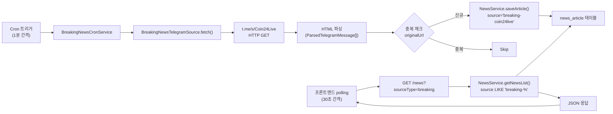
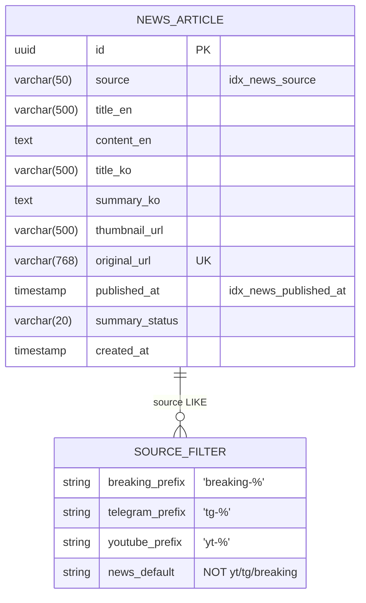
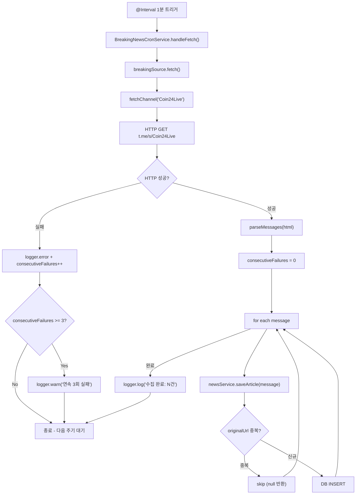
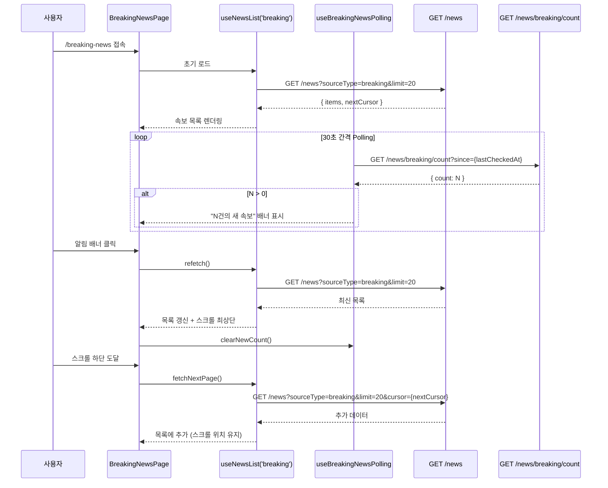

# Design Document: Breaking News (뉴스속보)

## Overview

BitScope에 **뉴스속보** 기능을 추가한다. 기존 텔레그램 채널 수집 인프라(`t.me/s/` HTML 파싱)를 재활용하여 `@Coin24Live` 채널의 속보를 1분 간격으로 수집하고, 전용 페이지 및 크립토 데스크 위젯으로 사용자에게 제공한다.

### 설계 목표

1. **기존 코드 최대 재활용** -- `NewsArticleEntity`, `NewsService.saveArticle()`, `NewsService.getNewsList()`, `useNewsList()` 훅을 그대로 활용한다.
2. **확장 가능한 소스 아키텍처** -- `BreakingNewsSource` 인터페이스를 정의하여 새 소스 추가 시 클래스 하나만 구현하면 되도록 한다.
3. **독립적 수집 주기** -- 기존 뉴스 cron(10분)과 분리된 별도 cron(1분)으로 속보의 실시간성을 확보한다.
4. **단순한 구조** -- 콘텐츠 피드 특성에 맞게 과도한 추상화 없이 실용적으로 설계한다.

### 설계 범위

| 포함 | 제외 |
|------|------|
| 백엔드 속보 수집 서비스 + cron | WebSocket 실시간 푸시 (polling으로 대체) |
| REST API `sourceType=breaking` 필터 | 브라우저 Push Notification |
| 뉴스속보 전용 페이지 (`/breaking-news`) | AI 요약 (속보는 이미 한국어) |
| 크립토 데스크 위젯 (`breakingNews`) | |
| 새 속보 알림 배너 (polling 기반) | |
| 사이드바 + 모바일 네비게이션 | |
| i18n (한국어/영어) | |

---

## Architecture Design

### System Architecture Diagram

```mermaid
graph TB
    subgraph External["외부 소스"]
        TG["t.me/s/Coin24Live<br/>(텔레그램 웹 프리뷰)"]
    end

    subgraph Backend["apps/api (NestJS)"]
        CRON["BreakingNewsCronService<br/>@Interval 1분"]
        SRC["BreakingNewsTelegramSource<br/>(BreakingNewsSource 구현)"]
        NS["NewsService<br/>(기존 saveArticle/getNewsList)"]
        DB[(MySQL<br/>news_article 테이블)]
        CTRL["NewsController<br/>(기존 GET /news)"]
    end

    subgraph Frontend["apps/web (Next.js)"]
        PAGE["BreakingNewsPage<br/>/breaking-news"]
        WIDGET["BreakingNewsWidget<br/>크립토 데스크"]
        HOOK["useNewsList('breaking')"]
        SIDEBAR["SidebarNav + BottomTabNav"]
    end

    TG -->|HTTP GET + HTML 파싱| SRC
    CRON -->|fetchAll()| SRC
    CRON -->|saveArticle()| NS
    NS -->|TypeORM| DB
    CTRL -->|getNewsList(sourceType='breaking')| NS
    PAGE -->|API 호출| CTRL
    WIDGET -->|API 호출| CTRL
    PAGE --> HOOK
    WIDGET --> HOOK
```

### Data Flow Diagram



---

## Component Design

### Backend Components

#### 1. BreakingNewsSource (인터페이스)

새 속보 소스를 추가할 때 구현해야 하는 공통 인터페이스이다.

```typescript
// apps/api/src/modules/news/interfaces/breaking-news-source.interface.ts

import { ParsedTelegramMessage } from '../services/telegram-channel-fetcher.service';

export interface BreakingNewsSource {
  /** 소스 식별자 (예: 'coin24live') */
  readonly name: string;

  /** 최신 메시지를 수집한다 */
  fetch(): Promise<ParsedTelegramMessage[]>;
}
```

- **책임**: 속보 소스의 수집 계약 정의
- **인터페이스**: `name` (읽기 전용), `fetch()` (비동기 수집)
- **의존성**: `ParsedTelegramMessage` 타입 재사용 (기존 텔레그램 수집기와 동일 구조)
- **설계 결정**: 별도 DTO를 만들지 않고 기존 `ParsedTelegramMessage`를 재활용한다. 이유: 동일 `NewsArticleEntity`에 저장하므로 필요한 필드가 동일하다.

#### 2. BreakingNewsTelegramSource (서비스)

`@Coin24Live` 텔레그램 채널에서 속보를 수집하는 구현체이다.

```typescript
// apps/api/src/modules/news/services/breaking-news-telegram.source.ts

@Injectable()
export class BreakingNewsTelegramSource implements BreakingNewsSource {
  readonly name = 'coin24live';

  /** 수집 대상 채널 (설정으로 관리, 추후 환경변수 또는 DB 설정 가능) */
  private readonly channels: BreakingChannel[] = [
    { handle: 'Coin24Live', sourcePrefix: 'breaking-coin24live' },
  ];

  async fetch(): Promise<ParsedTelegramMessage[]> { ... }

  private async fetchChannel(channel: BreakingChannel): Promise<ParsedTelegramMessage[]> { ... }

  private parseMessages(html: string, channel: BreakingChannel): ParsedTelegramMessage[] { ... }
}
```

- **책임**: 텔레그램 `t.me/s/` 웹 프리뷰에서 속보 메시지 파싱
- **인터페이스**: `BreakingNewsSource.fetch()` 구현
- **의존성**: 없음 (외부 HTTP만 사용)
- **설계 결정**: 기존 `TelegramChannelFetcherService`의 파싱 로직을 재사용하되 별도 클래스로 분리한다. 이유:
  1. 기존 서비스는 인플루언서 분석용이고 속보는 목적이 다르다.
  2. `source` 필드 prefix가 `tg-` 대신 `breaking-`이어야 한다.
  3. 수집 주기가 달라 독립 관리가 필요하다.
- **파싱 로직**: 기존 `TelegramChannelFetcherService.parseMessages()`와 동일한 정규식 패턴(tgme_widget_message_text, datetime, data-post)을 사용한다. `@Coin24Live` 채널은 한국어 속보이므로 `titleEn`/`contentEn` 필드에 한국어 원문이 들어간다 (필드명은 기존 엔티티 호환을 위해 유지).

#### 3. BreakingNewsCronService (크론 서비스)

속보 수집 cron을 관리한다.

```typescript
// apps/api/src/modules/news/breaking-news-cron.service.ts

@Injectable()
export class BreakingNewsCronService {
  private readonly logger = new Logger(BreakingNewsCronService.name);
  private consecutiveFailures = 0;

  constructor(
    private readonly breakingSource: BreakingNewsTelegramSource,
    private readonly newsService: NewsService,
  ) {}

  @Interval('breaking-news-fetch', BREAKING_FETCH_INTERVAL_MS)  // 기본 60_000 (1분)
  async handleFetch(): Promise<void> { ... }
}
```

- **책임**: 1분 간격 속보 수집 실행, 에러 핸들링, 연속 실패 추적
- **인터페이스**: `@Interval` 데코레이터로 NestJS 스케줄러에 등록
- **의존성**: `BreakingNewsTelegramSource`, `NewsService`
- **설계 결정**: 기존 `NewsCronService`에 추가하지 않고 별도 클래스로 분리한다. 이유:
  1. 수집 주기가 1분 vs 10분으로 크게 다르다.
  2. 독립적인 에러 추적(consecutiveFailures)이 필요하다.
  3. 단일 책임 원칙: 기존 RSS/텔레그램 cron과 속보 cron의 관심사가 다르다.

#### 4. NewsService 확장 (기존 서비스)

기존 `getNewsList()` 메서드에 `sourceType: 'breaking'` 필터를 추가한다.

```typescript
// 기존 NewsService.getNewsList() 수정

async getNewsList(
  limit: number = 20,
  cursor?: string,
  sourceType?: 'news' | 'youtube' | 'telegram' | 'breaking',  // 'breaking' 추가
): Promise<{ items: NewsArticleEntity[]; nextCursor: string | null }> {
  // ... 기존 코드 ...

  // 추가: 속보 필터
  if (sourceType === 'breaking') {
    queryBuilder.where('news.source LIKE :prefix', { prefix: 'breaking-%' });
  }

  // ... 나머지 동일 ...
}
```

- **변경 범위**: `sourceType` union 타입에 `'breaking'` 추가, 쿼리빌더에 조건 분기 1개 추가
- **기존 동작 영향**: 없음 (새 분기만 추가)

추가로, 새 속보 건수를 확인하는 메서드를 추가한다.

```typescript
async getBreakingNewsCountSince(since: Date): Promise<number> {
  return this.newsRepository.count({
    where: {
      source: Like('breaking-%'),
      publishedAt: MoreThan(since),
    },
  });
}
```

#### 5. NewsController 확장 (기존 컨트롤러)

```typescript
// 기존 NewsController 수정

@Get()
async getNewsList(
  @Query('limit') limit?: string,
  @Query('cursor') cursor?: string,
  @Query('sourceType') sourceType?: string,  // 기존 - 이미 string으로 받음
) {
  // sourceType 타입 캐스팅에 'breaking' 추가
  const result = await this.newsService.getNewsList(
    parsedLimit,
    cursor,
    sourceType as 'news' | 'youtube' | 'telegram' | 'breaking' | undefined,
  );
  // ...
}

// 새 속보 건수 API 추가
@Get('breaking/count')
async getBreakingNewsCount(@Query('since') since?: string) {
  const sinceDate = since ? new Date(since) : new Date(Date.now() - 60_000);
  const count = await this.newsService.getBreakingNewsCountSince(sinceDate);
  return { success: true, data: { count } };
}
```

- **변경 범위**: 기존 엔드포인트의 타입 캐스팅 수정, 새 엔드포인트 1개 추가
- **기존 동작 영향**: 없음

### Frontend Components

#### 6. BreakingNewsPage (페이지 컴포넌트)

```
apps/web/app/(dashboard)/breaking-news/page.tsx
```

- **책임**: 뉴스속보 전용 페이지 렌더링
- **인터페이스**: `useNewsList('breaking')` 훅 사용, 무한 스크롤
- **의존성**: `useNewsList`, `useBreakingNewsPolling` (신규 훅)
- **UI 구조**:
  - 헤더 (아이콘 + "뉴스속보" 타이틀)
  - 새 속보 알림 배너 (polling 기반)
  - 속보 카드 리스트 (시간 역순)
  - 무한 스크롤 / 더보기 버튼
  - 로딩/에러/빈 상태

#### 7. useBreakingNewsPolling (커스텀 훅)

```typescript
// apps/web/hooks/useBreakingNewsPolling.ts

export function useBreakingNewsPolling(enabled: boolean = true) {
  // 마지막으로 확인한 시각 관리
  // 30초 간격으로 GET /news/breaking/count?since={lastCheckedAt} 호출
  // 새 속보 건수 반환
  return { newCount, clearNewCount, lastCheckedAt };
}
```

- **책임**: 새 속보 존재 여부를 주기적으로 확인
- **인터페이스**: `newCount` (새 속보 수), `clearNewCount()` (배너 클릭 시 초기화)
- **의존성**: TanStack Query `useQuery`

#### 8. BreakingNewsWidget (위젯 컴포넌트)

```
apps/web/components/life/widgets/breaking-news-widget.tsx
```

- **책임**: 크립토 데스크에서 최신 속보를 컴팩트하게 표시
- **인터페이스**: 기존 `TelegramWidget`과 동일한 패턴
- **의존성**: `useQuery`, `getApiBaseUrl`, `NewsArticle` 타입
- **UI 구조**: 기존 `TelegramWidget`/`NewsWidget`과 동일한 컴팩트 리스트 형태, "전체보기" 링크 → `/breaking-news`

#### 9. 사이드바/하단탭 확장

**SidebarNav** (`sidebar-nav.tsx`):
- `sectionIntel`의 `items` 배열에서 `news`와 `telegramFeed` 사이에 `breakingNews` 항목 추가

```typescript
// NAV_SECTIONS[2].items 에 삽입
{ labelKey: 'breakingNews', href: '/breaking-news', icon: Zap },
```

**BottomTabNav** (`bottom-tab-nav.tsx`):
- 모바일 하단 탭은 최대 5개 제한이므로 직접 추가하지 않는다.
- 대신 사이드바의 모바일 드로어(햄버거 메뉴)를 통해 접근 가능하다. (기존 Header 컴포넌트의 모바일 드로어에서 전체 메뉴를 펼칠 수 있음)

#### 10. i18n 확장

**ko.ts**:
```typescript
nav: {
  // ... 기존 ...
  breakingNews: '뉴스속보',
},
breakingNews: {
  title: '뉴스속보',
  newAlertBanner: (count: number) => `${count}건의 새 속보가 있습니다`,
  emptyState: '아직 수집된 속보가 없습니다. 잠시 후 다시 확인해주세요.',
  viewOriginal: '원문 보기',
  viewAll: '전체보기',
},
```

**en.ts**:
```typescript
nav: {
  // ... 기존 ...
  breakingNews: 'Breaking News',
},
breakingNews: {
  title: 'Breaking News',
  newAlertBanner: (count: number) => `${count} new breaking news`,
  emptyState: 'No breaking news collected yet. Please check back later.',
  viewOriginal: 'View Original',
  viewAll: 'View All',
},
```

#### 11. 위젯 시스템 확장

**types.ts**:
```typescript
export type WidgetType = /* ... 기존 ... */ | 'breakingNews';
```

**constants.ts** (`WIDGET_METAS`에 추가):
```typescript
{ type: 'breakingNews', labelKo: '뉴스속보', labelEn: 'Breaking News', icon: 'Zap' },
```

**widget-renderer.tsx**:
```typescript
{config.type === 'breakingNews' && <BreakingNewsWidget />}
```

---

## Data Model

### Core Data Structure

기존 `NewsArticleEntity`를 그대로 사용한다. 새 테이블이나 컬럼 추가 없이 `source` 필드의 prefix 규칙으로 속보를 구분한다.

```typescript
// 기존 엔티티 - 변경 없음
@Entity('news_article')
export class NewsArticleEntity {
  @PrimaryGeneratedColumn('uuid')     id: string;
  @Column({ type: 'varchar', length: 50 })
  @Index('idx_news_source')           source: string;         // 'breaking-coin24live'
  @Column({ name: 'title_en' })       titleEn: string;        // 속보 제목 (한국어 원문)
  @Column({ name: 'content_en' })     contentEn: string|null; // 속보 본문 (한국어 원문)
  @Column({ name: 'original_url', unique: true })
                                       originalUrl: string;    // 중복 방지 키
  @Column({ name: 'published_at' })
  @Index('idx_news_published_at')      publishedAt: Date;
  @Column({ name: 'summary_status' }) summaryStatus: SummaryStatus; // 'pending' 저장 후 한국어이므로 요약 불필요
  // ... 나머지 필드 동일
}
```

### Source Naming Convention

| 소스 유형 | source 값 패턴 | 예시 |
|-----------|----------------|------|
| RSS 뉴스 | `{outlet}` | `coindesk`, `cointelegraph` |
| 유튜브 | `yt-{channel}` | `yt-coinbureau` |
| 텔레그램 (인플루언서) | `tg-{channel}` | `tg-wu-blockchain` |
| **속보 (신규)** | `breaking-{source}` | `breaking-coin24live` |

### Data Model Diagram



---

## Business Process

### Process 1: 속보 수집 파이프라인



### Process 2: 프론트엔드 속보 조회 및 새 속보 알림



### Process 3: 크립토 데스크 위젯 배치

```mermaid
flowchart TD
    A["사용자: 크립토 데스크 빈 셀 클릭"] --> B["WidgetSelector 표시"]
    B --> C["WIDGET_METAS에서 'breakingNews' 선택"]
    C --> D["setWidget(index, { type: 'breakingNews' })"]
    D --> E["WidgetRenderer 렌더링"]
    E --> F["BreakingNewsWidget 마운트"]
    F --> G["useQuery: GET /news?sourceType=breaking&limit=8"]
    G --> H["컴팩트 속보 리스트 표시"]

    loop 60초 간격 refetch
        H --> G
    end

    H --> I["속보 클릭 → 새 탭에서 원문 오픈"]
    H --> J["'전체보기' 클릭 → /breaking-news 이동"]
```

---

## Error Handling Strategy

### Backend

| 시나리오 | 처리 방법 |
|----------|-----------|
| HTTP 요청 타임아웃 | `AbortSignal.timeout(15_000)` 적용. 타임아웃 시 에러 로깅 후 다음 주기 재시도 |
| HTTP 4xx/5xx | `res.ok` 체크 후 에러 throw. cron에서 catch하여 로깅 |
| HTML 파싱 실패 | 개별 메시지 파싱 실패는 해당 메시지만 skip, 전체 수집은 계속 |
| DB 중복 저장 시도 | `NewsService.saveArticle()`의 기존 중복 체크(originalUrl)로 방지 |
| 연속 실패 | `consecutiveFailures` 카운터로 추적. 3회 이상 시 warn 레벨 로그 |
| 단일 소스 실패 | `Promise.allSettled()` 패턴으로 다른 소스에 영향 없음 |

```typescript
// BreakingNewsCronService 에러 처리 패턴
async handleFetch(): Promise<void> {
  try {
    const items = await this.breakingSource.fetch();
    this.consecutiveFailures = 0;

    let savedCount = 0;
    for (const item of items) {
      const saved = await this.newsService.saveArticle(item);
      if (saved) savedCount++;
    }

    if (savedCount > 0) {
      this.logger.log(`속보 수집 완료 - 수집: ${items.length}건, 신규: ${savedCount}건`);
    }
  } catch (error) {
    this.consecutiveFailures++;
    const msg = error instanceof Error ? error.message : String(error);

    if (this.consecutiveFailures >= 3) {
      this.logger.warn(`속보 수집 연속 ${this.consecutiveFailures}회 실패: ${msg}`);
    } else {
      this.logger.error(`속보 수집 실패: ${msg}`);
    }
  }
}
```

### Frontend

| 시나리오 | 처리 방법 |
|----------|-----------|
| API 호출 실패 | TanStack Query의 `retry: 2` 자동 재시도. 실패 시 에러 메시지 표시 |
| 빈 데이터 | Empty state 컴포넌트 ("수집된 속보가 없습니다") 표시 |
| Polling 실패 | 조용히 실패 (새 속보 알림 배너만 표시 안 됨). 다음 주기 재시도 |
| 네트워크 오류 | 기존 뉴스 페이지와 동일한 에러 카드 표시 |

---

## Testing Strategy

### Backend Unit Tests

| 테스트 대상 | 테스트 항목 |
|-------------|-------------|
| `BreakingNewsTelegramSource` | HTML 파싱 정확성, 빈 HTML 처리, 타임아웃 시 에러, source prefix 검증 |
| `BreakingNewsCronService` | 정상 수집 흐름, 에러 시 consecutiveFailures 증가, 3회 연속 실패 시 warn 로그 |
| `NewsService.getNewsList('breaking')` | `breaking-` prefix 필터 동작, 기존 sourceType 필터 영향 없음 |
| `NewsService.getBreakingNewsCountSince()` | 시간 범위 필터 정확성 |

### Frontend Unit Tests

| 테스트 대상 | 테스트 항목 |
|-------------|-------------|
| `BreakingNewsPage` | 로딩 상태, 에러 상태, 빈 상태, 속보 카드 렌더링, 무한 스크롤 |
| `useBreakingNewsPolling` | polling 주기, 새 속보 카운트, clearNewCount 동작 |
| `BreakingNewsWidget` | 컴팩트 뷰 렌더링, 전체보기 링크, 자동 갱신 |

### Integration Tests

| 테스트 항목 | 방법 |
|-------------|------|
| 수집 → 저장 → 조회 E2E | 테스트 HTML fixture → source 파싱 → DB 저장 → API 조회 검증 |
| 중복 방지 | 동일 URL 2회 저장 시도 → 1건만 저장 확인 |
| sourceType 필터 격리 | `breaking-` 소스가 `news`/`telegram` 필터에 노출되지 않는지 확인 |

---

## File Structure Summary

```
apps/api/src/modules/news/
├── interfaces/
│   └── breaking-news-source.interface.ts   # [신규] 소스 인터페이스
├── services/
│   ├── breaking-news-telegram.source.ts    # [신규] 텔레그램 속보 소스
│   ├── telegram-channel-fetcher.service.ts # [기존] 인플루언서 텔레그램
│   ├── rss-fetcher.service.ts              # [기존]
│   └── news-summary.service.ts            # [기존]
├── entities/
│   └── news-article.entity.ts             # [기존 - 변경 없음]
├── breaking-news-cron.service.ts          # [신규] 속보 cron
├── news-cron.service.ts                   # [기존 - 변경 없음]
├── news.service.ts                        # [기존 - 수정] sourceType 'breaking' 추가
├── news.controller.ts                     # [기존 - 수정] /breaking/count 엔드포인트 추가
└── news.module.ts                         # [기존 - 수정] 신규 서비스 등록

apps/web/
├── app/(dashboard)/breaking-news/
│   └── page.tsx                           # [신규] 속보 페이지
├── hooks/
│   ├── useNews.ts                         # [기존 - 수정] SOURCE_DISPLAY_NAMES 추가
│   └── useBreakingNewsPolling.ts          # [신규] 새 속보 polling 훅
├── components/
│   ├── layout/sidebar-nav.tsx             # [기존 - 수정] 메뉴 항목 추가
│   └── life/
│       ├── widgets/breaking-news-widget.tsx # [신규] 속보 위젯
│       └── widget-renderer.tsx            # [기존 - 수정] breakingNews 렌더링 추가
├── lib/
│   ├── life/
│   │   ├── types.ts                       # [기존 - 수정] WidgetType에 'breakingNews' 추가
│   │   └── constants.ts                   # [기존 - 수정] WIDGET_METAS에 속보 추가
│   └── i18n/
│       ├── ko.ts                          # [기존 - 수정] 속보 번역 추가
│       └── en.ts                          # [기존 - 수정] 속보 번역 추가
```

---

## Key Design Decisions

| 결정 | 근거 |
|------|------|
| 기존 `NewsArticleEntity` 재사용 | 새 테이블 생성 불필요. `source` prefix로 충분히 구분 가능. 기존 CRUD/API/훅 모두 활용 가능. |
| 별도 `BreakingNewsCronService` 분리 | 기존 cron과 수집 주기(1분 vs 10분), 에러 추적, 관심사가 다르므로 독립 관리. |
| WebSocket 대신 HTTP Polling | 속보 수집 자체가 1분 간격이므로 WebSocket의 실시간 이점이 미미. 30초 polling으로 충분한 신선도 확보. 구현 복잡도 대폭 감소. |
| `BreakingNewsSource` 인터페이스 도입 | 추후 RSS, 웹 스크래핑 등 새 소스 추가 시 구현 클래스만 추가하면 됨. 과도한 추상화 아닌 실용적 수준의 확장성. |
| `Coin24Live`는 한국어이므로 AI 요약 건너뜀 | `summaryStatus: 'pending'`으로 저장되지만 기존 AI 요약 cron은 `breaking-` source를 별도 처리 불필요 (요약 실패해도 원문이 한국어라 문제없음). 필요시 추후 `summaryStatus: 'completed'`로 직접 저장하도록 최적화 가능. |
| 모바일 하단 탭에 직접 추가하지 않음 | 하단 탭은 5개 제한(UX 모범 사례). 기존 5개 메뉴가 이미 핵심 기능을 담당하므로 사이드바/드로어로 접근. |
