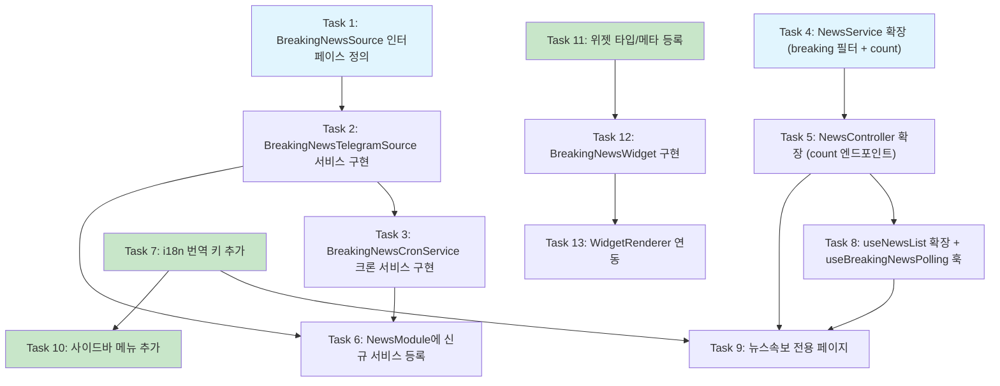

# Implementation Plan: Breaking News (뉴스속보)

## 참조 문서
- 요구사항: `.claude/specs/breaking-news/requirements.md`
- 설계: `.claude/specs/breaking-news/design.md`

---

## Backend Tasks

- [x] 1. `BreakingNewsSource` 인터페이스 정의
  - `apps/api/src/modules/news/interfaces/breaking-news-source.interface.ts` 파일 생성
  - `name: string` (읽기 전용 소스 식별자)과 `fetch(): Promise<ParsedTelegramMessage[]>` 메서드를 포함하는 인터페이스 정의
  - 기존 `ParsedTelegramMessage` 타입(`telegram-channel-fetcher.service.ts`에서 export됨)을 재사용
  - _Requirements: 3.1, 3.2, 3.4_

- [x] 2. `BreakingNewsTelegramSource` 서비스 구현
  - `apps/api/src/modules/news/services/breaking-news-telegram.source.ts` 파일 생성
  - `BreakingNewsSource` 인터페이스를 구현하는 `@Injectable()` NestJS 서비스 작성
  - `channels` 배열로 수집 대상 채널 관리 (`{ handle: 'Coin24Live', sourcePrefix: 'breaking-coin24live' }`)
  - 기존 `TelegramChannelFetcherService.parseMessages()`와 동일한 HTML 파싱 로직 구현 (정규식 패턴: `tgme_widget_message_text`, `datetime`, `data-post`)
  - `source` 필드에 `breaking-` prefix 적용 (예: `breaking-coin24live`)
  - HTTP 요청에 `AbortSignal.timeout(15_000)` 적용
  - 개별 메시지 파싱 실패 시 해당 메시지만 skip, 전체 수집 계속
  - 단위 테스트 작성: HTML 파싱 정확성, 빈 HTML 처리, source prefix 검증
  - _Requirements: 2.1, 2.3, 2.5, 2.6, 3.1, 3.2, 3.4, 9.3_

- [x] 3. `BreakingNewsCronService` 크론 서비스 구현
  - `apps/api/src/modules/news/breaking-news-cron.service.ts` 파일 생성
  - `@Interval('breaking-news-fetch', 60_000)` 데코레이터로 1분 간격 수집 등록
  - `BREAKING_FETCH_INTERVAL_MS` 환경변수 지원 (`process.env.BREAKING_FETCH_INTERVAL_MS ?? '60000'`)
  - `consecutiveFailures` 카운터로 연속 실패 추적
  - `handleFetch()` 메서드: `breakingSource.fetch()` 호출 후 `newsService.saveArticle()` 반복
  - 성공 시 수집 건수 로깅, 에러 시 error 레벨 로깅, 연속 3회 이상 실패 시 warn 레벨 로깅
  - 단위 테스트 작성: 정상 수집 흐름, 에러 시 consecutiveFailures 증가, 3회 연속 실패 시 warn 로그
  - _Requirements: 2.2, 2.3, 2.5, 3.3, 10.1, 10.2, 10.3_

- [x] 4. `NewsService` 확장 -- `sourceType='breaking'` 필터 및 카운트 API 추가
  - `apps/api/src/modules/news/news.service.ts` 수정
  - `getNewsList()` 메서드의 `sourceType` union 타입에 `'breaking'` 추가
  - `sourceType === 'breaking'` 분기 추가: `queryBuilder.where('news.source LIKE :prefix', { prefix: 'breaking-%' })`
  - 기존 `sourceType === 'news'` 분기에 `breaking-%` 제외 조건 추가 (속보가 일반 뉴스 목록에 노출되지 않도록)
  - `getBreakingNewsCountSince(since: Date): Promise<number>` 메서드 추가: `source LIKE 'breaking-%'` AND `publishedAt > since` 조건으로 count 반환
  - 단위 테스트 작성: breaking 필터 동작, 기존 sourceType 필터에 영향 없음, countSince 시간 범위 검증
  - _Requirements: 7.1, 7.2, 7.3, 7.4_

- [x] 5. `NewsController` 확장 -- 속보 카운트 엔드포인트 추가
  - `apps/api/src/modules/news/news.controller.ts` 수정
  - 기존 `getNewsList()` 메서드의 sourceType 캐스팅에 `'breaking'` 추가
  - `@Get('breaking/count')` 엔드포인트 추가: `since` 쿼리 파라미터(ISO 8601 문자열) → `newsService.getBreakingNewsCountSince()` 호출 → `{ success: true, data: { count } }` 반환
  - `since` 미지정 시 기본값: 현재 시각 - 60초
  - _Requirements: 7.1, 7.3_

- [x] 6. `NewsModule`에 신규 서비스 등록
  - `apps/api/src/modules/news/news.module.ts` 수정
  - `BreakingNewsTelegramSource`와 `BreakingNewsCronService`를 `providers` 배열에 추가
  - 필요한 import 문 추가
  - _Requirements: 2.1, 2.2_

---

## Frontend Tasks

- [x] 7. i18n 번역 키 추가
  - `apps/web/lib/i18n/ko.ts` 수정: `nav` 객체에 `breakingNews: '뉴스속보'` 추가, `breakingNews` 섹션 추가 (title, newAlertBanner, emptyState, viewOriginal, viewAll)
  - `apps/web/lib/i18n/en.ts` 수정: 동일한 구조로 영어 번역 추가
  - `newAlertBanner`는 함수형 키: `(count: number) => string`
  - _Requirements: 8.1, 8.2, 8.3_

- [x] 8. `useNewsList` 훅 확장 및 `useBreakingNewsPolling` 훅 생성
  - `apps/web/hooks/useNews.ts` 수정:
    - `useNewsList()` 의 `sourceType` 파라미터 타입에 `'breaking'` 추가
    - `SOURCE_DISPLAY_NAMES`에 `'breaking-coin24live': 'Coin24Live 속보'` 추가
    - `isBreakingSource()` 헬퍼 함수 추가 (optional)
  - `apps/web/hooks/useBreakingNewsPolling.ts` 파일 생성:
    - `useBreakingNewsPolling(enabled: boolean)` 훅 구현
    - `lastCheckedAt` state 관리 (최초: 현재 시각)
    - TanStack Query `useQuery`로 30초 간격(`refetchInterval: 30_000`) `GET /news/breaking/count?since={lastCheckedAt}` 호출
    - `newCount`, `clearNewCount()`, `lastCheckedAt` 반환
    - `clearNewCount()` 호출 시 `lastCheckedAt`를 현재 시각으로 갱신
  - _Requirements: 5.1, 5.2, 7.1, 7.3_

- [x] 9. 뉴스속보 전용 페이지 구현
  - `apps/web/app/(dashboard)/breaking-news/page.tsx` 파일 생성
  - 기존 `telegram-feed/page.tsx` 패턴을 참고하여 구현
  - 헤더: `Zap` 아이콘 + i18n 제목
  - 새 속보 알림 배너: `useBreakingNewsPolling` 훅 연동, 클릭 시 `refetch()` + 스크롤 최상단 + `clearNewCount()`
  - 사용자가 이미 목록 최상단에 있을 때 새 속보 자동 삽입 (배너 불필요)
  - 속보 카드 리스트: 소스명(Badge), 제목/본문, 상대 시간(`timeAgo`), 원문 링크(새 탭)
  - `useNewsList('breaking')` 훅 사용, cursor 기반 무한 스크롤
  - 로딩/에러/빈 상태 처리
  - _Requirements: 4.1, 4.2, 4.3, 4.4, 4.5, 4.6, 4.7, 4.8, 5.1, 5.2, 5.3, 9.1, 9.4_

- [x] 10. 사이드바 네비게이션에 뉴스속보 메뉴 추가
  - `apps/web/components/layout/sidebar-nav.tsx` 수정
  - `lucide-react`에서 `Zap` 아이콘 import 추가
  - `sectionIntel` items 배열에서 `news`(href: `/news`)와 `telegramFeed`(href: `/telegram-feed`) 사이에 삽입: `{ labelKey: 'breakingNews', href: '/breaking-news', icon: Zap }`
  - 기존 `isActiveRoute()` 로직으로 active 상태 자동 처리됨
  - _Requirements: 1.1, 1.2, 1.3, 1.4, 1.5_

- [x] 11. 크립토 데스크 위젯 시스템에 뉴스속보 위젯 등록
  - `apps/web/lib/life/types.ts` 수정: `WidgetType` union에 `'breakingNews'` 추가
  - `apps/web/lib/life/constants.ts` 수정: `WIDGET_METAS` 배열에 `{ type: 'breakingNews', labelKo: '뉴스속보', labelEn: 'Breaking News', icon: 'Zap' }` 추가
  - _Requirements: 6.1_

- [x] 12. `BreakingNewsWidget` 위젯 컴포넌트 구현
  - `apps/web/components/life/widgets/breaking-news-widget.tsx` 파일 생성
  - 기존 `TelegramWidget` 패턴을 참고하여 구현
  - `useQuery`로 `GET /news?sourceType=breaking&limit=8` 호출, `refetchInterval: 60_000`
  - 컴팩트 리스트 뷰: 소스명, 제목(line-clamp-2), 상대 시간
  - 속보 클릭 시 새 탭에서 원문 오픈
  - "전체보기" 링크 → `/breaking-news`
  - 로딩/빈 상태 처리
  - _Requirements: 6.2, 6.3, 6.4, 6.5_

- [x] 13. `WidgetRenderer`에 뉴스속보 위젯 렌더링 추가
  - `apps/web/components/life/widget-renderer.tsx` 수정
  - `BreakingNewsWidget` import 추가
  - `widgetName` 매핑 객체에 `breakingNews: '뉴스속보'` 추가
  - 렌더링 조건 추가: `{config.type === 'breakingNews' && <BreakingNewsWidget />}`
  - _Requirements: 6.1, 6.2_

---

## Tasks Dependency Diagram

**범례:**
- 파란색: 독립적으로 병렬 시작 가능한 첫 번째 작업들
- 초록색: 백엔드 의존 없이 병렬 시작 가능한 프론트엔드 작업들
- 화살표: 선행 작업 의존 관계
