# Design Document

## Overview

`stock-perp-comparison` 비교 차트의 렌더러를 recharts(`ComposedChart`)에서 TradingView의 lightweight-charts(MIT, v5.2.0)로 교체한다. 본 설계는 **렌더러 내부 구현만** 바꾸며, 컴포넌트의 외부 계약(props), 입력 데이터 형식(`ComparisonPoint[]`), 데이터 파이프라인(`merge-timeline.ts`/Route Handler/`useStockPerpComparison.ts`)은 그대로 유지한다.

### 설계 목표

- **기능 동등성(Parity)**: 단일 KRW Y축 오버레이, 주식 라인 휴장 끊김 / perp 연속, 휴장 음영 + 토글, KST 스마트 시간축, 괴리 정보 패널, 빈/오류/단일 시리즈 안전 처리, 반응형 리사이즈.
- **추가 개선(Enhancement)**: 분봉 촘촘 렌더(다운샘플 완화), crosshair 호버 값, 줌/팬, 테마 색상 정합.
- **타입 안전성**: `noUncheckedIndexedAccess` 준수, 재사용 가능한 순수 함수는 렌더와 분리하여 단위 테스트 유지.

### 핵심 사실 (조사 결과)

- `lightweight-charts@^5.2.0`이 이미 `apps/web/package.json`에 설치되어 있다. 신규 의존성 추가 불필요(NFR2.1 충족).
- v5 API 확인: `createChart`, `chart.addSeries(LineSeries, options)`, `series.setData([LineData | WhitespaceData])`, `chart.subscribeCrosshairMove`, `timeScale().fitContent()`, `series.attachPrimitive(ISeriesPrimitive)` (`IPrimitivePaneView`/`IPrimitivePaneRenderer`, `timeToCoordinate`) 모두 typings에 존재.
- recharts는 다른 13개 화면(`futures-dashboard`, `market-screener`, `premium` 등)에서 사용 중 → recharts 의존성 제거는 범위 밖(NFR2.2 충족). 비교 차트 한정 교체.
- `formatAlertPrice(value, 'KRW' | 'USD')`는 `@bitscope/shared`에서 export됨 (시그니처 확인 완료) → 툴팁/패널에서 재사용.
- 호스트 페이지는 `<div className="h-[420px]">` 안에서 `<ComparisonChart points stockLabel perpLabel />`를 렌더 → 고정 높이 컨테이너. 컴포넌트는 부모 너비/높이를 100% 채워야 한다.

---

## Architecture Design

### 파일 변경 계획

| 파일 | 작업 | 내용 |
|---|---|---|
| `apps/web/app/(dashboard)/stock-perp-comparison/components/comparison-chart.tsx` | 수정 | recharts 제거, lightweight-charts 렌더 로직으로 교체. 외부 props 동일 유지. 순수 함수는 `lib/`로 이동. |
| `apps/web/app/(dashboard)/stock-perp-comparison/lib/chart-data.ts` | 신규 | 순수 함수: `downsamplePreservingBoundaries`, `computeClosedRegions`, `toLineSeriesData`(ComparisonPoint→LineData/Whitespace 매핑), `makeKstTickFormatter`. |
| `apps/web/app/(dashboard)/stock-perp-comparison/lib/closed-region-primitive.ts` | 신규 | 휴장 음영을 그리는 `ISeriesPrimitive` 구현(ClosedRegionPrimitive). |
| `apps/web/app/(dashboard)/stock-perp-comparison/components/divergence-panel.tsx` | 신규 | recharts 툴팁 의존을 끊은 호버 정보 패널. 기존 `divergence-tooltip.tsx`의 표시 로직을 미러링하되 props를 `ComparisonPoint | null`로 단순화. |
| `apps/web/app/(dashboard)/stock-perp-comparison/components/divergence-tooltip.tsx` | 삭제 | recharts payload 계약에 묶여 있어 폐기. 표시 로직은 `divergence-panel.tsx`로 이관. |
| `apps/web/app/(dashboard)/stock-perp-comparison/components/__tests__/comparison-chart.test.ts` | 수정 | import 경로를 `../comparison-chart` → `../../lib/chart-data`로 변경. 기존 테스트 케이스는 전부 보존, `toLineSeriesData`/포맷터 케이스 추가. |
| `apps/web/app/(dashboard)/stock-perp-comparison/page.tsx` | 변경 없음 | props 계약 동일하므로 수정 불필요(R1.4). |

> 결정: 순수 함수를 `'use client'` 차트 컴포넌트에서 빼내 `lib/`로 옮긴다. 기존 테스트는 `'use client'` 모듈에서 직접 import해도 동작했지만, lightweight-charts 렌더 모듈은 브라우저 전용 API(`createChart`)를 모듈 로드시점에 끌어올 수 있어 테스트 환경 격리를 위해 순수 로직을 별도 파일로 분리한다(NFR3.2).

### 시스템 아키텍처 다이어그램

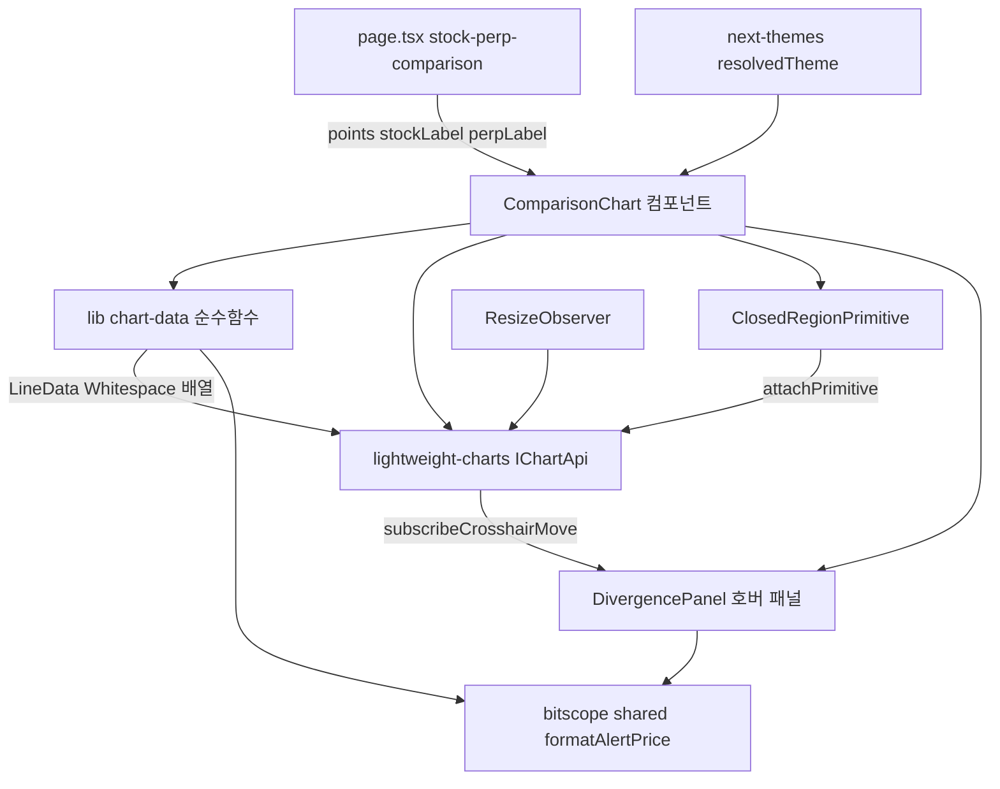

### 데이터 흐름 다이어그램

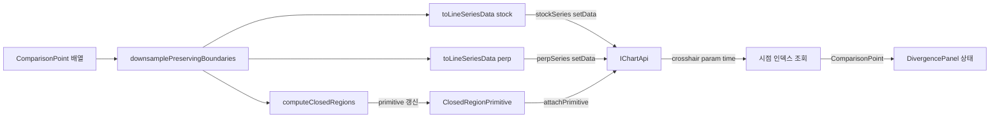

---

## Component Design

### ComparisonChart (수정)

- **책임**: lightweight-charts 인스턴스 라이프사이클 관리(생성/데이터 주입/리사이즈/dispose), 두 라인 시리즈 구성, 휴장 음영 primitive 부착, crosshair 구독 → 호버 패널 동기화, 테마 옵션 주입, 휴장 음영 토글 상태 보유.
- **외부 인터페이스(불변, R1.4)**:
  ```ts
  interface ComparisonChartProps {
    points: ComparisonPoint[];
    stockLabel: string;
    perpLabel: string;
    baseCurrency?: 'KRW';
  }
  ```
- **의존성**: `lightweight-charts`, `next-themes`(`useResolvedTheme`), `./lib/chart-data`, `./lib/closed-region-primitive`, `./divergence-panel`.
- **내부 ref 구조**:
  - `containerRef: HTMLDivElement` — 차트 마운트 대상.
  - `chartRef: IChartApi | null`
  - `stockSeriesRef`, `perpSeriesRef: ISeriesApi<'Line'>`
  - `primitiveRef: ClosedRegionPrimitive`
  - `hovered: ComparisonPoint | null` (useState) — 호버 패널 입력.
  - `showClosedShading: boolean` (useState, 기본 `true`).

### lib/chart-data.ts (신규 순수 함수)

- `downsamplePreservingBoundaries(points, maxPoints)` — 기존 로직 그대로 이관(경계 보존). 기본 상한만 변경(아래 다운샘플링 정책 참조).
- `computeClosedRegions(points): ClosedRegion[]` — 기존 로직 그대로 이관.
- `toLineSeriesData(points, key): (LineData | WhitespaceData)[]` — `null` 가격을 whitespace로 변환하는 매핑(아래 데이터 모델 참조).
- `makeKstTickFormatter(timeRangeMs): (time, tickMarkType, locale) => string` — KST 스마트 포맷터.
- `findPointByTime(points, time): ComparisonPoint | null` — crosshair time → 원본 포인트 역매핑(Map 인덱스 사용).

### ClosedRegionPrimitive (신규)

- **책임**: `marketOpen===false` 연속 구간을 차트 배경에 반투명 음영으로 그린다(R4). lightweight-charts에는 recharts `ReferenceArea` 직접 대응이 없으므로 v5 **series primitive**로 구현한다.
- **인터페이스**: `ISeriesPrimitive<Time>` 구현 — `paneViews(): IPrimitivePaneView[]`. 각 pane view의 `renderer()`는 `IPrimitivePaneRenderer`를 반환하며 `draw(target)`에서 canvas에 사각형을 그린다.
- **의존성**: 부착된 series의 `priceToCoordinate`는 사용하지 않고(전체 높이를 덮음), `chart.timeScale().timeToCoordinate(time)`로 x1/x2 픽셀 좌표를 계산.

### DivergencePanel (신규)

- **책임**: 호버된 `ComparisonPoint`(또는 null)를 받아 시각·주식가·perp가(KRW+USD)·적용 환율·괴리(절대/%)를 한국어로 표시(R6). 기존 `divergence-tooltip.tsx` 표시 로직을 그대로 미러링.
- **인터페이스**: `{ point: ComparisonPoint | null }`. recharts payload 계약 제거.

---

## Data Model

### 핵심 타입 (변경 없음, 입력)

`ComparisonPoint`(`@bitscope/shared`, 변경 금지):

```ts
interface ComparisonPoint {
  timestamp: number;          // 공통 그리드 UTC epoch ms
  stockPrice: number | null;  // KRW, 휴장 결측 시 null
  perpPrice: number | null;   // KRW 변환값, 결측 시 null
  perpPriceRaw: number | null;// 원본 USD
  appliedRate: number | null; // 적용 환율 USD/KRW
  marketOpen: boolean;        // 주식 개장 여부
  stockGap: boolean;          // 결측 구간 시작 플래그
}
```

### lightweight-charts 변환 모델 (신규, 출력)

```ts
import type { UTCTimestamp, LineData, WhitespaceData, Time } from 'lightweight-charts';

interface ClosedRegion { x1: UTCTimestamp; x2: UTCTimestamp; }

// LineData = { time, value }; WhitespaceData = { time }  (value 없음 → 라인 끊김)
type SeriesPoint = LineData<UTCTimestamp> | WhitespaceData<UTCTimestamp>;
```

### 데이터 매핑 핵심 (R3, R5.5)

**1) timestamp(UTC ms) → lightweight-charts `time`**

lightweight-charts의 `UTCTimestamp`는 **초 단위 epoch**다. `Math.floor(timestamp / 1000)`로 변환한다.

> KST 표시 정합(R5.5): lightweight-charts는 `time`을 항상 UTC로 다룬다. 시간축 라벨을 KST로 보이려면 `time` 자체를 KST로 시프트하지 **않고**(데이터 무결성 유지), `tickMarkFormatter`와 crosshair 포맷터에서 `Intl.DateTimeFormat({ timeZone: 'Asia/Seoul' })`로 표시 단계에서만 KST 변환한다. 따라서 `time = Math.floor(ts/1000)` (시프트 없음), 표시는 포맷터가 책임진다.

**2) `null` 가격 → whitespace (R3.1 / R3.2 / R3.3)**

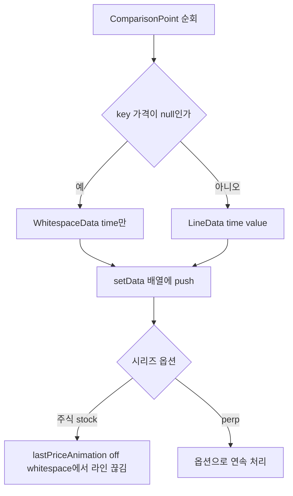

- **주식 시리즈(R3.1, 끊김)**: `stockPrice===null`인 포인트는 `WhitespaceData`(value 없음)로 매핑. lightweight-charts는 whitespace 지점에서 라인을 잇지 않으므로 recharts `connectNulls={false}`와 동등하게 끊긴다. forward-fill 금지(R3.3) — value를 채우지 않는다.
- **perp 시리즈(R3.2, 연속)**: perp는 보통 전 구간 값이 존재한다. 부분 결측이 있어도 24시간 연속으로 보이도록, perp 매핑에서는 `null` 포인트를 **배열에서 제외**(whitespace도 넣지 않음)한다. 그러면 lightweight-charts가 인접 유효점을 직선으로 잇는다(= recharts `connectNulls` 동등). 단 양 시리즈의 time 그리드는 공통 timestamp를 공유하므로 정렬은 유지된다(R3.4).
- 두 시리즈 모두 `time` 오름차순·중복 없는 입력이 보장되어야 한다(입력 `points`가 이미 오름차순 → 유지).

---

## 컴포넌트 설계 상세

### 두 라인 시리즈 + 단일 KRW 가격 축 (R2)

- `chart.addSeries(LineSeries, { color: STOCK_COLOR, lineWidth: 2, priceScaleId: 'right' })` (주식)
- `chart.addSeries(LineSeries, { color: PERP_COLOR, lineWidth: 2, priceScaleId: 'right' })` (perp)
- **단일 KRW 축 오버레이(R2.2)**: 두 시리즈 모두 동일 `priceScaleId: 'right'`를 공유 → 하나의 가격 축에 자동 오버레이. 좌우 분리 축/정규화 사용 안 함.
- **KRW 포맷(R2.5, R2.6)**: `chart.applyOptions({ localization: { priceFormatter: (p) => Math.round(p).toLocaleString('ko-KR') } })`로 Y축 눈금을 천 단위 한국어 포맷. KRW 단위 식별은 가격 포맷(정수, 콤마)으로 제공하고, 추가로 범례(아래)에 통화 표기.
- **색상 구분(R2.3)**: `STOCK_COLOR`(파랑 계열), `PERP_COLOR`(앰버 계열). 두 테마 모두에서 구분 가능(R7.3).
- **범례(R2.4)**: lightweight-charts에는 내장 legend가 없으므로 차트 위 절대배치 `<div>` 오버레이로 `{stockLabel}(주식)` / `{perpLabel}(perp)`를 색상 점과 함께 표시. (recharts `<Legend>` 동등.)

### 휴장 음영 구현 — series primitive 방식 (R4)

**방식 비교 (조사 결과)**

| 후보 | 장점 | 단점 | 채택 |
|---|---|---|---|
| Area/Baseline 시리즈 배경 밴드 | API 단순 | 가격축에 묶여 임의 시간 구간 밴드 표현이 부자연, 여러 구간 표현 어려움 | 미채택 |
| 차트 위 절대배치 div 오버레이 | DOM만으로 구현 | 줌/팬 시 픽셀 동기화를 수동 계산해야 하고 timeScale 변경 구독 필요, 정밀도 낮음 | 미채택 |
| **v5 series primitive (ISeriesPrimitive)** | 차트 좌표계와 자동 동기(줌/팬/리사이즈에 자동 재draw), 여러 구간 렌더, 라인 아래 레이어 제어 가능 | primitive 구현 코드 필요 | **채택** |

> 결정 근거: 줌/팬(R10)·리사이즈(R12) 시 음영이 라인/시간축과 항상 정합해야 한다(R10.2). primitive는 차트가 좌표 변환과 재draw를 관장하므로 동기화가 공짜다. v5.2.0 typings에 `ISeriesPrimitive`, `attachPrimitive`, `IPrimitivePaneView`, `IPrimitivePaneRenderer`, `timeToCoordinate`가 존재함을 확인했다.

**ClosedRegionPrimitive 렌더 흐름**

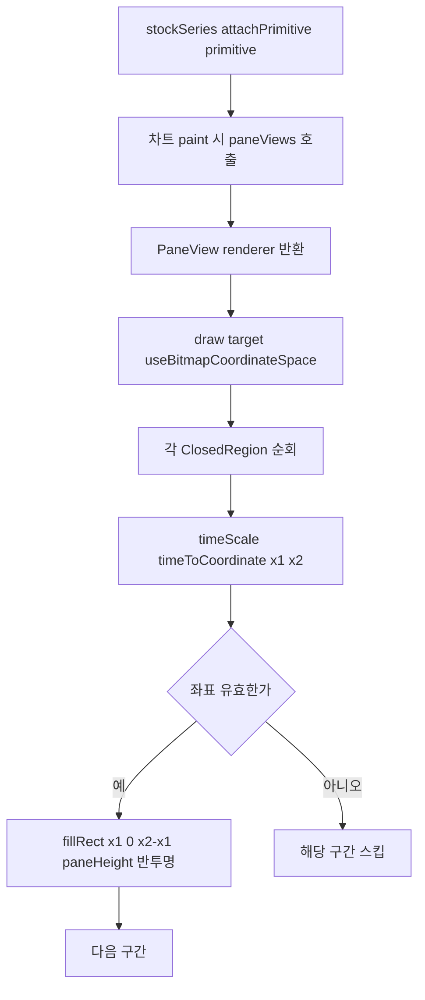

- primitive는 `regions: ClosedRegion[]`와 `visible: boolean`, `fillColor`를 보유. 외부에서 `setRegions(regions)` / `setVisible(bool)` / `setColor(color)` 호출 후 `chart.timeScale()` 기반 redraw를 트리거(`series.applyOptions({})` 또는 primitive `requestUpdate`).
- **레이어(R4.7)**: `zOrder: 'bottom'`을 사용해 음영을 라인 아래에 그린다. `fillStyle`은 반투명(예: 테마 muted 색 + alpha 0.18~0.25).
- **토글(R4.3~R4.6)**: `showClosedShading` state → `primitive.setVisible(state)` + `requestUpdate()`. 기본 ON. 버튼은 `aria-pressed`로 상태 노출(R4.6) — 기존 버튼 마크업 재사용.
- 음영 구간 계산은 `computeClosedRegions(sampled)`로 다운샘플 후 데이터 기준 산출(R4.2) → 라인 끊김과 경계 정합.

### KST 스마트 시간축 포맷터 연결 (R5)

- lightweight-charts `tickMarkFormatter`를 통해 시간축 라벨을 커스텀: `chart.applyOptions({ timeScale: { tickMarkFormatter: (time, tickMarkType, locale) => fmt(time) } })`.
- 현재 표시 구간 폭에 따라 포맷 분기(R5.2~R5.4). 줌/팬으로 구간이 바뀌면(R10.3) 보이는 범위를 다시 측정해 포맷을 갱신해야 한다:
  - `chart.timeScale().subscribeVisibleTimeRangeChange((range) => recomputeFormatter(range))`로 가시 범위 폭(`to - from`, 초)을 받아 `< 48h`, `< 14d`, `>= 14d` 분기 결정.
  - 분기 기준은 기존 코드와 동일(48h / 14d). 포맷은 `Intl.DateTimeFormat('ko-KR', { timeZone: 'Asia/Seoul', ... })`로 KST 표시(R5.1, R5.5).
- crosshair 패널의 시각 표기도 동일 KST 포맷 유틸을 재사용해 일관성 유지.

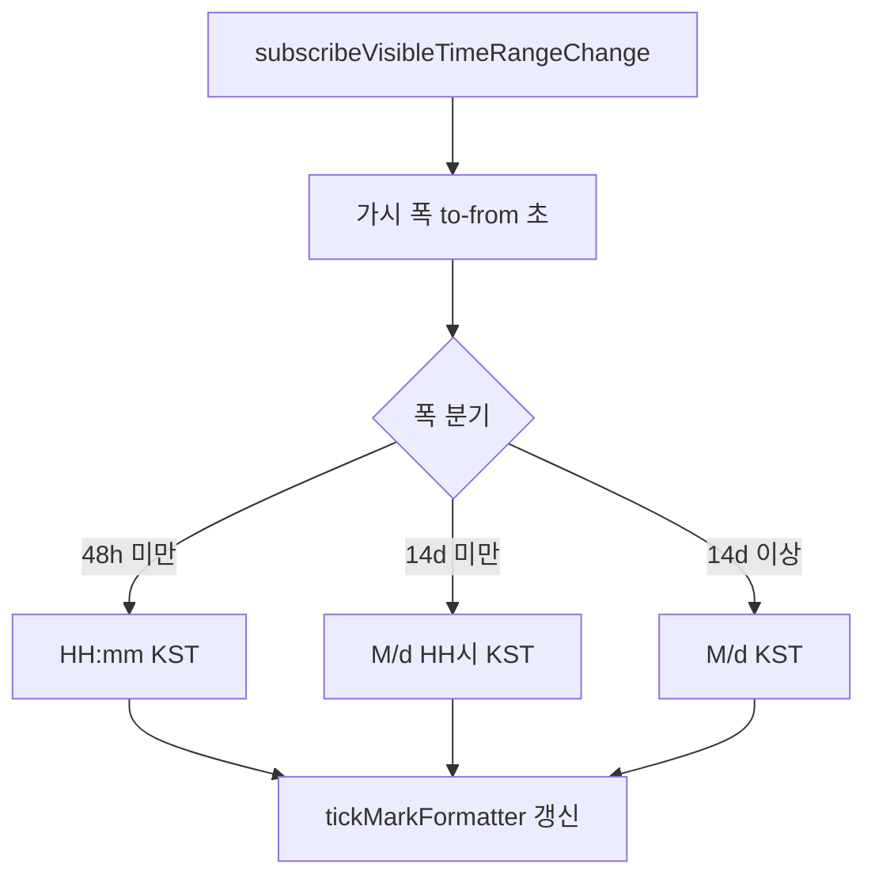

### Crosshair 호버 → 괴리 패널 동기화 (R6, R9)

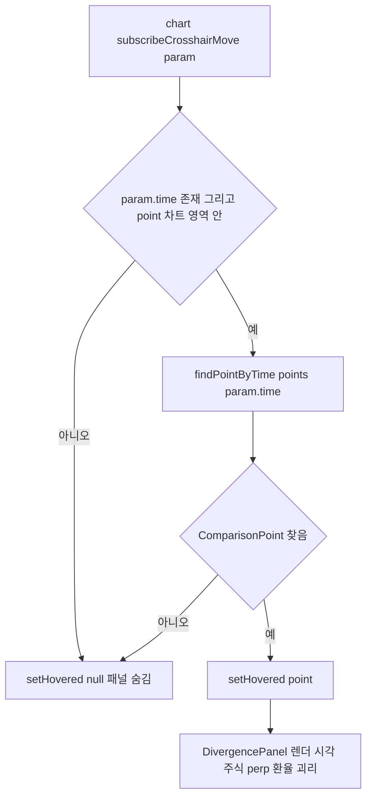

- `chart.subscribeCrosshairMove((param) => { ... })` 사용(R9.1, R9.2).
- `param.time`(UTCTimestamp 초)을 `time*1000`으로 되돌려 원본 `ComparisonPoint`를 `Map<number, ComparisonPoint>` 인덱스로 역매핑(`findPointByTime`).
- `param.time`이 없거나 `param.point`가 컨테이너 밖이면 `setHovered(null)` → 패널·crosshair 숨김(R9.4).
- crosshair가 가리키는 시점과 패널 시점이 동일 `param.time` 기반이므로 동기화 보장(R9.3, R6.1).
- crosshair 모드: `crosshair: { mode: CrosshairMode.Normal }` (시간/가격 자유 이동). 시간/가격 라벨은 lightweight-charts 기본 축 라벨로 표시(R9.2).
- 괴리 계산(R6.6, R6.7)·표기·결측 안전 처리는 기존 `divergence-tooltip.tsx` 로직을 `DivergencePanel`로 이관해 동일 유지. `formatAlertPrice`(R6.8) 재사용.

### 테마/CSS 변수 색상 주입 (R7)

- CSS 변수(`--border`, `--muted`, `--muted-foreground`, `--popover`, `--background` 등)는 런타임 계산값이므로 lightweight-charts 옵션(색상 문자열 필요)에 직접 `var(...)`를 넣을 수 없다. → 마운트 후 `getComputedStyle(containerRef.current)`로 실제 색상값을 읽어 옵션에 주입.
- `next-themes`의 `resolvedTheme`(`'light' | 'dark'`)를 의존성으로 두고, 테마 전환 시(R7.2) 색상을 다시 읽어 `chart.applyOptions(...)` + `primitive.setColor(...)` + 시리즈 `applyOptions({ color })` 갱신.
- 주입 대상: `layout.background`(투명 또는 앱 배경, R7.4 — `ColorType.Solid` + 배경 변수 또는 `background: { type: ColorType.Solid, color: 'transparent' }`), `layout.textColor`(muted-foreground), `grid.vertLines/horzLines.color`(border), `crosshair` 색상, 음영 `fillColor`(muted + alpha).
- 라인 색상(R7.3)은 테마 비의존 고정 팔레트(파랑/앰버)로 두 테마 모두 가독 확보.

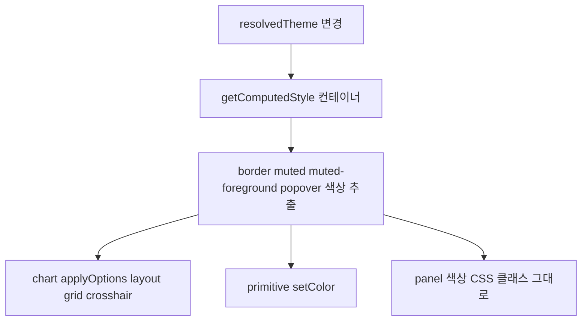

### 반응형 리사이즈 & dispose (R1.5, R12)

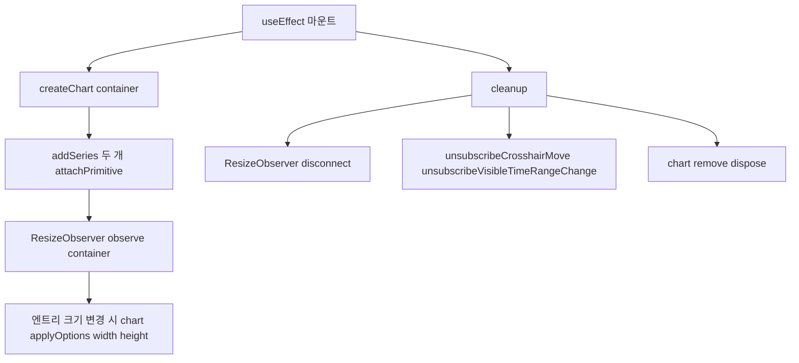

- `ResizeObserver`로 컨테이너 크기를 관찰해 `chart.applyOptions({ width, height })` 갱신(R12.1, R12.2). 컨테이너는 `h-full w-full`로 부모(`h-[420px]`)를 채운다.
- cleanup(R1.5, R11.3, R12.3): `resizeObserver.disconnect()`, crosshair/visibleRange 구독 해제, `chart.remove()`로 인스턴스 dispose.
- SSR 안전(R1.6): `'use client'` 컴포넌트 + 차트 생성은 `useEffect`(브라우저 전용) 내부에서만 수행 → 서버 렌더 시 `createChart` 미호출.

### 데이터 갱신 라이프사이클 (R11.3, 페어/range 전환)

- 차트 **인스턴스 생성**은 마운트 시 1회(빈 deps useEffect). **데이터 주입**은 별도 useEffect(`[points, showClosedShading, ...]`)에서 `stockSeries.setData(...)`, `perpSeries.setData(...)`, `primitive.setRegions(...)` 호출로 갱신. `placeholderData`(훅)로 깜빡임 방지된 새 `points`가 오면 setData로 교체 → 잔상 없음(R11.3).
- range 전환으로 시간 단위가 바뀌면 `fitContent()` 재호출로 전체 구간 표시(R10.4).

---

## Business Process

### Process 1: 초기 마운트 및 렌더

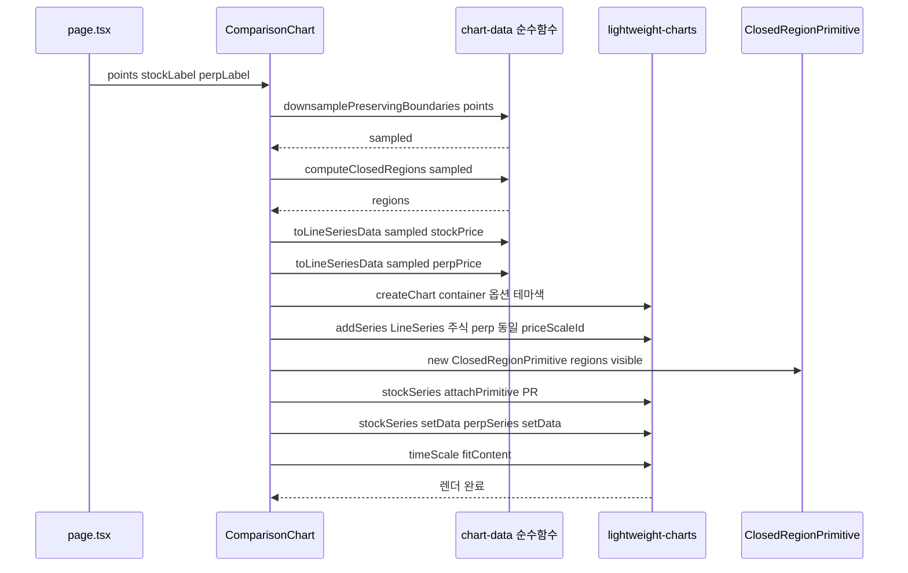

### Process 2: 호버 → 괴리 패널 동기화

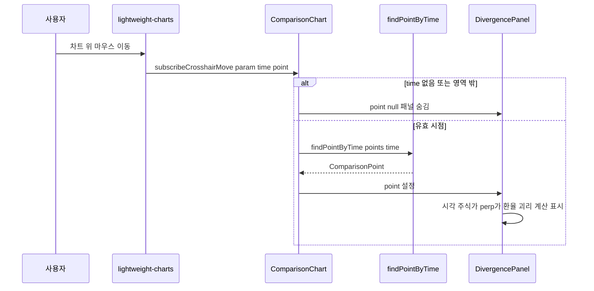

### Process 3: 줌/팬 시 시간축 포맷 갱신

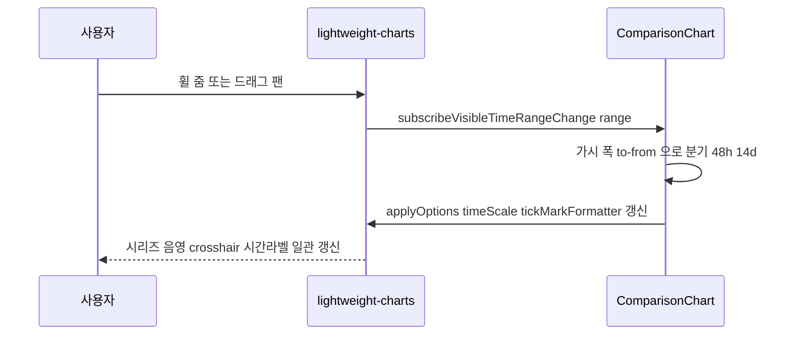

### Process 4: 테마 전환

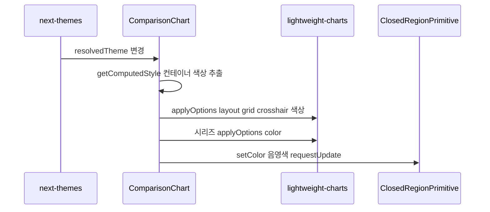

---

## 다운샘플링 정책 최종안 (R8)

**옵션 비교**

| 옵션 | 장점 | 단점 |
|---|---|---|
| A. 완전 제거(원본 전부 렌더) | 최대 해상도, 가장 부드러움(R8.4). lightweight-charts는 수천~수만 포인트도 성능 문제 없음(canvas) | 1y+분봉 등 극단적으로 큰 배열에서 메모리/전송엔 영향 없으나, 입력 자체가 그만큼 클 때 안전망 없음 |
| B. 상한 대폭 상향(예: 100 → 5000) | A의 부드러움을 거의 그대로 얻으면서 극단 케이스 안전망 유지. 경계 보존 로직 그대로 재사용 | 상한 도달 시 미세하게 샘플링됨(체감 거의 없음) |

**최종 결정: 옵션 B (상한 대폭 상향, `MAX_POINTS = 5000`)**

근거:
- lightweight-charts는 canvas 렌더라 수천 포인트에서 프레임 끊김이 없다(R8.2, NFR1.1) → 부드러움 목표 달성.
- 현실적으로 `ComparisonPoint[]`는 range별로 수백~수천 규모(1d 분봉도 1일 거래시간 기준 수백, 5d/1mo도 수천 이내). 5000 상한은 사실상 거의 항상 원본 전부를 통과시켜 옵션 A의 부드러움을 얻는다(R8.1, R8.4).
- 동시에 비정상적으로 큰 입력에 대한 안전망(상한)을 유지(NFR1.1).
- **경계 보존(R8.3)**: 기존 `downsamplePreservingBoundaries`를 그대로 사용 — 상한 초과 시에도 `stockGap` 시작점과 `marketOpen` 전환 경계 양쪽을 강제 보존 → 라인 끊김·음영 경계 정합 유지. 상한 이하면 동일 참조 그대로 반환(원본 전부).
- 파이프라인 불변(R8.5): 다운샘플은 렌더러 내부 `useMemo`에서만 수행.

> 상한값은 상수로 분리(`MAX_POINTS`)하여 추후 튜닝 가능하게 둔다.

---

## Error Handling Strategy

| 상황 | 처리 | 요구사항 |
|---|---|---|
| `points`가 빈 배열/비배열 | `Array.isArray` 가드 → 빈 상태 div 렌더, 차트 생성 생략. 에러 미발생 | R11.1 |
| 단일 시리즈만 유효(주식 전부 null 등) | 해당 시리즈는 전부 whitespace/빈 데이터 → 빈 라인. 가용 시리즈만 정상 표시. 괴리는 `—` | R11.2, R6.7 |
| 가격/환율 결측(null/NaN) | 패널에서 `Number.isFinite` 검사 후 `—`/'데이터 없음' 표기, 괴리 미산출 | R6.3~R6.7 |
| crosshair time이 데이터에 없음 | `findPointByTime`가 null 반환 → 패널 숨김. 에러 없음 | R9.4 |
| 페어/range 전환 | useEffect deps(`points`)로 `setData` 교체, 이전 상태 잔상 없음 | R11.3 |
| unmount | ResizeObserver/구독 해제 + `chart.remove()`로 dispose | R1.5, R12.3 |
| SSR | `useEffect` 내 차트 생성, `createChart` 서버 미호출 | R1.6 |
| time 단위 오변환 | `time = Math.floor(ts/1000)`(초) 일관 적용, 표시만 KST 포맷터 | R5.5 |

---

## Testing Strategy

### 단위 테스트 (순수 함수, vitest — NFR3.1, NFR3.2)

`lib/chart-data.ts`로 이관된 순수 함수를 테스트. 기존 `__tests__/comparison-chart.test.ts`의 import 경로만 `../../lib/chart-data`로 변경하고 **기존 케이스 전부 보존**:

- `computeClosedRegions`: 연속/분리/단일포인트/선두/말미/빈 입력 (기존 7케이스 유지).
- `downsamplePreservingBoundaries`: 임계 이하 동일참조/임계 동일/초과 다운샘플/첫·마지막 보존/`stockGap` 보존/`marketOpen` 전환 보존/오름차순 유지 (기존 케이스 유지, 상한 인자 명시로 호출).

신규 케이스:
- `toLineSeriesData(points, 'stockPrice')`: `null`이 `WhitespaceData`(value 없음)로, 유효값이 `LineData`로 매핑되는지. time이 `Math.floor(ts/1000)`인지.
- `toLineSeriesData(points, 'perpPrice')`: `null` 포인트가 배열에서 제외(연속)되는지.
- `makeKstTickFormatter`: 48h/14d 경계에서 포맷 분기, KST 표시 검증(고정 timestamp로 문자열 비교).
- `findPointByTime`: time(초)으로 원본 포인트 역매핑, 미존재 시 null.
- `noUncheckedIndexedAccess` 준수: 인덱스 접근은 const 캡처 + undefined 검사 유지.

### 렌더/통합 테스트

- lightweight-charts는 canvas/DOM 측정을 요구해 jsdom 단위 테스트에 부적합 → 차트 렌더 자체는 단위 테스트 대상에서 제외하고 순수 로직 위주로 커버.
- 수동 검증 항목(체크리스트): 주식 라인 휴장 끊김 / perp 연속, 음영 토글, 줌/팬 시 음영·시간축 정합, 테마 전환 색상, 호버 패널 동기화, 빈/단일 시리즈 상태, 리사이즈, 페어/range 전환 잔상 없음.

---

## 요구사항 추적 매트릭스

| 요구사항 | 설계 대응 |
|---|---|
| R1 렌더러 교체 | 파일 변경 계획, ComparisonChart 수정, SSR/dispose 라이프사이클 |
| R2 단일 KRW 오버레이 | 동일 `priceScaleId`, `priceFormatter`, 색상, 절대배치 범례 |
| R3 끊김/연속 매핑 | `toLineSeriesData`(null→whitespace 주식 / null 제외 perp), 공통 time 그리드 |
| R4 휴장 음영+토글 | ClosedRegionPrimitive(series primitive), `setVisible` 토글, `aria-pressed`, zOrder bottom |
| R5 KST 스마트 시간축 | `tickMarkFormatter` + `subscribeVisibleTimeRangeChange`, `makeKstTickFormatter`, time 시프트 없음 |
| R6 괴리 패널 | DivergencePanel, `formatAlertPrice` 재사용, 결측 안전 처리 |
| R7 테마 정합 | `getComputedStyle` 색상 추출 + `applyOptions`, `resolvedTheme` 의존 |
| R8 촘촘 렌더 | `MAX_POINTS=5000` 상향(옵션 B), 경계 보존 유지 |
| R9 crosshair 호버 | `subscribeCrosshairMove`, `findPointByTime`, 영역 밖 숨김 |
| R10 줌/팬 | 기본 인터랙션 활성, `fitContent` 초기, visibleRange 구독으로 포맷 갱신 |
| R11 빈/오류/전환 상태 | Array 가드, 단일 시리즈, setData 교체 잔상 방지 |
| R12 반응형 | ResizeObserver + `applyOptions`, cleanup disconnect |
| NFR1 성능 | canvas 렌더, 5000 상한 안전망 |
| NFR2 라이선스/의존성 | lightweight-charts 기설치(MIT), recharts 전역 유지 |
| NFR3 품질/타입 | 순수 함수 분리·테스트, `noUncheckedIndexedAccess` 준수 |
| NFR4 국제화 | 한국어 표기, KST 포맷, `formatAlertPrice` 관례 |
