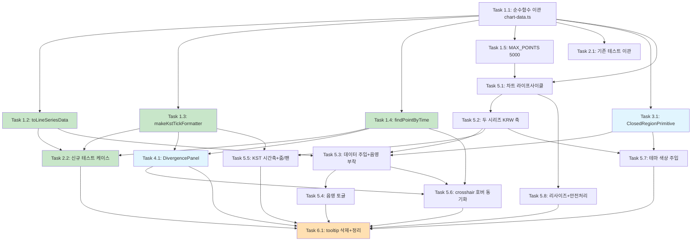

# Implementation Plan

비교 차트 렌더러를 recharts → lightweight-charts(v5.2.0, 기설치)로 교체하는 구현 작업이다. 순수 함수 분리 → 단위 테스트 → 차트 컴포넌트 → primitive → 패널 → 통합 → 정리(삭제) 순으로 점진적으로 쌓는다. 모든 작업은 `noUncheckedIndexedAccess` 등 기존 TypeScript 엄격 설정을 준수한다. 입력 데이터 형식(`ComparisonPoint[]`), 외부 props 계약, 데이터 파이프라인(`merge-timeline.ts`/Route Handler/`useStockPerpComparison.ts`)은 변경하지 않는다.

- [x] 1. 순수 함수 모듈 `lib/chart-data.ts` 신규 작성 및 기존 로직 이관
- [x] 1.1 기존 순수 함수를 `comparison-chart.tsx`에서 `lib/chart-data.ts`로 이관
  - `apps/web/app/(dashboard)/stock-perp-comparison/lib/chart-data.ts`를 신규 생성하고, `comparison-chart.tsx`의 `downsamplePreservingBoundaries`와 `computeClosedRegions`를 동작 변경 없이 그대로 이관(export)한다.
  - `ClosedRegion` 타입을 lightweight-charts 변환 모델에 맞게 `{ x1: UTCTimestamp; x2: UTCTimestamp }`로 정의한다(설계 Data Model). 단 `computeClosedRegions`는 기존과 동일하게 epoch ms를 사용하므로 ms→초 변환은 primitive/매핑 단계에서 처리하거나 본 함수가 반환하는 시점 단위를 설계에 맞게 일관 정의한다.
  - `noUncheckedIndexedAccess` 대응(인덱스 접근 시 const 캡처 + undefined 검사)을 그대로 유지한다.
  - _Requirements: R8.3, R8.5, NFR3.1, NFR3.2_

- [x] 1.2 `toLineSeriesData(points, key)` 순수 함수 구현
  - `ComparisonPoint[]`를 lightweight-charts `(LineData<UTCTimestamp> | WhitespaceData<UTCTimestamp>)[]`로 변환한다.
  - `time = Math.floor(timestamp / 1000)`(초 단위, 시프트 없음)로 매핑한다.
  - 주식 시리즈(`key='stockPrice'`): `null` 가격은 `WhitespaceData`(value 없음)로 매핑하여 라인을 끊는다. forward-fill 금지.
  - perp 시리즈(`key='perpPrice'`): `null` 포인트는 배열에서 제외하여 인접 유효점을 직선으로 잇는다(연속).
  - `time` 오름차순·중복 없음을 유지한다(입력이 이미 오름차순).
  - _Requirements: R3.1, R3.2, R3.3, R3.4, R5.5, NFR3.1_

- [x] 1.3 `makeKstTickFormatter(timeRangeMs)` 순수 함수 구현
  - 가시 구간 폭(ms)에 따라 KST(`Asia/Seoul`) 시간축 포맷터를 반환한다.
  - 48시간 미만: 시:분(24시간제). 48시간 이상 14일 미만: 월/일 + 시. 14일 이상: 월/일.
  - `Intl.DateTimeFormat('ko-KR', { timeZone: 'Asia/Seoul', ... })`로 표시 단계에서만 KST 변환한다(time 자체는 시프트하지 않음).
  - lightweight-charts `tickMarkFormatter` 시그니처(time, tickMarkType, locale)와 crosshair 패널 양쪽에서 재사용 가능한 형태로 작성한다.
  - _Requirements: R5.1, R5.2, R5.3, R5.4, R5.5, NFR4.1_

- [x] 1.4 `findPointByTime(points, time)` 순수 함수 구현
  - crosshair `time`(UTCTimestamp 초)을 받아 `time * 1000`으로 되돌려 원본 `ComparisonPoint`를 역매핑한다.
  - `Map<number, ComparisonPoint>` 인덱스(초 단위 키)를 사용해 조회하며, 미존재 시 `null`을 반환한다.
  - `noUncheckedIndexedAccess` 준수.
  - _Requirements: R9.3, R6.1, R9.4, NFR3.1_

- [x] 1.5 `MAX_POINTS` 상수를 5000으로 상향하여 `lib/chart-data.ts`에 정의
  - 다운샘플 상한을 `100` → `5000`으로 변경하여 분봉을 촘촘하게 렌더한다(상한 이하면 동일 참조 반환, 경계 보존 로직 유지).
  - 추후 튜닝 가능하도록 명명 상수로 분리한다.
  - _Requirements: R8.1, R8.3, R8.4, NFR1.1_

- [x] 2. 단위 테스트 이관 및 신규 케이스 추가
- [x] 2.1 기존 테스트의 import 경로 변경 및 전 케이스 보존
  - `__tests__/comparison-chart.test.ts`의 import를 `../comparison-chart` → `../../lib/chart-data`로 변경한다.
  - `computeClosedRegions`(연속/분리/단일포인트/선두/말미/빈 입력) 및 `downsamplePreservingBoundaries`(임계 이하 동일참조/임계 동일/초과 다운샘플/첫·마지막 보존/`stockGap` 보존/`marketOpen` 전환 보존/오름차순 유지) 기존 케이스를 전부 보존한다.
  - `downsamplePreservingBoundaries` 호출 시 상한 인자(`100` 등)를 명시적으로 전달하도록 유지하여 상수 변경(5000)과 무관하게 통과시킨다.
  - _Requirements: NFR3.1, NFR3.2_

- [x] 2.2 신규 단위 테스트 케이스 추가
  - `toLineSeriesData(points, 'stockPrice')`: `null`이 `WhitespaceData`(value 없음)로, 유효값이 `LineData`로 매핑되고 `time === Math.floor(ts/1000)`인지 검증.
  - `toLineSeriesData(points, 'perpPrice')`: `null` 포인트가 배열에서 제외(연속)되는지 검증.
  - `makeKstTickFormatter`: 48h/14d 경계에서 포맷 분기 및 KST 표시를 고정 timestamp 문자열 비교로 검증.
  - `findPointByTime`: time(초)으로 원본 포인트 역매핑, 미존재 시 `null` 반환 검증.
  - _Requirements: R3.1, R3.2, R5.2, R5.3, R5.4, R9.3, NFR3.1_

- [x] 3. `ClosedRegionPrimitive` (휴장 음영 series primitive) 신규 구현
- [x] 3.1 `lib/closed-region-primitive.ts` 신규 작성
  - `ISeriesPrimitive<Time>`을 구현하는 `ClosedRegionPrimitive` 클래스를 작성한다.
  - 내부 상태: `regions: ClosedRegion[]`, `visible: boolean`, `fillColor: string`. setter(`setRegions`/`setVisible`/`setColor`) 호출 후 `requestUpdate()`로 redraw를 트리거한다.
  - `paneViews(): IPrimitivePaneView[]`를 반환하고, 각 pane view의 `renderer()`는 `IPrimitivePaneRenderer`를 반환하며 `draw(target)`에서 `useBitmapCoordinateSpace`로 canvas에 사각형을 그린다.
  - x 좌표는 `chart.timeScale().timeToCoordinate(time)`로 x1/x2를 계산하고, 좌표가 유효하지 않으면 해당 구간을 스킵한다. y는 전체 pane 높이(0 ~ height)를 덮는다(priceToCoordinate 미사용).
  - `zOrder: 'bottom'`으로 라인 아래 레이어에 그리고, 반투명 `fillStyle`(테마 muted + alpha 0.18~0.25)을 사용한다.
  - `visible === false`이면 아무것도 그리지 않는다.
  - _Requirements: R4.1, R4.2, R4.7, R10.2, R12.2, NFR3.1_

- [x] 4. `DivergencePanel` (호버 정보 패널) 신규 구현
- [x] 4.1 `components/divergence-panel.tsx` 신규 작성
  - `'use client'` 컴포넌트로, props는 `{ point: ComparisonPoint | null }`로 단순화한다(recharts payload 계약 제거).
  - 기존 `divergence-tooltip.tsx`의 표시 로직(KST 시각, 주식가 KRW, perp가 KRW+USD, 적용 환율, 괴리 절대/% 부호별 색상)을 그대로 미러링한다.
  - 결측값(`null`/`NaN`)은 `Number.isFinite` 검사 후 `—`/`데이터 없음`으로 안전 처리하고, 양쪽 유효 시에만 괴리를 산출한다.
  - `formatAlertPrice`(`@bitscope/shared`)와 `makeKstTickFormatter`(또는 동일 KST 포맷 유틸)를 재사용해 표기 일관성을 유지한다.
  - `point === null`이면 아무것도 렌더하지 않거나 빈 상태로 표시한다.
  - _Requirements: R6.1, R6.2, R6.3, R6.4, R6.5, R6.6, R6.7, R6.8, NFR4.1_

- [x] 5. `ComparisonChart` 컴포넌트를 lightweight-charts 렌더러로 교체
- [x] 5.1 recharts 제거 및 차트 인스턴스 라이프사이클 구현
  - `comparison-chart.tsx`에서 recharts import/JSX를 제거하고, 외부 props 인터페이스(`points`, `stockLabel`, `perpLabel`, `baseCurrency?: 'KRW'`)는 그대로 유지한다.
  - 마운트 시 1회 `useEffect`(빈 deps)에서 `createChart(containerRef.current, ...)`로 차트를 생성한다(브라우저 전용 → SSR 안전).
  - cleanup에서 `chart.remove()`로 dispose, crosshair/visibleRange 구독 해제, ResizeObserver disconnect를 수행한다.
  - `containerRef`, `chartRef`, `stockSeriesRef`, `perpSeriesRef`, `primitiveRef`를 ref로 보유한다.
  - 컨테이너는 `h-full w-full`로 부모(`h-[420px]`)를 채운다.
  - _Requirements: R1.1, R1.2, R1.4, R1.5, R1.6, R12.1, R12.3_

- [x] 5.2 두 라인 시리즈 + 단일 KRW 가격 축 오버레이 구성
  - `chart.addSeries(LineSeries, { color: STOCK_COLOR, lineWidth: 2, priceScaleId: 'right' })`(주식), 동일 `priceScaleId`로 perp 시리즈를 추가하여 단일 KRW 축에 오버레이한다.
  - `localization.priceFormatter`로 Y축 눈금을 천 단위 한국어 포맷(`Math.round(p).toLocaleString('ko-KR')`)으로 표기한다.
  - `STOCK_COLOR`(파랑), `PERP_COLOR`(앰버) 고정 팔레트로 두 테마 모두 구분 가능하게 한다.
  - 차트 위 절대배치 `
` 범례로 `{stockLabel}(주식)` / `{perpLabel}(perp)`를 색상 점과 함께 표시한다.
  - _Requirements: R2.1, R2.2, R2.3, R2.4, R2.5, R2.6, R7.3_

- [x] 5.3 데이터 매핑·주입 및 휴장 음영 primitive 부착
  - `useMemo`로 `downsamplePreservingBoundaries(points, MAX_POINTS)` → `sampled`를 계산하고, `Array.isArray` 가드로 빈/비배열을 안전 처리한다.
  - `toLineSeriesData(sampled, 'stockPrice')` / `toLineSeriesData(sampled, 'perpPrice')`를 `stockSeries.setData(...)` / `perpSeries.setData(...)`로 주입한다.
  - `computeClosedRegions(sampled)`로 음영 구간을 산출하고 `ClosedRegionPrimitive`를 생성해 `stockSeries.attachPrimitive(primitive)`로 부착, `primitive.setRegions(regions)`로 갱신한다.
  - 데이터 주입은 `[points]` 등 deps를 가진 별도 `useEffect`에서 수행해 페어/range 전환 시 `setData` 교체로 잔상 없이 갱신한다.
  - _Requirements: R3.1, R3.2, R3.3, R3.4, R4.1, R4.2, R8.1, R8.2, R8.3, R8.5, R11.1, R11.3_

- [x] 5.4 휴장 음영 토글 컨트롤 구현
  - `showClosedShading` state(기본 `true`)와 토글 버튼을 구현하고, `aria-pressed`로 상태를 노출한다(기존 버튼 마크업 재사용).
  - 토글 변경 시 `primitive.setVisible(state)` + `requestUpdate()`로 음영을 즉시 숨기거나 다시 표시한다.
  - _Requirements: R4.3, R4.4, R4.5, R4.6, R4.7_

- [x] 5.5 KST 스마트 시간축 포맷터 연결 및 줌/팬 활성화
  - `chart.applyOptions({ timeScale: { tickMarkFormatter } })`로 `makeKstTickFormatter` 결과를 연결한다.
  - `chart.timeScale().subscribeVisibleTimeRangeChange((range) => ...)`로 가시 폭(`to - from`, 초)을 받아 포맷 분기(48h/14d)를 재계산하고 `tickMarkFormatter`를 갱신한다.
  - lightweight-charts 기본 시간축 줌/팬 인터랙션을 활성화하고, 초기 로드 시 `timeScale().fitContent()`로 전체 구간을 표시한다(range 전환 시 재호출).
  - _Requirements: R5.1, R5.2, R5.3, R5.4, R10.1, R10.2, R10.3, R10.4_

- [x] 5.6 crosshair 호버 → DivergencePanel 동기화
  - `crosshair: { mode: CrosshairMode.Normal }`로 십자선을 활성화하고, 시간/가격 라벨은 기본 축 라벨로 표시한다.
  - `chart.subscribeCrosshairMove((param) => ...)`에서 `param.time`이 없거나 `param.point`가 영역 밖이면 `setHovered(null)`(패널·crosshair 숨김), 유효하면 `findPointByTime(points, param.time)` 결과로 `setHovered(point)`.
  - `hovered: ComparisonPoint | null` state를 `DivergencePanel`에 전달하여 동일 시점의 괴리 정보를 표시한다.
  - _Requirements: R9.1, R9.2, R9.3, R9.4, R6.1_

- [x] 5.7 테마/CSS 변수 색상 주입
  - 마운트 후 `getComputedStyle(containerRef.current)`로 `--border`, `--muted`, `--muted-foreground`, `--popover`, `--background` 등 실제 색상값을 읽어 차트 옵션에 주입한다.
  - 주입 대상: `layout.background`(투명 또는 앱 배경, `ColorType.Solid`), `layout.textColor`(muted-foreground), `grid.vertLines/horzLines.color`(border), crosshair 색상, 음영 `fillColor`(muted + alpha).
  - `next-themes`의 `resolvedTheme`를 의존성으로 두고, 테마 전환 시 색상을 다시 읽어 `chart.applyOptions(...)` + 시리즈 `applyOptions({ color })` + `primitive.setColor(...)`로 갱신한다.
  - 라인 색상은 테마 비의존 고정 팔레트(파랑/앰버)를 유지한다.
  - _Requirements: R7.1, R7.2, R7.3, R7.4_

- [x] 5.8 반응형 리사이즈 및 빈/단일 시리즈 안전 처리
  - `ResizeObserver`로 컨테이너 크기를 관찰해 `chart.applyOptions({ width, height })`로 리사이즈하고, cleanup에서 `disconnect()`한다.
  - `points`가 빈 배열/비배열이면 차트 생성을 생략하거나 빈 상태 div를 렌더하여 오류를 던지지 않는다.
  - 한 시리즈만 유효한 경우(예: 주식 전부 null) 가용 시리즈만 표시되고 정상 동작하도록 한다(`toLineSeriesData` 결과가 빈 라인이어도 안전).
  - _Requirements: R12.1, R12.2, R12.3, R11.1, R11.2, R1.5_

- [x] 6. 정리: `divergence-tooltip.tsx` 삭제 및 잔여 참조 제거
- [x] 6.1 폐기된 recharts 툴팁 파일 삭제 및 import 정리
  - `components/divergence-tooltip.tsx`를 삭제한다(표시 로직은 `divergence-panel.tsx`로 이관 완료).
  - `comparison-chart.tsx`를 포함한 모든 파일에서 `DivergenceTooltip` 및 recharts 잔여 import를 제거한다.
  - `page.tsx`는 props 계약이 동일하므로 수정하지 않음을 확인한다.
  - 타입체크/린트/단위 테스트(`vitest`)를 실행하여 전 케이스 통과 및 `noUncheckedIndexedAccess` 위반 없음을 확인한다.
  - _Requirements: R1.3, R1.4, NFR2.2, NFR3.1_

---

## Tasks Dependency Diagram

