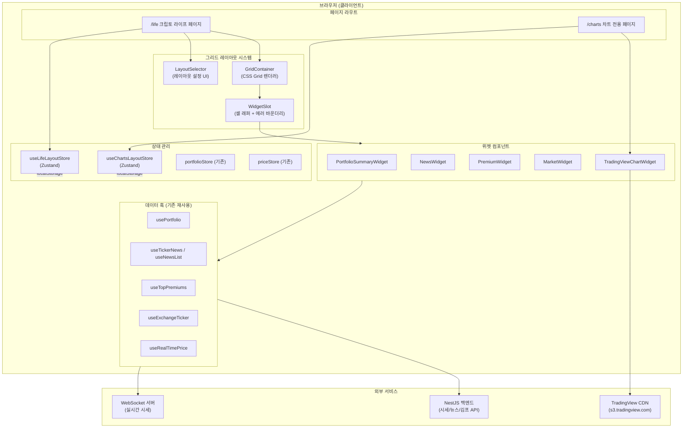
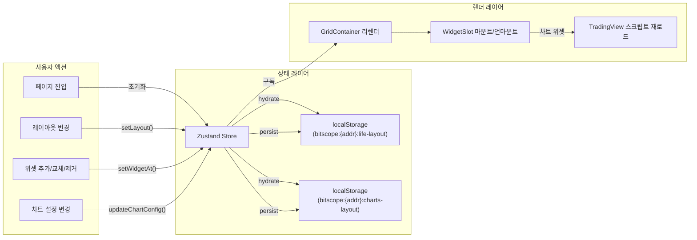
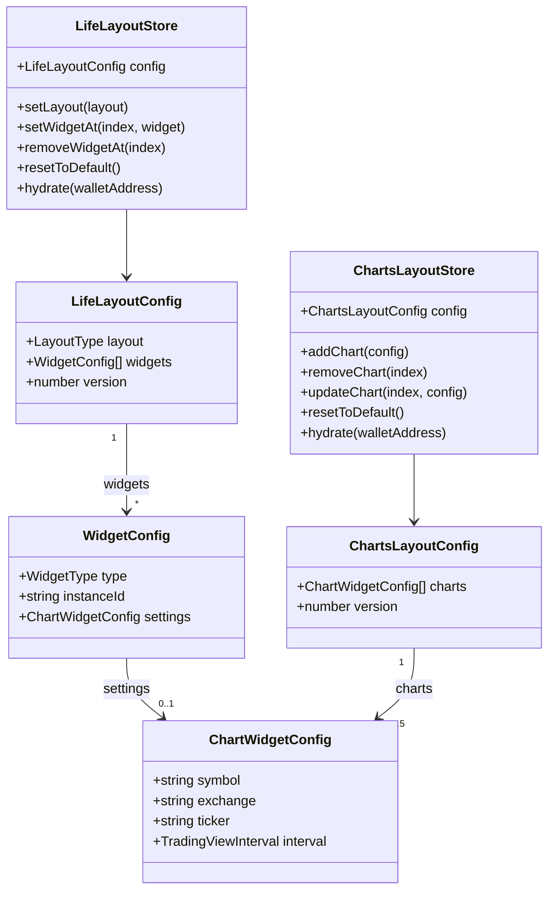
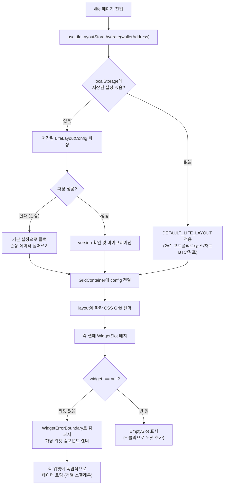
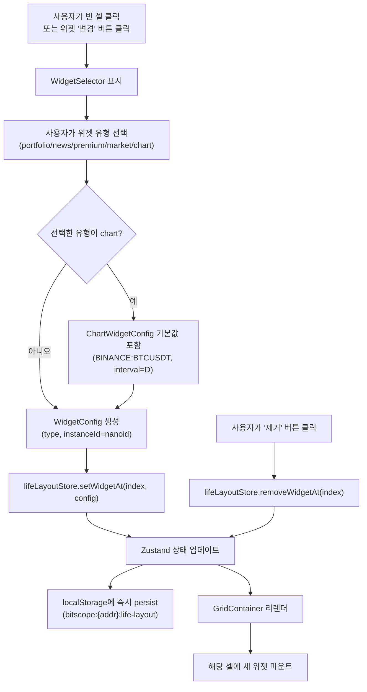
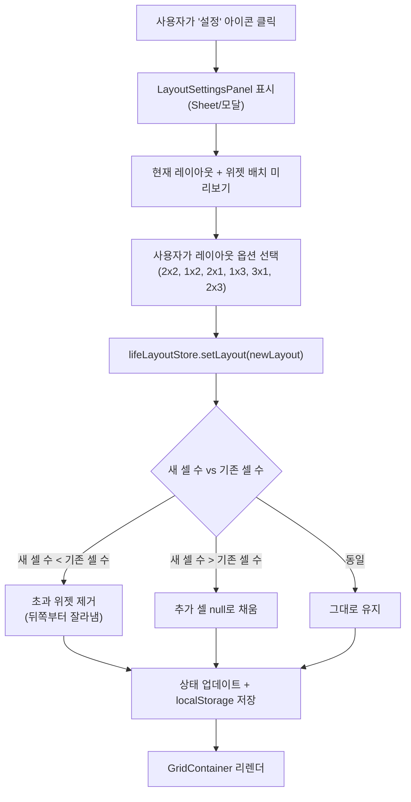
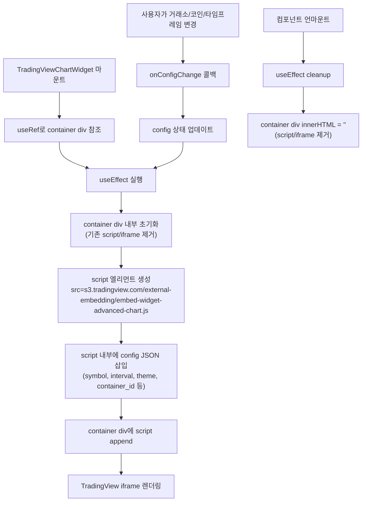
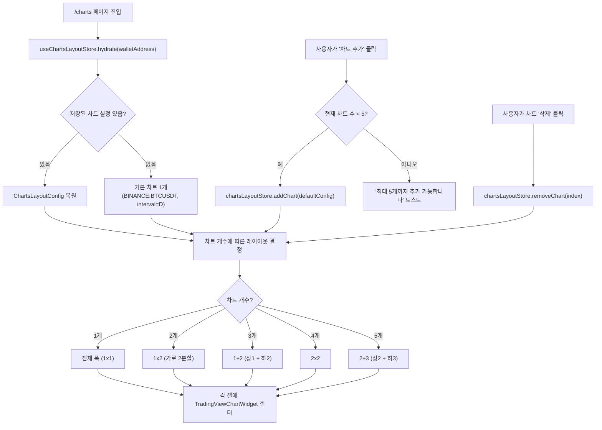
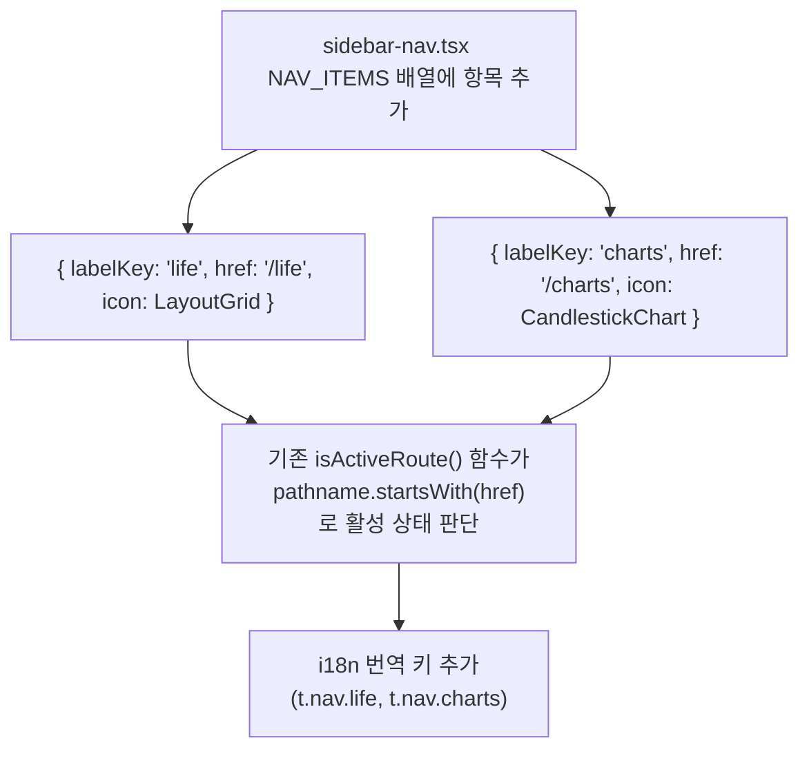

# 크립토 라이프 멀티뷰 대시보드 - 설계 문서

## 개요

BitScope "크립토 라이프" 멀티뷰 대시보드는 사용자가 암호화폐 관련 핵심 정보(포트폴리오, 뉴스, 김프, 마켓, 차트)를 하나의 화면에서 커스터마이즈 가능한 그리드 레이아웃으로 모니터링할 수 있는 기능이다. 추가로 TradingView 기반 차트 전용 페이지(`/charts`)를 제공하여 최대 5개 차트를 동시에 분석할 수 있다.

### 설계 목표

1. **독립적 위젯 아키텍처**: 각 위젯은 자체 데이터 페칭, 로딩, 에러 처리를 갖춘 독립 컴포넌트로, 하나의 위젯 오류가 다른 위젯에 영향을 주지 않는다.
2. **사용자 설정 지속성**: 레이아웃, 위젯 배치, 차트 설정을 지갑 주소별로 localStorage에 저장하여 재방문 시 복원한다.
3. **기존 코드 재사용**: 이미 구현된 대시보드(`/`), 뉴스(`/news`), 김프(`/premium`), 마켓(`/market`) 페이지의 로직과 훅을 위젯화하여 재사용한다.
4. **TradingView 무료 임베드**: 스크립트 기반 TradingView Advanced Chart Widget을 React 컴포넌트로 래핑하여 안전하게 관리한다.
5. **반응형 설계**: 모바일 1열, 태블릿 2열, 데스크톱 사용자 설정 그리드를 지원한다.

---

## 아키텍처 설계

### 시스템 아키텍처 다이어그램



### 데이터 흐름 다이어그램



---

## 컴포넌트 설계

### 컴포넌트 A: GridContainer

**파일**: `apps/web/components/life/grid-container.tsx`

- **책임**: 그리드 레이아웃 타입에 따라 CSS Grid를 렌더링하고, 각 셀에 WidgetSlot을 배치한다.
- **인터페이스**:
  ```typescript
  interface GridContainerProps {
    layout: LayoutType;
    widgets: WidgetConfig[];
    onWidgetChange: (index: number, widget: WidgetConfig | null) => void;
  }
  ```
- **의존성**: WidgetSlot, CSS Grid (Tailwind)

### 컴포넌트 B: WidgetSlot

**파일**: `apps/web/components/life/widget-slot.tsx`

- **책임**: 개별 셀의 래퍼로, 위젯 헤더(제목, 변경/제거 버튼), React Error Boundary, 로딩/에러 폴백을 관리한다.
- **인터페이스**:
  ```typescript
  interface WidgetSlotProps {
    widget: WidgetConfig | null;
    onChangeWidget: () => void;
    onRemoveWidget: () => void;
    onSelectWidget: (type: WidgetType) => void;
  }
  ```
- **의존성**: WidgetErrorBoundary, 위젯 컴포넌트들

### 컴포넌트 C: WidgetSelector

**파일**: `apps/web/components/life/widget-selector.tsx`

- **책임**: 사용 가능한 위젯 목록을 팝오버/모달로 표시하고, 사용자가 선택하면 콜백을 호출한다.
- **인터페이스**:
  ```typescript
  interface WidgetSelectorProps {
    onSelect: (type: WidgetType, config?: WidgetTypeConfig) => void;
    onClose: () => void;
  }
  ```
- **의존성**: shadcn/ui Dialog 또는 Popover

### 컴포넌트 D: LayoutSettingsPanel

**파일**: `apps/web/components/life/layout-settings-panel.tsx`

- **책임**: 레이아웃 선택, 위젯 배치 시각적 미리보기, "기본값 초기화" 기능을 제공하는 설정 패널이다.
- **인터페이스**:
  ```typescript
  interface LayoutSettingsPanelProps {
    currentLayout: LayoutType;
    currentWidgets: WidgetConfig[];
    onLayoutChange: (layout: LayoutType) => void;
    onWidgetChange: (index: number, widget: WidgetConfig | null) => void;
    onReset: () => void;
    onClose: () => void;
  }
  ```
- **의존성**: WidgetSelector, shadcn/ui Sheet

### 컴포넌트 E: PortfolioSummaryWidget

**파일**: `apps/web/components/life/widgets/portfolio-summary-widget.tsx`

- **책임**: 총 자산 평가액, 총 손익, 보유 코인 수, 상위 5개 코인을 간략히 표시한다. 기존 `usePortfolio` 훅과 `portfolioStore`를 재사용한다.
- **인터페이스**:
  ```typescript
  interface PortfolioSummaryWidgetProps {
    className?: string;
  }
  ```
- **의존성**: usePortfolio, usePortfolioStore, FormattedCurrency, ProfitLossIndicator

### 컴포넌트 F: NewsWidget

**파일**: `apps/web/components/life/widgets/news-widget.tsx`

- **책임**: 최신 뉴스 10개를 시간순으로 표시하며, 60초 간격으로 자동 갱신한다. 기존 `useTickerNews` 훅을 재사용한다.
- **인터페이스**:
  ```typescript
  interface NewsWidgetProps {
    className?: string;
  }
  ```
- **의존성**: useTickerNews, Link (뉴스 페이지 이동)

### 컴포넌트 G: PremiumWidget

**파일**: `apps/web/components/life/widgets/premium-widget.tsx`

- **책임**: 주요 코인(BTC, ETH, XRP 등)의 김치 프리미엄 비율을 테이블 형태로 표시한다. 기존 `useTopPremiums` 훅을 재사용한다.
- **인터페이스**:
  ```typescript
  interface PremiumWidgetProps {
    className?: string;
  }
  ```
- **의존성**: useTopPremiums, useRealTimePrice, FormattedCurrency

### 컴포넌트 H: MarketWidget

**파일**: `apps/web/components/life/widgets/market-widget.tsx`

- **책임**: 시가총액 상위 코인들의 시세(이름, 심볼, 현재가, 24h 변동률, 거래량)를 스크롤 가능한 테이블로 표시한다.
- **인터페이스**:
  ```typescript
  interface MarketWidgetProps {
    className?: string;
  }
  ```
- **의존성**: useRealTimePrice, usePriceStore, FormattedCurrency, FormattedPercent

### 컴포넌트 I: TradingViewChartWidget

**파일**: `apps/web/components/life/widgets/tradingview-chart-widget.tsx`

- **책임**: TradingView Advanced Chart Widget을 iframe으로 임베드하며, 거래소/코인/타임프레임 선택 컨트롤을 제공한다. 스크립트 라이프사이클을 useEffect로 관리한다.
- **인터페이스**:
  ```typescript
  interface TradingViewChartWidgetProps {
    /** 위젯 인스턴스별 고유 ID */
    instanceId: string;
    /** 초기 설정 */
    config?: ChartWidgetConfig;
    /** 설정 변경 콜백 */
    onConfigChange?: (config: ChartWidgetConfig) => void;
    className?: string;
  }
  ```
- **의존성**: TradingView CDN 스크립트 (`s3.tradingview.com/tv.js`)

### 컴포넌트 J: WidgetErrorBoundary

**파일**: `apps/web/components/life/widget-error-boundary.tsx`

- **책임**: React Error Boundary로 위젯 런타임 에러를 격리하고, 에러 발생 시 폴백 UI(에러 메시지 + 재시도 버튼)를 표시한다.
- **인터페이스**:
  ```typescript
  interface WidgetErrorBoundaryProps {
    children: React.ReactNode;
    widgetName: string;
    onRetry?: () => void;
  }
  ```
- **의존성**: React.Component (class 기반 Error Boundary)

### 컴포넌트 K: ChartsPage

**파일**: `apps/web/app/(dashboard)/charts/page.tsx`

- **책임**: 최대 5개 TradingView 차트를 동적 레이아웃(1개=전체폭, 2개=1x2, 3개=1+2, 4개=2x2, 5개=2+3)으로 표시한다. 차트 추가/삭제/설정 변경을 지원한다.
- **인터페이스**: Next.js 페이지 컴포넌트 (props 없음)
- **의존성**: TradingViewChartWidget, useChartsLayoutStore

---

## 데이터 모델

### 핵심 데이터 구조 정의

```typescript
// ===== 레이아웃 타입 =====

/** 그리드 레이아웃 유형 */
type LayoutType = '2x2' | '1x2' | '2x1' | '1x3' | '3x1' | '2x3';

/** 레이아웃별 셀 수 매핑 */
const LAYOUT_CELL_COUNT: Record<LayoutType, number> = {
  '2x2': 4,
  '1x2': 2,
  '2x1': 2,
  '1x3': 3,
  '3x1': 3,
  '2x3': 6,
};

/** 레이아웃별 CSS Grid 설정 */
const LAYOUT_GRID_CONFIG: Record<LayoutType, { cols: string; rows: string }> = {
  '2x2': { cols: 'grid-cols-2', rows: 'grid-rows-2' },
  '1x2': { cols: 'grid-cols-2', rows: 'grid-rows-1' },
  '2x1': { cols: 'grid-cols-1', rows: 'grid-rows-2' },
  '1x3': { cols: 'grid-cols-3', rows: 'grid-rows-1' },
  '3x1': { cols: 'grid-cols-1', rows: 'grid-rows-3' },
  '2x3': { cols: 'grid-cols-3', rows: 'grid-rows-2' },
};

// ===== 위젯 타입 =====

/** 위젯 유형 */
type WidgetType = 'portfolio' | 'news' | 'premium' | 'market' | 'chart';

/** 위젯 메타 정보 */
interface WidgetMeta {
  type: WidgetType;
  label: string;         // "포트폴리오 요약"
  icon: string;          // Lucide 아이콘명
  description: string;   // 위젯 설명
  allowMultiple: boolean; // 동일 유형 복수 배치 가능 여부
}

/** 위젯 배치 설정 (각 셀에 저장) */
interface WidgetConfig {
  type: WidgetType;
  /** 위젯 인스턴스별 고유 ID (같은 유형 복수 배치 구분) */
  instanceId: string;
  /** 위젯 유형별 추가 설정 */
  settings?: ChartWidgetConfig; // 현재 차트 위젯만 추가 설정 존재
}

/** TradingView 차트 위젯 설정 */
interface ChartWidgetConfig {
  /** TradingView 심볼 (예: "BINANCE:BTCUSDT") */
  symbol: string;
  /** 거래소 프리픽스 (예: "BINANCE") */
  exchange: string;
  /** 코인/자산 심볼 (예: "BTCUSDT") */
  ticker: string;
  /** 타임프레임 (TradingView interval) */
  interval: TradingViewInterval;
}

/** TradingView 타임프레임 */
type TradingViewInterval = '1' | '5' | '15' | '60' | '240' | 'D';

// ===== localStorage 저장 구조 =====

/** 크립토 라이프 페이지 설정 (localStorage) */
interface LifeLayoutConfig {
  /** 그리드 레이아웃 유형 */
  layout: LayoutType;
  /** 각 셀에 배치된 위젯 (null = 빈 셀) */
  widgets: (WidgetConfig | null)[];
  /** 설정 버전 (마이그레이션용) */
  version: number;
}

/** 차트 전용 페이지 설정 (localStorage) */
interface ChartsLayoutConfig {
  /** 차트 설정 목록 (최대 5개) */
  charts: ChartWidgetConfig[];
  /** 설정 버전 */
  version: number;
}

// ===== TradingView 심볼 프리셋 =====

/** 거래소별 사용 가능한 심볼 프리셋 */
interface TradingViewExchangePreset {
  exchange: string;       // "BINANCE"
  displayName: string;    // "바이낸스"
  symbols: TradingViewSymbolPreset[];
}

interface TradingViewSymbolPreset {
  ticker: string;         // "BTCUSDT"
  displayName: string;    // "BTC/USDT"
  category: 'crypto' | 'stock' | 'commodity' | 'index';
}
```

### 데이터 모델 다이어그램



---

## 비즈니스 프로세스

### 프로세스 1: 크립토 라이프 페이지 초기 로딩



### 프로세스 2: 위젯 배치/교체/제거



### 프로세스 3: 레이아웃 변경



### 프로세스 4: TradingView 차트 위젯 라이프사이클



### 프로세스 5: 차트 전용 페이지 (/charts)



### 프로세스 6: 사이드바 네비게이션 업데이트



---

## 에러 처리 전략

### 위젯 레벨 에러 격리

```
┌─────────────────────────────────────────────────┐
│ GridContainer                                    │
│  ┌─────────────────┐  ┌─────────────────┐      │
│  │ WidgetSlot #0    │  │ WidgetSlot #1    │      │
│  │ ┌─────────────┐ │  │ ┌─────────────┐ │      │
│  │ │ErrorBoundary│ │  │ │ErrorBoundary│ │      │
│  │ │ ┌─────────┐ │ │  │ │ ┌─────────┐ │ │      │
│  │ │ │Portfolio │ │ │  │ │ │ News    │ │ │      │
│  │ │ │ Widget   │ │ │  │ │ │ Widget  │ │ │      │
│  │ │ └─────────┘ │ │  │ │ └─────────┘ │ │      │
│  │ └─────────────┘ │  │ └─────────────┘ │      │
│  └─────────────────┘  └─────────────────┘      │
│  ┌─────────────────┐  ┌─────────────────┐      │
│  │ WidgetSlot #2    │  │ WidgetSlot #3    │      │
│  │ ┌─────────────┐ │  │ ┌─────────────┐ │      │
│  │ │ErrorBoundary│ │  │ │ErrorBoundary│ │      │
│  │ │ ┌─────────┐ │ │  │ │ ┌─────────┐ │ │      │
│  │ │ │ Chart   │ │ │  │ │ │ Premium │ │ │      │
│  │ │ │ Widget  │ │ │  │ │ │ Widget  │ │ │      │
│  │ │ └─────────┘ │ │  │ │ └─────────┘ │ │      │
│  │ └─────────────┘ │  │ └─────────────┘ │      │
│  └─────────────────┘  └─────────────────┘      │
└─────────────────────────────────────────────────┘
```

### 에러 유형별 처리 전략

| 에러 유형 | 발생 위치 | 처리 방법 |
|-----------|-----------|-----------|
| 데이터 페칭 실패 | 각 위젯 내부 훅 | TanStack Query의 retry(1회) + 위젯 내 에러 UI 표시. 다른 위젯 영향 없음. |
| TradingView 스크립트 로딩 실패 | ChartWidget | 로딩 타임아웃(15초) 감지 후 "차트를 불러올 수 없습니다" + 재시도 버튼 표시. |
| 위젯 런타임 에러 | 위젯 컴포넌트 | WidgetErrorBoundary가 catch하여 에러 폴백 UI 표시. 나머지 위젯 정상 작동. |
| localStorage 파싱 실패 | Store hydrate | try-catch로 감싸서 실패 시 기본 설정으로 폴백. 손상 데이터 덮어쓰기. |
| 레이아웃 설정 무결성 오류 | Store hydrate | version 필드로 스키마 검증. 불일치 시 기본 설정 폴백. |

### TradingView 스크립트 관리

- **마운트**: `useEffect`에서 `<script>` 엘리먼트를 동적 생성하여 container ref에 append한다.
- **설정 변경**: config가 변경되면 cleanup에서 container의 innerHTML을 비운 후, 새 script를 생성하여 다시 append한다.
- **언마운트**: cleanup 함수에서 container의 innerHTML을 비워 script/iframe을 제거한다.
- **메모리 누수 방지**: script의 `onload` 이벤트 리스너는 useEffect cleanup에서 제거한다. container ref가 null이 아닌지 항상 확인한다.

---

## 테스팅 전략

### 단위 테스트

| 대상 | 테스트 항목 | 도구 |
|------|------------|------|
| `useLifeLayoutStore` | hydrate, setLayout, setWidgetAt, removeWidgetAt, resetToDefault | Vitest |
| `useChartsLayoutStore` | hydrate, addChart, removeChart, updateChart | Vitest |
| `LAYOUT_CELL_COUNT` | 각 LayoutType에 대한 셀 수 정확성 | Vitest |
| `getDefaultWidgets()` | 기본 위젯 배열 정확성 | Vitest |
| localStorage 파싱 로직 | 정상 데이터, 손상 데이터, 빈 데이터 | Vitest |

### 통합 테스트

| 대상 | 테스트 항목 | 도구 |
|------|------------|------|
| GridContainer | 레이아웃 변경 시 CSS Grid 클래스 정확성 | React Testing Library |
| WidgetSlot | 빈 셀 클릭 시 WidgetSelector 표시 | React Testing Library |
| WidgetErrorBoundary | 자식 에러 시 폴백 UI 표시 | React Testing Library |
| 위젯 교체 흐름 | 위젯 선택 -> 상태 업데이트 -> DOM 반영 | React Testing Library |

### E2E 테스트 (수동)

| 시나리오 | 검증 항목 |
|----------|-----------|
| 최초 방문 | 기본 2x2 레이아웃(포트폴리오/뉴스/차트/김프) 표시 |
| 레이아웃 변경 | 2x2 -> 1x3 전환 시 위젯 재배치 |
| 위젯 교체 | 뉴스 위젯을 마켓 위젯으로 교체 |
| 설정 유지 | 새로고침 후 변경된 설정 유지 |
| 차트 페이지 | 5개 차트 추가 후 6번째 추가 시 에러 메시지 |
| 반응형 | 768px 미만에서 단일 컬럼 전환 |
| 에러 격리 | 1개 위젯 에러 시 나머지 위젯 정상 작동 |

---

## 설계 결정 및 근거

### 결정 1: CSS Grid (Tailwind) vs 드래그 앤 드롭 라이브러리

- **선택**: CSS Grid (Tailwind 클래스)
- **근거**: 요구사항에서 drag-and-drop은 불필요하며, 설정 UI로 배치를 관리한다고 명시되어 있다. CSS Grid는 추가 라이브러리 의존 없이 반응형 레이아웃을 구현할 수 있으며, 번들 사이즈 증가가 없다.

### 결정 2: TradingView 임베드 방식 - 공식 Script vs npm 패키지

- **선택**: 공식 TradingView Script 기반 임베드 (`s3.tradingview.com/external-embedding/embed-widget-advanced-chart.js`)
- **근거**: npm 패키지(react-tradingview-widget 등)는 유지보수가 불안정하고, TradingView API 변경 시 업데이트가 늦을 수 있다. 공식 스크립트는 TradingView가 직접 관리하므로 항상 최신 상태를 보장한다. useEffect + useRef 패턴으로 React에서 안전하게 관리할 수 있다.

### 결정 3: Zustand persist 미들웨어 vs 수동 localStorage 관리

- **선택**: Zustand persist 미들웨어 사용
- **근거**: Zustand의 `persist` 미들웨어를 사용하면 localStorage 읽기/쓰기, 직렬화/역직렬화를 자동으로 처리하며, `partialize`로 필요한 부분만 저장할 수 있다. 단, 지갑 주소별 저장 키를 동적으로 변경해야 하므로 `name` 옵션을 동적으로 설정하는 커스텀 storage를 구현한다.

### 결정 4: 위젯 컴포넌트 구조 - 기존 페이지 임베드 vs 전용 위젯 컴포넌트

- **선택**: 전용 위젯 컴포넌트를 새로 작성하되, 기존 훅(usePortfolio, useTickerNews, useTopPremiums 등)을 재사용
- **근거**: 기존 페이지 컴포넌트는 전체 페이지 레이아웃에 맞춰 설계되어 위젯 영역에 맞지 않는다. 위젯용으로 간결한 전용 컴포넌트를 작성하되, 데이터 로직은 기존 훅을 그대로 재사용하여 코드 중복을 최소화한다.

### 결정 5: 위젯 인스턴스 ID 생성 방식

- **선택**: `nanoid` (또는 `crypto.randomUUID()`)
- **근거**: 동일 유형의 위젯을 복수 배치할 수 있으므로(예: 차트 위젯 2개를 다른 코인으로), 각 인스턴스를 고유하게 식별할 ID가 필요하다. nanoid는 가볍고 충돌 확률이 무시할 수 있을 정도로 낮다.

---

## 파일 구조 요약

```
apps/web/
├── app/(dashboard)/
│   ├── life/
│   │   └── page.tsx                          # 크립토 라이프 멀티뷰 페이지
│   └── charts/
│       └── page.tsx                          # 차트 전용 페이지
├── components/
│   └── life/
│       ├── grid-container.tsx                # CSS Grid 렌더러
│       ├── widget-slot.tsx                   # 셀 래퍼 (헤더 + 에러 바운더리)
│       ├── widget-selector.tsx               # 위젯 선택 팝오버
│       ├── widget-error-boundary.tsx         # React Error Boundary
│       ├── layout-settings-panel.tsx         # 레이아웃 설정 Sheet
│       └── widgets/
│           ├── portfolio-summary-widget.tsx   # 포트폴리오 요약
│           ├── news-widget.tsx               # 뉴스/속보
│           ├── premium-widget.tsx            # 김치 프리미엄
│           ├── market-widget.tsx             # 마켓 시세
│           └── tradingview-chart-widget.tsx   # TradingView 차트
├── store/
│   ├── life-layout-store.ts                  # 크립토 라이프 레이아웃 Zustand 스토어
│   └── charts-layout-store.ts                # 차트 페이지 Zustand 스토어
├── lib/
│   └── life/
│       ├── types.ts                          # 공유 타입 (LayoutType, WidgetType 등)
│       ├── constants.ts                      # 상수 (기본 레이아웃, 심볼 프리셋 등)
│       └── tradingview-symbols.ts            # TradingView 심볼 프리셋 데이터
└── components/layout/
    └── sidebar-nav.tsx                       # 사이드바 메뉴 항목 추가 (수정)
```
