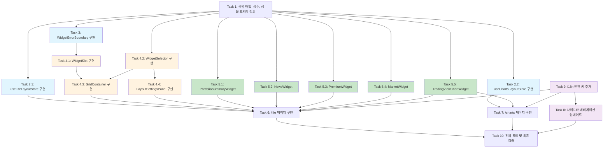

# 크립토 라이프 멀티뷰 대시보드 - 구현 계획

## 구현 태스크

- [ ] 1. 공유 타입, 상수, TradingView 심볼 프리셋 정의
  - `apps/web/lib/life/types.ts` 생성: `LayoutType`, `WidgetType`, `WidgetMeta`, `WidgetConfig`, `ChartWidgetConfig`, `TradingViewInterval`, `LifeLayoutConfig`, `ChartsLayoutConfig`, `TradingViewExchangePreset`, `TradingViewSymbolPreset` 타입 정의
  - `apps/web/lib/life/constants.ts` 생성: `LAYOUT_CELL_COUNT`, `LAYOUT_GRID_CONFIG`, `WIDGET_META_LIST`, `DEFAULT_LIFE_LAYOUT`, `DEFAULT_CHARTS_LAYOUT`, `DEFAULT_CHART_CONFIG` 상수 정의
  - `apps/web/lib/life/tradingview-symbols.ts` 생성: 거래소별 심볼 프리셋 데이터 (BINANCE, UPBIT 등 + 전통 자산: NAS100, KOSPI, XAUUSD, USOIL)
  - 타입/상수에 대한 단위 테스트 작성 (`LAYOUT_CELL_COUNT` 정확성, `getDefaultWidgets()` 결과 검증)
  - _Requirements: 2.1, 2.2, 8.1, 8.7, 10.8_

- [ ] 2. Zustand 스토어 구현
- [ ] 2.1 `useLifeLayoutStore` 구현
  - `apps/web/store/life-layout-store.ts` 생성
  - Zustand + persist 미들웨어로 `LifeLayoutConfig` 상태 관리
  - 지갑 주소별 동적 localStorage 키 (`bitscope:{addr}:life-layout`)를 위한 커스텀 storage 구현
  - `hydrate(walletAddress)`, `setLayout(layout)`, `setWidgetAt(index, widget)`, `removeWidgetAt(index)`, `resetToDefault()` 액션 구현
  - 레이아웃 변경 시 셀 수 차이 처리 로직 (초과 위젯 제거, 부족 셀 null 채움)
  - localStorage 파싱 실패 시 기본 설정 폴백 및 손상 데이터 덮어쓰기 로직
  - 단위 테스트 작성: hydrate, setLayout, setWidgetAt, removeWidgetAt, resetToDefault, 손상 데이터 폴백
  - _Requirements: 1.3, 1.4, 2.3, 2.4, 3.5, 11.1, 11.2, 11.4, 11.5, 11.6_

- [ ] 2.2 `useChartsLayoutStore` 구현
  - `apps/web/store/charts-layout-store.ts` 생성
  - Zustand + persist 미들웨어로 `ChartsLayoutConfig` 상태 관리
  - 지갑 주소별 동적 localStorage 키 (`bitscope:{addr}:charts-layout`)
  - `hydrate(walletAddress)`, `addChart(config)`, `removeChart(index)`, `updateChart(index, config)`, `resetToDefault()` 액션 구현
  - 최대 5개 차트 제한 로직
  - 단위 테스트 작성: hydrate, addChart(5개 제한 포함), removeChart, updateChart, resetToDefault
  - _Requirements: 10.3, 10.5, 10.7, 11.3, 11.4, 11.5, 11.6_

- [ ] 3. WidgetErrorBoundary 컴포넌트 구현
  - `apps/web/components/life/widget-error-boundary.tsx` 생성
  - React class 기반 Error Boundary로 위젯 런타임 에러 격리
  - 에러 발생 시 폴백 UI (에러 메시지 + 재시도 버튼) 표시
  - `widgetName` prop으로 어떤 위젯에서 에러가 발생했는지 표시
  - `onRetry` 콜백으로 `resetErrorBoundary` (key 변경) 지원
  - 통합 테스트: 자식 에러 시 폴백 UI 표시, 재시도 시 자식 리마운트 검증
  - _Requirements: NFR-4.1, NFR-4.2, NFR-4.3_

- [ ] 4. 그리드 레이아웃 시스템 구현
- [ ] 4.1 `WidgetSlot` 컴포넌트 구현
  - `apps/web/components/life/widget-slot.tsx` 생성
  - 위젯이 있을 때: 헤더(위젯 제목, 변경/제거 버튼) + WidgetErrorBoundary로 감싼 위젯 렌더링
  - 위젯이 없을 때(null): 빈 셀 UI (+ 클릭으로 WidgetSelector 트리거)
  - 개별 로딩 스켈레톤 지원 (Suspense fallback)
  - ARIA 레이블, 키보드 접근성 (탭 이동, 버튼 조작)
  - 통합 테스트: 빈 셀 클릭 시 onSelectWidget 호출, 변경/제거 버튼 동작 검증
  - _Requirements: 1.5, 3.1, 3.3, 3.4, NFR-3.1, NFR-3.2_

- [ ] 4.2 `WidgetSelector` 컴포넌트 구현
  - `apps/web/components/life/widget-selector.tsx` 생성
  - 사용 가능한 위젯 목록을 팝오버/다이얼로그로 표시 (shadcn/ui Dialog 또는 Popover 사용)
  - 각 위젯 유형별 아이콘, 이름, 설명 표시
  - 동일 유형 복수 배치 허용 (allowMultiple 기반)
  - 사용자 선택 시 `onSelect(type, config?)` 콜백 호출
  - _Requirements: 3.1, 3.2, 3.6, 3.7_

- [ ] 4.3 `GridContainer` 컴포넌트 구현
  - `apps/web/components/life/grid-container.tsx` 생성
  - `LayoutType`에 따라 CSS Grid (Tailwind 클래스) 렌더링
  - 각 셀에 `WidgetSlot` 배치
  - 반응형: 768px 미만 단일 컬럼, 768px~1024px 최대 2컬럼, 1024px 이상 사용자 설정 그리드
  - 통합 테스트: 레이아웃 변경 시 CSS Grid 클래스 정확성 검증
  - _Requirements: 2.1, 2.3, 2.5, NFR-2.1, NFR-2.2, NFR-2.3_

- [ ] 4.4 `LayoutSettingsPanel` 컴포넌트 구현
  - `apps/web/components/life/layout-settings-panel.tsx` 생성
  - shadcn/ui Sheet로 사이드 패널 구현
  - 레이아웃 옵션 선택 (2x2, 1x2, 2x1, 1x3, 3x1, 2x3) 시각적 미리보기
  - 현재 위젯 배치 시각적 미리보기 (각 셀에 배치된 위젯 표시)
  - "기본값으로 초기화" 버튼
  - 변경 사항 즉시 적용 후 패널 닫기
  - _Requirements: 2.2, 9.1, 9.2, 9.3, 9.4, 9.5_

- [ ] 5. 위젯 컴포넌트 구현
- [ ] 5.1 `PortfolioSummaryWidget` 구현
  - `apps/web/components/life/widgets/portfolio-summary-widget.tsx` 생성
  - 기존 `usePortfolio` 훅, `usePortfolioStore` 재사용
  - 총 자산 평가액(KRW), 총 손익(KRW 및 %), 보유 코인 수 표시
  - 보유 비중 상위 5개 코인 (이름, 수량, 현재가, 수익률) 간략 표시
  - 실시간 시세 업데이트 시 자동 갱신
  - API 키 미등록 시 안내 메시지 + 설정 페이지 링크 표시
  - "더보기" 링크 -> `/` (대시보드) 이동
  - _Requirements: 4.1, 4.2, 4.3, 4.4, 4.5_

- [ ] 5.2 `NewsWidget` 구현
  - `apps/web/components/life/widgets/news-widget.tsx` 생성
  - 기존 `useNews` 훅 (useTickerNews / useNewsList) 재사용
  - 최신 뉴스 10개 시간순 표시 (제목, 출처, 게시 시간)
  - 뉴스 항목 클릭 시 원문 링크 새 탭 열기
  - 60초 간격 자동 갱신 (TanStack Query refetchInterval)
  - 새 뉴스 알림 표시
  - "더보기" 링크 -> `/news` 이동
  - _Requirements: 5.1, 5.2, 5.3, 5.4, 5.5, 5.6_

- [ ] 5.3 `PremiumWidget` 구현
  - `apps/web/components/life/widgets/premium-widget.tsx` 생성
  - 기존 `useKimchiPremium` 훅 (useTopPremiums) 재사용
  - 주요 코인(BTC, ETH, XRP 등) 김치 프리미엄 비율(%) 테이블 형태 표시
  - 각 코인별 국내가, 해외가(USD 환산 KRW), 프리미엄 비율 표시
  - 실시간 시세 업데이트 시 자동 갱신
  - 양수 빨간색, 음수 파란색 색상 구분
  - "더보기" 링크 -> `/premium` 이동
  - _Requirements: 6.1, 6.2, 6.3, 6.4, 6.5_

- [ ] 5.4 `MarketWidget` 구현
  - `apps/web/components/life/widgets/market-widget.tsx` 생성
  - 기존 `useRealTimePrice` 훅, `usePriceStore` 재사용
  - 시가총액 상위 코인 시세 테이블 (이름, 심볼, 현재가 KRW, 24h 변동률, 거래량)
  - 실시간 시세 업데이트 시 자동 갱신
  - 24h 변동률 양수 빨간색, 음수 파란색
  - 코인 행 클릭 시 `/market` 이동
  - 위젯 영역에 맞게 스크롤 가능한 목록
  - _Requirements: 7.1, 7.2, 7.3, 7.4, 7.5, 7.6_

- [ ] 5.5 `TradingViewChartWidget` 구현
  - `apps/web/components/life/widgets/tradingview-chart-widget.tsx` 생성
  - TradingView Advanced Chart Widget 스크립트 동적 로딩 (useEffect + useRef)
  - 위젯 상단 거래소 선택 드롭다운 (Binance, Upbit 등 TradingView 지원 거래소)
  - 코인(심볼) 선택 드롭다운 (BTC, ETH, SOL 등 + 전통 자산: NAS100, KOSPI, XAUUSD, USOIL)
  - 타임프레임 선택 (1분, 5분, 15분, 1시간, 4시간, 1일)
  - 설정 변경 시 차트 즉시 업데이트 (container innerHTML 초기화 후 새 script append)
  - 설정 변경 콜백 (`onConfigChange`)으로 부모에 전달
  - 로딩 타임아웃(15초) 감지 -> "차트를 불러올 수 없습니다" + 재시도 버튼
  - 컴포넌트 언마운트 시 cleanup (script/iframe 제거, 메모리 누수 방지)
  - 각 인스턴스별 독립적 설정 (`instanceId` 기반)
  - _Requirements: 8.1, 8.2, 8.3, 8.4, 8.5, 8.6, 8.7, 8.8, NFR-1.2, NFR-4.2_

- [ ] 6. `/life` 페이지 (크립토 라이프 멀티뷰) 구현
  - `apps/web/app/(dashboard)/life/page.tsx` 생성
  - `useLifeLayoutStore` 연동: 페이지 진입 시 `hydrate(walletAddress)` 호출
  - `GridContainer`에 store의 layout, widgets 전달
  - 설정 아이콘 클릭 시 `LayoutSettingsPanel` 표시
  - 위젯 추가/교체/제거 시 store 액션 호출 → localStorage 자동 persist
  - 위젯 인스턴스 ID 생성 (nanoid 또는 crypto.randomUUID)
  - 기본 레이아웃: 2x2 (좌상단=포트폴리오, 우상단=뉴스, 좌하단=차트BTC, 우하단=김프)
  - _Requirements: 1.1, 1.2, 1.3, 1.4, 1.5, 3.5, 9.1_

- [ ] 7. `/charts` 페이지 (차트 전용) 구현
  - `apps/web/app/(dashboard)/charts/page.tsx` 생성
  - `useChartsLayoutStore` 연동: 페이지 진입 시 `hydrate(walletAddress)` 호출
  - TradingView Advanced Chart Widget 사용
  - 차트 개수에 따른 동적 레이아웃 (1개=전체폭, 2개=1x2, 3개=1+2, 4개=2x2, 5개=2+3)
  - 차트 추가 버튼 (최대 5개, 초과 시 "최대 5개까지 추가 가능합니다" 메시지)
  - 차트 삭제 버튼 (삭제 후 남은 차트 재배치)
  - 각 차트별 독립적 거래소/코인/타임프레임 선택 컨트롤
  - 암호화폐 + 전통 자산 심볼 지원
  - 설정 변경 시 localStorage 자동 저장
  - _Requirements: 10.1, 10.2, 10.3, 10.4, 10.5, 10.6, 10.7, 10.8, 10.9_

- [ ] 8. 사이드바 네비게이션 업데이트
  - `apps/web/components/layout/sidebar-nav.tsx` 수정: NAV_ITEMS에 "크립토 라이프" (`/life`, LayoutGrid 아이콘), "차트" (`/charts`, CandlestickChart 아이콘) 메뉴 추가
  - `apps/web/components/layout/bottom-tab-nav.tsx` 필요 시 수정 (모바일 탭에 메뉴 추가 고려)
  - 기존 `isActiveRoute()` 함수가 `/life`, `/charts` 경로에 대해 정상 동작하는지 확인
  - 기존 사이드바 테스트 (`sidebar-nav.test.tsx`) 업데이트하여 새 메뉴 항목 검증
  - _Requirements: 12.1, 12.2, 12.3, 12.4_

- [ ] 9. i18n 번역 키 추가
  - `apps/web/lib/i18n/ko.ts` 수정: `nav.life`, `nav.charts` 및 크립토 라이프/차트 관련 번역 키 추가 (위젯 이름, 설정 UI 텍스트, 에러 메시지 등)
  - `apps/web/lib/i18n/en.ts` 수정: 동일 키에 대한 영어 번역 추가
  - `navAria` 섹션에 접근성 레이블 추가 (`navAria.life`, `navAria.charts`)
  - Messages 타입 호환성 확인 (ko.ts의 as const 타입과 en.ts의 Messages 타입 일치)
  - _Requirements: 12.1, 12.2, NFR-3.1_

- [ ] 10. 전체 통합 및 최종 검증
  - `/life` 페이지에서 모든 위젯이 독립적으로 데이터 로딩하고, 한 위젯 에러가 다른 위젯에 영향 없는지 확인하는 통합 테스트 작성
  - `/charts` 페이지에서 5개 차트 동시 렌더링 시 레이아웃 정확성 검증 테스트 작성
  - 레이아웃 변경 -> 위젯 재배치 -> localStorage 저장 -> 페이지 재방문 시 복원 흐름 통합 테스트
  - 반응형 브레이크포인트 (768px, 1024px) 검증 테스트
  - 지갑 주소 변경 시 설정 전환 검증 테스트
  - _Requirements: 1.1~1.5, 2.1~2.5, 11.1~11.6, NFR-1.1~NFR-1.4, NFR-2.1~NFR-2.3, NFR-4.1~NFR-4.3_

---

## 태스크 의존성 다이어그램

**범례:**
- 파란색: Zustand 스토어 및 에러 바운더리 (기반 인프라)
- 녹색: 위젯 컴포넌트 (병렬 구현 가능)
- 주황색: 그리드 레이아웃 시스템
- 보라색: 네비게이션 및 i18n
