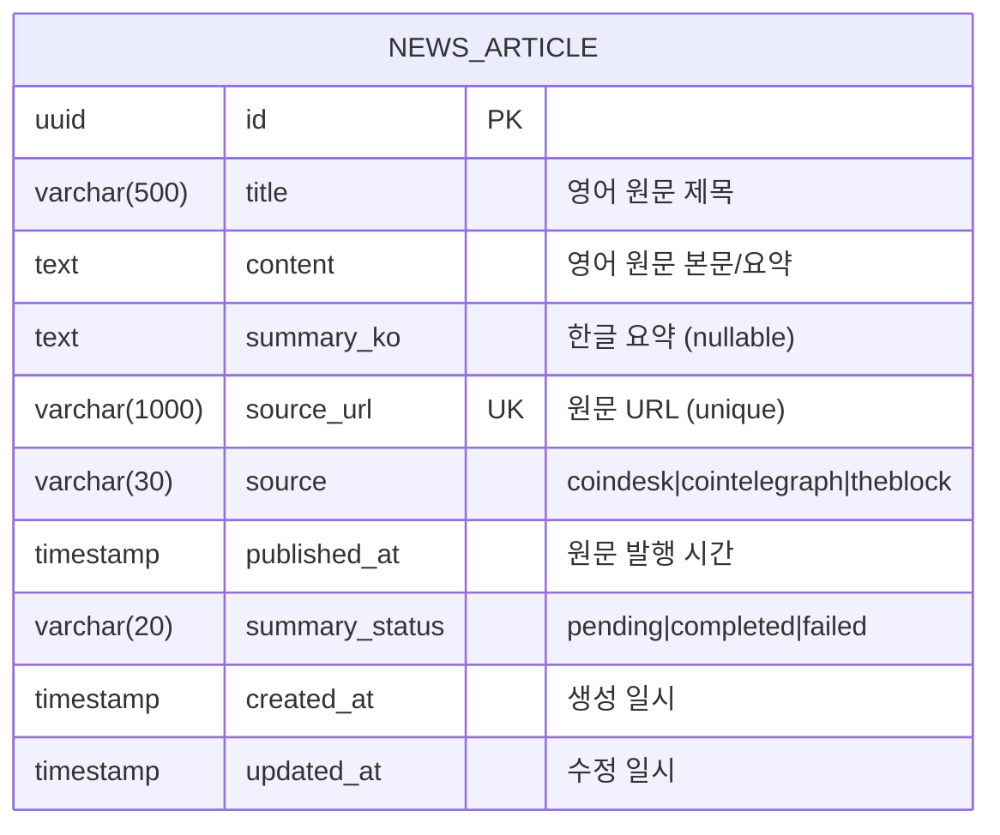
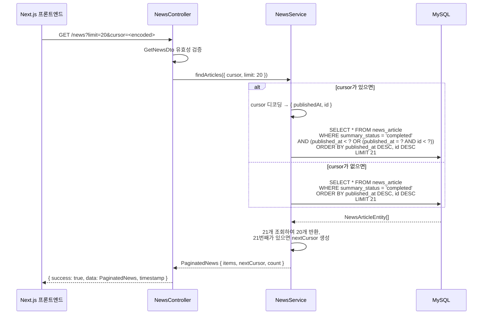
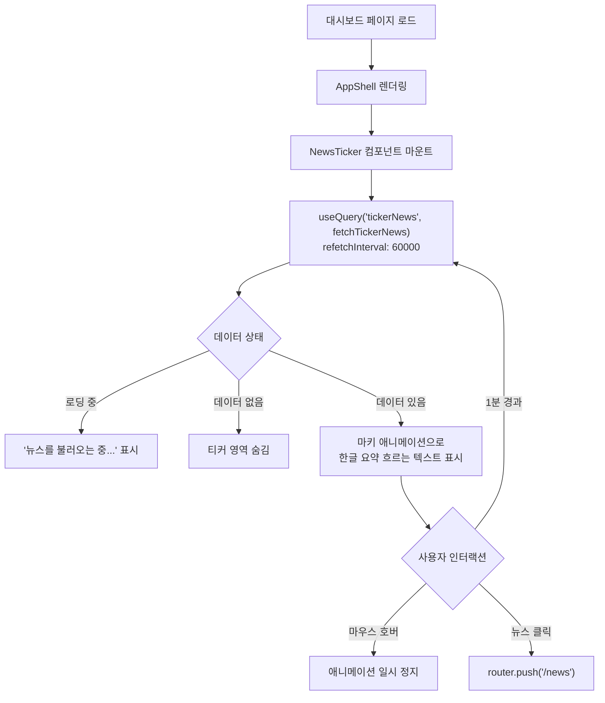

# 크립토 뉴스 피드 설계 문서

## 개요

BitScope 대시보드에 크립토 뉴스 피드 기능을 추가한다. NestJS 백엔드에서 CoinDesk, CoinTelegraph, The Block 3개 영어 RSS 소스를 주기적으로 수집하고, Claude Haiku API로 한글 요약 번역을 생성하여 MySQL에 저장한다. 프론트엔드에서는 대시보드 상단 티커(흐르는 텍스트)와 별도 `/news` 페이지로 뉴스를 제공한다.

### 설계 목표

- 기존 BitScope 아키텍처(NestJS 모듈, TypeORM 엔티티, Next.js App Router)와 일관된 패턴 유지
- RSS 수집/AI 요약 실패가 기존 서비스(포트폴리오 조회 등)에 영향을 주지 않는 격리된 구조
- OCI Free Tier 리소스 제약 하에서의 비용 효율적 운영

---

## 아키텍처 설계

### 시스템 아키텍처 다이어그램

```mermaid
graph TB
    subgraph External["외부 서비스"]
        RSS_CD[CoinDesk RSS]
        RSS_CT[CoinTelegraph RSS]
        RSS_TB[The Block RSS]
        CLAUDE[Claude Haiku API]
    end

    subgraph NestJS["NestJS 백엔드 (apps/api)"]
        CRON[NewsCronService<br/>@Cron 5~10분 간격]
        FETCH[RssFetcherService<br/>RSS 파싱]
        SUMMARY[NewsSummaryService<br/>AI 요약 번역]
        NEWS_SVC[NewsService<br/>비즈니스 로직]
        NEWS_CTRL[NewsController<br/>REST API]
        CLEANUP[NewsCleanupService<br/>30일 삭제 cron]
    end

    subgraph Database["MySQL"]
        NEWS_TABLE[(news_article 테이블)]
    end

    subgraph NextJS["Next.js 프론트엔드 (apps/web)"]
        TICKER[NewsTicker 컴포넌트<br/>대시보드 상단]
        NEWS_PAGE[/news 페이지<br/>뉴스 목록]
    end

    CRON --> FETCH
    FETCH --> RSS_CD
    FETCH --> RSS_CT
    FETCH --> RSS_TB
    CRON --> SUMMARY
    SUMMARY --> CLAUDE
    CRON --> NEWS_SVC
    NEWS_SVC --> NEWS_TABLE
    CLEANUP --> NEWS_TABLE
    NEWS_CTRL --> NEWS_SVC
    TICKER --> NEWS_CTRL
    NEWS_PAGE --> NEWS_CTRL
```

### 데이터 흐름 다이어그램

```mermaid
graph LR
    A[RSS 피드 3개 소스] -->|rss-parser| B[RssFetcherService]
    B -->|RssArticle[]| C[NewsCronService]
    C -->|중복 체크| D[(news_article DB)]
    C -->|새 기사 저장| D
    D -->|pending 기사 조회| E[NewsSummaryService]
    E -->|영어 원문| F[Claude Haiku API]
    F -->|한글 요약| E
    E -->|요약 결과 업데이트| D
    D -->|completed 기사| G[NewsController]
    G -->|GET /api/news| H[뉴스 목록 페이지]
    G -->|GET /api/news/ticker| I[대시보드 티커]
```

---

## 컴포넌트 설계

### 백엔드 컴포넌트 (apps/api)

#### 1. NewsModule (`src/modules/news/news.module.ts`)

- **책임:** 뉴스 기능의 NestJS 모듈. 모든 뉴스 관련 서비스, 컨트롤러, 엔티티를 캡슐화한다.
- **인터페이스:** NestJS Module 데코레이터로 등록
- **의존성:** TypeOrmModule.forFeature([NewsArticleEntity]), ConfigModule

```typescript
@Module({
  imports: [TypeOrmModule.forFeature([NewsArticleEntity])],
  controllers: [NewsController],
  providers: [
    NewsService,
    NewsCronService,
    RssFetcherService,
    NewsSummaryService,
    NewsCleanupService,
  ],
  exports: [NewsService],
})
export class NewsModule {}
```

#### 2. RssFetcherService (`src/modules/news/services/rss-fetcher.service.ts`)

- **책임:** 외부 RSS 피드를 파싱하여 구조화된 데이터로 변환한다.
- **인터페이스:**
  ```typescript
  fetchAll(): Promise<RssArticle[]>
  fetchFromSource(source: NewsSource): Promise<RssArticle[]>
  ```
- **의존성:** `rss-parser` npm 패키지, ConfigService (RSS URL 설정)
- **설계 결정:**
  - `rss-parser` 패키지를 사용하는 이유: 검증된 RSS/Atom 파싱 라이브러리로, 다양한 피드 형식을 자동 처리한다.
  - 각 소스별 파싱은 독립적으로 실행하고, 개별 소스 실패 시 나머지 소스 수집을 계속 진행한다.
  - RSS 요청 타임아웃은 10초로 설정하여 느린 응답이 전체 cron을 블로킹하지 않도록 한다.

#### 3. NewsSummaryService (`src/modules/news/services/news-summary.service.ts`)

- **책임:** Claude Haiku API를 호출하여 영어 뉴스를 한글 3~5문장으로 요약 번역한다.
- **인터페이스:**
  ```typescript
  summarize(article: { title: string; content: string }): Promise<string>
  processPendingArticles(): Promise<{ success: number; failed: number }>
  retryFailedArticles(): Promise<{ success: number; failed: number }>
  ```
- **의존성:** `@anthropic-ai/sdk`, ConfigService (CLAUDE_API_KEY)
- **설계 결정:**
  - Claude Haiku 모델(claude-haiku-4-0-20250414)을 사용하여 비용을 최소화한다. 하루 100개 기사 기준 예상 비용: 약 $0.05 이하.
  - 개별 요약 요청에 30초 타임아웃을 적용한다.
  - 실패한 요약은 `failed` 상태로 저장하고 다음 cron 주기에 재시도한다.
  - 하루 처리량이 100개를 초과하면 경고 로그를 기록한다.
  - 요약 프롬프트는 시스템 메시지로 역할을 정의하고, 사용자 메시지로 원문을 전달한다.

#### 4. NewsCronService (`src/modules/news/services/news-cron.service.ts`)

- **책임:** 주기적 RSS 수집, AI 요약, 오래된 뉴스 삭제를 오케스트레이션한다.
- **인터페이스:**
  ```typescript
  @Cron(CronExpression) handleNewsFetch(): Promise<void>
  ```
- **의존성:** RssFetcherService, NewsSummaryService, NewsService
- **설계 결정:**
  - `@nestjs/schedule`의 `@Cron` 데코레이터를 사용한다. 기존 프로젝트에서 ScheduleModule.forRoot()이 이미 등록되어 있다.
  - 수집 간격은 환경변수 `NEWS_FETCH_INTERVAL_MINUTES`로 설정 가능하다 (기본 10분).
  - 환경변수로 cron expression을 직접 제어하기 어려우므로, `@Interval` 데코레이터를 사용하여 밀리초 단위로 간격을 설정한다.
  - 수집 → 저장 → 요약 순서로 실행하며, 각 단계에서 발생한 오류는 로그에 기록하고 다음 단계로 진행한다.

#### 5. NewsCleanupService (`src/modules/news/services/news-cleanup.service.ts`)

- **책임:** 30일 이상 된 뉴스를 자동 삭제한다.
- **인터페이스:**
  ```typescript
  @Cron('0 3 * * *') handleCleanup(): Promise<void>  // 매일 새벽 3시
  ```
- **의존성:** NewsService (또는 직접 Repository)
- **설계 결정:**
  - 매일 새벽 3시(KST)에 실행하여 트래픽이 적은 시간에 삭제 작업을 수행한다.
  - `publishedAt` 기준으로 30일 이전 데이터를 일괄 삭제한다.

#### 6. NewsService (`src/modules/news/news.service.ts`)

- **책임:** 뉴스 데이터의 CRUD 비즈니스 로직을 처리한다.
- **인터페이스:**
  ```typescript
  findArticles(options: { cursor?: string; limit?: number }): Promise<PaginatedNews>
  findTickerArticles(limit?: number): Promise<NewsArticleEntity[]>
  saveArticle(article: CreateNewsArticleDto): Promise<NewsArticleEntity>
  existsByUrl(url: string): Promise<boolean>
  updateSummary(id: string, summary: string, status: SummaryStatus): Promise<void>
  findPendingArticles(): Promise<NewsArticleEntity[]>
  findFailedArticles(): Promise<NewsArticleEntity[]>
  deleteOlderThan(days: number): Promise<number>
  getDailyArticleCount(): Promise<number>
  ```
- **의존성:** TypeORM Repository<NewsArticleEntity>

#### 7. NewsController (`src/modules/news/news.controller.ts`)

- **책임:** 뉴스 REST API 엔드포인트를 제공한다.
- **인터페이스:**
  ```typescript
  @Get()       getNews(@Query() query: GetNewsDto): Promise<PaginatedNews>
  @Get('ticker') getTickerNews(): Promise<NewsArticleEntity[]>
  ```
- **의존성:** NewsService
- **설계 결정:**
  - 기존 프로젝트의 `TransformInterceptor`가 응답을 `{ success, data, timestamp }` 형식으로 래핑한다.
  - 컨트롤러 prefix는 `'news'`로 설정하여 `/news`, `/news/ticker` 엔드포인트를 제공한다.
  - 뉴스 목록은 `completed` 상태인 항목만 반환한다.
  - 커서 기반 페이지네이션: `publishedAt` 기준 내림차순, cursor는 마지막 기사의 `publishedAt` ISO 문자열과 `id` 조합.

### 프론트엔드 컴포넌트 (apps/web)

#### 8. NewsTicker 컴포넌트 (`components/news/news-ticker.tsx`)

- **책임:** 대시보드 상단에 최신 뉴스 한글 요약을 흐르는 텍스트로 표시한다.
- **인터페이스:**
  ```typescript
  interface NewsTickerProps {
    className?: string;
  }
  ```
- **의존성:** TanStack Query (useQuery), NEXT_PUBLIC_API_BASE_URL 또는 NEXT_PUBLIC_API_URL
- **설계 결정:**
  - CSS `@keyframes` 기반 마키(marquee) 애니메이션을 사용한다. Tailwind의 `animate-` 유틸리티와 커스텀 keyframes를 조합한다.
  - 마우스 호버 시 `animation-play-state: paused`로 일시 정지한다.
  - TanStack Query로 1분 간격 자동 갱신 (`refetchInterval: 60000`).
  - 뉴스 항목 클릭 시 `/news` 페이지로 이동한다.
  - 요약이 없으면 "뉴스를 불러오는 중..." 메시지 또는 티커 영역 자체를 숨긴다.

#### 9. 뉴스 페이지 (`app/(dashboard)/news/page.tsx`)

- **책임:** 전체 뉴스 목록을 카드 형태로 표시하고, "더보기" 커서 기반 페이지네이션을 제공한다.
- **의존성:** TanStack Query (useInfiniteQuery), shadcn/ui (Card, Button, Badge, Skeleton)
- **설계 결정:**
  - `useInfiniteQuery`를 사용하여 커서 기반 무한 스크롤/더보기 기능을 구현한다.
  - 각 뉴스 카드에는 한글 요약, 영어 원문 제목, 소스 뱃지, 발행 시간(상대 시간 표시), 원문 링크(외부 탭)를 포함한다.
  - 스켈레톤 UI로 로딩 상태를 표시한다.
  - API 오류 시 에러 메시지와 재시도 버튼을 표시한다.

#### 10. 뉴스 API 클라이언트 (`lib/api/news.ts`)

- **책임:** NestJS 뉴스 API를 호출하는 fetch 함수를 제공한다.
- **인터페이스:**
  ```typescript
  fetchNews(params?: { cursor?: string; limit?: number }): Promise<PaginatedNewsResponse>
  fetchTickerNews(): Promise<TickerNewsResponse>
  ```
- **설계 결정:**
  - 기존 패턴에 따라 `NEXT_PUBLIC_API_BASE_URL` 또는 `NEXT_PUBLIC_API_URL` 환경변수를 사용하여 NestJS API에 직접 호출한다.
  - 뉴스 API는 인증이 필요 없으므로(공개 데이터) 단순 fetch로 충분하다.

---

## 데이터 모델

### 핵심 데이터 구조 정의

#### NewsArticleEntity (TypeORM 엔티티)

```typescript
/** 뉴스 요약 상태 */
export type SummaryStatus = 'pending' | 'completed' | 'failed';

/** 뉴스 소스 식별자 */
export type NewsSource = 'coindesk' | 'cointelegraph' | 'theblock';

@Entity('news_article')
@Index('idx_news_published_at', ['publishedAt'])
@Index('idx_news_summary_status', ['summaryStatus'])
@Index('idx_news_source', ['source'])
export class NewsArticleEntity {
  /** 고유 ID (UUID) */
  @PrimaryGeneratedColumn('uuid')
  id: string;

  /** 영어 원문 제목 */
  @Column({ name: 'title', type: 'varchar', length: 500 })
  title: string;

  /** 영어 원문 본문/요약 (RSS에서 추출한 description/content) */
  @Column({ name: 'content', type: 'text' })
  content: string;

  /** 한글 요약 번역 (Claude Haiku가 생성, nullable) */
  @Column({ name: 'summary_ko', type: 'text', nullable: true })
  summaryKo: string | null;

  /** 원문 URL (unique, 중복 방지 키) */
  @Column({ name: 'source_url', type: 'varchar', length: 1000, unique: true })
  sourceUrl: string;

  /** 뉴스 소스명 ('coindesk' | 'cointelegraph' | 'theblock') */
  @Column({ name: 'source', type: 'varchar', length: 30 })
  source: NewsSource;

  /** 원문 발행 시간 */
  @Column({ name: 'published_at', type: 'timestamp' })
  publishedAt: Date;

  /** 요약 상태 ('pending' | 'completed' | 'failed') */
  @Column({ name: 'summary_status', type: 'varchar', length: 20, default: 'pending' })
  summaryStatus: SummaryStatus;

  /** 생성 일시 */
  @CreateDateColumn({ name: 'created_at', type: 'timestamp' })
  createdAt: Date;

  /** 수정 일시 */
  @UpdateDateColumn({ name: 'updated_at', type: 'timestamp' })
  updatedAt: Date;
}
```

#### RSS 파싱 결과 인터페이스

```typescript
/** RSS 피드에서 파싱한 개별 기사 */
export interface RssArticle {
  /** 기사 제목 (영어) */
  title: string;
  /** 기사 본문 또는 요약 (영어, HTML 태그 제거 후) */
  content: string;
  /** 원문 URL */
  sourceUrl: string;
  /** 소스 식별자 */
  source: NewsSource;
  /** 발행 시간 */
  publishedAt: Date;
}
```

#### API 응답 인터페이스

```typescript
/** 페이지네이션된 뉴스 목록 응답 */
export interface PaginatedNews {
  /** 뉴스 기사 목록 */
  items: NewsArticleEntity[];
  /** 다음 페이지 커서 (null이면 마지막 페이지) */
  nextCursor: string | null;
  /** 현재 페이지 항목 수 */
  count: number;
}

/** 티커용 뉴스 응답 (간소화) */
export interface TickerNewsItem {
  /** 기사 ID */
  id: string;
  /** 한글 요약 */
  summaryKo: string;
  /** 소스명 */
  source: NewsSource;
  /** 발행 시간 */
  publishedAt: Date;
}
```

#### DTO 정의

```typescript
/** 뉴스 목록 조회 쿼리 DTO */
export class GetNewsDto {
  @IsOptional()
  @IsString()
  cursor?: string;

  @IsOptional()
  @IsInt()
  @Min(1)
  @Max(50)
  @Type(() => Number)
  limit?: number = 20;
}
```

### 데이터 모델 다이어그램



### 인덱스 설계

| 인덱스 이름 | 컬럼 | 용도 |
|---|---|---|
| `PRIMARY` | `id` | 기본키 |
| `UQ_source_url` | `source_url` | 중복 방지 (unique) |
| `idx_news_published_at` | `published_at` | 뉴스 목록 정렬/페이지네이션 |
| `idx_news_summary_status` | `summary_status` | pending/failed 기사 조회 (요약 재처리) |
| `idx_news_source` | `source` | 소스별 필터링 (향후 확장용) |

---

## 비즈니스 프로세스

### 프로세스 1: RSS 수집 및 저장

```mermaid
flowchart TD
    A["@Interval 실행 (10분 간격)"] --> B[NewsCronService.handleNewsFetch]
    B --> C[RssFetcherService.fetchAll]
    C --> D1[CoinDesk RSS 파싱]
    C --> D2[CoinTelegraph RSS 파싱]
    C --> D3[The Block RSS 파싱]
    D1 --> E[RssArticle[] 수집 결과 병합]
    D2 --> E
    D3 --> E
    E --> F{각 기사에 대해}
    F --> G[NewsService.existsByUrl 중복 체크]
    G -->|이미 존재| H[건너뛰기]
    G -->|신규| I[NewsService.saveArticle<br/>summaryStatus = 'pending']
    I --> J[신규 기사 수 카운트]
    H --> F
    J --> F
    F -->|모든 기사 처리 완료| K[수집 결과 로그 기록<br/>"신규 N개, 중복 M개, 실패 소스: ..."]
    K --> L[NewsSummaryService.processPendingArticles]

    style D1 fill:#e1f5fe
    style D2 fill:#e1f5fe
    style D3 fill:#e1f5fe
```

### 프로세스 2: AI 한글 요약 번역

```mermaid
flowchart TD
    A[NewsSummaryService.processPendingArticles] --> B[NewsService.findPendingArticles]
    B --> C{pending 기사 목록}
    C -->|기사 있음| D[각 기사에 대해 반복]
    C -->|없음| E[종료]
    D --> F[NewsSummaryService.summarize<br/>Claude Haiku API 호출]
    F --> G{API 호출 결과}
    G -->|성공| H[NewsService.updateSummary<br/>summaryStatus = 'completed'<br/>summaryKo = 한글 요약]
    G -->|실패| I[NewsService.updateSummary<br/>summaryStatus = 'failed'<br/>에러 로그 기록]
    H --> J[다음 기사]
    I --> J
    J --> D
    D -->|모든 기사 처리| K[처리 결과 로그<br/>"성공 N개, 실패 M개"]
    K --> L[NewsService.getDailyArticleCount]
    L --> M{일일 100개 초과?}
    M -->|Yes| N[경고 로그 기록]
    M -->|No| O[종료]
```

### 프로세스 3: 뉴스 목록 API 조회 (커서 기반 페이지네이션)



### 프로세스 4: 대시보드 티커 표시



### 프로세스 5: 30일 뉴스 자동 삭제

```mermaid
flowchart TD
    A["@Cron('0 3 * * *')<br/>매일 새벽 3시 KST"] --> B[NewsCleanupService.handleCleanup]
    B --> C[NewsService.deleteOlderThan 30]
    C --> D["DELETE FROM news_article<br/>WHERE published_at < NOW() - INTERVAL 30 DAY"]
    D --> E[삭제 건수 로그 기록<br/>"N개 오래된 뉴스 삭제"]
```

---

## RSS 소스 설정

| 소스 | RSS URL | 비고 |
|---|---|---|
| CoinDesk | `https://www.coindesk.com/arc/outboundfeeds/rss/` | 주요 크립토 미디어 |
| CoinTelegraph | `https://cointelegraph.com/rss` | 글로벌 크립토 뉴스 |
| The Block | `https://www.theblock.co/rss.xml` | 기관 투자/리서치 중심 |

RSS URL은 환경변수로도 오버라이드 가능하도록 설계하되, 기본값으로 위 URL을 사용한다.

---

## Claude Haiku 요약 프롬프트 설계

### 시스템 프롬프트

```
당신은 암호화폐/블록체인 전문 뉴스 번역가입니다.
영어 크립토 뉴스 기사를 한국어로 요약 번역해주세요.

규칙:
- 3~5문장으로 핵심 내용을 요약
- 자연스러운 한국어 문체 사용
- 암호화폐/블록체인 전문 용어는 한국에서 통용되는 표현 사용 (예: Bitcoin → 비트코인, Ethereum → 이더리움)
- 투자 조언이나 의견을 추가하지 말고 사실만 전달
- 기사의 핵심 수치(가격, 비율 등)가 있으면 포함
```

### 사용자 메시지 포맷

```
제목: {title}

본문:
{content}
```

### 모델 설정

- 모델: `claude-haiku-4-0-20250414`
- max_tokens: 500
- temperature: 0.3 (사실 전달 중심이므로 낮은 temperature)
- timeout: 30초

---

## 환경변수 설계

### NestJS API 서버 추가 환경변수

| 환경변수 | 기본값 | 설명 |
|---|---|---|
| `CLAUDE_API_KEY` | (필수) | Claude API 키. 미설정 시 요약 기능 비활성화 |
| `NEWS_FETCH_INTERVAL_MINUTES` | `10` | RSS 수집 간격 (분) |
| `NEWS_SUMMARY_ENABLED` | `true` | AI 요약 기능 on/off |
| `NEWS_CLEANUP_DAYS` | `30` | 오래된 뉴스 삭제 기준일 |

### .env.example 추가 항목

```bash
# ---------------------------------------------------------------------------
# 크립토 뉴스 피드 설정
# ---------------------------------------------------------------------------
# Claude API Key (Anthropic Console에서 발급)
# 미설정 시 뉴스 수집은 되지만 한글 요약이 비활성화됨
CLAUDE_API_KEY=

# RSS 수집 간격 (분, 기본 10분)
NEWS_FETCH_INTERVAL_MINUTES=10

# AI 요약 기능 활성화 (true/false, 기본 true)
NEWS_SUMMARY_ENABLED=true

# 오래된 뉴스 삭제 기준일 (기본 30일)
NEWS_CLEANUP_DAYS=30
```

---

## 에러 처리 전략

### RSS 수집 오류

| 오류 상황 | 처리 방식 |
|---|---|
| 특정 RSS 소스 응답 없음 (타임아웃) | 해당 소스 오류 로그 기록, 나머지 소스 수집 계속 진행 |
| RSS 파싱 실패 (형식 오류) | 해당 소스 오류 로그 기록, 나머지 소스 수집 계속 진행 |
| 전체 네트워크 오류 | 전체 수집 실패 로그 기록, 다음 cron 주기에 재시도 |
| 중복 URL (DB unique 위반) | 해당 기사 건너뛰기 (정상 동작) |

### AI 요약 오류

| 오류 상황 | 처리 방식 |
|---|---|
| CLAUDE_API_KEY 미설정 | 서버 시작 시 경고 로그, 요약 프로세스 전체 스킵 |
| Claude API 요청 실패 (네트워크/서버 오류) | 해당 기사 `summaryStatus = 'failed'`, 다음 cron에서 재시도 |
| Claude API 응답 타임아웃 (30초) | 해당 기사 `summaryStatus = 'failed'`, 다음 cron에서 재시도 |
| Claude API 응답 빈 값 | 해당 기사 `summaryStatus = 'failed'`, 로그 기록 |
| Rate limit 초과 | 남은 기사 처리 중단, 다음 cron에서 재시도 |
| 일일 처리량 100개 초과 | 경고 로그 기록, 처리는 계속 진행 |

### 프론트엔드 오류

| 오류 상황 | 처리 방식 |
|---|---|
| 뉴스 API 호출 실패 | 에러 메시지 + 재시도 버튼 표시 |
| 티커 데이터 없음 | "뉴스를 불러오는 중..." 또는 티커 숨김 |
| 네트워크 오류 | TanStack Query 자동 재시도 (3회) |

### 기존 서비스 격리

- 뉴스 모듈은 독립적인 NestJS 모듈로, 다른 모듈과 의존성이 없다.
- 뉴스 cron 작업의 오류가 다른 cron 작업(스냅샷, 알림 등)에 영향을 주지 않는다.
- DB 테이블도 독립적이므로 뉴스 테이블의 문제가 다른 테이블에 영향을 주지 않는다.

---

## 네비게이션 통합

### 사이드바/하단 탭 메뉴 추가

기존 `NAV_ITEMS` 배열에 뉴스 메뉴를 추가한다.

```typescript
// sidebar-nav.tsx, bottom-tab-nav.tsx
{ labelKey: 'news', href: '/news', icon: Newspaper }
```

- 위치: `alerts`와 `reports` 사이 (또는 `dashboard` 바로 다음)
- 아이콘: `lucide-react`의 `Newspaper`
- i18n 키: `nav.news` → "뉴스"

### 대시보드 티커 배치

`AppShell` 컴포넌트의 `<Header />` 아래, `<main>` 위에 `<NewsTicker />`를 배치한다. 또는 대시보드 페이지 컴포넌트 내부 최상단에 배치한다.

**선택: 대시보드 페이지 내부 배치**를 선택한다. 이유:
- 대시보드에서만 티커가 표시되면 충분하다 (다른 페이지에서는 불필요).
- AppShell 수정 범위를 최소화한다.
- 대시보드 페이지의 `<DashboardHeader>` 위에 `<NewsTicker />`를 삽입한다.

---

## 테스팅 전략

### 단위 테스트 (Jest)

| 대상 | 테스트 항목 |
|---|---|
| `RssFetcherService` | RSS 파싱 성공, 소스별 실패 격리, 타임아웃 처리, HTML 태그 제거 |
| `NewsSummaryService` | Claude API 호출 성공/실패, 타임아웃 처리, 프롬프트 구성 |
| `NewsService` | 중복 체크, 페이지네이션 커서 인코딩/디코딩, 상태별 조회, 삭제 |
| `NewsCronService` | 수집-저장-요약 오케스트레이션, 에러 격리 |
| `NewsController` | DTO 유효성 검증, 응답 형식 |

### 통합 테스트

| 대상 | 테스트 항목 |
|---|---|
| 뉴스 API 엔드포인트 | GET /news 페이지네이션, GET /news/ticker 최신 10개 반환 |
| DB 제약조건 | source_url unique 위반 시 적절한 에러 처리 |

### 프론트엔드 테스트

| 대상 | 테스트 항목 |
|---|---|
| `NewsTicker` | 데이터 로딩/표시, 호버 정지, 클릭 네비게이션 |
| 뉴스 페이지 | 목록 렌더링, 더보기 버튼, 에러 상태, 스켈레톤 |

---

## 파일 구조

### 백엔드 (apps/api)

```
src/modules/news/
  news.module.ts                    # 뉴스 NestJS 모듈
  news.controller.ts                # REST API 컨트롤러
  news.service.ts                   # 비즈니스 로직 서비스
  services/
    rss-fetcher.service.ts          # RSS 수집 서비스
    news-summary.service.ts         # AI 요약 서비스
    news-cron.service.ts            # cron 오케스트레이션
    news-cleanup.service.ts         # 오래된 뉴스 삭제
  entities/
    news-article.entity.ts          # TypeORM 엔티티
  dto/
    get-news.dto.ts                 # 뉴스 조회 쿼리 DTO
  constants/
    rss-sources.ts                  # RSS 소스 URL 설정
    summary-prompt.ts               # Claude 요약 프롬프트
  news.controller.spec.ts           # 컨트롤러 테스트
  news.service.spec.ts              # 서비스 테스트
```

### 프론트엔드 (apps/web)

```
app/(dashboard)/news/
  page.tsx                          # 뉴스 목록 페이지
components/news/
  news-ticker.tsx                   # 대시보드 티커 컴포넌트
  news-card.tsx                     # 뉴스 카드 컴포넌트
  news-skeleton.tsx                 # 뉴스 스켈레톤 UI
lib/api/
  news.ts                           # 뉴스 API 클라이언트
```

### 패키지 의존성 추가

```
apps/api:
  - rss-parser          # RSS 피드 파싱
  - @anthropic-ai/sdk   # Claude API 클라이언트
  - striptags           # HTML 태그 제거 (RSS content 정리)

apps/web:
  (추가 의존성 없음 - 기존 TanStack Query, shadcn/ui 사용)
```

---

## 설계 결정 요약

| 결정 사항 | 선택 | 근거 |
|---|---|---|
| RSS 파싱 라이브러리 | `rss-parser` | 가장 널리 사용되는 Node.js RSS 파서, RSS 2.0/Atom 지원 |
| Claude 모델 | `claude-haiku-4-0-20250414` | 비용 효율 (하루 100개 기준 ~$0.05), 요약 품질 충분 |
| 페이지네이션 방식 | 커서 기반 (publishedAt + id) | offset 기반보다 실시간 데이터에 적합, 중복/누락 방지 |
| 티커 애니메이션 | CSS @keyframes marquee | JavaScript 타이머보다 성능 우수, GPU 가속 가능 |
| 수집 간격 | @Interval (환경변수 제어) | @Cron보다 동적 간격 변경에 유리 |
| 티커 배치 위치 | 대시보드 페이지 내부 | AppShell 수정 최소화, 대시보드에서만 필요 |
| 뉴스 메뉴 위치 | 사이드바/하단 탭 | 기존 네비게이션 패턴과 일관성 유지 |
| HTML 태그 제거 | `striptags` 패키지 | RSS content에 HTML이 포함될 수 있으므로 정리 필요 |
| 실패 재시도 | 다음 cron 주기에 자동 재시도 | 별도 재시도 큐 불필요, cron 간격(10분)이 충분한 재시도 간격 |
