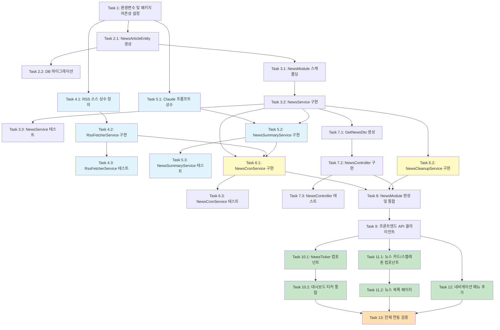

# 크립토 뉴스 피드 구현 계획

## 참조 문서
- [요구사항 문서](.claude/specs/crypto-news-feed/requirements.md)
- [설계 문서](.claude/specs/crypto-news-feed/design.md)

---

- [ ] 1. 환경변수 및 패키지 의존성 설정
  - `apps/api`에 `rss-parser`, `@anthropic-ai/sdk`, `striptags` 패키지 설치
  - `apps/api/.env.example`에 `CLAUDE_API_KEY`, `NEWS_FETCH_INTERVAL_MINUTES`, `NEWS_SUMMARY_ENABLED`, `NEWS_CLEANUP_DAYS` 환경변수 추가
  - Docker Compose 파일에 `CLAUDE_API_KEY` 환경변수 전달 설정 추가
  - _요구사항: 2.6, 7.8_

- [ ] 2. NewsArticle 엔티티 및 DB 마이그레이션
- [ ] 2.1 NewsArticleEntity TypeORM 엔티티 생성
  - `apps/api/src/modules/news/entities/news-article.entity.ts` 파일 생성
  - `SummaryStatus`, `NewsSource` 타입 정의
  - 설계 문서의 엔티티 명세에 따라 id(UUID), title, content, summaryKo, sourceUrl(unique), source, publishedAt, summaryStatus(default: 'pending'), createdAt, updatedAt 컬럼 구현
  - `idx_news_published_at`, `idx_news_summary_status`, `idx_news_source` 인덱스 설정
  - 엔티티 단위 테스트 작성 (데코레이터 및 기본값 검증)
  - _요구사항: 3.1, 3.2, 3.3, 3.4_

- [ ] 2.2 TypeORM 마이그레이션 생성 및 적용
  - `news_article` 테이블 생성 마이그레이션 파일 작성
  - unique 제약조건, 인덱스가 올바르게 생성되는지 확인
  - _요구사항: 3.2, 3.3_

- [ ] 3. NewsModule 스캐폴딩 및 NewsService 구현
- [ ] 3.1 NewsModule 기본 구조 생성
  - `apps/api/src/modules/news/news.module.ts` 파일 생성
  - TypeOrmModule.forFeature([NewsArticleEntity]) 등록
  - AppModule에 NewsModule import 추가
  - _요구사항: 7.6 (기존 서비스 격리)_

- [ ] 3.2 NewsService 비즈니스 로직 구현
  - `apps/api/src/modules/news/news.service.ts` 파일 생성
  - `existsByUrl(url)`: 원문 URL 기준 중복 체크
  - `saveArticle(dto)`: 새 뉴스 기사 저장 (summaryStatus = 'pending')
  - `findPendingArticles()`: pending 상태 기사 목록 조회
  - `findFailedArticles()`: failed 상태 기사 목록 조회
  - `updateSummary(id, summary, status)`: 요약 결과 업데이트
  - `findArticles({ cursor, limit })`: 커서 기반 페이지네이션 (completed 상태만, publishedAt DESC 정렬, limit+1 조회로 nextCursor 판단)
  - `findTickerArticles(limit)`: 티커용 최신 뉴스 조회 (기본 10개, completed만)
  - `deleteOlderThan(days)`: 오래된 뉴스 일괄 삭제
  - `getDailyArticleCount()`: 오늘 처리된 기사 수 조회
  - _요구사항: 1.5, 1.6, 2.3, 2.4, 2.5, 3.3, 3.4, 6.1, 6.2, 6.3, 6.4, 6.5, 6.6, 7.11_

- [ ] 3.3 NewsService 단위 테스트 작성
  - `apps/api/src/modules/news/news.service.spec.ts` 파일 생성
  - Repository mock을 사용한 각 메서드 테스트
  - 커서 인코딩/디코딩 로직, 중복 체크, 페이지네이션 nextCursor 계산 등 경계 케이스 테스트
  - _요구사항: 6.2, 6.3, 6.4, 6.5_

- [ ] 4. RssFetcherService 구현
- [ ] 4.1 RSS 소스 상수 및 RssArticle 인터페이스 정의
  - `apps/api/src/modules/news/constants/rss-sources.ts` 파일 생성
  - CoinDesk, CoinTelegraph, The Block RSS URL을 상수로 정의 (환경변수 오버라이드 지원)
  - `RssArticle` 인터페이스 정의 (title, content, sourceUrl, source, publishedAt)
  - _요구사항: 1.3, 1.4_

- [ ] 4.2 RssFetcherService 구현
  - `apps/api/src/modules/news/services/rss-fetcher.service.ts` 파일 생성
  - `rss-parser` 라이브러리를 사용하여 RSS 피드 파싱
  - `fetchAll()`: 3개 소스를 병렬로 수집, 결과 병합
  - `fetchFromSource(source)`: 개별 소스 수집, 10초 타임아웃 설정
  - HTML 태그 제거 (`striptags` 사용) 후 content 정리
  - 개별 소스 실패 시 오류 로그 기록하고 나머지 소스 수집 계속 진행
  - _요구사항: 1.3, 1.4, 1.7, 7.1_

- [ ] 4.3 RssFetcherService 단위 테스트 작성
  - `rss-parser` mock을 사용한 파싱 성공/실패 테스트
  - 소스별 실패 격리 테스트 (1개 실패 시 나머지 정상 반환)
  - HTML 태그 제거 검증
  - 타임아웃 처리 테스트
  - _요구사항: 1.7_

- [ ] 5. NewsSummaryService 구현
- [ ] 5.1 Claude 요약 프롬프트 상수 정의
  - `apps/api/src/modules/news/constants/summary-prompt.ts` 파일 생성
  - 시스템 프롬프트와 사용자 메시지 포맷을 상수로 정의 (설계 문서의 프롬프트 명세 참조)
  - _요구사항: 2.2_

- [ ] 5.2 NewsSummaryService 구현
  - `apps/api/src/modules/news/services/news-summary.service.ts` 파일 생성
  - `@anthropic-ai/sdk`를 사용하여 Claude Haiku API 호출
  - `summarize(article)`: 영어 원문을 한글 3~5문장으로 요약 번역 (모델: claude-haiku-4-0-20250414, max_tokens: 500, temperature: 0.3, timeout: 30초)
  - `processPendingArticles()`: pending 상태 기사 순회하며 요약 실행, 성공 시 completed/실패 시 failed로 업데이트
  - `retryFailedArticles()`: failed 상태 기사 재시도
  - CLAUDE_API_KEY 미설정 시 경고 로그 기록 후 요약 프로세스 전체 스킵
  - 일일 처리량 100개 초과 시 경고 로그 기록
  - _요구사항: 2.1, 2.2, 2.3, 2.4, 2.5, 2.6, 2.7, 2.8, 7.3, 7.4, 7.5_

- [ ] 5.3 NewsSummaryService 단위 테스트 작성
  - Anthropic SDK mock을 사용한 API 호출 성공/실패 테스트
  - 프롬프트 구성 검증 (시스템 메시지, 사용자 메시지 형식)
  - 타임아웃 처리, 빈 응답 처리 테스트
  - CLAUDE_API_KEY 미설정 시 스킵 동작 테스트
  - 일일 처리량 초과 경고 테스트
  - _요구사항: 2.4, 2.8, 7.3_

- [ ] 6. NewsCronService 및 NewsCleanupService 구현
- [ ] 6.1 NewsCronService 구현
  - `apps/api/src/modules/news/services/news-cron.service.ts` 파일 생성
  - `@Interval` 데코레이터 사용, 간격은 `NEWS_FETCH_INTERVAL_MINUTES` 환경변수에서 읽기 (기본 10분)
  - `handleNewsFetch()`: RSS 수집 → 중복 체크 및 신규 저장 → AI 요약 처리 순서로 오케스트레이션
  - 각 단계 실패 시 오류 로그 기록 후 다음 단계로 진행
  - 수집 결과(신규 항목 수, 중복 수, 실패 소스) 로그 기록
  - failed 상태 기사 재시도 포함
  - _요구사항: 1.1, 1.2, 1.7, 1.8, 2.5, 7.6, 7.7_

- [ ] 6.2 NewsCleanupService 구현
  - `apps/api/src/modules/news/services/news-cleanup.service.ts` 파일 생성
  - `@Cron('0 3 * * *')` 데코레이터 사용 (매일 새벽 3시 KST)
  - `handleCleanup()`: NEWS_CLEANUP_DAYS(기본 30일) 이전 뉴스 삭제, 삭제 건수 로그 기록
  - _요구사항: 7.11_

- [ ] 6.3 NewsCronService 단위 테스트 작성
  - RssFetcherService, NewsSummaryService, NewsService mock을 사용한 오케스트레이션 테스트
  - 수집 실패 시 요약 단계 정상 진행 확인
  - 로그 기록 검증
  - _요구사항: 1.7, 1.8, 7.6_

- [ ] 7. NewsController 및 DTO 구현
- [ ] 7.1 GetNewsDto 유효성 검증 DTO 생성
  - `apps/api/src/modules/news/dto/get-news.dto.ts` 파일 생성
  - cursor (optional, string), limit (optional, number, default 20, min 1, max 50) 파라미터 정의
  - class-validator 데코레이터 적용
  - _요구사항: 6.2, 6.3_

- [ ] 7.2 NewsController REST API 엔드포인트 구현
  - `apps/api/src/modules/news/news.controller.ts` 파일 생성
  - `@Controller('news')` prefix 설정
  - `GET /news`: GetNewsDto로 쿼리 파라미터 검증, NewsService.findArticles 호출, PaginatedNews 반환
  - `GET /news/ticker`: NewsService.findTickerArticles 호출, 최신 10개 TickerNewsItem 반환
  - 기존 TransformInterceptor가 `{ success, data, timestamp }` 형식으로 자동 래핑
  - _요구사항: 6.1, 6.2, 6.3, 6.4, 6.5, 6.6, 7.2_

- [ ] 7.3 NewsController 단위 테스트 작성
  - `apps/api/src/modules/news/news.controller.spec.ts` 파일 생성
  - DTO 유효성 검증 테스트 (유효/무효 파라미터)
  - 응답 형식 검증
  - _요구사항: 6.1, 6.5_

- [ ] 8. NewsModule 완성 및 통합
  - `news.module.ts`에 모든 서비스(RssFetcherService, NewsSummaryService, NewsCronService, NewsCleanupService, NewsService)와 컨트롤러(NewsController) 등록
  - 각 서비스 간 DI(의존성 주입) 연결 확인
  - AppModule에 NewsModule이 올바르게 import되었는지 확인
  - 통합 테스트 작성: GET /news 페이지네이션 동작, GET /news/ticker 최신 10개 반환
  - _요구사항: 7.6_

- [ ] 9. 프론트엔드 뉴스 API 클라이언트 구현
  - `apps/web/lib/api/news.ts` 파일 생성
  - `fetchNews({ cursor?, limit? })`: GET /api/news 호출, PaginatedNewsResponse 반환
  - `fetchTickerNews()`: GET /api/news/ticker 호출, TickerNewsResponse 반환
  - 기존 프로젝트의 API 호출 패턴(NEXT_PUBLIC_API_BASE_URL 또는 NEXT_PUBLIC_API_URL) 준수
  - 응답 타입 인터페이스 정의
  - _요구사항: 6.1, 6.5_

- [ ] 10. NewsTicker 컴포넌트 구현
- [ ] 10.1 NewsTicker 컴포넌트 생성
  - `apps/web/components/news/news-ticker.tsx` 파일 생성
  - TanStack Query `useQuery`로 티커 뉴스 데이터 페칭 (`refetchInterval: 60000`)
  - CSS `@keyframes` 기반 마키(marquee) 애니메이션 구현 (Tailwind 커스텀 keyframes)
  - 뉴스 항목 간 구분자(`|` 또는 `•`)로 구분
  - 마우스 호버 시 `animation-play-state: paused`로 일시 정지
  - 뉴스 항목 클릭 시 `/news` 페이지로 이동
  - 데이터 없을 때 "뉴스를 불러오는 중..." 메시지 또는 티커 숨김 처리
  - _요구사항: 4.1, 4.2, 4.3, 4.4, 4.5, 4.6, 4.7_

- [ ] 10.2 대시보드 페이지에 NewsTicker 통합
  - 대시보드 페이지(`apps/web/app/(dashboard)/page.tsx`)의 `<DashboardHeader>` 위에 `<NewsTicker />` 삽입
  - _요구사항: 4.1_

- [ ] 11. 뉴스 목록 페이지 구현
- [ ] 11.1 뉴스 카드 및 스켈레톤 컴포넌트 생성
  - `apps/web/components/news/news-card.tsx`: 한글 요약, 영어 원문 제목, 소스 뱃지(Badge), 발행 시간(상대 시간), 원문 링크(새 탭) 표시
  - `apps/web/components/news/news-skeleton.tsx`: 뉴스 카드 스켈레톤 UI
  - shadcn/ui (Card, Button, Badge, Skeleton) 활용
  - _요구사항: 5.2, 5.6_

- [ ] 11.2 뉴스 목록 페이지 생성
  - `apps/web/app/(dashboard)/news/page.tsx` 파일 생성
  - TanStack Query `useInfiniteQuery`로 커서 기반 무한 로딩 구현
  - "더보기" 버튼으로 다음 20개 로드, 더 이상 데이터 없으면 버튼 숨김/비활성화
  - 로딩 중 스켈레톤 UI 표시
  - API 오류 시 에러 메시지 + 재시도 버튼 표시
  - 원문 링크 클릭 시 새 탭에서 열기
  - _요구사항: 5.1, 5.2, 5.3, 5.4, 5.5, 5.6, 5.7_

- [ ] 12. 네비게이션 메뉴에 뉴스 항목 추가
  - `apps/web/components/layout/sidebar-nav.tsx`의 NAV_ITEMS에 `{ labelKey: 'news', href: '/news', icon: Newspaper }` 추가
  - `apps/web/components/layout/bottom-tab-nav.tsx`의 네비게이션 항목에도 동일하게 추가
  - `lucide-react`의 `Newspaper` 아이콘 import
  - i18n 키 `nav.news` → "뉴스" 추가 (해당 i18n 파일에)
  - _요구사항: 5.1 (뉴스 메뉴 접근)_

- [ ] 13. 전체 연동 검증 및 엣지 케이스 테스트
  - 백엔드 통합 테스트: RSS 수집 → DB 저장 → AI 요약 → API 응답 전체 플로우 검증
  - `source_url` unique 위반 시 적절한 에러 처리 확인
  - 프론트엔드 컴포넌트 테스트: NewsTicker 데이터 로딩/표시/호버 정지/클릭 네비게이션 테스트
  - 프론트엔드 컴포넌트 테스트: 뉴스 페이지 목록 렌더링, 더보기 버튼, 에러 상태, 스켈레톤 표시 테스트
  - CLAUDE_API_KEY 미설정 시 뉴스 수집은 되지만 요약만 스킵되는 동작 확인
  - _요구사항: 7.5, 7.6, 7.7, 7.9_

---

## 작업 의존성 다이어그램

**범례:**
- 파란색: RSS 수집 관련 (병렬 가능)
- 노란색: Cron 오케스트레이션 (수집/요약 의존)
- 초록색: 프론트엔드 (백엔드 완성 후)
- 주황색: 최종 통합 검증
