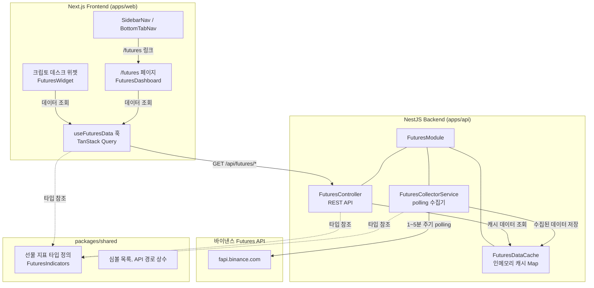
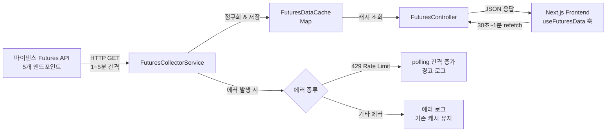
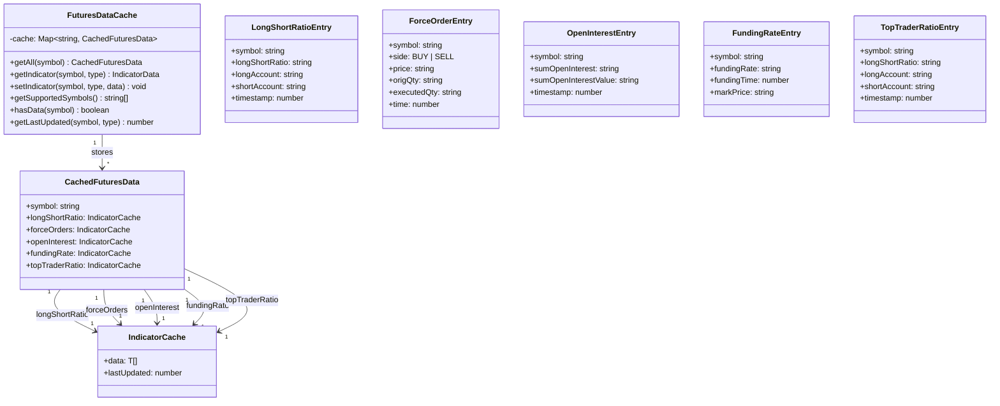
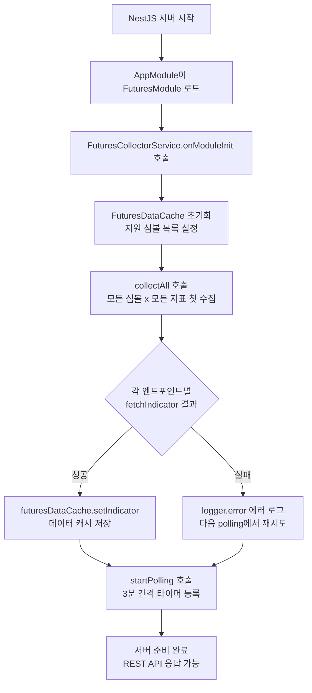
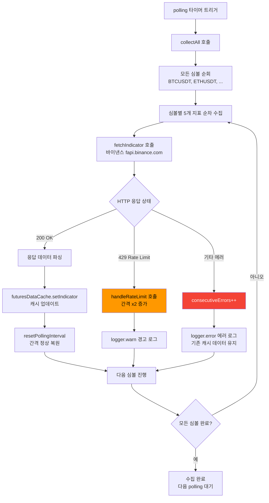
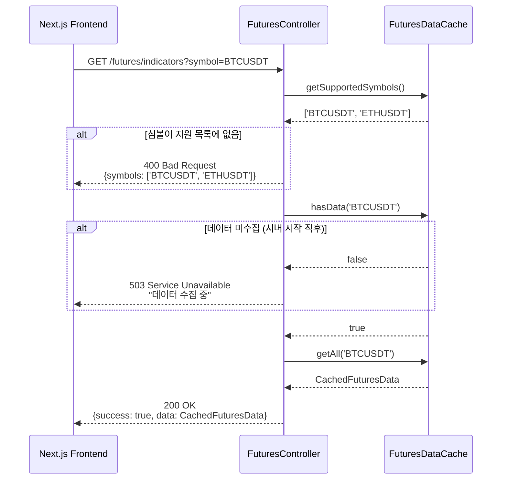
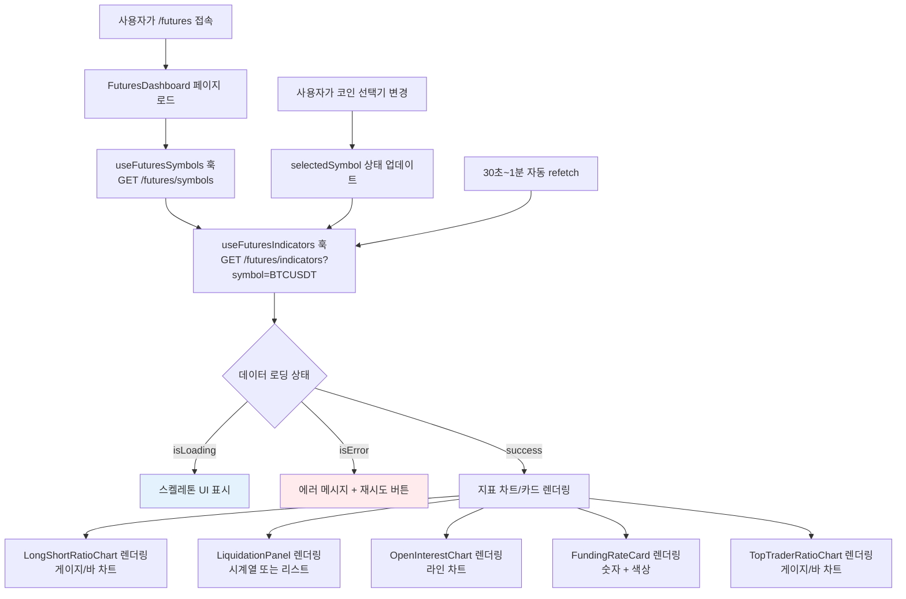
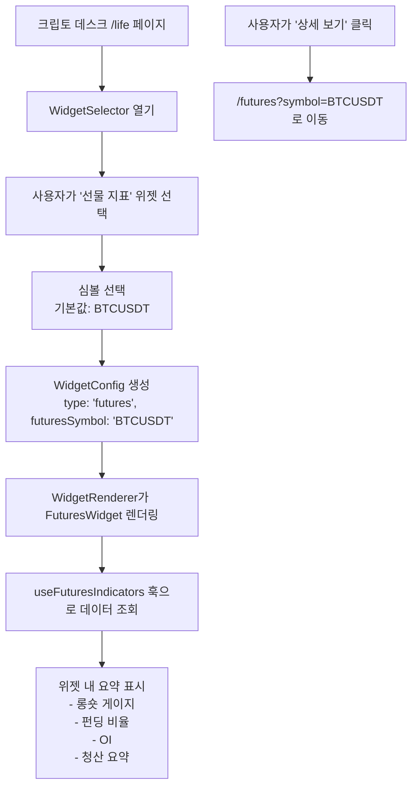
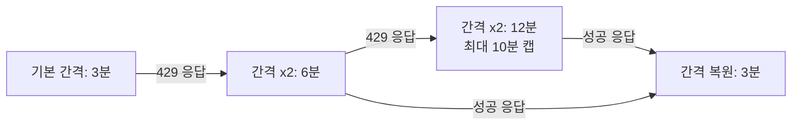

# 선물 마켓 데이터 (Futures Market Data) 설계 문서

## 개요

바이낸스 Futures 공개 API에서 5가지 핵심 선물 지표(롱숏 비율, 강제 청산, 미결제 약정, 펀딩 비율, 탑 트레이더 롱숏 비율)를 주기적으로 수집하고, NestJS 인메모리 캐시에 저장하여 REST API로 프론트엔드에 제공한다. 프론트엔드에는 전용 `/futures` 대시보드 페이지와 크립토 데스크 위젯을 추가한다.

### 설계 원칙

- **기존 아키텍처 패턴 준수**: `PriceMonitorService`, `BinancePollingClient`, `NewsModule` 등 기존 코드의 polling, 캐싱, 모듈 구조 패턴을 따른다.
- **인메모리 캐시 전용**: DB 저장 없이 `Map` 기반 인메모리 캐시를 사용한다 (요구사항 명시).
- **바이낸스 공개 API만 사용**: 인증 키 불필요, `fapi.binance.com` 도메인 사용.
- **프론트엔드에서 바이낸스 직접 호출 금지**: 반드시 NestJS 백엔드를 통해 데이터를 제공한다.

---

## 아키텍처 설계

### 시스템 아키텍처 다이어그램



### 데이터 흐름 다이어그램



---

## 컴포넌트 설계

### 백엔드 컴포넌트 (apps/api)

#### 1. FuturesModule (`src/modules/futures/futures.module.ts`)

- **책임**: 선물 데이터 수집 및 API 제공을 위한 NestJS 모듈
- **의존성**: `ScheduleModule` (NestJS cron)
- **제공자**: `FuturesCollectorService`, `FuturesDataCache`, `FuturesController`

#### 2. FuturesDataCache (`src/modules/futures/futures-data-cache.ts`)

- **책임**: 심볼별 선물 지표 데이터를 인메모리로 캐싱
- **인터페이스**:

```typescript
@Injectable()
class FuturesDataCache {
  /** 심볼별 전체 지표 데이터를 저장/조회하는 Map */
  private readonly cache: Map<string, CachedFuturesData>;

  /** 특정 심볼의 전체 지표 조회 */
  getAll(symbol: string): CachedFuturesData | null;

  /** 특정 심볼의 특정 지표 조회 */
  getIndicator(symbol: string, type: FuturesIndicatorType): IndicatorData | null;

  /** 지표 데이터를 업데이트 */
  setIndicator(symbol: string, type: FuturesIndicatorType, data: unknown[]): void;

  /** 지원 심볼 목록 반환 */
  getSupportedSymbols(): string[];

  /** 심볼의 데이터 존재 여부 확인 */
  hasData(symbol: string): boolean;

  /** 마지막 업데이트 타임스탬프 반환 */
  getLastUpdated(symbol: string, type: FuturesIndicatorType): number | null;
}
```

- **의존성**: 없음 (독립적인 인메모리 저장소)

#### 3. FuturesCollectorService (`src/modules/futures/futures-collector.service.ts`)

- **책임**: 바이낸스 Futures 공개 API를 주기적으로 폴링하여 데이터 수집
- **인터페이스**:

```typescript
@Injectable()
class FuturesCollectorService implements OnModuleInit, OnModuleDestroy {
  private readonly logger: Logger;

  /** 엔드포인트별 polling 타이머 */
  private pollingTimers: Map<string, ReturnType<typeof setInterval>>;

  /** 엔드포인트별 연속 오류 횟수 (Rate Limit 백오프용) */
  private consecutiveErrors: Map<string, number>;

  /** 엔드포인트별 현재 polling 간격 (Rate Limit 시 동적 조정) */
  private pollingIntervals: Map<string, number>;

  /** 모듈 초기화 시 즉시 수집 시작 + polling 등록 */
  async onModuleInit(): Promise<void>;

  /** 모듈 종료 시 모든 polling 중지 */
  async onModuleDestroy(): Promise<void>;

  /** 특정 지표 데이터를 수집 (단일 호출) */
  private async fetchIndicator(symbol: string, type: FuturesIndicatorType): Promise<void>;

  /** 모든 심볼 + 모든 지표에 대해 수집 실행 */
  private async collectAll(): Promise<void>;

  /** polling 타이머 시작 */
  private startPolling(): void;

  /** polling 타이머 중지 */
  private stopPolling(): void;

  /** Rate Limit 대응: polling 간격 동적 증가 */
  private handleRateLimit(endpoint: string): void;

  /** 정상 응답 시: polling 간격 원래대로 복원 */
  private resetPollingInterval(endpoint: string): void;
}
```

- **의존성**: `FuturesDataCache`, `@nestjs/schedule`

#### 4. FuturesController (`src/modules/futures/futures.controller.ts`)

- **책임**: 선물 지표 데이터 REST API 제공
- **인터페이스**:

```typescript
@Controller('futures')
class FuturesController {
  /** GET /futures/symbols - 지원 심볼 목록 조회 */
  @Get('symbols')
  getSymbols(): { success: boolean; data: string[] };

  /** GET /futures/indicators?symbol=BTCUSDT - 심볼별 전체 지표 조회 */
  @Get('indicators')
  getIndicators(@Query('symbol') symbol: string): FuturesIndicatorsResponse;

  /** GET /futures/indicators/:type?symbol=BTCUSDT - 특정 지표 조회 */
  @Get('indicators/:type')
  getIndicatorByType(
    @Param('type') type: string,
    @Query('symbol') symbol: string,
  ): SingleIndicatorResponse;
}
```

- **의존성**: `FuturesDataCache`

### 프론트엔드 컴포넌트 (apps/web)

#### 5. useFuturesData 훅 (`hooks/useFuturesData.ts`)

- **책임**: NestJS API에서 선물 지표 데이터를 조회하는 TanStack Query 훅
- **인터페이스**:

```typescript
/** 전체 지표 조회 훅 */
function useFuturesIndicators(symbol: string): {
  data: FuturesIndicatorsData | undefined;
  isLoading: boolean;
  isError: boolean;
  error: Error | null;
  refetch: () => void;
};

/** 지원 심볼 목록 조회 훅 */
function useFuturesSymbols(): {
  data: string[] | undefined;
  isLoading: boolean;
};
```

- **의존성**: `@tanstack/react-query`, `getApiBaseUrl()`

#### 6. FuturesDashboard 페이지 (`app/(dashboard)/futures/page.tsx`)

- **책임**: 선물 지표 전체 화면 대시보드
- **구성요소**:
  - `CoinSelector`: 코인 선택 드롭다운
  - `LongShortRatioChart`: 롱숏 비율 게이지/바 차트
  - `LiquidationPanel`: 강제 청산 시계열 차트 또는 리스트
  - `OpenInterestChart`: 미결제 약정 라인 차트
  - `FundingRateCard`: 펀딩 비율 숫자 + 색상
  - `TopTraderRatioChart`: 탑 트레이더 롱숏 비율 게이지/바 차트
  - 자동 슬라이드(캐러셀) 또는 탭 전환 지원
- **의존성**: `useFuturesIndicators`, `useFuturesSymbols`, Recharts

#### 7. FuturesWidget (`components/life/widgets/futures-widget.tsx`)

- **책임**: 크립토 데스크에서 코인 하나의 핵심 선물 지표 요약 표시
- **인터페이스**:

```typescript
interface FuturesWidgetProps {
  symbol?: string; // 기본값: 'BTCUSDT'
}

function FuturesWidget({ symbol }: FuturesWidgetProps): JSX.Element;
```

- **표시 항목**: 롱숏 비율 게이지, 펀딩 비율, OI (숫자/미니차트), 최근 청산 요약
- **의존성**: `useFuturesIndicators`, 위젯 시스템 (`WidgetConfig`, `WidgetRenderer`)

#### 8. 네비게이션 통합

- `sidebar-nav.tsx`의 `NAV_ITEMS` 배열에 `{ labelKey: 'futures', href: '/futures', icon: Activity }` 추가
- `bottom-tab-nav.tsx`의 `MOBILE_TAB_ITEMS`에 선물 메뉴 추가
- i18n 파일(`ko.ts`, `en.ts`)에 `nav.futures: '선물'` / `'Futures'` 추가

### 공유 패키지 (packages/shared)

#### 9. 선물 지표 타입/상수 (`src/types/futures.ts`, `src/constants/futures.ts`)

- **책임**: 백엔드/프론트엔드 공유 타입 정의 및 상수
- **내용**: `FuturesIndicatorType`, 응답 DTO 타입, 기본 심볼 목록, API 엔드포인트 경로

---

## 데이터 모델

### 핵심 데이터 구조 정의

```typescript
// packages/shared/src/types/futures.ts

/** 선물 지표 종류 */
export type FuturesIndicatorType =
  | 'longShortRatio'       // 글로벌 롱숏 비율
  | 'forceOrders'          // 강제 청산
  | 'openInterest'         // 미결제 약정 (OI)
  | 'fundingRate'          // 펀딩 비율
  | 'topTraderRatio';      // 탑 트레이더 롱숏 포지션 비율

/** 롱숏 비율 데이터 (globalLongShortAccountRatio) */
export interface LongShortRatioEntry {
  symbol: string;
  longShortRatio: string;   // "1.2345"
  longAccount: string;      // "0.5525" (55.25%)
  shortAccount: string;     // "0.4475" (44.75%)
  timestamp: number;        // 밀리초
}

/** 강제 청산 데이터 (forceOrders) */
export interface ForceOrderEntry {
  symbol: string;
  side: 'BUY' | 'SELL';    // BUY=숏 청산, SELL=롱 청산
  price: string;
  origQty: string;
  executedQty: string;
  averagePrice: string;
  type: string;
  status: string;
  time: number;             // 밀리초
}

/** 미결제 약정 히스토리 (openInterestHist) */
export interface OpenInterestEntry {
  symbol: string;
  sumOpenInterest: string;        // OI 수량
  sumOpenInterestValue: string;   // OI 가치 (USDT)
  timestamp: number;
}

/** 펀딩 비율 (fundingRate) */
export interface FundingRateEntry {
  symbol: string;
  fundingRate: string;      // "0.00010000"
  fundingTime: number;      // 밀리초
  markPrice: string;        // 마크 가격 (있으면)
}

/** 탑 트레이더 롱숏 포지션 비율 (topLongShortPositionRatio) */
export interface TopTraderRatioEntry {
  symbol: string;
  longShortRatio: string;
  longAccount: string;
  shortAccount: string;
  timestamp: number;
}

/** 심볼별 전체 선물 지표 캐시 구조 */
export interface CachedFuturesData {
  symbol: string;
  longShortRatio: {
    data: LongShortRatioEntry[];
    lastUpdated: number;
  };
  forceOrders: {
    data: ForceOrderEntry[];
    lastUpdated: number;
  };
  openInterest: {
    data: OpenInterestEntry[];
    lastUpdated: number;
  };
  fundingRate: {
    data: FundingRateEntry[];
    lastUpdated: number;
  };
  topTraderRatio: {
    data: TopTraderRatioEntry[];
    lastUpdated: number;
  };
}

/** REST API 통합 응답 DTO */
export interface FuturesIndicatorsResponse {
  success: boolean;
  data: CachedFuturesData;
}

/** REST API 단일 지표 응답 DTO */
export interface SingleIndicatorResponse {
  success: boolean;
  data: {
    type: FuturesIndicatorType;
    entries: unknown[];
    lastUpdated: number;
  };
}
```

### 선물 관련 상수

```typescript
// packages/shared/src/constants/futures.ts

/** 기본 선물 지표 수집 대상 심볼 */
export const DEFAULT_FUTURES_SYMBOLS = ['BTCUSDT', 'ETHUSDT'] as const;

/** 바이낸스 Futures 공개 API 엔드포인트 */
export const BINANCE_FUTURES_ENDPOINTS = {
  globalLongShortRatio: '/futures/data/globalLongShortAccountRatio',
  forceOrders: '/fapi/v1/forceOrders',
  openInterestHist: '/futures/data/openInterestHist',
  fundingRate: '/fapi/v1/fundingRate',
  topTraderRatio: '/futures/data/topLongShortPositionRatio',
} as const;

/** 기본 polling 간격 (밀리초) - 3분 */
export const FUTURES_DEFAULT_POLLING_INTERVAL_MS = 3 * 60 * 1000;

/** Rate Limit 시 최대 polling 간격 (밀리초) - 10분 */
export const FUTURES_MAX_POLLING_INTERVAL_MS = 10 * 60 * 1000;

/** Rate Limit 시 polling 간격 배수 */
export const FUTURES_BACKOFF_MULTIPLIER = 2;

/** 선물 지표 타입 목록 (순회용) */
export const FUTURES_INDICATOR_TYPES: FuturesIndicatorType[] = [
  'longShortRatio',
  'forceOrders',
  'openInterest',
  'fundingRate',
  'topTraderRatio',
];
```

### 위젯 시스템 확장

```typescript
// apps/web/lib/life/types.ts 확장
export type WidgetType =
  | 'portfolio'
  | 'news'
  | 'influencer'
  | 'premium'
  | 'market'
  | 'chart'
  | 'futures';  // 추가

// WidgetConfig에 선물 위젯 옵션 추가
export interface WidgetConfig {
  type: WidgetType;
  // ... 기존 필드 유지
  /** 선물 위젯일 때의 심볼 (예: "BTCUSDT") */
  futuresSymbol?: string;
}
```

### 데이터 모델 다이어그램



---

## 비즈니스 프로세스

### 프로세스 1: 서버 시작 시 데이터 수집 초기화



### 프로세스 2: 주기적 데이터 수집 (polling)



### 프로세스 3: REST API 요청 처리



### 프로세스 4: 프론트엔드 대시보드 렌더링



### 프로세스 5: 크립토 데스크 위젯 추가



---

## 에러 처리 전략

### 백엔드 에러 처리

| 에러 상황 | 처리 방법 | 복구 전략 |
|---|---|---|
| 바이낸스 API 네트워크 오류 | `logger.error` 로그, 기존 캐시 유지 | 다음 polling 주기에 자동 재시도 |
| 바이낸스 429 Rate Limit | `logger.warn` 경고, polling 간격 x2 증가 | 성공 시 간격 자동 복원 |
| 바이낸스 500/503 서버 오류 | `logger.error` 로그, `consecutiveErrors` 증가 | 연속 오류 시 로그 주기 제한 (1회, 10회마다) |
| 잘못된 응답 형식 (JSON 파싱 실패) | `logger.error` 로그, 해당 지표만 건너뜀 | 다음 polling에서 재시도 |
| 요청 타임아웃 (10초) | `AbortSignal.timeout` 사용, 에러 로그 | 다음 polling에서 재시도 |
| 지원하지 않는 심볼 요청 (API) | 400 Bad Request + 지원 심볼 목록 반환 | 클라이언트에서 올바른 심볼로 재요청 |
| 캐시 데이터 없음 (서버 시작 직후) | 503 Service Unavailable + 안내 메시지 | 데이터 수집 완료 후 자동 해소 |

### 프론트엔드 에러 처리

| 에러 상황 | 처리 방법 |
|---|---|
| API 요청 실패 | TanStack Query의 `retry` 옵션 (3회), 에러 UI + 재시도 버튼 |
| 503 응답 (데이터 미수집) | "데이터를 준비 중입니다" 안내 메시지 + 자동 재시도 |
| 네트워크 오프라인 | TanStack Query의 `networkMode: 'online'` 활용 |
| 차트 렌더링 오류 | `WidgetErrorBoundary`로 위젯별 격리 |

### Rate Limit 백오프 로직



---

## 테스팅 전략

### 백엔드 테스트

#### 단위 테스트

| 대상 | 테스트 항목 | 파일 |
|---|---|---|
| `FuturesDataCache` | 데이터 저장/조회, 심볼 목록, `hasData`, `getLastUpdated` | `futures-data-cache.spec.ts` |
| `FuturesCollectorService` | 성공 수집, 에러 처리, Rate Limit 백오프, polling 간격 조정 | `futures-collector.service.spec.ts` |
| `FuturesController` | 정상 응답, 400 에러, 503 에러, 파라미터 검증 | `futures.controller.spec.ts` |

#### 테스트 방법

- `FuturesCollectorService`의 `fetch` 호출을 mock하여 바이낸스 API 응답을 시뮬레이션
- `FuturesDataCache`는 실제 인메모리 Map으로 단위 테스트
- `FuturesController`는 NestJS `@nestjs/testing`의 `Test.createTestingModule`로 통합 테스트

### 프론트엔드 테스트

| 대상 | 테스트 항목 | 도구 |
|---|---|---|
| `useFuturesData` 훅 | 데이터 조회, 로딩/에러 상태, refetch | `@testing-library/react-hooks`, msw |
| `FuturesDashboard` | 렌더링, 코인 선택, 차트 표시, 에러 UI | `@testing-library/react`, msw |
| `FuturesWidget` | 위젯 렌더링, 요약 데이터 표시, 상세 보기 링크 | `@testing-library/react` |
| 네비게이션 | 사이드바/모바일 메뉴에 '선물' 항목 존재 확인 | 기존 `sidebar-nav.test.tsx` 확장 |

---

## 파일 구조 요약

```
apps/api/src/modules/futures/
├── futures.module.ts              # NestJS 모듈
├── futures.controller.ts          # REST API 컨트롤러
├── futures-collector.service.ts   # 바이낸스 API 폴링 수집기
├── futures-data-cache.ts          # 인메모리 캐시
└── __tests__/
    ├── futures-data-cache.spec.ts
    ├── futures-collector.service.spec.ts
    └── futures.controller.spec.ts

apps/web/
├── app/(dashboard)/futures/
│   └── page.tsx                   # /futures 대시보드 페이지
├── components/futures/
│   ├── coin-selector.tsx          # 코인 선택 드롭다운
│   ├── long-short-ratio-chart.tsx # 롱숏 비율 차트
│   ├── liquidation-panel.tsx      # 강제 청산 패널
│   ├── open-interest-chart.tsx    # 미결제 약정 차트
│   ├── funding-rate-card.tsx      # 펀딩 비율 카드
│   └── top-trader-ratio-chart.tsx # 탑 트레이더 비율 차트
├── components/life/widgets/
│   └── futures-widget.tsx         # 크립토 데스크 위젯
└── hooks/
    └── useFuturesData.ts          # 데이터 조회 훅

packages/shared/src/
├── types/futures.ts               # 선물 지표 타입 정의
└── constants/futures.ts           # 선물 관련 상수
```

---

## 설계 결정 및 근거

| 결정 | 근거 |
|---|---|
| 인메모리 캐시 (DB 미사용) | 요구사항 명시 (실시간 지표이므로 히스토리 저장 불필요), 기존 `PriceMonitorService`의 `Map` 기반 캐시 패턴과 일관성 유지 |
| 독립 `FuturesModule` 생성 | 기존 `PriceModule`은 시세 모니터링 전용이며, 선물 지표는 별도 도메인 → 관심사 분리 (SRP) |
| `FuturesDataCache`를 별도 서비스로 분리 | Controller와 CollectorService가 모두 캐시에 접근 → 단일 책임 원칙, 테스트 용이성 |
| polling 간격 3분 (기본) | 바이낸스 5m period 데이터는 5분 단위 → 3분 간격이 적절한 신선도와 Rate Limit 여유의 균형 |
| 프론트엔드에서 NestJS API 경유 | 보안 요구사항 NF5.2 (프론트엔드 바이낸스 직접 호출 금지), CORS 이슈 회피 |
| 심볼 형식 BTCUSDT (USDT 접미사 포함) | 바이낸스 Futures API가 `BTCUSDT` 형식을 요구, 변환 로직 불필요하도록 API 전체에서 동일 형식 사용 |
| Recharts 사용 (TradingView 미사용) | 선물 지표는 TradingView에 없는 커스텀 데이터 → Recharts로 자유로운 시각화, 기존 프로젝트 의존성 활용 |
| 위젯 시스템의 `WidgetType` 확장 | 기존 `widget-renderer.tsx`, `widget-selector.tsx` 패턴을 그대로 따라 일관성 유지 |
| 환경 변수로 추가 심볼 관리 | 요구사항 6.2 - 코드 수정 없이 심볼 추가 가능, `FUTURES_SYMBOLS` 환경 변수 |
