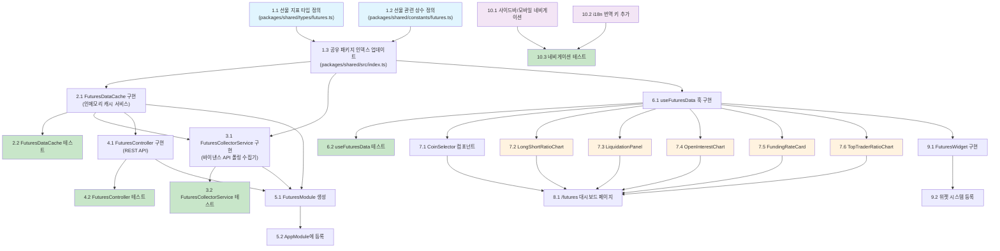

# 선물 마켓 데이터 (Futures Market Data) 구현 계획

## 구현 순서 요약

공유 타입/상수 정의 → 백엔드 인메모리 캐시 → 백엔드 수집기 → 백엔드 컨트롤러 → 모듈 등록 → 프론트엔드 데이터 훅 → 대시보드 차트 컴포넌트 → 대시보드 페이지 → 위젯 → 네비게이션/i18n 통합

---

- [ ] 1. 공유 패키지: 선물 지표 타입 및 상수 정의
- [ ] 1.1 선물 지표 타입 파일 생성 (`packages/shared/src/types/futures.ts`)
  - `FuturesIndicatorType` 타입 정의 (`longShortRatio`, `forceOrders`, `openInterest`, `fundingRate`, `topTraderRatio`)
  - `LongShortRatioEntry`, `ForceOrderEntry`, `OpenInterestEntry`, `FundingRateEntry`, `TopTraderRatioEntry` 인터페이스 정의
  - `CachedFuturesData`, `FuturesIndicatorsResponse`, `SingleIndicatorResponse` DTO 타입 정의
  - _요구사항: 1.1, 2.1, 2.2, 2.6_

- [ ] 1.2 선물 관련 상수 파일 생성 (`packages/shared/src/constants/futures.ts`)
  - `DEFAULT_FUTURES_SYMBOLS` 배열 (`BTCUSDT`, `ETHUSDT`)
  - `BINANCE_FUTURES_ENDPOINTS` 객체 (5개 API 엔드포인트 경로)
  - `FUTURES_DEFAULT_POLLING_INTERVAL_MS`, `FUTURES_MAX_POLLING_INTERVAL_MS`, `FUTURES_BACKOFF_MULTIPLIER` 상수
  - `FUTURES_INDICATOR_TYPES` 순회용 배열
  - _요구사항: 1.1, 6.1, NF1.2_

- [ ] 1.3 공유 패키지 인덱스 파일 업데이트 (`packages/shared/src/index.ts`)
  - `types/futures.ts`의 모든 타입을 re-export
  - `constants/futures.ts`의 모든 상수를 re-export
  - 기존 `types/index.ts`, `constants/index.ts` 배럴 파일도 필요 시 업데이트
  - _요구사항: 1.1, 2.1_

- [ ] 2. 백엔드: 인메모리 캐시 서비스
- [ ] 2.1 `FuturesDataCache` 서비스 구현 (`apps/api/src/modules/futures/futures-data-cache.ts`)
  - `@Injectable()` NestJS 서비스로 생성
  - `Map<string, CachedFuturesData>` 기반 인메모리 캐시
  - `getAll(symbol)`, `getIndicator(symbol, type)`, `setIndicator(symbol, type, data)` 메서드 구현
  - `getSupportedSymbols()`, `hasData(symbol)`, `getLastUpdated(symbol, type)` 메서드 구현
  - 환경변수 `FUTURES_SYMBOLS`에서 추가 심볼을 읽어 지원 목록에 포함
  - _요구사항: 1.3, 2.5, 2.6, 6.1, 6.2_

- [ ] 2.2 `FuturesDataCache` 단위 테스트 작성 (`apps/api/src/modules/futures/__tests__/futures-data-cache.spec.ts`)
  - 데이터 저장/조회 테스트 (`setIndicator` → `getAll`, `getIndicator`)
  - 심볼 목록 반환 테스트 (`getSupportedSymbols`)
  - `hasData` 초기 상태 `false`, 데이터 저장 후 `true` 테스트
  - `getLastUpdated` 타임스탬프 정확성 테스트
  - 존재하지 않는 심볼 조회 시 `null` 반환 테스트
  - _요구사항: 1.3, 2.5, 2.6_

- [ ] 3. 백엔드: 바이낸스 데이터 수집기 서비스
- [ ] 3.1 `FuturesCollectorService` 구현 (`apps/api/src/modules/futures/futures-collector.service.ts`)
  - `OnModuleInit` 구현: 서버 시작 시 `collectAll()` 즉시 실행 + `startPolling()` 등록
  - `OnModuleDestroy` 구현: 모든 polling 타이머 정리
  - `fetchIndicator(symbol, type)`: 바이낸스 `fapi.binance.com`에 HTTP GET 요청, `AbortSignal.timeout(10_000)` 적용
  - `collectAll()`: 모든 심볼 x 모든 지표 순차 수집, 요청 간 적절한 딜레이로 Rate Limit 방지
  - `startPolling()` / `stopPolling()`: `setInterval` 기반 polling 타이머 관리
  - `handleRateLimit(endpoint)`: 429 응답 시 polling 간격 x2 증가 (최대 10분), `logger.warn` 기록
  - `resetPollingInterval(endpoint)`: 성공 시 기본 간격(3분)으로 복원
  - _요구사항: 1.1, 1.2, 1.3, 1.4, 1.5, 1.6, NF1.2, NF2.2, NF5.1_

- [ ] 3.2 `FuturesCollectorService` 단위 테스트 작성 (`apps/api/src/modules/futures/__tests__/futures-collector.service.spec.ts`)
  - `fetch`를 mock하여 정상 수집 시나리오 테스트
  - 네트워크 오류 시 캐시 유지 및 에러 로깅 테스트
  - 429 Rate Limit 응답 시 polling 간격 증가 테스트
  - 429 이후 성공 응답 시 간격 복원 테스트
  - `onModuleInit` 호출 시 즉시 데이터 수집 실행 테스트
  - `onModuleDestroy` 호출 시 타이머 정리 테스트
  - _요구사항: 1.1, 1.4, 1.5, 1.6_

- [ ] 4. 백엔드: REST API 컨트롤러
- [ ] 4.1 `FuturesController` 구현 (`apps/api/src/modules/futures/futures.controller.ts`)
  - `GET /futures/symbols`: 지원 심볼 목록 반환
  - `GET /futures/indicators?symbol=BTCUSDT`: 심볼별 전체 지표 데이터 반환 (`lastUpdated` 포함)
  - `GET /futures/indicators/:type?symbol=BTCUSDT`: 특정 지표만 반환
  - 지원하지 않는 심볼 요청 시 400 Bad Request + 지원 심볼 목록 반환
  - 캐시 데이터 없을 때 503 Service Unavailable + 안내 메시지 반환
  - _요구사항: 2.1, 2.2, 2.3, 2.4, 2.5, 2.6, NF1.1_

- [ ] 4.2 `FuturesController` 단위 테스트 작성 (`apps/api/src/modules/futures/__tests__/futures.controller.spec.ts`)
  - `@nestjs/testing`의 `Test.createTestingModule`로 테스트 모듈 구성
  - 정상 심볼 요청 시 200 OK + 전체 지표 데이터 반환 테스트
  - 특정 지표 타입 요청 시 해당 지표만 반환 테스트
  - 잘못된 심볼 요청 시 400 에러 + 지원 심볼 목록 반환 테스트
  - 캐시 데이터 미존재 시 503 에러 반환 테스트
  - 심볼 목록 조회 API 테스트
  - _요구사항: 2.1, 2.2, 2.3, 2.4, 2.5_

- [ ] 5. 백엔드: 모듈 등록 및 통합
- [ ] 5.1 `FuturesModule` 생성 (`apps/api/src/modules/futures/futures.module.ts`)
  - `@Module` 데코레이터로 `FuturesCollectorService`, `FuturesDataCache`, `FuturesController` 등록
  - `ScheduleModule` 의존성 import
  - _요구사항: 1.1_

- [ ] 5.2 `AppModule`에 `FuturesModule` 등록 (`apps/api/src/app.module.ts`)
  - `imports` 배열에 `FuturesModule` 추가
  - import 구문 추가
  - _요구사항: 1.1_

- [ ] 6. 프론트엔드: 데이터 조회 훅
- [ ] 6.1 `useFuturesData` 훅 구현 (`apps/web/hooks/useFuturesData.ts`)
  - `useFuturesIndicators(symbol)`: TanStack Query로 `GET /api/futures/indicators?symbol={symbol}` 호출, `refetchInterval: 30_000` 설정
  - `useFuturesSymbols()`: TanStack Query로 `GET /api/futures/symbols` 호출, `staleTime: 5분`
  - API 베이스 URL은 기존 패턴(`getApiBaseUrl()` 또는 환경변수)을 따름
  - 503 응답 시 자동 재시도 처리, `retry: 3` 설정
  - _요구사항: 3.2, 3.7, 4.5, NF2.1_

- [ ] 6.2 `useFuturesData` 훅 단위 테스트 작성 (`apps/web/hooks/__tests__/useFuturesData.test.ts`)
  - msw로 API 응답 mock
  - 정상 데이터 조회 테스트 (로딩 → 성공 상태 전환)
  - API 에러 시 에러 상태 테스트
  - 심볼 변경 시 새 데이터 조회 테스트
  - _요구사항: 3.2, 3.3, 3.7_

- [ ] 7. 프론트엔드: 대시보드 차트 컴포넌트
- [ ] 7.1 `CoinSelector` 코인 선택 컴포넌트 구현 (`apps/web/components/futures/coin-selector.tsx`)
  - `useFuturesSymbols` 훅으로 심볼 목록 조회
  - 드롭다운 UI (shadcn/ui `Select` 또는 커스텀)
  - 기본 선택값: `BTCUSDT`
  - `onSymbolChange` 콜백 prop
  - _요구사항: 3.2, 3.3_

- [ ] 7.2 `LongShortRatioChart` 롱숏 비율 차트 구현 (`apps/web/components/futures/long-short-ratio-chart.tsx`)
  - Recharts 기반 게이지 또는 수평 바 차트
  - Long/Short 비율을 시각적으로 구분 (초록/빨강 계열)
  - 색맹 사용자를 위한 추가 시각 단서 (패턴, 레이블)
  - 데이터 없을 때 스켈레톤 UI
  - _요구사항: 3.4, NF3.1, NF3.2, NF3.3_

- [ ] 7.3 `LiquidationPanel` 강제 청산 패널 구현 (`apps/web/components/futures/liquidation-panel.tsx`)
  - 최근 강제 청산 리스트 또는 시계열 차트
  - 롱 청산(SELL) / 숏 청산(BUY) 방향 표시
  - 가격, 수량, 시간 정보 표시
  - _요구사항: 3.4, NF3.1, NF3.3_

- [ ] 7.4 `OpenInterestChart` 미결제 약정 차트 구현 (`apps/web/components/futures/open-interest-chart.tsx`)
  - Recharts `LineChart`로 OI 시계열 추이 표시
  - OI 수량 또는 USDT 가치 기준 표시
  - _요구사항: 3.4, NF3.1_

- [ ] 7.5 `FundingRateCard` 펀딩 비율 카드 구현 (`apps/web/components/futures/funding-rate-card.tsx`)
  - 현재 펀딩 비율 숫자 표시
  - 양수(초록)/음수(빨강) 색상 구분
  - 다음 펀딩 시간 표시 (가능한 경우)
  - _요구사항: 3.4, NF3.1, NF3.2_

- [ ] 7.6 `TopTraderRatioChart` 탑 트레이더 롱숏 비율 차트 구현 (`apps/web/components/futures/top-trader-ratio-chart.tsx`)
  - `LongShortRatioChart`와 유사한 게이지/바 차트
  - 탑 트레이더의 롱숏 포지션 비율 시각화
  - _요구사항: 3.4, NF3.1, NF3.2_

- [ ] 8. 프론트엔드: 선물 대시보드 페이지
- [ ] 8.1 `/futures` 페이지 구현 (`apps/web/app/(dashboard)/futures/page.tsx`)
  - `CoinSelector`로 심볼 선택 (기본값 `BTCUSDT`)
  - 5개 지표 차트/카드 컴포넌트 배치
  - 자동 슬라이드(캐러셀) 또는 탭 전환 방식으로 지표 간 전환 지원
  - 수동 전환 시 자동 슬라이드 일시 정지, 일정 시간 후 재개
  - 차트 컴포넌트 지연 로딩 (`React.lazy` 또는 `next/dynamic`)
  - 로딩 중 스켈레톤 UI, 에러 시 에러 메시지 + 재시도 버튼
  - `lastUpdated` 타임스탬프 표시
  - _요구사항: 3.1, 3.2, 3.3, 3.4, 3.5, 3.6, 3.7, NF1.3, NF2.1, NF3.3, NF3.4_

- [ ] 9. 프론트엔드: 크립토 데스크 위젯
- [ ] 9.1 `FuturesWidget` 위젯 구현 (`apps/web/components/life/widgets/futures-widget.tsx`)
  - 기존 위젯 패턴(`market-widget.tsx` 등) 참고하여 구현
  - 심볼 하나의 핵심 지표 요약 표시: 롱숏 비율 게이지, 펀딩 비율, OI (숫자/미니차트), 최근 청산 요약
  - 위젯 내 코인 변경 기능
  - '상세 보기' 클릭 시 `/futures?symbol={symbol}`로 네비게이션
  - _요구사항: 4.1, 4.2, 4.3, 4.4, 4.5_

- [ ] 9.2 위젯 시스템에 `futures` 타입 등록
  - `apps/web/lib/life/types.ts`의 `WidgetType`에 `'futures'` 추가, `WidgetConfig`에 `futuresSymbol?: string` 필드 추가
  - `apps/web/lib/life/constants.ts`의 `WIDGET_METAS`에 선물 지표 위젯 메타 추가
  - `apps/web/components/life/widget-selector.tsx`에 선물 위젯 선택 옵션 및 심볼 선택 UI 추가
  - `apps/web/app/(dashboard)/life/page.tsx`의 `WidgetRenderer`에서 `FuturesWidget` 렌더링 분기 추가
  - _요구사항: 4.1, 4.2, 4.3_

- [ ] 10. 네비게이션 통합 및 i18n
- [ ] 10.1 사이드바 및 모바일 네비게이션에 선물 메뉴 추가
  - `apps/web/components/layout/sidebar-nav.tsx`의 `NAV_ITEMS` 배열에 `{ labelKey: 'futures', href: '/futures', icon: Activity }` 추가 (lucide-react `Activity` 아이콘 import)
  - `apps/web/components/layout/bottom-tab-nav.tsx`의 모바일 탭 목록에 선물 메뉴 항목 추가
  - _요구사항: 5.1, 5.2, 5.3_

- [ ] 10.2 i18n 번역 키 추가
  - `apps/web/lib/i18n/ko.ts`에 `nav.futures: '선물'` 추가 및 선물 관련 UI 텍스트 (지표명, 상태 메시지 등) 추가
  - `apps/web/lib/i18n/en.ts`에 `nav.futures: 'Futures'` 추가 및 대응하는 영문 텍스트 추가
  - _요구사항: 5.1, NF4.1_

- [ ] 10.3 네비게이션 테스트 업데이트
  - 기존 `apps/web/components/layout/__tests__/sidebar-nav.test.tsx`에 '선물' 메뉴 항목 존재 및 `/futures` 링크 테스트 추가
  - `/futures` 경로에서 활성 상태 표시 테스트 추가
  - _요구사항: 5.1, 5.2_

---

## 요구사항 커버리지 매핑

| 요구사항 | 관련 태스크 |
|---|---|
| 1.1 바이낸스 데이터 수집 스케줄러 | 1.1, 1.2, 3.1, 5.1, 5.2 |
| 1.2 1~5분 간격 polling | 1.2, 3.1 |
| 1.3 인메모리 캐시 저장 | 2.1, 3.1 |
| 1.4 API 실패 시 에러 로깅 + 캐시 유지 | 3.1, 3.2 |
| 1.5 Rate Limit 429 대응 | 1.2, 3.1, 3.2 |
| 1.6 서버 시작 시 즉시 수집 | 3.1, 3.2 |
| 2.1 전체 지표 통합 API | 1.1, 4.1, 4.2 |
| 2.2 특정 지표 API | 4.1, 4.2 |
| 2.3 심볼 목록 API | 4.1, 4.2 |
| 2.4 잘못된 심볼 400 에러 | 4.1, 4.2 |
| 2.5 캐시 미존재 503 에러 | 2.1, 4.1, 4.2 |
| 2.6 lastUpdated 타임스탬프 | 1.1, 2.1, 4.1 |
| 3.1 /futures 대시보드 페이지 | 8.1 |
| 3.2 기본 코인 BTC 표시 | 6.1, 7.1, 8.1 |
| 3.3 코인 선택 시 갱신 | 7.1, 8.1 |
| 3.4 5개 지표 시각화 | 7.2, 7.3, 7.4, 7.5, 7.6, 8.1 |
| 3.5 자동 슬라이드/탭 전환 | 8.1 |
| 3.6 수동 전환 시 자동 슬라이드 일시 정지 | 8.1 |
| 3.7 30초~1분 자동 갱신 | 6.1, 8.1 |
| 4.1 위젯 선택기에서 선물 위젯 추가 | 9.1, 9.2 |
| 4.2 위젯 핵심 지표 요약 | 9.1, 9.2 |
| 4.3 위젯 내 코인 변경 | 9.1, 9.2 |
| 4.4 위젯 → /futures 네비게이션 | 9.1 |
| 4.5 위젯 데이터 자동 갱신 | 6.1, 9.1 |
| 5.1 사이드바 선물 메뉴 | 10.1, 10.2, 10.3 |
| 5.2 /futures 활성 상태 표시 | 10.1, 10.3 |
| 5.3 모바일 네비게이션 포함 | 10.1 |
| 6.1 기본 심볼 목록 설정 | 1.2, 2.1 |
| 6.2 환경변수로 추가 심볼 | 2.1 |
| 6.3 새 심볼 즉시 수집 시작 | 2.1, 3.1 |
| NF1.1 200ms 이내 캐시 응답 | 4.1 |
| NF1.2 Rate Limit 방지 요청 간격 | 1.2, 3.1 |
| NF1.3 차트 지연 로딩 | 8.1 |
| NF2.1 API 장애 시 캐시 데이터 제공 + 갱신 시각 표시 | 6.1, 8.1 |
| NF2.2 서버 재시작 시 수집 재개 | 3.1 |
| NF3.1 WCAG 2.1 AA 색상/폰트 | 7.2, 7.3, 7.4, 7.5, 7.6 |
| NF3.2 양/음 색상 + 색맹 단서 | 7.2, 7.5, 7.6 |
| NF3.3 로딩 스켈레톤 UI | 7.2, 8.1 |
| NF3.4 에러 메시지 + 재시도 버튼 | 8.1 |
| NF4.1 i18n 한국어/영어 | 10.2 |
| NF5.1 인증 키 없이 공개 API | 3.1 |
| NF5.2 NestJS 경유 데이터 제공 | 6.1 |

---

## 태스크 의존성 다이어그램

**범례:**
- 파란색: 시작 태스크 (의존성 없음, 병렬 가능)
- 초록색: 테스트 태스크
- 주황색: 병렬 실행 가능한 차트 컴포넌트 그룹
- 보라색: 독립적으로 실행 가능한 네비게이션/i18n 태스크
