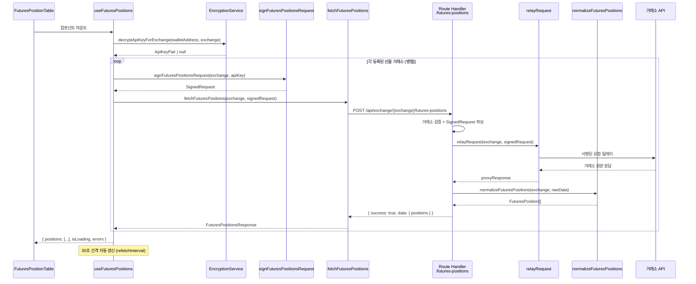
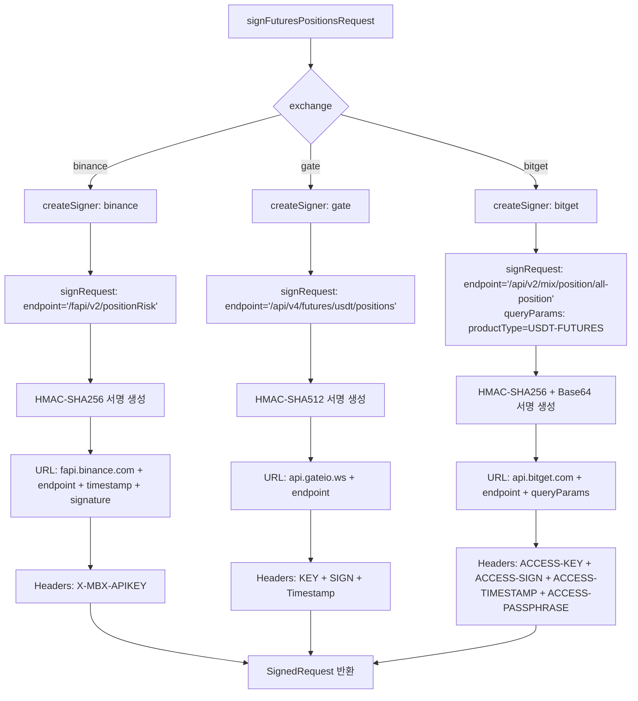
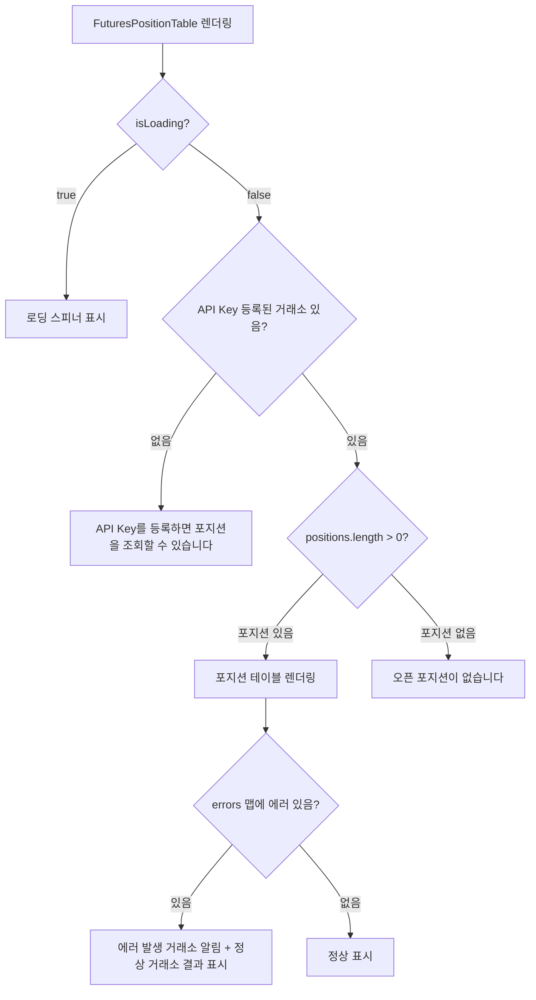

# 설계 문서: 선물 포지션 및 오픈오더 조회

## 개요

BitScope 선물 거래 페이지에서 Binance, Gate.io, Bitget 3개 거래소의 오픈 포지션과 미체결 주문(오픈오더)을 실시간으로 조회하는 기능을 설계한다.

현재 상태:
- UI 컴포넌트(`FuturesPositionTable`, `FuturesOpenOrderTable`)와 타입 정의(`FuturesPosition`, `FuturesOpenOrder`)는 이미 완성됨
- 클라이언트 API 함수(`fetchFuturesPositions`, `fetchFuturesOpenOrders`)는 이미 `api-client.ts`에 구현됨
- 거래소별 엔드포인트(`EXCHANGE_ENDPOINTS.futuresPositions`, `futuresOpenOrders`)는 이미 `shared` 패키지에 정의됨
- 훅(`useFuturesPositions`, `useFuturesOpenOrders`)이 placeholder로 빈 배열을 반환하는 상태

구현 대상:
1. **Route Handler 2개**: `futures-positions`, `futures-open-orders` (서명된 요청 릴레이 + 정규화)
2. **Normalizer 모듈 1개**: `futures-positions.ts` (포지션 + 오픈오더 정규화 함수)
3. **클라이언트 서명 함수 2개**: `signFuturesPositionsRequest`, `signFuturesOpenOrdersRequest`
4. **React Query 훅 교체**: placeholder를 실제 구현으로 교체
5. **Binance Signer 수정**: FUTURES_ENDPOINTS 배열에 포지션/오더 엔드포인트 추가

## 아키텍처 설계

### 시스템 아키텍처 다이어그램

```mermaid
graph TB
    subgraph "브라우저 (클라이언트)"
        A[FuturesPositionTable / FuturesOpenOrderTable]
        B[useFuturesPositions / useFuturesOpenOrders 훅]
        C[api-client: signFuturesPositionsRequest / signFuturesOpenOrdersRequest]
        D[ExchangeSignerFactory: createSigner]
        E[binance-signer / gate-signer / bitget-signer]
        F[api-client: fetchFuturesPositions / fetchFuturesOpenOrders]
        G[EncryptionService: 복호화]
    end

    subgraph "Next.js Route Handler (서버)"
        H[POST /api/exchange/:exchange/futures-positions]
        I[POST /api/exchange/:exchange/futures-open-orders]
        J[relayRequest: 프록시 릴레이]
        K[normalizeFuturesPositions / normalizeFuturesOpenOrders]
    end

    subgraph "거래소 API"
        L[Binance: /fapi/v2/positionRisk]
        M[Gate.io: /api/v4/futures/usdt/positions]
        N[Bitget: /api/v2/mix/position/all-position]
        O[Binance: /fapi/v1/openOrders]
        P[Gate.io: /api/v4/futures/usdt/orders]
        Q[Bitget: /api/v2/mix/order/orders-pending]
    end

    A --> B
    B --> G
    G --> C
    C --> D
    D --> E
    E -->|SignedRequest| F
    F -->|POST| H
    F -->|POST| I
    H --> J
    I --> J
    J --> L & M & N & O & P & Q
    J -->|raw response| K
    K -->|FuturesPosition[] / FuturesOpenOrder[]| H & I
```

### 데이터 흐름 다이어그램

```mermaid
graph LR
    subgraph "1. 복호화"
        A[sessionStorage: 암호화 키] --> B[localStorage: 암호화된 API Key]
        B --> C[ApiKeyPair: accessKey + secretKey]
    end

    subgraph "2. 서명 생성"
        C --> D[createSigner: exchange]
        D --> E[signRequest: endpoint + apiKey]
        E --> F[SignedRequest: url + method + headers]
    end

    subgraph "3. 릴레이"
        F --> G[Route Handler POST]
        G --> H[relayRequest: proxy]
        H --> I[거래소 API 응답]
    end

    subgraph "4. 정규화"
        I --> J[normalizeFuturesPositions / normalizeFuturesOpenOrders]
        J --> K[FuturesPosition[] / FuturesOpenOrder[]]
    end

    subgraph "5. 캐시"
        K --> L[TanStack Query 캐시: 30초 갱신]
        L --> M[UI 컴포넌트 렌더링]
    end
```

## 컴포넌트 설계

### 컴포넌트 1: Route Handler - `futures-positions`

- **파일 경로**: `apps/web/app/api/exchange/[exchange]/futures-positions/route.ts`
- **책임**: 서명된 요청을 수신하여 거래소 선물 포지션 API에 릴레이하고, 정규화된 응답을 반환
- **인터페이스**:
  - `POST(request: NextRequest, context: RouteParams): Promise<NextResponse>`
  - 요청 Body: `SignedRequest` (url, method, headers)
  - 응답: `{ success: boolean, data: { exchange, positions: FuturesPosition[], timestamp }, cached, stale, dataTimestamp }`
- **의존성**: `relayRequest` (proxy.ts), `normalizeFuturesPositions` (normalizer)
- **설계 결정**: 기존 `orders/route.ts` 패턴을 그대로 따른다. 거래소 검증 -> 본문 파싱 -> 필수 필드 검증 -> 릴레이 -> 정규화 순서.

### 컴포넌트 2: Route Handler - `futures-open-orders`

- **파일 경로**: `apps/web/app/api/exchange/[exchange]/futures-open-orders/route.ts`
- **책임**: 서명된 요청을 수신하여 거래소 선물 오픈오더 API에 릴레이하고, 정규화된 응답을 반환
- **인터페이스**:
  - `POST(request: NextRequest, context: RouteParams): Promise<NextResponse>`
  - 요청 Body: `SignedRequest` (url, method, headers)
  - 응답: `{ success: boolean, data: { exchange, openOrders: FuturesOpenOrder[], timestamp }, cached, stale, dataTimestamp }`
- **의존성**: `relayRequest` (proxy.ts), `normalizeFuturesOpenOrders` (normalizer)

### 컴포넌트 3: Normalizer 모듈 - `futures-positions.ts`

- **파일 경로**: `apps/web/app/api/exchange/_lib/normalizer/futures-positions.ts`
- **책임**: Binance/Gate.io/Bitget의 상이한 선물 포지션 및 오픈오더 API 응답을 통일된 `FuturesPosition[]` / `FuturesOpenOrder[]` 타입으로 변환
- **인터페이스**:
  - `normalizeFuturesPositions(exchange: FuturesExchangeType, rawResponse: unknown): FuturesPosition[]`
  - `normalizeFuturesOpenOrders(exchange: FuturesExchangeType, rawResponse: unknown): FuturesOpenOrder[]`
- **의존성**: `@bitscope/shared` 타입 정의
- **설계 결정**: `futures-orderbook.ts` 패턴을 참고하여 동일 구조로 구현한다. 디스패처 함수가 거래소별 private 정규화 함수를 호출하는 패턴.

### 컴포넌트 4: 클라이언트 서명 함수

- **파일 경로**: `apps/web/lib/api-client.ts` (기존 파일에 추가)
- **책임**: 거래소별 선물 포지션/오픈오더 조회에 대한 서명된 요청을 생성
- **인터페이스**:
  - `signFuturesPositionsRequest(exchange: ExchangeType, apiKey: ApiKeyPair): SignedRequest | null`
  - `signFuturesOpenOrdersRequest(exchange: ExchangeType, apiKey: ApiKeyPair): SignedRequest | null`
- **의존성**: `createSigner` (signer-factory.ts), `EXCHANGE_ENDPOINTS` (shared)
- **설계 결정**: 기존 `signFuturesBalanceRequest` 패턴을 그대로 따른다. Futures 미지원 거래소는 null 반환.

### 컴포넌트 5: React Query 훅 - `useFuturesPositions` / `useFuturesOpenOrders`

- **파일 경로**: `apps/web/hooks/useFuturesApi.ts` (기존 파일의 placeholder 교체)
- **책임**: 등록된 모든 선물 거래소에 대해 병렬로 포지션/오픈오더를 조회하고, 통합된 결과를 반환
- **인터페이스** (기존 타입 유지):
  - `useFuturesPositions(): UseFuturesPositionsReturn`
  - `useFuturesOpenOrders(): UseFuturesOpenOrdersReturn`
- **의존성**: `fetchFuturesPositions`, `fetchFuturesOpenOrders`, `signFuturesPositionsRequest`, `signFuturesOpenOrdersRequest` (api-client.ts), `decryptApiKeyForExchange` (useExchangeApi.ts), `useQueries` (TanStack Query)
- **설계 결정**: `useAllExchangeBalances` 패턴을 참고하되, `useQueries`를 사용하여 거래소별 병렬 조회를 구현한다. 30초 자동 갱신, 재시도 2회, 독립적 에러 처리.

### 컴포넌트 6: Binance Signer 수정

- **파일 경로**: `apps/web/lib/exchange/binance-signer.ts`
- **책임**: FUTURES_ENDPOINTS 배열에 선물 포지션/오픈오더 엔드포인트를 추가하여 올바른 도메인(fapi.binance.com)으로 요청이 전송되도록 보장
- **변경 사항**:
  ```typescript
  // 기존 (잔고만 포함)
  const FUTURES_ENDPOINTS = [
    BINANCE_ENDPOINTS.futures,
  ].filter(Boolean) as string[];

  // 변경 후 (포지션, 오더북, 오픈오더도 포함)
  const FUTURES_ENDPOINTS = [
    BINANCE_ENDPOINTS.futures,
    BINANCE_ENDPOINTS.futuresOrderbook,
    BINANCE_ENDPOINTS.futuresPositions,
    BINANCE_ENDPOINTS.futuresOpenOrders,
  ].filter(Boolean) as string[];
  ```
- **설계 결정**: Binance Futures API는 `fapi.binance.com` 도메인을 사용하므로, 모든 Futures 관련 엔드포인트를 이 목록에 포함시켜야 한다. 현재 `futures`(잔고)만 포함되어 있어 포지션/오픈오더 서명 시 잘못된 도메인이 사용되는 버그가 발생할 수 있다. 오더북의 경우 현재 공개 API이므로 signer를 거치지 않지만, 향후 일관성을 위해 함께 추가한다.

## 데이터 모델

### 핵심 데이터 구조 (이미 정의됨 - `packages/shared/src/types/futures.ts`)

```typescript
/** 정규화된 오픈 포지션 - 이미 정의됨 */
interface FuturesPosition {
  exchange: FuturesExchangeType;
  symbol: string;           // 예: 'BTCUSDT'
  side: 'LONG' | 'SHORT';
  entryPrice: number;
  markPrice: number;
  quantity: number;         // 절대값
  unrealizedPnl: number;   // USDT
  leverage: number;
  liquidationPrice: number;
  marginType: 'cross' | 'isolated';
  timestamp: number;
}

/** 정규화된 오픈 오더 - 이미 정의됨 */
interface FuturesOpenOrder {
  exchange: FuturesExchangeType;
  orderId: string;
  symbol: string;
  side: 'BUY' | 'SELL';
  positionSide: 'LONG' | 'SHORT';
  orderType: FuturesOrderType;
  price: number;
  quantity: number;
  status: string;
  createdAt: number;       // 밀리초 타임스탬프
}
```

### 거래소별 원본 응답 매핑 테이블 - 포지션

| 정규화 필드 | Binance (`/fapi/v2/positionRisk`) | Gate.io (`/api/v4/futures/usdt/positions`) | Bitget (`/api/v2/mix/position/all-position`) |
|---|---|---|---|
| `symbol` | `symbol` (예: "BTCUSDT") | `contract` (예: "BTC_USDT") -> "BTCUSDT"로 변환 | `symbol` (예: "BTCUSDT") |
| `side` | `positionAmt` > 0 ? LONG : SHORT | `size` > 0 ? LONG : SHORT | `holdSide` ("long"/"short") |
| `entryPrice` | `entryPrice` (string) | `entry_price` (string) | `openPriceAvg` (string) |
| `markPrice` | `markPrice` (string) | `mark_price` (string) | `markPrice` (string) |
| `quantity` | `Math.abs(positionAmt)` (string) | `Math.abs(size)` (number) | `total` (string) |
| `unrealizedPnl` | `unRealizedProfit` (string) | `unrealised_pnl` (string) | `unrealizedPL` (string) |
| `leverage` | `leverage` (string) | `leverage` (string) | `leverage` (string) |
| `liquidationPrice` | `liquidationPrice` (string) | `liq_price` (string) | `liquidationPrice` (string) |
| `marginType` | `marginType` ("cross"/"isolated") | `mode` ("single"=isolated/"dual"=cross) | `marginMode` ("crossed"/"isolated") |
| `timestamp` | `updateTime` (number, ms) | `update_time` (number, seconds -> *1000) | `uTime` (string, ms) |

**포지션 필터링**: `quantity === 0`인 항목은 제외 (실제 오픈 포지션만 반환)

### 거래소별 원본 응답 매핑 테이블 - 오픈오더

| 정규화 필드 | Binance (`/fapi/v1/openOrders`) | Gate.io (`/api/v4/futures/usdt/orders`) | Bitget (`/api/v2/mix/order/orders-pending`) |
|---|---|---|---|
| `orderId` | `orderId` (number -> string) | `id` (number -> string) | `orderId` (string) |
| `symbol` | `symbol` (예: "BTCUSDT") | `contract` (예: "BTC_USDT") -> "BTCUSDT"로 변환 | `symbol` (예: "BTCUSDT") |
| `side` | `side` ("BUY"/"SELL") | `size` > 0 ? "BUY" : "SELL" | `side` ("buy"/"sell" -> 대문자) |
| `positionSide` | `positionSide` ("LONG"/"SHORT"/"BOTH") | `size` 방향으로 추론 또는 "LONG" 기본값 | `tradeSide` ("open"/"close") + `side` 조합으로 추론 |
| `orderType` | `type` ("LIMIT"/"MARKET"/...) | 가격 > 0이면 "LIMIT", 아니면 "MARKET" | `orderType` ("limit"/"market" -> 대문자) |
| `price` | `price` (string) | `price` (string) | `price` (string) |
| `quantity` | `origQty` (string) | `Math.abs(left)` (number, 잔량) | `size` (string) |
| `status` | `status` ("NEW"/"PARTIALLY_FILLED"/...) | `status` ("open"/"finished"/...) | `status` ("live"/"partially_filled"/...) |
| `createdAt` | `time` (number, ms) | `create_time` (number, seconds -> *1000) | `cTime` (string, ms) |

### Gate.io 오픈오더 특이사항

Gate.io 선물 오픈오더 API(`/api/v4/futures/usdt/orders`)는 `status=open` 쿼리 파라미터를 필수로 전달해야 미체결 주문만 조회된다. 이는 서명 생성 시 `queryParams`에 포함되어야 한다.

### Gate.io positionSide 추론 로직

Gate.io 선물 오더 API는 `positionSide` 필드를 직접 제공하지 않는다. `size`의 부호로 추론한다:
- `size > 0`: BUY 주문 -> positionSide = "LONG"
- `size < 0`: SELL 주문 -> positionSide = "SHORT"

### Bitget positionSide 추론 로직

Bitget의 `tradeSide`와 `side` 조합으로 positionSide를 추론한다:
- `tradeSide === "open"` + `side === "buy"` -> positionSide = "LONG" (롱 진입)
- `tradeSide === "open"` + `side === "sell"` -> positionSide = "SHORT" (숏 진입)
- `tradeSide === "close"` + `side === "sell"` -> positionSide = "LONG" (롱 청산)
- `tradeSide === "close"` + `side === "buy"` -> positionSide = "SHORT" (숏 청산)

### Bitget 오픈오더 응답 구조

Bitget API v2의 오더 응답은 `{ code: "00000", data: { entrustedList: [...] } }` 형태이므로, `data.entrustedList` 배열을 정규화 대상으로 사용한다.

## 비즈니스 프로세스

### 프로세스 1: 선물 포지션 조회 (전체 흐름)



### 프로세스 2: 서명 생성 상세 (거래소별)



### 프로세스 3: TanStack Query 캐시 관리

```mermaid
flowchart TD
    A[useFuturesPositions 훅 호출] --> B[useQueries: 거래소별 쿼리 배열 생성]
    B --> C{각 거래소별 쿼리}
    
    C -->|API Key 있음| D[enabled: true]
    C -->|API Key 없음| E[enabled: false - 쿼리 비활성화]
    
    D --> F{캐시 상태?}
    F -->|Fresh 데이터| G[캐시에서 반환]
    F -->|Stale 데이터| H[캐시 반환 + 백그라운드 갱신]
    F -->|No Data| I[네트워크 호출]
    
    I --> J{성공?}
    J -->|성공| K[캐시 저장 + 결과 반환]
    J -->|실패| L{재시도?}
    L -->|재시도 가능 - 최대 2회| I
    L -->|재시도 소진| M[errors 맵에 기록]
    
    K & G & H --> N[모든 거래소 결과 합산]
    M --> N
    N --> O[positions: FuturesPosition[] 통합 배열 반환]
    
    O --> P[30초 후 자동 refetch]
    P --> C
```

### 프로세스 4: 빈 상태 메시지 분기 처리



## 에러 처리 전략

### 에러 처리 계층

| 계층 | 에러 유형 | 처리 방식 |
|---|---|---|
| **Route Handler** | `INVALID_EXCHANGE` | HTTP 400, 지원하지 않는 거래소 |
| **Route Handler** | `INVALID_SIGNED_REQUEST` | HTTP 400, 필수 필드 누락 |
| **Route Handler** | `INVALID_REQUEST_BODY` | HTTP 400, JSON 파싱 실패 |
| **Proxy** | `TIMEOUT` | HTTP 408, 10초 타임아웃 초과 |
| **Proxy** | `RATE_LIMIT` | HTTP 429, 거래소 Rate Limit |
| **Proxy** | `AUTH_ERROR` | HTTP 401/403, API Key 인증 실패 |
| **Proxy** | `NETWORK_ERROR` | 네트워크 연결 실패 |
| **Proxy** | `SERVER_ERROR` | 거래소 서버 오류 (5xx) |
| **Proxy** | `STALE_DATA` | 실패하되 캐시된 데이터 반환 |
| **Normalizer** | `NORMALIZATION_ERROR` | HTTP 500, 응답 형식 변환 실패 |
| **React Hook** | 거래소별 에러 | `errors` 맵에 기록, 다른 거래소 결과는 정상 반환 |

### 독립적 에러 처리 (핵심 원칙)

```typescript
// 한 거래소 실패가 다른 거래소에 영향을 주지 않음
// useQueries가 각 쿼리를 독립적으로 처리하므로 자연스럽게 보장됨

// 결과 합산 시
const positions: FuturesPosition[] = [];
const errors: Partial<Record<FuturesExchangeType, ExchangeApiError>> = {};

for (const query of queryResults) {
  if (query.data) {
    positions.push(...query.data.positions);
  }
  if (query.error) {
    errors[query.exchange] = query.error;
  }
}
```

### 재시도 전략

- **TanStack Query**: 최대 2회 재시도, 지수 백오프 (`retryDelay: 1000 * 2^attemptIndex`, 최대 4초)
- **Proxy 레벨**: `retryWithBackoff` 함수에 의한 추가 재시도 (기존 인프라)
- **Stale 데이터 폴백**: 거래소 API 실패 시 캐시에 저장된 만료 데이터를 반환

## 테스트 전략

### 단위 테스트

1. **Normalizer 테스트** (`futures-positions.test.ts`)
   - 각 거래소별 포지션 정규화 함수의 정확한 필드 매핑 검증
   - 각 거래소별 오픈오더 정규화 함수의 정확한 필드 매핑 검증
   - 문자열 -> 숫자 변환 (`parseFloat`, NaN 처리)
   - 포지션 수량 0 필터링 검증
   - Gate.io 타임스탬프 초->밀리초 변환 검증
   - Gate.io contract 심볼 변환 ("BTC_USDT" -> "BTCUSDT")
   - Bitget positionSide 추론 로직 검증
   - 빈 배열 / null 응답 처리
   - 잘못된 응답 형식에 대한 에러 처리

2. **Route Handler 테스트** (`futures-positions/route.test.ts`, `futures-open-orders/route.test.ts`)
   - 유효하지 않은 거래소 -> HTTP 400 `INVALID_EXCHANGE`
   - 불완전한 SignedRequest -> HTTP 400 `INVALID_SIGNED_REQUEST`
   - 정상 릴레이 + 정규화 -> HTTP 200 + 정규화된 데이터
   - 릴레이 실패 -> 적절한 HTTP 상태 코드
   - 정규화 실패 -> HTTP 500 `NORMALIZATION_ERROR`

3. **서명 함수 테스트** (`api-client.test.ts` 추가)
   - `signFuturesPositionsRequest`: 각 거래소별 올바른 엔드포인트와 파라미터
   - `signFuturesOpenOrdersRequest`: 각 거래소별 올바른 엔드포인트와 파라미터
   - Futures 미지원 거래소 -> null 반환

### 통합 테스트

4. **훅 테스트** (`useFuturesApi.test.ts`)
   - 등록된 거래소만 쿼리 활성화
   - 병렬 조회 후 통합 결과 반환
   - 부분 실패 시 성공 거래소 결과 + 실패 거래소 에러 분리
   - `refetchAll` 호출 시 전체 쿼리 재실행
   - 자동 갱신 주기(30초) 검증

### 수동 테스트

5. **E2E 시나리오**
   - 실제 거래소 API Key로 포지션/오더 조회 확인
   - API Key 미등록 시 빈 상태 메시지 확인
   - 거래소 필터링 동작 확인
   - 자동 갱신 동작 확인
   - 네트워크 오류 시 에러 표시 확인

## 주요 설계 결정과 근거

### 결정 1: Normalizer를 단일 파일로 구성

**선택**: 포지션과 오픈오더 정규화 함수를 `futures-positions.ts` 한 파일에 배치
**근거**: 두 기능이 동일한 거래소 세트(Binance/Gate/Bitget)를 대상으로 하며, 공통 유틸리티(`safeParseFloat`, Gate.io 심볼 변환)를 공유한다. `futures-orderbook.ts`와 유사하게 도메인 기준으로 파일을 구성한다.

### 결정 2: useQueries 패턴 사용

**선택**: `useQuery` 여러 개 대신 `useQueries`로 동적 쿼리 배열 생성
**근거**: 등록된 거래소 수에 따라 쿼리 수가 변하므로 동적 생성이 필요하다. `useQueries`는 배열 기반으로 쿼리를 관리하므로 자연스럽게 병렬 조회와 독립적 에러 처리를 지원한다.

### 결정 3: 기존 relayRequest 재사용

**선택**: 새로운 프록시 로직 대신 기존 `relayRequest` 함수 재사용
**근거**: 요구사항 NF7에 명시된 대로, 기존 캐시(10초 TTL), Rate Limiter(토큰 버킷), 타임아웃(10초), 재시도(지수 백오프) 인프라를 그대로 활용한다. 코드 중복을 방지하고 일관성을 유지한다.

### 결정 4: 거래소별 cacheEndpoint 분리

**선택**: 포지션과 오픈오더 각각 `EXCHANGE_ENDPOINTS[exchange].futuresPositions`와 `EXCHANGE_ENDPOINTS[exchange].futuresOpenOrders`를 cacheEndpoint로 사용
**근거**: 포지션과 오픈오더는 서로 다른 데이터이므로 캐시 키를 분리해야 한다. 기존 패턴과 동일하게 엔드포인트 경로를 캐시 키로 활용한다.

### 결정 5: Binance FUTURES_ENDPOINTS 확장

**선택**: `binance-signer.ts`의 `FUTURES_ENDPOINTS` 배열에 `futuresPositions`와 `futuresOpenOrders` 추가
**근거**: Binance Futures API는 `fapi.binance.com` 도메인을 사용한다. 현재 `FUTURES_ENDPOINTS`에 잔고(`/fapi/v2/balance`)만 포함되어 있어, 포지션(`/fapi/v2/positionRisk`)과 오픈오더(`/fapi/v1/openOrders`)를 추가하지 않으면 잘못된 도메인(`api.binance.com`)으로 서명이 생성되는 버그가 발생한다.

### 결정 6: Bitget 쿼리 파라미터 처리

**선택**: Bitget 포지션 조회 시 `productType=USDT-FUTURES`, 오픈오더 조회 시 `productType=USDT-FUTURES` 쿼리 파라미터를 서명에 포함
**근거**: Bitget API v2는 `productType` 파라미터가 필수이다. 기존 `signFuturesBalanceRequest`에서도 동일한 패턴을 사용하고 있다.

### 결정 7: Gate.io 오픈오더 status 파라미터

**선택**: Gate.io 오픈오더 조회 시 `status=open` 쿼리 파라미터를 서명에 포함
**근거**: Gate.io `/api/v4/futures/usdt/orders` API는 기본적으로 모든 상태의 주문을 반환한다. 미체결 주문만 조회하려면 `status=open`을 명시해야 한다.
