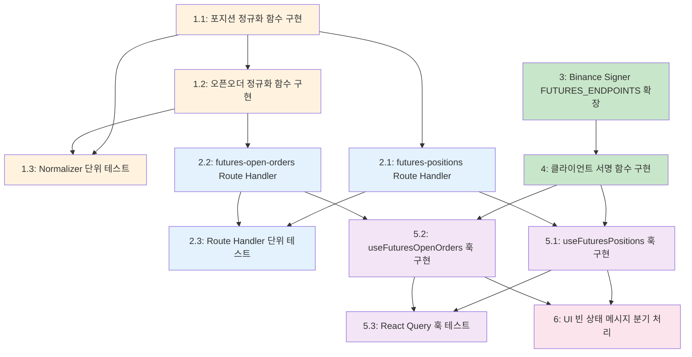

# Implementation Plan: 선물 포지션 및 오픈오더 조회

## 개요

BitScope 선물 거래 페이지에서 Binance, Gate.io, Bitget 3개 거래소의 오픈 포지션과 미체결 주문(오픈오더)을 실시간으로 조회하는 기능을 구현한다. 이미 완성된 UI 컴포넌트와 타입 정의를 기반으로, 서버 정규화 -> Route Handler -> 클라이언트 서명 -> React Query 훅 -> UI 빈 상태 메시지 순서로 점진적으로 구현한다.

---

- [x] 1. Normalizer 모듈 구현 및 테스트 (`futures-positions.ts`)
- [x] 1.1 포지션 정규화 함수 구현
  - `apps/web/app/api/exchange/_lib/normalizer/futures-positions.ts` 파일 생성
  - `safeParseFloat` 유틸리티 함수 구현 (문자열 -> 숫자 변환, NaN 시 0 반환)
  - Gate.io 심볼 변환 유틸리티 구현 (`BTC_USDT` -> `BTCUSDT`)
  - Binance 포지션 정규화 함수 구현: `positionAmt` 부호로 LONG/SHORT 판별, `entryPrice`, `markPrice`, `unRealizedProfit`, `leverage`, `liquidationPrice`, `marginType` 매핑
  - Gate.io 포지션 정규화 함수 구현: `size` 부호로 LONG/SHORT 판별, `entry_price`, `mark_price`, `unrealised_pnl`, `leverage`, `liq_price`, `mode` 매핑, `update_time` 초->밀리초 변환
  - Bitget 포지션 정규화 함수 구현: `holdSide`로 LONG/SHORT 판별, `openPriceAvg`, `markPrice`, `unrealizedPL`, `leverage`, `liquidationPrice`, `marginMode` 매핑
  - 디스패처 함수 `normalizeFuturesPositions(exchange, rawResponse)` 구현
  - `quantity === 0`인 항목 필터링 (실제 오픈 포지션만 반환)
  - _Requirements: 3.1, 3.2, 3.3, 3.4, 3.5, 3.6, 1.9, 1.10_

- [x] 1.2 오픈오더 정규화 함수 구현
  - 동일 파일에 오픈오더 정규화 함수 추가
  - Binance 오픈오더 정규화: `orderId`, `symbol`, `side`, `positionSide`, `type`, `price`, `origQty`, `status`, `time` 매핑
  - Gate.io 오픈오더 정규화: `id`, `contract` 심볼 변환, `size` 부호로 BUY/SELL 판별, `price`, `left`(잔량), `status`, `create_time` 초->밀리초 변환, `size` 방향으로 positionSide 추론
  - Bitget 오픈오더 정규화: `orderId`, `symbol`, `side` 대문자 변환, `tradeSide`+`side` 조합으로 positionSide 추론, `orderType` 대문자 변환, `price`, `size`, `status`, `cTime` 매핑, `data.entrustedList` 배열 추출
  - 디스패처 함수 `normalizeFuturesOpenOrders(exchange, rawResponse)` 구현
  - _Requirements: 4.1, 4.2, 4.3, 4.4, 4.5, 4.6, 2.9_

- [ ] 1.3 Normalizer 단위 테스트 작성
  - `apps/web/app/api/exchange/_lib/normalizer/__tests__/futures-positions.test.ts` 파일 생성
  - 각 거래소별 포지션 정규화 테스트: 필드 매핑 정확성, LONG/SHORT 판별, 문자열->숫자 변환, NaN 처리, quantity=0 필터링
  - 각 거래소별 오픈오더 정규화 테스트: 필드 매핑 정확성, BUY/SELL 판별, positionSide 추론 로직(특히 Gate.io, Bitget), 타임스탬프 변환
  - Gate.io 심볼 변환 테스트 (`BTC_USDT` -> `BTCUSDT`)
  - Bitget `data.entrustedList` 배열 추출 테스트
  - 빈 배열 / null / undefined 응답 처리 테스트
  - 지원하지 않는 거래소에 대한 에러 처리 테스트
  - _Requirements: 3.1~3.6, 4.1~4.6_

- [x] 2. Route Handler 구현 및 테스트
- [x] 2.1 `futures-positions` Route Handler 구현
  - `apps/web/app/api/exchange/[exchange]/futures-positions/route.ts` 파일 생성
  - 기존 `orders/route.ts` 패턴을 따라 POST 핸들러 구현
  - 선물 지원 거래소 검증 (`binance`, `gate`, `bitget` 외 -> HTTP 400 `INVALID_EXCHANGE`)
  - SignedRequest 본문 파싱 및 필수 필드(`url`, `method`, `headers`) 검증 -> HTTP 400 `INVALID_SIGNED_REQUEST`
  - `relayRequest`를 통한 거래소 API 릴레이 (`cacheEndpoint: EXCHANGE_ENDPOINTS[exchange].futuresPositions`)
  - 릴레이 성공 시 `normalizeFuturesPositions(exchange, rawData)`로 정규화
  - 정규화 실패 시 HTTP 500 `NORMALIZATION_ERROR` 반환
  - normalizer 모듈을 `_lib/normalizer/index.ts`에서 re-export 추가
  - _Requirements: 1.1, 1.2, 1.3, 1.4, 1.5, 1.6, 1.7, 1.8, 1.9, 1.10, 8.3, 8.4, 8.5, 9.1, 9.4, 9.7_

- [x] 2.2 `futures-open-orders` Route Handler 구현
  - `apps/web/app/api/exchange/[exchange]/futures-open-orders/route.ts` 파일 생성
  - `futures-positions` Route Handler와 동일한 패턴으로 POST 핸들러 구현
  - 선물 지원 거래소 검증 -> HTTP 400 `INVALID_EXCHANGE`
  - SignedRequest 본문 파싱 및 필수 필드 검증 -> HTTP 400 `INVALID_SIGNED_REQUEST`
  - `relayRequest`를 통한 거래소 API 릴레이 (`cacheEndpoint: EXCHANGE_ENDPOINTS[exchange].futuresOpenOrders`)
  - 릴레이 성공 시 `normalizeFuturesOpenOrders(exchange, rawData)`로 정규화
  - 정규화 실패 시 HTTP 500 `NORMALIZATION_ERROR` 반환
  - _Requirements: 2.1, 2.2, 2.3, 2.4, 2.5, 2.6, 2.7, 2.8, 2.9, 8.3, 8.4, 8.5, 9.1, 9.4, 9.7_

- [ ] 2.3 Route Handler 단위 테스트 작성
  - `futures-positions/route.test.ts` 및 `futures-open-orders/route.test.ts` 생성
  - 유효하지 않은 거래소 -> HTTP 400 `INVALID_EXCHANGE` 테스트
  - 불완전한 SignedRequest (url/method/headers 누락) -> HTTP 400 `INVALID_SIGNED_REQUEST` 테스트
  - JSON 파싱 실패 -> HTTP 400 `INVALID_REQUEST_BODY` 테스트
  - 정상 릴레이 + 정규화 -> HTTP 200 + 정규화된 데이터 반환 테스트
  - 릴레이 실패 -> 적절한 HTTP 상태 코드 전파 테스트
  - 정규화 실패 -> HTTP 500 `NORMALIZATION_ERROR` 테스트
  - `relayRequest`와 normalizer 함수를 모킹하여 테스트
  - _Requirements: 1.1~1.8, 2.1~2.8_

- [x] 3. Binance Signer FUTURES_ENDPOINTS 확장
  - `apps/web/lib/exchange/binance-signer.ts` 수정
  - `FUTURES_ENDPOINTS` 배열에 `BINANCE_ENDPOINTS.futuresPositions`, `BINANCE_ENDPOINTS.futuresOpenOrders` 추가 (기존 `BINANCE_ENDPOINTS.futures`와 함께)
  - `BINANCE_ENDPOINTS.futuresOrderbook`도 향후 일관성을 위해 함께 추가
  - 기존 `binance-signer.test.ts`가 있다면 Futures 엔드포인트 도메인 매핑 테스트 추가
  - _Requirements: 8.2, 9.7_

- [x] 4. 클라이언트 서명 함수 구현
  - `apps/web/lib/api-client.ts`에 `signFuturesPositionsRequest` 함수 추가
  - `apps/web/lib/api-client.ts`에 `signFuturesOpenOrdersRequest` 함수 추가
  - 기존 `signFuturesBalanceRequest` 패턴을 따름: `EXCHANGE_ENDPOINTS[exchange].futuresPositions`/`futuresOpenOrders` 엔드포인트 사용
  - Bitget: `queryParams: { productType: 'USDT-FUTURES' }` 추가
  - Gate.io 오픈오더: `queryParams: { status: 'open' }` 추가
  - Futures 미지원 거래소는 `null` 반환
  - _Requirements: 8.1, 8.2, 8.4, 9.7_

- [x] 5. React Query 훅 실제 구현 (placeholder 교체)
- [x] 5.1 `useFuturesPositions` 훅 구현
  - `apps/web/hooks/useFuturesApi.ts`의 placeholder `useFuturesPositions` 함수를 실제 구현으로 교체
  - `useQueries`를 사용하여 등록된 모든 선물 거래소에 대해 병렬 포지션 조회
  - API Key 복호화 (`decryptApiKeyForExchange`), 서명 생성 (`signFuturesPositionsRequest`), fetch (`fetchFuturesPositions`) 파이프라인 구현
  - API Key 미등록 거래소는 `enabled: false`로 쿼리 비활성화
  - 30초 `refetchInterval` 설정
  - 최대 2회 재시도 + 지수 백오프 (`retryDelay: 1000 * 2^attemptIndex`, 최대 4000ms)
  - 모든 거래소 결과를 하나의 `positions` 배열로 합산
  - 실패 거래소는 `errors` 맵에 기록 (다른 거래소 결과에 영향 없음)
  - `refetchAll` 함수로 전체 거래소 재조회 지원
  - import 추가: `useQueries`, `signFuturesPositionsRequest`, `fetchFuturesPositions`, `decryptApiKeyForExchange`
  - _Requirements: 5.1, 5.2, 5.3, 5.4, 5.5, 5.6, 5.7, 5.8, 5.9, 8.1, 8.2, 9.2, 9.5, 9.6_

- [x] 5.2 `useFuturesOpenOrders` 훅 구현
  - `apps/web/hooks/useFuturesApi.ts`의 placeholder `useFuturesOpenOrders` 함수를 실제 구현으로 교체
  - `useFuturesPositions`와 동일한 패턴으로 `useQueries` 기반 구현
  - API Key 복호화 -> 서명 생성 (`signFuturesOpenOrdersRequest`) -> fetch (`fetchFuturesOpenOrders`) 파이프라인
  - 30초 `refetchInterval`, 2회 재시도, 독립적 에러 처리
  - 모든 거래소 결과를 하나의 `openOrders` 배열로 합산
  - _Requirements: 6.1, 6.2, 6.3, 6.4, 6.5, 6.6, 6.7, 6.8, 6.9, 8.1, 8.2, 9.2, 9.5, 9.6_

- [ ] 5.3 React Query 훅 테스트 작성
  - `apps/web/hooks/__tests__/useFuturesApi.test.ts` 파일 생성 또는 기존 테스트 확장
  - 등록된 거래소만 쿼리 활성화 테스트
  - 병렬 조회 후 통합 결과 반환 테스트
  - 부분 실패 시 성공 거래소 결과 + 실패 거래소 에러 분리 테스트
  - `refetchAll` 호출 시 전체 쿼리 재실행 테스트
  - 30초 자동 갱신 주기 설정 검증
  - API Key 미등록 시 빈 배열 반환 검증
  - _Requirements: 5.1~5.9, 6.1~6.9_

- [x] 6. UI 빈 상태 메시지 분기 처리
  - `apps/web/app/(dashboard)/futures-trading/_components/futures-position-table.tsx` 수정
  - `apps/web/app/(dashboard)/futures-trading/_components/futures-open-order-table.tsx` 수정
  - 조건별 빈 상태 메시지 구현:
    - API Key 미등록: "API Key를 등록하면 포지션을 조회할 수 있습니다"
    - API Key 있으나 포지션 없음: "오픈 포지션이 없습니다"
    - API Key 있으나 오픈오더 없음: "오픈 오더가 없습니다"
  - 로딩 중 상태 표시 (`isLoading` 활용)
  - 특정 거래소 에러 시 알림 표시 (`errors` 맵 활용, 다른 거래소 결과는 정상 표시)
  - `useFuturesPositions`/`useFuturesOpenOrders` 훅의 `isLoading`, `errors` 반환값 활용
  - _Requirements: 7.1, 7.2, 7.3, 7.4, 7.5_

---

## Tasks Dependency Diagram

**범례:**
- 주황: Normalizer 모듈 (서버 정규화)
- 파랑: Route Handler (서버 릴레이)
- 초록: Signer/서명 함수 (클라이언트 인증)
- 보라: React Query 훅 (클라이언트 상태 관리)
- 분홍: UI 빈 상태 처리

**병렬 실행 가능 그룹:**
- Task 1.1 + 1.2는 순차 (오픈오더가 포지션 유틸리티 공유), Task 3은 Task 1과 독립적으로 병렬 실행 가능
- Task 2.1과 Task 2.2는 각각 Task 1.1, 1.2 완료 후 병렬 실행 가능
- Task 5.1과 Task 5.2는 각각 Route Handler + 서명 함수 완료 후 병렬 실행 가능
