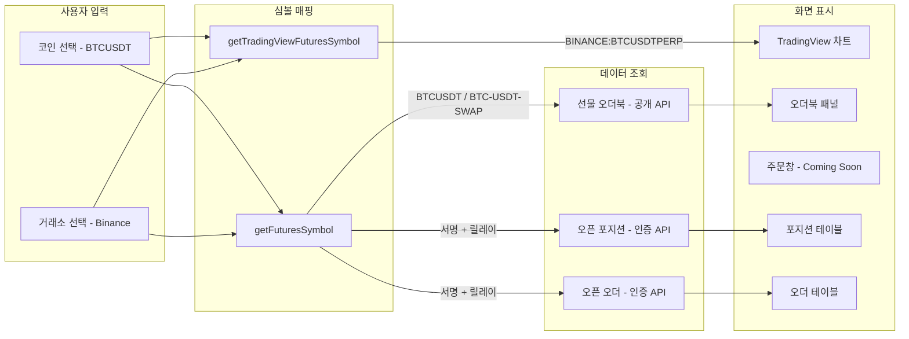
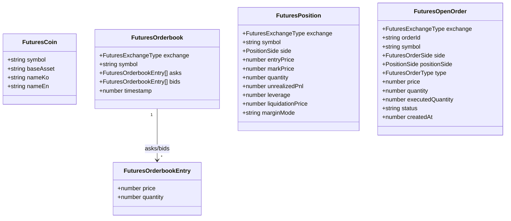
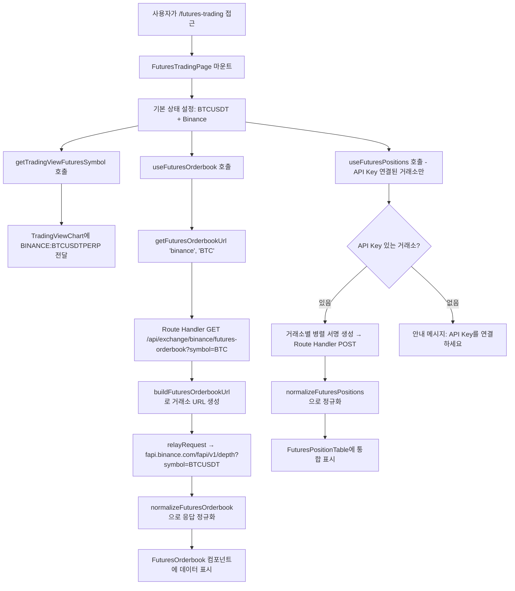
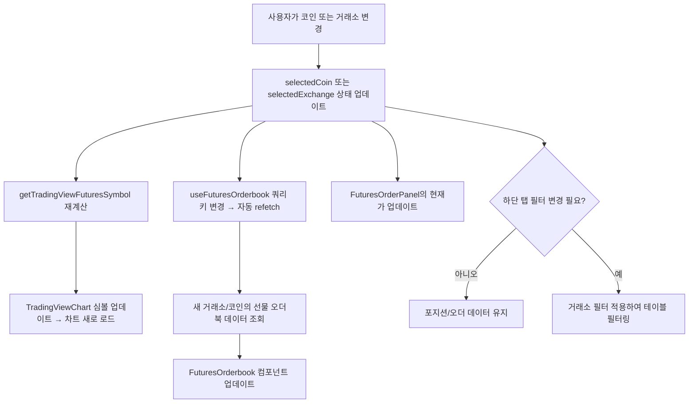
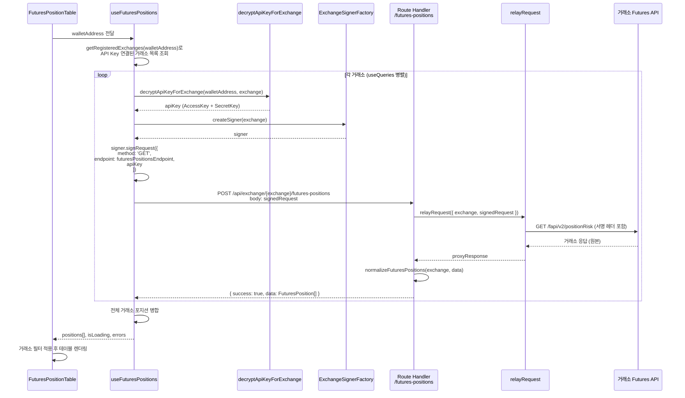
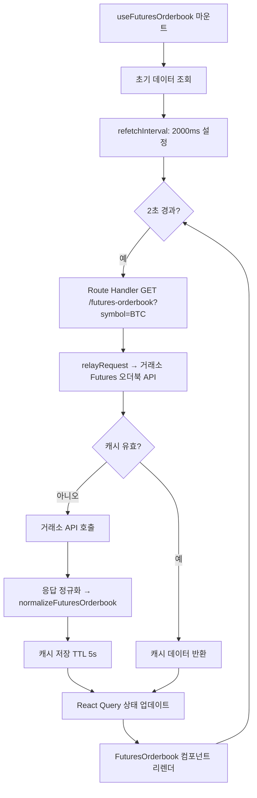

# 선물 거래 페이지 - 설계 문서

## 개요

BitScope에 **선물(Futures) 거래 페이지**를 추가한다. 기존 "선물" 메뉴를 "선물 마켓 데이터"로 이름 변경하고, 새로운 `/futures-trading` 경로에 해외 거래소(Binance, Bybit, OKX, Gate, Bitget)의 선물 차트, 오더북, 주문창(Coming Soon), 오픈 포지션 및 오픈 오더 조회 기능을 제공하는 페이지를 구축한다.

기존 보안 아키텍처(클라이언트 서명 + Route Handler 릴레이), TradingView 차트 위젯, signer 모듈, proxy/relay 인프라를 최대한 재사용하며, 마켓 페이지의 `CoinDetailView` 패턴(3컬럼 레이아웃: 차트 + 오더북 + 주문창)을 참고한다.

### 설계 결정 사항 및 근거

| 결정 | 근거 |
|------|------|
| 기존 Route Handler 패턴(`/api/exchange/[exchange]/...`) 확장 | 기존 proxy/relay/normalizer 인프라 재사용으로 개발 비용 최소화 |
| 선물 전용 엔드포인트를 `futuresOrderbook`, `futuresPositions`, `futuresOpenOrders`로 `ExchangeEndpoints`에 추가 | 기존 Spot 엔드포인트와 명확히 분리하되, 동일한 타입 시스템 활용 |
| 심볼 매핑 유틸리티를 `packages/shared`에 배치 | 프론트엔드(TradingView 심볼 변환)와 Route Handler(API 파라미터 생성) 양쪽에서 사용 |
| 오픈 포지션/오더를 `useQueries` 병렬 조회 | 기존 `useAllExchangeBalances` 패턴과 동일하게 거래소별 독립 쿼리로 부분 실패 허용 |
| 주문창은 UI만 구현하고 실제 주문은 Coming Soon | 요구사항 6에 명시된 범위 |

---

## 아키텍처 설계

### 시스템 아키텍처 다이어그램

```mermaid
graph TB
    subgraph Client["클라이언트 (브라우저)"]
        A[FuturesTradingPage] --> B[코인 콤보박스]
        A --> C[거래소 탭]
        A --> D[TradingViewChart]
        A --> E[FuturesOrderbook]
        A --> F[FuturesOrderPanel]
        A --> G[PositionTable]
        A --> H[OpenOrderTable]
        
        B --> I[useFuturesTrading Hook - 상태 관리]
        C --> I
        I --> J[useFuturesOrderbook Hook]
        I --> K[useFuturesPositions Hook]
        I --> L[useFuturesOpenOrders Hook]
        
        K --> M[ExchangeSignerFactory]
        L --> M
        M --> N[거래소별 Signer - 서명 생성]
    end
    
    subgraph Server["Next.js Route Handler"]
        O[/api/exchange/.exchange./futures-orderbook]
        P[/api/exchange/.exchange./futures-positions]
        Q[/api/exchange/.exchange./futures-open-orders]
        O --> R[proxy/relayRequest]
        P --> R
        Q --> R
        R --> S[cache + rate-limiter]
    end
    
    subgraph Exchanges["해외 거래소 API"]
        T[Binance fapi]
        U[Bybit v5]
        V[OKX api/v5]
        W[Gate.io futures/usdt]
        X[Bitget mix]
    end
    
    J -->|"GET (공개)"| O
    K -->|"POST (서명된 요청)"| P
    L -->|"POST (서명된 요청)"| Q
    
    S --> T
    S --> U
    S --> V
    S --> W
    S --> X
```

### 데이터 흐름 다이어그램



---

## 컴포넌트 설계

### 컴포넌트 A: FuturesTradingPage (페이지 컴포넌트)

- **파일 위치**: `apps/web/app/(dashboard)/futures-trading/page.tsx`
- **책임**: 선물 거래 페이지의 최상위 레이아웃 및 상태 관리
- **인터페이스**:
  - 내부 상태: `selectedCoin: string` (기본값 `'BTCUSDT'`), `selectedExchange: FuturesExchangeType` (기본값 `'binance'`), `activeTab: 'positions' | 'orders'`
- **의존성**: `useFuturesTrading`, `FuturesCoinSelector`, `FuturesExchangeTabs`, `TradingViewChart`, `FuturesOrderbook`, `FuturesOrderPanel`, `FuturesPositionTable`, `FuturesOpenOrderTable`

### 컴포넌트 B: FuturesCoinSelector (코인 선택 콤보박스)

- **파일 위치**: `apps/web/app/(dashboard)/futures-trading/_components/futures-coin-selector.tsx`
- **책임**: 검색 가능한 드롭다운으로 선물 코인 선택 제공
- **인터페이스**:
  ```typescript
  interface FuturesCoinSelectorProps {
    selectedCoin: string;
    onSelectCoin: (coin: string) => void;
  }
  ```
- **의존성**: shadcn/ui Popover + Command (콤보박스 패턴), `FUTURES_COINS` 상수

### 컴포넌트 C: FuturesExchangeTabs (거래소 선택 탭)

- **파일 위치**: `apps/web/app/(dashboard)/futures-trading/_components/futures-exchange-tabs.tsx`
- **책임**: 해외 거래소 버튼 탭 표시 및 선택 관리
- **인터페이스**:
  ```typescript
  interface FuturesExchangeTabsProps {
    selectedExchange: FuturesExchangeType;
    onSelectExchange: (exchange: FuturesExchangeType) => void;
  }
  ```
- **의존성**: `FUTURES_EXCHANGES` 상수, shadcn/ui Button

### 컴포넌트 D: FuturesOrderbook (선물 오더북)

- **파일 위치**: `apps/web/app/(dashboard)/futures-trading/_components/futures-orderbook.tsx`
- **책임**: 선물 오더북(매수/매도 호가) 표시, 1~3초 주기 자동 갱신
- **인터페이스**:
  ```typescript
  interface FuturesOrderbookProps {
    exchange: FuturesExchangeType;
    coin: string;
  }
  ```
- **의존성**: `useFuturesOrderbook` 훅, `getFuturesSymbol` 매핑 유틸

### 컴포넌트 E: FuturesOrderPanel (선물 주문창 - Coming Soon)

- **파일 위치**: `apps/web/app/(dashboard)/futures-trading/_components/futures-order-panel.tsx`
- **책임**: 레버리지, 롱/숏, 주문 유형, 가격/수량 입력 UI 표시. 주문 실행은 Coming Soon.
- **인터페이스**:
  ```typescript
  interface FuturesOrderPanelProps {
    symbol: string;
    exchange: FuturesExchangeType;
    currentPrice: number;
  }
  ```
- **의존성**: shadcn/ui 컴포넌트 (Button, Input, Slider, Badge)

### 컴포넌트 F: FuturesPositionTable (오픈 포지션 테이블)

- **파일 위치**: `apps/web/app/(dashboard)/futures-trading/_components/futures-position-table.tsx`
- **책임**: 전체 거래소 오픈 포지션 통합 테이블. 거래소 필터 지원.
- **인터페이스**:
  ```typescript
  interface FuturesPositionTableProps {
    walletAddress: string;
    exchangeFilter: FuturesExchangeType | 'all';
    onFilterChange: (filter: FuturesExchangeType | 'all') => void;
  }
  ```
- **의존성**: `useFuturesPositions` 훅

### 컴포넌트 G: FuturesOpenOrderTable (오픈 오더 테이블)

- **파일 위치**: `apps/web/app/(dashboard)/futures-trading/_components/futures-open-order-table.tsx`
- **책임**: 전체 거래소 미체결 주문 통합 테이블. 거래소 필터 지원.
- **인터페이스**:
  ```typescript
  interface FuturesOpenOrderTableProps {
    walletAddress: string;
    exchangeFilter: FuturesExchangeType | 'all';
    onFilterChange: (filter: FuturesExchangeType | 'all') => void;
  }
  ```
- **의존성**: `useFuturesOpenOrders` 훅

---

## 데이터 모델

### 핵심 데이터 구조 정의

모든 공유 타입은 `packages/shared/src/types/futures.ts`에 정의한다.

```typescript
/** 선물 거래 지원 거래소 타입 (해외 거래소만) */
export type FuturesExchangeType = 'binance' | 'bybit' | 'okx' | 'gate' | 'bitget';

/** 선물 코인 정보 */
export interface FuturesCoin {
  /** 통합 심볼 (예: 'BTCUSDT') */
  symbol: string;
  /** 기본 자산 (예: 'BTC') */
  baseAsset: string;
  /** 한글명 (예: '비트코인') */
  nameKo: string;
  /** 영문명 (예: 'Bitcoin') */
  nameEn: string;
}

/** 선물 오더북 엔트리 */
export interface FuturesOrderbookEntry {
  /** 가격 (USDT) */
  price: number;
  /** 수량 */
  quantity: number;
}

/** 정규화된 선물 오더북 */
export interface FuturesOrderbook {
  /** 거래소 */
  exchange: FuturesExchangeType;
  /** 심볼 */
  symbol: string;
  /** 매도 호가 (가격 오름차순) */
  asks: FuturesOrderbookEntry[];
  /** 매수 호가 (가격 내림차순) */
  bids: FuturesOrderbookEntry[];
  /** 타임스탬프 */
  timestamp: number;
}

/** 포지션 방향 */
export type PositionSide = 'LONG' | 'SHORT';

/** 정규화된 오픈 포지션 */
export interface FuturesPosition {
  /** 거래소 */
  exchange: FuturesExchangeType;
  /** 심볼 (예: 'BTCUSDT') */
  symbol: string;
  /** 방향 */
  side: PositionSide;
  /** 진입가 */
  entryPrice: number;
  /** 현재가 (마크 프라이스) */
  markPrice: number;
  /** 수량 (절대값) */
  quantity: number;
  /** 미실현 PnL (USDT) */
  unrealizedPnl: number;
  /** 레버리지 배수 */
  leverage: number;
  /** 청산가 */
  liquidationPrice: number;
  /** 마진 모드 (cross / isolated) */
  marginMode: 'cross' | 'isolated';
}

/** 주문 유형 */
export type FuturesOrderType = 'LIMIT' | 'MARKET' | 'STOP' | 'STOP_MARKET' | 'TAKE_PROFIT' | 'TAKE_PROFIT_MARKET';

/** 주문 방향 */
export type FuturesOrderSide = 'BUY' | 'SELL';

/** 정규화된 오픈 오더 */
export interface FuturesOpenOrder {
  /** 거래소 */
  exchange: FuturesExchangeType;
  /** 주문 ID */
  orderId: string;
  /** 심볼 */
  symbol: string;
  /** 방향 (BUY/SELL) */
  side: FuturesOrderSide;
  /** 포지션 방향 (LONG/SHORT) */
  positionSide: PositionSide;
  /** 주문 유형 */
  type: FuturesOrderType;
  /** 주문 가격 (USDT) */
  price: number;
  /** 주문 수량 */
  quantity: number;
  /** 체결된 수량 */
  executedQuantity: number;
  /** 주문 상태 */
  status: string;
  /** 주문 생성 시간 */
  createdAt: number;
}

/** 거래소별 선물 심볼 매핑 설정 */
export interface FuturesSymbolConfig {
  /** 거래소 API에 사용할 심볼 변환 함수 */
  formatApiSymbol: (baseAsset: string) => string;
  /** TradingView 차트 심볼 변환 함수 */
  formatTradingViewSymbol: (baseAsset: string) => string;
  /** 거래소별 선물 오더북 엔드포인트 */
  orderbookEndpoint: string;
  /** 거래소별 선물 포지션 엔드포인트 */
  positionsEndpoint: string;
  /** 거래소별 선물 오픈 오더 엔드포인트 */
  openOrdersEndpoint: string;
}
```

### 데이터 모델 다이어그램



---

## 거래소별 선물 심볼 매핑

`packages/shared/src/constants/futures.ts`에 정의한다.

### API 심볼 매핑

| 거래소 | 입력 (baseAsset) | 출력 (API 심볼) | 오더북 엔드포인트 |
|--------|------------------|-----------------|-------------------|
| Binance | `BTC` | `BTCUSDT` | `GET /fapi/v1/depth?symbol=BTCUSDT` |
| Bybit | `BTC` | `BTCUSDT` | `GET /v5/market/orderbook?category=linear&symbol=BTCUSDT` |
| OKX | `BTC` | `BTC-USDT-SWAP` | `GET /api/v5/market/books?instId=BTC-USDT-SWAP` |
| Gate | `BTC` | `BTC_USDT` | `GET /api/v4/futures/usdt/order_book?contract=BTC_USDT` |
| Bitget | `BTC` | `BTCUSDT` | `GET /api/v2/mix/market/depth?symbol=BTCUSDT&productType=USDT-FUTURES` |

### TradingView 심볼 매핑

| 거래소 | 입력 (baseAsset) | 출력 (TradingView 심볼) |
|--------|------------------|------------------------|
| Binance | `BTC` | `BINANCE:BTCUSDTPERP` |
| Bybit | `BTC` | `BYBIT:BTCUSDT.P` |
| OKX | `BTC` | `OKX:BTCUSDT.P` |
| Gate | `BTC` | `GATEIO:BTCUSDTPERP` |
| Bitget | `BTC` | `BITGET:BTCUSDT.P` |

### 포지션/오더 엔드포인트 매핑

| 거래소 | 포지션 엔드포인트 | 오픈 오더 엔드포인트 |
|--------|-------------------|---------------------|
| Binance | `GET /fapi/v2/positionRisk` | `GET /fapi/v1/openOrders` |
| Bybit | `GET /v5/position/list?category=linear` | `GET /v5/order/realtime?category=linear` |
| OKX | `GET /api/v5/account/positions?instType=SWAP` | `GET /api/v5/trade/orders-pending?instType=SWAP` |
| Gate | `GET /api/v4/futures/usdt/positions` | `GET /api/v4/futures/usdt/orders?status=open` |
| Bitget | `GET /api/v2/mix/position/all-position?productType=USDT-FUTURES` | `GET /api/v2/mix/order/orders-pending?productType=USDT-FUTURES` |

---

## 비즈니스 프로세스

### 프로세스 1: 선물 거래 페이지 초기 로드



### 프로세스 2: 코인 또는 거래소 변경



### 프로세스 3: 오픈 포지션 조회 (인증 API)



### 프로세스 4: 오더북 주기적 갱신



---

## Route Handler 설계

기존 `apps/web/app/api/exchange/[exchange]/orderbook/route.ts` 패턴을 따라 3개의 새 Route Handler를 추가한다.

### Route Handler 1: 선물 오더북 (`futures-orderbook/route.ts`)

- **경로**: `apps/web/app/api/exchange/[exchange]/futures-orderbook/route.ts`
- **메서드**: `GET`
- **파라미터**: `?symbol=BTC` (baseAsset)
- **처리 흐름**:
  1. `exchange` 파라미터 유효성 검증 (`FUTURES_EXCHANGES`에 포함 여부)
  2. `buildFuturesOrderbookUrl(exchange, symbol)` 호출하여 거래소별 URL 생성
     - Binance: `https://fapi.binance.com/fapi/v1/depth?symbol=BTCUSDT&limit=20`
     - Bybit: `https://api.bybit.com/v5/market/orderbook?category=linear&symbol=BTCUSDT`
     - OKX: `https://www.okx.com/api/v5/market/books?instId=BTC-USDT-SWAP&sz=20`
     - Gate: `https://api.gateio.ws/api/v4/futures/usdt/order_book?contract=BTC_USDT&limit=20`
     - Bitget: `https://api.bitget.com/api/v2/mix/market/depth?symbol=BTCUSDT&productType=USDT-FUTURES&limit=20`
  3. `relayRequest`로 거래소에 릴레이
  4. `normalizeFuturesOrderbook(exchange, data)`로 응답 정규화
  5. 정규화된 `FuturesOrderbook` 반환

### Route Handler 2: 선물 포지션 (`futures-positions/route.ts`)

- **경로**: `apps/web/app/api/exchange/[exchange]/futures-positions/route.ts`
- **메서드**: `POST` (서명된 요청)
- **처리 흐름**:
  1. 요청 본문에서 `signedRequest` 추출
  2. `relayRequest`로 거래소에 릴레이
  3. `normalizeFuturesPositions(exchange, data)`로 응답 정규화
  4. 정규화된 `FuturesPosition[]` 반환

### Route Handler 3: 선물 오픈 오더 (`futures-open-orders/route.ts`)

- **경로**: `apps/web/app/api/exchange/[exchange]/futures-open-orders/route.ts`
- **메서드**: `POST` (서명된 요청)
- **처리 흐름**:
  1. 요청 본문에서 `signedRequest` 추출
  2. `relayRequest`로 거래소에 릴레이
  3. `normalizeFuturesOpenOrders(exchange, data)`로 응답 정규화
  4. 정규화된 `FuturesOpenOrder[]` 반환

---

## React Query 훅 설계

`apps/web/hooks/useFuturesApi.ts`에 선물 전용 훅을 정의한다. 기존 `useExchangeApi.ts` 패턴을 따른다.

### 쿼리 키 팩토리

```typescript
export const futuresQueryKeys = {
  all: ['futures'] as const,
  orderbook: (exchange: FuturesExchangeType, symbol: string) =>
    ['futures', exchange, 'orderbook', symbol] as const,
  positions: (exchange: FuturesExchangeType) =>
    ['futures', exchange, 'positions'] as const,
  allPositions: () => ['futures', 'all-positions'] as const,
  openOrders: (exchange: FuturesExchangeType) =>
    ['futures', exchange, 'open-orders'] as const,
  allOpenOrders: () => ['futures', 'all-open-orders'] as const,
} as const;
```

### useFuturesOrderbook

```typescript
interface UseFuturesOrderbookOptions {
  exchange: FuturesExchangeType;
  symbol: string; // baseAsset (예: 'BTC')
  enabled?: boolean;
  refetchInterval?: number; // 기본 2000ms
}

function useFuturesOrderbook(options: UseFuturesOrderbookOptions): 
  UseQueryResult<FuturesOrderbookResponse, ExchangeApiError>
```

- 공개 API이므로 서명 불필요
- `GET /api/exchange/{exchange}/futures-orderbook?symbol={baseAsset}`
- `refetchInterval: 2000` (2초 간격)

### useFuturesPositions

```typescript
interface UseFuturesPositionsOptions {
  walletAddress: string;
  enabled?: boolean;
  refetchInterval?: number; // 기본 10000ms
}

interface UseFuturesPositionsReturn {
  positions: FuturesPosition[];
  isLoading: boolean;
  errors: Partial<Record<FuturesExchangeType, ExchangeApiError>>;
  refetchAll: () => void;
}

function useFuturesPositions(options: UseFuturesPositionsOptions):
  UseFuturesPositionsReturn
```

- `useQueries`로 API Key 연결된 거래소별 병렬 조회
- 각 거래소 독립적으로 실패 허용 (기존 `useAllExchangeBalances` 패턴)
- 클라이언트에서 서명 생성 → Route Handler POST

### useFuturesOpenOrders

```typescript
interface UseFuturesOpenOrdersOptions {
  walletAddress: string;
  enabled?: boolean;
  refetchInterval?: number; // 기본 10000ms
}

interface UseFuturesOpenOrdersReturn {
  openOrders: FuturesOpenOrder[];
  isLoading: boolean;
  errors: Partial<Record<FuturesExchangeType, ExchangeApiError>>;
  refetchAll: () => void;
}

function useFuturesOpenOrders(options: UseFuturesOpenOrdersOptions):
  UseFuturesOpenOrdersReturn
```

- `useFuturesPositions`와 동일한 병렬 조회 패턴

---

## 사이드바 네비게이션 변경

`apps/web/components/layout/sidebar-nav.tsx`의 `NAV_SECTIONS` 수정:

```typescript
// 기존
{ labelKey: 'futures', href: '/futures', icon: Activity },

// 변경 후
{ labelKey: 'futuresMarketData', href: '/futures', icon: Activity },
{ labelKey: 'futuresTrading', href: '/futures-trading', icon: ChartCandlestick },
```

`apps/web/lib/i18n/` 번역 파일에 새 키 추가:
- `futuresMarketData`: '선물 마켓 데이터' / 'Futures Market Data'
- `futuresTrading`: '선물 거래' / 'Futures Trading'

---

## 거래소별 서명 생성 확장

기존 signer 모듈은 Spot API 엔드포인트용으로 설계되어 있지만, `signRequest` 인터페이스는 `endpoint`와 `queryParams`를 자유롭게 지정할 수 있어 Futures 엔드포인트에도 그대로 사용 가능하다. 다만 Binance Futures API는 `fapi.binance.com`이라는 다른 도메인을 사용하므로, Route Handler에서 URL을 구성할 때 `EXCHANGE_CONFIGS[exchange].futuresBaseUrl`을 사용해야 한다.

### 서명 생성 흐름 (클라이언트)

```typescript
// 포지션 조회 서명 생성 예시 (Binance)
const signer = createSigner('binance');
const signedRequest = signer.signRequest({
  method: 'GET',
  endpoint: '/fapi/v2/positionRisk', // Futures 엔드포인트
  apiKey: decryptedApiKey,
});
// signedRequest.url → "https://api.binance.com/fapi/v2/positionRisk?timestamp=...&signature=..."
// → Route Handler에서 URL을 fapi.binance.com으로 변환
```

### Route Handler에서 Base URL 치환

Binance의 경우 signer가 `api.binance.com` 기준으로 URL을 생성하지만, Futures API는 `fapi.binance.com` 도메인을 사용한다. Route Handler에서 이를 처리한다:

```typescript
function rewriteFuturesUrl(exchange: FuturesExchangeType, url: string): string {
  const config = EXCHANGE_CONFIGS[exchange];
  if (config.futuresBaseUrl) {
    return url.replace(config.restBaseUrl, config.futuresBaseUrl);
  }
  return url;
}
```

---

## 응답 정규화 (Normalizer)

`apps/web/app/api/exchange/_lib/normalizer/` 디렉터리에 선물 전용 정규화 함수를 추가한다.

### normalizeFuturesOrderbook

각 거래소의 선물 오더북 응답을 `FuturesOrderbook` 타입으로 변환한다.

| 거래소 | 응답 구조 | 매핑 |
|--------|-----------|------|
| Binance | `{ bids: [["price","qty"],...], asks: [...] }` | 직접 매핑 |
| Bybit | `{ result: { b: [["price","qty"],...], a: [...] } }` | `result.b` → bids, `result.a` → asks |
| OKX | `{ data: [{ bids: [...], asks: [...] }] }` | `data[0].bids/asks` |
| Gate | `{ bids: [{ p, s }], asks: [{ p, s }] }` | `p` → price, `s` → quantity |
| Bitget | `{ data: { bids: [...], asks: [...] } }` | `data.bids/asks` |

### normalizeFuturesPositions

각 거래소의 포지션 응답을 `FuturesPosition[]` 타입으로 변환한다.

| 거래소 | 원본 필드 | 정규화 필드 매핑 |
|--------|-----------|-----------------|
| Binance | `positionAmt`, `entryPrice`, `markPrice`, `unRealizedProfit`, `leverage`, `liquidationPrice` | 직접 매핑, `positionAmt > 0` → LONG, `< 0` → SHORT |
| Bybit | `side`, `avgPrice`, `markPrice`, `unrealisedPnl`, `leverage`, `liqPrice` | `side: 'Buy'` → LONG |
| OKX | `posSide`, `avgPx`, `markPx`, `upl`, `lever`, `liqPx` | `posSide: 'long'` → LONG |
| Gate | `size` (+/- 방향), `entry_price`, `mark_price`, `unrealised_pnl`, `leverage`, `liq_price` | `size > 0` → LONG |
| Bitget | `holdSide`, `averageOpenPrice`, `markPrice`, `unrealizedPL`, `leverage`, `liquidationPrice` | `holdSide: 'long'` → LONG |

### normalizeFuturesOpenOrders

각 거래소의 오픈 오더 응답을 `FuturesOpenOrder[]` 타입으로 변환한다. 포지션과 유사하게 거래소별 필드명을 정규화한다.

---

## `ExchangeEndpoints` 확장

`packages/shared/src/constants/exchanges.ts`의 `ExchangeEndpoints` 인터페이스에 선물 전용 엔드포인트 필드를 추가한다:

```typescript
export interface ExchangeEndpoints {
  // ... 기존 필드
  /** 선물 오더북 조회 (공개 API) */
  futuresOrderbook?: string;
  /** 선물 포지션 조회 (인증 필요) */
  futuresPositions?: string;
  /** 선물 오픈 오더 조회 (인증 필요) */
  futuresOpenOrders?: string;
}
```

각 거래소 엔드포인트 상수에 값 추가:

```typescript
export const BINANCE_ENDPOINTS: ExchangeEndpoints = {
  // ... 기존
  futuresOrderbook: '/fapi/v1/depth',
  futuresPositions: '/fapi/v2/positionRisk',
  futuresOpenOrders: '/fapi/v1/openOrders',
};

export const BYBIT_ENDPOINTS: ExchangeEndpoints = {
  // ... 기존
  futuresOrderbook: '/v5/market/orderbook',
  futuresPositions: '/v5/position/list',
  futuresOpenOrders: '/v5/order/realtime',
};

export const OKX_ENDPOINTS: ExchangeEndpoints = {
  // ... 기존
  futuresOrderbook: '/api/v5/market/books',
  futuresPositions: '/api/v5/account/positions',
  futuresOpenOrders: '/api/v5/trade/orders-pending',
};

export const GATE_ENDPOINTS: ExchangeEndpoints = {
  // ... 기존
  futuresOrderbook: '/api/v4/futures/usdt/order_book',
  futuresPositions: '/api/v4/futures/usdt/positions',
  futuresOpenOrders: '/api/v4/futures/usdt/orders',
};

export const BITGET_ENDPOINTS: ExchangeEndpoints = {
  // ... 기존
  futuresOrderbook: '/api/v2/mix/market/depth',
  futuresPositions: '/api/v2/mix/position/all-position',
  futuresOpenOrders: '/api/v2/mix/order/orders-pending',
};
```

---

## 페이지 레이아웃 설계

### 데스크탑 (1280px 이상)

```
+--------------------------------------------------+
| 코인 콤보박스 [BTC ▼]                              |
| [Binance] [Bybit] [OKX] [Gate] [Bitget]          |
+--------------------------------------------------+
| TradingView 차트     | 오더북    | 주문창          |
| (flex-1)            | (220px)  | (280px)         |
|                     |          | Coming Soon      |
|                     |          |                  |
|                     |          |                  |
| (height: 420px)     |          |                  |
+--------------------------------------------------+
| [오픈 포지션] [오픈 오더]     필터: [All] [Bi] ...  |
+--------------------------------------------------+
| 거래소 | 심볼 | 방향 | 진입가 | 현재가 | PnL | ... |
| ...                                              |
+--------------------------------------------------+
```

### 태블릿 (768px ~ 1279px)

```
+----------------------------------+
| 코인 콤보박스 [BTC ▼]            |
| [Bi] [By] [OKX] [Gate] [Bg]     |
+----------------------------------+
| TradingView 차트 (전체 너비)      |
| (height: 360px)                  |
+----------------------------------+
| 오더북 (50%)  | 주문창 (50%)      |
+----------------------------------+
| 오픈 포지션/오더 테이블            |
| (수평 스크롤)                    |
+----------------------------------+
```

### 모바일 (767px 이하)

```
+--------------------+
| 코인 [BTC ▼]      |
| [Bi] [By] [OKX]...  |
+--------------------+
| TradingView 차트   |
| (height: 300px)    |
+--------------------+
| 오더북 (전체 너비)  |
+--------------------+
| 주문창 (전체 너비)  |
| Coming Soon        |
+--------------------+
| 오픈 포지션/오더    |
| (수평 스크롤)      |
+--------------------+
```

---

## 에러 처리 전략

### 계층별 에러 처리

| 계층 | 에러 유형 | 처리 방식 |
|------|-----------|-----------|
| Route Handler | 거래소 API 5xx 오류 | 캐시된 스테일 데이터 반환, 없으면 502 오류 |
| Route Handler | Rate Limit (429) | 지수 백오프 재시도 (최대 3회) |
| Route Handler | 타임아웃 | 408 오류 반환, 캐시 데이터 대체 |
| React Query | API 호출 실패 | `retry: 2`, 이전 데이터 유지 (`placeholderData`) |
| UI (오더북) | 데이터 없음 | 스켈레톤 → 에러 메시지 + 재시도 버튼 |
| UI (포지션) | 일부 거래소 실패 | 성공한 거래소 데이터 정상 표시, 실패 거래소 뱃지 표시 |
| UI (포지션) | API Key 미등록 | "API Key를 연결하면 조회할 수 있습니다" 안내 |
| UI (코인 미지원) | 거래소에서 해당 코인 미지원 | "이 코인은 해당 거래소에서 지원되지 않습니다" 안내 |

### Normalizer 에러 처리

정규화 실패 시 원본 데이터를 로깅하고, 500 에러를 반환한다 (기존 `normalizeOrderbook` 패턴 동일).

```typescript
try {
  const normalizedData = normalizeFuturesOrderbook(exchange, proxyResponse.data);
  return NextResponse.json({ success: true, data: normalizedData });
} catch (error) {
  return NextResponse.json({
    success: false,
    error: {
      message: `선물 오더북 정규화 실패: ${error instanceof Error ? error.message : String(error)}`,
      code: 'NORMALIZATION_ERROR',
    },
  }, { status: 500 });
}
```

---

## 테스트 전략

### 단위 테스트

| 대상 | 테스트 내용 | 위치 |
|------|------------|------|
| `getFuturesSymbol` | 거래소별 심볼 변환 정확성 | `packages/shared/src/__tests__/futures.test.ts` |
| `getTradingViewFuturesSymbol` | TradingView 심볼 변환 정확성 | 동일 |
| `normalizeFuturesOrderbook` | 거래소별 원본 응답 → 정규화 변환 | `apps/web/app/api/exchange/_lib/normalizer/__tests__/futures.test.ts` |
| `normalizeFuturesPositions` | 거래소별 포지션 응답 정규화 | 동일 |
| `normalizeFuturesOpenOrders` | 거래소별 오픈 오더 응답 정규화 | 동일 |
| `buildFuturesOrderbookUrl` | 거래소별 URL 생성 정확성 | Route Handler 테스트 |

### 통합 테스트

| 대상 | 테스트 내용 |
|------|------------|
| Route Handler (futures-orderbook) | GET 요청 → 정규화된 오더북 반환 (MSW/모킹 사용) |
| Route Handler (futures-positions) | POST 서명 요청 → 정규화된 포지션 반환 |
| 서명 생성 → Route Handler 릴레이 | 클라이언트 서명이 거래소 API에 올바르게 전달되는지 |

### E2E 테스트 (수동)

| 시나리오 | 검증 항목 |
|----------|----------|
| 사이드바 메뉴 | "선물 마켓 데이터"와 "선물 거래" 메뉴 분리 확인 |
| 코인 변경 | 차트, 오더북이 새 코인으로 갱신되는지 |
| 거래소 변경 | 차트 심볼, 오더북이 새 거래소로 갱신되는지 |
| 오더북 갱신 | 2초 간격으로 데이터 업데이트 확인 |
| 오픈 포지션 | API Key 연결된 거래소의 포지션이 테이블에 표시되는지 |
| 주문창 | Coming Soon 표시 및 UI 인터랙션 동작 확인 |
| 반응형 | 데스크톱/태블릿/모바일 레이아웃 전환 확인 |

---

## 파일 구조 요약

```
packages/shared/src/
├── types/
│   └── futures.ts                          # 선물 전용 타입 (NEW)
├── constants/
│   ├── exchanges.ts                        # ExchangeEndpoints 확장 (MODIFY)
│   └── futures.ts                          # 선물 코인 목록, 심볼 매핑 (NEW)
└── index.ts                                # export 추가 (MODIFY)

apps/web/
├── app/(dashboard)/
│   └── futures-trading/
│       ├── page.tsx                        # 선물 거래 페이지 (NEW)
│       └── _components/
│           ├── futures-coin-selector.tsx    # 코인 콤보박스 (NEW)
│           ├── futures-exchange-tabs.tsx    # 거래소 탭 (NEW)
│           ├── futures-orderbook.tsx        # 선물 오더북 (NEW)
│           ├── futures-order-panel.tsx      # 주문창 Coming Soon (NEW)
│           ├── futures-position-table.tsx   # 오픈 포지션 테이블 (NEW)
│           └── futures-open-order-table.tsx # 오픈 오더 테이블 (NEW)
├── app/api/exchange/[exchange]/
│   ├── futures-orderbook/
│   │   └── route.ts                        # 선물 오더북 Route Handler (NEW)
│   ├── futures-positions/
│   │   └── route.ts                        # 선물 포지션 Route Handler (NEW)
│   └── futures-open-orders/
│       └── route.ts                        # 선물 오픈 오더 Route Handler (NEW)
├── app/api/exchange/_lib/normalizer/
│   ├── futures-orderbook.ts                # 선물 오더북 정규화 (NEW)
│   ├── futures-positions.ts                # 선물 포지션 정규화 (NEW)
│   ├── futures-open-orders.ts              # 선물 오픈 오더 정규화 (NEW)
│   └── index.ts                            # export 추가 (MODIFY)
├── hooks/
│   └── useFuturesApi.ts                    # 선물 전용 React Query 훅 (NEW)
├── lib/
│   └── api-client.ts                       # fetchFuturesOrderbook 등 추가 (MODIFY)
└── components/layout/
    └── sidebar-nav.tsx                     # 메뉴 변경 (MODIFY)
```
