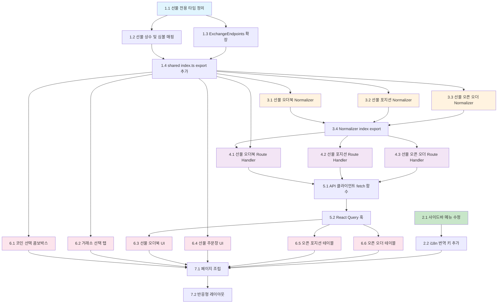

# Implementation Plan - 선물 거래 페이지

## 개요

선물(Futures) 거래 페이지를 BitScope에 추가하기 위한 구현 태스크 목록이다. 기존 코드베이스의 패턴(Route Handler, normalizer, signer, i18n 등)을 따르며, 의존성 순서대로 점진적으로 구현한다.

---

- [x] 1. 공유 타입 및 상수 정의 (`packages/shared`)
- [x] 1.1 선물 전용 타입 파일 생성 (`packages/shared/src/types/futures.ts`)
  - `FuturesExchangeType`, `FuturesCoin`, `FuturesOrderbookEntry`, `FuturesOrderbook`, `PositionSide`, `FuturesPosition`, `FuturesOrderType`, `FuturesOrderSide`, `FuturesOpenOrder`, `FuturesSymbolConfig` 타입/인터페이스를 설계 문서의 데이터 모델 섹션에 따라 정의
  - 기존 `packages/shared/src/types/` 디렉터리의 패턴 참고
  - _Requirements: 11.7, NFR-3.3_

- [x] 1.2 선물 상수 파일 생성 (`packages/shared/src/constants/futures.ts`)
  - `FUTURES_EXCHANGES` 배열 정의 (binance, bybit, okx, gate, bitget)
  - `FUTURES_COINS` 배열 정의 (BTCUSDT, ETHUSDT, SOLUSDT, XRPUSDT 등 주요 선물 코인 목록)
  - `FUTURES_SYMBOL_CONFIGS` 맵 정의: 거래소별 API 심볼 변환 함수(`formatApiSymbol`), TradingView 심볼 변환 함수(`formatTradingViewSymbol`), 오더북/포지션/오픈 오더 엔드포인트 매핑
  - 헬퍼 함수 `getFuturesSymbol(exchange, baseAsset)`, `getTradingViewFuturesSymbol(exchange, baseAsset)` 구현
  - 설계 문서의 "거래소별 선물 심볼 매핑" 테이블 기반
  - _Requirements: 11.1, 11.2, 11.3, 11.4, 11.5, 11.6, 11.7, 4.2, 4.3, 4.4, 4.5, 4.6_

- [x] 1.3 `ExchangeEndpoints` 인터페이스 확장 및 거래소별 엔드포인트 추가
  - `packages/shared/src/constants/exchanges.ts`의 `ExchangeEndpoints` 인터페이스에 `futuresOrderbook?`, `futuresPositions?`, `futuresOpenOrders?` 필드 추가
  - `BINANCE_ENDPOINTS`, `BYBIT_ENDPOINTS`, `OKX_ENDPOINTS`, `GATE_ENDPOINTS`, `BITGET_ENDPOINTS` 각각에 선물 엔드포인트 값 추가
  - 설계 문서의 "ExchangeEndpoints 확장" 섹션 기반
  - _Requirements: 5.4, 5.5, 7.9, 7.10, 8.5, 8.6, 9.4_

- [x] 1.4 `packages/shared/src/index.ts`에 선물 타입 및 상수 export 추가
  - `types/futures.ts`의 모든 타입 re-export
  - `constants/futures.ts`의 상수 및 헬퍼 함수 re-export
  - _Requirements: 11.7, NFR-3.3_

- [x] 2. 사이드바 네비게이션 변경
- [x] 2.1 사이드바 메뉴 항목 수정 (`apps/web/components/layout/sidebar-nav.tsx`)
  - 기존 `{ labelKey: 'futures', href: '/futures', icon: Activity }` 항목의 `labelKey`를 `'futuresMarketData'`로 변경
  - 바로 아래에 `{ labelKey: 'futuresTrading', href: '/futures-trading', icon: ChartCandlestick }` 항목 추가 (ChartCandlestick은 이미 import 되어 있으므로 적절한 아이콘 사용, 예: `CandlestickChart` 또는 `ArrowUpDown`)
  - _Requirements: 1.1, 1.2, 1.3, 1.4, 1.5_

- [x] 2.2 i18n 번역 키 추가
  - `apps/web/lib/i18n/ko.ts`의 `nav` 섹션에 `futuresMarketData: '선물 마켓 데이터'`, `futuresTrading: '선물 거래'` 추가하고 기존 `futures` 키 제거
  - `apps/web/lib/i18n/en.ts`의 `nav` 섹션에 `futuresMarketData: 'Futures Market Data'`, `futuresTrading: 'Futures Trading'` 추가하고 기존 `futures` 키 제거
  - _Requirements: 1.1, 1.2_

- [ ] 3. 선물 오더북 Normalizer 구현
- [x] 3.1 선물 오더북 정규화 모듈 생성 (`apps/web/app/api/exchange/_lib/normalizer/futures-orderbook.ts`)
  - `normalizeFuturesOrderbook(exchange: FuturesExchangeType, rawResponse: unknown): FuturesOrderbook` 함수 구현
  - 거래소별 분기 처리: Binance(`bids/asks` 배열), Bybit(`result.b/a`), OKX(`data[0].bids/asks`), Gate(`bids[{p,s}]/asks[{p,s}]`), Bitget(`data.bids/asks`)
  - 설계 문서의 "normalizeFuturesOrderbook" 매핑 테이블 참고
  - 기존 `normalizer/binance.ts` 등의 코드 패턴 참고
  - _Requirements: 5.2, 5.3, 9.1_

- [ ] 3.2 선물 포지션 정규화 모듈 생성 (`apps/web/app/api/exchange/_lib/normalizer/futures-positions.ts`)
  - `normalizeFuturesPositions(exchange: FuturesExchangeType, rawResponse: unknown): FuturesPosition[]` 함수 구현
  - 거래소별 분기 처리: Binance(`positionAmt` 기반 방향), Bybit(`side: Buy/Sell`), OKX(`posSide`), Gate(`size` 부호), Bitget(`holdSide`)
  - 수량이 0인 포지션은 필터링
  - 설계 문서의 "normalizeFuturesPositions" 매핑 테이블 참고
  - _Requirements: 7.2, 7.3, 7.4, 7.9, 7.10_

- [ ] 3.3 선물 오픈 오더 정규화 모듈 생성 (`apps/web/app/api/exchange/_lib/normalizer/futures-open-orders.ts`)
  - `normalizeFuturesOpenOrders(exchange: FuturesExchangeType, rawResponse: unknown): FuturesOpenOrder[]` 함수 구현
  - 거래소별 원본 응답의 필드명을 `FuturesOpenOrder` 인터페이스로 정규화
  - _Requirements: 8.2, 8.5, 8.6_

- [x] 3.4 normalizer `index.ts`에 선물 정규화 함수 export 추가
  - `apps/web/app/api/exchange/_lib/normalizer/index.ts`에 `normalizeFuturesOrderbook`, `normalizeFuturesPositions`, `normalizeFuturesOpenOrders` import 및 re-export
  - _Requirements: 9.1_

- [ ] 4. 선물 Route Handler 구현
- [x] 4.1 선물 오더북 Route Handler 생성 (`apps/web/app/api/exchange/[exchange]/futures-orderbook/route.ts`)
  - GET 메서드 구현: `?symbol=BTC` 파라미터로 baseAsset 받음
  - `buildFuturesOrderbookUrl(exchange, symbol)` 함수 구현: 거래소별 선물 오더북 API URL 생성 (설계 문서의 URL 매핑 테이블 참고)
  - Binance는 `futuresBaseUrl`(fapi.binance.com) 사용
  - `relayRequest` 호출 후 `normalizeFuturesOrderbook`으로 응답 정규화
  - 기존 `orderbook/route.ts` 패턴과 에러 처리 동일하게 구현
  - _Requirements: 5.4, 5.5, 9.1, 9.4, 9.6_

- [ ] 4.2 선물 포지션 Route Handler 생성 (`apps/web/app/api/exchange/[exchange]/futures-positions/route.ts`)
  - POST 메서드 구현: 클라이언트에서 서명한 `signedRequest`를 body로 받음
  - Binance의 경우 `signedRequest.url`의 도메인을 `fapi.binance.com`으로 치환하는 `rewriteFuturesUrl` 로직 구현
  - `relayRequest` 호출 후 `normalizeFuturesPositions`로 응답 정규화
  - 기존 POST Route Handler 패턴(body 파싱, signedRequest 검증 등) 동일하게 적용
  - _Requirements: 7.9, 7.10, 9.2, 9.4, 9.5, 9.6, 10.3_

- [ ] 4.3 선물 오픈 오더 Route Handler 생성 (`apps/web/app/api/exchange/[exchange]/futures-open-orders/route.ts`)
  - POST 메서드 구현: `signedRequest`를 body로 받음
  - `rewriteFuturesUrl` 로직 동일 적용
  - `relayRequest` 호출 후 `normalizeFuturesOpenOrders`로 응답 정규화
  - _Requirements: 8.5, 8.6, 9.3, 9.4, 9.5, 9.6, 10.3_

- [x] 5. 클라이언트 API 함수 및 React Query 훅 구현
- [x] 5.1 API 클라이언트에 선물 전용 fetch 함수 추가 (`apps/web/lib/api-client.ts`)
  - `fetchFuturesOrderbook(exchange, symbol)`: GET 방식으로 `/api/exchange/{exchange}/futures-orderbook?symbol={baseAsset}` 호출
  - `fetchFuturesPositions(exchange, signedRequest)`: POST 방식으로 `/api/exchange/{exchange}/futures-positions` 호출
  - `fetchFuturesOpenOrders(exchange, signedRequest)`: POST 방식으로 `/api/exchange/{exchange}/futures-open-orders` 호출
  - 기존 `fetchTicker`, `fetchOrderbook` 등의 함수 패턴 참고
  - _Requirements: 9.1, 9.2, 9.3_

- [x] 5.2 선물 전용 React Query 훅 파일 생성 (`apps/web/hooks/useFuturesApi.ts`)
  - `futuresQueryKeys` 쿼리 키 팩토리 정의 (설계 문서 참고)
  - `useFuturesOrderbook` 훅: `useQuery`로 선물 오더북 조회, `refetchInterval: 2000` 설정
  - `useFuturesPositions` 훅: `useQueries`로 API Key 연결된 거래소별 포지션 병렬 조회, 클라이언트에서 서명 생성 후 POST 호출
  - `useFuturesOpenOrders` 훅: `useQueries`로 거래소별 오픈 오더 병렬 조회
  - 기존 `useExchangeApi.ts`의 패턴(에러 처리, 부분 실패 허용) 참고
  - _Requirements: 5.7, 7.1, 7.11, 8.1, 8.7, NFR-1.1, NFR-1.3_

- [x] 6. 선물 거래 페이지 UI 컴포넌트 구현
- [x] 6.1 코인 선택 콤보박스 생성 (`apps/web/app/(dashboard)/futures-trading/_components/futures-coin-selector.tsx`)
  - shadcn/ui의 `Popover` + `Command` 조합으로 검색 가능한 드롭다운 구현
  - `FUTURES_COINS` 상수에서 코인 목록 표시, 텍스트 입력 시 필터링
  - `selectedCoin`과 `onSelectCoin` props 사용
  - _Requirements: 2.1, 2.2, 2.3, 2.4_

- [x] 6.2 거래소 선택 탭 생성 (`apps/web/app/(dashboard)/futures-trading/_components/futures-exchange-tabs.tsx`)
  - `FUTURES_EXCHANGES` 배열 기반으로 Binance, Bybit, OKX, Gate, Bitget 버튼 탭 렌더링
  - 선택된 거래소 활성 상태 표시 (shadcn/ui Button의 variant 활용)
  - `selectedExchange`와 `onSelectExchange` props 사용
  - _Requirements: 3.1, 3.2, 3.3_

- [x] 6.3 선물 오더북 컴포넌트 생성 (`apps/web/app/(dashboard)/futures-trading/_components/futures-orderbook.tsx`)
  - `useFuturesOrderbook` 훅을 사용하여 선물 오더북 데이터 조회
  - 매도 호가(Ask)를 상단 빨간색, 매수 호가(Bid)를 하단 초록색으로 표시
  - 각 호가에 가격, 수량, 누적 수량 표시
  - 로딩 시 스켈레톤 UI, 에러 시 에러 메시지 + 재시도 버튼 표시
  - _Requirements: 5.1, 5.2, 5.3, 5.6, 5.7, 12.5, 12.6, NFR-4.1_

- [x] 6.4 선물 주문창 컴포넌트 생성 (`apps/web/app/(dashboard)/futures-trading/_components/futures-order-panel.tsx`)
  - 레버리지 설정(슬라이더), 롱/숏 방향 선택(토글), 주문 유형(지정가/시장가 탭), 가격 입력, 수량 입력, 마진 정보 필드 UI 구현
  - 주문 실행 버튼 위에 "Coming Soon" Badge 오버레이 표시
  - 주문 버튼 클릭 시 토스트로 "주문 기능은 추후 지원 예정입니다" 안내
  - UI 인터랙션(슬라이더, 토글, 입력 등)은 정상 동작하도록 구현
  - _Requirements: 6.1, 6.2, 6.3, 6.4, 6.5_

- [x] 6.5 오픈 포지션 테이블 컴포넌트 생성 (`apps/web/app/(dashboard)/futures-trading/_components/futures-position-table.tsx`)
  - `useFuturesPositions` 훅으로 전체 거래소 오픈 포지션 통합 조회
  - 테이블 컬럼: 거래소, 심볼, 방향(Long/Short), 진입가, 현재가, 수량, 미실현 PnL, 레버리지, 청산가
  - 방향 Long은 초록색, Short은 빨간색 텍스트
  - 미실현 PnL 양수는 초록색, 음수는 빨간색 텍스트
  - 거래소 필터(All, Binance, Bybit, OKX, Gate, Bitget) 구현
  - API Key 미등록 시 안내 메시지 표시
  - 수평 스크롤 지원
  - _Requirements: 7.1, 7.2, 7.3, 7.4, 7.5, 7.6, 7.7, 7.8, 7.11, 12.4, NFR-4.1_

- [x] 6.6 오픈 오더 테이블 컴포넌트 생성 (`apps/web/app/(dashboard)/futures-trading/_components/futures-open-order-table.tsx`)
  - `useFuturesOpenOrders` 훅으로 전체 거래소 오픈 오더 통합 조회
  - 테이블 컬럼: 거래소, 심볼, 방향, 주문 유형(Limit/Market), 가격, 수량, 상태, 생성 시간
  - 거래소 필터 구현 (포지션 테이블과 동일한 패턴)
  - API Key 미등록 시 안내 메시지 표시
  - 수평 스크롤 지원
  - _Requirements: 8.1, 8.2, 8.3, 8.4, 8.7, 12.4_

- [x] 7. 선물 거래 페이지 조립
- [x] 7.1 페이지 파일 생성 (`apps/web/app/(dashboard)/futures-trading/page.tsx`)
  - 상단: `FuturesCoinSelector` + `FuturesExchangeTabs`
  - 중앙 3열 레이아웃: `TradingViewChart`(flex-1) + `FuturesOrderbook`(220px) + `FuturesOrderPanel`(280px)
  - TradingView 차트에 `getTradingViewFuturesSymbol(exchange, baseAsset)` 호출 결과를 심볼로 전달
  - 하단: 탭(오픈 포지션/오픈 오더) + `FuturesPositionTable` 또는 `FuturesOpenOrderTable`
  - 페이지 상태: `selectedCoin`(기본 'BTCUSDT'), `selectedExchange`(기본 'binance'), `activeTab`('positions'/'orders')
  - 코인 또는 거래소 변경 시 차트, 오더북 데이터 자동 갱신
  - 코인이 현재 거래소에서 미지원 시 안내 메시지 표시
  - _Requirements: 2.1, 2.4, 2.5, 3.1, 3.3, 3.4, 4.1, 4.7, 4.8, 12.1, 12.5, 12.6_

- [ ] 7.2 반응형 레이아웃 적용
  - 데스크탑(1280px+): 3열 레이아웃 (차트 + 오더북 + 주문창)
  - 태블릿(768px~1279px): 차트 전체 너비 + 오더북/주문창 2열
  - 모바일(~767px): 차트, 오더북, 주문창 수직 스택
  - Tailwind 반응형 클래스 활용 (`lg:`, `md:` 등)
  - _Requirements: 12.1, 12.2, 12.3, 12.4_

---

## Tasks Dependency Diagram

