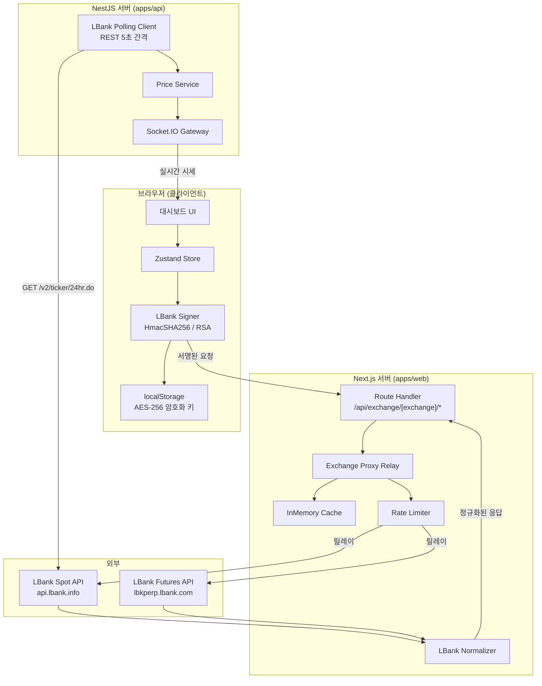
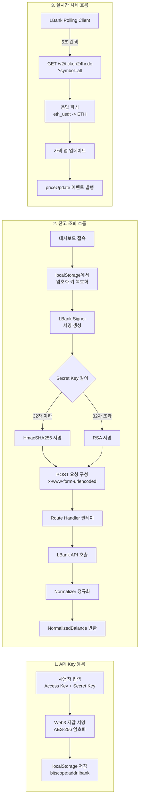
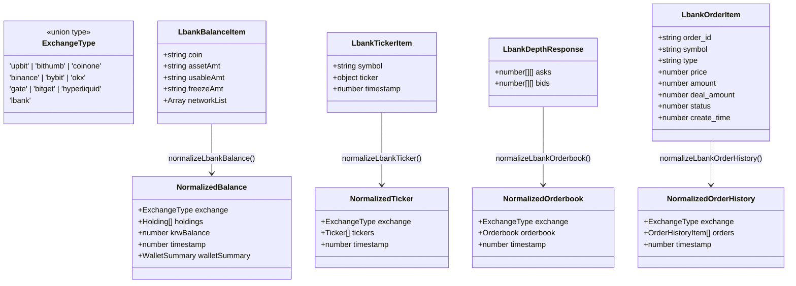
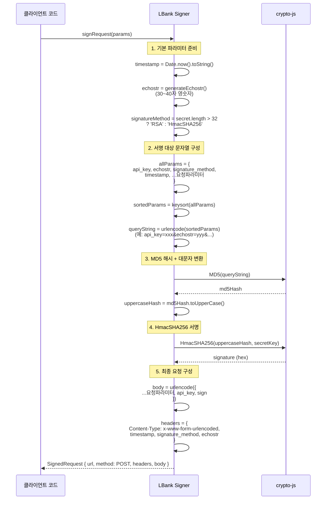
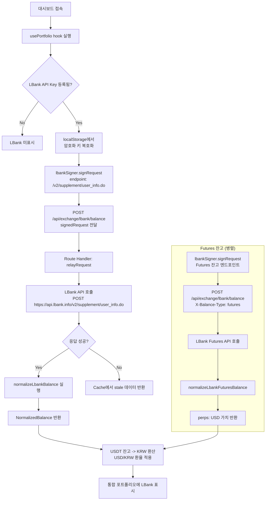
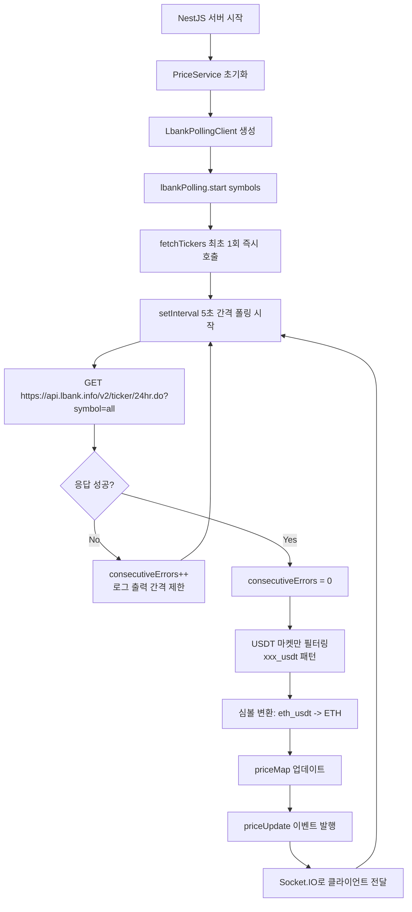
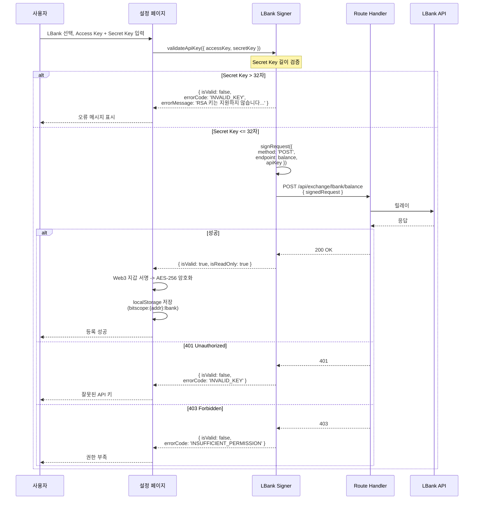
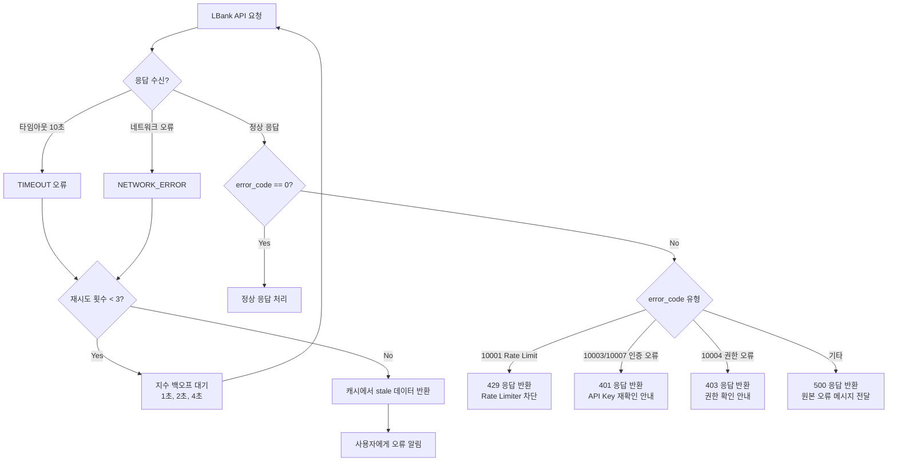

# Design Document: LBank 거래소 통합

## Overview

BitScope 프로젝트에 LBank 암호화폐 거래소를 10번째 지원 거래소로 추가한다. LBank는 USDT 기반 해외 중앙화 거래소(CEX)로 분류되며, 기존 해외 거래소(바이낸스, 바이빗, OKX, Gate.io, Bitget)와 동일한 어댑터 패턴을 따라 통합한다.

LBank의 고유한 특성은 다음과 같다:
- **인증 방식**: Secret Key 길이에 따라 HmacSHA256(32자 이하) 또는 RSA(32자 초과) 자동 선택
- **서명 과정**: 파라미터 정렬 -> MD5 해시 -> 대문자 변환 -> HmacSHA256/RSA 서명의 2단계 해싱
- **요청 형식**: 모든 Private API가 POST + `application/x-www-form-urlencoded` 형식
- **거래쌍 형식**: 소문자 + 언더스코어 (`eth_usdt`)
- **실시간 시세**: WebSocket 미지원, REST 폴링 방식 사용

### 설계 원칙

1. **기존 어댑터 패턴 준수**: ExchangeSigner, ResponseNormalizer, PollingClient 인터페이스를 그대로 구현하여 기존 코드 변경을 최소화한다.
2. **보안 아키텍처 유지**: API Key는 브라우저에서만 사용하고, 서버에는 서명된 요청만 전달한다.
3. **타입 안전성**: ExchangeType 유니온 타입 확장으로 컴파일 타임에 누락을 감지한다.

---

## Architecture Design

### System Architecture Diagram



### Data Flow Diagram



---

## Component Design

### Component 1: ExchangeType 및 거래소 설정 (packages/shared)

- **책임**: LBank을 시스템 전체에서 타입 안전하게 참조할 수 있도록 등록
- **변경 파일**:
  - `packages/shared/src/types/exchange.ts` - ExchangeType 유니온에 `'lbank'` 추가
  - `packages/shared/src/constants/exchanges.ts` - LBANK_CONFIG, LBANK_ENDPOINTS, 맵/배열 등록
- **인터페이스**: 기존 `ExchangeConfig`, `ExchangeEndpoints` 인터페이스 그대로 사용
- **의존성**: 없음 (공유 패키지 최하위 레이어)

### Component 2: LBank Signer (apps/web/lib/exchange)

- **책임**: 클라이언트 사이드에서 LBank API 요청에 대한 서명 생성
- **파일**: `apps/web/lib/exchange/lbank-signer.ts`
- **인터페이스**:
  ```typescript
  // ExchangeSigner 인터페이스 구현
  signRequest(params: SignRequestParams): SignedRequest
  validateApiKey(apiKey: ApiKeyPair): Promise<ApiKeyValidationResult>
  getExchangeType(): ExchangeType  // returns 'lbank'
  ```
- **내부 함수**:
  ```typescript
  // echostr 생성 (30~40자 랜덤 문자열)
  generateEchostr(): string
  // 현재 밀리초 타임스탬프
  generateTimestamp(): string
  // 서명 방식 판별 (Secret Key 길이 기준)
  getSignatureMethod(secretKey: string): 'HmacSHA256' | 'RSA'
  // 파라미터 알파벳순 정렬 후 URL 인코딩 쿼리스트링 생성
  buildSortedQueryString(params: Record<string, string>): string
  // MD5 해시 + 대문자 변환
  computeMD5Hash(data: string): string
  // HmacSHA256 서명
  createHmacSignature(preparedStr: string, secretKey: string): string
  // RSA 서명 (Secret Key가 32자 초과 시)
  createRsaSignature(preparedStr: string, secretKey: string): string
  ```
- **의존성**: `crypto-js` (MD5, HmacSHA256), `@bitscope/shared` (LBANK_CONFIG, LBANK_ENDPOINTS)

### Component 3: LBank Normalizer (apps/web/app/api/exchange/_lib/normalizer)

- **책임**: LBank API 응답을 통일된 내부 데이터 모델로 변환
- **파일**: `apps/web/app/api/exchange/_lib/normalizer/lbank.ts`
- **인터페이스**:
  ```typescript
  normalizeLbankBalance(rawResponse: unknown): NormalizedBalance
  normalizeLbankTicker(rawResponse: unknown): NormalizedTicker
  normalizeLbankOrderbook(rawResponse: unknown): NormalizedOrderbook
  normalizeLbankOrderHistory(rawResponse: unknown): NormalizedOrderHistory
  normalizeLbankFuturesBalance(rawResponse: unknown): number
  ```
- **의존성**: `@bitscope/shared` (Holding, Ticker, Orderbook 타입), `./types` (Normalized* 타입)

### Component 4: LBank Polling Client (apps/api/src/modules/price/exchange-ws)

- **책임**: LBank 공개 시세 API를 주기적으로 폴링하여 가격 데이터를 수집
- **파일**: `apps/api/src/modules/price/exchange-ws/lbank-polling.client.ts`
- **인터페이스**:
  ```typescript
  class LbankPollingClient extends EventEmitter implements OnModuleDestroy {
    start(symbols: string[]): Promise<void>
    stop(): Promise<void>
    subscribe(symbols: string[]): void
    getPrice(symbol: string): LbankPriceEntry | null
    getAllPrices(): Map<string, LbankPriceEntry>
    isActive(): boolean
  }
  ```
- **의존성**: `@bitscope/shared` (LBANK_CONFIG, PriceUpdate), `@nestjs/common` (Injectable, Logger)

### Component 5: Normalizer Dispatcher 등록 (apps/web/app/api/exchange/_lib/normalizer/index.ts)

- **책임**: 기존 디스패처 함수(normalizeBalance, normalizeTicker 등)에 `'lbank'` 케이스 추가
- **변경 파일**: `apps/web/app/api/exchange/_lib/normalizer/index.ts`
- **인터페이스**: 기존 switch-case에 `case 'lbank':` 추가
- **의존성**: Component 3 (LBank Normalizer)

### Component 6: Signer Factory 등록 (apps/web/lib/exchange/signer-factory.ts)

- **책임**: signerRegistry에 `'lbank'` 서명기 인스턴스 등록
- **변경 파일**: `apps/web/lib/exchange/signer-factory.ts`
- **인터페이스**: 기존 레지스트리 맵에 항목 추가
- **의존성**: Component 2 (LBank Signer)

### Component 7: Polling Client 배럴 Export (apps/api/src/modules/price/exchange-ws/index.ts)

- **책임**: LBank Polling Client를 배럴 파일에서 export
- **변경 파일**: `apps/api/src/modules/price/exchange-ws/index.ts`
- **의존성**: Component 4 (LBank Polling Client)

---

## Data Model

### Core Data Structure Definitions

#### LBank API 원본 응답 타입 (Normalizer 내부용)

```typescript
/** LBank v2 API 공통 응답 래퍼 */
interface LbankApiResponse<T> {
  result: 'true' | 'false';
  data: T;
  error_code: number;  // 0 = 성공
  ts: number;          // 서버 타임스탬프
}

/**
 * LBank 잔고 조회 응답 항목
 * POST /v2/supplement/user_info.do
 *
 * 응답은 배열 형태로 각 코인별 잔고 정보를 포함한다.
 */
interface LbankBalanceItem {
  coin: string;          // 코인 심볼 (소문자, 예: "usdt", "btc", "eth")
  assetAmt: string;      // 총 자산 수량
  usableAmt: string;     // 사용 가능 수량
  freezeAmt: string;     // 동결 수량
  networkList: Array<{   // 네트워크 목록 (입출금용, 잔고 정규화에서는 무시)
    coin: string;
    network: string;
    name: string;
    isDefault: boolean;
    withdrawFee: string;
    withdrawMin: number;
  }>;
}

/**
 * LBank 시세 조회 응답 항목
 * GET /v2/ticker/24hr.do?symbol=all
 */
interface LbankTickerItem {
  symbol: string;          // 거래쌍 (예: "eth_usdt")
  ticker: {
    change: number;        // 24시간 변동률 (%, 예: 4.21)
    high: number;          // 24시간 최고가
    latest: number;        // 최신가
    low: number;           // 24시간 최저가
    turnover: number;      // 24시간 거래금액
    vol: number;           // 24시간 거래량
  };
  timestamp: number;       // 타임스탬프
}

/**
 * LBank 호가 조회 응답
 * GET /v2/depth.do?symbol=eth_usdt
 */
interface LbankDepthResponse {
  asks: [number, number][];  // 매도 호가 [price, volume]
  bids: [number, number][];  // 매수 호가 [price, volume]
}

/**
 * LBank 주문 내역 조회 응답 항목
 * POST /v2/supplement/orders_info_history.do
 */
interface LbankOrderItem {
  order_id: string;         // 주문 ID
  symbol: string;           // 거래쌍 (예: "eth_usdt")
  type: string;             // 주문 유형 ("buy" | "sell")
  price: number;            // 주문 가격
  amount: number;           // 주문 수량
  deal_amount: number;      // 체결 수량
  avg_price: number;        // 평균 체결 가격
  status: number;           // -1: 취소, 0: 미체결, 1: 부분체결, 2: 완전체결, 3: 부분체결+취소, 4: 취소중
  create_time: number;      // 주문 생성 시각 (밀리초 타임스탬프)
}

/**
 * LBank 폴링 클라이언트 가격 항목
 */
interface LbankPriceEntry {
  symbol: string;       // 코인 심볼 (예: "BTC")
  usdtPrice: number;    // USDT 가격
  timestamp: number;    // 타임스탬프 (밀리초)
}
```

#### 거래소 설정 상수

```typescript
/** LBank API 설정 */
const LBANK_CONFIG: ExchangeConfig = {
  id: 'lbank',
  nameKo: '엘뱅크',
  nameEn: 'LBank',
  restBaseUrl: 'https://api.lbank.info',
  futuresBaseUrl: 'https://lbkperp.lbank.com',
  wsUrl: undefined,  // WebSocket 미지원, REST 폴링 사용
  rateLimit: {
    requestsPerSecond: 20,
    requestsPerMinute: 1200,
  },
  timeoutMs: 10_000,
};

/** LBank API 엔드포인트 */
const LBANK_ENDPOINTS: ExchangeEndpoints = {
  balance: '/v2/supplement/user_info.do',
  ticker: '/v2/ticker/24hr.do',
  orderbook: '/v2/depth.do',
  orders: '/v2/supplement/orders_info_history.do',
  markets: '/v2/currencyPairs.do',
  futures: '/cfd/openApi/v1/pub/marketData',
};

/** LBank REST 폴링 간격 (밀리초) */
const LBANK_POLLING_INTERVAL_MS = 5_000;
```

### Data Model Diagram



---

## Business Process

### Process 1: LBank API 서명 생성 (HmacSHA256 방식)

CCXT 공식 구현을 기반으로 한 LBank v2 API 서명 과정이다.



**설계 결정 사항:**
- CCXT의 검증된 구현(`sign` 메서드)을 참고하여 서명 과정을 동일하게 구현한다.
- `echostr`는 uuid22 + uuid16 조합으로 38자 랜덤 문자열을 생성한다 (CCXT 패턴 동일).
- 서명 대상 문자열에는 `echostr`, `signature_method`, `timestamp`가 포함되지만, 최종 body에는 `sign`만 포함되고 이 3개 값은 헤더로 전달된다.
- RSA 서명은 Secret Key를 PEM 포맷으로 변환 후 SHA256 기반 RSA 서명을 수행한다. 단, 대부분의 LBank 사용자가 HmacSHA256을 사용하므로 RSA는 초기 버전에서 미지원하고, Secret Key 길이가 32자를 초과하면 오류 메시지를 표시하는 것으로 처리한다.

### Process 2: 잔고 조회 및 포트폴리오 표시



### Process 3: 실시간 시세 폴링



### Process 4: API Key 등록 및 검증



---

## Error Handling Strategy

### LBank API 오류 코드 매핑

LBank API는 응답 body에 `error_code` 필드로 오류를 반환한다. 주요 오류 코드와 내부 처리를 다음과 같이 매핑한다.

| LBank error_code | 의미 | 내부 처리 |
|---|---|---|
| 0 | 성공 | 정상 처리 |
| 10000 | Required field missing | `INVALID_REQUEST` 오류 반환 |
| 10001 | Request frequency too high | Rate Limiter와 연계하여 지수 백오프 재시도 |
| 10002 | Invalid parameter | `INVALID_REQUEST` 오류 반환 |
| 10003 | Verification failed | `INVALID_KEY` 오류 반환 |
| 10004 | No permission | `INSUFFICIENT_PERMISSION` 오류 반환 |
| 10007 | Invalid signature | `INVALID_KEY` 오류 반환 + 서명 오류 메시지 |
| 10008 | Illegal IP | 사용자에게 IP 화이트리스트 확인 안내 |
| 10031 | echostr length must be 30~40 | 서명 모듈 내부 오류 (코드 버그) |

### 네트워크 오류 처리



### 서명 생성 오류 처리

| 상황 | 처리 |
|---|---|
| Access Key 빈 문자열 | `Error('LBank API Key가 필요합니다.')` throw |
| Secret Key 빈 문자열 | `Error('LBank Secret Key가 필요합니다.')` throw |
| Secret Key 32자 초과 (RSA) | validateApiKey에서 `{ isValid: false, errorCode: 'INVALID_KEY', errorMessage: 'RSA 키는 현재 지원하지 않습니다. HmacSHA256 키(32자 이하)를 사용해주세요.' }` 반환 |

---

## Testing Strategy

### 단위 테스트

#### LBank Signer 테스트 (`apps/web/lib/exchange/__tests__/lbank-signer.test.ts`)

| 테스트 케이스 | 검증 항목 |
|---|---|
| HmacSHA256 서명 생성 | Secret Key 32자 이하일 때 올바른 서명 생성 확인 |
| echostr 생성 | 30~40자 영숫자 랜덤 문자열 생성 확인 |
| 파라미터 알파벳 정렬 | 파라미터가 키 이름 기준 알파벳순으로 정렬되는지 확인 |
| MD5 해시 대문자 | MD5 해시 결과가 대문자로 변환되는지 확인 |
| POST 요청 형식 | method가 항상 POST이고, Content-Type이 x-www-form-urlencoded인지 확인 |
| URL 구성 | Spot은 api.lbank.info, Futures는 lbkperp.lbank.com 도메인 사용 확인 |
| 헤더 구성 | timestamp, signature_method, echostr 헤더 포함 확인 |
| body 구성 | 요청 파라미터 + sign이 URL 인코딩된 형태로 포함 확인 |
| Access Key 누락 | 빈 문자열 시 에러 throw 확인 |
| Secret Key 누락 | 빈 문자열 시 에러 throw 확인 |
| validateApiKey 성공 | 200 응답 시 `{ isValid: true, isReadOnly: true }` 반환 확인 |
| validateApiKey 실패 - 401 | `{ errorCode: 'INVALID_KEY' }` 반환 확인 |
| validateApiKey 실패 - 403 | `{ errorCode: 'INSUFFICIENT_PERMISSION' }` 반환 확인 |
| validateApiKey 실패 - 네트워크 | `{ errorCode: 'NETWORK_ERROR' }` 반환 확인 |
| getExchangeType | `'lbank'` 반환 확인 |

#### LBank Normalizer 테스트 (`apps/web/app/api/exchange/__tests__/lbank-normalizer.test.ts`)

| 테스트 케이스 | 검증 항목 |
|---|---|
| 잔고 정규화 | `coin` 소문자 -> 대문자 변환, usableAmt/freezeAmt 파싱, USDT 잔고 합산 확인 |
| 잔고 빈 응답 | 빈 data 배열 시 빈 holdings 반환 확인 |
| 시세 정규화 | `eth_usdt` -> `ETH` 심볼 추출, change/latest/vol 매핑 확인 |
| 호가 정규화 | asks/bids 배열의 [price, quantity] 매핑 확인 |
| 주문 내역 정규화 | status 코드 매핑 (-1->cancelled, 2->filled 등), 날짜 변환 확인 |
| 거래쌍 형식 변환 | `eth_usdt` -> `ETH`, `btc_usdt` -> `BTC` 변환 확인 |
| Futures 잔고 정규화 | USDT 합계 추출 확인 |

#### LBank Polling Client 테스트 (`apps/api/src/modules/price/exchange-ws/lbank-polling.client.spec.ts`)

| 테스트 케이스 | 검증 항목 |
|---|---|
| 시작/중지 | start 시 즉시 fetch + 폴링 타이머 시작, stop 시 타이머 정리 확인 |
| 시세 수신 | USDT 마켓 심볼만 필터링, priceUpdate 이벤트 발행 확인 |
| 심볼 변환 | `eth_usdt` -> `ETH` 변환 후 priceMap 저장 확인 |
| 네트워크 오류 | 연속 오류 카운터 증가, 로그 스팸 방지 확인 |
| fetch 취소 | stop 시 AbortController로 진행 중 fetch 취소 확인 |

### 통합 테스트

| 테스트 케이스 | 검증 항목 |
|---|---|
| E2E 잔고 조회 | Signer -> Route Handler -> Normalizer 전체 플로우 |
| E2E 시세 조회 | 공개 API -> Normalizer -> UI 전체 플로우 |
| 타입 안전성 | ExchangeType에 'lbank' 추가 후 모든 switch-case/Record에서 컴파일 오류 없음 확인 |
| Signer Factory | `createSigner('lbank')` 호출 시 올바른 LBank Signer 인스턴스 반환 확인 |

---

## 변경 대상 파일 요약

### 신규 파일 (4개)

| 파일 | 설명 |
|---|---|
| `apps/web/lib/exchange/lbank-signer.ts` | LBank 클라이언트 사이드 서명 모듈 |
| `apps/web/app/api/exchange/_lib/normalizer/lbank.ts` | LBank 응답 정규화 모듈 |
| `apps/api/src/modules/price/exchange-ws/lbank-polling.client.ts` | LBank REST 폴링 시세 클라이언트 |
| `apps/web/lib/exchange/__tests__/lbank-signer.test.ts` | LBank Signer 단위 테스트 |

### 수정 파일 (5개)

| 파일 | 변경 내용 |
|---|---|
| `packages/shared/src/types/exchange.ts` | ExchangeType에 `'lbank'` 추가 |
| `packages/shared/src/constants/exchanges.ts` | LBANK_CONFIG, LBANK_ENDPOINTS, 맵/배열에 등록 |
| `apps/web/lib/exchange/signer-factory.ts` | LBank Signer import 및 레지스트리 등록 |
| `apps/web/app/api/exchange/_lib/normalizer/index.ts` | LBank Normalizer import 및 switch-case 등록 |
| `apps/api/src/modules/price/exchange-ws/index.ts` | LBank Polling Client export 추가 |

### 추가 수정이 필요할 수 있는 파일

| 파일 | 변경 내용 |
|---|---|
| `apps/web/app/api/exchange/[exchange]/balance/route.ts` | FUTURES_EXCHANGES에 `'lbank'` 추가 |
| `apps/api/src/modules/price/price.service.ts` (또는 유사) | LBank Polling Client 인스턴스 생성 및 시작 |
