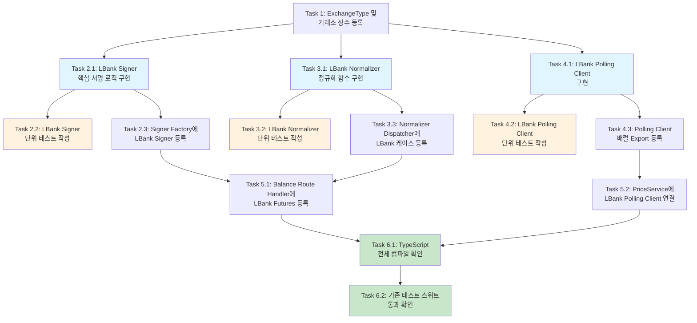

# Implementation Plan: LBank 거래소 통합

## 개요

BitScope 프로젝트에 LBank 암호화폐 거래소를 10번째 지원 거래소로 추가하기 위한 구현 태스크 목록이다. 기존 어댑터 패턴(Signer, Normalizer, PollingClient)을 따르며, 테스트 주도 개발로 진행한다.

---

- [ ] 1. ExchangeType 유니온 타입 및 거래소 상수 등록
  - `packages/shared/src/types/exchange.ts`에서 `ExchangeType` 유니온 타입에 `'lbank'` 추가
  - `packages/shared/src/constants/exchanges.ts`에 `LBANK_CONFIG`, `LBANK_ENDPOINTS`, `LBANK_POLLING_INTERVAL_MS` 상수 정의
  - `EXCHANGE_CONFIGS` 맵에 `lbank: LBANK_CONFIG` 등록
  - `EXCHANGE_ENDPOINTS` 맵에 `lbank: LBANK_ENDPOINTS` 등록
  - `SUPPORTED_EXCHANGES` 배열에 `'lbank'` 추가
  - `FOREIGN_EXCHANGES` 배열에 `'lbank'` 추가
  - TypeScript 컴파일하여 `Record<ExchangeType, ...>` 타입의 기존 코드에서 `'lbank'` 키 누락 컴파일 오류를 확인하고, 이후 태스크에서 순차 해결
  - _Requirements: 1.1, 1.2, 1.3, 1.4, 10.1_

- [ ] 2. LBank Signer 구현 및 테스트
- [ ] 2.1 LBank Signer 핵심 서명 로직 구현
  - `apps/web/lib/exchange/lbank-signer.ts` 신규 파일 생성
  - `generateEchostr()`: 30~40자 영숫자 랜덤 문자열 생성 (CCXT uuid22+uuid16 패턴)
  - `generateTimestamp()`: 현재 밀리초 타임스탬프 반환
  - `getSignatureMethod()`: Secret Key 32자 이하면 `'HmacSHA256'`, 초과면 오류 반환
  - `buildSortedQueryString()`: 파라미터를 알파벳순(ASCII) 정렬 후 URL 인코딩 쿼리스트링 생성
  - `computeMD5Hash()`: MD5 해시 후 대문자 변환
  - `createHmacSignature()`: MD5 해시 결과를 Secret Key로 HmacSHA256 서명
  - `signRequest()`: 위 함수들을 조합하여 서명된 POST 요청 생성 (method: POST, Content-Type: x-www-form-urlencoded, 헤더에 timestamp/signature_method/echostr 포함, body에 파라미터+sign 포함)
  - `validateApiKey()`: 잔고 조회 API 호출로 API Key 유효성 검증, Secret Key 32자 초과 시 RSA 미지원 오류 반환
  - `getExchangeType()`: `'lbank'` 반환
  - `crypto-js` 의존성 사용 (MD5, HmacSHA256)
  - _Requirements: 2.1, 2.2, 2.3, 2.4, 2.5, 2.6, 2.7, NFR 1.1, NFR 1.2_

- [ ] 2.2 LBank Signer 단위 테스트 작성
  - `apps/web/lib/exchange/__tests__/lbank-signer.test.ts` 신규 파일 생성
  - HmacSHA256 서명 생성 정확성 테스트 (알려진 입력 -> 알려진 출력)
  - `echostr` 길이(30~40자) 및 영숫자 패턴 검증
  - 파라미터 알파벳순 정렬 검증
  - MD5 해시 대문자 변환 검증
  - 요청 method가 항상 POST인지 검증
  - Content-Type이 `application/x-www-form-urlencoded`인지 검증
  - 헤더에 timestamp, signature_method, echostr 포함 검증
  - body에 요청 파라미터 + sign이 URL 인코딩된 형태로 포함 검증
  - Spot URL은 `api.lbank.info`, Futures URL은 `lbkperp.lbank.com` 도메인 사용 검증
  - Access Key 빈 문자열 시 에러 throw 검증
  - Secret Key 빈 문자열 시 에러 throw 검증
  - Secret Key 32자 초과 시 RSA 미지원 오류 메시지 검증
  - `validateApiKey` 성공/실패(401, 403, 네트워크 오류) 시나리오 테스트
  - `getExchangeType()` 반환값 `'lbank'` 검증
  - _Requirements: 2.1, 2.2, 2.3, 2.4, 2.5, 2.6, 2.7, NFR 5.3_

- [ ] 2.3 Signer Factory에 LBank Signer 등록
  - `apps/web/lib/exchange/signer-factory.ts`에서 `LBankSigner` import 추가
  - `lbankSigner` 어댑터 객체 생성 (기존 `gateSigner`, `bitgetSigner` 패턴 동일)
  - `signerRegistry`에 `lbank: lbankSigner` 등록
  - `createSigner('lbank')` 호출 시 올바른 인스턴스 반환 확인
  - _Requirements: 2.6_

- [ ] 3. LBank Normalizer 구현 및 테스트
- [ ] 3.1 LBank 응답 정규화 함수 구현
  - `apps/web/app/api/exchange/_lib/normalizer/lbank.ts` 신규 파일 생성
  - LBank API 원본 응답 타입 정의 (`LbankApiResponse<T>`, `LbankBalanceItem`, `LbankTickerItem`, `LbankDepthResponse`, `LbankOrderItem`)
  - `normalizeLbankBalance()`: 잔고 응답을 `NormalizedBalance`로 변환 (coin 소문자->대문자, assetAmt/usableAmt/freezeAmt 파싱, USDT 잔고 합산, WalletSummary 구성)
  - `normalizeLbankTicker()`: 시세 응답을 `NormalizedTicker`로 변환 (eth_usdt -> ETH 심볼 추출, change/latest/vol 매핑)
  - `normalizeLbankOrderbook()`: 호가 응답을 `NormalizedOrderbook`으로 변환 (asks/bids 배열 [price, volume] 매핑)
  - `normalizeLbankOrderHistory()`: 주문 내역을 `NormalizedOrderHistory`로 변환 (status 코드 매핑: -1->cancelled, 0->pending, 1->partial, 2->filled, 3->partial_cancelled, 4->cancelling, type buy/sell 매핑, Currency를 'USDT'로 설정)
  - `normalizeLbankFuturesBalance()`: 선물 잔고에서 USDT 합계 추출
  - 거래쌍 변환 유틸리티: `eth_usdt` -> `ETH` (소문자+언더스코어 -> 대문자 심볼)
  - _Requirements: 3.1, 3.2, 3.3, 3.4, 3.5, 4.1, 4.2, 9.3, NFR 4.1_

- [ ] 3.2 LBank Normalizer 단위 테스트 작성
  - `apps/web/app/api/exchange/__tests__/lbank-normalizer.test.ts` 신규 파일 생성
  - 잔고 정규화: coin 소문자->대문자 변환, usableAmt/freezeAmt 파싱, USDT 잔고 합산 검증
  - 잔고 빈 응답: 빈 data 배열 시 빈 holdings 반환 검증
  - 시세 정규화: `eth_usdt` -> `ETH` 심볼 추출, change/latest/vol 매핑 검증
  - 호가 정규화: asks/bids [price, quantity] 매핑 검증
  - 주문 내역 정규화: status 코드 매핑, type(buy/sell) 매핑, 날짜 변환, Currency='USDT' 검증
  - 거래쌍 형식 변환: `eth_usdt` -> `ETH`, `btc_usdt` -> `BTC` 검증
  - Futures 잔고 정규화: USDT 합계 추출 검증
  - _Requirements: 3.1, 3.2, 3.3, 3.4, 3.5, 4.2, NFR 4.1_

- [ ] 3.3 Normalizer Dispatcher에 LBank 케이스 등록
  - `apps/web/app/api/exchange/_lib/normalizer/index.ts`에서 LBank normalizer 함수 import 추가
  - `normalizeBalance()` switch-case에 `case 'lbank':` 추가
  - `normalizeTicker()` switch-case에 `case 'lbank':` 추가
  - `normalizeOrderbook()` switch-case에 `case 'lbank':` 추가
  - `normalizeOrderHistory()` switch-case에 `case 'lbank':` 추가
  - `normalizeFuturesBalance()` switch-case에 `case 'lbank':` 추가
  - _Requirements: 3.6, 4.2_

- [ ] 4. LBank Polling Client 구현 및 테스트
- [ ] 4.1 LBank REST 폴링 시세 클라이언트 구현
  - `apps/api/src/modules/price/exchange-ws/lbank-polling.client.ts` 신규 파일 생성
  - 바이낸스 폴링 클라이언트(`binance-polling.client.ts`) 패턴을 기반으로 구현
  - `@Injectable()` 데코레이터, `EventEmitter` 확장, `OnModuleDestroy` 구현
  - `LbankTickerItem`, `LbankPriceEntry` 인터페이스 정의 (export)
  - `start(symbols)`: 최초 1회 즉시 fetch + setInterval 5초 간격 폴링 시작
  - `stop()`: 타이머 정리, AbortController로 진행 중 fetch 취소
  - `subscribe(symbols)`: 심볼 동적 추가
  - `getPrice(symbol)`, `getAllPrices()`: 가격 조회
  - `isActive()`: 활성 여부
  - `fetchTickers()`: `GET https://api.lbank.info/v2/ticker/24hr.do?symbol=all` 호출, USDT 마켓(`xxx_usdt` 패턴)만 필터링, `eth_usdt` -> `ETH` 심볼 변환, priceMap 업데이트, `priceUpdate` 이벤트 발행
  - 연속 오류 카운터 + 로그 스팸 방지 (첫 번째 + 10회마다만 로그)
  - _Requirements: 5.1, 5.2, 5.3, 5.4, NFR 2.3_

- [ ] 4.2 LBank Polling Client 단위 테스트 작성
  - `apps/api/src/modules/price/exchange-ws/lbank-polling.client.spec.ts` 신규 파일 생성
  - start 시 즉시 fetch + 폴링 타이머 시작 검증
  - stop 시 타이머 정리 + AbortController 취소 검증
  - USDT 마켓 심볼만 필터링 검증
  - `eth_usdt` -> `ETH` 심볼 변환 후 priceMap 저장 검증
  - `priceUpdate` 이벤트 발행 확인
  - 연속 오류 카운터 증가 + 로그 스팸 방지 검증
  - _Requirements: 5.1, 5.2, 5.3, 5.4_

- [ ] 4.3 Polling Client 배럴 Export 등록
  - `apps/api/src/modules/price/exchange-ws/index.ts`에 `LbankPollingClient` export 추가
  - `LbankTickerItem`, `LbankPriceEntry` 타입 export 추가
  - _Requirements: 5.5_

- [ ] 5. Route Handler 및 잔고 조회 통합
- [ ] 5.1 Balance Route Handler에 LBank Futures 거래소 등록
  - `apps/web/app/api/exchange/[exchange]/balance/route.ts`에서 `FUTURES_EXCHANGES` 배열에 `'lbank'` 추가
  - LBank Private API가 POST + x-www-form-urlencoded 형식인 점이 기존 relayRequest와 호환되는지 확인 (signedRequest의 method/headers/body가 그대로 릴레이되므로 추가 변경 불필요해야 함)
  - _Requirements: 4.1, 7.1, 7.3, 7.4, 11.1, 11.2, 11.3_

- [ ] 5.2 PriceService에 LBank Polling Client 인스턴스 연결
  - `apps/api/src/modules/price/price.service.ts` (또는 해당 서비스 파일)에서 `LbankPollingClient` 인스턴스를 생성하고, 기존 BinancePollingClient와 동일한 방식으로 start/stop 처리
  - LBank 시세 데이터가 Socket.IO를 통해 클라이언트로 전달되는지 확인
  - _Requirements: 5.1, 5.2, 5.3, 5.4_

- [ ] 6. 전체 통합 검증 및 컴파일 확인
- [ ] 6.1 TypeScript 전체 컴파일 확인
  - `pnpm build` 또는 `tsc --noEmit` 실행하여 모든 패키지에서 `ExchangeType` 관련 타입 오류가 없는지 확인
  - `Record<ExchangeType, ...>` 타입을 사용하는 모든 곳에 `'lbank'` 키가 추가되었는지 확인
  - _Requirements: 1.1, 1.4, NFR 3.2_

- [ ] 6.2 기존 테스트 스위트 통과 확인
  - 기존 테스트가 모두 통과하는지 확인
  - LBank 관련 신규 테스트(Signer, Normalizer, PollingClient)가 모두 통과하는지 확인
  - _Requirements: NFR 3.1_

---

## Tasks Dependency Diagram

**범례:**
- 파란색: 핵심 구현 태스크 (병렬 실행 가능)
- 주황색: 테스트 태스크
- 초록색: 통합 검증 태스크
