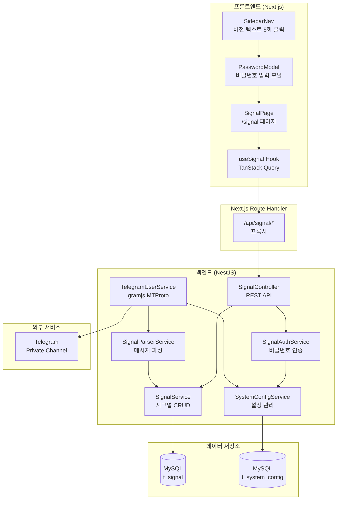
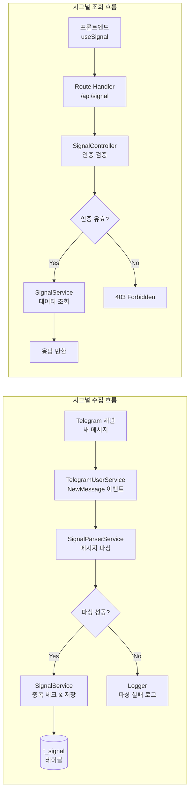
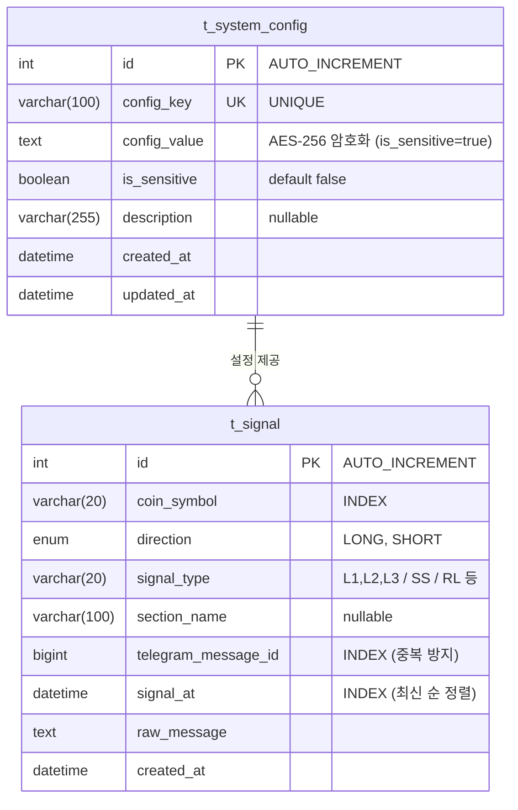
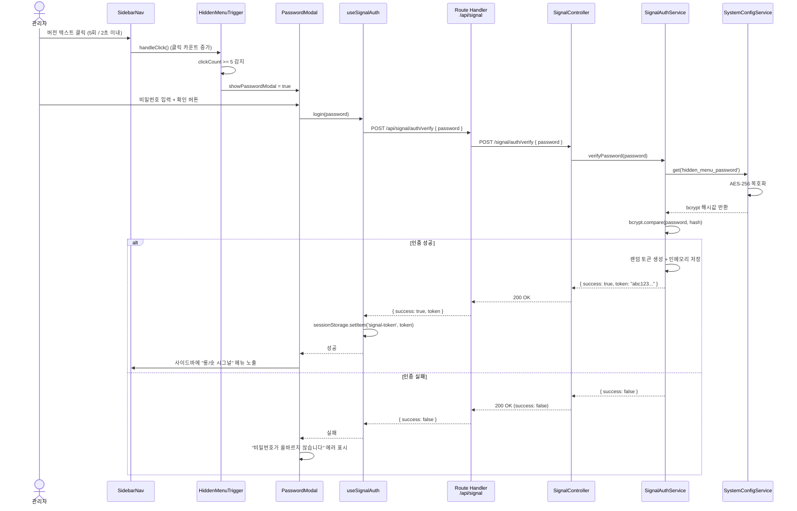
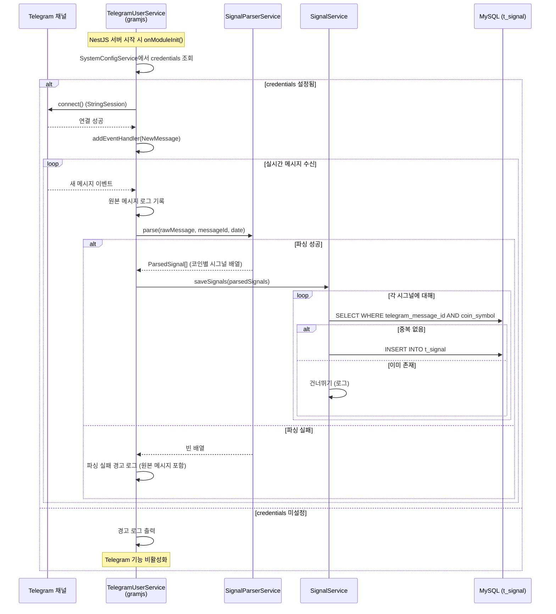
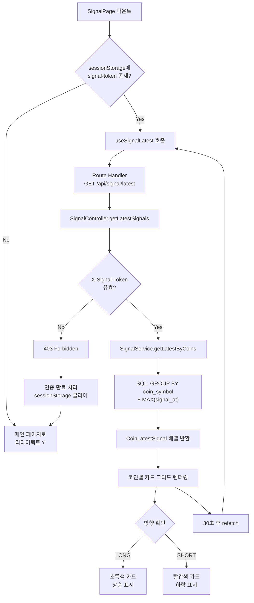
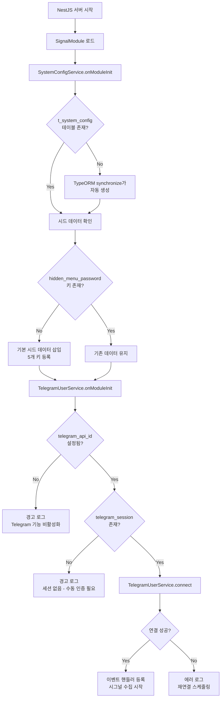

# 롱/숏 시그널 (Long/Short Signal) 설계 문서

## 개요

BitScope에 히든 메뉴 기반의 **롱/숏 시그널** 기능을 추가한다. Telegram Private 채널에서 MTProto (gramjs) 프로토콜을 통해 시그널 메시지를 실시간 수신하고, 파싱하여 DB에 저장한 뒤, 인증된 사용자에게만 시그널 리스트를 제공한다.

**핵심 설계 원칙:**
- **독립 모듈**: 기존 모듈을 수정하지 않고 `apps/api/src/modules/signal/`에 독립적으로 구현
- **보안 우선**: 비밀번호 bcrypt 해시, 민감 설정값 AES-256 암호화, Telegram 인증 정보 서버 내부에서만 사용
- **장애 격리**: Telegram 연결 실패가 전체 서비스에 영향을 주지 않도록 설계
- **기존 패턴 재사용**: NewsModule, TelegramService의 구조 패턴을 따름

---

## 아키텍처 설계

### 시스템 아키텍처 다이어그램



### 데이터 흐름 다이어그램



---

## 컴포넌트 설계

### 백엔드 컴포넌트

#### 1. SignalModule (`apps/api/src/modules/signal/signal.module.ts`)

- **책임**: Signal 기능의 NestJS 모듈 등록. 엔티티, 서비스, 컨트롤러를 통합.
- **인터페이스**: NestJS Module decorator
- **의존성**: TypeOrmModule, ScheduleModule, ConfigModule

```typescript
@Module({
  imports: [
    TypeOrmModule.forFeature([SignalEntity, SystemConfigEntity]),
    ScheduleModule.forRoot(),
  ],
  controllers: [SignalController],
  providers: [
    SignalService,
    SignalAuthService,
    SignalParserService,
    TelegramUserService,
    SystemConfigService,
  ],
  exports: [SignalService],
})
export class SignalModule {}
```

#### 2. SystemConfigService (`apps/api/src/modules/signal/services/system-config.service.ts`)

- **책임**: `t_system_config` 테이블 CRUD, 민감 값 AES-256 암호화/복호화, 시드 데이터 초기화
- **인터페이스**:
  - `onModuleInit()`: 시드 데이터 초기화 (키가 없으면 생성)
  - `get(key: string): Promise<string | null>` - 복호화된 원본 값 반환 (서버 내부용)
  - `getPublic(key: string): Promise<string | null>` - 마스킹된 값 반환 (API 응답용)
  - `set(key: string, value: string, isSensitive?: boolean): Promise<void>` - 값 저장 (민감 시 암호화)
- **의존성**: TypeORM Repository<SystemConfigEntity>, ConfigService (AES 키)

#### 3. SignalAuthService (`apps/api/src/modules/signal/services/signal-auth.service.ts`)

- **책임**: 히든 메뉴 비밀번호 검증, 단순 토큰 발급/검증
- **인터페이스**:
  - `verifyPassword(password: string): Promise<{ success: boolean; token?: string }>` - bcrypt 비교 후 랜덤 토큰 반환
  - `validateToken(token: string): boolean` - 인메모리 토큰 유효성 검사
- **의존성**: SystemConfigService, bcrypt
- **설계 결정**: JWT 대신 인메모리 랜덤 토큰 사용. 서버 재시작 시 세션 초기화됨 (히든 메뉴 특성상 적절).

```typescript
// 토큰 저장소 (인메모리)
private readonly tokens = new Map<string, { createdAt: number }>();
private readonly TOKEN_TTL_MS = 24 * 60 * 60 * 1000; // 24시간
```

#### 4. SignalService (`apps/api/src/modules/signal/services/signal.service.ts`)

- **책임**: 시그널 데이터 CRUD, 중복 체크, 페이지네이션, 코인별 최신 시그널 집계
- **인터페이스**:
  - `saveSignal(data: CreateSignalDto): Promise<SignalEntity | null>` - 중복 체크(telegram_message_id) 후 저장
  - `saveSignals(signals: CreateSignalDto[]): Promise<number>` - 하나의 메시지에서 파싱된 여러 시그널을 일괄 저장
  - `getSignalList(page: number, limit: number): Promise<{ items: SignalEntity[]; total: number }>` - 페이지네이션 시그널 목록
  - `getLatestByCoins(): Promise<CoinLatestSignal[]>` - 코인별 최신 시그널 (GROUP BY + MAX)
- **의존성**: TypeORM Repository<SignalEntity>

#### 5. SignalParserService (`apps/api/src/modules/signal/services/signal-parser.service.ts`)

- **책임**: Telegram 원본 메시지를 구조화된 시그널 데이터로 파싱
- **인터페이스**:
  - `parse(rawMessage: string, telegramMessageId: number, messageDate: Date): ParsedSignal[]` - 메시지 파싱하여 시그널 배열 반환
- **의존성**: 없음 (순수 함수 성격)
- **파싱 로직**:

```typescript
// 메시지 예시:
// ===Premium Pro Alert===
// Long [L1, L2, L3]
// BTC/USDT, ETH/USDT
//
// ===Smart Pro Alert===
// Short [S1]
// SOL/USDT

interface ParsedSignal {
  coinSymbol: string;       // "BTC/USDT"
  direction: 'LONG' | 'SHORT';
  signalType: string;       // "L1,L2,L3"
  sectionName: string | null; // "Premium Pro Alert"
  telegramMessageId: number;
  signalAt: Date;
  rawMessage: string;
}
```

**파싱 규칙:**
1. `===...===` 패턴으로 섹션 분리
2. `Long [...]` / `Short [...]` / `Double Long [...]` / `Double Short [...]` / `Ready Long [...]` 패턴으로 방향과 타입 추출
3. 코인 심볼 행에서 `,`로 분리하여 개별 코인 추출
4. 각 (섹션, 방향, 코인) 조합에 대해 하나의 ParsedSignal 생성

#### 6. TelegramUserService (`apps/api/src/modules/signal/services/telegram-user.service.ts`)

- **책임**: gramjs (MTProto) 클라이언트 관리, Telegram Private 채널 메시지 실시간 수신
- **인터페이스**:
  - `onModuleInit()`: 클라이언트 초기화 및 이벤트 핸들러 등록
  - `onModuleDestroy()`: 클라이언트 연결 해제
  - `connect(): Promise<void>` - Telegram 연결 (StringSession 사용)
  - `isConnected(): boolean` - 연결 상태 확인
- **의존성**: SystemConfigService, SignalParserService, SignalService
- **설계 결정**:
  - **세션 저장**: StringSession을 `t_system_config`에 `telegram_session` 키로 저장 (암호화). 파일 시스템 대신 DB를 사용하여 컨테이너 재시작에도 세션 유지.
  - **실시간 수신**: `client.addEventHandler(handler, new NewMessage({ chats: [channelId] }))` 사용
  - **재연결**: gramjs 내장 재연결 + 수동 지수 백오프 재연결 로직
  - **장애 격리**: try-catch로 감싸서 연결 실패 시 경고 로그만 출력, 전체 서비스에 영향 없음

```typescript
// gramjs 클라이언트 초기화
import { TelegramClient } from 'telegram';
import { StringSession } from 'telegram/sessions';
import { NewMessage } from 'telegram/events';

private client: TelegramClient | null = null;

async connect(): Promise<void> {
  const apiId = Number(await this.configService.get('telegram_api_id'));
  const apiHash = await this.configService.get('telegram_api_hash');
  const sessionStr = await this.configService.get('telegram_session') || '';
  
  const session = new StringSession(sessionStr);
  this.client = new TelegramClient(session, apiId, apiHash, {
    connectionRetries: 5,
  });
  
  await this.client.connect();
  
  // 세션 문자열 업데이트 (연결 후 세션이 변경될 수 있음)
  const newSession = this.client.session.save() as unknown as string;
  await this.configService.set('telegram_session', newSession, true);
}
```

#### 7. SignalController (`apps/api/src/modules/signal/signal.controller.ts`)

- **책임**: REST API 엔드포인트 제공, 인증 검증
- **인터페이스**:

| 메서드 | 경로 | 설명 | 인증 |
|--------|------|------|------|
| POST | `/signal/auth/verify` | 비밀번호 검증 | 불필요 (rate limit 적용) |
| GET | `/signal/list` | 시그널 목록 (페이지네이션) | 필요 (X-Signal-Token 헤더) |
| GET | `/signal/latest` | 코인별 최신 시그널 | 필요 (X-Signal-Token 헤더) |
| GET | `/signal/status` | Telegram 연결 상태 | 필요 (X-Signal-Token 헤더) |

- **의존성**: SignalAuthService, SignalService, TelegramUserService

```typescript
@Controller('signal')
export class SignalController {
  // 비밀번호 검증 (rate limit: 1분 5회)
  @Post('auth/verify')
  @Throttle({ default: { limit: 5, ttl: 60000 } })
  async verifyPassword(@Body() body: { password: string }) { ... }

  // 시그널 목록
  @Get('list')
  async getSignalList(
    @Headers('x-signal-token') token: string,
    @Query('page') page?: string,
    @Query('limit') limit?: string,
  ) { ... }

  // 코인별 최신 시그널
  @Get('latest')
  async getLatestSignals(
    @Headers('x-signal-token') token: string,
  ) { ... }

  // Telegram 연결 상태
  @Get('status')
  async getStatus(
    @Headers('x-signal-token') token: string,
  ) { ... }
}
```

### 프론트엔드 컴포넌트

#### 8. SidebarNav 수정 (버전 텍스트 클릭 핸들러)

- **책임**: 기존 SidebarNav의 버전 텍스트 영역에 5회 클릭 감지 로직 추가
- **수정 범위**: `apps/web/components/layout/sidebar-nav.tsx`의 하단 버전 텍스트 div
- **설계 결정**: 별도 컴포넌트(`HiddenMenuTrigger`)로 분리하여 기존 코드에 최소한의 영향

```typescript
// HiddenMenuTrigger 컴포넌트 (sidebar-nav.tsx 내부 또는 별도 파일)
function HiddenMenuTrigger({ versionText }: { versionText: string }) {
  const [clickCount, setClickCount] = useState(0);
  const [showPasswordModal, setShowPasswordModal] = useState(false);
  const timerRef = useRef<NodeJS.Timeout | null>(null);

  const handleClick = () => {
    const newCount = clickCount + 1;
    setClickCount(newCount);

    // 타이머 초기화
    if (timerRef.current) clearTimeout(timerRef.current);
    timerRef.current = setTimeout(() => setClickCount(0), 2000);

    if (newCount >= 5) {
      setClickCount(0);
      setShowPasswordModal(true);
    }
  };

  return (
    <>
      <span onClick={handleClick} className="text-[10px] text-sidebar-foreground/40 cursor-default select-none">
        {versionText}
      </span>
      {showPasswordModal && (
        <PasswordModal onClose={() => setShowPasswordModal(false)} />
      )}
    </>
  );
}
```

#### 9. PasswordModal (`apps/web/components/signal/password-modal.tsx`)

- **책임**: 비밀번호 입력 UI, 서버 검증 호출, 인증 상태 저장
- **인터페이스**: Props `{ onClose: () => void }`
- **의존성**: shadcn/ui (dialog 설치 필요 또는 자체 모달), useSignalAuth 훅
- **설계 결정**: `@radix-ui/react-dialog`가 미설치이므로, 간단한 오버레이 + div 모달로 구현. Phase 2에서 dialog 컴포넌트로 마이그레이션 가능.

#### 10. SignalPage (`apps/web/app/(dashboard)/signal/page.tsx`)

- **책임**: 시그널 리스트 페이지 렌더링 (코인별 최신 시그널 + 전체 시그널 히스토리)
- **인터페이스**: Next.js Page 컴포넌트
- **의존성**: useSignal 훅, useSignalAuth
- **UI 구성**:
  - 상단: 코인별 최신 시그널 카드 그리드 (LONG=초록, SHORT=빨강)
  - 하단: 전체 시그널 히스토리 리스트 (시간순, 페이지네이션)
  - 30초 간격 자동 폴링 (TanStack Query refetchInterval)
  - 빈 상태: "수신된 시그널이 없습니다"
  - 미인증 접근: 메인 페이지로 리다이렉트

#### 11. useSignal / useSignalAuth 훅 (`apps/web/hooks/useSignal.ts`)

- **책임**: Signal API 호출 래핑, 인증 상태 관리
- **인터페이스**:

```typescript
// 인증 관련
function useSignalAuth(): {
  isAuthenticated: boolean;
  token: string | null;
  login: (password: string) => Promise<{ success: boolean; error?: string }>;
  logout: () => void;
};

// 시그널 데이터 조회
function useSignalLatest(enabled: boolean): UseQueryResult<CoinLatestSignal[]>;
function useSignalList(page: number, enabled: boolean): UseQueryResult<SignalListResponse>;
```

- **설계 결정**: 인증 토큰은 `sessionStorage`에 저장. 브라우저 탭을 닫으면 자동 해제.

#### 12. Next.js Route Handler (`apps/web/app/api/signal/[...path]/route.ts`)

- **책임**: 프론트엔드 → NestJS 백엔드 프록시. 백엔드 URL 브라우저 노출 방지.
- **패턴**: 기존 exchange Route Handler 패턴과 유사하게 catch-all route 사용

```typescript
// /api/signal/auth/verify → NestJS /signal/auth/verify
// /api/signal/list → NestJS /signal/list
// /api/signal/latest → NestJS /signal/latest
```

---

## 데이터 모델

### 핵심 데이터 구조 정의

```typescript
// ===== 백엔드 엔티티 =====

/** 시스템 설정 엔티티 */
interface SystemConfigEntity {
  id: number;                    // PK, auto increment
  configKey: string;             // UNIQUE, VARCHAR(100)
  configValue: string;           // TEXT (민감 값은 AES-256 암호화)
  isSensitive: boolean;          // default false
  description: string | null;    // VARCHAR(255), nullable
  createdAt: Date;
  updatedAt: Date;
}

/** 시그널 엔티티 */
interface SignalEntity {
  id: number;                    // PK, auto increment
  coinSymbol: string;            // VARCHAR(20), e.g. "BTC/USDT"
  direction: 'LONG' | 'SHORT';  // ENUM
  signalType: string;            // VARCHAR(20), e.g. "L1,L2,L3", "SS", "RL"
  sectionName: string | null;    // VARCHAR(100), nullable, e.g. "Premium Pro Alert"
  telegramMessageId: bigint;     // BIGINT, 중복 방지 인덱스
  signalAt: Date;                // DATETIME, 메시지 수신 시각
  rawMessage: string;            // TEXT, 원본 메시지
  createdAt: Date;               // DATETIME, DB 저장 시각
}

// ===== 프론트엔드 타입 =====

/** 코인별 최신 시그널 */
interface CoinLatestSignal {
  coinSymbol: string;
  direction: 'LONG' | 'SHORT';
  signalType: string;
  sectionName: string | null;
  signalAt: string;              // ISO datetime string
}

/** 시그널 목록 응답 */
interface SignalListResponse {
  items: SignalItem[];
  total: number;
  page: number;
  limit: number;
}

/** 시그널 항목 */
interface SignalItem {
  id: number;
  coinSymbol: string;
  direction: 'LONG' | 'SHORT';
  signalType: string;
  sectionName: string | null;
  signalAt: string;
}

/** 비밀번호 검증 요청 */
interface VerifyPasswordRequest {
  password: string;
}

/** 비밀번호 검증 응답 */
interface VerifyPasswordResponse {
  success: boolean;
  token?: string;
  error?: string;
}
```

### 데이터 모델 다이어그램



### 인덱스 설계

| 테이블 | 인덱스명 | 컬럼 | 용도 |
|--------|----------|------|------|
| t_system_config | UQ_config_key | config_key | 설정 키 유니크 |
| t_signal | IDX_signal_telegram_msg | telegram_message_id | 중복 메시지 체크 |
| t_signal | IDX_signal_at | signal_at | 시간순 정렬 |
| t_signal | IDX_signal_coin_at | coin_symbol, signal_at | 코인별 최신 시그널 쿼리 |

### 시드 데이터 (`t_system_config` 초기값)

| config_key | config_value | is_sensitive | description |
|-----------|-------------|-------------|-------------|
| hidden_menu_password | (bcrypt hash) | true | 히든 메뉴 접근 비밀번호 (bcrypt 해시) |
| telegram_api_id | (비어있음) | true | Telegram API ID |
| telegram_api_hash | (비어있음) | true | Telegram API Hash |
| telegram_signal_channel_id | (비어있음) | false | 시그널 수신 채널 ID |
| telegram_session | (비어있음) | true | gramjs StringSession |

---

## 비즈니스 프로세스

### 프로세스 1: 히든 메뉴 접근 및 인증



### 프로세스 2: Telegram 시그널 수집 및 저장



### 프로세스 3: 시그널 리스트 조회 (프론트엔드)



### 프로세스 4: 서버 시작 시 초기화



---

## 에러 처리 전략

### 에러 분류 및 처리 방법

| 영역 | 에러 상황 | 처리 방법 | 사용자 영향 |
|------|----------|----------|-----------|
| **Telegram 연결** | API credentials 미설정 | 경고 로그, Telegram 기능 비활성화 | 없음 (다른 기능 정상 동작) |
| **Telegram 연결** | 네트워크 끊김 | 지수 백오프 재연결 (5s, 10s, 20s, 40s, 최대 5분) | 시그널 수집 일시 중단 |
| **Telegram 연결** | 세션 만료 | 에러 로그, 수동 재인증 필요 알림 | 시그널 수집 중단 |
| **메시지 파싱** | 예상 외 형식 | 파싱 실패 로그 (원본 메시지 포함), 건너뛰기 | 해당 메시지만 미처리 |
| **DB 저장** | 중복 telegram_message_id | 조용히 건너뛰기 | 없음 |
| **DB 저장** | DB 연결 실패 | NestJS 글로벌 에러 처리, 에러 로그 | API 응답 500 |
| **인증** | 잘못된 비밀번호 | 에러 메시지 반환, rate limit 적용 | 모달에 에러 표시 |
| **인증** | Rate limit 초과 | 429 Too Many Requests | 모달에 "잠시 후 다시 시도" 표시 |
| **인증** | 만료된 토큰 | 403 Forbidden | 메인 페이지로 리다이렉트 |
| **프론트엔드** | API 호출 실패 | TanStack Query retry (2회), 에러 UI | 에러 메시지 표시 |

### Telegram 재연결 전략

```typescript
private reconnectAttempts = 0;
private readonly MAX_RECONNECT_DELAY_MS = 5 * 60 * 1000; // 5분

private getReconnectDelay(): number {
  const delay = Math.min(
    5000 * Math.pow(2, this.reconnectAttempts),
    this.MAX_RECONNECT_DELAY_MS,
  );
  this.reconnectAttempts++;
  return delay;
}

private async scheduleReconnect(): Promise<void> {
  const delay = this.getReconnectDelay();
  this.logger.warn(`Telegram 재연결 예정: ${delay / 1000}초 후 (시도 #${this.reconnectAttempts})`);
  
  setTimeout(async () => {
    try {
      await this.connect();
      this.reconnectAttempts = 0; // 성공 시 초기화
      this.logger.log('Telegram 재연결 성공');
    } catch (error) {
      this.logger.error(`Telegram 재연결 실패: ${error}`);
      await this.scheduleReconnect(); // 다시 스케줄링
    }
  }, delay);
}
```

### 장애 격리 원칙

- TelegramUserService의 모든 외부 호출은 try-catch로 감싸서 전체 서비스 안정성에 영향을 주지 않음
- onModuleInit()에서 Telegram 연결 실패가 서버 시작을 차단하지 않음
- 파싱 실패는 개별 메시지 단위로만 영향, 다음 메시지는 정상 처리

---

## 테스팅 전략

### 단위 테스트

| 대상 | 테스트 파일 | 주요 테스트 케이스 |
|------|------------|------------------|
| **SignalParserService** | `signal-parser.service.spec.ts` | - Long [L1,L2,L3] 파싱, Short [S1] 파싱, Double Long [LL] 파싱, Double Short [SS] 파싱, Ready Long [RL] 파싱 |
| | | - 여러 섹션 + 여러 코인 메시지 파싱 |
| | | - 예상 외 형식 처리 (빈 배열 반환) |
| | | - 빈 메시지, null 처리 |
| **SignalAuthService** | `signal-auth.service.spec.ts` | - 올바른 비밀번호 검증 성공 |
| | | - 틀린 비밀번호 검증 실패 |
| | | - 토큰 생성 및 검증 |
| | | - 만료된 토큰 거부 |
| **SystemConfigService** | `system-config.service.spec.ts` | - AES-256 암호화/복호화 정합성 |
| | | - 민감 값 마스킹 |
| | | - 시드 데이터 초기화 |
| **SignalService** | `signal.service.spec.ts` | - 시그널 저장 (중복 체크) |
| | | - 코인별 최신 시그널 집계 |
| | | - 페이지네이션 |
| **HiddenMenuTrigger** | `hidden-menu-trigger.test.tsx` | - 5회 클릭 감지 |
| | | - 2초 타임아웃 초기화 |
| | | - 모달 열기/닫기 |

### 통합 테스트

| 대상 | 주요 검증 항목 |
|------|-------------|
| SignalController + AuthService | 인증 흐름 end-to-end (비밀번호 → 토큰 → API 접근) |
| SignalController + SignalService | 인증된 사용자의 시그널 조회 API |
| TelegramUserService → Parser → Service | 메시지 수신 → 파싱 → DB 저장 흐름 (모킹된 gramjs) |

### 수동 테스트 체크리스트

- [ ] 사이드바 버전 텍스트 5회 클릭 → 비밀번호 모달 표시
- [ ] 올바른 비밀번호 → 히든 메뉴 노출
- [ ] 틀린 비밀번호 → 에러 메시지 표시
- [ ] 시그널 리스트 페이지에서 LONG/SHORT 색상 구분
- [ ] 브라우저 탭 닫기 → 인증 상태 해제
- [ ] /signal URL 직접 접근 (미인증) → 메인 페이지 리다이렉트
- [ ] Telegram 미연결 상태에서 서버 정상 시작

---

## 파일 구조

```
apps/api/src/modules/signal/
  signal.module.ts
  signal.controller.ts
  entities/
    signal.entity.ts
    system-config.entity.ts
  services/
    signal.service.ts
    signal-auth.service.ts
    signal-parser.service.ts
    telegram-user.service.ts
    system-config.service.ts
  dto/
    create-signal.dto.ts
    verify-password.dto.ts

apps/web/
  app/(dashboard)/signal/
    page.tsx
  app/api/signal/
    [...path]/route.ts
  components/signal/
    password-modal.tsx
    signal-card.tsx
    signal-list.tsx
    hidden-menu-trigger.tsx
  hooks/
    useSignal.ts

packages/shared/src/types/
    signal.ts              (공유 타입 정의)
```

---

## 주요 설계 결정 및 근거

| 결정 | 근거 |
|------|------|
| **gramjs (telegram npm 패키지)** | Telegram Private 채널 접근에는 Bot API가 아닌 MTProto User API가 필요. gramjs는 Node.js에서 가장 널리 사용되는 MTProto 구현체. |
| **StringSession을 DB에 저장** | 파일 시스템 기반 세션은 Docker 컨테이너 재시작 시 유실됨. t_system_config에 암호화 저장하여 영속성 확보. |
| **인메모리 토큰 (JWT 미사용)** | 히든 메뉴는 소수의 관리자만 사용. JWT의 복잡성이 불필요. 서버 재시작 시 재인증이 오히려 보안에 유리. |
| **bcrypt로 비밀번호 해시** | t_system_config에 저장되는 비밀번호는 bcrypt 해시값. 단방향 해시이므로 DB 유출 시에도 원본 비밀번호 노출 불가. AES-256 암호화와 별개로 bcrypt 해시를 한 번 더 적용. |
| **t_signal에 telegram_message_id + coin_symbol 복합 유니크 대신 telegram_message_id 인덱스** | 하나의 메시지에서 여러 코인 시그널이 생성되므로, telegram_message_id만으로는 유니크가 아님. 대신 저장 시 SELECT 체크로 중복 방지. |
| **Rate limiting (비밀번호 검증)** | NestJS @nestjs/throttler 사용. 1분당 5회 제한으로 브루트포스 방지. |
| **Next.js Route Handler 프록시** | 기존 프로젝트 패턴을 따름. 브라우저에서 NestJS 백엔드 URL이 직접 노출되지 않도록 보호. |
| **자체 모달 (radix dialog 미사용)** | 현재 @radix-ui/react-dialog가 미설치. 히든 메뉴 모달 하나를 위해 의존성을 추가하기보다 간단한 오버레이 모달로 구현. |
| **30초 폴링 (WebSocket 미사용)** | Phase 1에서는 시그널 갱신 빈도가 낮고, 접속자가 소수. 폴링으로 충분하며 구현이 단순. Phase 2에서 WebSocket 업그레이드 가능. |
