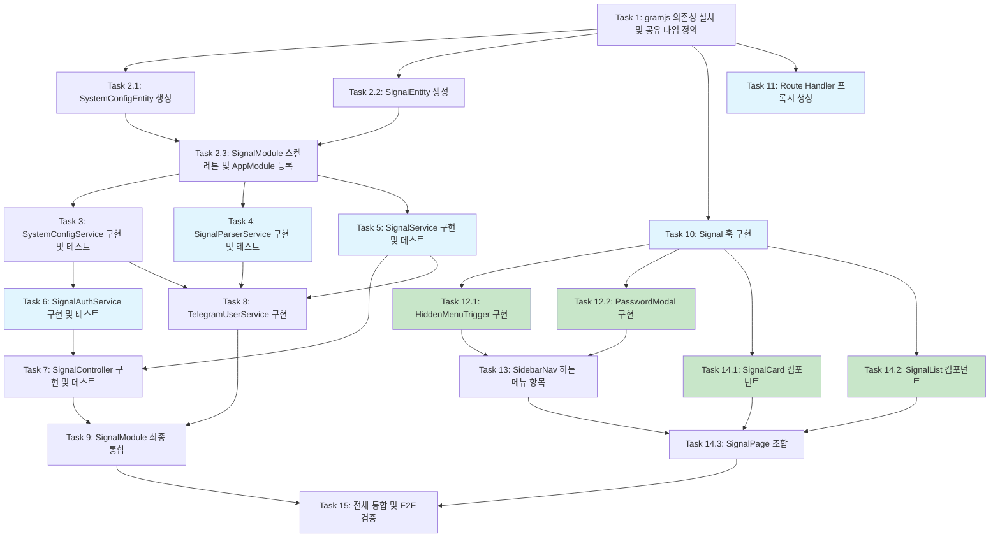

# 롱/숏 시그널 (Long/Short Signal) 구현 계획

## 참조 문서
- 요구사항: `.claude/specs/long-short-signal/requirements.md`
- 설계: `.claude/specs/long-short-signal/design.md`

---

- [ ] 1. 백엔드 기반 설정: gramjs 의존성 설치 및 공유 타입 정의
  - `apps/api/package.json`에 `telegram` (gramjs), `bcrypt`, `@nestjs/throttler` 의존성 추가 후 `pnpm install` 실행
  - `apps/api/package.json`의 devDependencies에 `@types/bcrypt` 추가
  - `packages/shared/src/types/signal.ts` 파일 생성: `CoinLatestSignal`, `SignalItem`, `SignalListResponse`, `VerifyPasswordRequest`, `VerifyPasswordResponse` 인터페이스 정의
  - `packages/shared/src/types/index.ts`에 signal 타입 re-export 추가
  - _요구사항: 4.1, 5.2_

- [ ] 2. 백엔드 엔티티 및 모듈 구조 생성
- [ ] 2.1 SystemConfigEntity 생성
  - `apps/api/src/modules/signal/entities/system-config.entity.ts` 파일 생성
  - TypeORM 엔티티 정의: `id` (PK, auto increment), `configKey` (VARCHAR(100), UNIQUE), `configValue` (TEXT), `isSensitive` (BOOLEAN, default false), `description` (VARCHAR(255), nullable), `createdAt`, `updatedAt`
  - 테이블명: `t_system_config`
  - `config_key`에 UNIQUE 인덱스 적용
  - 기존 `news-article.entity.ts` 패턴 참조
  - _요구사항: 3.1, 3.2, 3.6_

- [ ] 2.2 SignalEntity 생성
  - `apps/api/src/modules/signal/entities/signal.entity.ts` 파일 생성
  - TypeORM 엔티티 정의: `id` (PK, auto increment), `coinSymbol` (VARCHAR(20)), `direction` (ENUM: LONG/SHORT), `signalType` (VARCHAR(20)), `sectionName` (VARCHAR(100), nullable), `telegramMessageId` (BIGINT), `signalAt` (DATETIME), `rawMessage` (TEXT), `createdAt` (DATETIME)
  - 테이블명: `t_signal`
  - 인덱스: `IDX_signal_telegram_msg` (telegram_message_id), `IDX_signal_at` (signal_at), `IDX_signal_coin_at` (coin_symbol, signal_at)
  - _요구사항: 5.2_

- [ ] 2.3 SignalModule 스켈레톤 생성 및 AppModule 등록
  - `apps/api/src/modules/signal/signal.module.ts` 생성: `TypeOrmModule.forFeature([SignalEntity, SystemConfigEntity])` import, 빈 providers/controllers 배열
  - `apps/api/src/modules/signal/signal.controller.ts` 빈 컨트롤러 생성 (`@Controller('signal')`)
  - `apps/api/src/app.module.ts`에 `SignalModule` import 등록
  - 서버 빌드 성공 확인용 단위 테스트 작성
  - _요구사항: 3.1_

- [ ] 3. SystemConfigService 구현 및 테스트
  - `apps/api/src/modules/signal/services/system-config.service.ts` 생성
  - `onModuleInit()`에서 시드 데이터 초기화: `hidden_menu_password`, `telegram_api_id`, `telegram_api_hash`, `telegram_signal_channel_id`, `telegram_session` 키가 없으면 기본값으로 삽입
  - `get(key)`: DB에서 값 조회, `is_sensitive=true`이면 AES-256 복호화 후 반환
  - `getPublic(key)`: 민감 값은 `****`로 마스킹하여 반환
  - `set(key, value, isSensitive?)`: 민감 값이면 AES-256 암호화 후 저장
  - AES 암호화 키는 `ConfigService`에서 환경변수(`SYSTEM_CONFIG_ENCRYPTION_KEY`)로 주입
  - `apps/api/src/modules/signal/services/__tests__/system-config.service.spec.ts` 단위 테스트 작성: 암호화/복호화 정합성, 마스킹, 시드 초기화 검증
  - _요구사항: 3.3, 3.4, 3.5, 3.6, 8.1_

- [ ] 4. SignalParserService 구현 및 테스트
  - `apps/api/src/modules/signal/services/signal-parser.service.ts` 생성
  - `parse(rawMessage, telegramMessageId, messageDate): ParsedSignal[]` 구현
  - 파싱 규칙 구현:
    - `===...===` 패턴으로 섹션 분리
    - `Long [L1, L2, L3]` -> direction: LONG, signalType: "L1,L2,L3"
    - `Short [S1, S2, S3]` -> direction: SHORT, signalType: "S1,S2,S3"
    - `Double Long [LL]` -> direction: LONG, signalType: "LL"
    - `Double Short [SS]` -> direction: SHORT, signalType: "SS"
    - `Ready Long [RL]` -> direction: LONG, signalType: "RL"
    - `Long [L]` / `Short [S]` -> 각각 "L", "S"
    - 코인 심볼 행에서 `,`로 분리하여 개별 코인 추출 (예: "BTC/USDT, ETH/USDT")
  - 각 (섹션, 방향, 코인) 조합마다 개별 ParsedSignal 생성
  - 파싱 실패 시 빈 배열 반환
  - `apps/api/src/modules/signal/services/__tests__/signal-parser.service.spec.ts` 단위 테스트 작성:
    - 모든 시그널 타입별 파싱 테스트 (L1-L3, S1-S3, LL, SS, RL, L, S)
    - 다중 섹션 + 다중 코인 메시지 테스트
    - 예상 외 형식 처리 (빈 배열 반환) 테스트
    - 빈 메시지, null 입력 처리 테스트
  - _요구사항: 5.1, 5.3, 5.5, 5.6, 5.7, 5.8, 5.9, 5.10, 5.11_

- [ ] 5. SignalService 구현 및 테스트
  - `apps/api/src/modules/signal/services/signal.service.ts` 생성
  - `apps/api/src/modules/signal/dto/create-signal.dto.ts` 생성: class-validator 데코레이터 포함
  - `saveSignal(data)`: `telegram_message_id`와 `coin_symbol` 조합으로 중복 체크 후 저장
  - `saveSignals(signals)`: 하나의 메시지에서 파싱된 여러 시그널을 일괄 저장, 저장된 건수 반환
  - `getSignalList(page, limit)`: 페이지네이션 시그널 목록 (`signal_at DESC` 정렬, 기본 limit 50)
  - `getLatestByCoins()`: 코인별 최신 시그널 집계 (서브쿼리 또는 GROUP BY + MAX(signal_at))
  - `apps/api/src/modules/signal/services/__tests__/signal.service.spec.ts` 단위 테스트 작성: 중복 체크, 일괄 저장, 페이지네이션, 코인별 최신 시그널 집계 검증
  - _요구사항: 5.2, 5.3, 5.4, 6.1, 6.4, 6.5_

- [ ] 6. SignalAuthService 구현 및 테스트
  - `apps/api/src/modules/signal/services/signal-auth.service.ts` 생성
  - `apps/api/src/modules/signal/dto/verify-password.dto.ts` 생성: class-validator 데코레이터 포함
  - `verifyPassword(password)`: SystemConfigService에서 `hidden_menu_password` bcrypt 해시를 읽어 `bcrypt.compare()` 수행, 성공 시 `crypto.randomUUID()` 기반 토큰 생성하여 인메모리 Map에 저장
  - `validateToken(token)`: 인메모리 Map에서 토큰 존재 및 TTL(24시간) 검증
  - 토큰 저장소: `Map<string, { createdAt: number }>`, 만료된 토큰 주기적 정리 로직
  - `apps/api/src/modules/signal/services/__tests__/signal-auth.service.spec.ts` 단위 테스트 작성: 올바른/틀린 비밀번호 검증, 토큰 생성/검증/만료 테스트
  - _요구사항: 2.1, 2.2, 2.5, 8.3_

- [ ] 7. SignalController 구현 및 테스트
  - `apps/api/src/modules/signal/signal.controller.ts` 구현
  - `POST /signal/auth/verify`: 비밀번호 검증 엔드포인트, `@Throttle({ default: { limit: 5, ttl: 60000 } })` 적용
  - `GET /signal/list`: 인증된 사용자의 시그널 목록 조회 (X-Signal-Token 헤더 검증), page/limit 쿼리 파라미터
  - `GET /signal/latest`: 인증된 사용자의 코인별 최신 시그널 조회
  - `GET /signal/status`: Telegram 연결 상태 확인
  - 인증 검증 실패 시 403 Forbidden 반환 로직을 private 메서드 또는 Guard로 구현
  - SignalModule에 `@nestjs/throttler`의 `ThrottlerModule`, `ThrottlerGuard` 설정 추가
  - `apps/api/src/modules/signal/__tests__/signal.controller.spec.ts` 통합 테스트 작성: 인증 흐름 (비밀번호 -> 토큰 -> API 접근), 미인증 시 403, rate limit 동작 검증
  - _요구사항: 6.1, 6.2, 6.3, 6.4, 6.5, 8.3, 8.8_

- [ ] 8. TelegramUserService 구현
  - `apps/api/src/modules/signal/services/telegram-user.service.ts` 생성
  - `onModuleInit()`: SystemConfigService에서 `telegram_api_id`, `telegram_api_hash` 조회, 미설정 시 경고 로그 출력 후 건너뛰기
  - `connect()`: gramjs `TelegramClient` 생성 (StringSession), `t_system_config`의 `telegram_session` 값 사용, 연결 성공 시 세션 문자열 업데이트하여 DB에 재저장
  - `addEventHandler()`: `NewMessage` 이벤트로 `telegram_signal_channel_id` 채널의 메시지 수신, 수신된 메시지를 `SignalParserService.parse()` -> `SignalService.saveSignals()`로 연결
  - 장애 격리: 모든 외부 호출을 try-catch로 감싸서 Telegram 연결 실패가 서버 시작을 차단하지 않도록 처리
  - 지수 백오프 재연결 로직: 5s -> 10s -> 20s -> 40s -> ... -> 최대 5분
  - `onModuleDestroy()`: 클라이언트 연결 해제
  - `isConnected()`: 연결 상태 반환
  - 수신 메시지 원본 텍스트, 메시지 ID, 수신 시각을 Logger로 기록
  - _요구사항: 4.1, 4.2, 4.3, 4.4, 4.5, 4.6, 4.7, 4.8, 8.2, 8.6, 8.7_

- [ ] 9. SignalModule 최종 통합 및 .gitignore 업데이트
  - `apps/api/src/modules/signal/signal.module.ts`에 모든 서비스, 컨트롤러 등록 완료
  - `.gitignore`에 Telegram 세션 관련 파일 패턴 추가 (`*.session`, `telegram_session*`)
  - `apps/api/.env.example`에 `SYSTEM_CONFIG_ENCRYPTION_KEY` 환경변수 문서화
  - 백엔드 전체 빌드(`pnpm build`) 및 기존 테스트 통과 확인
  - _요구사항: 8.5, 8.7_

- [ ] 10. 프론트엔드: 공유 타입 및 Signal 훅 구현
  - `apps/web/hooks/useSignal.ts` 생성
  - `useSignalAuth()` 훅: `sessionStorage`에 `signal-token` 저장/조회/삭제, `login(password)` -> Route Handler POST `/api/signal/auth/verify` 호출, `logout()` -> sessionStorage 클리어
  - `useSignalLatest(enabled)` 훅: TanStack Query로 Route Handler GET `/api/signal/latest` 호출, `refetchInterval: 30000`, `staleTime: 15000`, `retry: 2`
  - `useSignalList(page, enabled)` 훅: TanStack Query로 Route Handler GET `/api/signal/list` 호출, 페이지네이션 지원
  - 기존 `useNews.ts`, `useBreakingNewsPolling.ts` 패턴 참조
  - _요구사항: 2.3, 2.4, 7.8_

- [ ] 11. 프론트엔드: Next.js Route Handler 프록시 생성
  - `apps/web/app/api/signal/[...path]/route.ts` 생성
  - catch-all Route Handler로 프론트엔드 요청을 NestJS 백엔드로 프록시
  - `/api/signal/auth/verify` -> NestJS `/signal/auth/verify` (POST)
  - `/api/signal/list` -> NestJS `/signal/list` (GET, X-Signal-Token 헤더 전달)
  - `/api/signal/latest` -> NestJS `/signal/latest` (GET, X-Signal-Token 헤더 전달)
  - `/api/signal/status` -> NestJS `/signal/status` (GET, X-Signal-Token 헤더 전달)
  - `getApiBaseUrl()`을 사용하여 백엔드 URL 결정 (서버 사이드에서만 실행)
  - _요구사항: 8.4_

- [ ] 12. 프론트엔드: HiddenMenuTrigger 및 PasswordModal 컴포넌트 구현
- [ ] 12.1 HiddenMenuTrigger 컴포넌트 구현
  - `apps/web/components/signal/hidden-menu-trigger.tsx` 생성
  - 버전 텍스트를 래핑하는 컴포넌트, 2초 이내 5회 클릭 감지 로직
  - 클릭 카운트 상태 관리 (`useState` + `useRef`로 타이머), 2초 초과 시 카운트 리셋
  - 5회 클릭 시 `showPasswordModal` 상태 true로 변경
  - 버전 텍스트와 동일한 외관 유지 (`cursor-default`, 시각적 힌트 없음)
  - `apps/web/components/layout/sidebar-nav.tsx`의 버전 텍스트 영역에 `HiddenMenuTrigger` 컴포넌트 적용
  - _요구사항: 1.1, 1.2, 1.3, 1.4, 1.5_

- [ ] 12.2 PasswordModal 컴포넌트 구현
  - `apps/web/components/signal/password-modal.tsx` 생성
  - 오버레이 + div 기반 모달 (radix dialog 미사용)
  - 비밀번호 입력 필드, 확인/취소 버튼
  - `useSignalAuth().login(password)` 호출하여 서버 검증
  - 성공 시 모달 닫기, 실패 시 "비밀번호가 올바르지 않습니다" 에러 메시지 표시
  - ESC 키 또는 모달 외부 클릭 시 모달 닫기 + 클릭 카운트 초기화
  - _요구사항: 1.3, 1.4, 2.1, 2.2_

- [ ] 13. 프론트엔드: SidebarNav에 히든 메뉴 항목 표시
  - `apps/web/components/layout/sidebar-nav.tsx` 수정
  - `useSignalAuth().isAuthenticated`가 true일 때만 "롱/숏 시그널" 메뉴 항목을 사이드바에 추가로 렌더링
  - 메뉴 항목은 기존 섹션과 구분되는 위치에 배치 (예: 별도 "히든" 섹션)
  - 링크 경로: `/signal`
  - `apps/web/lib/i18n/ko.ts`에 시그널 관련 텍스트 추가 (`signal.menuTitle`, `signal.pageTitle`, `signal.emptyState`, `signal.passwordError`, `signal.passwordPlaceholder` 등)
  - `apps/web/lib/i18n/en.ts`에 동일 키 영어 텍스트 추가
  - _요구사항: 2.6, 7.1_

- [ ] 14. 프론트엔드: SignalPage 구현
- [ ] 14.1 SignalCard 컴포넌트 구현
  - `apps/web/components/signal/signal-card.tsx` 생성
  - 코인별 최신 시그널을 카드 형태로 표시: 코인 심볼, 방향(LONG/SHORT), 시그널 타입, 시그널 도착 시간
  - LONG 방향: 초록색 계열 (`bg-green-*`, `text-green-*`, `border-green-*`)
  - SHORT 방향: 빨간색 계열 (`bg-red-*`, `text-red-*`, `border-red-*`)
  - 기존 `Card`, `CardContent`, `Badge` shadcn/ui 컴포넌트 활용
  - _요구사항: 7.3, 7.4, 7.5_

- [ ] 14.2 SignalList 컴포넌트 구현
  - `apps/web/components/signal/signal-list.tsx` 생성
  - 전체 시그널 히스토리를 시간순(최신 상단) 테이블/리스트로 표시
  - 각 항목: 코인 심볼, 방향, 시그널 타입, 섹션명, 시그널 시각
  - 페이지네이션 UI (이전/다음 버튼, 현재 페이지 표시)
  - `useSignalList` 훅 사용
  - _요구사항: 7.3, 7.6_

- [ ] 14.3 SignalPage 본문 조합
  - `apps/web/app/(dashboard)/signal/page.tsx` 생성
  - 상단: 코인별 최신 시그널 카드 그리드 (`useSignalLatest` 훅 사용)
  - 하단: 전체 시그널 히스토리 리스트 (`useSignalList` 훅 사용, 페이지네이션)
  - 미인증 접근 시 메인 페이지(`/`)로 리다이렉트 처리 (`useSignalAuth().isAuthenticated` 확인)
  - 빈 상태: "수신된 시그널이 없습니다" 메시지 표시
  - 30초 간격 자동 폴링 (`refetchInterval`)
  - 기존 `breaking-news/page.tsx` 페이지 구조 패턴 참조
  - _요구사항: 7.1, 7.2, 7.7, 7.8, 7.9_

- [ ] 15. 전체 통합 및 E2E 흐름 검증
  - SignalModule의 모든 providers가 올바르게 등록되어 있는지 확인
  - 프론트엔드 빌드 성공 확인 (`pnpm build`)
  - 백엔드 빌드 성공 확인 (`pnpm build`)
  - 인증 흐름 자동 테스트 작성: 비밀번호 검증 -> 토큰 발급 -> 토큰으로 시그널 API 호출 -> 데이터 반환
  - 미인증 시 403 반환 자동 테스트
  - Telegram 미연결 상태에서 서버 정상 시작 확인 테스트
  - 기존 모듈(News, Price 등) 정상 동작에 영향이 없는지 빌드 및 기존 테스트 실행으로 확인
  - _요구사항: 8.6, 8.7_

---

## 태스크 의존성 다이어그램

**범례:**
- 파란색 (`#e1f5fe`): 동일 선행 조건 완료 후 병렬 실행 가능한 태스크
- 녹색 (`#c8e6c9`): UI 컴포넌트 태스크 (병렬 실행 가능)
- 기본: 순차 실행 필요 태스크
