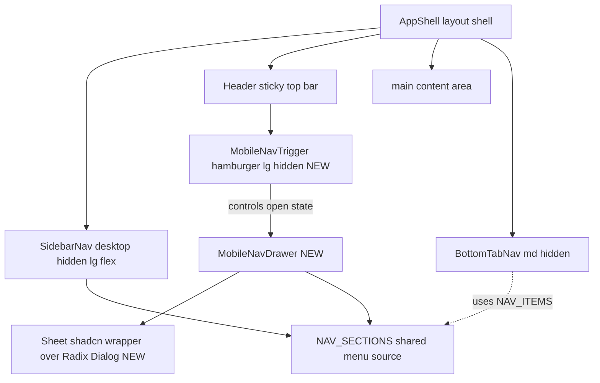
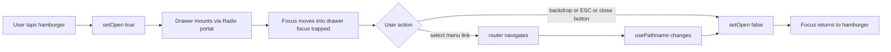

# 설계 문서 (Design Document)

## 개요 (Overview)

본 설계는 BitScope `apps/web`에 모바일 반응형 지원을 추가한다. 핵심은 두 축이다.

1. **모바일 전체 메뉴 진입점** — `lg`(1024px) 미만에서 헤더 좌측 햄버거 버튼으로 슬라이드 드로어를 열어, 데스크톱 `SidebarNav`와 동일한 섹션·항목·시그널 히든 메뉴 전체에 접근하게 한다. 드로어는 접근성(포커스 트랩, ESC, ARIA, 스크롤 락, 포커스 복귀)을 충족한다.
2. **공개 페이지 모바일 본문 가독성** — 360~768px 화면에서 우선순위 공개 페이지(market/premium/news/fear-greed) 및 기타 공개 페이지가 페이지 레벨 가로 스크롤이나 잘림 없이 읽히도록, 페이지 전면 재작성 대신 공통 보정 패턴/체크리스트를 적용한다.

**최우선 제약(R6)**: `lg` 이상 데스크톱 렌더 결과는 픽셀 단위로 불변이다. 모든 신규 요소는 `lg:hidden`으로 가두거나, `lg` 이상 산출물이 변하지 않는 방식(브레이크포인트 한정 클래스 추가)으로만 구현한다.

### 설계 의사결정 요약 및 근거

| 결정 | 선택 | 근거 |
|---|---|---|
| 드로어 기반 구현 | Radix Dialog 신규 도입(`@radix-ui/react-dialog`) + shadcn 스타일 `Sheet` 래퍼 | 포커스 트랩/ESC/`aria-modal`/포커스 복귀/스크롤 락/배경 `inert`를 검증된 라이브러리가 기본 제공. 직접 구현 대비 R3·R4 충족 비용·버그 리스크가 현저히 낮음. 프로젝트는 이미 `@radix-ui/react-dropdown-menu`/`react-slot`을 사용 중이라 Radix 패턴·번들이 일관됨 |
| 열림 상태 관리 | 로컬 React state(`useState`) + `usePathname` 감지로 자동 닫힘 | 드로어 열림은 단일 헤더-드로어 트리 내부의 순수 UI 상태. 전역 공유 불필요 → Zustand 도입은 과설계(R7 단순성). 라우트 변경 닫힘만 `usePathname` effect로 처리 |
| 메뉴 정의 소스 | `sidebar-nav.tsx`에서 `NAV_SECTIONS` export(단일 소스 유지) | R7.1 충족. 별도 모듈 추출도 검토했으나 사이드바 렌더 결과 불변 보장이 더 단순한 export 추가를 우선 |
| 본문 가독성 | 페이지별 전면 재작성 ✗ → 공통 보정 패턴/체크리스트 + 브레이크포인트 한정 보강 | R5/R6.3 동시 충족. 기존 일부 페이지는 이미 `overflow-x-auto`/`grid-cols-1 sm:grid-cols-*` 사용 중이라 보강 위주 |

---

## 아키텍처 (Architecture)

### 시스템 아키텍처 다이어그램

신규/변경 컴포넌트와 기존 컴포넌트의 관계. 신규 요소는 별도 표기.



요점:
- 햄버거 트리거와 드로어는 모두 `Header` 내부에 위치하고 `lg:hidden`으로 가둔다. 드로어 자체는 Radix portal로 `body` 끝에 렌더되지만, 트리거가 `lg` 이상에서 숨겨지고 기본 닫힘 상태이므로 데스크톱에는 어떤 DOM도 노출되지 않는다(R6.2).
- `SidebarNav`와 `MobileNavDrawer`는 동일한 `NAV_SECTIONS`를 import한다(R7.1).

### 데이터 흐름 다이어그램 (드로어 상호작용)



---

## 컴포넌트 및 인터페이스 (Components and Interfaces)

### 신규 컴포넌트

#### 1. `ui/sheet.tsx` (shadcn 스타일 래퍼, Radix Dialog 기반)

- **책임**: Radix Dialog primitive를 프로젝트 디자인 토큰(Tailwind, 다크/라이트 테마 변수)에 맞춰 감싼 재사용 가능한 슬라이드 패널. shadcn `sheet`의 표준 구조를 따른다.
- **선행 작업**: `@radix-ui/react-dialog`를 `apps/web`에 추가(현재 미설치, dropdown-menu/slot만 존재).
- **export 인터페이스** (Radix re-export):
  - `Sheet` = `Dialog.Root`
  - `SheetTrigger` = `Dialog.Trigger` (asChild 지원)
  - `SheetClose` = `Dialog.Close`
  - `SheetPortal`, `SheetOverlay`(백드롭), `SheetContent`(슬라이드 패널), `SheetTitle`, `SheetDescription`
- **`SheetContent` props**: `side?: 'left' | 'right' | 'top' | 'bottom'`(기본 본 기능은 `left`), `className`, `children`.
- **기본 제공(Radix Dialog)**: 포커스 트랩, ESC 닫기, 백드롭 클릭 닫기, `role="dialog"` + `aria-modal="true"`, 트리거로 포커스 복귀, 배경 `inert`/`aria-hidden`, 스크롤 락(`@radix-ui/react-dialog`는 `RemoveScroll` 내장). → R3, R4 대부분을 라이브러리가 충족.

#### 2. `layout/mobile-nav-drawer.tsx`

- **책임**: 햄버거 트리거 + 슬라이드 드로어 본문을 묶은 모바일 전용 네비게이션 컴포넌트.
- **인터페이스**:
  ```ts
  interface MobileNavDrawerProps {
    className?: string; // 트리거 래퍼 클래스 (기본 lg:hidden 포함)
  }
  export function MobileNavDrawer(props: MobileNavDrawerProps): JSX.Element
  ```
- **내부 상태/동작**:
  - `const [open, setOpen] = useState(false)`
  - `const pathname = usePathname()` — `useEffect(() => setOpen(false), [pathname])`로 라우트 변경 시 자동 닫힘(R2.5, R2.6: 동일 경로 재선택도 effect 무관하게 link 클릭 핸들러에서 `setOpen(false)` 호출하여 닫힘 보장).
  - 트리거 버튼: `lg:hidden`, `aria-label="메뉴 열기"`(i18n), `aria-expanded={open}`, 최소 44x44px(`h-11 w-11` 또는 `min-h-11 min-w-11`)(R1.4, R1.5). lucide `Menu` 아이콘.
  - 드로어 본문: `SidebarNav`와 동일 `NAV_SECTIONS`를 순회 렌더. 활성 판별은 공유 `isActiveRoute`로 동일하게 처리하고 `aria-current="page"` 부여(R2.4). 시그널 히든 메뉴는 `useSignalAuth()`로 동일 조건부 렌더(R2.3).
  - 메뉴 영역은 `overflow-y-auto`로 세로 스크롤(R2.7).
  - 닫기(X) 버튼: `SheetClose`로 명시 제공(R3.4).
- **렌더 구조(개념)**:
  ```tsx
  <div className={cn('lg:hidden', className)}>
    <Sheet open={open} onOpenChange={setOpen}>
      <SheetTrigger asChild>
        <button aria-label={...} aria-expanded={open} className="... min-h-11 min-w-11">
          <Menu aria-hidden />
        </button>
      </SheetTrigger>
      <SheetContent side="left" aria-label="주 메뉴">
        <SheetTitle className="sr-only">주 메뉴</SheetTitle>
        {/* 로고 + 닫기버튼(SheetClose) */}
        <nav className="overflow-y-auto">
          {NAV_SECTIONS.map(... 동일 렌더 ...)}
          {isSignalAuth && <시그널 히든 메뉴 />}
        </nav>
      </SheetContent>
    </Sheet>
  </div>
  ```

### 변경 컴포넌트

#### `layout/header.tsx`
- 좌측 영역에 `<MobileNavDrawer />`를 추가한다. 기존 모바일 로고(`lg:hidden`)와 같은 좌측 그룹에 배치(햄버거 → 로고 순). 우측 액션 영역(LanguageSwitcher/ThemeToggle/WalletButton)은 그대로 유지(R1.6).
- `lg:hidden` 좌측 그룹과 `hidden lg:block` 더미 여백은 기존 구조 유지 → `lg` 이상 렌더 결과 불변(R6.1).

#### `layout/sidebar-nav.tsx`
- 단 한 줄 변경: `const NAV_SECTIONS` → `export const NAV_SECTIONS`. 렌더 로직·마크업·클래스는 일절 변경하지 않는다(R6.4, R7.1).
- `isActiveRoute`, `NavItem`, `NavSection` 타입도 드로어에서 재사용하도록 export 정리(이미 `NAV_ITEMS`, `isActiveRoute`는 export됨). `NavSection` 타입을 export로 승격.

#### `layout/app-shell.tsx`
- **변경 없음**. 드로어는 `Header` 내부에 캡슐화되므로 셸 조합은 그대로 유지(불필요한 변경 표면 최소화).

---

## 상태 관리 (State Management)

- **드로어 열림 상태**: `MobileNavDrawer` 내부 로컬 `useState`. 단일 컴포넌트 트리 내에서만 소비되므로 전역 스토어 불필요.
  - **Zustand 미사용 근거**: 프로젝트가 Zustand를 쓰지만 그것은 도메인/세션 상태용. 드로어 토글은 휘발성 UI 상태이고 다른 컴포넌트가 구독할 필요가 없어 로컬 state가 최소·최적(R7.1 일관성, R7.2 비용 최소화).
- **자동 닫힘**: `usePathname()` 변화 감지 `useEffect`. 링크 클릭 시 즉시 `setOpen(false)`도 호출해 라우트 미변경(동일 경로) 케이스까지 닫힘 보장(R2.5, R2.6).
- **마운트 전략**: Radix Dialog는 닫힘 상태에서 오버레이/패널을 마운트하지 않음(또는 비표시) → R7.3 충족, R7.2(닫힘 시 스크롤락·포커스트랩 미발생) 충족.

---

## 메뉴 소스 공유 전략 (Shared Menu Source)

- 단일 소스: `sidebar-nav.tsx`의 `NAV_SECTIONS`를 export하여 `SidebarNav`, `MobileNavDrawer`, (간접적으로) `BottomTabNav`가 동일 정의를 참조.
- 공유 헬퍼: `isActiveRoute(pathname, href)`와 타입(`NavItem`, `NavSection`)을 동일하게 사용 → 활성 표시·정렬·아이콘·라벨(i18n `t.nav`)이 자동 일치(R2.2, R7.1).
- 시그널 히든 메뉴: 드로어에서도 `useSignalAuth()`를 호출해 사이드바와 **동일 조건**으로 `/signal` 항목을 렌더. (메뉴 항목이 `NAV_SECTIONS` 외부 특수 케이스이므로, 사이드바·드로어 양쪽이 동일 렌더 로직을 갖도록 작은 공유 헬퍼/상수로 추출 검토 — 단 사이드바 렌더 결과 불변 제약 내에서.)
- **불변 보장**: `NAV_SECTIONS`는 export만 추가하고 내용·순서를 바꾸지 않으므로 데스크톱 사이드바 출력은 동일.

---

## 접근성 구현 (Accessibility — WCAG 2.1 AA)

Radix Dialog를 기반으로 직접 구현 부담을 최소화하면서 R4 전 항목을 충족한다.

| 요구사항 | 구현 |
|---|---|
| R3.2 백드롭 클릭 닫기 | Radix `Overlay` 클릭 시 기본 닫힘 |
| R3.3 ESC 닫기 | Radix Dialog 기본 |
| R3.4 닫기 버튼 | `SheetClose`로 명시 X 버튼 제공 |
| R3.5 포커스 복귀 | Radix가 닫힘 시 트리거(햄버거)로 포커스 자동 복귀 |
| R3.6 본문 스크롤 락 | Radix Dialog 내장 `RemoveScroll` |
| R4.1 role=dialog + aria-modal | `SheetContent`가 기본 부여 |
| R4.2 접근 가능한 이름 | `SheetTitle`(sr-only "주 메뉴") 또는 `aria-label`. `SheetDescription` 미사용 시 경고 억제 위해 `aria-describedby={undefined}` 처리 |
| R4.3 포커스 진입 | Radix가 열림 시 첫 포커서블 또는 지정 요소로 포커스 이동 |
| R4.4 포커스 트랩 | Radix `FocusScope` trapped 기본 |
| R4.5 키보드 도달·포커스 링 | 모든 링크/버튼에 `focus-visible:ring-*` 클래스 적용(사이드바와 동일 토큰) |
| R4.6 색상 대비 4.5:1 / 3:1 | 기존 사이드바 토큰(`sidebar-foreground`, `sidebar-primary`, `sidebar-ring`) 재사용 — 기존 디자인이 충족하는 토큰을 그대로 사용 |
| R4.7 배경 inert | Radix가 배경에 `aria-hidden`/inert 처리 |
| R1.4 aria-label/aria-expanded | 햄버거 버튼에 직접 부여 |
| R1.5 44x44 터치 타깃 | `min-h-11 min-w-11`(44px) |

추가: `prefers-reduced-motion` 존중 — 전환 애니메이션은 약 300ms 이내(R7.4)로 두되, reduced-motion 시 애니메이션 축소.

---

## 공개 페이지 모바일 보정 패턴 및 체크리스트 (R5)

페이지 전면 재작성이 아닌 **공통 패턴 적용 + 브레이크포인트 한정 보강**. 모든 보정은 `lg` 미만 또는 모바일-우선 클래스로만 적용되어 `lg` 이상 산출물을 바꾸지 않는다(R6.3).

### 공통 보정 패턴

1. **넓은 테이블 가로 스크롤 래핑(R5.2)**
   - 테이블을 `<div className="overflow-x-auto">`로 감싼다(이미 market/premium은 적용됨 — 미적용 테이블만 보강).
   - 내부 `<table>`에 필요 시 `min-w-[600px]` 류 최소폭을 부여해 컬럼 압착으로 인한 깨짐 방지. 셀에 `whitespace-nowrap` 선택 적용.
   - 래핑 컨테이너가 **부모 너비를 넘지 않도록** 부모에 `min-w-0`/`max-w-full` 보장(자식 스크롤이 페이지 스크롤로 새지 않게).
2. **다중 컬럼 그리드 축소(R5.3)**
   - `grid-cols-1 sm:grid-cols-2 lg:grid-cols-N` 패턴으로 모바일 1열, 태블릿 2열. 기존 `grid-cols-2 md:grid-cols-5` 등은 360px에서 칸이 너무 좁지 않은지 점검 후 필요 시 `grid-cols-1`/`grid-cols-2`로 하한 조정.
3. **고정폭/오버플로우 보정(R5.4)**
   - 고정 `w-[Npx]`는 `w-full max-w-[Npx]` 또는 `min-w-0`로 컨테이너 내 수렴. 긴 텍스트/주소는 `truncate`/`break-words`. flex row는 `flex-wrap` 또는 `min-w-0` 적용.
4. **페이지 레벨 가로 스크롤 차단(R5.1)**
   - 루트 레이아웃/`main`에 의도치 않은 overflow가 새지 않도록, 보정 대상 컨테이너 단위로 `overflow-x` 격리. (전역 `overflow-x: hidden`는 스크롤락·sticky와 충돌 가능하므로 컨테이너 단위 우선.)

### 우선순위 페이지 체크리스트

| 페이지 | 현재 상태(확인됨) | 보정 작업 |
|---|---|---|
| `/market` | `overflow-x-auto` 테이블, `grid-cols-1 md:grid-cols-2`, `grid-cols-2 sm:grid-cols-3 md:grid-cols-5` 존재 | 360px에서 5열 카드/호가 그리드 압착 점검, 테이블 `min-w` 보강, 좌측 `min-w-0` 확인 |
| `/premium` | `overflow-x-auto` 테이블, `grid-cols-1 sm:grid-cols-3`, `grid-cols-2 sm:grid-cols-4` 존재 | 테이블 컬럼 360px 가독성 점검, `min-w` 보강, 요약 카드 모바일 1~2열 확인 |
| `/news` | 반응형 클래스 미검출(점검 필요) | 카드/리스트 레이아웃 모바일 1열, 이미지/제목 오버플로우 보정, flex-wrap 적용 |
| `/fear-greed` | `grid-cols-1 md:grid-cols-3`, `grid-cols-2 md:grid-cols-5` 존재 | 360px에서 5열 지표 그리드 압착 점검 후 `grid-cols-2`로 하한 보정, 게이지 차트 컨테이너 `max-w-full` |

### 기타 공개 페이지(R5.6, best-effort 합격선 = 페이지 가로 스크롤 없이 읽힘)
calendar, whale, breaking-news, influencer, telegram-feed, charts, futures, futures-dashboard, futures-trading, market-screener, stock-perp-comparison(life), market-screener — 동일 체크리스트 적용. 우선순위 4페이지 완료 후 일괄 점검.

### 검증 기준
- 360px / 414px / 768px 폭에서 페이지 레벨 가로 스크롤 없음(R5.1, R5.5).
- 넓은 테이블은 컨테이너 내부 스크롤만 발생.

---

## PC 무변경 보장 전략 (R6)

- **트리거 격리**: 햄버거는 `MobileNavDrawer` 래퍼의 `lg:hidden`으로만 노출. `lg` 이상에서 트리거가 렌더되지 않으면 드로어는 열릴 수 없고, 기본 닫힘이라 portal DOM도 없음(R6.2).
- **헤더 마크업 보존**: 헤더는 좌측 `lg:hidden` 그룹에 컴포넌트 1개를 추가할 뿐, `lg` 이상에서 보이는 `hidden lg:block` 여백 구조는 불변(R6.1).
- **사이드바 불변**: `sidebar-nav.tsx`는 `export` 키워드 추가 외 코드 변경 없음 → 데스크톱 사이드바 출력 동일(R6.4).
- **본문 보정 격리**: 모든 가독성 보정은 모바일-우선 또는 `lg` 미만 클래스. 기존 `lg:` 접두 클래스는 유지, 신규로 추가하는 비-접두 클래스가 `lg`에서 의도치 않게 적용되지 않도록 필요 시 `lg:` 오버라이드를 명시(R6.3).
- **회귀 방지**: 데스크톱 스냅샷/시각 회귀 점검(가능 시) 및 기존 레이아웃 테스트 유지.

---

## 테스트 전략 (Testing Strategy)

기존 테스트는 `apps/web/components/layout/__tests__/`에 vitest + @testing-library/react 기반으로 존재.

> 주의: 현재 `sidebar-nav.test.tsx`는 더 이상 존재하지 않는 API(`navigationItems`, `item.ariaLabel`, role `complementary` 이름 "메인 네비게이션")를 참조하는 **스테일 테스트**다. 본 기능에서 `NAV_SECTIONS` export 변경 시 이 테스트를 현재 구현(`NAV_ITEMS`, `NAV_SECTIONS`, 실제 `aria-label`)에 맞춰 정리한다.

### 신규 테스트: `mobile-nav-drawer.test.tsx`
- 햄버거 버튼이 `aria-label`과 초기 `aria-expanded="false"`를 가진다.
- 햄버거 클릭 시 드로어가 열리고 `aria-expanded="true"`, `role="dialog"`/`aria-modal` 노출, 접근 가능한 이름("주 메뉴") 존재(R1.3, R4.1, R4.2).
- 드로어에 `NAV_SECTIONS` 전 항목 링크가 렌더되고 순서/라벨이 사이드바와 일치(R2.2).
- 현재 경로 항목에 `aria-current="page"`(R2.4).
- 시그널 인증 모킹 시 `/signal` 항목 노출, 비인증 시 미노출(R2.3).
- 메뉴 링크 클릭 시 `onOpenChange(false)` 호출(닫힘)(R2.5).
- `usePathname` 변경 시 드로어 자동 닫힘(R2.6: 동일 경로 재선택 닫힘).
- 닫기 버튼/ESC/백드롭으로 닫힘(R3.2~R3.4). (Radix 동작은 통합 수준에서 검증; jsdom 한계로 포커스 트랩/스크롤락은 단언 범위 조정.)

### 회귀 테스트
- `header.test`(신규/보강): 햄버거 추가 후에도 우측 액션 3종(LanguageSwitcher/ThemeToggle/WalletButton) 렌더 유지(R1.6).
- `sidebar-nav.test.tsx` 갱신: `NAV_SECTIONS`/`NAV_ITEMS` export 검증, 활성 라우트, ARIA — 데스크톱 출력 불변 확인(R6.4).
- `app-shell.test.tsx`: 변경 없음 확인.

### 수동/시각 검증
- 360 / 414 / 768 / 1024 / 1280px 폭에서: (a) `<1024px` 햄버거·드로어 동작, (b) `≥1024px` 햄버거 미노출·사이드바 정상·portal DOM 없음(R6.2), (c) 우선순위 페이지 가로 스크롤 없음(R5).
- 키보드 전용 탐색: Tab 트랩, ESC 닫힘, 포커스 복귀(R4.3~R4.5).

---

## 요구사항 매핑 (Requirements Traceability)

| 요구사항 | 설계 반영 위치 |
|---|---|
| R1 햄버거 진입점 | `header.tsx` 변경 + `MobileNavDrawer` 트리거(`lg:hidden`, aria, 44px) |
| R2 드로어 전체 메뉴/탐색 | `MobileNavDrawer` 본문, `NAV_SECTIONS` 공유, `useSignalAuth`, `aria-current`, 자동 닫힘, `overflow-y-auto` |
| R3 닫기 동작 | Radix Dialog(백드롭/ESC) + `SheetClose` + 포커스 복귀 + 스크롤 락 |
| R4 접근성 | Radix Dialog 기본 ARIA/포커스트랩/inert + focus-visible 링 + 기존 대비 토큰 |
| R5 공개 페이지 가독성 | 공개 페이지 보정 패턴/체크리스트(테이블 래핑·그리드 축소·오버플로우 보정) |
| R6 PC 무변경 | 트리거 격리·헤더 마크업 보존·사이드바 export-only·보정 클래스 브레이크포인트 한정 |
| R7 성능·일관성 | 단일 메뉴 소스, 로컬 state, 닫힘 시 미마운트, ≤300ms 전환 |

---

## 도입 의존성 및 위험 (Notes)

- **신규 의존성**: `@radix-ui/react-dialog`(`apps/web`). 기존 Radix 패키지와 버전군 일치 확인 필요.
- **위험/완화**: jsdom 환경에서 Radix의 포커스 트랩·스크롤 락은 완전 재현이 어려움 → 단위 테스트는 ARIA/콜백 중심, 트랩·락은 수동/E2E로 보완. `viewport`의 `maximumScale: 1`은 변경하지 않음(접근성 확대 제약은 별도 이슈로 분리, 본 기능 비범위).
```

이상으로 design.md 초안을 작성했습니다.
