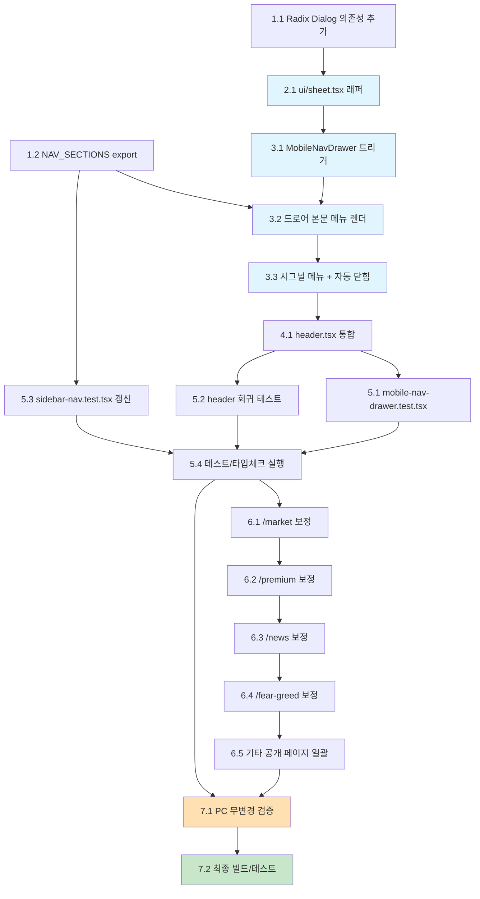

# 구현 계획 (Implementation Plan)

본 계획은 승인된 요구사항(R1~R7)과 설계 문서를 코드 구현 태스크로 분해한 것이다. 각 태스크는 코딩 에이전트가 단독으로 실행 가능한 구체적 작업이며, 점진적/증분 순서로 배치되었다. 모든 작업의 최우선 제약은 **R6(기존 PC `lg` 이상 무변경)** 이다.

> 실행 단위: main thread가 한 태스크씩 순차 실행한다. 각 태스크는 작은 입도로 분해되어 있으며, 선행 태스크 위에 증분적으로 쌓인다.

---

## 1. 의존성 도입 및 공유 메뉴 소스 준비

- [x] 1.1 `@radix-ui/react-dialog` 의존성 추가
  - `apps/web/package.json`에 `@radix-ui/react-dialog`를 추가하고 `pnpm install` 실행
  - 기존 Radix 패키지(`@radix-ui/react-dropdown-menu` ^2.1.16, `@radix-ui/react-slot` ^1.2.4)와 버전군이 호환되는 버전을 선택
  - 설치 후 `pnpm --filter web typecheck`로 의존성 해석 정상 여부 확인
  - _Requirements: R7.1, R7.2_

- [x] 1.2 `sidebar-nav.tsx`에서 공유 메뉴 소스 export
  - `apps/web/components/layout/sidebar-nav.tsx`에서 `const NAV_SECTIONS` → `export const NAV_SECTIONS`로 변경
  - `interface NavSection` → `export interface NavSection`로 승격 (`NavItem`, `NAV_ITEMS`, `isActiveRoute`는 이미 export됨)
  - 렌더 로직/마크업/클래스/항목 순서는 **일절 변경하지 않음** (export 키워드 추가만 허용)
  - `pnpm --filter web typecheck`로 export 변경이 타입 오류를 유발하지 않는지 확인
  - _Requirements: R6.4, R7.1_

---

## 2. Sheet 래퍼 컴포넌트 (Radix Dialog 기반)

- [x] 2.1 `ui/sheet.tsx` shadcn 스타일 래퍼 작성
  - 신규 파일 `apps/web/components/ui/sheet.tsx` 생성
  - `@radix-ui/react-dialog`를 re-export: `Sheet`(=`Dialog.Root`), `SheetTrigger`(=`Dialog.Trigger`, asChild 지원), `SheetClose`(=`Dialog.Close`), `SheetPortal`, `SheetOverlay`(백드롭), `SheetContent`(슬라이드 패널), `SheetTitle`, `SheetDescription`
  - `SheetContent`에 `side?: 'left' | 'right' | 'top' | 'bottom'` prop(기본 본 기능은 `left`), `className`, `children` 지원
  - 디자인 토큰(Tailwind 다크/라이트 테마 변수) 적용. 슬라이드 전환 애니메이션은 약 300ms 이내, `prefers-reduced-motion` 존중(R7.4)
  - `SheetContent`는 기본적으로 `role="dialog"` + `aria-modal="true"`를 보유(Radix 기본). 포커스 트랩/ESC/백드롭 클릭 닫힘/스크롤 락/포커스 복귀/배경 inert는 Radix Dialog 기본 동작에 위임
  - `lib/utils.ts`의 `cn` 헬퍼 사용
  - _Requirements: R3.1, R3.2, R3.3, R3.6, R4.1, R4.7, R7.4_

---

## 3. MobileNavDrawer 컴포넌트

- [x] 3.1 `layout/mobile-nav-drawer.tsx` 기본 구조 및 햄버거 트리거 작성
  - 신규 파일 `apps/web/components/layout/mobile-nav-drawer.tsx` 생성 (`'use client'`)
  - `interface MobileNavDrawerProps { className?: string }` 정의, `export function MobileNavDrawer(props)` 작성
  - 최상위 래퍼에 `cn('lg:hidden', className)` 적용 → `lg` 이상에서 트리거 미렌더(R6.2)
  - `useState(false)`로 `open` 상태 관리
  - `SheetTrigger asChild` + 햄버거 버튼: lucide `Menu` 아이콘, `aria-label="메뉴 열기"`(i18n), `aria-expanded={open}`, 최소 44x44px(`min-h-11 min-w-11`), `focus-visible:ring-*`
  - _Requirements: R1.1, R1.2, R1.3, R1.4, R1.5_

- [x] 3.2 드로어 본문에 공유 메뉴 렌더링
  - `SheetContent side="left"` 내부에 `SheetTitle`(sr-only "주 메뉴") 또는 `aria-label="주 메뉴"`로 접근 가능한 이름 부여, `SheetDescription` 미사용 시 경고 억제
  - `sidebar-nav.tsx`에서 import한 `NAV_SECTIONS`를 순회 렌더(섹션 라벨 + 항목 링크). 라벨은 `useTranslation()`의 `t.nav`, 아이콘/순서/구성은 사이드바와 동일
  - 활성 판별은 공유 `isActiveRoute(pathname, href)` 사용, 활성 항목에 시각 표시 + `aria-current="page"` 부여
  - 메뉴 영역 컨테이너에 `overflow-y-auto`로 세로 스크롤 가능하게 함
  - 모든 링크/버튼에 `focus-visible:ring-*` 적용, 기존 사이드바 토큰(`sidebar-foreground`, `sidebar-primary`, `sidebar-ring`) 재사용
  - 상단에 로고 + `SheetClose` 기반 닫기(X) 버튼 배치
  - _Requirements: R2.1, R2.2, R2.4, R2.7, R3.4, R4.2, R4.5, R4.6_

- [x] 3.3 시그널 히든 메뉴 조건부 렌더 및 자동 닫힘 처리
  - `useSignalAuth()`를 호출해 `isAuthenticated`가 true일 때만 `/signal`(롱/숏 시그널) 항목을 드로어에 렌더 — 사이드바와 동일 조건/렌더 로직
  - `usePathname()` 변화 감지: `useEffect(() => setOpen(false), [pathname])`로 라우트 변경 시 자동 닫힘(R2.5)
  - 메뉴 링크 `onClick`에서 `setOpen(false)` 직접 호출 → 동일 경로 재선택 시에도 닫힘 보장(R2.6)
  - _Requirements: R2.3, R2.5, R2.6_

---

## 4. 헤더 통합

- [x] 4.1 `header.tsx`에 MobileNavDrawer 통합
  - `apps/web/components/layout/header.tsx`의 좌측 `lg:hidden` 그룹에 `<MobileNavDrawer />`를 추가(햄버거 → 모바일 로고 순서)
  - 우측 액션 영역(`LanguageSwitcher`, `ThemeToggle`, `WalletButton`)은 그대로 유지(R1.6)
  - `hidden lg:block` 더미 여백 및 기존 헤더 마크업/클래스 구조는 불변 → `lg` 이상 렌더 결과 동일(R6.1)
  - _Requirements: R1.1, R1.6, R6.1_

---

## 5. 테스트 작성 및 갱신

- [x] 5.1 신규 `mobile-nav-drawer.test.tsx` 작성
  - 신규 파일 `apps/web/components/layout/__tests__/mobile-nav-drawer.test.tsx` 생성 (vitest + @testing-library/react)
  - 검증 케이스:
    - 햄버거 버튼이 `aria-label`과 초기 `aria-expanded="false"` 보유(R1.4)
    - 햄버거 클릭 시 드로어 열림, `aria-expanded="true"`, `role="dialog"`/`aria-modal` 노출, 접근 가능한 이름("주 메뉴") 존재(R1.3, R4.1, R4.2)
    - `NAV_SECTIONS` 전 항목 링크가 드로어에 렌더되고 순서/라벨이 사이드바와 일치(R2.2)
    - 현재 경로 항목에 `aria-current="page"`(R2.4)
    - `useSignalAuth` 모킹: 인증 시 `/signal` 노출, 비인증 시 미노출(R2.3)
    - 메뉴 링크 클릭 시 `onOpenChange(false)` 호출(닫힘)(R2.5)
    - `usePathname` 변경 시 드로어 자동 닫힘(R2.6)
    - 닫기 버튼/ESC/백드롭 닫힘은 통합 수준 검증(jsdom 한계로 포커스 트랩/스크롤락 단언 범위 조정)(R3.2~R3.4)
  - _Requirements: R1.3, R1.4, R2.2, R2.3, R2.4, R2.5, R2.6, R3.2, R3.3, R3.4, R4.1, R4.2_

- [x] 5.2 헤더 회귀 테스트 보강
  - `apps/web/components/layout/__tests__/header.test.tsx`(신규 또는 기존 보강) 작성
  - 햄버거 추가 후에도 우측 액션 3종(`LanguageSwitcher`/`ThemeToggle`/`WalletButton`) 렌더 유지 검증(R1.6)
  - `lg:hidden` 트리거 존재 및 헤더 마크업 보존 검증
  - _Requirements: R1.6, R6.1_

- [x] 5.3 스테일 `sidebar-nav.test.tsx` 갱신
  - `apps/web/components/layout/__tests__/sidebar-nav.test.tsx`가 참조하는 더 이상 존재하지 않는 API(`navigationItems`, `item.ariaLabel`, role `complementary` 이름 "메인 네비게이션") 제거
  - 현재 구현(`NAV_SECTIONS`/`NAV_ITEMS` export, 실제 `aria-label`, `isActiveRoute` 활성 라우트, ARIA)에 맞춰 갱신 — 데스크톱 출력 불변 확인(R6.4)
  - `app-shell.test.tsx`는 변경 없음 확인(통과 여부만 검증)
  - _Requirements: R6.4, R7.1_

- [x] 5.4 테스트 및 타입체크 실행 검증
  - `pnpm --filter web test`로 신규/갱신 테스트 전부 통과 확인
  - `pnpm --filter web typecheck`로 타입 오류 없음 확인
  - _Requirements: R1~R4, R6_

---

## 6. 공개 페이지 모바일 본문 가독성 보정

> 모든 보정은 모바일-우선 또는 `lg` 미만 클래스로만 적용한다. 기존 `lg:` 접두 클래스는 유지하고, 신규 비-접두 클래스가 `lg`에서 의도치 않게 적용될 경우 `lg:` 오버라이드를 명시해 `lg` 이상 산출물 불변을 보장한다(R6.3).

- [x] 6.1 `/market` 페이지 보정
  - `apps/web/app/(dashboard)/market/` 하위 컴포넌트 점검 및 보정
  - 360px에서 5열 카드/호가 그리드(`grid-cols-2 sm:grid-cols-3 md:grid-cols-5`) 압착 점검 후 필요 시 하한 조정
  - 테이블 가로 스크롤 래퍼 확인(`overflow-x-auto`), 필요 시 내부 `<table>`에 `min-w-[Npx]` 보강, 좌측 컨테이너 `min-w-0` 확인
  - 360/414/768px에서 페이지 레벨 가로 스크롤 없음 확인
  - _Requirements: R5.1, R5.2, R5.3, R5.5, R6.3_

- [x] 6.2 `/premium`(김프) 페이지 보정
  - `apps/web/app/(dashboard)/premium/` 하위 컴포넌트 점검 및 보정
  - 테이블 컬럼 360px 가독성 점검, `min-w` 보강, `overflow-x-auto` 래퍼 확인
  - 요약 카드 그리드(`grid-cols-1 sm:grid-cols-3`, `grid-cols-2 sm:grid-cols-4`) 모바일 1~2열 확인
  - 360/414/768px에서 페이지 레벨 가로 스크롤 없음 확인
  - _Requirements: R5.1, R5.2, R5.3, R5.5, R6.3_

- [x] 6.3 `/news` 페이지 보정
  - `apps/web/app/(dashboard)/news/` 하위 컴포넌트 점검 및 보정 (반응형 클래스 미검출 상태이므로 신규 적용)
  - 카드/리스트 레이아웃 모바일 1열, 이미지/제목 오버플로우 보정(`truncate`/`break-words`), flex row에 `flex-wrap` 또는 `min-w-0` 적용
  - 360/414/768px에서 페이지 레벨 가로 스크롤 없음 확인
  - _Requirements: R5.1, R5.3, R5.4, R5.5, R6.3_

- [x] 6.4 `/fear-greed`(공포탐욕지수) 페이지 보정
  - `apps/web/app/(dashboard)/fear-greed/` 하위 컴포넌트 점검 및 보정
  - 360px에서 5열 지표 그리드(`grid-cols-2 md:grid-cols-5`) 압착 점검 후 `grid-cols-2`로 하한 보정
  - 게이지 차트 컨테이너에 `max-w-full` 적용해 오버플로우 방지
  - 360/414/768px에서 페이지 레벨 가로 스크롤 없음 확인
  - _Requirements: R5.1, R5.3, R5.4, R5.5, R6.3_

- [x] 6.5 기타 공개 페이지 일괄 점검 및 보정
  - 대상: `/calendar`, `/whale`, `/breaking-news`, `/influencer`, `/telegram-feed`, `/charts`, `/futures`, `/futures-dashboard`, `/futures-trading`, `/market-screener`, `/stock-perp-comparison`(life)
  - 공통 보정 패턴 적용: 넓은 테이블 `overflow-x-auto` 래핑 + 필요 시 `min-w`, 다중 컬럼 그리드 모바일 1~2열 하한, 고정폭/오버플로우 요소 `w-full max-w-[Npx]`/`min-w-0`/`truncate` 보정
  - 합격선: 각 페이지가 `lg` 미만에서 페이지 레벨 가로 스크롤 없이 읽힘(best-effort)
  - _Requirements: R5.6, R6.3_

---

## 7. PC 무변경 검증 및 최종 빌드

- [x] 7.1 R6 PC 무변경 검증
  - `lg`(1024px) 이상 폭에서 햄버거 버튼 미노출, 드로어 portal DOM 미생성 확인(R6.2)
  - 사이드바(`SidebarNav`)·헤더(`Header`)·메인·공개 페이지 렌더 결과가 본 기능 적용 전과 동일한지 점검(R6.1)
  - 본문 보정 클래스가 `lg` 이상에서 의도치 않게 적용되지 않는지 확인(R6.3)
  - `sidebar-nav.tsx`가 export 키워드 추가 외 변경 없음 재확인(R6.4)
  - _Requirements: R6.1, R6.2, R6.3, R6.4_

- [x] 7.2 최종 빌드/타입체크/테스트 실행
  - `pnpm --filter web typecheck` 통과
  - `pnpm --filter web test` 통과
  - `pnpm --filter web build` 빌드 성공 확인
  - _Requirements: R1~R7_

---

## 태스크 의존성 다이어그램 (Tasks Dependency Diagram)

범례: 파란색 = 모바일 드로어 핵심 신규 컴포넌트, 주황색 = R6 무변경 검증(최우선 제약), 녹색 = 최종 게이트.
