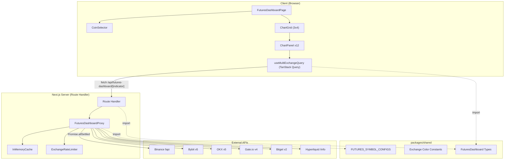
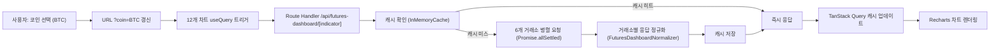
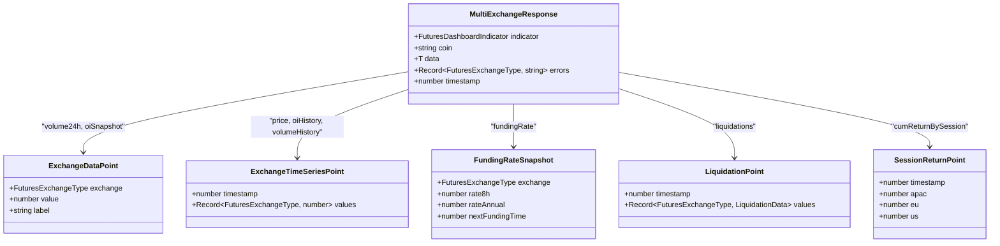
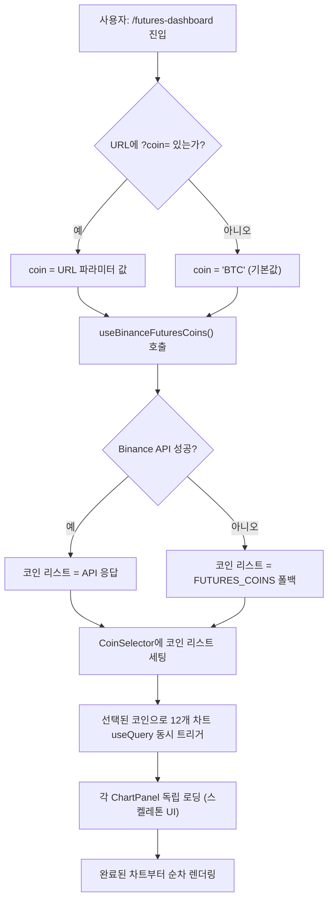
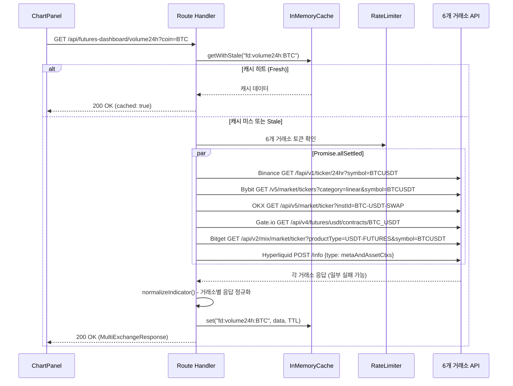
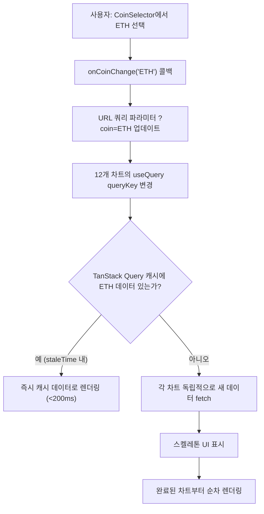
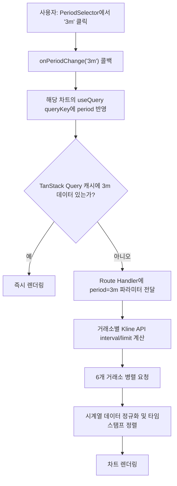
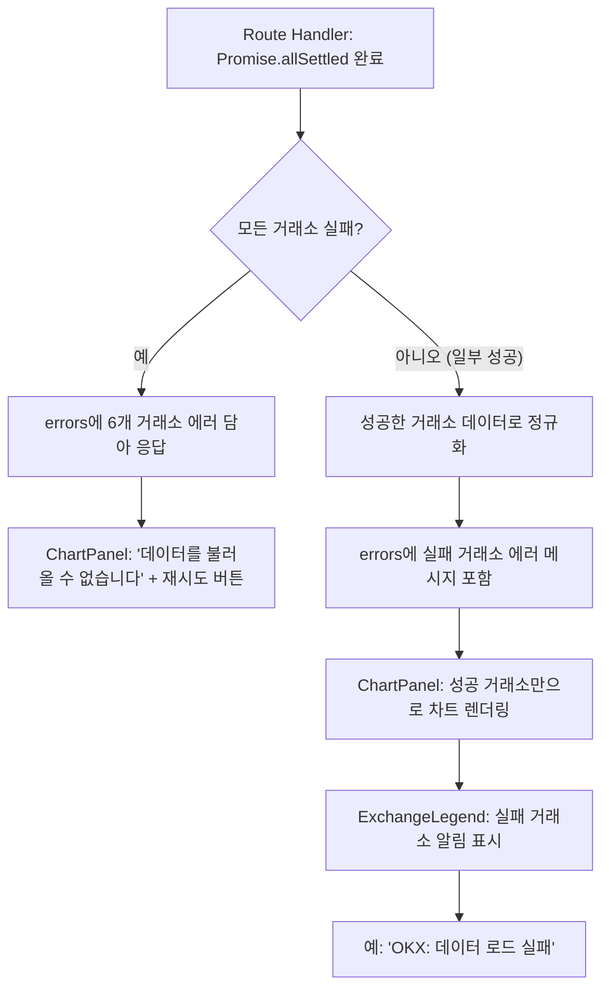
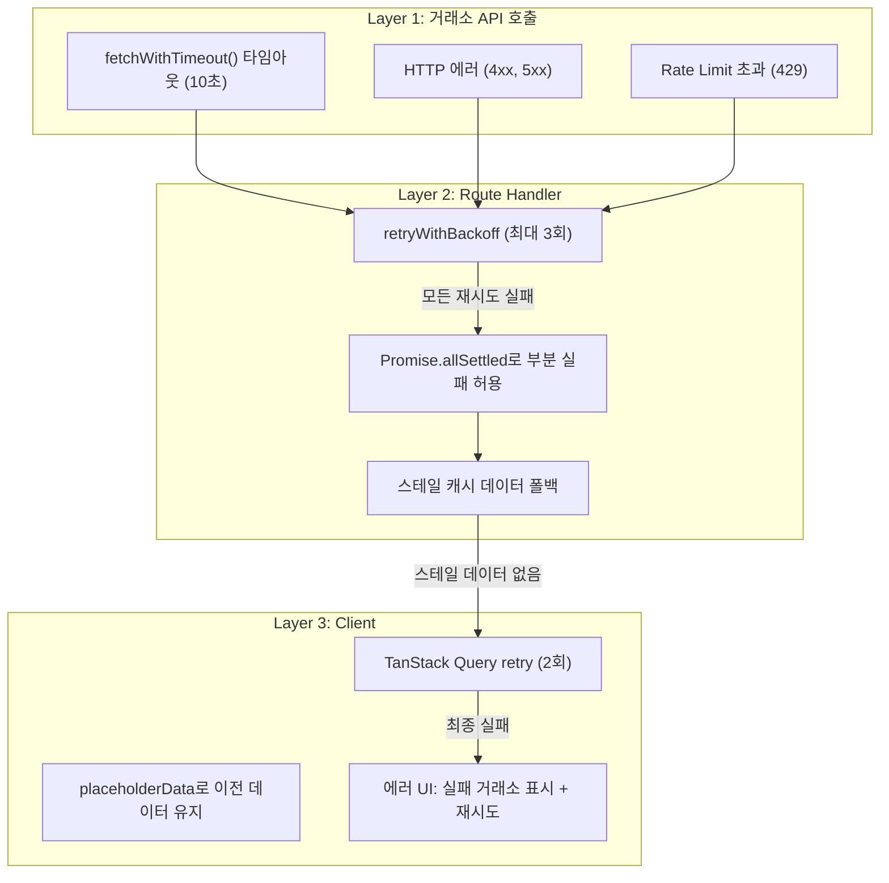

# 멀티 거래소 선물 대시보드 - 설계 문서

## 개요

BitScope에 **멀티 거래소 선물 대시보드** 페이지(`/futures-dashboard`)를 신규 추가한다. 6개 거래소(Binance, Bybit, OKX, Gate.io, Bitget, Hyperliquid)의 선물 핵심 지표 12가지를 3x4 그리드 차트로 한눈에 비교할 수 있는 대시보드를 구현한다.

### 설계 원칙

1. **기존 패턴 재사용**: `apps/web/app/api/exchange/_lib/` 의 프록시/캐시/레이트리미터 패턴을 그대로 활용한다.
2. **독립적 데이터 로딩**: 12개 차트 각각이 독립적으로 데이터를 fetch하여, 한 차트의 지연이 다른 차트에 영향을 주지 않는다.
3. **부분 장애 허용**: 특정 거래소 API 실패 시 해당 거래소만 제외하고 나머지를 정상 표시한다.
4. **공유 타입 중앙화**: 새 타입/상수는 `packages/shared`에 정의하여 재사용성을 보장한다.

---

## 아키텍처 설계

### 시스템 아키텍처 다이어그램



### 데이터 흐름 다이어그램



---

## 컴포넌트 설계

### 컴포넌트 A: CoinSelector (코인 선택기)

- **책임**: Binance 선물 상장 코인 리스트 로드, 검색/필터, 코인 선택 시 URL 쿼리 파라미터 동기화
- **인터페이스**:
  ```typescript
  interface CoinSelectorProps {
    selectedCoin: string;           // 현재 선택된 baseAsset (예: "BTC")
    onCoinChange: (coin: string) => void;
  }
  ```
- **의존성**: `useBinanceFuturesCoins` 훅, `FUTURES_COINS` 폴백 상수, `useSearchParams`

### 컴포넌트 B: ChartGrid (차트 그리드 레이아웃)

- **책임**: 12개 ChartPanel을 3x4 반응형 그리드로 배치, 그리드 행 그룹 레이블 표시
- **인터페이스**:
  ```typescript
  interface ChartGridProps {
    coin: string;       // 선택된 baseAsset
    period: Period;     // 기간 선택 (히스토리 차트 전용)
  }
  ```
- **의존성**: ChartPanel 컴포넌트, Tailwind CSS 그리드

### 컴포넌트 C: ChartPanel (개별 차트 패널)

- **책임**: 단일 지표의 차트 렌더링, 로딩/에러 상태 표시, 기간 선택(해당 시), 토글(해당 시)
- **인터페이스**:
  ```typescript
  interface ChartPanelProps {
    title: string;
    indicator: FuturesDashboardIndicator;
    coin: string;
    chartType: 'bar' | 'line' | 'stackedBar';
    period?: Period;
    onPeriodChange?: (period: Period) => void;
    toggleOptions?: ToggleOption[];
    renderChart: (data: NormalizedIndicatorData) => React.ReactNode;
  }
  ```
- **의존성**: `useMultiExchangeIndicator` 훅, Recharts, 스켈레톤 UI

### 컴포넌트 D: PeriodSelector (기간 선택기)

- **책임**: 히스토리 차트의 기간 버튼 그룹 렌더링 (1d, 1w, 1m, 3m, 6m, 1y)
- **인터페이스**:
  ```typescript
  interface PeriodSelectorProps {
    selected: Period;
    onChange: (period: Period) => void;
  }
  ```
- **의존성**: 없음 (순수 UI 컴포넌트)

### 컴포넌트 E: ExchangeLegend (거래소 범례)

- **책임**: 거래소별 고정 색상과 이름을 표시하는 공유 범례, 에러 발생 거래소 알림 표시
- **인터페이스**:
  ```typescript
  interface ExchangeLegendProps {
    exchanges: FuturesExchangeType[];
    errors?: Partial<Record<FuturesExchangeType, string>>;
  }
  ```
- **의존성**: `EXCHANGE_COLORS` 상수

### 컴포넌트 F: FuturesDashboardProxy (Route Handler 프록시)

- **책임**: 6개 거래소에 병렬로 공개 API 요청, 응답 정규화, 캐싱
- **인터페이스**:
  ```typescript
  async function fetchMultiExchangeIndicator(
    indicator: FuturesDashboardIndicator,
    coin: string,
    options?: { period?: Period }
  ): Promise<MultiExchangeResponse>
  ```
- **의존성**: `relayRequest`, `InMemoryCache`, `ExchangeRateLimiter`, `FUTURES_SYMBOL_CONFIGS`

### 컴포넌트 G: FuturesDashboardNormalizer (응답 정규화)

- **책임**: 6개 거래소의 상이한 API 응답을 통일된 포맷으로 정규화
- **인터페이스**:
  ```typescript
  function normalizeIndicator(
    exchange: FuturesExchangeType,
    indicator: FuturesDashboardIndicator,
    rawResponse: unknown
  ): NormalizedIndicatorData
  ```
- **의존성**: 거래소별 응답 파싱 로직

---

## 데이터 모델

### 핵심 데이터 구조 정의

모든 새 타입은 `packages/shared/src/types/futures-dashboard.ts`에 정의한다.

```typescript
/** 멀티 거래소 선물 대시보드 지표 종류 */
export type FuturesDashboardIndicator =
  | 'price'
  | 'volume24h'
  | 'volumeHistory'
  | 'oiSnapshot'
  | 'oiHistory'
  | 'fundingRate'
  | 'liquidations'
  | 'cvd'
  | 'basis3m'
  | 'avgReturnByHour'
  | 'avgReturnByDay'
  | 'cumReturnBySession';

/** 기간 선택 옵션 */
export type Period = '1d' | '1w' | '1m' | '3m' | '6m' | '1y';

/** 거래소별 고정 색상 */
export const EXCHANGE_COLORS: Record<FuturesExchangeType, string> = {
  binance: '#F0B90B',
  bybit: '#F7A600',
  okx: '#CCCCCC',        // 다크 모드 대비 조정
  gate: '#2354E6',
  bitget: '#00C9A7',
  hyperliquid: '#6FFFE9',
};

/** 거래소별 데이터 포인트 (스냅샷) */
export interface ExchangeDataPoint {
  exchange: FuturesExchangeType;
  value: number;
  label?: string;
}

/** 거래소별 시계열 데이터 포인트 */
export interface ExchangeTimeSeriesPoint {
  timestamp: number;
  values: Partial<Record<FuturesExchangeType, number>>;
}

/** 펀딩 비율 스냅샷 데이터 */
export interface FundingRateSnapshot {
  exchange: FuturesExchangeType;
  rate8h: number;        // 8시간 기준 원본
  rateAnnual: number;    // 연환산 (rate8h * 3 * 365)
  nextFundingTime?: number;
}

/** 청산 데이터 포인트 */
export interface LiquidationPoint {
  timestamp: number;
  values: Partial<Record<FuturesExchangeType, {
    longUsd: number;    // 롱 청산 금액 (양수)
    shortUsd: number;   // 숏 청산 금액 (음수)
  }>>;
}

/** CVD 데이터 포인트 */
export interface CVDPoint {
  timestamp: number;
  values: Partial<Record<FuturesExchangeType, number>>;
}

/** 시간대별 평균 수익률 */
export interface HourlyReturnPoint {
  hour: number;          // 0~23 (UTC)
  avgReturn: number;     // 평균 1분 수익률 (%)
}

/** 요일별 평균 수익률 */
export interface DailyReturnPoint {
  day: number;           // 0 (Mon) ~ 6 (Sun)
  dayLabel: string;      // "Mon" ~ "Sun"
  avgReturn: number;     // 평균 수익률 (%)
}

/** 세션별 누적 수익률 */
export interface SessionReturnPoint {
  timestamp: number;
  apac: number;          // APAC 누적 수익률
  eu: number;            // EU 누적 수익률
  us: number;            // US 누적 수익률
}

/** 멀티 거래소 API 통합 응답 */
export interface MultiExchangeResponse<T = unknown> {
  /** 지표 식별자 */
  indicator: FuturesDashboardIndicator;
  /** 조회한 코인 (baseAsset) */
  coin: string;
  /** 성공한 거래소 데이터 */
  data: T;
  /** 실패한 거래소별 에러 메시지 */
  errors: Partial<Record<FuturesExchangeType, string>>;
  /** 응답 시각 */
  timestamp: number;
}
```

### 데이터 모델 다이어그램



---

## 비즈니스 프로세스

### 프로세스 1: 페이지 초기 로드 및 코인 선택



### 프로세스 2: 단일 지표 데이터 로딩 (Route Handler 내부)



### 프로세스 3: 코인 변경 시 차트 갱신



### 프로세스 4: 히스토리 차트 기간 변경



### 프로세스 5: 부분 장애 처리



---

## 파일 구조

새로 생성되는 파일 목록을 아래에 정리한다.

```
packages/shared/src/
  types/futures-dashboard.ts        # 멀티 거래소 대시보드 타입 정의
  constants/futures-dashboard.ts    # 거래소 색상, 지표별 설정 상수

apps/web/app/(dashboard)/futures-dashboard/
  page.tsx                          # 메인 페이지 컴포넌트
  components/
    coin-selector.tsx               # 코인 선택기
    chart-grid.tsx                  # 3x4 그리드 레이아웃
    chart-panel.tsx                 # 개별 차트 패널 (로딩/에러/차트)
    period-selector.tsx             # 기간 선택 버튼 그룹
    exchange-legend.tsx             # 거래소 범례
    charts/
      price-chart.tsx               # Price 라인 차트
      volume24h-chart.tsx           # 24h Volume 막대 차트
      volume-history-chart.tsx      # Volume 히스토리 스택 막대 차트
      oi-snapshot-chart.tsx         # OI Snapshot 막대 차트
      oi-history-chart.tsx          # OI 히스토리 라인 차트
      funding-rate-chart.tsx        # Funding Rate 비교 차트
      liquidations-chart.tsx        # Liquidations 양방향 막대 차트
      cvd-chart.tsx                 # CVD 라인 차트
      basis3m-chart.tsx             # 3M Annualized Basis 라인 차트
      avg-return-hour-chart.tsx     # 1m Avg Return By Hour 막대 차트
      avg-return-day-chart.tsx      # Avg Return By Day 막대 차트
      cum-return-session-chart.tsx  # Cumulative Return By Session 라인 차트

apps/web/app/api/futures-dashboard/
  [indicator]/route.ts              # 지표별 Route Handler (동적 라우트)
  _lib/
    fetch-indicator.ts              # 지표별 멀티 거래소 데이터 수집 로직
    normalizer.ts                   # 거래소별 응답 정규화
    url-builder.ts                  # 거래소별 API URL 생성
    kline-aggregator.ts             # Kline 기반 파생 지표 계산 (CVD, Return 등)

apps/web/hooks/
  useMultiExchangeIndicator.ts      # 멀티 거래소 지표 TanStack Query 훅
  useBinanceFuturesCoins.ts         # Binance 선물 코인 리스트 훅
```

### 12개 차트 컴포넌트 - 지표/차트유형/데이터 훅 매핑

| 컴포넌트 | 파일명 | 차트 유형 | 사용 지표 (indicator) | 토글/옵션 |
|----------|--------|-----------|---------------------|-----------|
| PriceChart | `price-chart.tsx` | LineChart (거래소별 라인) | `price` | PeriodSelector |
| Volume24hChart | `volume24h-chart.tsx` | BarChart (거래소별 막대) | `volume24h` | - |
| VolumeHistoryChart | `volume-history-chart.tsx` | StackedBarChart | `volumeHistory` | PeriodSelector |
| OISnapshotChart | `oi-snapshot-chart.tsx` | BarChart (거래소별 막대) | `oiSnapshot` | - |
| OIHistoryChart | `oi-history-chart.tsx` | LineChart (거래소별 라인) | `oiHistory` | PeriodSelector |
| FundingRateChart | `funding-rate-chart.tsx` | BarChart (양/음 색상) | `fundingRate` | Annual / 8hrs 토글 |
| LiquidationsChart | `liquidations-chart.tsx` | BarChart (롱상단/숏하단) | `liquidations` | PeriodSelector |
| CVDChart | `cvd-chart.tsx` | LineChart (거래소별 라인) | `cvd` | Dollars / OI-normalized 토글, PeriodSelector |
| Basis3mChart | `basis3m-chart.tsx` | LineChart (거래소별 라인) | `basis3m` | PeriodSelector (BTC/ETH만 지원) |
| AvgReturnByHourChart | `avg-return-hour-chart.tsx` | BarChart (양/음 색상) | `avgReturnByHour` | - |
| AvgReturnByDayChart | `avg-return-day-chart.tsx` | BarChart (양/음 색상) | `avgReturnByDay` | - |
| CumReturnBySessionChart | `cum-return-session-chart.tsx` | LineChart (세션별 라인: APAC/EU/US) | `cumReturnBySession` | PeriodSelector |

---

## 상세 설계

### 1. Route Handler 설계 (`/api/futures-dashboard/[indicator]`)

기존 `[exchange]/futures-orderbook/route.ts` 패턴을 따르되, **단일 거래소가 아닌 6개 거래소를 동시에 호출**하는 것이 핵심 차이점이다.

```typescript
// apps/web/app/api/futures-dashboard/[indicator]/route.ts
export async function GET(
  request: NextRequest,
  context: { params: Promise<{ indicator: string }> }
): Promise<NextResponse> {
  const { indicator } = await context.params;
  const coin = request.nextUrl.searchParams.get('coin') ?? 'BTC';
  const period = request.nextUrl.searchParams.get('period') as Period | null;

  // 1. 지표 유효성 검증
  if (!VALID_INDICATORS.includes(indicator as FuturesDashboardIndicator)) {
    return NextResponse.json({ success: false, error: { message: '유효하지 않은 지표', code: 'INVALID_INDICATOR' } }, { status: 400 });
  }

  // 2. 캐시 확인
  const cache = getGlobalCache();
  const cacheKey = buildCacheKey('fd', indicator, { coin, ...(period ? { period } : {}) });
  const cached = cache.getWithStale(cacheKey);
  if (cached.hit && cached.isFresh) {
    return NextResponse.json({ success: true, ...cached.data, cached: true });
  }

  // 3. 멀티 거래소 데이터 수집
  const result = await fetchMultiExchangeIndicator(
    indicator as FuturesDashboardIndicator,
    coin,
    { period: period ?? undefined }
  );

  // 4. 캐시 저장 (스냅샷: 30s, 히스토리: 5m)
  const ttl = isSnapshotIndicator(indicator) ? 30_000 : 300_000;
  cache.set(cacheKey, result, ttl);

  return NextResponse.json({ success: true, ...result, cached: false });
}
```

#### 지표 분류 (캐싱 전략)

| 분류 | 지표 | 서버 캐시 TTL | 클라이언트 staleTime |
|------|------|:----------:|:-----------:|
| **스냅샷** | volume24h, oiSnapshot, fundingRate | 30초 | 30초 |
| **히스토리** | price, oiHistory, volumeHistory, liquidations, cvd, basis3m | 5분 | 5분 |
| **계산 (Kline 집계)** | avgReturnByHour, avgReturnByDay, cumReturnBySession | 10분 | 10분 |

### 2. 멀티 거래소 데이터 수집 (`fetch-indicator.ts`)

```typescript
// apps/web/app/api/futures-dashboard/_lib/fetch-indicator.ts

async function fetchMultiExchangeIndicator(
  indicator: FuturesDashboardIndicator,
  coin: string,
  options?: { period?: Period }
): Promise<MultiExchangeResponse> {
  const rateLimiter = getGlobalRateLimiter();
  const exchanges = getExchangesForIndicator(indicator);

  // 6개 거래소 병렬 요청
  const results = await Promise.allSettled(
    exchanges.map(async (exchange) => {
      rateLimiter.acquireToken(exchange as ExchangeType);
      const url = buildIndicatorUrl(exchange, indicator, coin, options);
      const response = await fetchWithTimeout(exchange as ExchangeType, {
        url,
        method: exchange === 'hyperliquid' ? 'POST' : 'GET',
        headers: { 'Content-Type': 'application/json' },
        body: exchange === 'hyperliquid'
          ? buildHyperliquidBody(indicator, coin)
          : undefined,
      });
      return { exchange, data: normalizeIndicator(exchange, indicator, response) };
    })
  );

  // 성공/실패 분리
  const successData: Record<string, unknown> = {};
  const errors: Partial<Record<FuturesExchangeType, string>> = {};

  for (const result of results) {
    if (result.status === 'fulfilled') {
      successData[result.value.exchange] = result.value.data;
    } else {
      const exchange = extractExchangeFromError(result.reason);
      errors[exchange] = result.reason?.message ?? 'Unknown error';
    }
  }

  return {
    indicator,
    coin,
    data: mergeExchangeData(indicator, successData),
    errors,
    timestamp: Date.now(),
  };
}
```

### 3. 거래소별 URL 빌더 (`url-builder.ts`)

기존 `FUTURES_SYMBOL_CONFIGS`의 `formatApiSymbol`을 재사용하여 거래소별 심볼을 변환한다.

```typescript
// apps/web/app/api/futures-dashboard/_lib/url-builder.ts

/** 거래소별 선물 대시보드 API 엔드포인트 매핑 */
const INDICATOR_ENDPOINTS: Record<FuturesDashboardIndicator, Record<FuturesExchangeType, string>> = {
  volume24h: {
    binance:     '/fapi/v1/ticker/24hr',
    bybit:       '/v5/market/tickers',
    okx:         '/api/v5/market/ticker',
    gate:        '/api/v4/futures/usdt/contracts',
    bitget:      '/api/v2/mix/market/ticker',
    hyperliquid: '/info',
  },
  oiSnapshot: {
    binance:     '/fapi/v1/openInterest',
    bybit:       '/v5/market/open-interest',
    okx:         '/api/v5/public/open-interest',
    gate:        '/api/v4/futures/usdt/contracts',
    bitget:      '/api/v2/mix/market/open-interest',
    hyperliquid: '/info',
  },
  fundingRate: {
    binance:     '/fapi/v1/premiumIndex',
    bybit:       '/v5/market/tickers',
    okx:         '/api/v5/public/funding-rate',
    gate:        '/api/v4/futures/usdt/contracts',
    bitget:      '/api/v2/mix/market/current-fund-rate',
    hyperliquid: '/info',
  },
  oiHistory: {
    binance:     '/futures/data/openInterestHist',
    bybit:       '/v5/market/open-interest',
    okx:         '/api/v5/rubik/stat/contracts/open-interest-volume',
    gate:        '/api/v4/futures/usdt/contract_stats',
    bitget:      '/api/v2/mix/market/open-interest',
    hyperliquid: '/info',
  },
  price: {
    binance:     '/fapi/v1/klines',
    bybit:       '/v5/market/kline',
    okx:         '/api/v5/market/candles',
    gate:        '/api/v4/futures/usdt/candlesticks',
    bitget:      '/api/v2/mix/market/candles',
    hyperliquid: '/info',
  },
  // ... 나머지 지표도 동일 패턴
};

function buildIndicatorUrl(
  exchange: FuturesExchangeType,
  indicator: FuturesDashboardIndicator,
  coin: string,
  options?: { period?: Period }
): string {
  const config = EXCHANGE_CONFIGS[exchange as ExchangeType];
  const baseUrl = config.futuresBaseUrl ?? config.restBaseUrl;
  const symbol = getFuturesApiSymbol(exchange, coin);
  const endpoint = INDICATOR_ENDPOINTS[indicator][exchange];

  // 거래소별 쿼리 파라미터 조합
  switch (exchange) {
    case 'binance':
      return `${baseUrl}${endpoint}?symbol=${symbol}${buildBinanceParams(indicator, options)}`;
    case 'bybit':
      return `${config.restBaseUrl}${endpoint}?category=linear&symbol=${symbol}${buildBybitParams(indicator, options)}`;
    case 'okx':
      return `${config.restBaseUrl}${endpoint}?instId=${symbol}${buildOkxParams(indicator, options)}`;
    case 'gate':
      return `${config.restBaseUrl}${endpoint}/${symbol}${buildGateParams(indicator, options)}`;
    case 'bitget':
      return `${config.restBaseUrl}${endpoint}?productType=USDT-FUTURES&symbol=${symbol}${buildBitgetParams(indicator, options)}`;
    case 'hyperliquid':
      return `${config.restBaseUrl}${endpoint}`;
    default:
      return '';
  }
}
```

### 4. Kline 기반 파생 지표 계산 (`kline-aggregator.ts`)

CVD, 시간대별 수익률, 요일별 수익률, 세션별 누적 수익률은 Kline(캔들) 데이터를 서버에서 가공하여 계산한다.

```typescript
// apps/web/app/api/futures-dashboard/_lib/kline-aggregator.ts

/** CVD 계산: Kline 데이터에서 Taker Buy - Taker Sell 누적 */
function calculateCVD(klines: NormalizedKline[]): CVDPoint[] {
  let cumDelta = 0;
  return klines.map(k => {
    // Binance: takerBuyQuoteVol 직접 제공
    // 기타: (close > open ? volume * ratio : -volume * ratio) 근사
    const takerBuyVol = k.takerBuyQuoteVol ?? estimateTakerBuy(k);
    const takerSellVol = k.quoteVolume - takerBuyVol;
    cumDelta += (takerBuyVol - takerSellVol);
    return { timestamp: k.openTime, value: cumDelta };
  });
}

/** 시간대별 평균 1분 수익률 계산 */
function calculateAvgReturnByHour(klines1m: NormalizedKline[]): HourlyReturnPoint[] {
  const hourBuckets: Map<number, number[]> = new Map();
  
  for (const k of klines1m) {
    const hour = new Date(k.openTime).getUTCHours();
    const ret = (k.close - k.open) / k.open;
    if (!hourBuckets.has(hour)) hourBuckets.set(hour, []);
    hourBuckets.get(hour)!.push(ret);
  }

  return Array.from(hourBuckets.entries())
    .map(([hour, returns]) => ({
      hour,
      avgReturn: returns.reduce((a, b) => a + b, 0) / returns.length * 100,
    }))
    .sort((a, b) => a.hour - b.hour);
}

/** 세션별 누적 수익률 계산 */
function calculateCumReturnBySession(klines1h: NormalizedKline[]): SessionReturnPoint[] {
  // APAC: UTC 0~7, EU: UTC 8~15, US: UTC 16~23
  let apacCum = 0, euCum = 0, usCum = 0;
  
  return klines1h.map(k => {
    const hour = new Date(k.openTime).getUTCHours();
    const ret = (k.close - k.open) / k.open * 100;
    
    if (hour >= 0 && hour < 8) apacCum += ret;
    else if (hour >= 8 && hour < 16) euCum += ret;
    else usCum += ret;

    return { timestamp: k.openTime, apac: apacCum, eu: euCum, us: usCum };
  });
}
```

### 5. 클라이언트 TanStack Query 훅 (`useMultiExchangeIndicator.ts`)

```typescript
// apps/web/hooks/useMultiExchangeIndicator.ts

export function useMultiExchangeIndicator<T>(
  indicator: FuturesDashboardIndicator,
  coin: string,
  options?: { period?: Period; enabled?: boolean }
) {
  const staleTime = getStaleTime(indicator);

  return useQuery<MultiExchangeResponse<T>>({
    queryKey: ['futures-dashboard', indicator, coin, options?.period],
    queryFn: async () => {
      const params = new URLSearchParams({ coin });
      if (options?.period) params.set('period', options.period);
      
      const res = await fetch(`/api/futures-dashboard/${indicator}?${params}`, {
        signal: AbortSignal.timeout(15_000),
      });
      if (!res.ok) throw new Error(`Failed to fetch ${indicator}`);
      const json = await res.json();
      return json;
    },
    enabled: options?.enabled !== false && !!coin,
    staleTime,
    retry: 2,
    retryDelay: (attempt) => Math.min(1000 * 2 ** attempt, 4000),
    placeholderData: (prev) => prev,
  });
}

function getStaleTime(indicator: FuturesDashboardIndicator): number {
  const SNAPSHOT_INDICATORS = ['volume24h', 'oiSnapshot', 'fundingRate'];
  const KLINE_INDICATORS = ['avgReturnByHour', 'avgReturnByDay', 'cumReturnBySession'];
  
  if (SNAPSHOT_INDICATORS.includes(indicator)) return 30_000;
  if (KLINE_INDICATORS.includes(indicator)) return 600_000;
  return 300_000;
}
```

### 6. 거래소별 심볼 및 API 참조 매트릭스

기존 `FUTURES_SYMBOL_CONFIGS`를 그대로 사용한다. 참고용 거래소별 주요 필드 매핑은 아래와 같다.

| 지표 | Binance 필드 | Bybit 필드 | OKX 필드 | Gate.io 필드 | Bitget 필드 | Hyperliquid 필드 |
|------|-------------|-----------|---------|-------------|-----------|----------------|
| **24h Volume** | `quoteVolume` | `turnover24h` | `volCcy24h` | `trade_size * last` | `usdtVolume` | `dayNtlVlm` |
| **OI** | `openInterest * markPrice` | `openInterest` (USDT) | `oi * last` | `open_interest * last` | `amount * markPrice` | `openInterest * markPx` |
| **Funding** | `lastFundingRate` | `fundingRate` (tickers) | `fundingRate` | `funding_rate` | `fundingRate` | `funding` |
| **Price** | klines `close` | klines `close` | candles `c` | candlesticks `close` | candles `close` | candleSnapshot `c` |

### 7. 3M Annualized Basis 설계

이 지표는 분기 만기 선물이 있는 거래소(Binance, OKX)에서만 계산 가능하며, BTC/ETH만 지원한다.

```typescript
// 3M Basis 계산 로직
function calculate3mBasis(futuresPrice: number, spotPrice: number, daysToExpiry: number): number {
  if (spotPrice === 0 || daysToExpiry <= 0) return 0;
  return ((futuresPrice - spotPrice) / spotPrice) * (365 / daysToExpiry) * 100;
}

// 거래소별 분기 선물 심볼
// Binance: BTCUSDT_250926 (YYMMDD 형식의 만기일)
// OKX: BTC-USD-250926 (YYMMDD 형식의 만기일)
// Bybit, Gate, Bitget, Hyperliquid: 분기 선물 미지원 → 차트에서 제외
```

---

## 에러 처리 전략

### 계층별 에러 처리



### 에러 시나리오 대응

| 시나리오 | Layer 1 | Layer 2 | Layer 3 |
|---------|---------|---------|---------|
| 단일 거래소 타임아웃 | fetchWithTimeout → 10s abort | retryWithBackoff 3회 시도 → allSettled에서 reject | 나머지 5개 거래소 데이터로 차트 렌더링, 범례에 "X: 실패" 표시 |
| 전체 거래소 실패 | 모두 타임아웃/에러 | 스테일 캐시 확인 → 없으면 빈 응답 | "데이터를 불러올 수 없습니다" + 재시도 버튼 |
| Rate Limit 초과 | RateLimitError | 지수 백오프 후 재시도 | 자동 처리 (사용자 인지 불필요) |
| Hyperliquid POST 형식 에러 | 파싱 에러 | 해당 거래소만 errors에 추가 | 나머지 5개 거래소로 정상 표시 |
| Binance 코인 리스트 실패 | HTTP 에러 | - | FUTURES_COINS 상수 폴백 |

---

## 테스팅 전략

### 단위 테스트

| 대상 | 테스트 범위 | 위치 |
|------|-----------|------|
| `normalizer.ts` | 6개 거래소 x 12개 지표 응답 정규화 | `__tests__/normalizer.test.ts` |
| `url-builder.ts` | 거래소별 URL 생성 정확성 | `__tests__/url-builder.test.ts` |
| `kline-aggregator.ts` | CVD, 수익률, 세션 수익률 계산 정확성 | `__tests__/kline-aggregator.test.ts` |
| `FUTURES_SYMBOL_CONFIGS` | 심볼 변환 함수 검증 | 기존 테스트 재사용 |

### 통합 테스트

| 대상 | 테스트 범위 | 방법 |
|------|-----------|------|
| Route Handler | 지표별 엔드포인트 정상 응답, 에러 응답 | MSW(Mock Service Worker)로 거래소 API 목킹 |
| 부분 장애 | 3개 거래소 실패 시 나머지 3개로 정상 응답 | Promise.allSettled 결과 검증 |
| 캐싱 | TTL 내 캐시 히트, TTL 후 리프레시 | InMemoryCache 직접 테스트 |

### E2E 테스트 (수동)

| 시나리오 | 검증 항목 |
|---------|----------|
| 페이지 로드 | 12개 차트 전체 렌더링, 스켈레톤 → 데이터 전환 확인 |
| 코인 변경 | BTC → ETH 전환 시 모든 차트 갱신, URL 파라미터 반영 |
| 기간 변경 | 1d → 1y 전환 시 히스토리 차트 데이터 범위 변경 |
| 반응형 | 모바일 1열, 태블릿 2열, 데스크톱 3열 레이아웃 확인 |
| 에러 복구 | 네트워크 차단 → 복구 시 재시도 정상 동작 |

---

## 사이드바 네비게이션 변경

기존 `sidebar-nav.tsx`의 `sectionMarket` 섹션에 새 메뉴 항목을 추가한다.

```typescript
// 변경할 부분 (sidebar-nav.tsx의 NAV_SECTIONS > sectionMarket > items)
{
  labelKey: 'sectionMarket',
  items: [
    { labelKey: 'cryptoDesk', href: '/life', icon: Monitor },
    { labelKey: 'market', href: '/market', icon: TrendingUp },
    { labelKey: 'premium', href: '/premium', icon: BarChart3 },
    // 신규 추가: 멀티 거래소 선물 (기존 futuresMarketData 위에 배치)
    { labelKey: 'futuresDashboard', href: '/futures-dashboard', icon: BarChart3 },
    { labelKey: 'futuresMarketData', href: '/futures', icon: Activity },
    { labelKey: 'futuresTrading', href: '/futures-trading', icon: ArrowUpDown },
    { labelKey: 'charts', href: '/charts', icon: ChartCandlestick },
  ],
},
```

i18n 키 추가: `futuresDashboard: '멀티 거래소 선물'` (한/영 모두)

---

## 설계 결정 사항 및 근거

### 결정 1: Route Handler별 지표 단위 vs 전체 일괄 조회

- **선택**: 지표별 개별 Route Handler (`/api/futures-dashboard/[indicator]`)
- **근거**: 
  - 12개 지표를 한 번에 요청하면 응답 시간이 가장 느린 지표에 종속된다.
  - 지표별 독립 요청으로 "먼저 완료된 차트부터 표시" 요구사항(18-4)을 자연스럽게 충족한다.
  - 지표별로 서로 다른 캐시 TTL을 적용할 수 있다.

### 결정 2: 거래소 API 직접 호출 vs Velo API

- **선택**: 각 거래소 공개 API 직접 호출
- **근거**: 
  - Velo API는 월 $199 유료이다.
  - 실시간 + 최근 히스토리는 거래소 무료 API로 충분히 커버된다.
  - 기존 BitScope 인프라(프록시, 캐시, Rate Limiter)를 그대로 재사용할 수 있다.

### 결정 3: 기존 relayRequest vs 새 공개 API 전용 함수

- **선택**: `fetchWithTimeout`만 직접 사용하고, `relayRequest`의 캐시/에러 처리는 Route Handler 레벨에서 수행
- **근거**: 
  - `relayRequest`는 서명된 요청(SignedRequest) 기반으로 설계되어 있다.
  - 멀티 거래소 대시보드는 모두 공개 API이므로 서명이 불필요하다.
  - 다만 `InMemoryCache`, `ExchangeRateLimiter`, `fetchWithTimeout`은 기존 것을 그대로 재사용한다.

### 결정 4: Kline 기반 파생 지표는 서버에서 계산

- **선택**: Route Handler(서버)에서 Kline 데이터를 가져와 CVD/수익률 등을 계산하여 가공된 결과만 클라이언트에 전달
- **근거**: 
  - 30일 1분봉(43,200개 캔들)을 클라이언트에 전송하면 대역폭 낭비이다.
  - 서버에서 계산 후 결과(24개 시간대별 수치 등)만 전송하면 응답 크기가 극적으로 줄어든다.
  - 서버 캐싱도 가공된 결과 단위로 적용할 수 있어 효율적이다.

### 결정 5: Hyperliquid POST 요청 처리

- **선택**: 기존 `fetchWithTimeout`의 method/body 파라미터를 활용
- **근거**: 
  - Hyperliquid는 모든 API가 `POST /info`에 `type` 파라미터로 구분된다.
  - `fetchWithTimeout`이 이미 POST + body를 지원하므로 별도 처리 불필요하다.
  - `buildHyperliquidBody(indicator, coin)` 함수로 지표별 요청 body를 생성한다.
