# 멀티 거래소 선물 대시보드 - 구현 태스크 목록

## Implementation Plan

- [ ] 1. 공유 타입 및 상수 정의 (`packages/shared`)
- [ ] 1.1 `packages/shared/src/types/futures-dashboard.ts` 생성: 멀티 거래소 대시보드 전용 타입 정의
  - `FuturesDashboardIndicator` 유니온 타입 (12개 지표)
  - `Period` 타입 (`'1d' | '1w' | '1m' | '3m' | '6m' | '1y'`)
  - `ExchangeDataPoint`, `ExchangeTimeSeriesPoint`, `FundingRateSnapshot`, `LiquidationPoint`, `CVDPoint`, `HourlyReturnPoint`, `DailyReturnPoint`, `SessionReturnPoint` 인터페이스
  - `MultiExchangeResponse<T>` 제네릭 응답 인터페이스 (data, errors, indicator, coin, timestamp)
  - 기존 `FuturesExchangeType`을 import하여 재사용
  - _Requirements: 16-3, 20-1_

- [ ] 1.2 `packages/shared/src/constants/futures-dashboard.ts` 생성: 거래소 색상 및 지표 설정 상수
  - `EXCHANGE_COLORS`: 6개 거래소별 고정 HEX 색상 (Binance #F0B90B, Bybit #F7A600, OKX #CCCCCC, Gate #2354E6, Bitget #00C9A7, Hyperliquid #6FFFE9)
  - `VALID_INDICATORS`: 12개 유효 지표 배열
  - `SNAPSHOT_INDICATORS`, `HISTORY_INDICATORS`, `KLINE_INDICATORS`: 캐시 TTL 분류용 상수
  - `SESSION_RANGES`: APAC/EU/US 시간대 정의 (UTC 0-8, 8-16, 16-24)
  - `packages/shared/src/types/index.ts`와 `packages/shared/src/constants/index.ts`에 re-export 추가
  - _Requirements: 20-1, 20-2, 14-2, 18-2, 18-3_

- [ ] 1.3 `packages/shared/src/types/futures-dashboard.ts`와 `constants/futures-dashboard.ts`에 대한 단위 테스트 작성
  - 타입 검증: `EXCHANGE_COLORS`가 6개 거래소를 모두 포함하는지 확인
  - `VALID_INDICATORS`가 12개인지 확인
  - `SESSION_RANGES` 시간대가 24시간을 커버하는지 확인
  - _Requirements: NFR-4-3_

---

- [ ] 2. Route Handler 기반 인프라 구축 (`apps/web/app/api/futures-dashboard/`)
- [ ] 2.1 `apps/web/app/api/futures-dashboard/_lib/url-builder.ts` 생성: 거래소별 API URL 빌더
  - `INDICATOR_ENDPOINTS` 매핑 정의: 12개 지표 x 6개 거래소의 API 엔드포인트 경로
  - `buildIndicatorUrl(exchange, indicator, coin, options)` 함수 구현
  - 기존 `FUTURES_SYMBOL_CONFIGS`의 `formatApiSymbol`을 재사용하여 심볼 변환 (Binance `BTCUSDT`, OKX `BTC-USDT-SWAP`, Gate `BTC_USDT`, Hyperliquid `BTC` 등)
  - 기간(Period)에 따른 interval/limit 파라미터 계산 로직
  - Hyperliquid POST body 빌더 (`buildHyperliquidBody`) 함수
  - _Requirements: 16-1, 16-3_

- [ ] 2.2 `apps/web/app/api/futures-dashboard/_lib/url-builder.ts`에 대한 단위 테스트 작성
  - 6개 거래소 x 주요 지표 조합으로 URL 생성 정확성 검증
  - 심볼 변환 검증 (BTC → 거래소별 포맷)
  - 기간 파라미터 매핑 검증 (1d → 적절한 interval/limit)
  - Hyperliquid POST body 구조 검증
  - _Requirements: 16-3, NFR-4-2_

- [ ] 2.3 `apps/web/app/api/futures-dashboard/_lib/normalizer.ts` 생성: 거래소별 응답 정규화
  - `normalizeIndicator(exchange, indicator, rawResponse)` 함수 구현
  - 스냅샷 지표 정규화: volume24h (각 거래소별 quoteVolume 필드 매핑), oiSnapshot (USDT 환산), fundingRate (8h rate + annual 계산)
  - 히스토리 지표 정규화: price, oiHistory, volumeHistory (시계열 → `ExchangeTimeSeriesPoint[]`)
  - Liquidation 정규화: 롱/숏 분리 (`LiquidationPoint[]`)
  - 설계 문서의 거래소별 필드 매핑 참조 (Binance `quoteVolume`, Bybit `turnover24h`, OKX `volCcy24h` 등)
  - _Requirements: 16-3_

- [ ] 2.4 `normalizer.ts`에 대한 단위 테스트 작성
  - 6개 거래소 각각의 실제 API 응답 샘플 기반 정규화 검증
  - 스냅샷 지표(volume24h, oiSnapshot, fundingRate) 정규화 검증
  - 히스토리 지표(price, oiHistory) 시계열 변환 검증
  - 잘못된 응답에 대한 에러 핸들링 검증
  - _Requirements: 16-3, 19-1_

- [ ] 2.5 `apps/web/app/api/futures-dashboard/_lib/kline-aggregator.ts` 생성: Kline 기반 파생 지표 계산
  - `calculateCVD(klines)`: Taker Buy - Taker Sell 누적 → `CVDPoint[]`
  - `calculateAvgReturnByHour(klines1m)`: UTC 0~23시간대별 평균 1분 수익률 → `HourlyReturnPoint[]`
  - `calculateAvgReturnByDay(klines1d)`: 요일별(Mon~Sun) 평균 수익률 → `DailyReturnPoint[]`
  - `calculateCumReturnBySession(klines1h)`: 세션별(APAC/EU/US) 누적 수익률 → `SessionReturnPoint[]`
  - `calculate3mBasis(futuresPrice, spotPrice, daysToExpiry)`: 연환산 베이시스(%) 계산
  - _Requirements: 11-1, 12-1, 13-1, 14-1, 8-3_

- [ ] 2.6 `kline-aggregator.ts`에 대한 단위 테스트 작성
  - CVD 누적 계산 정확성 검증 (양수/음수 델타 시나리오)
  - 시간대별 수익률 집계 검증 (24개 시간대 출력, 정렬 검증)
  - 요일별 수익률 집계 검증 (7개 요일 출력)
  - 세션별 누적 수익률 검증 (APAC/EU/US 분리 정확성)
  - 3M Basis 연환산 계산 검증 (엣지 케이스: spotPrice=0, daysToExpiry=0)
  - _Requirements: 11-2, 11-3, 12-2, 12-3, 13-2, 13-3, 14-3, 8-3_

- [ ] 2.7 `apps/web/app/api/futures-dashboard/_lib/fetch-indicator.ts` 생성: 멀티 거래소 데이터 수집 핵심 로직
  - `fetchMultiExchangeIndicator(indicator, coin, options)` 함수 구현
  - `Promise.allSettled`로 6개 거래소 병렬 요청
  - 기존 `fetchWithTimeout` 재사용 (타임아웃 10초)
  - 기존 `getGlobalRateLimiter()` 재사용하여 Rate Limit 제어
  - 성공/실패 분리 로직: fulfilled → data, rejected → errors
  - `getExchangesForIndicator(indicator)`: 지표별 지원 거래소 목록 반환 (예: basis3m은 Binance, OKX만)
  - `mergeExchangeData(indicator, successData)`: 지표별 데이터 병합 로직
  - Hyperliquid POST 요청 처리 (method: 'POST', body 포함)
  - _Requirements: 16-1, 16-2, 16-4, 16-5, 16-6, 19-1_

- [ ] 2.8 `fetch-indicator.ts`에 대한 단위 테스트 작성 (거래소 API 목킹)
  - 6개 거래소 전체 성공 시나리오
  - 부분 실패 시나리오: 3개 성공 + 3개 실패 → errors 필드에 실패 거래소 포함 검증
  - 전체 실패 시나리오: 빈 data + 6개 errors 검증
  - Rate Limiter 호출 검증
  - Hyperliquid POST 요청 형식 검증
  - _Requirements: 16-5, 16-6, 19-1, 19-2, NFR-5-2_

- [ ] 2.9 `apps/web/app/api/futures-dashboard/[indicator]/route.ts` 생성: 동적 Route Handler
  - `GET` 핸들러 구현: indicator 경로 파라미터 + coin/period 쿼리 파라미터 처리
  - 지표 유효성 검증 (`VALID_INDICATORS` 포함 여부)
  - 기존 `getGlobalCache()` 재사용하여 서버 캐시 확인/저장
  - 캐시 키 빌드: `fd:{indicator}:{coin}:{period}`
  - 캐시 TTL 분류: 스냅샷 30초, 히스토리 5분, Kline 집계 10분
  - 정상 응답: `{ success: true, ...MultiExchangeResponse, cached: boolean }`
  - 에러 응답: 400 (유효하지 않은 지표), 500 (서버 에러)
  - _Requirements: 16-1, 16-4, 18-2, 18-3_

- [ ] 2.10 Route Handler 통합 테스트 작성
  - 유효한 지표 + 코인 조합으로 정상 응답 검증
  - 유효하지 않은 지표 → 400 에러 검증
  - 캐시 히트/미스 동작 검증 (동일 요청 2회 시 cached: true)
  - period 파라미터 전달 검증
  - _Requirements: 16-1, 16-4, 18-1_

---

- [ ] 3. 클라이언트 TanStack Query 훅 구현 (`apps/web/hooks/`)
- [ ] 3.1 `apps/web/hooks/useMultiExchangeIndicator.ts` 생성: 멀티 거래소 지표 데이터 훅
  - `useMultiExchangeIndicator<T>(indicator, coin, options?)` 훅 구현
  - queryKey: `['futures-dashboard', indicator, coin, period]`
  - fetch URL: `/api/futures-dashboard/${indicator}?coin=${coin}&period=${period}`
  - AbortSignal 타임아웃 15초
  - staleTime 분류: 스냅샷 30초, 히스토리 5분, Kline 집계 10분
  - retry: 2회, 지수 백오프
  - `placeholderData: (prev) => prev` 로 이전 데이터 유지
  - `enabled` 옵션 지원
  - _Requirements: 18-1, 18-2, 18-3, 18-4, 19-4_

- [ ] 3.2 `apps/web/hooks/useBinanceFuturesCoins.ts` 생성: Binance 선물 코인 리스트 훅
  - Binance `/fapi/v1/exchangeInfo` 호출하여 선물 상장 코인 리스트 조회
  - 응답에서 `TRADING` 상태인 USDT 영구 계약 코인만 필터
  - `FuturesCoin[]` 형태로 정규화 (symbol, baseAsset, label)
  - 실패 시 `FUTURES_COINS` 상수 폴백
  - staleTime: 1시간 (코인 리스트는 자주 변경되지 않음)
  - _Requirements: 1-1, 1-5_

- [ ] 3.3 TanStack Query 훅에 대한 단위 테스트 작성
  - `useMultiExchangeIndicator`: queryKey 구성 검증, staleTime 분류 검증
  - `useBinanceFuturesCoins`: 정상 응답 파싱, 폴백 동작 검증
  - _Requirements: 18-1, 1-5_

---

- [ ] 4. 공통 UI 컴포넌트 구현 (`apps/web/app/(dashboard)/futures-dashboard/components/`)
- [ ] 4.1 `period-selector.tsx` 생성: 기간 선택 버튼 그룹
  - `PeriodSelectorProps`: selected (Period), onChange ((period: Period) => void)
  - 6개 버튼: 1d, 1w, 1m, 3m, 6m, 1y
  - 선택된 버튼 활성 스타일 (기존 shadcn/ui Button 변형 활용)
  - 기본 선택값: "1m"
  - 키보드 탭 네비게이션 지원
  - _Requirements: 17-1, 17-2, 17-3, NFR-2-2_

- [ ] 4.2 `exchange-legend.tsx` 생성: 거래소 범례 컴포넌트
  - `ExchangeLegendProps`: exchanges (FuturesExchangeType[]), errors? (Partial<Record<FuturesExchangeType, string>>)
  - `EXCHANGE_COLORS`를 사용하여 거래소명 + 색상 원형 아이콘 표시
  - 에러 발생 거래소: "OKX: 데이터 로드 실패" 형태의 알림 텍스트 표시
  - _Requirements: 20-1, 20-2, 19-2_

- [ ] 4.3 `coin-selector.tsx` 생성: 코인 선택기 컴포넌트
  - `CoinSelectorProps`: selectedCoin (string), onCoinChange ((coin: string) => void)
  - `useBinanceFuturesCoins` 훅으로 코인 리스트 로드
  - 검색 입력: baseAsset 기준 필터링 (입력 시 실시간 필터)
  - 기본값: BTC
  - shadcn/ui Combobox 또는 Select + 검색 패턴 활용
  - _Requirements: 1-1, 1-2, 1-3, 1-4, 1-5_

- [ ] 4.4 `chart-panel.tsx` 생성: 개별 차트 패널 래퍼 컴포넌트
  - `ChartPanelProps`: title, indicator, coin, chartType, period?, onPeriodChange?, toggleOptions?, renderChart
  - `useMultiExchangeIndicator` 훅 내부 호출
  - 로딩 상태: 스켈레톤 UI (Tailwind animate-pulse)
  - 에러 상태: 전체 실패 시 "데이터를 불러올 수 없습니다" + 재시도 버튼, 부분 실패 시 ExchangeLegend에 에러 표시
  - 토글 옵션 지원: 차트 상단 버튼 그룹 (예: Annual/8hrs, Dollars/OI-normalized)
  - PeriodSelector 포함 (해당 시)
  - ARIA 레이블 적용 (`aria-label` = 차트 제목)
  - _Requirements: 18-4, 18-5, 19-1, 19-2, 19-3, 19-4, NFR-2-1_

- [ ] 4.5 공통 UI 컴포넌트에 대한 단위 테스트 작성
  - PeriodSelector: 기본 선택값(1m) 검증, 클릭 시 onChange 호출 검증
  - ExchangeLegend: 6개 거래소 색상 렌더링 검증, 에러 메시지 표시 검증
  - ChartPanel: 로딩 스켈레톤 표시, 에러 UI 표시, 재시도 버튼 동작 검증
  - _Requirements: 17-3, 19-3, 20-2_

---

- [ ] 5. 12개 차트 컴포넌트 구현 (1행: 가격/거래량)
- [ ] 5.1 `charts/price-chart.tsx` 생성: Price 라인 차트
  - Recharts `LineChart` + 거래소별 `Line` (6개 라인, `EXCHANGE_COLORS` 색상)
  - X축: 시간, Y축: 가격(USDT)
  - 거래소별 범례 표시
  - PeriodSelector 연동
  - 툴팁: 시각 + 거래소별 가격
  - _Requirements: 7-1, 7-2, 7-3_

- [ ] 5.2 `charts/volume24h-chart.tsx` 생성: 24h Volume 막대 차트
  - Recharts `BarChart` + 거래소별 `Bar` (각 거래소를 X축에 배치)
  - 거래소별 고유 색상
  - 툴팁: 거래소명 + 거래량 수치 (USDT 단위, K/M/B 포맷)
  - 데이터 미지원 거래소 자동 생략
  - _Requirements: 3-1, 3-2, 3-3, 3-4_

- [ ] 5.3 `charts/volume-history-chart.tsx` 생성: Volume 히스토리 스택 막대 차트
  - Recharts `BarChart` + 거래소별 stacked `Bar`
  - X축: 시간, Y축: 거래량(USDT)
  - PeriodSelector 연동
  - 거래소별 색상 + 범례
  - _Requirements: 10-1, 10-2, 10-3_

---

- [ ] 6. 12개 차트 컴포넌트 구현 (2행: 미결제약정)
- [ ] 6.1 `charts/oi-snapshot-chart.tsx` 생성: OI Snapshot 막대 차트
  - Recharts `BarChart` + 거래소별 `Bar`
  - Y축: OI 값 (USDT 환산)
  - 데이터 미지원 거래소 자동 생략
  - _Requirements: 4-1, 4-2, 4-3_

- [ ] 6.2 `charts/oi-history-chart.tsx` 생성: OI 히스토리 라인 차트
  - Recharts `LineChart` + 거래소별 `Line`
  - PeriodSelector 연동 (1d, 1w, 1m, 3m, 6m, 1y)
  - 거래소별 색상 + 범례
  - 미지원 기간의 거래소 라인 자동 제외
  - _Requirements: 6-1, 6-2, 6-3, 6-4_

- [ ] 6.3 `charts/funding-rate-chart.tsx` 생성: Funding Rate 비교 차트
  - Recharts `BarChart` + 양수(녹색)/음수(빨간색) 색상 분리
  - Annual / 8hrs 토글 (기본: Annual)
  - Annual 계산: rate8h * 3 * 365
  - 거래소별 X축 배치
  - _Requirements: 5-1, 5-2, 5-3, 5-4, 5-5, 5-6_

---

- [ ] 7. 12개 차트 컴포넌트 구현 (3행: 유동성/흐름)
- [ ] 7.1 `charts/liquidations-chart.tsx` 생성: Liquidations 양방향 막대 차트
  - 롱 청산: 상단 (빨간색), 숏 청산: 하단 (녹색)
  - PeriodSelector 연동
  - Bitget, Hyperliquid 등 미지원 거래소 자동 제외
  - _Requirements: 9-1, 9-2, 9-3, 9-4, 9-5_

- [ ] 7.2 `charts/cvd-chart.tsx` 생성: CVD Dollars 라인 차트
  - Recharts `LineChart` + 거래소별 `Line`
  - Dollars / OI-normalized 토글 (기본: Dollars)
  - PeriodSelector 연동
  - _Requirements: 11-1, 11-2, 11-3, 11-4, 11-5_

- [ ] 7.3 `charts/basis3m-chart.tsx` 생성: 3M Annualized Basis 라인 차트
  - BTC/ETH 선택 시: 거래소별 베이시스(%) 라인 차트
  - 기타 코인 선택 시: "이 코인은 3M Basis를 지원하지 않습니다" 메시지 표시
  - 분기 선물 미지원 거래소(Bybit, Gate, Bitget, Hyperliquid) 자동 제외
  - PeriodSelector 연동
  - _Requirements: 8-1, 8-2, 8-3, 8-4_

---

- [ ] 8. 12개 차트 컴포넌트 구현 (4행: 수익률 분석)
- [ ] 8.1 `charts/avg-return-hour-chart.tsx` 생성: 1m Avg Return By Hour 막대 차트
  - X축: 0~23 (UTC 시간대), Y축: 평균 1분 수익률(%)
  - 양수 막대: 녹색, 음수 막대: 빨간색
  - _Requirements: 12-1, 12-2, 12-3, 12-4_

- [ ] 8.2 `charts/avg-return-day-chart.tsx` 생성: Avg Return By Day 막대 차트
  - X축: Mon~Sun (요일), Y축: 평균 수익률(%)
  - 양수 막대: 녹색, 음수 막대: 빨간색
  - _Requirements: 13-1, 13-2, 13-3, 13-4_

- [ ] 8.3 `charts/cum-return-session-chart.tsx` 생성: Cumulative Return By Session 라인 차트
  - 3개 라인: APAC(파랑), EU(초록), US(빨강)
  - PeriodSelector 연동
  - 세션별 범례 표시
  - _Requirements: 14-1, 14-2, 14-3, 14-4_

---

- [ ] 9. 대시보드 페이지 조립
- [ ] 9.1 `apps/web/app/(dashboard)/futures-dashboard/components/chart-grid.tsx` 생성: 3x4 반응형 그리드 레이아웃
  - `ChartGridProps`: coin (string), period (Period)
  - 12개 ChartPanel을 4행 x 3열 배치
  - 행 그룹 레이블: "가격/거래량 개요", "미결제약정", "유동성/흐름", "수익률 분석"
  - Tailwind 반응형: `grid-cols-1 md:grid-cols-2 xl:grid-cols-3`
  - 각 ChartPanel에 적절한 indicator, chartType, 토글/기간 옵션 전달
  - _Requirements: 2-1, 2-2, 2-3, 2-4, 2-5, NFR-3-2_

- [ ] 9.2 `apps/web/app/(dashboard)/futures-dashboard/page.tsx` 생성: 메인 페이지 컴포넌트
  - URL 쿼리 파라미터(`?coin=BTC`)에서 선택된 코인 읽기
  - CoinSelector + ChartGrid 조합
  - 코인 변경 시 URL 쿼리 파라미터 업데이트 (`useRouter`, `useSearchParams`)
  - 기본 기간(period) 상태 관리: "1m"
  - 페이지 타이틀: "멀티 거래소 선물 대시보드"
  - _Requirements: 1-2, 1-3, 1-6, 2-1, 17-3_

- [ ] 9.3 대시보드 페이지 통합 테스트 작성
  - 페이지 렌더링 검증: 12개 차트 패널 존재 확인
  - 코인 변경 시 URL 파라미터 업데이트 검증
  - 반응형 그리드 레이아웃 검증 (viewport별 열 수)
  - _Requirements: 1-6, 2-3, 2-4, 2-5_

---

- [ ] 10. 사이드바 네비게이션 및 i18n 통합 (독립 실행 가능 - 1단계 이후 언제든 진행)
- [ ] 10.1 사이드바 메뉴에 '멀티 거래소 선물' 항목 추가
  - 기존 `sidebar-nav.tsx`의 `sectionMarket` 섹션에 `futuresDashboard` 항목 추가
  - href: `/futures-dashboard`, 아이콘: BarChart3 (또는 적절한 lucide-react 아이콘)
  - 기존 `futuresMarketData` 메뉴 위에 배치
  - 현재 경로 기반 활성(active) 상태 표시
  - _Requirements: 15-1, 15-2, 15-3, 15-4_

- [ ] 10.2 i18n 번역 키 추가
  - 한국어: `futuresDashboard: '멀티 거래소 선물'`
  - 영어: `futuresDashboard: 'Multi-Exchange Futures'`
  - 12개 차트 제목 번역 키 추가
  - 에러 메시지, 기간 선택 레이블 등 UI 문자열 번역 키 추가
  - _Requirements: 15-1_

---

- [ ] 11. 에러 처리, 캐싱 검증 및 다크모드 색상 보정
- [ ] 11.1 ChartPanel 에러 UI 완성 및 재시도 로직 통합
  - 전체 실패 시: "데이터를 불러올 수 없습니다. 잠시 후 다시 시도해주세요." + 재시도 버튼
  - 재시도 버튼: `queryClient.invalidateQueries`로 실패한 쿼리만 재요청
  - 부분 실패 시: ExchangeLegend에 실패 거래소 알림 ("OKX: 데이터 로드 실패")
  - _Requirements: 19-1, 19-2, 19-3, 19-4_

- [ ] 11.2 캐싱 전략 통합 검증
  - 서버 캐시(InMemoryCache) TTL 확인: 스냅샷 30초, 히스토리 5분, Kline 계산 10분
  - 클라이언트 캐시(TanStack Query) staleTime 동일 기준 적용 확인
  - 코인 변경 시 캐시된 데이터 즉시 전환 동작 검증 (<200ms)
  - _Requirements: 18-1, 18-2, 18-3, NFR-1-3_

- [ ] 11.3 다크모드 거래소 색상 대비 확인 및 조정
  - OKX `#CCCCCC`가 다크 배경 대비 4.5:1 이상 contrast ratio 유지하는지 확인
  - 필요시 `EXCHANGE_COLORS`에 다크모드 전용 색상 추가 또는 조정
  - 모든 12개 차트에서 범례 색상 일관성 검증
  - _Requirements: 20-1, 20-3_

- [ ] 11.4 에러 처리 및 색상 관련 테스트 작성
  - ChartPanel 전체 실패 → 재시도 UI 표시 검증
  - ChartPanel 부분 실패 → 성공 데이터만 렌더링 + 실패 알림 검증
  - 재시도 버튼 클릭 시 쿼리 재요청 검증
  - _Requirements: 19-1, 19-2, 19-3, 19-4_

---

- [ ] 12. 전체 E2E 통합 테스트
- [ ] 12.1 E2E 자동화 테스트 작성
  - `/futures-dashboard` 페이지 로드 시 12개 차트 패널 렌더링 검증
  - 코인 변경(BTC → ETH) 시 모든 차트 queryKey 갱신 + 데이터 리로드 검증
  - 기간 변경(1m → 3m) 시 히스토리 차트 데이터 범위 변경 검증
  - Funding Rate 토글(Annual ↔ 8hrs) 전환 검증
  - CVD 토글(Dollars ↔ OI-normalized) 전환 검증
  - 사이드바 메뉴 클릭 → `/futures-dashboard` 페이지 이동 검증
  - _Requirements: 1-3, 5-2, 5-3, 11-2, 11-3, 15-2, 17-2, NFR-1-1, NFR-1-2, NFR-3-1_

---

## Tasks Dependency Diagram

```mermaid
flowchart TD
    T1_1["1.1: 공유 타입 정의<br/>(futures-dashboard.ts)"]
    T1_2["1.2: 공유 상수 정의<br/>(EXCHANGE_COLORS 등)"]
    T1_3["1.3: 공유 타입/상수 테스트"]

    T2_1["2.1: URL 빌더"]
    T2_2["2.2: URL 빌더 테스트"]
    T2_3["2.3: 응답 정규화"]
    T2_4["2.4: 정규화 테스트"]
    T2_5["2.5: Kline 집계"]
    T2_6["2.6: Kline 집계 테스트"]
    T2_7["2.7: fetch-indicator"]
    T2_8["2.8: fetch-indicator 테스트"]
    T2_9["2.9: Route Handler"]
    T2_10["2.10: Route Handler 통합 테스트"]

    T3_1["3.1: useMultiExchangeIndicator 훅"]
    T3_2["3.2: useBinanceFuturesCoins 훅"]
    T3_3["3.3: 훅 테스트"]

    T4_1["4.1: PeriodSelector"]
    T4_2["4.2: ExchangeLegend"]
    T4_3["4.3: CoinSelector"]
    T4_4["4.4: ChartPanel"]
    T4_5["4.5: 공통 UI 테스트"]

    T5_1["5.1: Price 차트"]
    T5_2["5.2: Volume24h 차트"]
    T5_3["5.3: Volume 히스토리 차트"]

    T6_1["6.1: OI Snapshot 차트"]
    T6_2["6.2: OI 히스토리 차트"]
    T6_3["6.3: Funding Rate 차트"]

    T7_1["7.1: Liquidations 차트"]
    T7_2["7.2: CVD 차트"]
    T7_3["7.3: 3M Basis 차트"]

    T8_1["8.1: Avg Return/Hour 차트"]
    T8_2["8.2: Avg Return/Day 차트"]
    T8_3["8.3: Cum Return/Session 차트"]

    T9_1["9.1: ChartGrid 레이아웃"]
    T9_2["9.2: 페이지 컴포넌트"]
    T9_3["9.3: 페이지 통합 테스트"]

    T10_1["10.1: 사이드바 메뉴 추가"]
    T10_2["10.2: i18n 번역 키"]

    T11_1["11.1: 에러 UI / 재시도"]
    T11_2["11.2: 캐싱 전략 검증"]
    T11_3["11.3: 다크모드 색상 보정"]
    T11_4["11.4: 에러/색상 테스트"]

    T12_1["12.1: E2E 통합 테스트"]

    %% 1단계: 공유 타입/상수
    T1_1 --> T1_2
    T1_1 --> T1_3
    T1_2 --> T1_3

    %% 2단계: Route Handler 인프라 (1단계 의존)
    T1_1 --> T2_1
    T1_2 --> T2_1
    T1_1 --> T2_3
    T1_1 --> T2_5

    T2_1 --> T2_2
    T2_3 --> T2_4
    T2_5 --> T2_6

    T2_1 --> T2_7
    T2_3 --> T2_7
    T2_5 --> T2_7
    T2_7 --> T2_8

    T2_7 --> T2_9
    T2_9 --> T2_10

    %% 3단계: 클라이언트 훅 (Route Handler 의존)
    T2_9 --> T3_1
    T1_1 --> T3_2
    T3_1 --> T3_3
    T3_2 --> T3_3

    %% 4단계: 공통 UI (타입/상수 + 훅 의존)
    T1_2 --> T4_1
    T1_2 --> T4_2
    T3_2 --> T4_3
    T3_1 --> T4_4
    T4_1 --> T4_4
    T4_2 --> T4_4
    T4_4 --> T4_5

    %% 5~8단계: 12개 차트 (ChartPanel 의존, 병렬 가능)
    T4_4 --> T5_1
    T4_4 --> T5_2
    T4_4 --> T5_3

    T4_4 --> T6_1
    T4_4 --> T6_2
    T4_4 --> T6_3

    T4_4 --> T7_1
    T4_4 --> T7_2
    T4_4 --> T7_3

    T4_4 --> T8_1
    T4_4 --> T8_2
    T4_4 --> T8_3

    %% 9단계: 페이지 조립 (12개 차트 + CoinSelector 의존)
    T5_1 --> T9_1
    T5_2 --> T9_1
    T5_3 --> T9_1
    T6_1 --> T9_1
    T6_2 --> T9_1
    T6_3 --> T9_1
    T7_1 --> T9_1
    T7_2 --> T9_1
    T7_3 --> T9_1
    T8_1 --> T9_1
    T8_2 --> T9_1
    T8_3 --> T9_1

    T9_1 --> T9_2
    T4_3 --> T9_2
    T9_2 --> T9_3

    %% 10단계: 사이드바 (독립 실행 가능 - 1단계 이후 언제든)
    T1_2 --> T10_1
    T10_1 --> T10_2

    %% 11단계: 에러 처리/캐싱/색상 마무리 (페이지 완성 후)
    T9_2 --> T11_1
    T9_2 --> T11_2
    T9_2 --> T11_3
    T11_1 --> T11_4
    T11_3 --> T11_4

    %% 12단계: E2E 통합 테스트 (모든 단계 완료 후)
    T11_1 --> T12_1
    T11_2 --> T12_1
    T10_1 --> T12_1
    T10_2 --> T12_1
    T9_3 --> T12_1

    %% 스타일 - 색상별 병렬 실행 그룹
    style T1_1 fill:#fff3e0
    style T1_2 fill:#fff3e0
    style T1_3 fill:#fff3e0
    style T2_1 fill:#e3f2fd
    style T2_2 fill:#e3f2fd
    style T2_3 fill:#e3f2fd
    style T2_4 fill:#e3f2fd
    style T2_5 fill:#e3f2fd
    style T2_6 fill:#e3f2fd
    style T2_7 fill:#e3f2fd
    style T2_8 fill:#e3f2fd
    style T2_9 fill:#e3f2fd
    style T2_10 fill:#e3f2fd
    style T3_1 fill:#e8f5e9
    style T3_2 fill:#e8f5e9
    style T3_3 fill:#e8f5e9
    style T4_1 fill:#f3e5f5
    style T4_2 fill:#f3e5f5
    style T4_3 fill:#f3e5f5
    style T4_4 fill:#f3e5f5
    style T4_5 fill:#f3e5f5
    style T5_1 fill:#c8e6c9
    style T5_2 fill:#c8e6c9
    style T5_3 fill:#c8e6c9
    style T6_1 fill:#c8e6c9
    style T6_2 fill:#c8e6c9
    style T6_3 fill:#c8e6c9
    style T7_1 fill:#c8e6c9
    style T7_2 fill:#c8e6c9
    style T7_3 fill:#c8e6c9
    style T8_1 fill:#c8e6c9
    style T8_2 fill:#c8e6c9
    style T8_3 fill:#c8e6c9
    style T9_1 fill:#fce4ec
    style T9_2 fill:#fce4ec
    style T9_3 fill:#fce4ec
    style T10_1 fill:#c8e6c9
    style T10_2 fill:#c8e6c9
    style T11_1 fill:#ffcdd2
    style T11_2 fill:#ffcdd2
    style T11_3 fill:#ffcdd2
    style T11_4 fill:#ffcdd2
    style T12_1 fill:#d1c4e9
```

### 병렬 실행 가능 그룹 요약

| 색상 | 그룹 | 병렬 가능 태스크 |
|------|------|----------------|
| 주황 | 1단계: 공유 타입/상수 | 1.1, 1.2 동시 진행 |
| 파랑 | 2단계: 백엔드 인프라 | 2.1, 2.3, 2.5 동시 진행 (1단계 완료 후) |
| 초록 | 3단계: 클라이언트 훅 | 3.1, 3.2 동시 진행 |
| 보라 | 4단계: 공통 UI | 4.1, 4.2, 4.3 동시 진행 |
| 연두 | 5단계: 12개 차트 | 5.1~8.3 모두 동시 진행 가능 |
| 연녹 | 독립: 사이드바/i18n | 10.1, 10.2는 1단계 이후 언제든 독립 진행 가능 |
