# Design Document: Phase 2 - Server-Side Data Collection

## Overview

Phase 2는 BitScope의 기존 클라이언트 사이드 실시간 조회 방식을 서버 사이드 주기적 수집 + DB 영속화 방식으로 확장하는 기능이다.

**설계 목표:**
1. 6개 거래소(Binance, Bybit, OKX, Gate.io, Bitget, Hyperliquid)에서 Funding Rate, OI, Taker Volume, Basis 데이터를 1시간 주기로 수집하여 MySQL에 저장한다.
2. 집계 API를 통해 프론트엔드에 시계열 데이터를 효율적으로 제공한다.
3. 프론트엔드에서 4개 차트(Funding APR Heatmap, OI Changes, OI-Normalized CVD, 3M Annualized Basis)를 기존 플레이스홀더를 대체하여 렌더링한다.

**설계 원칙:**
- 기존 LiquidationModule의 아키텍처 패턴(Entity -> CollectorService -> Service(집계) -> Controller -> Route Handler)을 동일하게 따른다.
- 기존 FuturesCollectorService의 `@Interval` + `Promise.allSettled` + 백오프 패턴을 확장한다.
- 새 모듈은 기존 코드에 최소한의 변경만 가한다(AppModule imports 추가, database.config.ts Entity 등록).

### 범위

| 영역 | 구현 대상 |
|------|----------|
| Backend 수집 | FundingOICollectorService, TakerVolumeCollectorService, BasisCollectorService |
| Backend 집계 | FundingHeatmapService, OIChangesService, NormalizedCVDService, BasisService |
| Backend API | Phase2Controller (4개 엔드포인트) |
| DB Entity | FundingOISnapshotEntity, TakerVolumeSnapshotEntity, BasisSnapshotEntity |
| Route Handler | 4개 프록시 라우트 (funding-heatmap, oi-changes, normalized-cvd, basis) |
| Frontend 차트 | FundingHeatmapChart, OIChangesChart(교체), NormalizedCVDChart, Basis3mChart(교체) |

---

## Architecture Design

### System Architecture Diagram

```mermaid
graph TB
    subgraph "External APIs (6 Exchanges)"
        BN[Binance FAPI]
        BY[Bybit v5]
        OK[OKX v5]
        GT[Gate.io v4]
        BG[Bitget v2]
        HL[Hyperliquid]
    end

    subgraph "apps/api (NestJS Backend)"
        subgraph "Phase2Module"
            FOC[FundingOICollectorService<br/>@Interval 1h]
            TVC[TakerVolumeCollectorService<br/>@Interval 1h]
            BC[BasisCollectorService<br/>@Interval 1h]
            SN[SymbolNormalizer]
            EB[ExchangeBackoffManager]
            
            FHS[FundingHeatmapService<br/>집계]
            OCS[OIChangesService<br/>집계]
            NCVDS[NormalizedCVDService<br/>집계]
            BS[BasisService<br/>집계]
            
            P2C[Phase2Controller<br/>REST API]
            DC[DataCleanupService<br/>@Cron daily]
        end
        
        DB[(MySQL<br/>3 Tables)]
    end

    subgraph "apps/web (Next.js Frontend)"
        subgraph "Route Handlers"
            RH1[/api/futures-dashboard/funding-heatmap]
            RH2[/api/futures-dashboard/oi-changes]
            RH3[/api/futures-dashboard/normalized-cvd]
            RH4[/api/futures-dashboard/basis]
        end
        
        subgraph "Chart Components"
            FHC[FundingHeatmapChart]
            OICC[OIChangesChart v2]
            NCVDC[NormalizedCVDChart]
            B3MC[Basis3mChart v2]
        end
    end

    BN & BY & OK & GT & BG & HL --> FOC
    BN --> TVC
    BN --> BC

    FOC & TVC & BC --> SN
    FOC & TVC & BC --> EB
    FOC & TVC & BC --> DB

    DB --> FHS & OCS & NCVDS & BS
    FHS & OCS & NCVDS & BS --> P2C
    DC --> DB

    P2C --> RH1 & RH2 & RH3 & RH4
    RH1 --> FHC
    RH2 --> OICC
    RH3 --> NCVDC
    RH4 --> B3MC
```

### Data Flow Diagram

```mermaid
graph LR
    subgraph "1. 수집 (1시간 주기)"
        A[Exchange APIs<br/>6개 거래소] -->|벌크 응답| B[CollectorServices]
        B -->|심볼 정규화<br/>BTCUSDT -> BTC<br/>BTC-USDT-SWAP -> BTC| C[Normalized Data]
        C -->|TypeORM batch upsert| D[(MySQL)]
    end

    subgraph "2. 집계 (API 요청 시)"
        D -->|SQL GROUP BY<br/>시간 버킷 집계| E[AggregationServices]
        E -->|JSON 응답| F[Phase2Controller]
    end

    subgraph "3. 프록시 (Next.js)"
        F -->|HTTP| G[Route Handler]
        G -->|1분 TTL 캐시| H[Response + Cache]
    end

    subgraph "4. 시각화 (React)"
        H -->|TanStack Query<br/>staleTime 60s| I[Chart Components<br/>Recharts]
    end
```

---

## Component Design

### Backend Components (apps/api)

#### 1. Phase2Module

- **책임:** Phase 2 관련 모든 서비스, 컨트롤러, 엔티티를 등록하는 NestJS 모듈
- **인터페이스:**
  ```typescript
  @Module({
    imports: [
      TypeOrmModule.forFeature([
        FundingOISnapshotEntity,
        TakerVolumeSnapshotEntity,
        BasisSnapshotEntity,
      ]),
    ],
    controllers: [Phase2Controller],
    providers: [
      FundingOICollectorService,
      TakerVolumeCollectorService,
      BasisCollectorService,
      FundingHeatmapService,
      OIChangesService,
      NormalizedCVDService,
      BasisService,
      DataCleanupService,
      SymbolNormalizer,
      ExchangeBackoffManager,
    ],
    exports: [FundingOICollectorService],
  })
  export class Phase2Module {}
  ```
- **의존성:** TypeOrmModule, ScheduleModule (AppModule에서 이미 forRoot)

#### 2. SymbolNormalizer

- **책임:** 6개 거래소의 서로 다른 심볼 포맷을 통일된 기본 심볼로 변환
- **인터페이스:**
  ```typescript
  @Injectable()
  class SymbolNormalizer {
    /**
     * 거래소별 심볼을 기본 심볼로 정규화한다.
     * Binance "BTCUSDT" -> "BTC"
     * OKX "BTC-USDT-SWAP" -> "BTC"
     * Gate.io "BTC_USDT" -> "BTC"
     * Bybit "BTCUSDT" -> "BTC"
     * Bitget "BTCUSDT" -> "BTC"
     * Hyperliquid "BTC" -> "BTC"
     */
    normalize(exchange: string, rawSymbol: string): string | null;
  }
  ```
- **의존성:** 없음 (순수 유틸리티)

**심볼 정규화 매핑:**

| 거래소 | 원본 포맷 | 정규화 로직 |
|--------|----------|-----------|
| Binance | `BTCUSDT` | `/USDT$/` 제거 -> `BTC` |
| Bybit | `BTCUSDT` | `/USDT$/` 제거 -> `BTC` |
| OKX | `BTC-USDT-SWAP` | `-` split, `[0]` -> `BTC` |
| Gate.io | `BTC_USDT` | `_` split, `[0]` -> `BTC` |
| Bitget | `BTCUSDT` | `/USDT$/` 제거 -> `BTC` |
| Hyperliquid | `BTC` | 그대로 사용 |

#### 3. ExchangeBackoffManager

- **책임:** 거래소별 연속 실패 횟수를 추적하고 지수 백오프를 관리
- **인터페이스:**
  ```typescript
  @Injectable()
  class ExchangeBackoffManager {
    /** 해당 거래소를 건너뛰어야 하면 true 반환 */
    shouldSkip(exchange: string): boolean;
    
    /** 성공 시 카운터 리셋 */
    recordSuccess(exchange: string): void;
    
    /** 실패 시 카운터 증가 */
    recordFailure(exchange: string): void;
    
    /** 현재 상태 조회 (로깅용) */
    getStatus(): Record<string, { failures: number; backoffUntil: number | null }>;
  }
  ```
- **의존성:** 없음
- **백오프 전략:**

  ```typescript
  interface ExchangeErrorState {
    consecutiveErrors: number;
    lastErrorTime: number;
    backoffUntil: number;        // 이 시각까지 건너뛰기
  }

  // 거래소별 독립적 에러 상태 관리
  private exchangeErrors: Map<string, ExchangeErrorState> = new Map();

  recordFailure(exchange: string): void {
    const state = this.exchangeErrors.get(exchange) ?? { consecutiveErrors: 0, lastErrorTime: 0, backoffUntil: 0 };
    state.consecutiveErrors++;
    state.lastErrorTime = Date.now();
    // 3회 연속 실패: 60초 백오프 + 경고 로그
    // 5회 이상 연속 실패: 지수 백오프 (base: 60초, max: 3600초) + WARN 로그
    if (state.consecutiveErrors >= 3) {
      const backoffSeconds = Math.min(60 * Math.pow(2, state.consecutiveErrors - 3), 3600);
      state.backoffUntil = Date.now() + backoffSeconds * 1000;
      this.logger.warn(`${exchange} 연속 ${state.consecutiveErrors}회 실패, ${backoffSeconds}s 백오프`);
    }
    this.exchangeErrors.set(exchange, state);
  }

  recordSuccess(exchange: string): void {
    this.exchangeErrors.delete(exchange);
  }
  ```

#### 4. FundingOICollectorService

- **책임:** 6개 거래소에서 전 코인 Funding Rate + OI를 1시간 주기로 수집하여 DB에 저장
- **인터페이스:**
  ```typescript
  @Injectable()
  class FundingOICollectorService implements OnModuleInit {
    /** 서버 시작 시 즉시 1회 수집 */
    onModuleInit(): Promise<void>;
    
    /** 1시간 주기 수집 (@Interval) */
    @Interval('funding-oi-collect', 3_600_000)
    collect(): Promise<void>;
    
    /** 단일 거래소 수집 (내부) */
    private collectFromExchange(exchange: string): Promise<FundingOISnapshotEntity[]>;
    
    /** 수집된 Binance 심볼 목록 (TakerVolumeCollector에서 재사용) */
    getBinanceSymbols(): string[];
  }
  ```
- **의존성:** FundingOISnapshotEntity Repository, SymbolNormalizer, ExchangeBackoffManager
- **수집 전략:**
  - `Promise.allSettled`로 6개 거래소 병렬 호출
  - 각 거래소 응답 타임아웃: `AbortSignal.timeout(10_000)`
  - 이전 수집이 완료되지 않았으면 새 수집 건너뜀 (isCollecting 플래그)
  - 벌크 API 우선 사용 (Binance/Bybit/Gate.io/Bitget/Hyperliquid)
  - OKX는 개별 코인 조회가 필요하므로 OI 상위 50개 코인만 수집 (배치 딜레이 100ms 적용)

**거래소별 API 매핑:**

| 거래소 | Funding Rate API | OI API | 비고 |
|--------|-----------------|--------|------|
| Binance | `/fapi/v1/premiumIndex` (벌크) | 동일 응답의 `openInterest` 필드 | 단일 호출로 funding + OI 모두 획득 |
| Bybit | `/v5/market/tickers?category=linear` (벌크) | 동일 응답의 `openInterest` 필드 | 단일 호출 |
| OKX | `/api/v5/public/funding-rate` (개별) | `/api/v5/public/open-interest?instType=SWAP` (개별) | instId별 개별 호출 필요, 심볼 상위 N개만 |
| Gate.io | `/api/v4/futures/usdt/tickers` (벌크) | 동일 응답의 `total_size` 필드 | 단일 호출 |
| Bitget | `/api/v2/mix/market/tickers?productType=USDT-FUTURES` (벌크) | 동일 응답의 `openInterestUsd` 필드 | 단일 호출 |
| Hyperliquid | `POST /info {"type":"metaAndAssetCtxs"}` (벌크) | 동일 응답의 `openInterest` 필드 | 단일 POST 호출 |

#### 5. TakerVolumeCollectorService

- **책임:** Binance에서 전 코인 Taker Buy/Sell Volume을 1시간 주기로 수집
- **인터페이스:**
  ```typescript
  @Injectable()
  class TakerVolumeCollectorService implements OnModuleInit {
    onModuleInit(): Promise<void>;
    
    @Interval('taker-volume-collect', 3_600_000)
    collect(): Promise<void>;
    
    /** 개별 심볼 수집 (Rate Limit 대응 딜레이 포함) */
    private collectSymbol(symbol: string): Promise<TakerVolumeSnapshotEntity | null>;
  }
  ```
- **의존성:** TakerVolumeSnapshotEntity Repository, FundingOICollectorService (심볼 목록 재사용), ExchangeBackoffManager
- **수집 전략:**
  - FundingOICollectorService에서 Binance 심볼 목록을 가져옴
  - `takerlongshortRatio` API는 개별 심볼 호출이므로 코인 간 100ms 딜레이 적용
  - 대안: Binance Kline API의 `takerBuyQuoteVol` 활용 시 벌크 불가, 동일하게 개별 호출

#### 6. BasisCollectorService

- **책임:** Binance 분기 선물(CURRENT_QUARTER) 가격과 스팟 가격을 1시간 주기로 수집
- **인터페이스:**
  ```typescript
  @Injectable()
  class BasisCollectorService implements OnModuleInit {
    onModuleInit(): Promise<void>;
    
    @Interval('basis-collect', 3_600_000)
    collect(): Promise<void>;
    
    /** exchangeInfo에서 CURRENT_QUARTER 심볼 동적 조회 */
    private refreshQuarterlySymbols(): Promise<void>;
  }
  ```
- **의존성:** BasisSnapshotEntity Repository, ExchangeBackoffManager
- **수집 대상:** BTC, ETH만 (분기 선물 존재 코인 제한)
- **수집 전략:**
  - 서버 시작 시 `/fapi/v1/exchangeInfo`에서 `contractType=CURRENT_QUARTER` 심볼 조회
  - 분기 변경 대응: 매 수집 사이클마다 exchangeInfo 재조회 (또는 24시간마다)
  - 스팟 가격: Binance `/api/v3/ticker/price?symbol=BTCUSDT` 호출

#### 7. FundingHeatmapService (집계)

- **책임:** DB에서 Funding Rate 히스토리를 조회하여 코인별 시간별 OI 가중 평균 펀딩을 계산
- **인터페이스:**
  ```typescript
  @Injectable()
  class FundingHeatmapService {
    /**
     * 히트맵 데이터 조회
     * @returns 2차원 배열: symbols x timeSlots
     */
    async getHeatmapData(period: '1d' | '1w' | '1m'): Promise<FundingHeatmapResponse>;
  }
  
  interface FundingHeatmapResponse {
    symbols: string[];            // Y축: OI 상위 N개 코인 심볼
    timeSlots: number[];          // X축: 시간 타임스탬프 배열
    matrix: number[][];           // [symbolIdx][timeIdx] = OI 가중 평균 펀딩 비율
    details: Record<string, Record<number, ExchangeFundingDetail[]>>; // 심볼 -> 시간 -> 거래소별 상세
    dataRange: { from: number; to: number };
  }
  
  interface ExchangeFundingDetail {
    exchange: string;
    fundingRate: number;
    openInterest: number;
  }
  ```
- **의존성:** FundingOISnapshotEntity Repository
- **집계 로직:**
  1. period에 해당하는 기간의 `funding_oi_snapshot` 데이터를 조회
  2. 전 거래소 OI 합산 상위 30개 코인 추출
  3. 시간 버킷별 그룹핑 (1d: 1h 버킷, 1w: 4h 버킷, 1m: 12h 버킷)
  4. 각 (코인, 시간슬롯) 쌍에 대해: `SUM(fundingRate * openInterest) / SUM(openInterest)` 계산
  5. 거래소별 상세 데이터도 함께 반환 (툴팁용)

#### 8. OIChangesService (집계)

- **책임:** DB에서 OI 데이터를 조회하여 기간별 OI 변화율을 계산
- **인터페이스:**
  ```typescript
  @Injectable()
  class OIChangesService {
    async getOIChanges(period: '1d' | '1w' | '1m'): Promise<OIChangesResponse>;
  }
  
  interface OIChangesResponse {
    items: OIChangeItem[];
    dataRange: { from: number; to: number };
  }
  
  interface OIChangeItem {
    symbol: string;
    changePercent: number;       // OI 변화율(%)
    currentOI: number;           // 현재 전 거래소 OI 합산
    baseOI: number;              // 기준시점 전 거래소 OI 합산
  }
  ```
- **의존성:** FundingOISnapshotEntity Repository
- **집계 로직:**
  1. 현재 시점의 각 코인 전 거래소 OI 합산
  2. period만큼 이전 시점의 각 코인 전 거래소 OI 합산
  3. 변화율 = (현재 - 기준) / 기준 * 100
  4. 기준시점 데이터 없는 코인은 제외
  5. 변화율 내림차순 정렬

#### 9. NormalizedCVDService (집계)

- **책임:** Taker Volume 데이터를 기반으로 OI-Normalized CVD를 계산
- **인터페이스:**
  ```typescript
  @Injectable()
  class NormalizedCVDService {
    async getNormalizedCVD(period: '1d' | '1w' | '1m'): Promise<NormalizedCVDResponse>;
  }
  
  interface NormalizedCVDResponse {
    items: NormalizedCVDItem[];
    dataRange: { from: number; to: number };
  }
  
  interface NormalizedCVDItem {
    symbol: string;
    normalizedCVD: number;       // CVD / 전 거래소 OI 합산
    rawCVD: number;              // SUM(buyVol - sellVol)
    totalOI: number;             // 전 거래소 OI 합산
  }
  ```
- **의존성:** TakerVolumeSnapshotEntity Repository, FundingOISnapshotEntity Repository
- **집계 로직:**
  1. period 기간 내 각 코인의 `SUM(buyVolume - sellVolume)` = rawCVD
  2. 현재 각 코인의 전 거래소 OI 합산 = totalOI
  3. normalizedCVD = rawCVD / totalOI
  4. totalOI == 0인 코인은 제외

#### 10. BasisService (집계)

- **책임:** Basis 스냅샷 데이터에서 Annualized Basis 시계열을 계산
- **인터페이스:**
  ```typescript
  @Injectable()
  class BasisService {
    async getBasisTimeSeries(symbol: string, period: '1d' | '1w' | '1m'): Promise<BasisTimeSeriesResponse>;
  }
  
  interface BasisTimeSeriesResponse {
    symbol: string;
    series: BasisDataPoint[];
    dataRange: { from: number; to: number };
  }
  
  interface BasisDataPoint {
    timestamp: number;
    basisPercent: number;          // Annualized Basis (%)
    futuresPrice: number;
    spotPrice: number;
    daysToExpiry: number;
  }
  ```
- **의존성:** BasisSnapshotEntity Repository
- **집계 로직:**
  1. period 기간 내 해당 symbol의 basis_snapshot 데이터 조회
  2. 각 포인트에 대해: `basisPercent = ((futuresPrice - spotPrice) / spotPrice) * (365 / daysToExpiry) * 100`
  3. `daysToExpiry = (deliveryDate - timestamp) / (24 * 60 * 60 * 1000)`
  4. `daysToExpiry <= 0`인 포인트는 제외

#### 11. Phase2Controller

- **책임:** 집계 API 엔드포인트 제공
- **인터페이스:**
  ```typescript
  @Controller('phase2')
  class Phase2Controller {
    @Get('funding-heatmap')
    getFundingHeatmap(@Query('period') period?: string): Promise<ApiResponse<FundingHeatmapResponse>>;
    
    @Get('oi-changes')
    getOIChanges(@Query('period') period?: string): Promise<ApiResponse<OIChangesResponse>>;
    
    @Get('normalized-cvd')
    getNormalizedCVD(@Query('period') period?: string): Promise<ApiResponse<NormalizedCVDResponse>>;
    
    @Get('basis')
    getBasis(
      @Query('symbol') symbol?: string,
      @Query('period') period?: string,
    ): Promise<ApiResponse<BasisTimeSeriesResponse>>;
  }
  
  /** 일관된 응답 구조 (기존 LiquidationController 패턴) */
  interface ApiResponse<T> {
    success: boolean;
    data?: T;
    error?: { message: string };
    timestamp: number;
    dataRange?: { from: number; to: number };
  }
  ```
- **의존성:** FundingHeatmapService, OIChangesService, NormalizedCVDService, BasisService
- **에러 처리:** 쿼리 타임아웃 5초 제한, 유효하지 않은 period는 기본값 '1d' 적용

#### 12. DataCleanupService

- **책임:** 90일 이상 된 데이터를 매일 자동 삭제
- **인터페이스:**
  ```typescript
  @Injectable()
  class DataCleanupService {
    @Cron('0 3 * * *')  // 매일 03:00 (KST)
    async cleanup(): Promise<void>;
  }
  ```
- **의존성:** 3개 Entity Repository
- **전략:** 각 테이블에서 `timestamp < Date.now() - 90 * 24 * 3600 * 1000` 조건으로 DELETE

### Frontend Components (apps/web)

#### 13. Route Handlers (4개)

각 Route Handler는 기존 `liquidations/route.ts` 패턴을 동일하게 따른다.

| Route Path | Backend Endpoint | 캐시 TTL |
|------------|-----------------|---------|
| `/api/futures-dashboard/funding-heatmap` | `GET /phase2/funding-heatmap` | 60초 |
| `/api/futures-dashboard/oi-changes` | `GET /phase2/oi-changes` | 60초 |
| `/api/futures-dashboard/normalized-cvd` | `GET /phase2/normalized-cvd` | 60초 |
| `/api/futures-dashboard/basis` | `GET /phase2/basis` | 60초 |

**공통 패턴:**
```typescript
// stale cache fallback 패턴 (기존 liquidations/route.ts와 동일)
const cached = cache.getWithStale(cacheKey);
if (cached.hit && cached.isFresh) return NextResponse.json({ ...cached.data, cached: true });
try {
  const data = await fetch(backendUrl, { signal: AbortSignal.timeout(10_000) });
  cache.set(cacheKey, data, 60_000);
  return NextResponse.json({ ...data, cached: false });
} catch {
  if (cached.hit) return NextResponse.json({ ...cached.data, stale: true });
  return NextResponse.json({ success: false, error: ... }, { status: 502 });
}
```

#### 14. FundingHeatmapChart

- **책임:** 코인 x 시간 히트맵 렌더링
- **위치:** `apps/web/app/(dashboard)/market-screener/components/charts/funding-heatmap-chart.tsx`
- **구현 방식:** SVG 기반 커스텀 히트맵 (Recharts에 네이티브 히트맵이 없으므로)
  - X축: 시간 슬롯 (1h 간격 for 1d, 4h 간격 for 1w, 12h 간격 for 1m)
  - Y축: 코인 심볼 (OI 상위 30개, 스크롤 가능)
  - 셀 색상: diverging colorscale (빨강 = 양의 펀딩 과열, 파랑 = 음의 펀딩)
  - 호버 툴팁: 코인, 시간, OI 가중 평균 펀딩(%), 거래소별 펀딩 상세
- **의존성:** TanStack Query (staleTime: 60s, refetchInterval: 300s)

#### 15. OIChangesChart v2

- **책임:** 기존 OI 절대값 차트를 OI 변화율(%) 수평 바 차트로 교체
- **위치:** 기존 `oi-changes-chart.tsx`를 수정
- **변경 사항:**
  - Props: `coins: AggregatedCoin[]` -> Phase 2 API 응답 데이터 기반으로 전환
  - 양수(OI 증가) = 녹색, 음수(OI 감소) = 빨강
  - 기간 선택(1d/1w/1m) 연동
  - 툴팁: 변화율(%), 현재 OI, 기준시점 OI 표시

#### 16. NormalizedCVDChart

- **책임:** OI-Normalized CVD 수평 바 차트 렌더링
- **위치:** `apps/web/app/(dashboard)/market-screener/components/charts/normalized-cvd-chart.tsx`
- **구현 방식:** Recharts BarChart (layout="vertical"), 기존 FundingRateScreenerChart 패턴 동일
  - 상위/하위 20개 코인
  - 양수 = 녹색 (순매수 우세), 음수 = 빨강 (순매도 우세)
  - 툴팁: Normalized CVD, 원시 CVD(USD), 전체 OI(USD)

#### 17. Basis3mChart v2

- **책임:** 기존 플레이스홀더를 Annualized Basis 시계열 LineChart로 교체
- **위치:** 기존 `basis3m-chart.tsx`를 수정
- **변경 사항:**
  - BTC/ETH 선택 시 실제 시계열 차트 렌더링
  - Recharts LineChart: X축 시간, Y축 Basis(%)
  - 호버 툴팁: 시각, Basis(%), 선물가, 스팟가, 만기까지 남은 일수
  - 데이터 미수집 시 기존 플레이스홀더 메시지 유지

---

## Data Model

### Core Data Structure Definitions

#### Entity 1: FundingOISnapshotEntity

```typescript
@Entity('funding_oi_snapshot')
@Index('idx_funding_oi_symbol_time', ['symbol', 'timestamp'])
@Index('idx_funding_oi_exchange_time', ['exchange', 'timestamp'])
@Unique('uq_funding_oi_snapshot', ['symbol', 'exchange', 'timestamp'])
export class FundingOISnapshotEntity {
  @PrimaryGeneratedColumn('increment')
  id!: number;

  /** 코인 심볼 (정규화: "BTC", "ETH") */
  @Column({ type: 'varchar', length: 20 })
  symbol!: string;

  /** 거래소 ID ("binance", "bybit", "okx", "gate", "bitget", "hyperliquid") */
  @Column({ type: 'varchar', length: 20 })
  exchange!: string;

  /** 펀딩 비율 (8시간 기준, raw 소수점 값: 예 0.0001) */
  @Column({ name: 'funding_rate', type: 'decimal', precision: 20, scale: 10, default: 0 })
  fundingRate!: number;

  /** 미결제약정 (USDT 단위) */
  @Column({ name: 'open_interest', type: 'decimal', precision: 20, scale: 4, default: 0 })
  openInterest!: number;

  /** 수집 시각 (밀리초 타임스탬프, 1시간 단위로 라운드) */
  @Column({ type: 'bigint' })
  timestamp!: number;
}
```

#### Entity 2: TakerVolumeSnapshotEntity

```typescript
@Entity('taker_volume_snapshot')
@Index('idx_taker_vol_symbol_time', ['symbol', 'timestamp'])
@Unique('uq_taker_vol_snapshot', ['symbol', 'timestamp'])
export class TakerVolumeSnapshotEntity {
  @PrimaryGeneratedColumn('increment')
  id!: number;

  /** 코인 심볼 (정규화) */
  @Column({ type: 'varchar', length: 20 })
  symbol!: string;

  /** Taker Buy Volume (USDT) */
  @Column({ name: 'buy_volume', type: 'decimal', precision: 20, scale: 4, default: 0 })
  buyVolume!: number;

  /** Taker Sell Volume (USDT) */
  @Column({ name: 'sell_volume', type: 'decimal', precision: 20, scale: 4, default: 0 })
  sellVolume!: number;

  /** 수집 시각 (밀리초 타임스탬프) */
  @Column({ type: 'bigint' })
  timestamp!: number;
}
```

#### Entity 3: BasisSnapshotEntity

```typescript
@Entity('basis_snapshot')
@Index('idx_basis_symbol_time', ['symbol', 'timestamp'])
@Unique('uq_basis_snapshot', ['symbol', 'timestamp'])
export class BasisSnapshotEntity {
  @PrimaryGeneratedColumn('increment')
  id!: number;

  /** 코인 심볼 (정규화: "BTC", "ETH") */
  @Column({ type: 'varchar', length: 20 })
  symbol!: string;

  /** 분기 선물 가격 (USDT) */
  @Column({ name: 'futures_price', type: 'decimal', precision: 20, scale: 8, default: 0 })
  futuresPrice!: number;

  /** 현물 가격 (USDT) */
  @Column({ name: 'spot_price', type: 'decimal', precision: 20, scale: 8, default: 0 })
  spotPrice!: number;

  /** 선물 만기일 (밀리초 타임스탬프) */
  @Column({ name: 'delivery_date', type: 'bigint' })
  deliveryDate!: number;

  /** 수집 시각 (밀리초 타임스탬프) */
  @Column({ type: 'bigint' })
  timestamp!: number;
}
```

#### API Response Types (공통)

```typescript
/** 수집 중간 타입 */
interface RawFundingOI {
  symbol: string;
  exchange: string;
  fundingRate: number;
  openInterest: number;
}

interface RawTakerVolume {
  symbol: string;
  buyVolume: number;
  sellVolume: number;
}

interface QuarterlySymbolInfo {
  baseAsset: string;           // BTC, ETH
  futuresSymbol: string;       // BTCUSDT_250926
  deliveryDate: number;        // 밀리초 타임스탬프
}
```

### Data Model Diagram

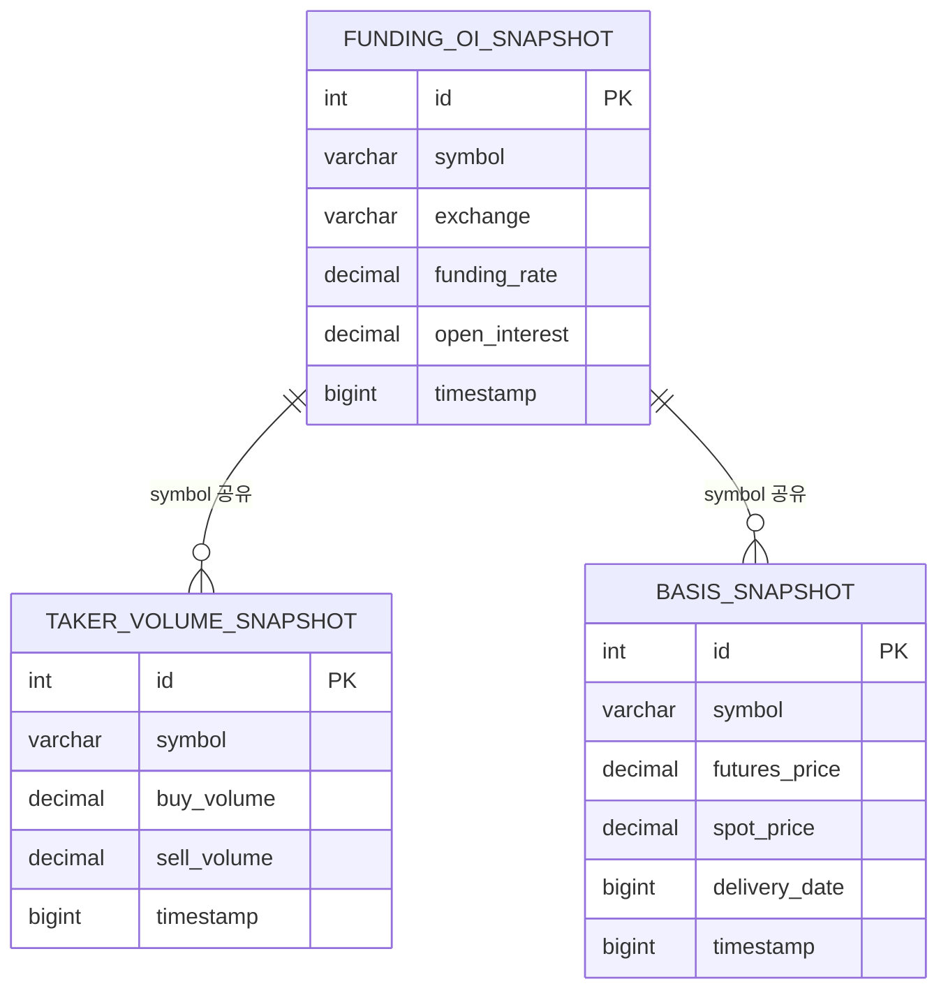

### 데이터 볼륨 예측

| 테이블 | 코인 수 | 거래소 수 | 행/시간 | 행/일 | 행/90일 |
|--------|---------|----------|---------|-------|---------|
| funding_oi_snapshot | ~200 | 6 | ~1,200 | ~28,800 | ~2,592,000 |
| taker_volume_snapshot | ~200 | 1 (Binance) | ~200 | ~4,800 | ~432,000 |
| basis_snapshot | 2 (BTC, ETH) | 1 | 2 | 48 | ~4,320 |
| **합계** | | | ~1,402 | ~33,648 | ~3,028,320 |

90일 기준 약 300만 행. 인덱스와 함께 약 200~300MB 정도로 OCI Free Tier MySQL에서 충분히 수용 가능.

---

## Business Process

### Process 1: Funding/OI 데이터 수집

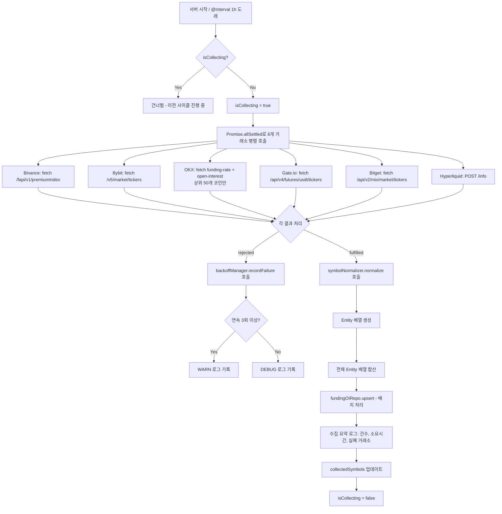

### Process 2: Taker Volume 수집 사이클

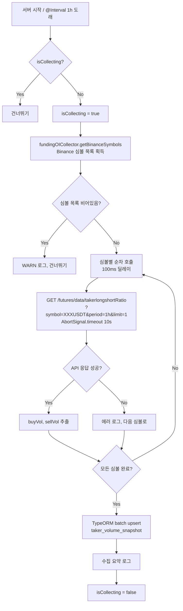

### Process 3: Basis 수집 사이클

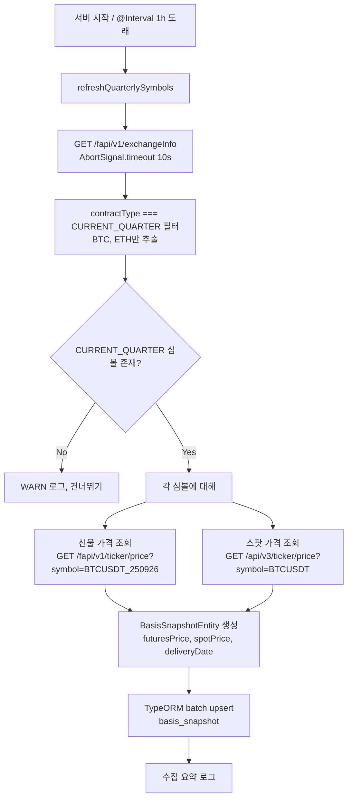

### Process 4: Funding Heatmap 집계 및 렌더링

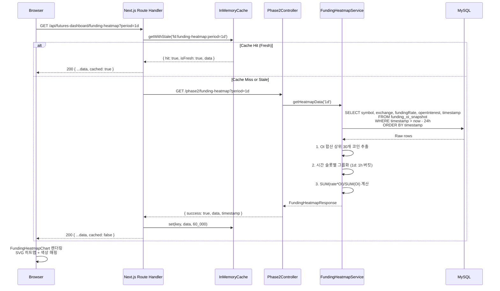

### Process 5: OI Changes 조회 및 렌더링

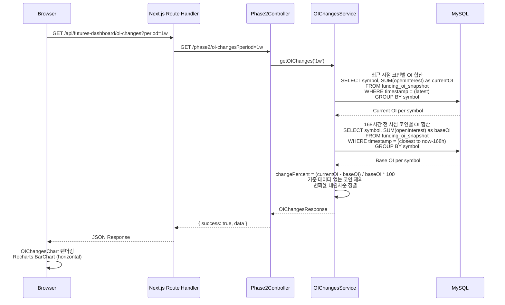

### Process 6: Normalized CVD 집계

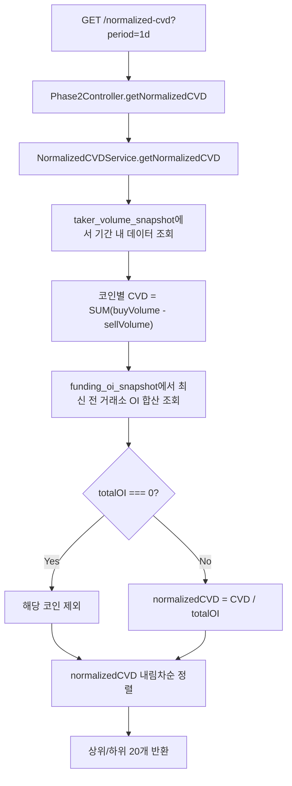

### Process 7: 3M Annualized Basis 조회 및 렌더링

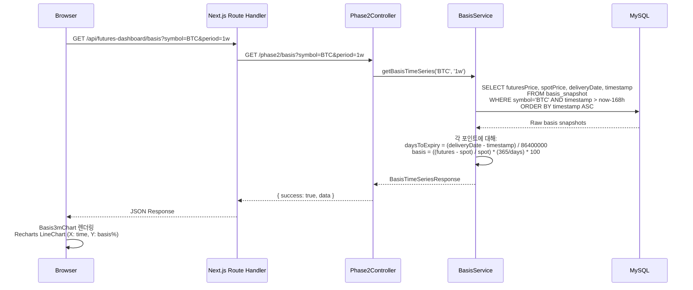

### Process 8: 데이터 정리 (Daily Cleanup)

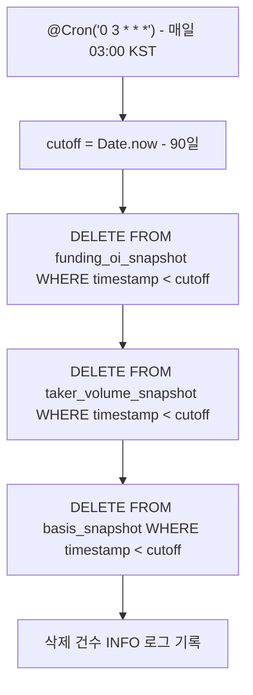

### Process 9: Route Handler 프록시 (공통 패턴)

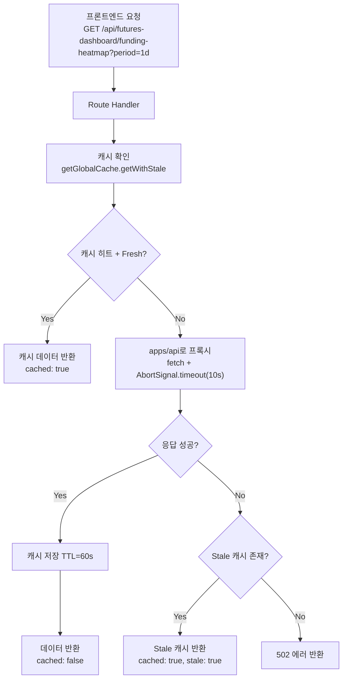

---

## Error Handling Strategy

### 거래소 API 에러 처리

| 에러 유형 | 처리 전략 |
|----------|----------|
| 응답 타임아웃 (10초) | `AbortSignal.timeout(10_000)` -> 해당 거래소 건너뛰고 나머지 계속 |
| HTTP 4xx (Rate Limit 등) | `backoffManager.recordFailure()` -> 지수 백오프 적용 |
| HTTP 5xx (서버 에러) | 동일하게 실패 기록 -> 다음 주기에 재시도 |
| 네트워크 에러 | Promise.allSettled에서 rejected 처리 -> 로그 기록 |
| 연속 3회 실패 | WARN 로그 + 60초 백오프 |
| 연속 5회 이상 실패 | WARN 로그 + 지수 백오프 (최대 3600초) |
| 파싱 에러 | try-catch로 개별 레코드 스킵, 에러 로그 |
| Rate Limit (429) | 지수 백오프: 60s -> 120s -> 240s -> ... -> max 3600s |

### DB 에러 처리

| 에러 유형 | 처리 전략 |
|----------|----------|
| 중복 인서트 | `ON DUPLICATE KEY UPDATE` 또는 TypeORM `upsert()` |
| 배치 인서트 실패 | 에러 로그 기록, 데이터 유실 허용 (다음 주기에 다시 수집) |
| 쿼리 타임아웃 (5초) | Controller에서 `Promise.race` + 타임아웃으로 제어 |
| 연결 풀 고갈 | TypeORM 기본 재시도 (retryAttempts: 3, retryDelay: 3s) |

### 프론트엔드 에러 처리

| 에러 유형 | 처리 전략 |
|----------|----------|
| Route Handler 502 | stale 캐시 fallback -> 없으면 에러 메시지 + 재시도 버튼 |
| 데이터 미수집 | "데이터 수집 중입니다. 잠시 후 다시 시도해주세요." 메시지 |
| 차트 렌더링 에러 | React ErrorBoundary -> fallback UI |
| 네트워크 에러 | TanStack Query retry (기본 3회) + 에러 배너 |

### 중복 수집 방지

```typescript
// isCollecting 플래그로 중복 실행 방지 (각 CollectorService에 적용)
private isCollecting = false;

@Interval('funding-oi-collect', 3_600_000)
async collect(): Promise<void> {
  if (this.isCollecting) {
    this.logger.debug('이전 수집 사이클이 진행 중 - 건너뜀');
    return;
  }
  this.isCollecting = true;
  try {
    await this.doCollect();
  } finally {
    this.isCollecting = false;
  }
}
```

---

## Testing Strategy

### Backend Unit Tests

| 테스트 대상 | 테스트 내용 |
|------------|-----------|
| SymbolNormalizer | 6개 거래소 심볼 포맷 -> 정규화된 심볼 변환 검증, 엣지 케이스 (빈 문자열, null, 미지원 포맷) |
| ExchangeBackoffManager | 실패 카운트 증가, 백오프 시간 계산, 리셋 동작, 5회 이상 지수 백오프 검증 |
| FundingHeatmapService | OI 가중 평균 계산 정확성, 상위 N개 필터링, 빈 데이터 처리 |
| OIChangesService | 변화율 계산 정확성, 기준시점 데이터 없는 케이스 |
| NormalizedCVDService | CVD 누적 계산, OI=0 제외, 정규화 정확성 |
| BasisService | Annualized Basis 공식 검증, daysToExpiry 계산, daysToExpiry <= 0 제외 |
| DataCleanupService | 90일 경과 데이터 삭제, 미경과 데이터 보존 |

### Backend Integration Tests

| 테스트 대상 | 테스트 내용 |
|------------|-----------|
| Phase2Controller | API 엔드포인트 응답 구조 검증, period 파라미터 기본값 |
| Collector Services | 모의(mock) API 응답 기반 수집 -> DB 저장 -> 조회 E2E, 에러 시 부분 수집 검증 |
| 중복 인서트 | 동일 (symbol, exchange, timestamp) 중복 저장 시 upsert 동작 검증 |

### Frontend Tests

| 테스트 대상 | 테스트 내용 |
|------------|-----------|
| Route Handlers | 캐시 히트/미스, stale fallback, 502 에러 케이스 |
| FundingHeatmapChart | 히트맵 렌더링, 호버 툴팁, 빈 데이터 처리 |
| OIChangesChart v2 | 양수/음수 색상 분기, 기간 전환 |
| NormalizedCVDChart | 바 차트 렌더링, 정렬 순서 |
| Basis3mChart v2 | BTC/ETH 선택 시 차트 렌더링, 미지원 코인 메시지 |

### 수동 검증 체크리스트

- [ ] 서버 시작 시 즉시 1회 수집 확인 (로그)
- [ ] 1시간 주기 수집 정상 동작 확인
- [ ] 거래소 1개 다운 시 나머지 정상 수집 확인
- [ ] DB에 데이터 적재 확인 (MySQL 직접 쿼리)
- [ ] 집계 API 응답 구조 확인 (4개 엔드포인트)
- [ ] 프론트엔드 차트 렌더링 확인 (1d/1w/1m 기간별)
- [ ] 히트맵 툴팁에서 거래소별 상세 표시 확인
- [ ] OI Changes 차트에서 양수/음수 색상 분기 확인
- [ ] 3M Basis 차트가 BTC/ETH에서만 동작 확인
- [ ] 90일 데이터 정리 Cron 동작 확인

---

## Design Decisions & Rationale

### 1. 단일 Phase2Module vs 기능별 분리 모듈

**결정:** 단일 Phase2Module에 모든 수집/집계 서비스를 포함한다.

**이유:**
- 3개 Collector가 공통 유틸리티(SymbolNormalizer, BackoffManager)를 공유한다.
- TakerVolumeCollector가 FundingOICollector의 심볼 목록을 참조한다.
- NormalizedCVDService가 FundingOI + TakerVolume 두 테이블을 모두 조회한다.
- 분리 시 cross-module 의존성이 복잡해지며, 현 규모(12개 클래스)에서는 단일 모듈이 적정하다.
- 추후 기능이 더 커지면 그때 분리해도 늦지 않음.

### 2. OKX 개별 코인 호출 문제

**결정:** OKX는 OI 상위 N개(50개) 코인만 수집한다.

**이유:**
- OKX funding-rate, open-interest API는 instId 파라미터가 필수로 벌크 조회가 불가하다.
- 200개 코인 개별 호출 시 Rate Limit (20 req/2s) 초과 위험이 있다.
- 나머지 5개 거래소가 벌크 조회이므로 OKX는 주요 코인만 수집해도 OI 가중 평균에 큰 영향이 없다.

### 3. Taker Volume 수집원을 Binance로 한정

**결정:** Taker Buy/Sell Volume은 Binance만 수집한다.

**이유:**
- `takerlongshortRatio` API를 공개적으로 제공하는 거래소가 Binance뿐이다.
- Binance가 선물 시장의 ~50% 이상 거래량을 차지하므로 대표성이 충분하다.
- 추후 다른 거래소 추가 시 Entity 구조에 `exchange` 컬럼을 추가하여 확장 가능하다.

### 4. timestamp를 1시간 단위로 라운드

**결정:** 수집 시 timestamp를 시간 단위로 라운드(`Math.floor(Date.now() / 3600000) * 3600000`)한다.

**이유:**
- 집계 쿼리에서 시간 슬롯 기반 GROUP BY가 정확하게 동작한다.
- UNIQUE 제약 조건 `(symbol, exchange, timestamp)`으로 중복 인서트를 자연스럽게 방지한다.
- 약간의 수집 시간 오차(분 단위)가 1시간 슬롯으로 정규화되어 데이터 일관성이 보장된다.

### 5. SVG 기반 커스텀 히트맵 vs 외부 라이브러리

**결정:** Recharts 없이 SVG + CSS로 커스텀 히트맵을 구현한다.

**이유:**
- Recharts에 네이티브 히트맵 컴포넌트가 없다.
- nivo나 echarts 등 추가 라이브러리를 도입하면 번들 크기가 증가한다.
- SVG rect + CSS 변수 기반 색상 매핑으로 기존 디자인 시스템과 일관성을 유지할 수 있다.
- 코인 30개 x 시간 24개 = 720셀 수준으로 성능 문제가 없다.

### 6. upsert 전략

**결정:** TypeORM의 `upsert()` (또는 `INSERT ... ON DUPLICATE KEY UPDATE`)를 사용한다.

**이유:**
- UNIQUE 제약 조건 `(symbol, exchange, timestamp)`을 활용하여 중복 시 갱신한다.
- SELECT 후 조건부 INSERT보다 단일 쿼리로 효율적이다.
- `@Interval` 타이밍 오차로 동일 시간대에 두 번 수집될 수 있는 edge case를 처리한다.

### 7. 집계는 API 요청 시 실시간 계산

**결정:** API 요청 시 실시간 SQL 집계 (사전 집계 테이블 생성하지 않음).

**이유:**
- 90일 기준 최대 300만 rows 수준으로 인덱스 활용 시 5초 이내 집계 가능.
- 사전 집계 시 추가 테이블과 집계 Cron이 필요하여 복잡도 증가.
- 인덱스(symbol + timestamp)가 정확히 이 패턴에 최적화됨.
- 추후 성능 이슈 발생 시 materialized view 또는 집계 테이블로 전환 가능.

---

## 파일 구조

```
apps/api/src/modules/phase2/
├── entities/
│   ├── funding-oi-snapshot.entity.ts
│   ├── taker-volume-snapshot.entity.ts
│   └── basis-snapshot.entity.ts
├── funding-oi-collector.service.ts
├── taker-volume-collector.service.ts
├── basis-collector.service.ts
├── symbol-normalizer.ts
├── exchange-backoff-manager.ts
├── funding-heatmap.service.ts
├── oi-changes.service.ts
├── normalized-cvd.service.ts
├── basis.service.ts
├── phase2.controller.ts
├── data-cleanup.service.ts
└── phase2.module.ts

apps/web/app/api/futures-dashboard/
├── funding-heatmap/
│   └── route.ts
├── oi-changes/
│   └── route.ts
├── normalized-cvd/
│   └── route.ts
└── basis/
    └── route.ts

apps/web/app/(dashboard)/market-screener/components/charts/
├── funding-heatmap-chart.tsx          (신규)
├── oi-changes-chart.tsx               (교체)
└── normalized-cvd-chart.tsx           (신규)

apps/web/app/(dashboard)/futures-dashboard/components/charts/
└── basis3m-chart.tsx                  (교체)

apps/web/hooks/
├── useFundingHeatmap.ts               (신규)
├── useOIChanges.ts                    (신규)
├── useNormalizedCVD.ts                (신규)
└── useBasis.ts                        (신규)
```

### 수정이 필요한 기존 파일

| 파일 | 변경 내용 |
|------|----------|
| `apps/api/src/config/database.config.ts` | ENTITIES 배열에 3개 Entity 추가 |
| `apps/api/src/app.module.ts` | imports에 Phase2Module 추가 |
| `apps/web/app/(dashboard)/market-screener/page.tsx` | Phase 2 플레이스홀더를 실제 차트로 교체, 기간 선택 연동 |
| `apps/web/app/(dashboard)/futures-dashboard/components/chart-grid.tsx` | Basis3mChart에 실제 데이터 연결 |
