# Design Document: Phase 2 - Server-Side Data Collection

## Overview

BitScope Phase 2는 기존 클라이언트 사이드 실시간 조회 방식을 보완하여, **서버(apps/api)에서 6개 거래소의 선물 데이터를 1시간 주기로 수집 -> MySQL DB 영속화 -> 집계 API 제공 -> Next.js Route Handler 프록시 -> 프론트엔드 차트 시각화**의 풀스택 파이프라인을 구현한다.

### 설계 목표

1. **기존 LiquidationModule 패턴 준수**: Module / CollectorService / Service(집계) / Controller 4계층 분리
2. **기존 FuturesCollectorService의 @Interval 패턴 확장**: 인메모리 캐시 -> DB 영속화
3. **6개 거래소 벌크 API 활용**: 심볼별 개별 호출 최소화, Promise.allSettled로 병렬 처리
4. **3개 DB 테이블**: funding_oi_snapshot, taker_volume_snapshot, basis_snapshot
5. **4개 집계 API**: funding-heatmap, oi-changes, normalized-cvd, basis
6. **4개 프론트엔드 차트**: Funding APR Heatmap, OI Changes(%), OI-Normalized CVD, 3M Annualized Basis

### 범위

| 영역 | 구현 대상 |
|------|----------|
| Backend 수집 | FundingOICollectorService, TakerVolumeCollectorService, BasisCollectorService |
| Backend 집계 | Phase2AggregationService (4개 집계 메서드) |
| Backend API | Phase2Controller (4개 엔드포인트) |
| DB Entity | FundingOiSnapshotEntity, TakerVolumeSnapshotEntity, BasisSnapshotEntity |
| Route Handler | 4개 프록시 라우트 (funding-heatmap, oi-changes, normalized-cvd, basis) |
| Frontend 차트 | FundingHeatmapChart, OIChangesChart(교체), NormalizedCVDChart, Basis3mChart(교체) |

---

## Architecture Design

### System Architecture Diagram

```mermaid
graph TB
    subgraph "apps/api (NestJS Backend)"
        direction TB
        A1[Phase2Module]
        A2[FundingOICollectorService<br/>@Interval 1h]
        A3[TakerVolumeCollectorService<br/>@Interval 1h]
        A4[BasisCollectorService<br/>@Interval 1h]
        A5[Phase2AggregationService]
        A6[Phase2Controller]
        A7[DataRetentionService<br/>@Cron daily]
        
        A1 --> A2
        A1 --> A3
        A1 --> A4
        A1 --> A5
        A1 --> A6
        A1 --> A7
    end

    subgraph "External Exchange APIs"
        E1[Binance /fapi/v1/premiumIndex<br/>/fapi/v1/ticker/24hr<br/>/fapi/v1/exchangeInfo]
        E2[Bybit /v5/market/tickers]
        E3[OKX /api/v5/public/funding-rate<br/>/api/v5/public/open-interest]
        E4[Gate.io /api/v4/futures/usdt/tickers]
        E5[Bitget /api/v2/mix/market/tickers]
        E6[Hyperliquid POST /info]
    end

    subgraph "MySQL DB"
        D1[funding_oi_snapshot]
        D2[taker_volume_snapshot]
        D3[basis_snapshot]
    end

    subgraph "apps/web (Next.js Frontend)"
        W1[Route Handler Proxy<br/>/api/futures-dashboard/*]
        W2[Market Screener Page]
        W3[Futures Dashboard Page]
        
        W2 --> W21[FundingHeatmapChart]
        W2 --> W22[OIChangesChart]
        W2 --> W23[NormalizedCVDChart]
        W3 --> W31[Basis3mChart]
    end

    A2 -->|Promise.allSettled| E1
    A2 -->|Promise.allSettled| E2
    A2 -->|Promise.allSettled| E3
    A2 -->|Promise.allSettled| E4
    A2 -->|Promise.allSettled| E5
    A2 -->|Promise.allSettled| E6
    A3 --> E1
    A4 --> E1

    A2 -->|batch insert| D1
    A3 -->|batch insert| D2
    A4 -->|batch insert| D3

    A5 -->|aggregation query| D1
    A5 -->|aggregation query| D2
    A5 -->|aggregation query| D3

    A6 --> A5
    W1 -->|HTTP proxy| A6

    W21 --> W1
    W22 --> W1
    W23 --> W1
    W31 --> W1
```

### Data Flow Diagram

```mermaid
graph LR
    subgraph "1. 수집 (1시간 주기)"
        A[Exchange APIs<br/>6개 거래소] -->|벌크 응답| B[CollectorServices]
        B -->|심볼 정규화<br/>BTCUSDT → BTC<br/>BTC-USDT-SWAP → BTC| C[Normalized Data]
        C -->|TypeORM batch insert| D[(MySQL)]
    end

    subgraph "2. 집계 (API 요청 시)"
        D -->|SQL GROUP BY<br/>시간 버킷 집계| E[AggregationService]
        E -->|JSON 응답| F[Phase2Controller]
    end

    subgraph "3. 프록시 (Next.js)"
        F -->|HTTP| G[Route Handler]
        G -->|1분 TTL 캐시| H[Response + Cache]
    end

    subgraph "4. 시각화 (React)"
        H -->|TanStack Query<br/>staleTime 60s| I[Chart Components<br/>Recharts]
    end
```

---

## Component Design

### Component 1: Phase2Module (NestJS Module)

- **책임**: Phase 2의 모든 서비스, 컨트롤러, 엔티티를 NestJS IoC 컨테이너에 등록
- **인터페이스**:
  ```typescript
  @Module({
    imports: [
      TypeOrmModule.forFeature([
        FundingOiSnapshotEntity,
        TakerVolumeSnapshotEntity,
        BasisSnapshotEntity,
      ]),
    ],
    controllers: [Phase2Controller],
    providers: [
      FundingOICollectorService,
      TakerVolumeCollectorService,
      BasisCollectorService,
      Phase2AggregationService,
      DataRetentionService,
    ],
    exports: [Phase2AggregationService],
  })
  export class Phase2Module {}
  ```
- **의존성**: TypeOrmModule, ScheduleModule (AppModule에서 이미 import됨)

### Component 2: FundingOICollectorService

- **책임**: 6개 거래소에서 전 코인의 Funding Rate + OI를 1시간 주기로 수집하여 `funding_oi_snapshot` 테이블에 저장
- **인터페이스**:
  ```typescript
  @Injectable()
  class FundingOICollectorService implements OnModuleInit {
    // 서버 시작 시 즉시 1회 수집
    async onModuleInit(): Promise<void>;
    
    // 1시간 주기 수집 (@Interval)
    @Interval('funding-oi-collect', 3_600_000)
    async collect(): Promise<void>;
    
    // 각 거래소별 수집 메서드 (private)
    private async fetchBinance(): Promise<RawFundingOI[]>;
    private async fetchBybit(): Promise<RawFundingOI[]>;
    private async fetchOkx(): Promise<RawFundingOI[]>;
    private async fetchGate(): Promise<RawFundingOI[]>;
    private async fetchBitget(): Promise<RawFundingOI[]>;
    private async fetchHyperliquid(): Promise<RawFundingOI[]>;
    
    // 심볼 정규화
    private normalizeSymbol(raw: string, exchange: string): string | null;
    
    // 수집된 심볼 목록 반환 (TakerVolumeCollectorService에서 재사용)
    getLastCollectedSymbols(): string[];
  }
  ```
- **의존성**: `Repository<FundingOiSnapshotEntity>`, Logger

### Component 3: TakerVolumeCollectorService

- **책임**: Binance의 taker buy/sell volume을 1시간 주기로 수집하여 `taker_volume_snapshot` 테이블에 저장
- **인터페이스**:
  ```typescript
  @Injectable()
  class TakerVolumeCollectorService implements OnModuleInit {
    async onModuleInit(): Promise<void>;
    
    @Interval('taker-volume-collect', 3_600_000)
    async collect(): Promise<void>;
    
    // Binance takerlongshortRatio API (심볼별 개별 호출, 딜레이 적용)
    private async fetchTakerVolume(symbol: string): Promise<RawTakerVolume | null>;
  }
  ```
- **의존성**: `Repository<TakerVolumeSnapshotEntity>`, `FundingOICollectorService` (심볼 목록 공유), Logger

### Component 4: BasisCollectorService

- **책임**: Binance 분기 선물(CURRENT_QUARTER)의 가격과 스팟 가격을 1시간 주기로 수집
- **인터페이스**:
  ```typescript
  @Injectable()
  class BasisCollectorService implements OnModuleInit {
    async onModuleInit(): Promise<void>;
    
    @Interval('basis-collect', 3_600_000)
    async collect(): Promise<void>;
    
    // exchangeInfo에서 CURRENT_QUARTER 심볼 동적 탐색
    private async discoverQuarterlySymbols(): Promise<QuarterlySymbolInfo[]>;
    
    // 선물 가격 + 스팟 가격 수집
    private async fetchBasisData(info: QuarterlySymbolInfo): Promise<RawBasis | null>;
  }
  ```
- **의존성**: `Repository<BasisSnapshotEntity>`, Logger

### Component 5: Phase2AggregationService

- **책임**: DB에 저장된 스냅샷 데이터를 기간별로 집계하여 차트용 데이터 생성
- **인터페이스**:
  ```typescript
  @Injectable()
  class Phase2AggregationService {
    // Funding APR Heatmap: 코인별 시간별 OI 가중평균 펀딩률
    async getFundingHeatmap(period: string): Promise<FundingHeatmapData>;
    
    // OI Changes: 코인별 OI 변화율(%)
    async getOIChanges(period: string): Promise<OIChangeData[]>;
    
    // OI-Normalized CVD: 코인별 정규화된 CVD
    async getNormalizedCVD(period: string): Promise<NormalizedCVDData[]>;
    
    // 3M Annualized Basis: 시계열 Basis(%)
    async getBasis(symbol: string, period: string): Promise<BasisTimeseriesData[]>;
  }
  ```
- **의존성**: `Repository<FundingOiSnapshotEntity>`, `Repository<TakerVolumeSnapshotEntity>`, `Repository<BasisSnapshotEntity>`

### Component 6: Phase2Controller

- **책임**: 집계 API의 REST 엔드포인트 제공
- **인터페이스**:
  ```typescript
  @Controller()
  class Phase2Controller {
    @Get('funding-heatmap')
    async getFundingHeatmap(@Query('period') period?: string): Promise<ApiResponse<FundingHeatmapData>>;
    
    @Get('oi-changes')
    async getOIChanges(@Query('period') period?: string): Promise<ApiResponse<OIChangeData[]>>;
    
    @Get('normalized-cvd')
    async getNormalizedCVD(@Query('period') period?: string): Promise<ApiResponse<NormalizedCVDData[]>>;
    
    @Get('basis')
    async getBasis(@Query('symbol') symbol?: string, @Query('period') period?: string): Promise<ApiResponse<BasisTimeseriesData[]>>;
  }
  ```
- **의존성**: `Phase2AggregationService`

### Component 7: DataRetentionService

- **책임**: 매일 1회 90일 이상 경과한 레코드 자동 삭제
- **인터페이스**:
  ```typescript
  @Injectable()
  class DataRetentionService {
    @Cron('0 3 * * *') // 매일 새벽 3시
    async cleanupOldData(): Promise<void>;
  }
  ```
- **의존성**: 3개 Repository

### Component 8: Route Handler Proxies (Next.js)

- **책임**: 프론트엔드와 백엔드 사이의 CORS 프록시, 1분 TTL 캐시
- **인터페이스**:
  ```
  GET /api/futures-dashboard/funding-heatmap?period=1d
  GET /api/futures-dashboard/oi-changes?period=1d
  GET /api/futures-dashboard/normalized-cvd?period=1d
  GET /api/futures-dashboard/basis?symbol=BTC&period=1d
  ```
- **의존성**: 기존 cache 유틸리티 (`buildCacheKey`, `getGlobalCache`)

### Component 9: Frontend Chart Components

- **9a. FundingHeatmapChart**: SVG 기반 커스텀 히트맵 (X=시간, Y=코인, 색상=펀딩률)
- **9b. OIChangesChart (교체)**: 기존 절대 OI 차트를 OI 변화율(%) 수평 바 차트로 교체
- **9c. NormalizedCVDChart**: OI 정규화 CVD 수평 바 차트
- **9d. Basis3mChart (교체)**: 기존 플레이스홀더를 Recharts LineChart로 교체

---

## Data Model

### Core Data Structure Definitions

#### DB Entity: FundingOiSnapshotEntity

```typescript
@Entity('funding_oi_snapshot')
@Index('idx_funding_oi_symbol_time', ['symbol', 'timestamp'])
@Index('idx_funding_oi_exchange_time', ['exchange', 'timestamp'])
export class FundingOiSnapshotEntity {
  @PrimaryGeneratedColumn('increment')
  id!: number;

  /** 정규화된 코인 심볼 (예: "BTC", "ETH") */
  @Column({ type: 'varchar', length: 20 })
  symbol!: string;

  /** 거래소 ID (binance, bybit, okx, gate, bitget, hyperliquid) */
  @Column({ type: 'varchar', length: 20 })
  exchange!: string;

  /** 현재 펀딩 비율 (소수, 예: 0.0001 = 0.01%) */
  @Column({ name: 'funding_rate', type: 'decimal', precision: 20, scale: 10, default: 0 })
  fundingRate!: number;

  /** 미결제약정 (USD 환산) */
  @Column({ name: 'open_interest', type: 'decimal', precision: 20, scale: 4, default: 0 })
  openInterest!: number;

  /** 수집 시각 (밀리초 타임스탬프) */
  @Column({ type: 'bigint' })
  timestamp!: number;
}
```

#### DB Entity: TakerVolumeSnapshotEntity

```typescript
@Entity('taker_volume_snapshot')
@Index('idx_taker_vol_symbol_time', ['symbol', 'timestamp'])
export class TakerVolumeSnapshotEntity {
  @PrimaryGeneratedColumn('increment')
  id!: number;

  /** 정규화된 코인 심볼 */
  @Column({ type: 'varchar', length: 20 })
  symbol!: string;

  /** Taker 매수 거래량 (USD) */
  @Column({ name: 'buy_volume', type: 'decimal', precision: 20, scale: 4, default: 0 })
  buyVolume!: number;

  /** Taker 매도 거래량 (USD) */
  @Column({ name: 'sell_volume', type: 'decimal', precision: 20, scale: 4, default: 0 })
  sellVolume!: number;

  /** 수집 시각 (밀리초 타임스탬프) */
  @Column({ type: 'bigint' })
  timestamp!: number;
}
```

#### DB Entity: BasisSnapshotEntity

```typescript
@Entity('basis_snapshot')
@Index('idx_basis_symbol_time', ['symbol', 'timestamp'])
export class BasisSnapshotEntity {
  @PrimaryGeneratedColumn('increment')
  id!: number;

  /** 기초 자산 심볼 (BTC, ETH) */
  @Column({ type: 'varchar', length: 20 })
  symbol!: string;

  /** 분기 선물 가격 (USDT) */
  @Column({ name: 'futures_price', type: 'decimal', precision: 20, scale: 8, default: 0 })
  futuresPrice!: number;

  /** 현물 가격 (USDT) */
  @Column({ name: 'spot_price', type: 'decimal', precision: 20, scale: 8, default: 0 })
  spotPrice!: number;

  /** 만기일 (밀리초 타임스탬프) */
  @Column({ name: 'delivery_date', type: 'bigint' })
  deliveryDate!: number;

  /** 수집 시각 (밀리초 타임스탬프) */
  @Column({ type: 'bigint' })
  timestamp!: number;
}
```

#### API Response Types

```typescript
/** 공통 응답 래퍼 (기존 LiquidationController 패턴) */
interface ApiResponse<T> {
  success: boolean;
  data?: T;
  error?: { message: string };
  timestamp: number;
  dataRange?: { from: number; to: number };
}

/** Funding Heatmap 응답 */
interface FundingHeatmapData {
  symbols: string[];           // Y축 (코인 목록, OI 상위 N개)
  timestamps: number[];        // X축 (시간 버킷)
  matrix: number[][];          // [symbolIdx][timeIdx] = OI 가중평균 펀딩률
  details: Record<string, Record<number, ExchangeFunding[]>>;  // 거래소별 상세
}

interface ExchangeFunding {
  exchange: string;
  fundingRate: number;
  openInterest: number;
}

/** OI Changes 응답 */
interface OIChangeData {
  symbol: string;
  changePercent: number;       // OI 변화율(%)
  currentOI: number;           // 현재 전 거래소 OI 합산 (USD)
  baseOI: number;              // 기준시점 전 거래소 OI 합산 (USD)
}

/** Normalized CVD 응답 */
interface NormalizedCVDData {
  symbol: string;
  normalizedCVD: number;       // CVD / 전 거래소 OI 합산
  rawCVD: number;              // 원시 CVD (USD)
  totalOI: number;             // 전 거래소 OI 합산 (USD)
}

/** Basis 시계열 응답 */
interface BasisTimeseriesData {
  timestamp: number;
  basisPercent: number;        // Annualized Basis(%)
  futuresPrice: number;
  spotPrice: number;
  daysToExpiry: number;
}

/** 수집 중간 타입 */
interface RawFundingOI {
  symbol: string;
  exchange: string;
  fundingRate: number;
  openInterest: number;
}

interface RawTakerVolume {
  symbol: string;
  buyVolume: number;
  sellVolume: number;
}

interface QuarterlySymbolInfo {
  baseAsset: string;           // BTC, ETH
  futuresSymbol: string;       // BTCUSDT_250926
  deliveryDate: number;        // 밀리초 타임스탬프
}

interface RawBasis {
  symbol: string;
  futuresPrice: number;
  spotPrice: number;
  deliveryDate: number;
}
```

### Data Model Diagram

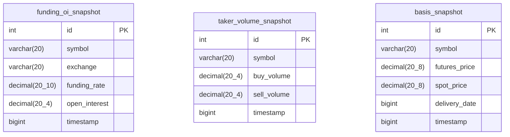

### 예상 데이터 규모

| 테이블 | 시간당 레코드 | 일간 레코드 | 90일 보존 |
|--------|-------------|-----------|----------|
| funding_oi_snapshot | ~600 (100코인 x 6거래소) | ~14,400 | ~1,296,000 |
| taker_volume_snapshot | ~100 (Binance 100코인) | ~2,400 | ~216,000 |
| basis_snapshot | ~2 (BTC, ETH) | ~48 | ~4,320 |

---

## Business Process

### Process 1: Funding & OI 수집 사이클

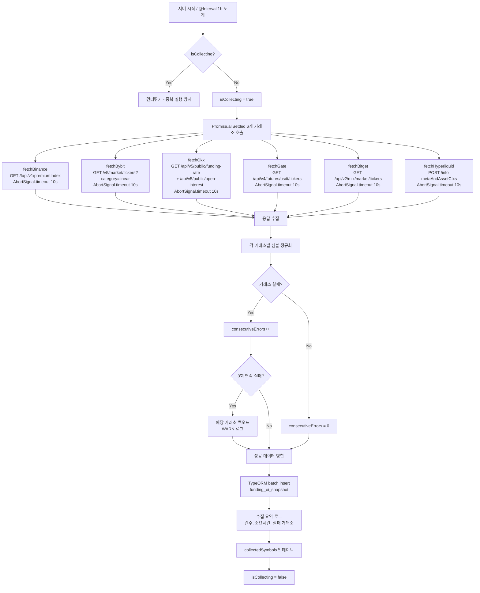

### Process 2: Taker Volume 수집 사이클

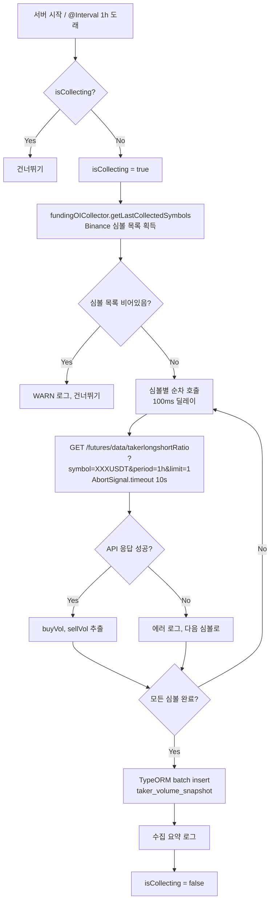

### Process 3: Basis 수집 사이클

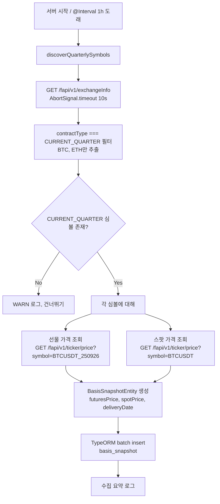

### Process 4: Funding Heatmap 집계

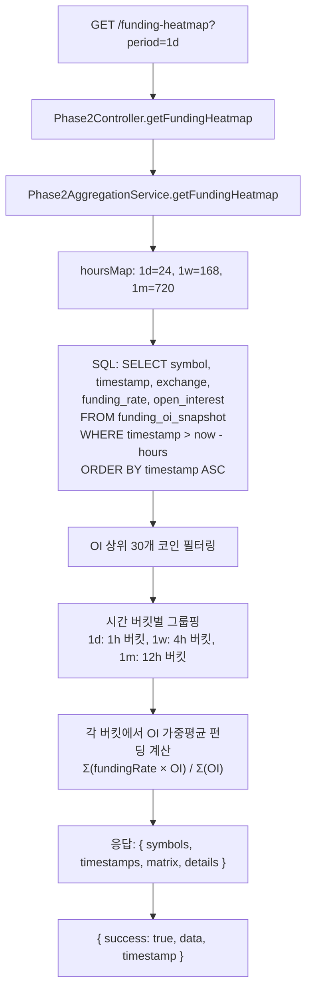

### Process 5: OI Changes 집계

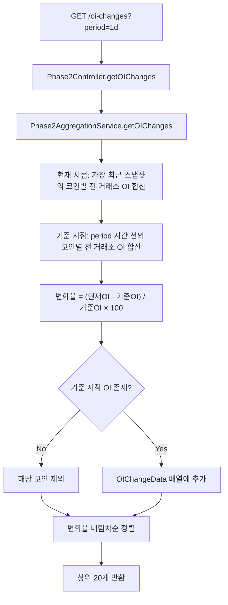

### Process 6: Normalized CVD 집계

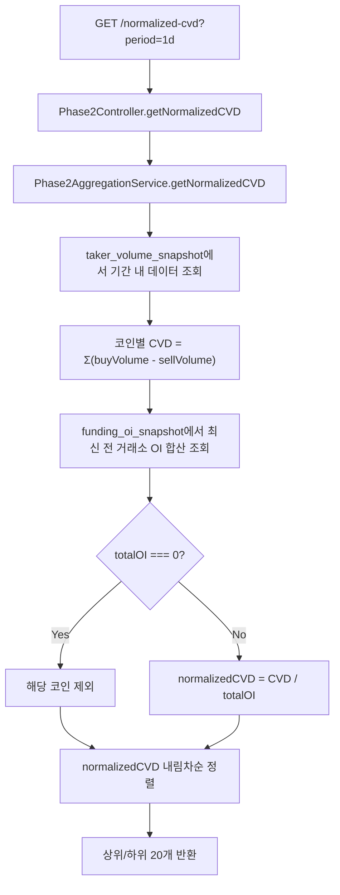

### Process 7: 3M Annualized Basis 집계

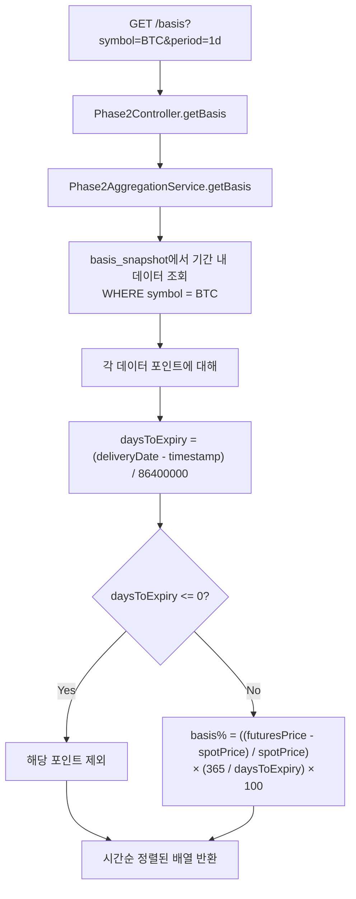

### Process 8: 데이터 보존 관리

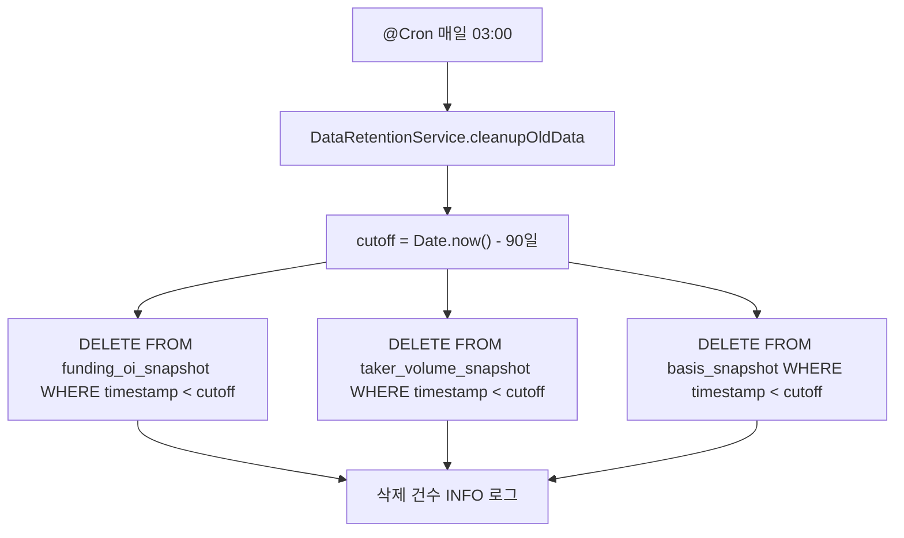

### Process 9: Route Handler 프록시 (공통 패턴)

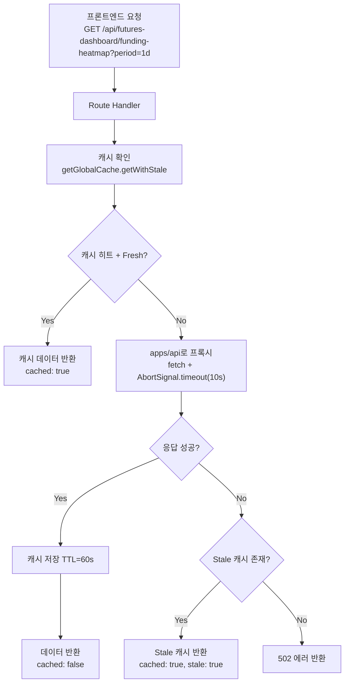

---

## Error Handling Strategy

### 거래소 API 에러 처리

| 상황 | 처리 방식 |
|------|----------|
| 개별 거래소 타임아웃 (10s) | `AbortSignal.timeout(10_000)`, 해당 거래소만 건너뛰기 |
| 거래소 HTTP 에러 (4xx/5xx) | 해당 거래소 건너뛰고 나머지 계속 수집 |
| 연속 3회 실패 | 해당 거래소 백오프 (다음 사이클에서 건너뛰기) |
| 연속 5회 이상 실패 | WARN 로그 기록, 백오프 유지 |
| 파싱 에러 | try-catch로 개별 레코드 스킵, 에러 로그 |
| Rate Limit (429) | 지수 백오프: 1h -> 2h -> 4h |

### 거래소별 에러 카운터 구조

```typescript
interface ExchangeErrorState {
  consecutiveErrors: number;
  lastErrorTime: number;
  backoffUntil: number;        // 이 시각까지 건너뛰기
}

// 거래소별 독립적 에러 상태 관리
private exchangeErrors: Map<string, ExchangeErrorState> = new Map();

private shouldSkipExchange(exchange: string): boolean {
  const state = this.exchangeErrors.get(exchange);
  if (!state) return false;
  if (state.consecutiveErrors >= 3 && Date.now() < state.backoffUntil) return true;
  return false;
}

private recordError(exchange: string): void {
  const state = this.exchangeErrors.get(exchange) ?? { consecutiveErrors: 0, lastErrorTime: 0, backoffUntil: 0 };
  state.consecutiveErrors++;
  state.lastErrorTime = Date.now();
  // 지수 백오프: 1h * 2^(errors-3), 최대 4h
  if (state.consecutiveErrors >= 3) {
    const backoffHours = Math.min(Math.pow(2, state.consecutiveErrors - 3), 4);
    state.backoffUntil = Date.now() + backoffHours * 3_600_000;
    this.logger.warn(`${exchange} 연속 ${state.consecutiveErrors}회 실패, ${backoffHours}h 백오프`);
  }
  this.exchangeErrors.set(exchange, state);
}

private recordSuccess(exchange: string): void {
  this.exchangeErrors.delete(exchange);
}
```

### DB 에러 처리

| 상황 | 처리 방식 |
|------|----------|
| batch insert 실패 | 에러 로그 후 다음 사이클에서 재수집 (데이터 유실 허용) |
| 중복 insert | `ON DUPLICATE KEY UPDATE` 또는 수집 전 최신 타임스탬프 확인으로 방지 |
| 집계 쿼리 타임아웃 (5s) | `queryRunner.query` with timeout, 타임아웃 에러 반환 |
| 커넥션 풀 소진 | TypeORM의 retryAttempts(3) + retryDelay(3s) 기존 설정 활용 |

### 프론트엔드 에러 처리

| 상황 | 처리 방식 |
|------|----------|
| Route Handler 타임아웃 | Stale 캐시 반환, 캐시 없으면 502 |
| 데이터 미수집 | "데이터 수집 중입니다" 메시지 표시 |
| TanStack Query 에러 | 에러 메시지 + 수동 재시도 버튼 |
| 차트 렌더링 에러 | React ErrorBoundary로 개별 차트 격리 |

### 중복 실행 방지

```typescript
// 각 CollectorService에 적용
private isCollecting = false;

async collect(): Promise<void> {
  if (this.isCollecting) {
    this.logger.debug('이전 수집 사이클 진행 중, 건너뛰기');
    return;
  }
  this.isCollecting = true;
  try {
    // ... 수집 로직
  } finally {
    this.isCollecting = false;
  }
}
```

---

## 심볼 정규화 전략

6개 거래소의 심볼 포맷이 다르므로 통일된 기본 심볼로 정규화한다.

| 거래소 | 원본 포맷 | 정규화 로직 |
|--------|----------|-----------|
| Binance | `BTCUSDT` | `/USDT$/` 제거 -> `BTC` |
| Bybit | `BTCUSDT` | `/USDT$/` 제거 -> `BTC` |
| OKX | `BTC-USDT-SWAP` | `-` split, `[0]` -> `BTC` |
| Gate.io | `BTC_USDT` | `_` split, `[0]` -> `BTC` |
| Bitget | `BTCUSDT` | `/USDT$/` 제거 -> `BTC` |
| Hyperliquid | `BTC` | 그대로 사용 |

```typescript
function normalizeSymbol(raw: string, exchange: string): string | null {
  if (!raw) return null;
  switch (exchange) {
    case 'binance':
    case 'bybit':
    case 'bitget':
      return raw.endsWith('USDT') ? raw.replace(/USDT$/, '') : null;
    case 'okx':
      return raw.split('-')[0] || null;
    case 'gate':
      return raw.split('_')[0] || null;
    case 'hyperliquid':
      return raw || null;
    default:
      return null;
  }
}
```

---

## Testing Strategy

### Unit Tests

| 대상 | 테스트 항목 |
|------|-----------|
| normalizeSymbol | 각 거래소별 심볼 정규화, 엣지 케이스 (빈 문자열, null, 미지원 포맷) |
| ExchangeErrorState | 연속 에러 카운팅, 백오프 시간 계산, 성공 시 리셋 |
| 집계 계산 로직 | OI 가중평균, OI 변화율, CVD, Normalized CVD, Annualized Basis 공식 |

### Integration Tests

| 대상 | 테스트 항목 |
|------|-----------|
| CollectorService | Mock API 응답으로 batch insert 검증, 에러 시 부분 수집 검증 |
| AggregationService | 테스트 데이터 insert 후 집계 결과 정확성 검증 |
| Controller | API 엔드포인트 응답 구조 및 쿼리 파라미터 처리 검증 |
| DataRetentionService | 90일 이전 데이터 삭제 검증 |

### E2E Tests

| 대상 | 테스트 항목 |
|------|-----------|
| Route Handler | 백엔드 프록시 정상 동작, 캐시 히트/미스, Stale 폴백 |
| 차트 컴포넌트 | 데이터 로딩 -> 차트 렌더링, 기간 전환, 툴팁 표시 |

### 수동 검증 체크리스트

- [ ] 서버 시작 시 즉시 1회 수집 확인 (로그)
- [ ] 1시간 주기 수집 정상 동작 확인
- [ ] 거래소 1개 다운 시 나머지 정상 수집 확인
- [ ] DB에 데이터 적재 확인 (MySQL 직접 쿼리)
- [ ] 집계 API 응답 구조 확인
- [ ] 프론트엔드 차트 렌더링 확인 (1d/1w/1m)
- [ ] 히트맵 툴팁에서 거래소별 상세 표시 확인
- [ ] 3M Basis 차트가 BTC/ETH에서만 동작 확인
- [ ] 90일 데이터 정리 Cron 동작 확인

---

## 주요 설계 결정 및 근거

### 결정 1: 단일 Phase2Module vs 3개 분리 모듈

**결정**: 단일 Phase2Module에 모든 수집기/집계/컨트롤러를 포함

**근거**: 
- 3개 수집기가 심볼 목록을 공유하므로 모듈 내 의존성이 강함
- NormalizedCVD 집계가 funding_oi_snapshot과 taker_volume_snapshot 두 테이블을 동시에 조회
- 모듈 분리 시 cross-module 의존성이 발생하여 순환 참조 위험
- 추후 기능이 더 커지면 그때 분리해도 늦지 않음

### 결정 2: 히트맵 구현 - Recharts vs 커스텀 SVG

**결정**: 커스텀 SVG/Canvas 기반 히트맵 (`<rect>` 요소 직접 그리기)

**근거**:
- Recharts에는 네이티브 히트맵 차트 타입이 없음
- ScatterChart로 흉내 내면 퍼포먼스와 스타일링 제약이 큼
- 30코인 x 24시간 = 720셀 정도는 SVG `<rect>`로 충분히 처리 가능
- 기존 프로젝트에 추가 라이브러리(nivo 등) 도입을 피함

### 결정 3: Taker Volume은 Binance만 수집

**결정**: Binance의 `takerlongshortRatio` API만 사용

**근거**:
- 다른 거래소는 taker buy/sell volume을 벌크로 제공하지 않음 (개별 심볼 kline 필요)
- Binance가 선물 거래량 기준 최대 거래소 (점유율 ~50%)
- 100개 심볼 개별 호출도 100ms 딜레이 기준 약 10초로 수용 가능
- 요구사항에서도 Binance만 명시

### 결정 4: 집계는 API 요청 시 실시간 계산 vs 사전 집계 테이블

**결정**: API 요청 시 실시간 SQL 집계

**근거**:
- 90일 기준 최대 130만 rows 수준으로 인덱스 활용 시 5초 이내 집계 가능
- 사전 집계 시 추가 테이블과 집계 Cron이 필요하여 복잡도 증가
- 인덱스(symbol + timestamp)가 정확히 이 패턴에 최적화됨
- 추후 성능 이슈 발생 시 materialized view 또는 집계 테이블로 전환 가능

### 결정 5: 중복 방지 - UNIQUE 제약 vs 수집 전 최신 타임스탬프 확인

**결정**: 수집 시각을 시간 단위로 둥글림(floor)하여 동일 시간대 데이터를 같은 타임스탬프로 저장 + `ON DUPLICATE KEY UPDATE` 적용하지 않고 수집 간격(1시간)으로 자연 중복 방지

**근거**:
- 1시간 간격 수집이므로 수집 시각을 시간 단위로 floor하면 자연스럽게 중복 방지
- UNIQUE 인덱스 추가 시 insert 성능 저하 (130만 rows 기준)
- 만약 서버 재시작 등으로 중복 발생 시 집계 시 시간 버킷으로 GROUP BY하므로 실질적 영향 미미
- 타임스탬프: `Math.floor(Date.now() / 3_600_000) * 3_600_000` (시간 단위 floor)

---

## 파일 구조

```
apps/api/src/modules/phase2/
├── entities/
│   ├── funding-oi-snapshot.entity.ts
│   ├── taker-volume-snapshot.entity.ts
│   └── basis-snapshot.entity.ts
├── funding-oi-collector.service.ts
├── taker-volume-collector.service.ts
├── basis-collector.service.ts
├── phase2-aggregation.service.ts
├── phase2.controller.ts
├── data-retention.service.ts
└── phase2.module.ts

apps/web/app/api/futures-dashboard/
├── funding-heatmap/
│   └── route.ts
├── oi-changes/
│   └── route.ts
├── normalized-cvd/
│   └── route.ts
└── basis/
    └── route.ts

apps/web/app/(dashboard)/market-screener/components/charts/
├── funding-heatmap-chart.tsx          (신규)
├── oi-changes-chart.tsx               (교체)
└── normalized-cvd-chart.tsx           (신규)

apps/web/app/(dashboard)/futures-dashboard/components/charts/
└── basis3m-chart.tsx                  (교체)

apps/web/hooks/
├── useFundingHeatmap.ts               (신규)
├── useOIChanges.ts                    (신규)
├── useNormalizedCVD.ts                (신규)
└── useBasis.ts                        (신규)
```

### 수정이 필요한 기존 파일

| 파일 | 변경 내용 |
|------|----------|
| `apps/api/src/config/database.config.ts` | ENTITIES 배열에 3개 Entity 추가 |
| `apps/api/src/app.module.ts` | imports에 Phase2Module 추가 |
| `apps/web/app/(dashboard)/market-screener/page.tsx` | Phase 2 플레이스홀더를 실제 차트로 교체, 기간 선택 연동 |
| `apps/web/app/(dashboard)/futures-dashboard/components/chart-grid.tsx` | Basis3mChart에 실제 데이터 연결 |
