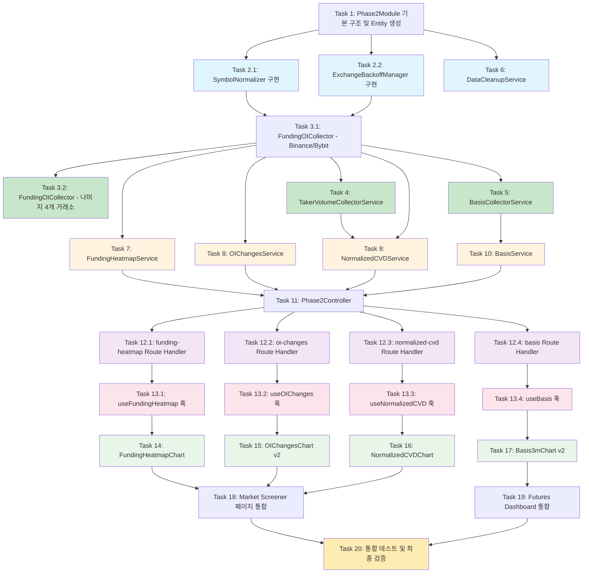

# Implementation Plan: Phase 2 - Server-Side Data Collection

## Backend Foundation

- [ ] 1. Phase2Module 기본 구조 및 Entity 생성
  - `apps/api/src/modules/phase2/` 디렉터리 생성
  - `entities/funding-oi-snapshot.entity.ts` 작성 (FundingOISnapshotEntity: id, symbol, exchange, fundingRate, openInterest, timestamp + 복합 인덱스 + UNIQUE 제약)
  - `entities/taker-volume-snapshot.entity.ts` 작성 (TakerVolumeSnapshotEntity: id, symbol, buyVolume, sellVolume, timestamp + 복합 인덱스 + UNIQUE 제약)
  - `entities/basis-snapshot.entity.ts` 작성 (BasisSnapshotEntity: id, symbol, futuresPrice, spotPrice, deliveryDate, timestamp + 복합 인덱스 + UNIQUE 제약)
  - `phase2.module.ts` 작성 (TypeOrmModule.forFeature에 3개 Entity 등록, 빈 providers/controllers)
  - `apps/api/src/config/database.config.ts`의 ENTITIES 배열에 3개 Entity 추가
  - `apps/api/src/app.module.ts`의 imports에 Phase2Module 추가
  - 서버가 정상 기동되고 테이블이 생성되는지 확인하는 단위 테스트 작성
  - _Requirements: 10.1, 10.2, 10.3, 10.4, 11.1, 11.2, 11.3_

- [ ] 2. SymbolNormalizer 및 ExchangeBackoffManager 유틸리티 구현
- [ ] 2.1 SymbolNormalizer 구현 및 테스트
  - `apps/api/src/modules/phase2/symbol-normalizer.ts` 작성
  - 6개 거래소(Binance, Bybit, OKX, Gate.io, Bitget, Hyperliquid)의 심볼 포맷을 기본 심볼로 정규화하는 `normalize(exchange, rawSymbol)` 메서드 구현
  - Binance/Bybit/Bitget: `/USDT$/` 제거, OKX: `-` split `[0]`, Gate.io: `_` split `[0]`, Hyperliquid: 그대로
  - 엣지 케이스(빈 문자열, null, 미지원 포맷) 처리
  - 단위 테스트: 모든 거래소 포맷 변환 정확성 검증, 엣지 케이스 검증
  - _Requirements: 1.7_

- [ ] 2.2 ExchangeBackoffManager 구현 및 테스트
  - `apps/api/src/modules/phase2/exchange-backoff-manager.ts` 작성
  - `shouldSkip(exchange)`, `recordSuccess(exchange)`, `recordFailure(exchange)`, `getStatus()` 메서드 구현
  - 3회 연속 실패: 60초 백오프 + WARN 로그, 5회 이상: 지수 백오프 (base 60초, max 3600초)
  - 단위 테스트: 실패 카운트 증가, 백오프 시간 계산, 성공 시 리셋, 지수 백오프 검증
  - _Requirements: 1.5, 12.3, 12.7_

## Backend Collectors

- [ ] 3. FundingOICollectorService 구현
- [ ] 3.1 FundingOICollectorService 기본 구조 및 Binance/Bybit 수집
  - `apps/api/src/modules/phase2/funding-oi-collector.service.ts` 작성
  - `OnModuleInit` 인터페이스로 서버 시작 시 즉시 1회 수집
  - `@Interval('funding-oi-collect', 3_600_000)` 데코레이터로 1시간 주기 수집
  - `isCollecting` 플래그로 중복 실행 방지
  - `Promise.allSettled`로 거래소 병렬 호출 구조 작성
  - Binance `/fapi/v1/premiumIndex` 벌크 수집 로직 구현 (AbortSignal.timeout 10초)
  - Bybit `/v5/market/tickers?category=linear` 벌크 수집 로직 구현
  - SymbolNormalizer, ExchangeBackoffManager 주입 및 연동
  - `getBinanceSymbols()` 메서드 (TakerVolumeCollector에서 재사용)
  - TypeORM `upsert()`로 배치 저장
  - 수집 요약 로그(건수, 소요시간, 실패 거래소) 기록
  - Phase2Module의 providers에 등록 및 exports에 추가
  - mock API 응답을 사용한 단위 테스트 작성 (Binance, Bybit 수집 -> DB 저장 -> 조회)
  - _Requirements: 1.1, 1.2, 1.3, 1.4, 1.6, 1.7, 1.8, 1.9, 10.5, 10.7, 11.4, 12.1, 12.2, 12.6_

- [ ] 3.2 FundingOICollectorService에 나머지 4개 거래소 추가
  - OKX: `/api/v5/public/funding-rate` + `/api/v5/public/open-interest?instType=SWAP` (OI 상위 50개 코인, 100ms 딜레이)
  - Gate.io: `/api/v4/futures/usdt/tickers` 벌크 수집
  - Bitget: `/api/v2/mix/market/tickers?productType=USDT-FUTURES` 벌크 수집
  - Hyperliquid: `POST /info {"type":"metaAndAssetCtxs"}` 벌크 수집
  - 각 거래소별 backoffManager 연동 (실패 시 recordFailure, 성공 시 recordSuccess)
  - 거래소 실패 시 나머지 계속 수집되는지 검증하는 테스트 작성
  - _Requirements: 1.2, 1.4, 1.5, 11.5, 12.4_

- [ ] 4. TakerVolumeCollectorService 구현 및 테스트
  - `apps/api/src/modules/phase2/taker-volume-collector.service.ts` 작성
  - `OnModuleInit`으로 서버 시작 시 즉시 1회 수집
  - `@Interval('taker-volume-collect', 3_600_000)` 1시간 주기 수집
  - `isCollecting` 플래그로 중복 실행 방지
  - FundingOICollectorService에서 `getBinanceSymbols()`로 심볼 목록 획득
  - 심볼 목록 비어있으면 WARN 로그 후 건너뛰기
  - Binance `takerlongshortRatio` API로 개별 심볼 수집 (100ms 딜레이, AbortSignal.timeout 10초)
  - TypeORM `upsert()`로 배치 저장
  - ExchangeBackoffManager 연동
  - Phase2Module의 providers에 등록
  - mock API 기반 단위 테스트 (수집 -> DB 저장, 심볼 목록 빈 경우 건너뛰기)
  - _Requirements: 4.1, 4.2, 4.3, 4.4, 4.5, 4.6, 10.5, 10.7, 12.2_

- [ ] 5. BasisCollectorService 구현 및 테스트
  - `apps/api/src/modules/phase2/basis-collector.service.ts` 작성
  - `OnModuleInit`으로 서버 시작 시 `refreshQuarterlySymbols()` 호출하여 CURRENT_QUARTER 심볼 동적 조회
  - `@Interval('basis-collect', 3_600_000)` 1시간 주기 수집
  - Binance `/fapi/v1/exchangeInfo`에서 `contractType=CURRENT_QUARTER` 필터, BTC/ETH만 추출
  - 선물 가격: `/fapi/v1/ticker/price`, 스팟 가격: `/api/v3/ticker/price`
  - CURRENT_QUARTER 심볼 없을 시 WARN 로그 후 건너뛰기
  - 분기 변경 시 자동 새 심볼 감지 (매 수집 사이클마다 exchangeInfo 재조회)
  - TypeORM `upsert()`로 배치 저장, ExchangeBackoffManager 연동
  - Phase2Module의 providers에 등록
  - mock API 기반 단위 테스트 (CURRENT_QUARTER 심볼 조회, 수집 -> DB 저장, 심볼 미존재 시 건너뛰기)
  - _Requirements: 6.1, 6.2, 6.3, 6.4, 6.5, 6.6, 10.5, 10.7_

- [ ] 6. DataCleanupService 구현 및 테스트
  - `apps/api/src/modules/phase2/data-cleanup.service.ts` 작성
  - `@Cron('0 3 * * *')` (매일 03:00 KST) 3개 테이블에서 90일 경과 데이터 삭제
  - 삭제 건수를 INFO 로그로 기록
  - Phase2Module의 providers에 등록
  - 단위 테스트: 90일 경과 데이터 삭제 확인, 미경과 데이터 보존 확인
  - _Requirements: 10.6_

## Backend Aggregation Services & Controller

- [ ] 7. FundingHeatmapService 집계 구현 및 테스트
  - `apps/api/src/modules/phase2/funding-heatmap.service.ts` 작성
  - `getHeatmapData(period: '1d' | '1w' | '1m')` 메서드: period별 기간 데이터 조회
  - 전 거래소 OI 합산 상위 30개 코인 추출
  - 시간 버킷별 그룹핑 (1d: 1h 버킷, 1w: 4h 버킷, 1m: 12h 버킷)
  - OI 가중 평균 펀딩 계산: `SUM(fundingRate * openInterest) / SUM(openInterest)`
  - 거래소별 상세 데이터 반환 (툴팁용 details)
  - 가용 데이터 범위 `dataRange` 반환
  - Phase2Module의 providers에 등록
  - 단위 테스트: OI 가중 평균 계산 정확성, 상위 N개 필터링, 빈 데이터 처리, 시간 버킷 그룹핑 검증
  - _Requirements: 2.2, 2.3, 2.4, 2.5, 2.6, 8.1, 8.6_

- [ ] 8. OIChangesService 집계 구현 및 테스트
  - `apps/api/src/modules/phase2/oi-changes.service.ts` 작성
  - `getOIChanges(period: '1d' | '1w' | '1m')` 메서드
  - 현재 시점 코인별 전 거래소 OI 합산, 기준시점 코인별 전 거래소 OI 합산
  - 변화율 = (현재 - 기준) / 기준 * 100, 기준시점 데이터 없는 코인 제외
  - 변화율 내림차순 정렬, `dataRange` 반환
  - Phase2Module의 providers에 등록
  - 단위 테스트: 변화율 계산 정확성, 기준시점 데이터 없는 케이스, 정렬 순서 검증
  - _Requirements: 3.2, 3.4, 3.6, 8.2, 8.6_

- [ ] 9. NormalizedCVDService 집계 구현 및 테스트
  - `apps/api/src/modules/phase2/normalized-cvd.service.ts` 작성
  - `getNormalizedCVD(period: '1d' | '1w' | '1m')` 메서드
  - 기간 내 코인별 `SUM(buyVolume - sellVolume)` = rawCVD
  - 현재 전 거래소 OI 합산 = totalOI
  - normalizedCVD = rawCVD / totalOI, totalOI === 0 제외
  - `dataRange` 반환
  - Phase2Module의 providers에 등록
  - 단위 테스트: CVD 누적 계산, OI=0 제외, 정규화 정확성
  - _Requirements: 5.2, 5.3, 5.6, 8.3, 8.6_

- [ ] 10. BasisService 집계 구현 및 테스트
  - `apps/api/src/modules/phase2/basis.service.ts` 작성
  - `getBasisTimeSeries(symbol: string, period: '1d' | '1w' | '1m')` 메서드
  - `basisPercent = ((futuresPrice - spotPrice) / spotPrice) * (365 / daysToExpiry) * 100`
  - `daysToExpiry = (deliveryDate - timestamp) / 86400000`, daysToExpiry <= 0 제외
  - `dataRange` 반환
  - Phase2Module의 providers에 등록
  - 단위 테스트: Annualized Basis 공식 검증, daysToExpiry 계산, daysToExpiry <= 0 제외
  - _Requirements: 7.2, 7.5, 8.4, 8.6_

- [ ] 11. Phase2Controller REST API 구현 및 테스트
  - `apps/api/src/modules/phase2/phase2.controller.ts` 작성
  - `@Controller('phase2')` 데코레이터
  - `GET /phase2/funding-heatmap?period=` -> FundingHeatmapService.getHeatmapData
  - `GET /phase2/oi-changes?period=` -> OIChangesService.getOIChanges
  - `GET /phase2/normalized-cvd?period=` -> NormalizedCVDService.getNormalizedCVD
  - `GET /phase2/basis?symbol=&period=` -> BasisService.getBasisTimeSeries
  - 유효하지 않은 period는 기본값 '1d' 적용
  - 응답 형식: `{ success: boolean, data: T, timestamp: number, dataRange?: ... }` (기존 LiquidationController 패턴)
  - 쿼리 타임아웃 5초 제한 (`Promise.race`)
  - Phase2Module의 controllers에 등록
  - 통합 테스트: 4개 엔드포인트 응답 구조 검증, period 기본값 처리, 타임아웃 에러 검증
  - _Requirements: 8.1, 8.2, 8.3, 8.4, 8.5, 8.7, 8.8, 12.5_

## Frontend Route Handlers

- [ ] 12. Next.js Route Handler 프록시 4개 생성
- [ ] 12.1 funding-heatmap Route Handler
  - `apps/web/app/api/futures-dashboard/funding-heatmap/route.ts` 작성
  - 기존 `liquidations/route.ts` 패턴 동일: in-memory 캐시 (1분 TTL), AbortSignal.timeout(10초), stale fallback, 502 에러
  - period 쿼리 파라미터 전달
  - _Requirements: 9.1, 9.5, 9.6, 9.7_

- [ ] 12.2 oi-changes Route Handler
  - `apps/web/app/api/futures-dashboard/oi-changes/route.ts` 작성
  - 동일 패턴: 캐시, stale fallback, period 파라미터 전달
  - _Requirements: 9.2, 9.5, 9.6, 9.7_

- [ ] 12.3 normalized-cvd Route Handler
  - `apps/web/app/api/futures-dashboard/normalized-cvd/route.ts` 작성
  - 동일 패턴: 캐시, stale fallback, period 파라미터 전달
  - _Requirements: 9.3, 9.5, 9.6, 9.7_

- [ ] 12.4 basis Route Handler
  - `apps/web/app/api/futures-dashboard/basis/route.ts` 작성
  - 동일 패턴: 캐시, stale fallback, symbol + period 파라미터 전달
  - _Requirements: 9.4, 9.5, 9.6, 9.7_

## Frontend Custom Hooks

- [ ] 13. TanStack Query 커스텀 훅 4개 생성
- [ ] 13.1 useFundingHeatmap 훅
  - `apps/web/hooks/useFundingHeatmap.ts` 작성
  - TanStack Query: staleTime 60초, refetchInterval 300초
  - period 파라미터 지원 (1d/1w/1m)
  - _Requirements: 13.2, 13.3_

- [ ] 13.2 useOIChanges 훅
  - `apps/web/hooks/useOIChanges.ts` 작성
  - TanStack Query: staleTime 60초, refetchInterval 300초
  - period 파라미터 지원
  - _Requirements: 13.2, 13.3_

- [ ] 13.3 useNormalizedCVD 훅
  - `apps/web/hooks/useNormalizedCVD.ts` 작성
  - TanStack Query: staleTime 60초, refetchInterval 300초
  - period 파라미터 지원
  - _Requirements: 13.2, 13.3_

- [ ] 13.4 useBasis 훅
  - `apps/web/hooks/useBasis.ts` 작성
  - TanStack Query: staleTime 60초, refetchInterval 300초
  - symbol + period 파라미터 지원
  - _Requirements: 13.2, 13.3_

## Frontend Chart Components

- [ ] 14. FundingHeatmapChart 컴포넌트 구현
  - `apps/web/app/(dashboard)/market-screener/components/charts/funding-heatmap-chart.tsx` 신규 작성
  - SVG 기반 커스텀 히트맵: X축 시간, Y축 코인 심볼
  - diverging colorscale: 빨강 = 양의 펀딩 과열, 파랑 = 음의 펀딩 공포
  - OI 상위 30개 코인 표시, 나머지 스크롤
  - 호버 툴팁: 코인, 시간, OI 가중 평균 펀딩(%), 거래소별 상세
  - 데이터 미수집 시 "데이터 수집 중입니다. 잠시 후 다시 시도해주세요." 메시지
  - 로딩 중 스켈레톤 애니메이션, 에러 시 재시도 버튼
  - _Requirements: 2.1, 2.2, 2.3, 2.5, 2.6, 2.8, 13.1, 13.4, 13.5_

- [ ] 15. OIChangesChart v2로 교체
  - `apps/web/app/(dashboard)/market-screener/components/charts/oi-changes-chart.tsx` 수정
  - 기존 OI 절대값 차트를 OI 변화율(%) 수평 바 차트로 교체
  - Recharts BarChart (layout="vertical"): 양수 녹색, 음수 빨강
  - 상위 20개 코인 표시
  - 호버 툴팁: 변화율(%), 현재 OI(USD), 기준시점 OI(USD)
  - `isAnimationActive={false}` 성능 최적화
  - 데이터 미수집 시 기존 플레이스홀더 유지
  - 로딩 중 스켈레톤 애니메이션, 에러 시 재시도 버튼
  - _Requirements: 3.1, 3.3, 3.5, 13.1, 13.4, 13.5_

- [ ] 16. NormalizedCVDChart 컴포넌트 구현
  - `apps/web/app/(dashboard)/market-screener/components/charts/normalized-cvd-chart.tsx` 신규 작성
  - Recharts BarChart (layout="vertical"): 양수 녹색 (순매수 우세), 음수 빨강 (순매도 우세)
  - 상위/하위 20개 코인 표시
  - 호버 툴팁: Normalized CVD, 원시 CVD(USD), 전체 OI(USD)
  - `isAnimationActive={false}` 성능 최적화
  - 데이터 미수집 시 안내 메시지
  - 로딩 중 스켈레톤 애니메이션, 에러 시 재시도 버튼
  - _Requirements: 5.1, 5.4, 5.5, 13.1, 13.4, 13.5_

- [ ] 17. Basis3mChart v2로 교체
  - `apps/web/app/(dashboard)/futures-dashboard/components/charts/basis3m-chart.tsx` 수정
  - BTC/ETH 선택 시 Recharts LineChart 렌더링: X축 시간, Y축 Annualized Basis(%)
  - 호버 툴팁: 시각, Basis(%), 선물 가격, 스팟 가격, 만기까지 남은 일수
  - BTC/ETH 외 코인 선택 시 기존 "지원하지 않습니다" 메시지 유지
  - `isAnimationActive={false}` 성능 최적화
  - 데이터 미수집 시 기존 플레이스홀더 유지
  - 로딩 중 스켈레톤 애니메이션, 에러 시 재시도 버튼
  - _Requirements: 7.1, 7.3, 7.4, 7.5, 13.1, 13.4, 13.5_

## Page Integration & Final Verification

- [ ] 18. Market Screener 페이지에 Phase 2 차트 통합
  - `apps/web/app/(dashboard)/market-screener/page.tsx` 수정
  - "Funding APR Heatmap" 플레이스홀더를 `FundingHeatmapChart` 컴포넌트로 교체
  - "Open Interest (Top Coins)" 차트를 Phase 2 API 기반 `OIChangesChart` v2로 교체
  - "OI-Normalized CVD" 플레이스홀더를 `NormalizedCVDChart` 컴포넌트로 교체
  - 기간 선택(1d/1w/1m) PeriodTabs를 3개 Phase 2 차트와 연동
  - useFundingHeatmap, useOIChanges, useNormalizedCVD 훅 연결
  - _Requirements: 2.1, 2.4, 3.1, 3.4, 5.1, 2.7_

- [ ] 19. Futures Dashboard에 Basis3mChart v2 통합
  - `apps/web/app/(dashboard)/futures-dashboard/components/chart-grid.tsx` 수정
  - Basis3mChart에 useBasis 훅 연결하여 실제 데이터 전달
  - BTC/ETH 선택 시 시계열 데이터 표시
  - _Requirements: 7.1, 7.6_

- [ ] 20. 통합 테스트 및 최종 검증
  - Route Handler 테스트: 캐시 히트/미스, stale fallback, 502 에러 케이스
  - 차트 컴포넌트 렌더링 테스트: 빈 데이터 처리, 로딩 상태, 에러 상태
  - Phase2Controller 통합 테스트: 엔드포인트 응답 구조, period 기본값 적용
  - Phase2Module 최종 완성: 모든 providers, controllers, exports 등록 확인
  - Module 의존성 구조 검증
  - _Requirements: 8.8, 9.6, 11.1, 11.4, 11.5, 13.1, 13.5_

---

## Tasks Dependency Diagram

**색상 범례:**
- 파랑(#e1f5fe): 기초 유틸리티 (병렬 가능)
- 초록(#c8e6c9): Collector 서비스 (T3.1 이후 병렬 가능)
- 주황(#fff3e0): 집계 서비스 (Collector 완료 후 병렬 가능)
- 보라(#f3e5f5): Route Handler (Controller 완료 후 병렬 가능)
- 분홍(#fce4ec): 커스텀 훅 (Route Handler 완료 후 병렬 가능)
- 연초록(#e8f5e9): 차트 컴포넌트 (훅 완료 후 병렬 가능)
- 노랑(#ffecb3): 통합 테스트 및 최종 검증
