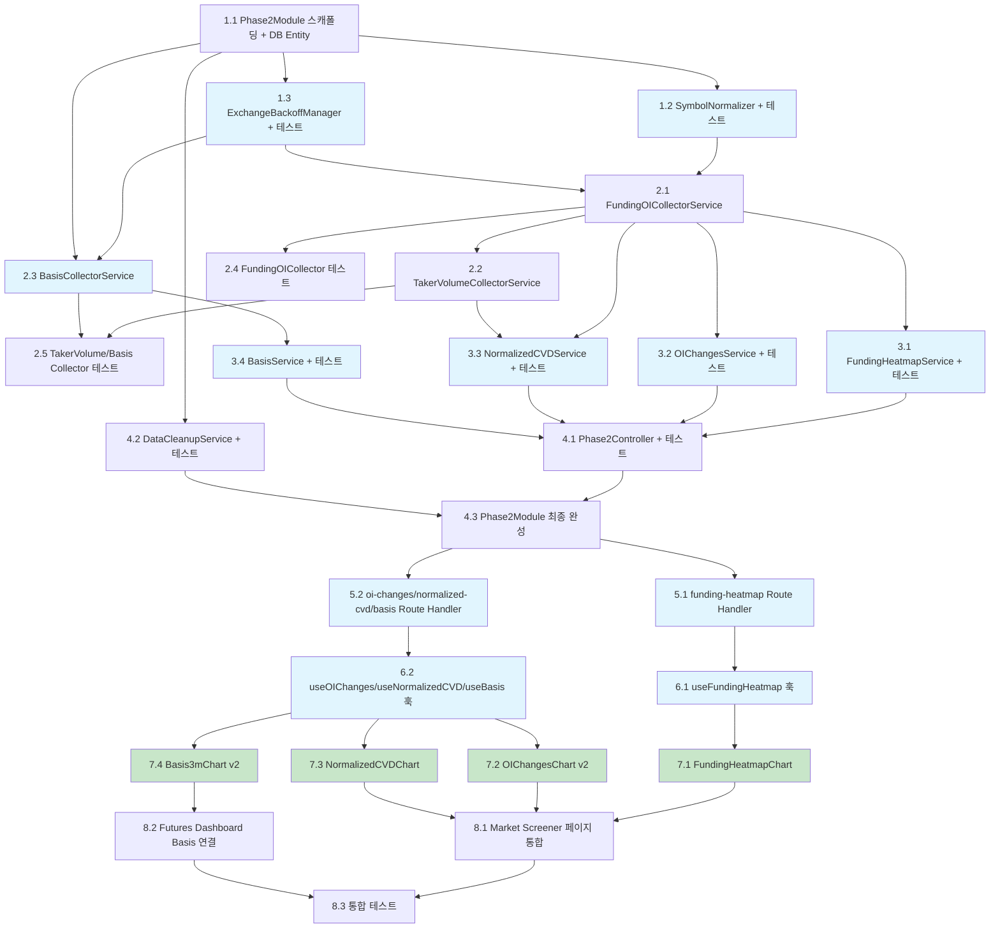

# Implementation Plan: Phase 2 - Server-Side Data Collection

## 1. Backend 기반 구조 및 유틸리티

- [ ] 1.1 Phase2Module 스캐폴딩 및 DB Entity 생성
  - `apps/api/src/modules/phase2/` 디렉토리 구조 생성 (entities/, 루트 파일들)
  - `FundingOISnapshotEntity`, `TakerVolumeSnapshotEntity`, `BasisSnapshotEntity` 3개 TypeORM Entity 생성
    - 각 Entity에 `@PrimaryGeneratedColumn`, `@Column`, `@Index`, `@Unique` 데코레이터 적용
    - 설계서의 컬럼 정의(타입, precision, scale) 그대로 반영
  - `phase2.module.ts` 생성 (빈 Module, `TypeOrmModule.forFeature([3개 Entity])` 등록)
  - `apps/api/src/config/database.config.ts`의 ENTITIES 배열에 3개 Entity 추가
  - `apps/api/src/app.module.ts`의 imports에 Phase2Module 추가
  - _Requirements: 10.1, 10.2, 10.3, 10.4, 11.1, 11.2, 11.3_

- [ ] 1.2 SymbolNormalizer 구현 및 단위 테스트
  - `apps/api/src/modules/phase2/symbol-normalizer.ts` 생성
  - 6개 거래소(Binance, Bybit, OKX, Gate.io, Bitget, Hyperliquid) 심볼 정규화 로직 구현
    - Binance/Bybit/Bitget: `/USDT$/` 제거
    - OKX: `-` split 후 `[0]` 추출
    - Gate.io: `_` split 후 `[0]` 추출
    - Hyperliquid: 그대로 반환
  - 엣지 케이스 처리: 빈 문자열, null, 미지원 포맷 -> `null` 반환
  - 단위 테스트 작성: 6개 거래소별 정상 변환, 엣지 케이스 검증
  - _Requirements: 1.7_

- [ ] 1.3 ExchangeBackoffManager 구현 및 단위 테스트
  - `apps/api/src/modules/phase2/exchange-backoff-manager.ts` 생성
  - `shouldSkip(exchange)`, `recordSuccess(exchange)`, `recordFailure(exchange)`, `getStatus()` 메서드 구현
  - 백오프 전략: 3회 연속 실패 시 60초 백오프, 5회 이상 시 지수 백오프 (max 3600초)
  - `recordSuccess` 시 해당 거래소 에러 상태 리셋
  - 단위 테스트 작성: 실패 카운트 증가, 백오프 시간 계산, 리셋 동작, 지수 백오프 검증
  - _Requirements: 1.4, 1.5, 12.3, 12.7_

## 2. Backend 데이터 수집 서비스

- [ ] 2.1 FundingOICollectorService 구현
  - `apps/api/src/modules/phase2/funding-oi-collector.service.ts` 생성
  - `OnModuleInit` 구현: 서버 시작 시 즉시 1회 수집
  - `@Interval('funding-oi-collect', 3_600_000)` 데코레이터로 1시간 주기 수집
  - `isCollecting` 플래그로 중복 실행 방지
  - `Promise.allSettled`로 6개 거래소 병렬 호출
  - 각 거래소 API 호출 시 `AbortSignal.timeout(10_000)` 적용
  - 거래소별 수집 로직 구현:
    - Binance: `/fapi/v1/premiumIndex` (벌크, funding + OI 동시)
    - Bybit: `/v5/market/tickers?category=linear` (벌크)
    - OKX: funding-rate + open-interest (개별, 상위 50개 코인만, 100ms 딜레이)
    - Gate.io: `/api/v4/futures/usdt/tickers` (벌크)
    - Bitget: `/api/v2/mix/market/tickers?productType=USDT-FUTURES` (벌크)
    - Hyperliquid: `POST /info {"type":"metaAndAssetCtxs"}` (벌크)
  - SymbolNormalizer를 통한 심볼 정규화 적용
  - ExchangeBackoffManager 연동 (실패/성공 기록, shouldSkip 체크)
  - timestamp를 1시간 단위로 라운드하여 저장
  - TypeORM `upsert()`로 배치 저장 (중복 방지)
  - 수집 완료 시 요약 로그 (수집 건수, 소요 시간, 실패 거래소)
  - `getBinanceSymbols()` 메서드 노출 (TakerVolumeCollector에서 재사용)
  - _Requirements: 1.1, 1.2, 1.3, 1.4, 1.5, 1.6, 1.7, 1.8, 1.9, 10.5, 10.7, 12.1, 12.2, 12.4, 12.6_

- [ ] 2.2 TakerVolumeCollectorService 구현
  - `apps/api/src/modules/phase2/taker-volume-collector.service.ts` 생성
  - `OnModuleInit` 구현: 서버 시작 시 즉시 1회 수집
  - `@Interval('taker-volume-collect', 3_600_000)` 데코레이터로 1시간 주기 수집
  - `isCollecting` 플래그로 중복 실행 방지
  - `FundingOICollectorService.getBinanceSymbols()`로 심볼 목록 획득
  - 심볼별 순차 호출 (100ms 딜레이), `AbortSignal.timeout(10_000)` 적용
  - Binance `takerlongshortRatio` API 또는 Kline `takerBuyQuoteVol` 활용
  - ExchangeBackoffManager 연동
  - TypeORM `upsert()`로 배치 저장
  - 수집 완료 시 요약 로그
  - _Requirements: 4.1, 4.2, 4.3, 4.4, 4.5, 4.6, 10.5, 10.7, 12.2_

- [ ] 2.3 BasisCollectorService 구현
  - `apps/api/src/modules/phase2/basis-collector.service.ts` 생성
  - `OnModuleInit` 구현: 서버 시작 시 Binance exchangeInfo에서 CURRENT_QUARTER 심볼 동적 조회
  - `@Interval('basis-collect', 3_600_000)` 데코레이터로 1시간 주기 수집
  - `isCollecting` 플래그로 중복 실행 방지
  - `refreshQuarterlySymbols()`: exchangeInfo에서 contractType=CURRENT_QUARTER 필터 (BTC, ETH)
  - 분기 선물 가격 + 스팟 가격 수집
  - CURRENT_QUARTER 심볼 미존재 시 WARN 로그 후 건너뛰기
  - 분기 변경 시 자동 심볼 전환 (매 사이클 재조회)
  - TypeORM `upsert()`로 저장
  - _Requirements: 6.1, 6.2, 6.3, 6.4, 6.5, 6.6, 10.5, 10.7, 12.2_

- [ ] 2.4 FundingOICollectorService 단위 테스트
  - 모의(mock) API 응답 기반 수집 테스트
  - 6개 거래소 각각의 응답 파싱 검증
  - 일부 거래소 실패 시 나머지 정상 수집 확인
  - 중복 실행 방지 (isCollecting 플래그) 검증
  - BackoffManager 연동 검증
  - _Requirements: 1.4, 12.2_

- [ ] 2.5 TakerVolumeCollectorService 및 BasisCollectorService 단위 테스트
  - TakerVolumeCollector: 심볼 목록 재사용, 딜레이 적용, 에러 처리 검증
  - BasisCollector: CURRENT_QUARTER 심볼 파싱, 미존재 시 건너뛰기, 분기 전환 시나리오
  - _Requirements: 4.4, 4.6, 6.5, 6.6_

## 3. Backend 집계 서비스

- [ ] 3.1 FundingHeatmapService 구현 및 단위 테스트
  - `apps/api/src/modules/phase2/funding-heatmap.service.ts` 생성
  - `getHeatmapData(period)` 메서드: period별 데이터 조회 (1d=24h, 1w=168h, 1m=720h)
  - 전 거래소 OI 합산 상위 30개 코인 추출
  - 시간 버킷별 그룹핑 (1d: 1h, 1w: 4h, 1m: 12h)
  - OI 가중 평균 펀딩 계산: `SUM(fundingRate * openInterest) / SUM(openInterest)`
  - 거래소별 상세 데이터 포함 (툴팁용)
  - `dataRange` 필드로 실제 데이터 범위 명시
  - 단위 테스트: OI 가중 평균 계산 정확성, 상위 N개 필터링, 빈 데이터 처리
  - _Requirements: 2.2, 2.3, 2.4, 2.5, 2.6, 8.1, 8.5, 8.6_

- [ ] 3.2 OIChangesService 구현 및 단위 테스트
  - `apps/api/src/modules/phase2/oi-changes.service.ts` 생성
  - `getOIChanges(period)` 메서드: 현재 시점 vs 기준시점 OI 비교
  - 변화율 계산: `(currentOI - baseOI) / baseOI * 100`
  - 기준시점 데이터 없는 코인 제외
  - 변화율 내림차순 정렬
  - 단위 테스트: 변화율 계산 정확성, 기준시점 데이터 없는 케이스 처리
  - _Requirements: 3.2, 3.4, 3.6, 8.2, 8.5, 8.6_

- [ ] 3.3 NormalizedCVDService 구현 및 단위 테스트
  - `apps/api/src/modules/phase2/normalized-cvd.service.ts` 생성
  - `getNormalizedCVD(period)` 메서드
  - CVD 계산: `SUM(buyVolume - sellVolume)` (기간 내 누적)
  - Normalized CVD: `CVD / 전 거래소 OI 합산`
  - `totalOI == 0`인 코인 제외
  - 단위 테스트: CVD 누적 계산, OI=0 제외, 정규화 정확성
  - _Requirements: 5.2, 5.3, 5.6, 8.3, 8.5, 8.6_

- [ ] 3.4 BasisService 구현 및 단위 테스트
  - `apps/api/src/modules/phase2/basis.service.ts` 생성
  - `getBasisTimeSeries(symbol, period)` 메서드
  - Annualized Basis 계산: `((futuresPrice - spotPrice) / spotPrice) * (365 / daysToExpiry) * 100`
  - `daysToExpiry = (deliveryDate - timestamp) / 86400000`
  - `daysToExpiry <= 0`인 포인트 제외
  - 단위 테스트: 공식 검증, daysToExpiry 계산, 제외 조건 확인
  - _Requirements: 7.2, 7.5, 8.4, 8.5, 8.6_

## 4. Backend API 컨트롤러 및 데이터 관리

- [ ] 4.1 Phase2Controller 구현 및 테스트
  - `apps/api/src/modules/phase2/phase2.controller.ts` 생성
  - 4개 GET 엔드포인트: `/phase2/funding-heatmap`, `/phase2/oi-changes`, `/phase2/normalized-cvd`, `/phase2/basis`
  - `period` 파라미터 검증: 유효하지 않으면 기본값 '1d' 적용
  - `symbol` 파라미터 처리 (basis 엔드포인트)
  - 쿼리 타임아웃 5초 제한 (`Promise.race`)
  - 일관된 응답 구조: `{ success, data, timestamp, dataRange }` (기존 LiquidationController 패턴)
  - 단위 테스트: 응답 구조 검증, period 기본값, 타임아웃 처리
  - _Requirements: 8.1, 8.2, 8.3, 8.4, 8.5, 8.6, 8.7, 8.8_

- [ ] 4.2 DataCleanupService 구현 및 테스트
  - `apps/api/src/modules/phase2/data-cleanup.service.ts` 생성
  - `@Cron('0 3 * * *')` 매일 03:00 KST 실행
  - 3개 테이블에서 `timestamp < Date.now() - 90일` 조건으로 DELETE
  - 삭제 건수 INFO 로그 기록
  - 단위 테스트: 90일 경과 데이터 삭제, 미경과 데이터 보존
  - _Requirements: 10.6_

- [ ] 4.3 Phase2Module 최종 완성 및 통합
  - `phase2.module.ts`에 모든 providers, controllers, exports 등록
  - FundingOICollectorService를 exports에 추가 (TakerVolumeCollector에서 심볼 목록 참조용)
  - Module 의존성 구조 검증
  - _Requirements: 11.1, 11.2, 11.3, 11.4, 11.5_

## 5. Next.js Route Handler 프록시

- [ ] 5.1 funding-heatmap Route Handler 구현
  - `apps/web/app/api/futures-dashboard/funding-heatmap/route.ts` 생성
  - 기존 `liquidations/route.ts` 패턴 그대로 적용
  - apps/api의 `/phase2/funding-heatmap` 엔드포인트 프록시
  - 1분 TTL in-memory 캐시 적용
  - stale 캐시 fallback 패턴
  - period 쿼리 파라미터 전달
  - _Requirements: 9.1, 9.5, 9.6, 9.7_

- [ ] 5.2 oi-changes, normalized-cvd, basis Route Handler 구현
  - `apps/web/app/api/futures-dashboard/oi-changes/route.ts` 생성
  - `apps/web/app/api/futures-dashboard/normalized-cvd/route.ts` 생성
  - `apps/web/app/api/futures-dashboard/basis/route.ts` 생성
  - 각각 동일한 프록시 + 캐시 패턴 적용
  - basis Route Handler는 period, symbol 파라미터 모두 전달
  - _Requirements: 9.2, 9.3, 9.4, 9.5, 9.6, 9.7_

## 6. Frontend TanStack Query Hooks

- [ ] 6.1 useFundingHeatmap 훅 구현
  - `apps/web/hooks/useFundingHeatmap.ts` 생성
  - TanStack Query 기반: staleTime 60초, refetchInterval 300초
  - period 파라미터(1d/1w/1m) 지원
  - 기간 전환 시 이전 캐시 즉시 표시 + 백그라운드 새 데이터 fetch
  - _Requirements: 2.4, 2.7, 13.2, 13.3_

- [ ] 6.2 useOIChanges, useNormalizedCVD, useBasis 훅 구현
  - `apps/web/hooks/useOIChanges.ts` 생성 (period 파라미터)
  - `apps/web/hooks/useNormalizedCVD.ts` 생성 (period 파라미터)
  - `apps/web/hooks/useBasis.ts` 생성 (symbol, period 파라미터)
  - 모두 동일한 TanStack Query 설정 적용 (staleTime 60s, refetchInterval 300s)
  - _Requirements: 3.4, 5.4, 7.6, 13.2, 13.3_

## 7. Frontend 차트 컴포넌트

- [ ] 7.1 FundingHeatmapChart 구현
  - `apps/web/app/(dashboard)/market-screener/components/charts/funding-heatmap-chart.tsx` 신규 생성
  - SVG 기반 커스텀 히트맵 렌더링
    - X축: 시간 슬롯, Y축: 코인 심볼 (OI 상위 30개)
    - 셀 색상: diverging colorscale (빨강 = 양의 펀딩 과열, 파랑 = 음의 펀딩)
  - 호버 툴팁: 코인, 시간, OI 가중 평균 펀딩(%), 거래소별 펀딩 상세
  - 기간 선택(1d/1w/1m) 연동
  - 코인 30개 초과 시 스크롤 지원
  - 로딩 시 기존 ChartSkeleton 표시
  - 데이터 미수집 시 안내 메시지 표시
  - 에러 시 에러 메시지 + 재시도 버튼
  - _Requirements: 2.1, 2.2, 2.3, 2.4, 2.5, 2.6, 2.8, 13.1, 13.4, 13.5_

- [ ] 7.2 OIChangesChart v2로 교체
  - `apps/web/app/(dashboard)/market-screener/components/charts/oi-changes-chart.tsx` 수정
  - 기존 OI 절대값 차트를 OI 변화율(%) 수평 바 차트로 교체
  - Recharts BarChart (layout="vertical") 사용
  - 상위 20개 코인 표시
  - 양수(OI 증가) = 녹색, 음수(OI 감소) = 빨강
  - 호버 툴팁: 변화율(%), 현재 OI(USD), 기준시점 OI(USD)
  - 기간 선택(1d/1w/1m) 연동
  - `isAnimationActive={false}` 설정
  - _Requirements: 3.1, 3.2, 3.3, 3.4, 3.5, 13.1, 13.4, 13.5_

- [ ] 7.3 NormalizedCVDChart 구현
  - `apps/web/app/(dashboard)/market-screener/components/charts/normalized-cvd-chart.tsx` 신규 생성
  - Recharts BarChart (layout="vertical"), 기존 FundingRateScreenerChart 패턴 참고
  - 상위/하위 20개 코인 표시
  - 양수 = 녹색 (순매수 우세), 음수 = 빨강 (순매도 우세)
  - 호버 툴팁: Normalized CVD 값, 원시 CVD(USD), 전체 OI(USD)
  - 데이터 미수집 시 안내 메시지, 에러 시 재시도 버튼
  - _Requirements: 5.1, 5.2, 5.3, 5.4, 5.5, 5.6, 13.1, 13.4, 13.5_

- [ ] 7.4 Basis3mChart v2로 교체
  - `apps/web/app/(dashboard)/futures-dashboard/components/charts/basis3m-chart.tsx` 수정
  - 기존 플레이스홀더를 Annualized Basis 시계열 LineChart로 교체
  - Recharts LineChart: X축 시간, Y축 Basis(%)
  - BTC/ETH 선택 시 실제 시계열 차트 렌더링
  - BTC/ETH 외 코인 선택 시 미지원 메시지 표시 (기존 동작 유지)
  - 호버 툴팁: 시각, Basis(%), 선물 가격, 스팟 가격, 만기까지 남은 일수
  - `isAnimationActive={false}` 설정
  - _Requirements: 7.1, 7.2, 7.3, 7.4, 7.5, 13.1, 13.4, 13.5_

## 8. 페이지 통합 및 연결

- [ ] 8.1 Market Screener 페이지에 Phase 2 차트 통합
  - `apps/web/app/(dashboard)/market-screener/page.tsx` 수정
  - "Phase 2에서 구현 예정" 플레이스홀더를 FundingHeatmapChart, NormalizedCVDChart로 교체
  - OIChangesChart를 v2(변화율 기반)로 전환
  - 기간 선택 UI 연동 (1d/1w/1m 탭)
  - _Requirements: 2.1, 3.1, 5.1_

- [ ] 8.2 Futures Dashboard에 Basis3mChart v2 연결
  - `apps/web/app/(dashboard)/futures-dashboard/components/chart-grid.tsx` 수정 (또는 관련 페이지)
  - Basis3mChart에 useBasis 훅 연결하여 실제 API 데이터 사용
  - BTC/ETH 선택 연동
  - _Requirements: 7.1, 7.4_

- [ ] 8.3 통합 테스트 작성
  - Route Handler 테스트: 캐시 히트/미스, stale fallback, 502 에러 케이스
  - 차트 컴포넌트 렌더링 테스트: 빈 데이터 처리, 로딩 상태, 에러 상태
  - Phase2Controller 통합 테스트: 엔드포인트 응답 구조, period 기본값 적용
  - _Requirements: 8.8, 9.6, 13.1, 13.5_

---

## Tasks Dependency Diagram

**범례:**
- 파란색 배경: 이전 단계 내에서 병렬 실행 가능한 태스크
- 녹색 배경: 프론트엔드 차트 컴포넌트 (병렬 실행 가능)
