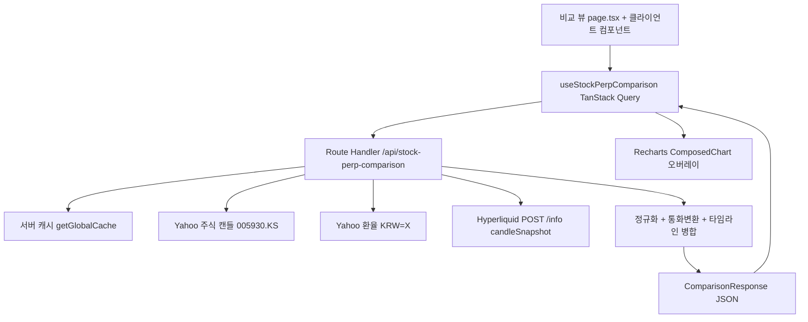
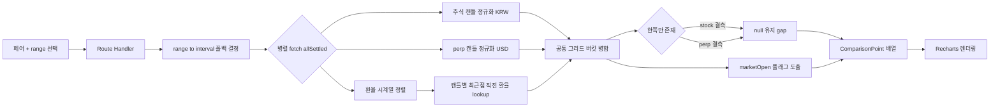
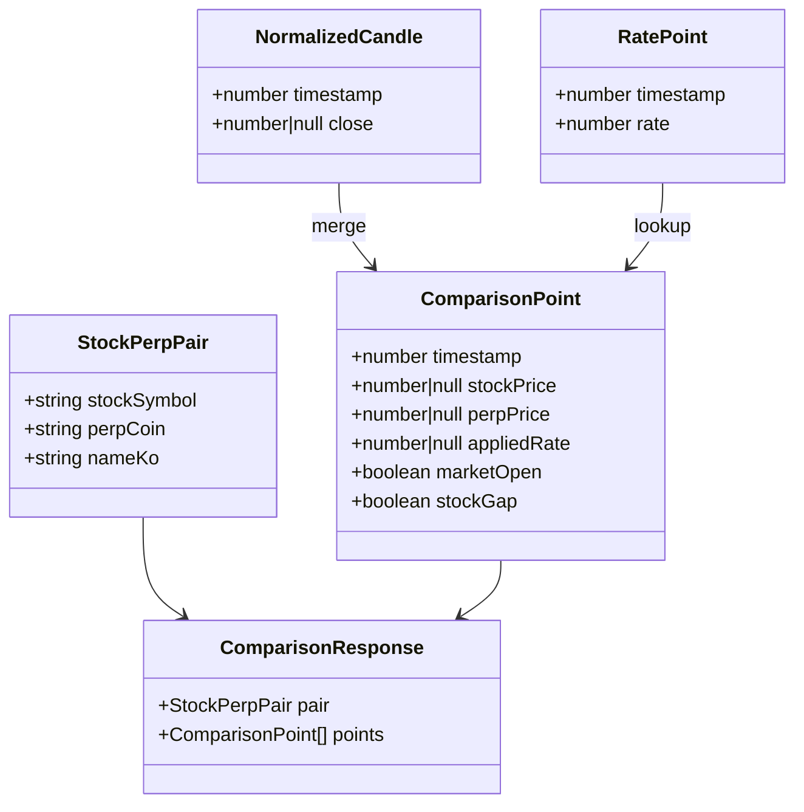
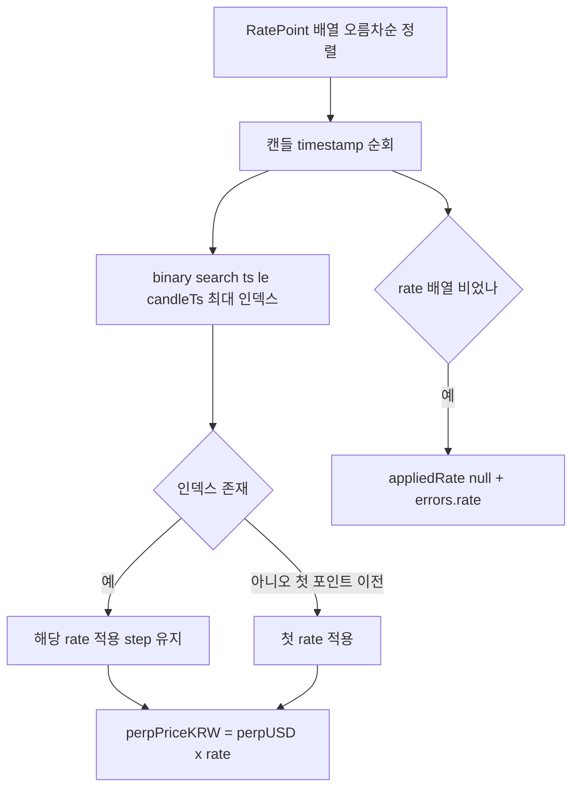
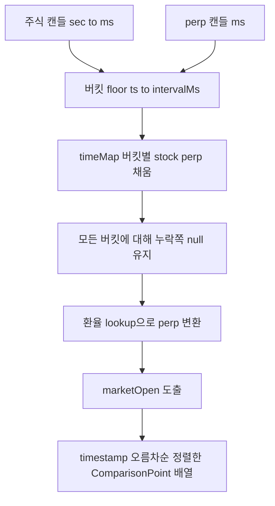

# Design Document

## Overview

본 설계는 한국 주식(삼성전자/SK하이닉스/현대차)의 실제 가격 차트와 해당 종목의 Hyperliquid 영구선물(perp) 차트를 **동일한 타임라인 위에 겹쳐서** 보여주는 비교 뷰를 BitScope에 추가한다.

- 주 사용 단위는 **분봉(intraday minute candle)** 이며, 긴 범위는 일봉으로 자동 폴백한다.
- 주식 가격은 KRW, perp는 USD이므로 USD/KRW 환율을 **시간 정합(time-matched)** 으로 적용하여 공통 통화 축에서 비교한다.
- 주식 시장 휴장 구간(야간/주말/공휴일)에서는 **주식 라인이 끊기고(gap), perp 라인은 연속**으로 이어져 "24/7 vs 제한 시간" 괴리를 시각적으로 드러낸다.

### 설계 원칙: 기존 아키텍처 재사용

본 기능은 기존 `futures-dashboard`의 데이터 파이프라인 패턴을 그대로 미러링한다. 새로운 병렬 구조를 발명하지 않는다.

| 영역 | 재사용(기존) | 신규 생성 |
|------|-------------|----------|
| 외부 호출 경유 | Next.js Route Handler(CORS 프록시) 패턴 (`app/api/futures-dashboard/[indicator]/route.ts`) | `app/api/stock-perp-comparison/route.ts` |
| Hyperliquid 호출 | `buildHyperliquidBody`의 candleSnapshot POST 패턴, `Promise.allSettled` 병렬 fetch (`fetch-indicator.ts`), `safeFloat` 정규화 (`normalizer.ts`) | 주식/환율 전용 normalizer |
| 시계열 병합 | `mergeTimeSeries`의 버킷 정규화 + null-fill 패턴 | 3-소스(주식/perp/환율) 병합 + 환율 lookup |
| 서버 캐시 | `getGlobalCache` / `buildCacheKey` / `getWithStale` (`app/api/exchange/_lib/cache.ts`) | (그대로 사용) |
| 차트 | Recharts, `connectNulls`, 스마트 시간축 포맷터 (`charts/price-chart.tsx`), 100포인트 샘플링 | overlay ComposedChart, ReferenceArea 음영 |
| 셀렉터 | `PeriodSelector`, `CoinSelector` 버튼 패턴 | `PairSelector`, `RangeSelector` |
| 데이터 패칭 | `useQuery` 키 구조, staleTime, placeholderData (`useMultiExchangeIndicator.ts`) | `useStockPerpComparison` 훅 |
| 통화 | `EXCHANGE_CURRENCY_MAP`(Hyperliquid=USD), `formatAlertPrice` (`utils/currency.ts`) | (그대로 사용) |
| 네비게이션 | `sidebar-nav.tsx`의 `NAV_SECTIONS` 마켓 섹션 | nav 항목 1개 추가 |

> **환율 재사용 조사 결과:** 기존 `getUsdtKrwRate()` (`apps/web/lib/api-client.ts`)는 **업비트 KRW-USDT 현재가 스냅샷 1개 값**만 반환한다. 본 기능은 캔들별 **시간 정합 환율 시계열**이 필요하므로 그대로 쓸 수 없다. 따라서 Yahoo `KRW=X` 시계열을 조회하는 신규 환율 프록시를 설계한다(요구사항 R4.1이 Yahoo `KRW=X`를 명시).

### 요구사항 매핑 요약

| 요구사항 | 충족 설계 섹션 |
|----------|---------------|
| R1 페어 선택 | Data Models(PAIR_CONFIGS), Frontend(PairSelector) |
| R2 주식 캔들 | Route Handler(stock fetch), Components(normalizeYahooCandles), 폴백 매핑 |
| R3 perp 캔들 | Route Handler(perp fetch), Hyperliquid candleSnapshot 재사용 |
| R4 환율/변환 | Currency Conversion 섹션(rate 시계열 + 최근접 직전 lookup) |
| R5 타임라인 정렬 | Timeline Alignment 섹션 |
| R6 오버레이 렌더링 | Frontend(ComparisonChart, connectNulls) |
| R7 개장/휴장 음영 | Timeline Alignment(marketOpen 도출), Frontend(ReferenceArea) |
| R8 범위/간격 선택 | Data Models(Range/Interval 폴백 표), Frontend(RangeSelector) |
| R9 로딩/에러/빈 상태 | Error Handling, State/Data Fetching |
| R10 비기능 | 전 섹션(프록시 경유, 한국어, Recharts 재사용, 캐싱, 샘플링) |

---

## Architecture Design

### System Architecture Diagram



### Data Flow Diagram



### 변환/병합 위치 결정: **서버사이드 Route Handler**

통화 변환과 타임라인 병합은 모두 **Route Handler(서버)** 에서 수행한다. 클라이언트는 완성된 `ComparisonPoint[]`를 받아 렌더링만 한다.

**근거:**
1. **기존 패턴 일관성** — `futures-dashboard`도 서버에서 정규화·병합 후 클라이언트로 전달한다(R10.3).
2. **3소스 동기화** — 주식·perp·환율을 한 요청 범위에서 일관되게 묶어 캐싱하기 쉽다(R10.4). 캐시 키 하나(`pair+range`)로 전체 비교 결과를 재사용한다.
3. **클라이언트 부담 감소** — 분봉 수천 포인트의 환율 binary-search lookup을 클라이언트에서 매 렌더마다 수행하지 않는다(R10.5).
4. **CORS** — Yahoo/Hyperliquid 직접 호출은 브라우저에서 CORS로 차단되므로 어차피 프록시가 필수다(R10.1).

---

## Route Handler API Design

기존 `futures-dashboard/[indicator]/route.ts` 패턴을 미러링한 **단일 통합 엔드포인트**를 신규 생성한다. (주식/perp/환율을 별도 프록시로 쪼개지 않는 이유: 세 소스를 같은 range로 묶어 한 번에 병합·캐싱해야 하고, 클라이언트 왕복을 줄여 R10.4/R10.5를 만족하기 위함.)

### 신규 파일

```
apps/web/app/api/stock-perp-comparison/
├── route.ts                 # GET 핸들러 (futures-dashboard route 미러)
└── _lib/
    ├── url-builder.ts        # Yahoo/Hyperliquid URL·body 생성 + range→interval 폴백
    ├── fetch-comparison.ts   # allSettled 병렬 fetch (fetch-indicator.ts 미러)
    ├── normalizer.ts         # Yahoo 주식/환율 + Hyperliquid 캔들 정규화
    ├── rate-lookup.ts        # 환율 시계열 정렬 + binary search 최근접 직전 lookup
    └── merge-timeline.ts     # 공통 그리드 병합 + marketOpen 플래그 도출
```

### 엔드포인트

```
GET /api/stock-perp-comparison?pair=005930.KS&range=5d
```

| 쿼리 파라미터 | 타입 | 기본값 | 설명 |
|--------------|------|--------|------|
| `pair` | string (주식 심볼) | `005930.KS` | `PAIR_CONFIGS`의 stockSymbol. 유효성 검증 후 perp 코인 결정 |
| `range` | `ComparisonRange` | `5d` | `1d`/`5d`/`1mo`/`6mo`/`1y`. interval은 서버가 폴백 표로 결정 |

> interval은 사용자가 직접 보내지 않고 `range`로부터 서버가 결정한다(R8.2, R8.4 — 주식·perp interval을 항상 동일하게 정렬). 단, 응답에 `appliedInterval`과 `fallbackApplied`를 담아 폴백 발생을 클라이언트가 안내할 수 있게 한다(R8.3).

### 정규화 응답 형태

```jsonc
{
  "success": true,
  "pair": { "stockSymbol": "005930.KS", "perpCoin": "xyz:SMSN", "nameKo": "삼성전자" },
  "range": "5d",
  "requestedInterval": "1m",
  "appliedInterval": "1m",        // 폴백 시 다를 수 있음 (R8.3)
  "fallbackApplied": false,
  "baseCurrency": "KRW",          // 변환 기준 통화 (아래 결정 참조)
  "points": [
    {
      "timestamp": 1716950400000, // UTC epoch ms (공통 그리드)
      "stockPrice": 81500,        // KRW, 결측 시 null
      "perpPrice": 81234.5,       // baseCurrency로 변환된 값, 결측 시 null
      "perpPriceRaw": 58.7,       // 원본 USD (툴팁용)
      "appliedRate": 1383.2,      // 이 시각에 적용된 USD/KRW (없으면 null)
      "marketOpen": true,         // 주식 개장 구간 여부 (R7)
      "stockGap": false           // 직전 대비 주식 결측 시작점 여부 (음영 구간 분할용)
    }
  ],
  "meta": {
    "stockTimezone": "Asia/Seoul",
    "gmtoffset": 32400,
    "regularMarketPrice": 81500
  },
  "errors": {                     // 부분 실패 추적 (R9.5)
    "stock": null,
    "perp": null,
    "rate": null
  },
  "cached": false
}
```

에러 응답은 기존 route와 동일하게 `{ success: false, error: { message, code } }` + 적절한 status. 서버 캐시는 `buildCacheKey('spc', pair, { range })` + `getWithStale`로 스테일 폴백까지 미러링한다.

### range → interval 폴백 매핑 (Yahoo 분봉 한계 반영, R2.5/R8.3)

`_lib/url-builder.ts`에 상수로 둔다. (검증된 Yahoo 한계: 1m≈7d, 5m/15m≈60d.)

| range | 요청 interval | 폴백 interval | perp lookbackMs |
|-------|--------------|--------------|-----------------|
| `1d`  | `1m`  | (없음) | 1일 |
| `5d`  | `1m`  | (없음, 7일 이내) | 5일 |
| `1mo` | `5m`  | (없음, 60일 이내) | 30일 |
| `6mo` | `1d`  | (없음) | 180일 |
| `1y`  | `1d`  | (없음) | 365일 |

> 분봉 기본 정책상 `1d`/`5d`는 1m, `1mo`는 5m, 그 이상은 1d. 만약 향후 더 긴 분봉 요청이 추가되어 Yahoo가 422/빈 응답을 주면 `fetch-comparison.ts`가 한 단계 거친 interval로 1회 재시도하고 `fallbackApplied=true`를 세팅한다.

### URL/Body 생성 (검증된 사실 그대로)

```
주식:   GET https://query1.finance.yahoo.com/v8/finance/chart/{pair}?range={range}&interval={interval}
환율:   GET https://query1.finance.yahoo.com/v8/finance/chart/KRW=X?range={range}&interval={rateInterval}
perp:   POST https://api.hyperliquid.xyz/info
        body { "type":"candleSnapshot", "req":{ "coin":"xyz:SMSN", "interval":"<interval>", "startTime":<ms>, "endTime":<ms> } }
```

- perp `coin`은 `xyz:` 접두사만 사용, `dex` 파라미터 없음(R3.4). Hyperliquid base URL은 `HYPERLIQUID_CONFIG.restBaseUrl` 재사용.
- 환율 `rateInterval`은 candle interval이 1m이어도 `1h`로 고정 조회한다(환율은 분 단위로 거의 변하지 않고 Yahoo도 KRW=X 분봉을 잘 안 줌 → 호출 경량화). 캔들과의 정합은 lookup 단계에서 처리.

---

## Data Models

### 위치

```
packages/shared/src/types/stock-perp.ts        # 신규 타입
packages/shared/src/constants/stock-perp.ts     # 신규 상수 (PAIR_CONFIGS, 폴백 표)
```
`packages/shared/src/index.ts`에 두 모듈을 export 추가(기존 `types/`·`constants/` 배럴 패턴 동일).

### Core Data Structure Definitions

```typescript
// types/stock-perp.ts

/** 비교 뷰 시간 범위 옵션 (Yahoo range 토큰과 정렬) */
export type ComparisonRange = '1d' | '5d' | '1mo' | '6mo' | '1y';

/** 캔들 간격 */
export type ComparisonInterval = '1m' | '5m' | '15m' | '1d';

/** 변환 기준 통화 */
export type ComparisonBaseCurrency = 'KRW' | 'USD';

/** 주식-perp 페어 설정 (R1) */
export interface StockPerpPair {
  stockSymbol: string;   // Yahoo 심볼  예: '005930.KS'
  perpCoin: string;      // Hyperliquid 코인 예: 'xyz:SMSN'
  nameKo: string;        // 한국어 종목명 예: '삼성전자'
}

/** 정규화된 OHLC 캔들 (주식/perp 공통 중간 표현) */
export interface NormalizedCandle {
  timestamp: number;     // UTC epoch ms
  open: number | null;
  high: number | null;
  low: number | null;
  close: number | null;  // 결측(휴장)이면 null — forward-fill 금지 (R2.4)
}

/** 환율 포인트 (정렬된 시계열) */
export interface RatePoint {
  timestamp: number;     // UTC epoch ms
  rate: number;          // USD/KRW (1 USD = rate KRW)
}

/** 병합된 비교 시계열 포인트 (R5/R6/R7) */
export interface ComparisonPoint {
  timestamp: number;          // 공통 그리드 UTC epoch ms
  stockPrice: number | null;  // KRW, 휴장 결측 시 null
  perpPrice: number | null;   // baseCurrency 변환값, 결측 시 null
  perpPriceRaw: number | null;// 원본 USD (툴팁)
  appliedRate: number | null; // 적용 환율
  marketOpen: boolean;        // 주식 개장 구간 여부
  stockGap: boolean;          // 결측 구간 시작 플래그
}

/** Route Handler 응답 */
export interface ComparisonResponse {
  pair: StockPerpPair;
  range: ComparisonRange;
  requestedInterval: ComparisonInterval;
  appliedInterval: ComparisonInterval;
  fallbackApplied: boolean;
  baseCurrency: ComparisonBaseCurrency;
  points: ComparisonPoint[];
  meta: {
    stockTimezone: string;   // 'Asia/Seoul'
    gmtoffset: number;       // 초 단위 (Yahoo meta.gmtoffset)
    regularMarketPrice: number | null;
  };
  errors: {
    stock: string | null;
    perp: string | null;
    rate: string | null;
  };
  cached?: boolean;
  stale?: boolean;
}
```

### 상수 정의

```typescript
// constants/stock-perp.ts
export const PAIR_CONFIGS: readonly StockPerpPair[] = [
  { stockSymbol: '005930.KS', perpCoin: 'xyz:SMSN',    nameKo: '삼성전자' },
  { stockSymbol: '000660.KS', perpCoin: 'xyz:SKHX',    nameKo: 'SK하이닉스' },
  { stockSymbol: '005380.KS', perpCoin: 'xyz:HYUNDAI', nameKo: '현대차' },
] as const;

export const DEFAULT_PAIR = PAIR_CONFIGS[0];      // 삼성전자 (R1.3)
export const DEFAULT_RANGE: ComparisonRange = '5d';

/** range별 interval/lookback 매핑 (R8) */
export const RANGE_TO_INTERVAL: Record<ComparisonRange, {
  interval: ComparisonInterval;
  fallbackInterval: ComparisonInterval | null;
  perpLookbackMs: number;
}> = {
  '1d':  { interval: '1m',  fallbackInterval: '5m', perpLookbackMs: 1 * 864e5 },
  '5d':  { interval: '1m',  fallbackInterval: '5m', perpLookbackMs: 5 * 864e5 },
  '1mo': { interval: '5m',  fallbackInterval: '1d', perpLookbackMs: 30 * 864e5 },
  '6mo': { interval: '1d',  fallbackInterval: null, perpLookbackMs: 180 * 864e5 },
  '1y':  { interval: '1d',  fallbackInterval: null, perpLookbackMs: 365 * 864e5 },
};

/** KRX 정규장 세션 (KST) — marketOpen 보조 판정 (R7) */
export const KRX_SESSION = { openMin: 9 * 60, closeMin: 15 * 60 + 30 } as const; // 09:00–15:30
```

### Data Model Diagram



---

## Currency Conversion + Time-Matched Rate

### 변환 방향 결정: **perp USD → KRW (baseCurrency = KRW)**

**근거(R4.2 택일):**
- 사용자(한국 사용자)에게 친숙한 통화는 KRW이고, 주식 가격이 본래 KRW다.
- 주식 가격을 변환하지 않고 **원본 그대로 유지**하면 환율 조회가 실패해도 주식 라인은 정확히 보존된다(R9.4 부분 렌더 유리). perp만 변환 대상이므로 변환 실패의 영향 범위가 perp에 국한된다.
- Y축 라벨은 "KRW"로 통일하고, 헤더에 "적용 환율: 1 USD = 1,383원 (시점별 변동)"을 표기한다(R4.5).

`perpPriceKRW = perpPriceUSD * appliedRate`.

### 환율 시계열 구축 + 최근접 직전 lookup (R4.3, R4.4)

1. Yahoo `KRW=X` 응답에서 `timestamp[]`(epoch s → ×1000)와 `quote[0].close[]`를 묶어 `RatePoint[]` 생성, null 제거 후 **timestamp 오름차순 정렬**(`rate-lookup.ts`).
2. 각 캔들 timestamp에 대해 **binary search로 `ts <= candleTs`인 가장 큰 인덱스**(직전 값)를 찾아 그 `rate`를 적용. 정확히 일치하는 포인트가 없어도 직전 값 사용(R4.4).
3. 환율 시계열이 캔들보다 **거칠다(hourly vs 1m)** → 보간 대신 **step(계단식) 유지**를 선택. 직전 값을 다음 환율 포인트 전까지 그대로 사용한다. 근거: 환율 분 단위 선형 보간은 실제 시장에 없는 값을 만들고 시각적 노이즈만 키운다. 직전 hourly 값 유지가 더 정직하고 R4.4 문구("가장 가까운 직전")와도 일치.
4. 첫 캔들이 첫 환율 포인트보다 이르면 → 첫 환율 포인트 값을 사용(경계 처리). 환율 배열이 비면 → `appliedRate=null`, `perpPrice=null`, `errors.rate` 세팅(R9.4).



> `lib/api-client.ts`의 `getUsdtKrwRate()`는 스냅샷 단일 값이라 본 lookup에 부적합 → 재사용하지 않고 위 시계열 lookup을 신규 작성한다. 단, 환율 조회 자체가 실패한 극단 상황의 폴백 후보로 활용 가능(선택).

---

## Timeline Alignment + Gap Handling

### 공통 그리드 정렬 (R5)

- **주식(Yahoo):** `timestamp[]`는 **UTC epoch seconds** → `×1000`으로 ms 변환(R5.1). Yahoo 타임스탬프는 이미 UTC이므로 `Asia/Seoul` 오프셋을 더하지 않는다(검증된 사실). 타임존은 **표시(축 라벨)** 단계에서만 KST로 포맷.
- **perp(Hyperliquid):** `t`(epoch ms UTC)를 그대로 사용(R5.2).
- 두 시계열을 동일 interval 경계로 정렬: `mergeTimeSeries`의 버킷 패턴 미러 → `bucket = floor(ts / intervalMs) * intervalMs`. 같은 버킷의 주식·perp·환율을 한 `ComparisonPoint`로 매핑(R5.3).
- 한쪽만 존재하는 시각은 타임라인에 유지하고 없는 쪽은 `null`(R5.5).



### 갭 처리 (R6)

- 주식 결측 버킷은 `stockPrice = null`. Recharts `<Line dataKey="stockPrice" connectNulls={false} />` → 휴장 구간에서 **라인이 끊긴다**(R6.2). forward-fill 절대 금지(R2.4).
- perp는 모든 버킷에 값이 있으므로 `<Line dataKey="perpPrice" connectNulls />` → **연속**(R6.3). (perp도 드물게 결측이면 connectNulls가 메워 연속성 유지.)

### marketOpen / 휴장 음영 도출 (R7)

각 버킷의 `marketOpen`은 **주식 데이터 존재 여부**를 1차 근거로, **KRX 세션 시간**을 2차 보조로 도출한다.

- 1차: 해당 버킷에 주식 close가 존재 → `marketOpen = true`.
- 2차(보조, 분봉 한정): 데이터가 없더라도 버킷 시각을 KST로 변환해 요일(월~금)과 `KRX_SESSION`(09:00–15:30) 안이면 "개장이나 거래 없음"으로 간주할지 결정. 기본은 **데이터 존재 기준**을 우선(휴장=주식 데이터 결측)하여 R7.2의 "주식 휴장" 단서와 일치시킨다.
- KST 변환은 `meta.gmtoffset`(=32400초) 또는 `Asia/Seoul` `Intl.DateTimeFormat`을 사용해 DST 영향 없이 정확히 처리(한국은 DST 없음, R8 timezone 정확성).
- `stockGap`: 직전 포인트는 개장이고 현재가 결측이면 음영 구간의 시작점으로 표시. 프론트가 연속된 휴장 버킷을 묶어 `<ReferenceArea x1 x2 />`로 렌더(R7.1).

---

## Frontend Components

### 신규 라우트

```
apps/web/app/(dashboard)/stock-perp-comparison/
├── page.tsx                          # 'use client', 헤더 + 셀렉터 + 차트 (futures-dashboard/page.tsx 미러)
└── components/
    ├── pair-selector.tsx             # 3개 페어 버튼 (PeriodSelector 패턴, nameKo 표시) — R1
    ├── range-selector.tsx            # 1d/5d/1mo/6mo/1y 버튼 — R8
    ├── comparison-chart.tsx          # 오버레이 ComposedChart — R6/R7
    └── divergence-tooltip.tsx        # 커스텀 툴팁 (stock/perp/rate/diff%) — R6.5
```

### page.tsx (상태 보유)

`futures-dashboard/page.tsx`와 동일하게 `useSearchParams`로 `pair`/`range`를 URL에 동기화. 페어 변경 시 range를 유지(R1.5). 기본 `pair=005930.KS`, `range=5d`(R1.3/R8.1).

### comparison-chart.tsx (R6, R7)

```tsx
<ResponsiveContainer>
  <ComposedChart data={sampledPoints}>
    <CartesianGrid />
    {/* 휴장 음영: 연속 결측 구간을 ReferenceArea로 (R7) */}
    {showClosedShading && closedRegions.map(r => (
      <ReferenceArea key={r.x1} x1={r.x1} x2={r.x2} fill="var(--muted)" fillOpacity={0.25} />
    ))}
    <XAxis dataKey="timestamp" tickFormatter={kstTimeFormatter} /> {/* KST 라벨 R5.4 */}
    <YAxis /> {/* "KRW" 단위 명시 R6.6 */}
    <Tooltip content={<DivergenceTooltip />} />
    <Line dataKey="stockPrice" name="삼성전자(주식)" connectNulls={false} dot={false} /> {/* R6.2 */}
    <Line dataKey="perpPrice"  name="SMSN(perp)"     connectNulls dot={false} />          {/* R6.3 */}
    <Legend /> {/* 색상/범례 구분 R6.4 */}
  </ComposedChart>
</ResponsiveContainer>
```

- **시간축 포맷터**: `price-chart.tsx`의 스마트 포맷터(~33–39행)를 재사용하되 KST로 변환(`Intl.DateTimeFormat('ko-KR',{timeZone:'Asia/Seoul'})`).
- **휴장 음영 토글**(R7.3): `showClosedShading` 로컬 state + 토글 버튼.
- **closedRegions**: `points`에서 `marketOpen=false` 연속 구간을 `{x1,x2}` 배열로 useMemo 계산.

### divergence-tooltip.tsx (R6.5)

호버 시 해당 시각의 주식가(KRW), perp가(KRW 변환 + 원본 USD), 적용 환율, **괴리 = perp - stock 및 (perp/stock - 1)×100%** 를 한국어로 표시. `formatAlertPrice`(utils/currency) 재사용.

### 분봉 렌더링 응답성 (R10.5)

`price-chart.tsx`의 100포인트 다운샘플링 패턴 재사용. 단 **갭과 음영 경계가 샘플링으로 사라지지 않도록**: marketOpen 전환 지점(`stockGap` true)은 샘플링에서 강제 보존하는 변형 다운샘플러를 `comparison-chart.tsx`에 둔다. `dot={false}`, `isAnimationActive={false}` 적용.

---

## State / Data Fetching

### TanStack Query 훅 (신규)

```
apps/web/hooks/useStockPerpComparison.ts
```

`useMultiExchangeIndicator.ts` 패턴 미러:

```typescript
useQuery<ComparisonResponse>({
  queryKey: ['stock-perp-comparison', pair, range],   // pair+range 단위 캐싱 (R10.4)
  queryFn: () => fetch(`/api/stock-perp-comparison?pair=${pair}&range=${range}`),
  staleTime: range === '1d' || range === '5d' ? 60_000 : 600_000,
  refetchInterval: false,          // 분봉 히스토리는 자동 폴링 안 함 (futures와 동일)
  refetchOnWindowFocus: true,
  retry: 2,
  retryDelay: (a) => Math.min(1000 * 2 ** a, 4000),
  placeholderData: (prev) => prev, // 페어/range 전환 시 깜빡임 방지 (R1.5)
});
```

서버는 추가로 `getGlobalCache`로 동일 키를 캐싱(이중 캐시: 클라 staleTime + 서버 TTL). 분봉 600초, 단기 60초 권장.

### 상태별 UI (R9)

| 상태 | 트리거 | UI |
|------|--------|-----|
| 로딩(R9.1) | `isLoading` | 스켈레톤/스피너 |
| 주식 실패(R9.2) | `errors.stock !== null` | "주식 데이터 조회 실패" + 재시도 버튼(`refetch`) |
| perp 없음(R9.3) | `errors.perp` 또는 perp 전부 null | "perp 데이터 없음" 배너 + **주식 라인 단독 렌더** |
| 환율 실패(R9.4) | `errors.rate !== null` | "환율 조회 실패로 통화 변환 불가" 안내, 비교 차트 대신 명확한 오류(또는 주식 단독) |
| 부분(R9.5) | 일부 소스만 성공 | 가용 데이터만 렌더 + 누락 소스 명시 배너 |
| 빈(R9.6) | `points.length === 0` | empty state 안내 |
| 폴백 안내(R8.3) | `fallbackApplied` | "분봉 한계로 N봉으로 전환됨" 토스트/배너 |

---

## Error Handling

| 케이스 | 처리 | 요구사항 |
|--------|------|---------|
| Yahoo 429/throttle | `fetch-comparison.ts`에서 1회 지수백오프 재시도 후 실패 시 `errors.stock` 세팅. 서버 스테일 캐시 폴백(`getWithStale`). 클라 재시도 버튼 | R9.2 |
| perp 빈 배열 | `errors.perp = "no perp candles"`, perp 포인트 전부 null → 주식 단독 렌더 | R9.3 |
| 환율 fetch 실패 | `errors.rate` 세팅, `appliedRate/perpPrice = null`. baseCurrency=KRW이므로 주식 라인은 정상 | R9.4 |
| interval 폴백 | Yahoo 빈/422 응답 시 `fallbackInterval`로 1회 재시도, `fallbackApplied=true` + `appliedInterval` 반영 | R2.5/R8.3 |
| 타임존/DST | Yahoo 타임스탬프는 UTC epoch s(로컬 아님) — ×1000만. 표시만 `Asia/Seoul`. 한국 DST 없음 | R5 |
| 전 소스 실패 | `success:false` + 스테일 캐시 폴백, 없으면 500 + 한국어 메시지 | R9.6 |
| 부분 실패 | `Promise.allSettled`로 소스별 성공/실패 분리, 성공분만 병합 | R9.5 |

모든 사용자 노출 메시지는 한국어(R10.2).

---

## Navigation / Integration

`apps/web/components/layout/sidebar-nav.tsx`의 `NAV_SECTIONS` 중 **sectionMarket**에 항목 1개 추가 (`futures-dashboard` 바로 아래):

```typescript
{ labelKey: 'stockPerpComparison', href: '/stock-perp-comparison', icon: ChartCandlestick },
```

`apps/web/lib/i18n/ko.ts`의 `nav` 객체에 `stockPerpComparison: '주식·선물 비교'` 키 추가(영어 로케일도 동일 키 추가). `NAV_ITEMS`는 `NAV_SECTIONS`에서 자동 파생되므로 하단 탭에도 반영된다. `isActiveRoute`는 `startsWith` 기반이라 추가 작업 불필요.

---

## Testing Strategy

순수 함수(서버 `_lib`) 위주 단위 테스트. 기존 `premium.service.spec.ts`처럼 `*.spec.ts` 패턴.

| 대상 | 테스트 | 검증 요구사항 |
|------|--------|--------------|
| `normalizer` (Yahoo 주식) | timestamp×1000, null 값 보존(forward-fill 안 함), KRW/타임존 기록 | R2.2/R2.4/R5.1 |
| `normalizer` (Hyperliquid) | 문자열 OHLCV → number, `t`(ms) 그대로, USD 기록 | R3.2/R3.3 |
| `rate-lookup` | 정확 일치/직전 값/첫 포인트 이전 경계/빈 배열, step 유지(보간 안 함) | R4.3/R4.4 |
| `merge-timeline` | 동일 버킷 매핑, 한쪽 결측 null 유지, 정렬, `marketOpen`/`stockGap` 도출 | R5.3/R5.5/R6/R7 |
| `url-builder` 폴백 | range별 interval 선택, perp lookback 계산, 폴백 전환 | R2.5/R8 |
| 통화 변환 | `perpKRW = perpUSD × rate` 정확성, 환율 결측 시 null | R4.2 |
| (컴포넌트, 선택) | `closedRegions` 계산, connectNulls 적용, 샘플링 시 경계 보존 | R6/R7/R10.5 |

---

## 확정된 결정 사항 (사용자 승인 완료)

1. **range 토큰**: **한국어 라벨**(`1일/5일/1개월/6개월/1년`)로 표시하고 내부 값은 Yahoo 토큰(`1d/5d/1mo/6mo/1y`)을 유지한다.
2. **변환 방향**: **perp USD→KRW (baseCurrency = KRW)** 로 확정. 주식은 원본 KRW를 유지하고 perp만 변환한다. Y축 단위는 "KRW".
3. **휴장 음영 기본 표시 여부**: 초기 상태 **ON**. 사용자가 토글로 끌 수 있다(R7.3).
