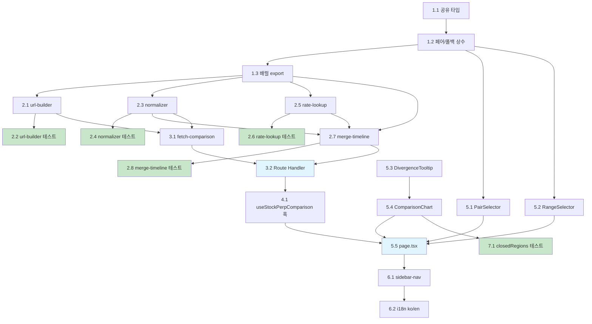

# Implementation Plan

본 구현 계획은 의존성 순서(공유 타입/상수 → 서버 `_lib` 순수 함수 → Route Handler → 훅 → UI 컴포넌트 → 네비/i18n → 테스트)에 따라 정리되었으며, 가능한 곳에서는 테스트 주도(TDD)로 진행한다. 각 작업은 requirements.md의 요구사항 ID(R1–R10)와 design.md의 해당 설계 섹션을 참조한다.

> **재사용 자산(새로 만들지 말 것):**
> - Hyperliquid candleSnapshot POST 패턴 `buildHyperliquidBody` (`apps/web/app/api/futures-dashboard/.../*`)
> - `Promise.allSettled` 병렬 fetch 패턴 (`fetch-indicator.ts`)
> - 서버 캐시 `getGlobalCache` / `getWithStale` / `buildCacheKey` (`app/api/exchange/_lib/cache.ts`)
> - `safeFloat` 정규화 (`normalizer.ts`)
> - `mergeTimeSeries` 버킷 정규화 + null-fill 패턴
> - Recharts 스마트 시간축 포맷터 + 100포인트 다운샘플링 (`charts/price-chart.tsx`)
> - `PeriodSelector` 버튼 패턴
> - `useMultiExchangeIndicator` 쿼리 패턴 (`hooks/useMultiExchangeIndicator.ts`)
> - `formatAlertPrice` / `EXCHANGE_CURRENCY_MAP` (`utils/currency.ts`)
> - Hyperliquid base URL `HYPERLIQUID_CONFIG.restBaseUrl`

---

## 1. 공유 타입 및 상수 정의

- [x] 1.1 비교 뷰 공유 타입 작성
  - `packages/shared/src/types/stock-perp.ts` 생성
  - `ComparisonRange`, `ComparisonInterval`, `ComparisonBaseCurrency`, `StockPerpPair`, `NormalizedCandle`, `RatePoint`, `ComparisonPoint`, `ComparisonResponse` 타입을 design.md "Core Data Structure Definitions"와 동일하게 정의
  - 각 필드 주석(통화/타임스탬프 단위, null 의미)을 그대로 반영
  - _Requirements: 1.2, 2.3, 3.3, 4.2, 5.1, 5.2, 6.2, 7.1_

- [x] 1.2 페어 설정 및 range→interval 폴백 상수 작성
  - `packages/shared/src/constants/stock-perp.ts` 생성
  - `PAIR_CONFIGS`(삼성전자/SK하이닉스/현대차 3개 페어), `DEFAULT_PAIR`(삼성전자), `DEFAULT_RANGE`(`5d`) 정의
  - `RANGE_TO_INTERVAL` 매핑(interval/fallbackInterval/perpLookbackMs)과 `KRX_SESSION`(09:00–15:30) 상수 정의
  - _Requirements: 1.1, 1.3, 2.5, 3.4, 7.1, 8.1, 8.5_

- [x] 1.3 shared 배럴 export 추가
  - `packages/shared/src/index.ts`에 `types/stock-perp`와 `constants/stock-perp` export 추가(기존 배럴 패턴 동일)
  - `pnpm --filter @*/shared build`(또는 tsc) 통과 확인
  - _Requirements: 10.3_

## 2. 서버 `_lib` 순수 함수 (정규화 / lookup / 병합) — 테스트 우선

- [x] 2.1 URL/Body 빌더 + range→interval 폴백 결정 함수 작성
  - `apps/web/app/api/stock-perp-comparison/_lib/url-builder.ts` 생성
  - Yahoo 주식 URL(`chart/{pair}?range&interval`), Yahoo 환율 URL(`chart/KRW=X?range&interval=1h`), Hyperliquid candleSnapshot body(`buildHyperliquidBody` 패턴, `xyz:` 접두사만, `dex` 없음) 생성 함수 구현
  - `RANGE_TO_INTERVAL`을 사용해 range로부터 interval/perpLookbackMs/startTime·endTime 도출, 폴백 interval 선택 헬퍼 노출
  - `HYPERLIQUID_CONFIG.restBaseUrl` 재사용
  - _Requirements: 2.1, 2.5, 3.1, 3.4, 4.1, 8.2, 8.4, 10.1_

- [x] 2.2 url-builder 폴백 단위 테스트
  - `apps/web/app/api/stock-perp-comparison/_lib/url-builder.spec.ts` 작성
  - range별 interval 선택, perp lookback 계산(startTime/endTime), 폴백 interval 전환 케이스 검증
  - _Requirements: 2.5, 8.2, 8.3, 8.4_

- [x] 2.3 Yahoo/Hyperliquid 정규화 함수 작성
  - `apps/web/app/api/stock-perp-comparison/_lib/normalizer.ts` 생성
  - `normalizeYahooCandles`: `chart.result[0].timestamp`(epoch s → ×1000), `indicators.quote[0]` OHLCV 추출, null 값은 보존(forward-fill 금지), `meta.currency=KRW`/`meta.exchangeTimezoneName=Asia/Seoul`/`meta.gmtoffset` 기록
  - `normalizeYahooRate`: `KRW=X` 응답을 `RatePoint[]`로 변환(close null 제거)
  - `normalizeHyperliquidCandles`: `{t,T,s,i,o,c,h,l,v,n}`에서 `t`(ms 그대로) + 문자열 OHLCV를 `safeFloat`로 number 변환, USD 기록
  - _Requirements: 2.2, 2.3, 2.4, 3.2, 3.3, 5.1, 5.2_

- [x] 2.4 normalizer 단위 테스트 (주식 + perp)
  - `apps/web/app/api/stock-perp-comparison/_lib/normalizer.spec.ts` 작성
  - 주식: timestamp ×1000, OHLCV null 값 보존(forward-fill 안 함), KRW/타임존/gmtoffset 기록 검증
  - perp: 문자열 OHLCV → number, `t`(ms) 그대로 유지, USD 기록 검증
  - _Requirements: 2.2, 2.4, 3.2, 3.3, 5.1_

- [x] 2.5 환율 시계열 정렬 + 최근접 직전 lookup 함수 작성
  - `apps/web/app/api/stock-perp-comparison/_lib/rate-lookup.ts` 생성
  - `RatePoint[]` timestamp 오름차순 정렬 후, 캔들 timestamp에 대해 binary search로 `ts <= candleTs`인 최대 인덱스(직전 값) 반환
  - step(계단식) 유지(보간 금지), 첫 포인트 이전이면 첫 rate 사용, 빈 배열이면 null 반환(경계 처리)
  - _Requirements: 4.3, 4.4_

- [x] 2.6 rate-lookup 단위 테스트
  - `apps/web/app/api/stock-perp-comparison/_lib/rate-lookup.spec.ts` 작성
  - 정확 일치 / 직전 값 / 첫 포인트 이전 경계 / 빈 배열 / step 유지(보간 안 함) 케이스 검증
  - _Requirements: 4.3, 4.4_

- [x] 2.7 타임라인 병합 + 통화 변환 + marketOpen/stockGap 도출 함수 작성
  - `apps/web/app/api/stock-perp-comparison/_lib/merge-timeline.ts` 생성
  - `mergeTimeSeries` 버킷 패턴 미러: `bucket = floor(ts / intervalMs) * intervalMs`로 주식/perp를 동일 버킷에 매핑, 한쪽 결측은 null 유지
  - 각 포인트에 rate-lookup 적용하여 `perpPrice = perpPriceRaw(USD) × appliedRate`(baseCurrency=KRW), 환율 결측 시 `appliedRate`/`perpPrice` = null
  - `marketOpen`(주식 close 존재 1차 기준 + `KRX_SESSION`/KST 요일 보조) 및 `stockGap`(직전 개장 → 현재 결측 시작점) 도출, timestamp 오름차순 정렬
  - KST 변환은 `gmtoffset`(32400) 또는 `Asia/Seoul` `Intl.DateTimeFormat`으로 DST 영향 없이 처리
  - _Requirements: 4.2, 5.3, 5.5, 6.2, 6.3, 7.1, 7.2_

- [x] 2.8 merge-timeline + 통화 변환 단위 테스트
  - `apps/web/app/api/stock-perp-comparison/_lib/merge-timeline.spec.ts` 작성
  - 동일 버킷 매핑, 한쪽 결측 시 null 유지, 정렬, `marketOpen`/`stockGap` 도출 검증
  - 통화 변환: `perpKRW = perpUSD × rate` 정확성, 환율 결측 시 `perpPrice`=null 검증
  - _Requirements: 4.2, 5.3, 5.5, 6.2, 7.1_

## 3. 병렬 fetch 및 Route Handler 통합

- [x] 3.1 allSettled 병렬 fetch + 부분 실패/폴백 재시도 함수 작성
  - `apps/web/app/api/stock-perp-comparison/_lib/fetch-comparison.ts` 생성 (`fetch-indicator.ts` 미러)
  - 주식/환율/perp 3소스를 `Promise.allSettled`로 병렬 fetch, 소스별 성공/실패를 `errors.{stock,perp,rate}`로 분리
  - Yahoo 429/throttle 시 1회 지수 백오프 재시도, Yahoo 빈/422 응답 시 `fallbackInterval`로 1회 재시도하고 `fallbackApplied=true`/`appliedInterval` 세팅
  - _Requirements: 2.5, 8.3, 9.2, 9.3, 9.4, 9.5, 10.1_

- [x] 3.2 Route Handler GET 엔드포인트 작성
  - `apps/web/app/api/stock-perp-comparison/route.ts` 생성 (`futures-dashboard/[indicator]/route.ts` 미러)
  - `pair`/`range` 쿼리 파싱·검증(미지정 시 기본값), `PAIR_CONFIGS`로 perp 코인 결정
  - `fetch-comparison` → `normalizer` → `rate-lookup` → `merge-timeline` 파이프라인으로 `ComparisonResponse` 조립
  - `buildCacheKey('spc', pair, { range })` + `getWithStale`로 서버 캐시/스테일 폴백, 에러는 `{ success:false, error:{ message, code } }` + 적절한 status(한국어 메시지)
  - _Requirements: 1.2, 4.5, 8.3, 9.2, 9.4, 9.6, 10.1, 10.4_

## 4. 데이터 패칭 훅

- [x] 4.1 useStockPerpComparison 훅 작성
  - `apps/web/hooks/useStockPerpComparison.ts` 생성 (`useMultiExchangeIndicator` 패턴 미러)
  - `queryKey: ['stock-perp-comparison', pair, range]`, `queryFn`으로 Route Handler 호출
  - `staleTime`(1d/5d=60s, 그 외=600s), `refetchInterval:false`, `retry:2` + 지수 백오프, `placeholderData:(prev)=>prev`(전환 깜빡임 방지)
  - _Requirements: 1.5, 10.4_

## 5. UI 컴포넌트 및 라우트

- [x] 5.1 PairSelector 컴포넌트 작성
  - `apps/web/app/(dashboard)/stock-perp-comparison/components/pair-selector.tsx` 생성 (`PeriodSelector` 버튼 패턴)
  - `PAIR_CONFIGS`를 `nameKo`(한국어 종목명) 버튼으로 렌더, 선택 시 콜백
  - _Requirements: 1.1, 1.4_

- [x] 5.2 RangeSelector 컴포넌트 작성
  - `apps/web/app/(dashboard)/stock-perp-comparison/components/range-selector.tsx` 생성 (`PeriodSelector` 버튼 패턴)
  - 한국어 라벨(1일/5일/1개월/6개월/1년) ↔ 내부 Yahoo 토큰(`1d/5d/1mo/6mo/1y`) 매핑으로 버튼 렌더
  - _Requirements: 8.1, 8.2, 8.5_

- [x] 5.3 DivergenceTooltip 컴포넌트 작성
  - `apps/web/app/(dashboard)/stock-perp-comparison/components/divergence-tooltip.tsx` 생성
  - 호버 시각의 주식가(KRW), perp가(KRW 변환 + 원본 USD), 적용 환율, 괴리(perp − stock, (perp/stock − 1)×100%)를 한국어로 표시, `formatAlertPrice` 재사용
  - _Requirements: 4.5, 6.5, 10.2_

- [x] 5.4 ComparisonChart 오버레이 차트 컴포넌트 작성
  - `apps/web/app/(dashboard)/stock-perp-comparison/components/comparison-chart.tsx` 생성 (Recharts `ComposedChart`)
  - `<Line dataKey="stockPrice" connectNulls={false} dot={false} />`(휴장 갭), `<Line dataKey="perpPrice" connectNulls dot={false} />`(연속), `<Legend>` 색상 구분
  - XAxis KST 시간축 포맷터(`price-chart.tsx` 스마트 포맷터 + `Intl.DateTimeFormat('ko-KR',{timeZone:'Asia/Seoul'})`), YAxis "KRW" 단위 명시
  - `marketOpen=false` 연속 구간을 `closedRegions {x1,x2}`로 `useMemo` 계산하여 `<ReferenceArea>` 음영 렌더, `showClosedShading` 로컬 state + 토글 버튼(기본 ON)
  - `stockGap=true` 경계를 강제 보존하는 100포인트 다운샘플러 적용, `isAnimationActive={false}`
  - `<Tooltip content={<DivergenceTooltip />} />` 연결
  - _Requirements: 6.1, 6.2, 6.3, 6.4, 6.5, 6.6, 7.1, 7.2, 7.3, 10.3, 10.5_

- [x] 5.5 page.tsx 라우트 + 상태/에러/빈 상태 처리
  - `apps/web/app/(dashboard)/stock-perp-comparison/page.tsx` 생성 (`'use client'`, `futures-dashboard/page.tsx` 미러)
  - `useSearchParams`로 `pair`/`range` URL 동기화(기본 `005930.KS`/`5d`), 페어 변경 시 range 유지
  - `useStockPerpComparison` 연결, PairSelector/RangeSelector/ComparisonChart 배치, 적용 환율 헤더 표기
  - 상태별 UI: 로딩 스켈레톤, 주식 실패+재시도 버튼, perp 없음 배너(주식 단독 렌더), 환율 실패 안내, 부분 렌더 누락 배너, 빈 상태, `fallbackApplied` 폴백 안내(모두 한국어)
  - _Requirements: 1.3, 1.5, 4.5, 8.1, 8.3, 9.1, 9.2, 9.3, 9.4, 9.5, 9.6, 10.2_

## 6. 네비게이션 및 i18n 통합

- [x] 6.1 사이드바 네비게이션 항목 추가
  - `apps/web/components/layout/sidebar-nav.tsx`의 `NAV_SECTIONS` 마켓 섹션에 `{ labelKey: 'stockPerpComparison', href: '/stock-perp-comparison', icon: ChartCandlestick }`를 `futures-dashboard` 바로 아래 추가
  - `NAV_ITEMS`/하단 탭 자동 파생 확인
  - _Requirements: 10.3_

- [x] 6.2 i18n 키 추가 (ko + en)
  - `apps/web/lib/i18n/ko.ts`의 `nav`에 `stockPerpComparison: '주식·선물 비교'` 추가
  - 영어 로케일 파일에도 동일 키 추가
  - _Requirements: 10.2, 10.3_

## 7. 컴포넌트 보강 테스트 (선택)

- [x] 7.1 closedRegions / 다운샘플링 경계 보존 테스트
  - `comparison-chart`의 `closedRegions` 계산, `stockGap` 경계 보존 다운샘플러를 순수 함수로 추출하여 단위 테스트 작성
  - 연속 휴장 구간 묶기, 샘플링 후 갭/음영 경계 유지 검증
  - _Requirements: 6.2, 7.1, 10.5_

---

## Tasks Dependency Diagram

