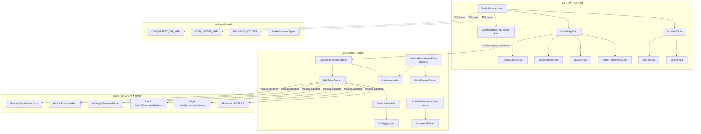
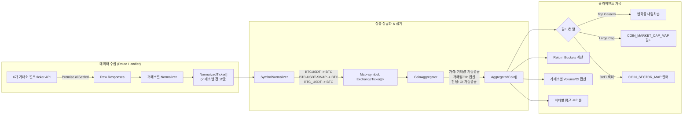
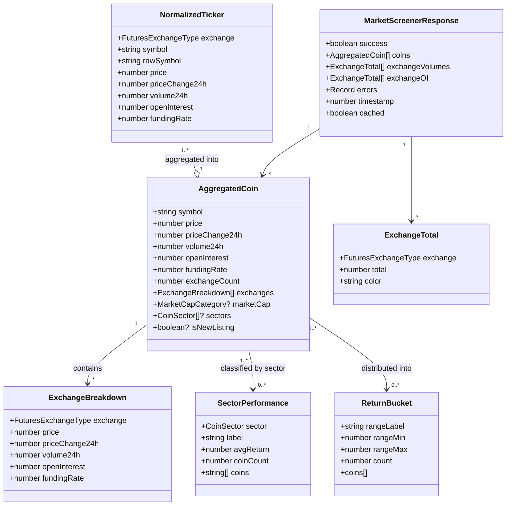
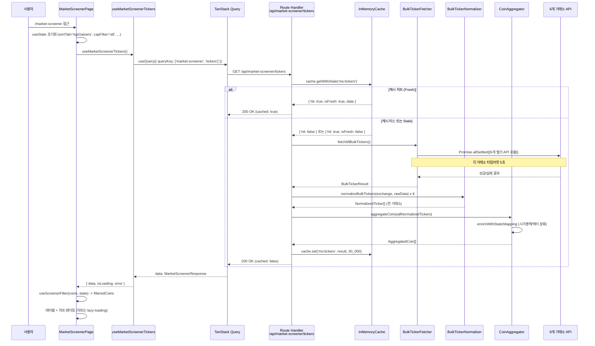
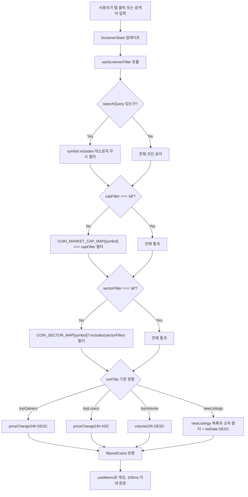
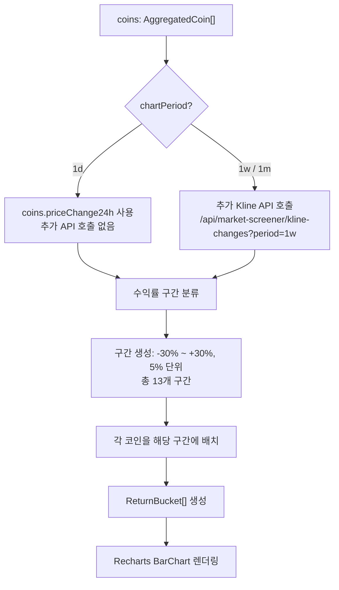
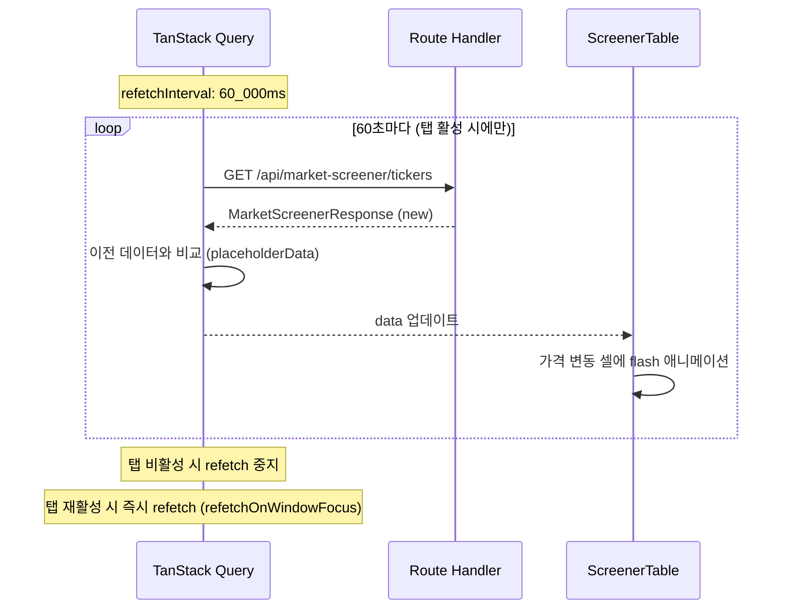
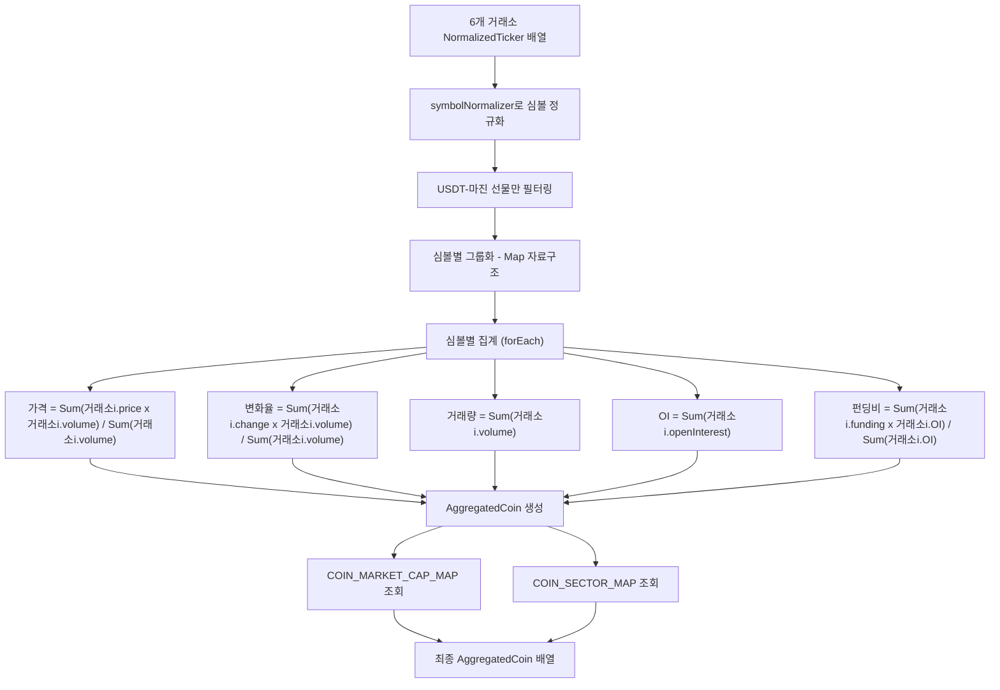
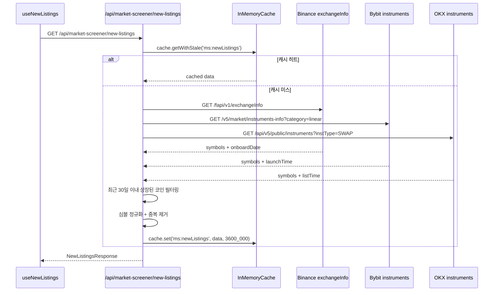
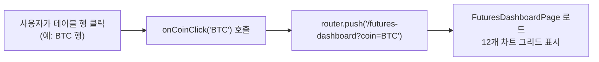

# Velo Market Screener - 설계 문서

## 1. 개요

Velo Market Screener는 6개 거래소(Binance, Bybit, OKX, Gate.io, Bitget, Hyperliquid)의 250+ 선물 코인 데이터를 집계하여 마켓 와이드 스크리너를 제공하는 Phase 1 프론트엔드 중심 기능이다.

**설계 목표:**
- 기존 `futures-dashboard`의 **개별 코인** 심층 분석 vs 본 스크리너의 **전체 시장** 개요라는 상호보완적 구조
- 기존 Route Handler 패턴(`Promise.allSettled`, normalizer, InMemoryCache)을 최대한 재사용
- 벌크 ticker API 1회 호출로 전 코인 데이터 수집 (코인별 개별 호출 지양)
- 정적 매핑(시가총액/섹터)으로 외부 API 의존성 제거

**범위:**

| 포함 | 제외 (Phase 2+) |
|---|---|
| 스크리너 테이블 (정렬/필터/검색) | Price Changes 시계열 차트 |
| Return Buckets 히스토그램 | Funding Heatmap |
| Market Volume 바 차트 | OI Changes 시계열 |
| Total Open Interest 바 차트 | Liquidations Heatmap |
| Sector Performance 바 차트 | CVD (OI-Normalized) |
| 정적 매핑 (시가총액/섹터) | CoinGecko 자동 분류 |
| New Listings 감지 | TradFi 자산 카테고리 |

---

## 2. 아키텍처 설계

### 2.1 시스템 아키텍처 다이어그램



### 2.2 데이터 흐름 다이어그램



### 2.3 기존 패턴과의 관계

| 측면 | futures-dashboard (기존) | market-screener (신규) |
|---|---|---|
| **데이터 단위** | 개별 코인 (BTC, ETH...) | 전체 코인 (250+) |
| **API 호출 방식** | 코인별 개별 API 호출 | 벌크 ticker API 1회 호출 |
| **Route Handler** | `/api/futures-dashboard/[indicator]?coin=BTC` | `/api/market-screener/tickers` |
| **캐시 전략** | 지표별 TTL (30s ~ 10m) | 단일 TTL 30s |
| **정규화** | 지표별 normalizer | 벌크 ticker 전용 normalizer |
| **공통 재사용** | - | `InMemoryCache`, `EXCHANGE_COLORS`, `FuturesExchangeType` |

**설계 결정: 별도 Route Handler 신설**

기존 `futures-dashboard`의 `fetch-indicator.ts`는 **코인별 개별 API 호출** 패턴이다 (`buildIndicatorUrl(exchange, indicator, coin)`). 마켓 스크리너는 **벌크 ticker API 1회 호출**로 전 코인 데이터를 가져오는 완전히 다른 패턴이므로, 기존 코드를 억지로 확장하지 않고 `/api/market-screener/` 아래에 전용 Route Handler를 신설한다. 다만 `InMemoryCache`, `EXCHANGE_COLORS`, `FuturesExchangeType` 등 공통 인프라는 재사용한다.

---

## 3. 컴포넌트 설계

### 3.1 Route Handler 계층

#### 3.1.1 `BulkTickerFetcher`

- **위치:** `apps/web/app/api/market-screener/_lib/bulk-ticker-fetcher.ts`
- **책임:** 6개 거래소의 벌크 ticker API를 병렬 호출하여 raw 응답을 수집
- **인터페이스:**
  ```typescript
  async function fetchAllBulkTickers(): Promise<BulkTickerResult>
  
  interface BulkTickerResult {
    tickers: Map<FuturesExchangeType, RawExchangeTicker[]>;
    errors: Partial<Record<FuturesExchangeType, string>>;
    timestamp: number;
  }
  ```
- **의존성:** `BULK_TICKER_CONFIGS` (URL/method 설정), `Promise.allSettled`, `AbortSignal.timeout(5000)`

#### 3.1.2 `BulkTickerNormalizer`

- **위치:** `apps/web/app/api/market-screener/_lib/bulk-ticker-normalizer.ts`
- **책임:** 각 거래소의 서로 다른 응답 포맷을 `NormalizedTicker` 통일 스키마로 변환
- **인터페이스:**
  ```typescript
  function normalizeBulkTickers(
    exchange: FuturesExchangeType,
    rawData: unknown
  ): NormalizedTicker[]
  ```
- **의존성:** `normalizeSymbol()` (심볼 정규화 유틸)

#### 3.1.3 `SymbolNormalizer`

- **위치:** `apps/web/app/api/market-screener/_lib/symbol-normalizer.ts`
- **책임:** 거래소별 다른 심볼 형식을 공통 base asset 형식으로 변환
- **인터페이스:**
  ```typescript
  function normalizeSymbol(exchange: FuturesExchangeType, rawSymbol: string): string | null
  // null 반환 = USDT-마진 선물이 아닌 경우 (필터링)
  ```
- **변환 규칙:**
  | 거래소 | 입력 예시 | 출력 |
  |---|---|---|
  | Binance | `BTCUSDT` | `BTC` |
  | Bybit | `BTCUSDT` | `BTC` |
  | OKX | `BTC-USDT-SWAP` | `BTC` |
  | Gate.io | `BTC_USDT` | `BTC` |
  | Bitget | `BTCUSDT` | `BTC` |
  | Hyperliquid | `BTC` | `BTC` |
- **필터:** USDT-마진 선물만 통과, COIN-마진/기타 제외. `null` 반환 시 해당 항목 스킵.

#### 3.1.4 `CoinAggregator`

- **위치:** `apps/web/app/api/market-screener/_lib/coin-aggregator.ts`
- **책임:** 동일 심볼의 거래소별 데이터를 하나의 집계 행으로 병합
- **인터페이스:**
  ```typescript
  function aggregateCoins(
    allTickers: NormalizedTicker[]
  ): AggregatedCoin[]
  ```
- **집계 공식:**
  - `price` = Sum(거래소_i.price * 거래소_i.volume24h) / Sum(거래소_i.volume24h)
  - `priceChange24h` = Sum(거래소_i.priceChange24h * 거래소_i.volume24h) / Sum(거래소_i.volume24h)
  - `volume24h` = Sum(거래소_i.volume24h)
  - `openInterest` = Sum(거래소_i.openInterest)
  - `fundingRate` = Sum(거래소_i.fundingRate * 거래소_i.openInterest) / Sum(거래소_i.openInterest)

#### 3.1.5 `bulkTickerUrlBuilder`

- **위치:** `apps/web/app/api/market-screener/_lib/url-builder.ts`
- **책임:** 거래소별 벌크 ticker API URL 생성
- **설계 결정:** 기존 `futures-dashboard` url-builder는 개별 코인 URL을 생성하지만, 마켓 스크리너는 전체 코인 벌크 URL을 생성한다.
- **인터페이스:**
  ```typescript
  function buildBulkTickerUrl(exchange: FuturesExchangeType): { url: string; method: string; body?: string }
  ```

#### 3.1.6 `KlineChangesRouteHandler`

- **경로:** `apps/web/app/api/market-screener/kline-changes/route.ts`
- **책임:** 1w/1m Return Buckets를 위한 Kline 기반 가격 변화율 계산
- **인터페이스:**
  ```
  GET /api/market-screener/kline-changes?period=1w
  Response: KlineChangesResponse
  ```
- **설계 결정:** 250개 코인 x 6개 거래소 Kline 호출은 비현실적이므로, Binance 단일 거래소에서 주요 코인 Kline을 가져와 변화율을 계산한다. 서버 캐시(5분 TTL)로 반복 호출을 방지한다.

### 3.2 프론트엔드 컴포넌트 계층

#### 3.2.1 `MarketScreenerPage`

- **위치:** `apps/web/app/(dashboard)/market-screener/page.tsx`
- **책임:** Server Component로 메타데이터 설정, Client Component(`MarketScreenerClient`)에 위임
- **Client 상태:**
  ```typescript
  interface ScreenerState {
    sortTab: SortTab;              // 'topGainers' | 'topLosers' | 'topVolume' | 'newListings'
    capFilter: CapFilter;          // 'all' | 'large' | 'mid' | 'small'
    sectorFilter: SectorFilter;    // 'all' | 'DeFi' | 'L1' | 'L2' | 'Metaverse' | 'Meme' | 'Dino' | 'AI'
    searchQuery: string;
    chartPeriod: ChartPeriod;      // '1d' | '1w' | '1m'
  }
  ```
- **의존성:** `useMarketScreenerTickers`, `useNewListings`, `useScreenerFilter`, `COIN_MARKET_CAP_MAP`, `COIN_SECTOR_MAP`

#### 3.2.2 `ScreenerTable`

- **위치:** `apps/web/app/(dashboard)/market-screener/components/screener-table.tsx`
- **책임:** 250+ 코인 데이터를 가상화된 테이블로 렌더링
- **인터페이스:**
  ```typescript
  interface ScreenerTableProps {
    coins: AggregatedCoin[];
    sortColumn: SortColumn;
    sortDirection: 'asc' | 'desc';
    onSort: (column: SortColumn) => void;
    onCoinClick: (symbol: string) => void;
    isLoading: boolean;
  }
  ```
- **의존성:** `@tanstack/react-virtual` (가상 스크롤), 기존 shadcn/ui Table 컴포넌트
- **성능:** 250+ 행 -> 뷰포트 내 20~30행만 렌더

#### 3.2.3 `TabFilterBar`

- **위치:** `apps/web/app/(dashboard)/market-screener/components/tab-filter-bar.tsx`
- **책임:** 3개 탭 그룹(정렬/시가총액/섹터) 렌더링 및 상태 전달
- **인터페이스:**
  ```typescript
  interface TabFilterBarProps {
    sortTab: SortTab;
    onSortTabChange: (tab: SortTab) => void;
    capFilter: CapFilter;
    onCapFilterChange: (filter: CapFilter) => void;
    sectorFilter: SectorFilter;
    onSectorFilterChange: (filter: SectorFilter) => void;
  }
  ```
- **의존성:** shadcn/ui `Tabs` 컴포넌트

#### 3.2.4 `SearchInput`

- **위치:** `apps/web/app/(dashboard)/market-screener/components/search-input.tsx`
- **책임:** 심볼/이름 검색 입력 (300ms debounce)
- **인터페이스:**
  ```typescript
  interface SearchInputProps {
    value: string;
    onChange: (query: string) => void;
  }
  ```

#### 3.2.5 `ChartWidgetGrid`

- **위치:** `apps/web/app/(dashboard)/market-screener/components/chart-widget-grid.tsx`
- **책임:** 4개 차트 위젯을 반응형 그리드로 배치 (데스크톱 2x2, 태블릿 2열, 모바일 1열)
- **인터페이스:**
  ```typescript
  interface ChartWidgetGridProps {
    coins: AggregatedCoin[];
    period: ChartPeriod;
    onPeriodChange: (period: ChartPeriod) => void;
  }
  ```

#### 3.2.6 차트 위젯 (4개)

모든 차트는 `next/dynamic`으로 lazy loading하여 초기 번들 크기를 최소화한다.

| 컴포넌트 | 위치 | 차트 타입 | 데이터 소스 |
|---|---|---|---|
| `ReturnBucketsChart` | `components/charts/return-buckets-chart.tsx` | Recharts BarChart | `coins[].priceChange24h` 구간 분류 |
| `MarketVolumeChart` | `components/charts/market-volume-chart.tsx` | Recharts BarChart | `coins[].exchanges[].volume24h` 거래소별 합산 |
| `TotalOIChart` | `components/charts/total-oi-chart.tsx` | Recharts BarChart | `coins[].exchanges[].openInterest` 거래소별 합산 |
| `SectorPerformanceChart` | `components/charts/sector-performance-chart.tsx` | Recharts BarChart | `COIN_SECTOR_MAP` + `coins[].priceChange24h` 섹터 평균 |

각 차트 컴포넌트 인터페이스:

```typescript
interface ReturnBucketsChartProps {
  coins: AggregatedCoin[];
  period: '1d' | '1w' | '1m';
  onPeriodChange: (period: string) => void;
}

interface MarketVolumeChartProps {
  exchangeVolumes: ExchangeTotal[];
}

interface TotalOIChartProps {
  exchangeOI: ExchangeTotal[];
}

interface SectorPerformanceChartProps {
  sectorData: SectorPerformance[];
  period: '1d' | '1w' | '1m';
  onPeriodChange: (period: string) => void;
}
```

#### 3.2.7 `ErrorBanner`

- **위치:** `apps/web/app/(dashboard)/market-screener/components/error-banner.tsx`
- **책임:** 거래소 에러 경고 배너 (부분 실패 시)
- **표시 조건:**
  1. `errors` 객체에 키가 1개 이상 -> "일부 거래소 데이터 누락" 경고
  2. `timestamp`가 2분 이상 경과 -> "데이터 갱신 지연" 경고
  3. 모든 거래소 실패 -> 전체 에러 화면 + 재시도 버튼

#### 3.2.8 `DataFreshnessBadge`

- **위치:** `apps/web/app/(dashboard)/market-screener/components/data-freshness-badge.tsx`
- **책임:** 마지막 갱신 시간 표시 및 2분 초과 시 경고 배지

### 3.3 Hooks

#### 3.3.1 `useMarketScreenerTickers`

- **위치:** `apps/web/hooks/useMarketScreenerTickers.ts`
- **책임:** TanStack Query로 `/api/market-screener/tickers` 호출, 캐싱, 자동 갱신
- **인터페이스:**
  ```typescript
  function useMarketScreenerTickers(options?: {
    enabled?: boolean;
  }): UseQueryResult<MarketScreenerResponse>
  ```
- **TanStack Query 설정:**
  - `staleTime`: 30_000 (30초)
  - `refetchInterval`: 60_000 (60초)
  - `refetchOnWindowFocus`: true
  - `refetchIntervalInBackground`: false (탭 비활성 시 중지)
  - `retry`: 2
  - `placeholderData`: keepPreviousData

#### 3.3.2 `useNewListings`

- **위치:** `apps/web/hooks/useNewListings.ts`
- **책임:** `/api/market-screener/new-listings` 호출, 신규 상장 코인 목록 제공
- **인터페이스:**
  ```typescript
  function useNewListings(): UseQueryResult<NewListingCoin[]>
  ```
- **TanStack Query 설정:**
  - `staleTime`: 600_000 (10분)
  - `refetchInterval`: 없음 (수동 갱신만)

#### 3.3.3 `useScreenerFilter`

- **위치:** `apps/web/hooks/useScreenerFilter.ts`
- **책임:** 필터/정렬/검색 로직을 순수 함수로 분리한 커스텀 훅
- **인터페이스:**
  ```typescript
  function useScreenerFilter(
    coins: AggregatedCoin[],
    state: ScreenerState,
    newListings: NewListingCoin[]
  ): FilteredResult
  
  interface FilteredResult {
    filteredCoins: AggregatedCoin[];
    totalCount: number;
    filteredCount: number;
  }
  ```
- **의존성:** `COIN_MARKET_CAP_MAP`, `COIN_SECTOR_MAP` (정적 import), `useMemo`로 최적화

### 3.4 공유 데이터 레이어 (`packages/shared`)

#### 3.4.1 정적 매핑 - 코인 분류

- **파일:** `packages/shared/src/constants/market-screener.ts`
- **책임:** 시가총액 분류, 섹터 분류, 거래소 색상, 벌크 API 설정 등 상수 관리

#### 3.4.2 타입 정의

- **파일:** `packages/shared/src/types/market-screener.ts`
- **책임:** 마켓 스크리너 전용 타입 정의

---

## 4. 데이터 모델

### 4.1 핵심 데이터 구조 정의

```typescript
// ===== packages/shared/src/types/market-screener.ts =====

import type { FuturesExchangeType } from './futures';

/** 정렬 탭 종류 */
export type SortTab = 'topGainers' | 'topLosers' | 'topVolume' | 'newListings';

/** 시가총액 필터 */
export type CapFilter = 'all' | 'large' | 'mid' | 'small';

/** 섹터 필터 */
export type SectorFilter = 'all' | 'DeFi' | 'L1' | 'L2' | 'Metaverse' | 'Meme' | 'Dino' | 'AI';

/** 차트 기간 (Return Buckets, Sector Performance용) */
export type ChartPeriod = '1d' | '1w' | '1m';

/** 시가총액 분류 */
export type MarketCapCategory = 'large' | 'mid' | 'small';

/** 섹터 종류 */
export type CoinSector = 'DeFi' | 'L1' | 'L2' | 'Metaverse' | 'Meme' | 'Dino' | 'AI';

/** 테이블 정렬 컬럼 */
export type SortColumn = 'symbol' | 'price' | 'change24h' | 'volume24h' | 'openInterest' | 'fundingRate';

/** 정규화된 개별 거래소 ticker */
export interface NormalizedTicker {
  exchange: FuturesExchangeType;
  symbol: string;          // 정규화된 심볼 (예: "BTC")
  rawSymbol: string;       // 원본 심볼 (예: "BTCUSDT")
  price: number;
  priceChange24h: number;  // 소수 (0.05 = +5%)
  volume24h: number;       // USD
  openInterest: number;    // USD, 없으면 0
  fundingRate: number;     // 8h 기준 소수, 없으면 0
}

/** 거래소별 세부 데이터 */
export interface ExchangeBreakdown {
  exchange: FuturesExchangeType;
  price: number;
  priceChange24h: number;
  volume24h: number;
  openInterest: number;
  fundingRate: number;
}

/** 집계된 코인 데이터 (테이블 1행) */
export interface AggregatedCoin {
  symbol: string;                    // "BTC"
  price: number;                     // 거래량 가중 평균
  priceChange24h: number;            // 거래량 가중 평균
  volume24h: number;                 // 합산
  openInterest: number;              // 합산
  fundingRate: number;               // OI 가중 평균
  exchangeCount: number;             // 데이터 제공 거래소 수
  exchanges: ExchangeBreakdown[];    // 거래소별 개별
  listedExchanges: FuturesExchangeType[]; // 데이터가 존재하는 거래소 목록
  marketCap?: MarketCapCategory;     // 시가총액 분류 (정적 매핑)
  sectors?: CoinSector[];            // 섹터 분류 (정적 매핑)
  isNewListing?: boolean;            // 신규 상장 여부
  listingDate?: string;              // 상장일 (ISO string, 있으면)
}

/** 거래소별 총량 데이터 (Volume/OI 바 차트) */
export interface ExchangeTotal {
  exchange: FuturesExchangeType;
  total: number;          // USD
  color: string;          // EXCHANGE_COLORS[exchange]
}

/** 마켓 스크리너 API 응답 */
export interface MarketScreenerResponse {
  success: boolean;
  data: {
    coins: AggregatedCoin[];
    exchangeVolumes: ExchangeTotal[];
    exchangeOI: ExchangeTotal[];
    timestamp: number;
  };
  errors: Partial<Record<FuturesExchangeType, string>>;
  exchangeCount: number;           // 성공한 거래소 수
  cached: boolean;
}

/** 신규 상장 코인 정보 */
export interface NewListingCoin {
  symbol: string;
  exchange: FuturesExchangeType;
  listDate: string;                // ISO 날짜 (예: "2026-05-20")
  daysAgo: number;                 // 상장 후 경과일
}

/** Return Bucket 데이터 (히스토그램 1개 막대) */
export interface ReturnBucket {
  rangeLabel: string;     // 예: "-10% ~ -5%"
  rangeMin: number;       // -0.10
  rangeMax: number;       // -0.05
  count: number;          // 해당 구간 코인 수
  coins: Array<{          // 해당 구간 코인 목록
    symbol: string;
    change: number;
  }>;
}

/** 섹터별 성과 데이터 */
export interface SectorPerformance {
  sector: CoinSector;
  label: string;          // 표시 이름 (예: "DeFi")
  avgReturn: number;      // 평균 수익률 (소수)
  coinCount: number;      // 포함 코인 수
  coins: string[];        // 구성 코인 심볼 목록
}

/** New Listings API 응답 */
export interface NewListingsResponse {
  success: boolean;
  data: NewListingCoin[];
  timestamp: number;
  cached: boolean;
}

/** Kline 변화율 API 응답 */
export interface KlineChangesResponse {
  success: boolean;
  data: Record<string, number>;  // symbol -> 변화율 (소수)
  period: '1w' | '1m';
  timestamp: number;
  cached: boolean;
}
```

### 4.2 정적 매핑 데이터 구조

```typescript
// ===== packages/shared/src/constants/market-screener.ts =====

import type { MarketCapCategory, CoinSector } from '../types/market-screener';
import type { FuturesExchangeType } from '../types/futures';

/** 시가총액 분류 매핑 (250+ 코인) */
export const COIN_MARKET_CAP_MAP: Record<string, MarketCapCategory> = {
  // Large Cap ($10B+)
  BTC: 'large', ETH: 'large', SOL: 'large', BNB: 'large', XRP: 'large',
  DOGE: 'large', ADA: 'large', AVAX: 'large', TRX: 'large', LINK: 'large',
  TON: 'large', DOT: 'large', SUI: 'large', SHIB: 'large',
  // Mid Cap ($1B ~ $10B)
  NEAR: 'mid', UNI: 'mid', APT: 'mid', ARB: 'mid', OP: 'mid',
  FIL: 'mid', AAVE: 'mid', MKR: 'mid', ATOM: 'mid', RENDER: 'mid',
  FET: 'mid', INJ: 'mid', SEI: 'mid', STX: 'mid', IMX: 'mid',
  PEPE: 'mid', WIF: 'mid', BONK: 'mid', FLOKI: 'mid', TAO: 'mid',
  MATIC: 'mid', LTC: 'mid', BCH: 'mid', ETC: 'mid', HBAR: 'mid',
  LDO: 'mid', TIA: 'mid',
  // Small Cap (<$1B)
  // ... (실제 구현 시 250+ 코인 전체 매핑)
};

/** 섹터 분류 매핑 (복수 섹터 가능) */
export const COIN_SECTOR_MAP: Record<string, CoinSector[]> = {
  // DeFi
  AAVE: ['DeFi'], UNI: ['DeFi'], MKR: ['DeFi'], CRV: ['DeFi'],
  COMP: ['DeFi'], SNX: ['DeFi'], SUSHI: ['DeFi'], YFI: ['DeFi'],
  '1INCH': ['DeFi'], JUP: ['DeFi'], DYDX: ['DeFi'], PENDLE: ['DeFi'],
  LDO: ['DeFi'], GMX: ['DeFi'],
  // L1
  BTC: ['L1', 'Dino'], ETH: ['L1', 'Dino'], SOL: ['L1'], BNB: ['L1'],
  ADA: ['L1'], AVAX: ['L1'], DOT: ['L1'], ATOM: ['L1'], NEAR: ['L1', 'AI'],
  APT: ['L1'], SUI: ['L1'], SEI: ['L1'], INJ: ['L1'], TON: ['L1'],
  // L2
  ARB: ['L2'], OP: ['L2'], MATIC: ['L2'], ZK: ['L2'], STRK: ['L2'], MNT: ['L2'], IMX: ['L2'],
  // Metaverse / Gaming
  SAND: ['Metaverse'], MANA: ['Metaverse'], AXS: ['Metaverse'],
  GALA: ['Metaverse'], ENJ: ['Metaverse'], RONIN: ['Metaverse'],
  // Meme
  DOGE: ['Meme', 'Dino'], SHIB: ['Meme'], PEPE: ['Meme'], BONK: ['Meme'],
  WIF: ['Meme'], POPCAT: ['Meme'], FLOKI: ['Meme'],
  // Dino (2017년 이전 출시)
  LTC: ['Dino'], XRP: ['Dino', 'L1'], XLM: ['Dino'], XMR: ['Dino'],
  ZEC: ['Dino'], DASH: ['Dino'], ETC: ['Dino'],
  // AI
  FET: ['AI'], RENDER: ['AI'], TAO: ['AI'],
};

/** 섹터 표시 라벨 */
export const SECTOR_LABELS: Record<CoinSector, string> = {
  DeFi: 'DeFi',
  L1: 'Layer 1',
  L2: 'Layer 2',
  Metaverse: 'Metaverse',
  Meme: 'Meme',
  Dino: 'Dino',
  AI: 'AI',
};

/** 마켓 스크리너 기간 옵션 */
export type ScreenerPeriod = '1d' | '1w' | '1m';

/** 거래소별 벌크 API 설정 */
export const BULK_TICKER_CONFIGS: Record<FuturesExchangeType, {
  url: string;
  method: 'GET' | 'POST';
  body?: string;
}> = {
  binance: {
    url: 'https://fapi.binance.com/fapi/v1/ticker/24hr',
    method: 'GET',
  },
  bybit: {
    url: 'https://api.bybit.com/v5/market/tickers?category=linear',
    method: 'GET',
  },
  okx: {
    url: 'https://www.okx.com/api/v5/market/tickers?instType=SWAP',
    method: 'GET',
  },
  gate: {
    url: 'https://api.gateio.ws/api/v4/futures/usdt/tickers',
    method: 'GET',
  },
  bitget: {
    url: 'https://api.bitget.com/api/v2/mix/market/tickers?productType=USDT-FUTURES',
    method: 'GET',
  },
  hyperliquid: {
    url: 'https://api.hyperliquid.xyz/info',
    method: 'POST',
    body: JSON.stringify({ type: 'metaAndAssetCtxs' }),
  },
};
```

### 4.3 데이터 모델 관계도



---

## 5. 비즈니스 프로세스

### 5.1 프로세스 1: 페이지 초기 로드 및 데이터 수집



### 5.2 프로세스 2: 탭 필터 및 검색 적용



### 5.3 프로세스 3: Return Buckets 계산



### 5.4 프로세스 4: 자동 갱신 및 변동 감지



### 5.5 프로세스 5: 집계 알고리즘 상세



### 5.6 프로세스 6: New Listings 감지



### 5.7 프로세스 7: 코인 행 클릭 -> futures-dashboard 이동



---

## 6. 거래소별 벌크 Ticker API 정규화 상세

### 6.1 Binance

```
GET https://fapi.binance.com/fapi/v1/ticker/24hr
```

| 원본 필드 | 매핑 대상 | 변환 |
|---|---|---|
| `symbol` | `rawSymbol` | 그대로 (예: `"BTCUSDT"`) |
| `symbol` | `symbol` | USDT 접미사 제거 |
| `lastPrice` | `price` | `parseFloat` |
| `priceChangePercent` | `priceChange24h` | `parseFloat / 100` (% -> 소수) |
| `quoteVolume` | `volume24h` | `parseFloat` |
| - | `openInterest` | 0 (벌크 ticker에 미포함, Phase 1에서 다른 거래소 OI로 보충) |
| - | `fundingRate` | 0 (벌크 ticker에 미포함) |

**주의:** Binance의 벌크 24hr ticker에는 OI와 펀딩이 포함되지 않는다. 이를 보충하기 위해 `GET /fapi/v1/premiumIndex` (전 코인 벌크, weight 10)를 추가 호출하여 `lastFundingRate`를 수집하고, OI는 Phase 1에서 다른 거래소 데이터로 보충한다.

### 6.2 Bybit

```
GET https://api.bybit.com/v5/market/tickers?category=linear
```

| 원본 필드 | 매핑 대상 | 변환 |
|---|---|---|
| `result.list[].symbol` | `rawSymbol` / `symbol` | USDT 접미사 제거 |
| `result.list[].lastPrice` | `price` | `parseFloat` |
| `result.list[].price24hPcnt` | `priceChange24h` | `parseFloat` (이미 소수) |
| `result.list[].turnover24h` | `volume24h` | `parseFloat` |
| `result.list[].openInterest` | `openInterest` | `parseFloat * lastPrice` (코인 -> USD 변환) |
| `result.list[].fundingRate` | `fundingRate` | `parseFloat` |

### 6.3 OKX

```
GET https://www.okx.com/api/v5/market/tickers?instType=SWAP
```

| 원본 필드 | 매핑 대상 | 변환 |
|---|---|---|
| `data[].instId` | `rawSymbol` / `symbol` | `"BTC-USDT-SWAP"` -> `"BTC"` |
| `data[].last` | `price` | `parseFloat` |
| `data[].open24h`, `data[].last` | `priceChange24h` | `(last - open24h) / open24h` |
| `data[].volCcy24h`, `data[].last` | `volume24h` | `volCcy24h * last` (코인수량 x 가격 -> USD) |
| - | `openInterest` | 0 (별도 API `GET /api/v5/public/open-interest?instType=SWAP` 벌크 호출로 보충) |
| - | `fundingRate` | 0 (별도 API로 보충 필요, Phase 1에서는 다른 거래소 데이터로 대체) |

**주의:** OKX ticker에는 OI와 펀딩이 미포함이다. OI는 `GET /api/v5/public/open-interest?instType=SWAP` (벌크)으로 보충 가능하며, 펀딩은 개별 심볼 호출이 필요하므로 Phase 1에서는 다른 거래소 데이터로 보충한다.

### 6.4 Gate.io

```
GET https://api.gateio.ws/api/v4/futures/usdt/tickers
```

| 원본 필드 | 매핑 대상 | 변환 |
|---|---|---|
| `[].contract` | `rawSymbol` / `symbol` | `"BTC_USDT"` -> `"BTC"` |
| `[].last` | `price` | `parseFloat` |
| `[].change_percentage` | `priceChange24h` | `parseFloat / 100` |
| `[].volume_24h_quote` | `volume24h` | `parseFloat` (이미 USD) |
| `[].total_size` | `openInterest` | `parseFloat * quanto_multiplier * last` |
| `[].funding_rate` | `fundingRate` | `parseFloat` |

### 6.5 Bitget

```
GET https://api.bitget.com/api/v2/mix/market/tickers?productType=USDT-FUTURES
```

| 원본 필드 | 매핑 대상 | 변환 |
|---|---|---|
| `data[].symbol` | `rawSymbol` / `symbol` | `"BTCUSDT"` -> `"BTC"` |
| `data[].lastPr` | `price` | `parseFloat` |
| `data[].change24h` | `priceChange24h` | `parseFloat` (이미 소수) |
| `data[].usdtVolume` | `volume24h` | `parseFloat` |
| `data[].openInterestUsd` \| `data[].holdingAmount` | `openInterest` | `parseFloat` (openInterestUsd 우선, 없으면 holdingAmount * lastPr) |
| `data[].fundingRate` | `fundingRate` | `parseFloat` |

### 6.6 Hyperliquid

```
POST https://api.hyperliquid.xyz/info
Body: {"type": "metaAndAssetCtxs"}
```

| 원본 필드 | 매핑 대상 | 변환 |
|---|---|---|
| `[0].universe[i].name` | `symbol` | 그대로 (이미 base asset) |
| `[1][i].markPx` | `price` | `parseFloat` |
| `[1][i].prevDayPx`, `markPx` | `priceChange24h` | `(markPx - prevDayPx) / prevDayPx` |
| `[1][i].dayNtlVlm` | `volume24h` | `parseFloat` |
| `[1][i].openInterest`, `markPx` | `openInterest` | `openInterest * markPx` |
| `[1][i].funding` | `fundingRate` | `parseFloat` |

---

## 7. 에러 핸들링 전략

### 7.1 거래소 API 에러 처리 (Graceful Degradation)

```mermaid
flowchart TD
    A[6개 거래소 API 병렬 호출] --> B[Promise.allSettled]
    B --> C{각 결과 확인}
    C -->|fulfilled| D[NormalizedTicker[] 수집]
    C -->|rejected 또는 타임아웃 5s| E[errors 맵에 기록]
    D --> F{성공 거래소 >= 1?}
    E --> F
    F -->|Yes| G[성공 데이터로 AggregatedCoin[] 생성]
    F -->|No| H{스테일 캐시 존재?}
    G --> I["200 OK + errors 필드에 실패 거래소 명시"]
    H -->|Yes| J["200 OK + stale: true + errors"]
    H -->|No| K["500 Error + 재시도 안내"]
```

### 7.2 에러 계층별 처리

| 계층 | 에러 유형 | 처리 방식 | 사용자 알림 |
|---|---|---|---|
| **거래소 API** | 타임아웃 (5초) | 해당 거래소 제외, `errors` 맵에 기록 | 상단 경고 배너: "Binance 데이터 누락" |
| **거래소 API** | HTTP 4xx/5xx | 해당 거래소 제외, 에러 메시지 변환 | 상단 경고 배너 |
| **거래소 API** | 응답 파싱 실패 | try-catch로 해당 거래소 제외 | 상단 경고 배너 |
| **Route Handler** | 전체 거래소 실패 | 스테일 캐시 폴백, 없으면 500 | 에러 메시지 + 재시도 버튼 |
| **클라이언트** | fetch 실패 | TanStack Query retry 2회, 지수 백오프 | 스켈레톤 -> 에러 메시지 + 재시도 버튼 |
| **클라이언트** | 갱신 실패 | 이전 데이터 유지 (placeholderData) | 토스트: "데이터 갱신 실패" |
| **클라이언트** | 데이터 2분+ 경과 | isStale 상태 표시 | 경고 배지: "데이터가 오래됨" |
| **클라이언트** | New Listings API 실패 | "데이터 준비 중" 안내 | 탭에 안내 메시지 |

### 7.3 에러 응답 구조

```typescript
// Route Handler 에러 응답
interface ErrorResponse {
  success: false;
  error: {
    message: string;
    code: 'FETCH_ERROR' | 'TIMEOUT' | 'ALL_EXCHANGES_FAILED' | 'UNKNOWN';
  };
  // 부분 실패 시 사용 가능한 데이터 포함
  partialData?: {
    coins: AggregatedCoin[];
    errors: Partial<Record<FuturesExchangeType, string>>;
  };
}
```

### 7.4 캐싱 전략

| 대상 | 서버 캐시 TTL | 스테일 유예 | TanStack Query staleTime | refetchInterval |
|---|---|---|---|---|
| Tickers | 30초 | 5분 | 30초 | 60초 |
| New Listings | 1시간 | 2시간 | 10분 | 없음 (수동 또는 탭 전환 시) |
| Kline Changes (1w/1m) | 5분 | 30분 | 5분 | 없음 |

---

## 8. 파일 구조

```
apps/web/
  app/
    (dashboard)/
      market-screener/
        page.tsx                          # 서버 컴포넌트 (메타데이터)
        components/
          market-screener-client.tsx       # 클라이언트 오케스트레이터
          screener-table.tsx              # 코인 테이블 (가상 스크롤)
          tab-filter-bar.tsx              # 3개 탭 그룹
          search-input.tsx               # 검색 입력란
          chart-widget-grid.tsx          # 4개 차트 반응형 그리드
          error-banner.tsx               # 거래소 에러 배너
          data-freshness-badge.tsx       # 갱신 시간 배지
          charts/
            return-buckets-chart.tsx      # 수익률 분포 히스토그램
            market-volume-chart.tsx       # 거래소별 거래량
            total-oi-chart.tsx           # 거래소별 OI
            sector-performance-chart.tsx  # 섹터 성과
    api/
      market-screener/
        tickers/
          route.ts                        # 벌크 ticker Route Handler
        new-listings/
          route.ts                        # New Listings Route Handler
        kline-changes/
          route.ts                        # Kline 변화율 Route Handler (1w/1m)
        _lib/
          bulk-ticker-fetcher.ts         # 6개 거래소 병렬 호출
          bulk-ticker-normalizer.ts      # 벌크 ticker 정규화
          symbol-normalizer.ts           # 심볼 정규화
          coin-aggregator.ts             # 집계 로직
          url-builder.ts                 # 벌크 API URL 빌더
  hooks/
    useMarketScreenerTickers.ts          # TanStack Query 훅
    useNewListings.ts                    # New Listings 훅
    useScreenerFilter.ts                 # 필터/정렬 훅

packages/shared/
  src/
    types/
      market-screener.ts                 # 마켓 스크리너 타입
    constants/
      market-screener.ts                 # 정적 매핑 + 상수
```

---

## 9. 성능 최적화

### 9.1 서버 측

| 항목 | 전략 |
|---|---|
| **API 병렬 호출** | `Promise.allSettled`로 6개 거래소 동시 호출, 개별 타임아웃 5초 |
| **서버 캐시** | `InMemoryCache` TTL 30초, 스테일 유예 5분 |
| **HTTP 캐시** | `Cache-Control: s-maxage=30, stale-while-revalidate=60` |
| **응답 크기** | 불필요 필드 제거, `exchanges` 배열은 필요 시에만 포함 |

### 9.2 클라이언트 측

| 항목 | 전략 |
|---|---|
| **테이블 가상화** | `@tanstack/react-virtual` (250+ 행 -> 뷰포트 내 20~30행만 렌더) |
| **필터 메모이제이션** | `useMemo`로 필터/정렬 결과 캐싱, 의존성 변경 시에만 재계산 |
| **차트 Lazy Loading** | 4개 차트 위젯을 `React.lazy` + `dynamic import`로 코드 분할 |
| **Debounce 검색** | 300ms debounce로 입력당 1회 필터 실행 |
| **stale-while-revalidate** | TanStack Query `placeholderData: keepPreviousData`로 이전 데이터 유지하며 백그라운드 갱신 |
| **Flash 애니메이션** | `useRef`로 이전 가격 비교, CSS `transition`으로 변동 셀 하이라이트 (DOM 조작 최소화) |

### 9.3 번들 크기 최적화

```typescript
// 차트 위젯 동적 임포트 예시
const ReturnBucketsChart = dynamic(
  () => import('./charts/return-buckets-chart').then(m => ({ default: m.ReturnBucketsChart })),
  { loading: () => <div className="h-[200px] animate-pulse bg-muted rounded" /> }
);
```

---

## 10. 테스팅 전략

### 10.1 단위 테스트

| 대상 | 테스트 파일 | 주요 검증 항목 |
|---|---|---|
| `symbol-normalizer.ts` | `__tests__/symbol-normalizer.test.ts` | 6개 거래소별 심볼 변환 정확성, COIN-마진 필터링, 엣지 케이스(빈 문자열, 알 수 없는 포맷) |
| `bulk-ticker-normalizer.ts` | `__tests__/bulk-ticker-normalizer.test.ts` | 거래소별 필드 매핑, 숫자 파싱, 누락 필드 기본값 0 |
| `coin-aggregator.ts` | `__tests__/coin-aggregator.test.ts` | 가중 평균 정확성, 단일 거래소 코인, 0 거래량 시 fallback |
| `useScreenerFilter.ts` | `__tests__/useScreenerFilter.test.ts` | 탭 조합 필터, 검색, 빈 결과, 정렬 순서 |
| Return Buckets 계산 | `__tests__/return-buckets.test.ts` | 구간 분류 정확성, 경계값 처리 |
| Sector Performance 계산 | `__tests__/sector-performance.test.ts` | 섹터별 산술 평균 |

### 10.2 통합 테스트

| 대상 | 테스트 파일 | 주요 검증 항목 |
|---|---|---|
| Route Handler `/api/market-screener/tickers` | `__tests__/tickers-route.test.ts` | 캐시 히트/미스, 부분 실패 Graceful Degradation, 전체 실패 시 500 |
| Route Handler `/api/market-screener/new-listings` | `__tests__/new-listings-route.test.ts` | exchangeInfo 파싱, 30일 필터 |
| 부분 실패 시나리오 | 통합 테스트 내 | 3개 거래소 실패 시에도 나머지 3개 데이터 반환 확인 |

### 10.3 E2E 테스트 시나리오 (수동)

| 시나리오 | 검증 항목 |
|---|---|
| 페이지 로드 | 스켈레톤 표시 -> 테이블 렌더링, 3초 이내 완료 |
| 탭 전환 | Top Gainers/Losers/Volume 탭 전환 시 100ms 이내 재정렬 |
| 필터 조합 | Top Gainers + Large Cap + DeFi 조합 시 정확한 필터링 |
| 코인 클릭 | 행 클릭 시 `/futures-dashboard?coin=XXX` 이동 |
| 검색 | "sol" 입력 시 SOL 행만 표시, debounce 300ms |
| 자동 갱신 | 60초 후 데이터 갱신, 가격 변동 셀 flash |
| 반응형 | 데스크톱 2x2, 태블릿 2열, 모바일 1열 |

---

## 11. 설계 결정 및 근거

### D1: 별도 Route Handler vs 기존 확장

**결정:** `/api/market-screener/tickers` 별도 Route Handler 신설

**근거:** 기존 `futures-dashboard`는 코인별 개별 API 호출 패턴(`/fapi/v1/ticker/24hr?symbol=BTCUSDT`)이고, 마켓 스크리너는 벌크 API 호출 패턴(`/fapi/v1/ticker/24hr` - symbol 생략)이다. URL 구조, 응답 파싱, 캐시 키 전략이 근본적으로 다르므로, 코드 복잡성을 높이는 것보다 깔끔한 분리가 유지보수에 유리하다. 단, `InMemoryCache`, `EXCHANGE_COLORS`, `FuturesExchangeType` 등 공통 인프라는 재사용한다.

### D2: 정적 매핑 vs CoinGecko API

**결정:** Phase 1은 정적 매핑(하드코딩), Phase 2에서 CoinGecko 하이브리드 고려

**근거:** Phase 1의 목표는 프론트엔드 중심 구현이다. CoinGecko 무료 API는 10,000 calls/월 제한이 있어 60초 갱신 시 빠르게 소진된다. 선물 상장 코인이 250개 수준이므로 수동 관리가 가능하다. 하드코딩 파일(`packages/shared`)에 TypeScript 상수로 관리하여 타입 안전성도 확보한다.

### D3: 가상 스크롤 vs 페이지네이션

**결정:** `@tanstack/react-virtual` 사용

**근거:** 이미 `@tanstack/react-query`를 사용 중이므로 TanStack 생태계 내에서 일관성을 유지할 수 있다. 250+ 행 렌더링에 페이지네이션 대신 가상 스크롤을 선택한 이유는, 사용자가 전체 시장을 **연속적으로 스캔**하는 UX가 페이지 전환보다 자연스럽기 때문이다. velo.xyz/market도 가상 스크롤 방식을 사용한다.

### D4: Binance OI/Funding 보충 전략

**결정:** Binance `GET /fapi/v1/premiumIndex` (벌크)로 펀딩 보충, OI는 다른 거래소로 대체

**근거:** Binance 벌크 24hr ticker에 OI와 펀딩이 미포함이다. `premiumIndex` API는 symbol 생략 시 전 코인 벌크 조회가 가능하고 weight 10으로 가볍다. OI는 Binance 개별 API(`/fapi/v1/openInterest`)로 250+ 코인을 호출하면 rate limit 초과 위험이 있어, Phase 1에서는 Bybit/Gate/Bitget/Hyperliquid의 OI 합산으로 시장 개요를 제공한다.

### D5: 1w/1m Return Buckets 데이터

**결정:** 1d는 ticker 데이터 즉시 사용, 1w/1m는 Binance 단일 거래소 Kline API로 변화율 계산

**근거:** 1d 수익률은 벌크 ticker의 `priceChange24h`로 즉시 계산 가능하다. 1w/1m는 7일/30일 전 가격이 필요하여 Kline API 호출이 불가피하다. 다만 250개 코인 x 6개 거래소 Kline 호출 = 1,500회는 비현실적이므로, Binance가 선물 시장 최대 거래량을 보유하고 있어 대표 가격으로 충분하다. 서버 캐시(5분 TTL)로 반복 호출을 방지한다.

### D6: New Listings 캐시 TTL

**결정:** 서버 캐시 1시간, TanStack Query staleTime 10분

**근거:** 신규 상장은 하루에 0~2건 수준으로 빈번하지 않음. `exchangeInfo` API 응답은 대용량(수백 KB)이므로 빈번한 호출 비효율. 1시간 캐시로도 신규 상장 감지에 충분한 속도.

### D7: 단일 Route Handler에서 6개 거래소 호출

**결정:** 단일 Route Handler(`/api/market-screener/tickers`)에서 6개 거래소를 모두 호출하고 집계까지 수행

**근거:**
- 클라이언트가 6개 거래소를 개별 호출하면 6회 RTT가 발생하지만, 서버에서 한번에 처리하면 1회 RTT
- 서버 사이드에서 집계하면 클라이언트 번들에 normalizer 코드 불필요
- `Promise.allSettled` 패턴으로 부분 실패 처리가 서버에서 일관되게 관리됨
