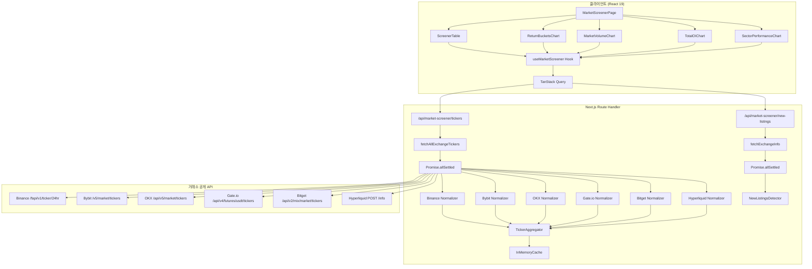
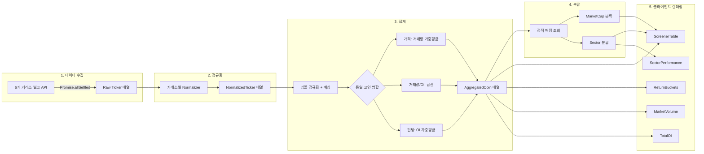
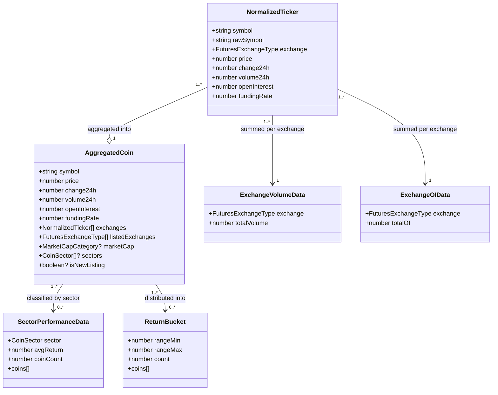
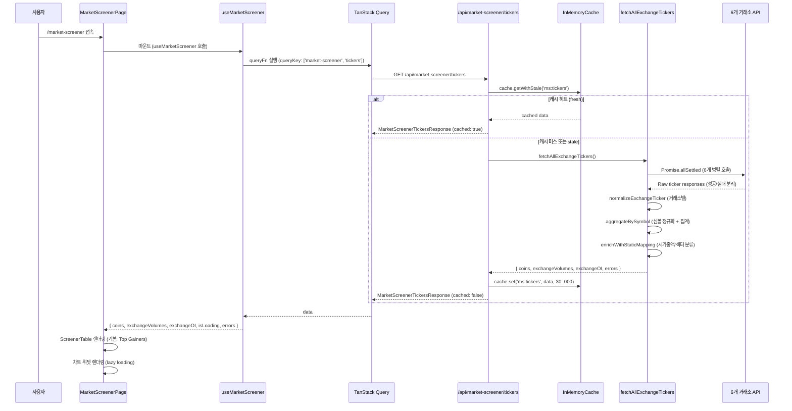
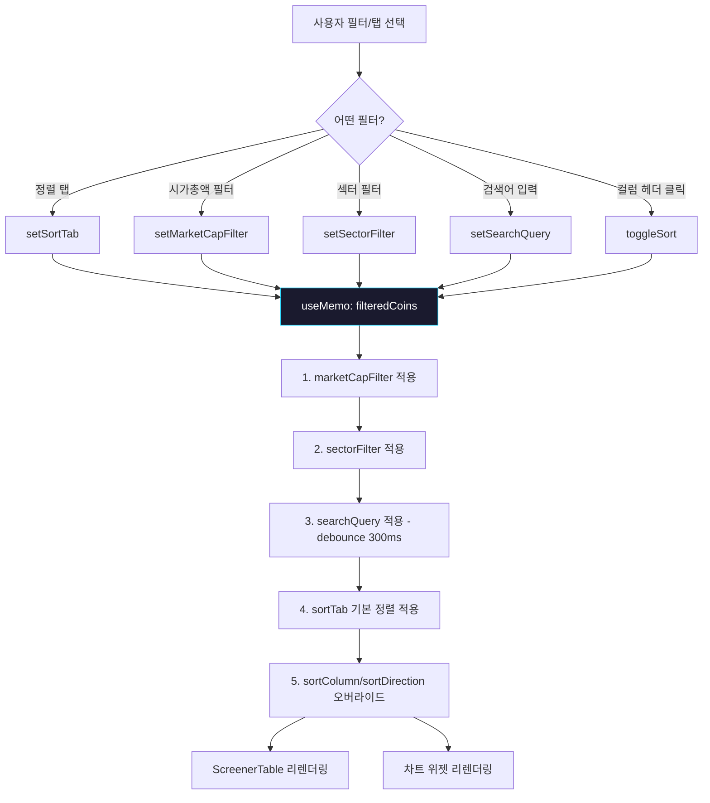
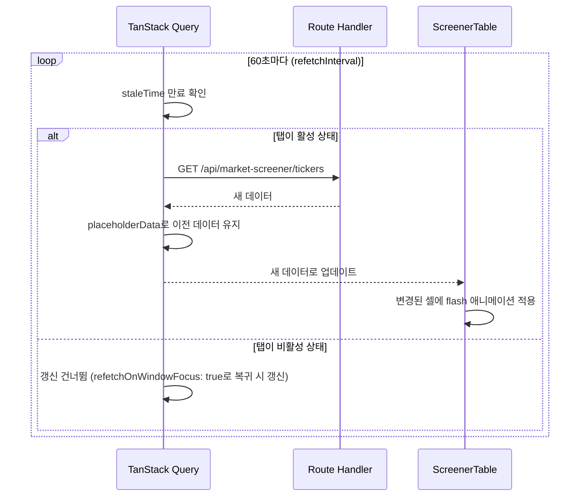
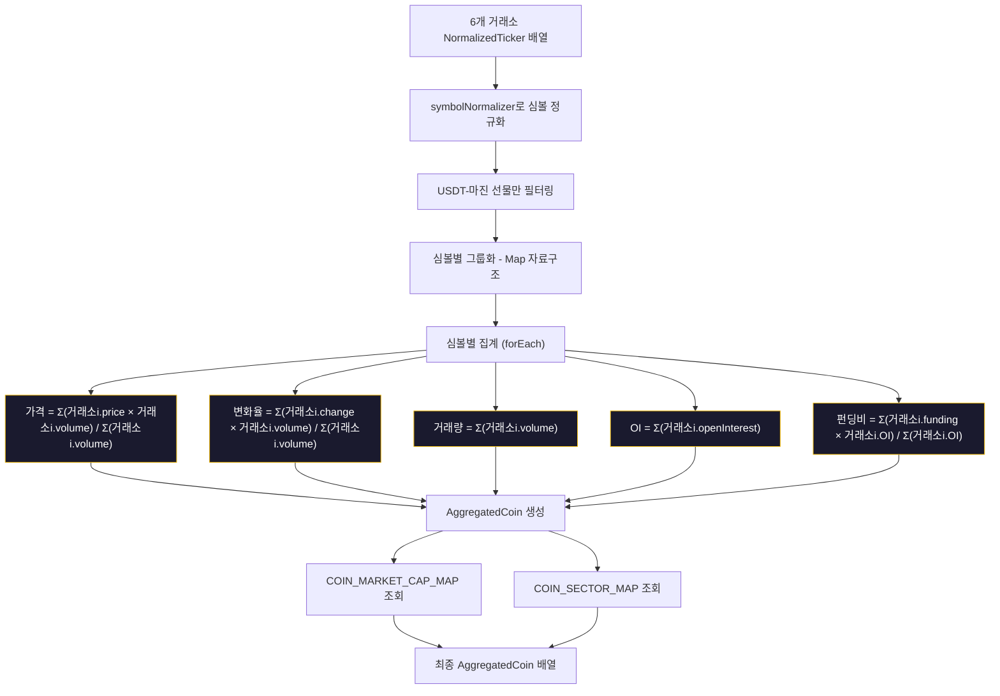
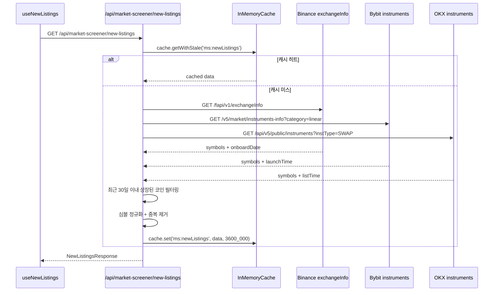

# Velo Market Screener - 설계 문서

## 1. 개요

### 1.1 설계 목표

BitScope에 마켓 스크리너 페이지(`/market-screener`)를 신규 추가한다. 6개 거래소(Binance, Bybit, OKX, Gate.io, Bitget, Hyperliquid)의 벌크 ticker API를 Next.js Route Handler에서 프록시하여, 250+ 선물 코인의 가격/OI/펀딩/거래량을 클라이언트에서 집계 및 시각화한다.

### 1.2 설계 원칙

- **기존 패턴 재사용**: `futures-dashboard`의 Route Handler, normalizer, TanStack Query 훅 패턴을 적극 활용
- **서버 수집 없는 Phase 1**: 벌크 ticker API만으로 구현 가능한 기능에 집중, 서버 사이드 cron/DB 불필요
- **Graceful Degradation**: 일부 거래소 실패 시에도 나머지 데이터로 서비스 지속
- **정적 매핑**: 시가총액/섹터 분류는 TypeScript 상수로 관리 (Phase 1)

### 1.3 범위

| 포함 | 제외 (Phase 2+) |
|---|---|
| 스크리너 테이블 (정렬/필터/검색) | Price Changes 시계열 차트 |
| Return Buckets 히스토그램 | Funding Heatmap |
| Market Volume 바 차트 | OI Changes 시계열 |
| Total Open Interest 바 차트 | Liquidations Heatmap |
| Sector Performance 바 차트 | CVD (OI-Normalized) |
| 정적 매핑 (시가총액/섹터) | CoinGecko 자동 분류 |
| New Listings 감지 | TradFi 자산 카테고리 |

---

## 2. 아키텍처 설계

### 2.1 시스템 아키텍처



### 2.2 데이터 플로우



---

## 3. 컴포넌트 설계

### 3.1 Route Handler 레이어

#### 3.1.1 TickersRouteHandler

- **경로**: `apps/web/app/api/market-screener/tickers/route.ts`
- **책임**: 6개 거래소 벌크 ticker를 병렬 수집, 정규화, 집계하여 반환
- **인터페이스**:
  ```
  GET /api/market-screener/tickers
  Response: MarketScreenerTickersResponse
  ```
- **의존성**: `fetchAllExchangeTickers()`, `aggregateBySymbol()`, `InMemoryCache`

#### 3.1.2 NewListingsRouteHandler

- **경로**: `apps/web/app/api/market-screener/new-listings/route.ts`
- **책임**: 거래소 instrument 정보에서 최근 30일 신규 상장 코인 감지
- **인터페이스**:
  ```
  GET /api/market-screener/new-listings
  Response: NewListingsResponse
  ```
- **의존성**: `fetchExchangeInstruments()`, `detectNewListings()`, `InMemoryCache`

#### 3.1.3 KlineRouteHandler (Return Buckets 1w/1m용)

- **경로**: `apps/web/app/api/market-screener/kline/route.ts`
- **책임**: 특정 기간의 가격 변화율 계산을 위한 Kline 데이터 제공
- **인터페이스**:
  ```
  GET /api/market-screener/kline?period=1w
  Response: KlinePriceChangesResponse
  ```
- **설계 결정**: 1w/1m Return Buckets는 Binance 단일 거래소에서 주요 코인 Kline을 가져와 변화율을 계산한다. 250개 코인 전부가 아닌, 현재 로드된 코인 목록 기준으로 Binance에서만 가져오되, 서버 캐시(5분 TTL)로 반복 호출을 방지한다.

### 3.2 라이브러리 레이어 (`_lib/`)

#### 3.2.1 fetchAllExchangeTickers

- **파일**: `apps/web/app/api/market-screener/_lib/fetch-tickers.ts`
- **책임**: 6개 거래소 벌크 ticker API를 `Promise.allSettled`로 병렬 호출
- **인터페이스**:
  ```typescript
  function fetchAllExchangeTickers(): Promise<{
    tickers: Map<FuturesExchangeType, NormalizedTicker[]>;
    errors: Partial<Record<FuturesExchangeType, string>>;
  }>
  ```

#### 3.2.2 normalizeExchangeTicker

- **파일**: `apps/web/app/api/market-screener/_lib/ticker-normalizer.ts`
- **책임**: 거래소별 벌크 ticker 응답을 `NormalizedTicker[]`로 변환
- **설계 결정**: 기존 `futures-dashboard` normalizer는 개별 코인용이므로, 벌크 응답을 처리하는 새 normalizer를 작성한다. 공통 유틸(`safeFloat`)은 공유한다.
- **인터페이스**:
  ```typescript
  function normalizeExchangeTicker(
    exchange: FuturesExchangeType,
    rawData: unknown
  ): NormalizedTicker[]
  ```

#### 3.2.3 aggregateBySymbol

- **파일**: `apps/web/app/api/market-screener/_lib/aggregator.ts`
- **책임**: 정규화된 ticker를 심볼 기준으로 집계 (가중 평균, 합산 등)
- **인터페이스**:
  ```typescript
  function aggregateBySymbol(
    tickersByExchange: Map<FuturesExchangeType, NormalizedTicker[]>
  ): AggregatedCoin[]
  ```

#### 3.2.4 symbolNormalizer

- **파일**: `apps/web/app/api/market-screener/_lib/symbol-normalizer.ts`
- **책임**: 거래소별 심볼 형식을 공통 형식으로 변환
- **인터페이스**:
  ```typescript
  function normalizeSymbol(exchange: FuturesExchangeType, rawSymbol: string): string | null
  // null 반환 = USDT-마진 선물이 아닌 경우 (필터링)
  ```
- **변환 규칙**:
  | 거래소 | 입력 예시 | 출력 |
  |---|---|---|
  | Binance | `BTCUSDT` | `BTC` |
  | Bybit | `BTCUSDT` | `BTC` |
  | OKX | `BTC-USDT-SWAP` | `BTC` |
  | Gate.io | `BTC_USDT` | `BTC` |
  | Bitget | `BTCUSDT` | `BTC` |
  | Hyperliquid | `BTC` | `BTC` |

#### 3.2.5 bulkTickerUrlBuilder

- **파일**: `apps/web/app/api/market-screener/_lib/url-builder.ts`
- **책임**: 거래소별 벌크 ticker API URL 생성
- **설계 결정**: 기존 `futures-dashboard` url-builder는 개별 코인 URL을 생성하지만, 마켓 스크리너는 전체 코인 벌크 URL을 생성한다.
- **인터페이스**:
  ```typescript
  function buildBulkTickerUrl(exchange: FuturesExchangeType): { url: string; method: string; body?: string }
  ```

### 3.3 공유 데이터 레이어 (`packages/shared`)

#### 3.3.1 정적 매핑 - 코인 분류

- **파일**: `packages/shared/src/constants/market-screener.ts`
- **책임**: 시가총액 분류, 섹터 분류, 거래소 색상 등 상수 관리
- **인터페이스**:
  ```typescript
  /** 시가총액 분류 */
  type MarketCapCategory = 'large' | 'mid' | 'small';
  const COIN_MARKET_CAP: Record<string, MarketCapCategory>;

  /** 섹터 분류 */
  type CoinSector = 'DeFi' | 'L1' | 'L2' | 'Metaverse' | 'Meme' | 'Dino' | 'AI';
  const COIN_SECTORS: Record<string, CoinSector[]>;

  /** 거래소 색상 (기존 EXCHANGE_COLORS 재사용) */
  ```

#### 3.3.2 타입 정의

- **파일**: `packages/shared/src/types/market-screener.ts`
- **책임**: 마켓 스크리너 전용 타입 정의

### 3.4 프론트엔드 레이어

#### 3.4.1 페이지 컴포넌트

- **파일**: `apps/web/app/(dashboard)/market-screener/page.tsx`
- **책임**: 마켓 스크리너 페이지 레이아웃, 상태 관리 조합
- **설계**: Server Component로 메타데이터 설정, Client Component(`MarketScreenerClient`)에 위임

#### 3.4.2 MarketScreenerClient

- **파일**: `apps/web/app/(dashboard)/market-screener/components/market-screener-client.tsx`
- **책임**: 전체 페이지 클라이언트 로직 (필터 상태, 데이터 패칭 오케스트레이션)
- **상태 관리**:
  - `sortTab`: 정렬 탭 (Top Gainers / Top Losers / Top Volume / New Listings)
  - `marketCapFilter`: 시가총액 필터 (All / Large / Mid / Small)
  - `sectorFilter`: 섹터 필터 (All / DeFi / L1 / L2 / Metaverse / Meme / Dino / AI)
  - `searchQuery`: 검색어
  - `sortColumn` / `sortDirection`: 테이블 컬럼 정렬

#### 3.4.3 ScreenerTable

- **파일**: `apps/web/app/(dashboard)/market-screener/components/screener-table.tsx`
- **책임**: 코인 리스트 테이블 (정렬, 필터, 검색, 가상 스크롤)
- **의존성**: `@tanstack/react-virtual` (가상 스크롤), 기존 shadcn/ui Table 컴포넌트
- **인터페이스**:
  ```typescript
  interface ScreenerTableProps {
    coins: AggregatedCoin[];
    isLoading: boolean;
    sortColumn: SortColumn;
    sortDirection: 'asc' | 'desc';
    onSortChange: (column: SortColumn) => void;
    onCoinClick: (symbol: string) => void;
  }
  ```

#### 3.4.4 FilterTabs

- **파일**: `apps/web/app/(dashboard)/market-screener/components/filter-tabs.tsx`
- **책임**: 3개 탭 그룹 (정렬, 시가총액, 섹터) UI
- **인터페이스**:
  ```typescript
  interface FilterTabsProps {
    sortTab: SortTab;
    marketCapFilter: MarketCapFilter;
    sectorFilter: SectorFilter;
    onSortTabChange: (tab: SortTab) => void;
    onMarketCapChange: (filter: MarketCapFilter) => void;
    onSectorChange: (filter: SectorFilter) => void;
  }
  ```

#### 3.4.5 ReturnBucketsChart

- **파일**: `apps/web/app/(dashboard)/market-screener/components/charts/return-buckets-chart.tsx`
- **책임**: 수익률 분포 히스토그램 (Recharts BarChart)
- **설계**: 동적 임포트(`next/dynamic`)로 lazy loading
- **인터페이스**:
  ```typescript
  interface ReturnBucketsChartProps {
    coins: AggregatedCoin[];
    period: '1d' | '1w' | '1m';
    onPeriodChange: (period: string) => void;
  }
  ```

#### 3.4.6 MarketVolumeChart

- **파일**: `apps/web/app/(dashboard)/market-screener/components/charts/market-volume-chart.tsx`
- **책임**: 거래소별 총 거래량 바 차트 (Recharts BarChart)
- **설계**: 동적 임포트로 lazy loading
- **인터페이스**:
  ```typescript
  interface MarketVolumeChartProps {
    exchangeVolumes: ExchangeVolumeData[];
  }
  ```

#### 3.4.7 TotalOIChart

- **파일**: `apps/web/app/(dashboard)/market-screener/components/charts/total-oi-chart.tsx`
- **책임**: 거래소별 총 OI 바 차트 (Recharts BarChart)
- **설계**: 동적 임포트로 lazy loading
- **인터페이스**:
  ```typescript
  interface TotalOIChartProps {
    exchangeOI: ExchangeOIData[];
  }
  ```

#### 3.4.8 SectorPerformanceChart

- **파일**: `apps/web/app/(dashboard)/market-screener/components/charts/sector-performance-chart.tsx`
- **책임**: 섹터별 평균 수익률 바 차트 (Recharts BarChart)
- **설계**: 동적 임포트로 lazy loading
- **인터페이스**:
  ```typescript
  interface SectorPerformanceChartProps {
    sectorData: SectorPerformanceData[];
    period: '1d' | '1w' | '1m';
    onPeriodChange: (period: string) => void;
  }
  ```

#### 3.4.9 useMarketScreener Hook

- **파일**: `apps/web/hooks/useMarketScreener.ts`
- **책임**: TanStack Query로 마켓 스크리너 데이터 fetch/캐싱/자동 갱신
- **설계**: 기존 `useMultiExchangeIndicator` 패턴을 참고하되, 벌크 데이터에 맞게 변형
- **인터페이스**:
  ```typescript
  function useMarketScreener(): {
    coins: AggregatedCoin[];
    exchangeVolumes: ExchangeVolumeData[];
    exchangeOI: ExchangeOIData[];
    errors: Partial<Record<FuturesExchangeType, string>>;
    isLoading: boolean;
    lastUpdated: number | null;
    isStale: boolean;
    refetch: () => void;
  }
  ```

#### 3.4.10 useNewListings Hook

- **파일**: `apps/web/hooks/useNewListings.ts`
- **책임**: New Listings 데이터 fetch/캐싱
- **인터페이스**:
  ```typescript
  function useNewListings(): {
    newListings: NewListingCoin[];
    isLoading: boolean;
  }
  ```

---

## 4. 데이터 모델

### 4.1 핵심 데이터 구조 정의

```typescript
// packages/shared/src/types/market-screener.ts

import type { FuturesExchangeType } from './futures';

/** 정렬 탭 */
export type SortTab = 'topGainers' | 'topLosers' | 'topVolume' | 'newListings';

/** 시가총액 필터 */
export type MarketCapFilter = 'all' | 'large' | 'mid' | 'small';

/** 섹터 필터 */
export type SectorFilter = 'all' | 'DeFi' | 'L1' | 'L2' | 'Metaverse' | 'Meme' | 'Dino' | 'AI';

/** 시가총액 분류 */
export type MarketCapCategory = 'large' | 'mid' | 'small';

/** 코인 섹터 */
export type CoinSector = 'DeFi' | 'L1' | 'L2' | 'Metaverse' | 'Meme' | 'Dino' | 'AI';

/** 테이블 정렬 컬럼 */
export type SortColumn = 'symbol' | 'price' | 'change24h' | 'volume24h' | 'openInterest' | 'fundingRate';

/** 개별 거래소에서 정규화된 단일 코인 ticker */
export interface NormalizedTicker {
  /** 정규화된 심볼 (예: "BTC") */
  symbol: string;
  /** 거래소 원본 심볼 (예: "BTCUSDT", "BTC-USDT-SWAP") */
  rawSymbol: string;
  /** 거래소 */
  exchange: FuturesExchangeType;
  /** 현재 가격 (USD) */
  price: number;
  /** 24h 가격 변화율 (%) */
  change24h: number;
  /** 24h 거래량 (USD) */
  volume24h: number;
  /** 미결제약정 (USD) - 없으면 0 */
  openInterest: number;
  /** 펀딩비율 (8h 기준, 원본 비율) - 없으면 0 */
  fundingRate: number;
}

/** 거래소별 데이터를 집계한 코인 */
export interface AggregatedCoin {
  /** 정규화된 심볼 (예: "BTC") */
  symbol: string;
  /** 가중 평균 가격 (거래량 기준) */
  price: number;
  /** 24h 가격 변화율 (%) - 거래량 가중 평균 */
  change24h: number;
  /** 24h 총 거래량 (USD) - 전 거래소 합산 */
  volume24h: number;
  /** 총 미결제약정 (USD) - 전 거래소 합산 */
  openInterest: number;
  /** 가중 평균 펀딩비율 (OI 기준) */
  fundingRate: number;
  /** 거래소별 개별 데이터 */
  exchanges: NormalizedTicker[];
  /** 데이터가 존재하는 거래소 목록 */
  listedExchanges: FuturesExchangeType[];
  /** 시가총액 분류 (정적 매핑) */
  marketCap?: MarketCapCategory;
  /** 섹터 분류 (정적 매핑) */
  sectors?: CoinSector[];
  /** 신규 상장 여부 */
  isNewListing?: boolean;
  /** 상장일 (ISO string, 있으면) */
  listingDate?: string;
}

/** 거래소별 총 거래량 데이터 */
export interface ExchangeVolumeData {
  exchange: FuturesExchangeType;
  totalVolume: number;
}

/** 거래소별 총 OI 데이터 */
export interface ExchangeOIData {
  exchange: FuturesExchangeType;
  totalOI: number;
}

/** 섹터 성과 데이터 */
export interface SectorPerformanceData {
  sector: CoinSector;
  avgReturn: number;
  coinCount: number;
  coins: Array<{ symbol: string; change: number }>;
}

/** Return Buckets 데이터 */
export interface ReturnBucket {
  /** 구간 하한 (%) */
  rangeMin: number;
  /** 구간 상한 (%) */
  rangeMax: number;
  /** 해당 구간 코인 수 */
  count: number;
  /** 해당 구간 코인 목록 */
  coins: Array<{ symbol: string; change: number }>;
}

/** 신규 상장 코인 */
export interface NewListingCoin {
  symbol: string;
  exchange: FuturesExchangeType;
  listingDate: string;
}

/** 마켓 스크리너 Tickers API 응답 */
export interface MarketScreenerTickersResponse {
  success: boolean;
  data: {
    coins: AggregatedCoin[];
    exchangeVolumes: ExchangeVolumeData[];
    exchangeOI: ExchangeOIData[];
    timestamp: number;
  };
  errors: Partial<Record<FuturesExchangeType, string>>;
  cached: boolean;
}

/** New Listings API 응답 */
export interface NewListingsResponse {
  success: boolean;
  data: NewListingCoin[];
  timestamp: number;
  cached: boolean;
}
```

### 4.2 데이터 모델 관계도



### 4.3 정적 매핑 데이터 구조

```typescript
// packages/shared/src/constants/market-screener.ts

import type { MarketCapCategory, CoinSector } from '../types/market-screener';

/** 시가총액 분류 매핑 (250+ 코인) */
export const COIN_MARKET_CAP_MAP: Record<string, MarketCapCategory> = {
  // Large Cap ($10B+)
  BTC: 'large', ETH: 'large', SOL: 'large', BNB: 'large', XRP: 'large',
  DOGE: 'large', ADA: 'large', AVAX: 'large', TRX: 'large', LINK: 'large',
  TON: 'large', DOT: 'large', SUI: 'large', SHIB: 'large',
  // Mid Cap ($1B ~ $10B)
  NEAR: 'mid', UNI: 'mid', APT: 'mid', ARB: 'mid', OP: 'mid',
  FIL: 'mid', AAVE: 'mid', MKR: 'mid', ATOM: 'mid', RENDER: 'mid',
  FET: 'mid', INJ: 'mid', SEI: 'mid', STX: 'mid', IMX: 'mid',
  PEPE: 'mid', WIF: 'mid', BONK: 'mid', FLOKI: 'mid', TAO: 'mid',
  MATIC: 'mid', LTC: 'mid', BCH: 'mid', ETC: 'mid', HBAR: 'mid',
  // Small Cap (<$1B)
  // ... 나머지 코인들
};

/** 섹터 분류 매핑 (복수 섹터 가능) */
export const COIN_SECTOR_MAP: Record<string, CoinSector[]> = {
  // DeFi
  AAVE: ['DeFi'], UNI: ['DeFi'], MKR: ['DeFi'], CRV: ['DeFi'],
  COMP: ['DeFi'], SNX: ['DeFi'], SUSHI: ['DeFi'], YFI: ['DeFi'],
  '1INCH': ['DeFi'], JUP: ['DeFi'], DYDX: ['DeFi'], PENDLE: ['DeFi'],
  // L1
  BTC: ['L1', 'Dino'], ETH: ['L1', 'Dino'], SOL: ['L1'], BNB: ['L1'],
  ADA: ['L1'], AVAX: ['L1'], DOT: ['L1'], ATOM: ['L1'], NEAR: ['L1', 'AI'],
  APT: ['L1'], SUI: ['L1'], SEI: ['L1'], INJ: ['L1'], TON: ['L1'],
  // L2
  ARB: ['L2'], OP: ['L2'], MATIC: ['L2'], ZK: ['L2'], STRK: ['L2'], MNT: ['L2'],
  // Metaverse / Gaming
  SAND: ['Metaverse'], MANA: ['Metaverse'], AXS: ['Metaverse'],
  GALA: ['Metaverse'], ENJ: ['Metaverse'], RONIN: ['Metaverse'], IMX: ['Metaverse'],
  // Meme
  DOGE: ['Meme', 'Dino'], SHIB: ['Meme'], PEPE: ['Meme'], BONK: ['Meme'],
  WIF: ['Meme'], POPCAT: ['Meme'], FLOKI: ['Meme'],
  // Dino (2017년 이전 출시)
  LTC: ['Dino'], XRP: ['Dino', 'L1'], XLM: ['Dino'], XMR: ['Dino'],
  ZEC: ['Dino'], DASH: ['Dino'], ETC: ['Dino'],
  // AI
  FET: ['AI'], RENDER: ['AI'], TAO: ['AI'],
};

/** 마켓 스크리너 기간 옵션 */
export type ScreenerPeriod = '1d' | '1w' | '1m';

/** 거래소별 벌크 API 설정 */
export const BULK_TICKER_CONFIGS: Record<FuturesExchangeType, {
  url: string;
  method: 'GET' | 'POST';
  body?: string;
}> = {
  binance: {
    url: 'https://fapi.binance.com/fapi/v1/ticker/24hr',
    method: 'GET',
  },
  bybit: {
    url: 'https://api.bybit.com/v5/market/tickers?category=linear',
    method: 'GET',
  },
  okx: {
    url: 'https://www.okx.com/api/v5/market/tickers?instType=SWAP',
    method: 'GET',
  },
  gate: {
    url: 'https://api.gateio.ws/api/v4/futures/usdt/tickers',
    method: 'GET',
  },
  bitget: {
    url: 'https://api.bitget.com/api/v2/mix/market/tickers?productType=USDT-FUTURES',
    method: 'GET',
  },
  hyperliquid: {
    url: 'https://api.hyperliquid.xyz/info',
    method: 'POST',
    body: JSON.stringify({ type: 'metaAndAssetCtxs' }),
  },
};
```

---

## 5. 비즈니스 프로세스

### 5.1 프로세스 1: 페이지 초기 로드



### 5.2 프로세스 2: 필터 및 정렬 적용



### 5.3 프로세스 3: 자동 데이터 갱신



### 5.4 프로세스 4: 집계 알고리즘 상세



### 5.5 프로세스 5: New Listings 감지



---

## 6. 에러 처리 전략

### 6.1 거래소 API 에러 처리

| 상황 | 처리 방식 | 사용자 알림 |
|---|---|---|
| 개별 거래소 타임아웃 (5초) | 해당 거래소 제외, 나머지로 응답 | 상단 경고 배너: "Binance 데이터 누락" |
| 개별 거래소 4xx/5xx | 해당 거래소 제외, 에러 메시지 로깅 | 상단 경고 배너 |
| 모든 거래소 실패 | 500 응답 + 스테일 캐시 폴백 | 에러 메시지 + 재시도 버튼 |
| 네트워크 에러 | AbortSignal.timeout(5000) | TanStack Query retry (2회) |

### 6.2 클라이언트 에러 처리

| 상황 | 처리 방식 | 사용자 알림 |
|---|---|---|
| 초기 로딩 실패 | TanStack Query retry 2회, 지수 백오프 | 스켈레톤 → 에러 메시지 + 재시도 버튼 |
| 갱신 실패 | 이전 데이터 유지 (placeholderData) | 토스트: "데이터 갱신 실패" |
| 데이터 2분 이상 경과 | isStale 상태 표시 | 경고 배지: "데이터가 오래됨" |
| New Listings API 실패 | "데이터 준비 중" 안내 | 탭에 안내 메시지 |

### 6.3 에러 응답 구조

```typescript
// Route Handler 에러 응답
interface ErrorResponse {
  success: false;
  error: {
    message: string;
    code: 'FETCH_ERROR' | 'TIMEOUT' | 'ALL_EXCHANGES_FAILED' | 'UNKNOWN';
  };
  // 부분 실패 시 사용 가능한 데이터 포함
  partialData?: {
    coins: AggregatedCoin[];
    errors: Partial<Record<FuturesExchangeType, string>>;
  };
}
```

### 6.4 캐싱 전략

| 대상 | 서버 캐시 TTL | TanStack Query staleTime | refetchInterval |
|---|---|---|---|
| Tickers | 30초 | 30초 | 60초 |
| New Listings | 1시간 | 10분 | 없음 (수동 또는 탭 전환 시) |
| Kline (1w/1m) | 5분 | 5분 | 없음 |

---

## 7. 테스트 전략

### 7.1 단위 테스트

| 대상 | 테스트 내용 | 파일 위치 |
|---|---|---|
| `symbolNormalizer` | 6개 거래소 심볼 변환 정확성, USDT-마진 필터링 | `_lib/__tests__/symbol-normalizer.test.ts` |
| `normalizeExchangeTicker` | 거래소별 벌크 응답 정규화 | `_lib/__tests__/ticker-normalizer.test.ts` |
| `aggregateBySymbol` | 가중 평균, 합산, OI 가중 평균 펀딩 계산 | `_lib/__tests__/aggregator.test.ts` |
| Return Buckets 계산 | 구간 분류 정확성, 경계값 처리 | `components/__tests__/return-buckets.test.ts` |
| Sector Performance 계산 | 섹터별 산술 평균 | `components/__tests__/sector-performance.test.ts` |

### 7.2 통합 테스트

| 대상 | 테스트 내용 |
|---|---|
| Tickers Route Handler | 모킹된 거래소 응답으로 전체 파이프라인 검증 |
| 부분 실패 시나리오 | 3개 거래소 실패 시에도 나머지 3개 데이터 반환 확인 |
| 캐시 동작 | 캐시 히트/미스/스테일 시나리오 검증 |

### 7.3 E2E 테스트 (수동)

| 시나리오 | 확인 사항 |
|---|---|
| 페이지 초기 로드 | 스켈레톤 → 테이블 렌더링, 3초 이내 |
| 필터 조합 | Top Gainers + Large Cap + DeFi 조합 시 정확한 필터링 |
| 검색 | "BTC" 입력 시 debounce 후 필터링 |
| 자동 갱신 | 60초 후 데이터 업데이트 + flash 애니메이션 |
| 코인 클릭 | `/futures-dashboard?coin=BTC` 이동 |
| 반응형 | 데스크톱 2x2, 태블릿 2열, 모바일 1열 |

---

## 8. 설계 결정 및 근거

### 8.1 벌크 ticker 단일 Route Handler vs 개별 거래소 Route Handler

**결정**: 단일 Route Handler(`/api/market-screener/tickers`)에서 6개 거래소를 모두 호출하고 집계까지 수행

**근거**:
- 클라이언트가 6개 거래소를 개별 호출하면 6회 RTT가 발생하지만, 서버에서 한번에 처리하면 1회 RTT
- 서버 사이드에서 집계하면 클라이언트 번들에 normalizer 코드 불필요
- `Promise.allSettled` 패턴으로 부분 실패 처리가 서버에서 일관되게 관리됨

### 8.2 가상 스크롤 vs 페이지네이션

**결정**: 가상 스크롤 (`@tanstack/react-virtual`)

**근거**:
- 250+ 코인 전체를 한 화면에서 빠르게 스크롤하며 탐색하는 것이 트레이더 UX에 적합
- velo.xyz/market도 가상 스크롤 방식 사용
- 페이지네이션은 코인 목록 탐색 시 페이지 전환 클릭이 추가로 필요

### 8.3 정적 매핑 vs CoinGecko API

**결정**: Phase 1은 정적 매핑, Phase 2에서 하이브리드(CoinGecko + 캐시)

**근거**:
- Phase 1 목표는 서버 수집 없는 프론트엔드 중심 구현
- CoinGecko 무료 API는 10,000 calls/월 제한 → 빈번한 분류 업데이트에 부적합
- 선물 상장 코인 250개 수준은 수동 매핑 관리 가능

### 8.4 Return Buckets 1w/1m 데이터 소스

**결정**: Binance 단일 거래소 Kline으로 변화율 계산

**근거**:
- 250개 코인 x 6개 거래소 Kline 호출 = 1,500회 API 호출로 비현실적
- Binance가 선물 시장 최대 거래량 → 대표 가격으로 충분
- 1d는 ticker의 change24h 그대로 사용하여 추가 호출 불필요

### 8.5 Binance OI 데이터 처리

**결정**: Binance 벌크 ticker(`/fapi/v1/ticker/24hr`)에 OI가 미포함되므로, Binance OI는 Phase 1에서 제외하고 나머지 5개 거래소의 OI만 합산

**근거**:
- Binance OI를 가져오려면 `/fapi/v1/openInterest`를 코인별로 호출해야 함 (250회 추가)
- Bybit, OKX, Gate.io, Bitget, Hyperliquid는 벌크 ticker에 OI 포함
- Phase 2에서 서버 사이드 주기 수집으로 Binance OI 추가 가능

### 8.6 New Listings 캐시 TTL

**결정**: 서버 캐시 1시간, TanStack Query staleTime 10분

**근거**:
- 신규 상장은 하루에 0~2건 수준으로 빈번하지 않음
- `exchangeInfo` API 응답은 대용량(수백 KB)이므로 빈번한 호출 비효율
- 1시간 캐시로도 신규 상장 감지에 충분한 속도

---

## 9. 파일 구조 요약

```
apps/web/
  app/
    (dashboard)/
      market-screener/
        page.tsx                          # 서버 컴포넌트 (메타데이터)
        components/
          market-screener-client.tsx       # 클라이언트 오케스트레이터
          screener-table.tsx              # 코인 테이블 (가상 스크롤)
          filter-tabs.tsx                 # 3개 탭 그룹
          search-input.tsx               # 검색 입력란
          error-banner.tsx               # 거래소 에러 배너
          stale-indicator.tsx            # 데이터 오래됨 표시
          charts/
            return-buckets-chart.tsx      # 수익률 분포 히스토그램
            market-volume-chart.tsx       # 거래소별 거래량
            total-oi-chart.tsx           # 거래소별 OI
            sector-performance-chart.tsx  # 섹터 성과
    api/
      market-screener/
        tickers/
          route.ts                        # 벌크 ticker Route Handler
        new-listings/
          route.ts                        # New Listings Route Handler
        kline/
          route.ts                        # Kline 변화율 Route Handler
        _lib/
          fetch-tickers.ts               # 6개 거래소 병렬 호출
          ticker-normalizer.ts           # 벌크 ticker 정규화
          symbol-normalizer.ts           # 심볼 정규화
          aggregator.ts                  # 집계 로직
          url-builder.ts                 # 벌크 API URL 빌더
  hooks/
    useMarketScreener.ts                 # TanStack Query 훅
    useNewListings.ts                    # New Listings 훅

packages/shared/
  src/
    types/
      market-screener.ts                 # 마켓 스크리너 타입
    constants/
      market-screener.ts                 # 정적 매핑 + 상수
```
