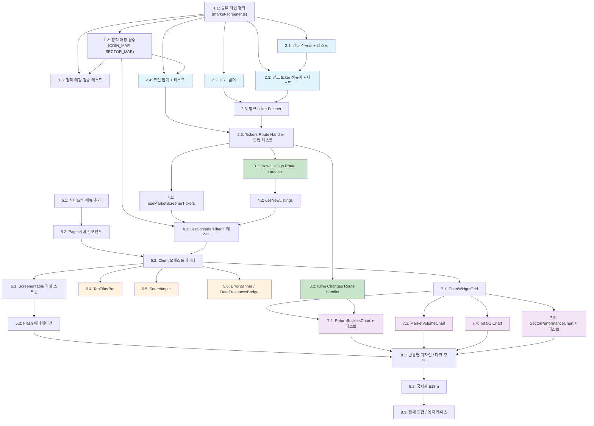

# Velo Market Screener - 구현 계획 (Implementation Plan)

> 본 문서는 설계 문서(design.md)를 기반으로 코드 생성 LLM이 TDD 방식으로 단계적으로 구현할 수 있도록 구성한 태스크 목록이다. 각 태스크는 이전 태스크 위에 증분적으로 빌드되며, 구현 완료 후 반드시 통합된다. 컨텍스트 문서(requirements.md, design.md)는 구현 시 함께 참조할 것.

---

- [ ] 1. 공유 타입 및 상수 정의
- [ ] 1.1 마켓 스크리너 전용 타입 파일 생성
  - `packages/shared/src/types/market-screener.ts` 생성
  - `SortTab`, `CapFilter`, `SectorFilter`, `ChartPeriod`, `MarketCapCategory`, `CoinSector`, `SortColumn` 타입 정의
  - `NormalizedTicker`, `ExchangeBreakdown`, `AggregatedCoin`, `ExchangeTotal` 인터페이스 정의
  - `MarketScreenerResponse`, `NewListingCoin`, `NewListingsResponse` 인터페이스 정의
  - `ReturnBucket`, `SectorPerformance`, `KlineChangesResponse` 인터페이스 정의
  - 기존 `FuturesExchangeType` 타입을 import하여 재사용
  - `packages/shared/src/types/index.ts`에 export 추가
  - _요구사항: 11.3, 13.1, 14.5_

- [ ] 1.2 정적 매핑 상수 파일 생성
  - `packages/shared/src/constants/market-screener.ts` 생성
  - `COIN_MARKET_CAP_MAP: Record<string, MarketCapCategory>` 정의 (250+ 코인 시가총액 분류: large/mid/small)
  - `COIN_SECTOR_MAP: Record<string, CoinSector[]>` 정의 (DeFi, L1, L2, Metaverse, Meme, Dino, AI 섹터 매핑)
  - `SECTOR_LABELS: Record<CoinSector, string>` 정의
  - `BULK_TICKER_CONFIGS: Record<FuturesExchangeType, { url, method, body? }>` 정의 (6개 거래소 벌크 API 설정)
  - `packages/shared/src/constants/index.ts`에 export 추가
  - _요구사항: 4.4, 5.3, 14.1, 14.2, 14.3, 14.5, 14.6_

- [ ] 1.3 정적 매핑 데이터 검증 테스트
  - `COIN_MARKET_CAP_MAP`의 키가 모두 대문자 심볼인지 검증
  - `COIN_SECTOR_MAP`의 값이 유효한 `CoinSector` 배열인지 검증
  - `BULK_TICKER_CONFIGS`가 6개 거래소를 모두 포함하는지 검증
  - 250개 이상 코인이 `COIN_MARKET_CAP_MAP`에 포함되어 있는지 검증
  - _요구사항: 14.5, 14.6_

---

- [ ] 2. Route Handler 백엔드 핵심 로직 구현
- [ ] 2.1 심볼 정규화 유틸 구현 및 테스트
  - `apps/web/app/api/market-screener/_lib/symbol-normalizer.ts` 생성
  - `normalizeSymbol(exchange, rawSymbol): string | null` 함수 구현
    - Binance: `BTCUSDT` -> `BTC`, Bybit: `BTCUSDT` -> `BTC`
    - OKX: `BTC-USDT-SWAP` -> `BTC`, Gate.io: `BTC_USDT` -> `BTC`
    - Bitget: `BTCUSDT` -> `BTC`, Hyperliquid: `BTC` -> `BTC`
    - USDT-마진 선물만 통과, COIN-마진 등은 `null` 반환
  - `__tests__/symbol-normalizer.test.ts` 작성: 6개 거래소별 변환 정확성, COIN-마진 필터링, 엣지 케이스(빈 문자열, 알 수 없는 포맷) 테스트
  - _요구사항: 13.1, 13.2, 13.3_

- [ ] 2.2 벌크 ticker URL 빌더 구현
  - `apps/web/app/api/market-screener/_lib/url-builder.ts` 생성
  - `buildBulkTickerUrl(exchange): { url, method, body? }` 함수 구현
  - `BULK_TICKER_CONFIGS` 상수를 활용하여 6개 거래소별 API URL/method/body 반환
  - _요구사항: 12.1, 12.2, 12.3, 12.4, 12.5, 12.6_

- [ ] 2.3 벌크 ticker 정규화 구현 및 테스트
  - `apps/web/app/api/market-screener/_lib/bulk-ticker-normalizer.ts` 생성
  - `normalizeBulkTickers(exchange, rawData): NormalizedTicker[]` 함수 구현
  - 6개 거래소별 응답 포맷 -> `NormalizedTicker` 통일 스키마 변환 로직
    - Binance: `lastPrice`, `priceChangePercent`, `quoteVolume` 매핑 (OI=0, funding=0 -> premiumIndex로 보충)
    - Bybit: `result.list[]` 구조, `openInterest` 코인 -> USD 변환
    - OKX: `data[]` 구조, `(last - open24h) / open24h` 계산, `volCcy24h * last` USD 변환
    - Gate.io: `contract`, `change_percentage /100`, `total_size * quanto_multiplier * last`
    - Bitget: `data[]` 구조, `openInterestUsd` 우선
    - Hyperliquid: `[0].universe[i].name` + `[1][i]` 구조, `(markPx - prevDayPx) / prevDayPx` 계산
  - `__tests__/bulk-ticker-normalizer.test.ts` 작성: 거래소별 필드 매핑, 숫자 파싱, 누락 필드 기본값 0 테스트
  - _요구사항: 11.3, 12.1~12.7_

- [ ] 2.4 코인 집계 로직 구현 및 테스트
  - `apps/web/app/api/market-screener/_lib/coin-aggregator.ts` 생성
  - `aggregateCoins(allTickers: NormalizedTicker[]): AggregatedCoin[]` 함수 구현
    - 심볼별 그룹화 (Map 자료구조)
    - 가격: 거래량 가중 평균, 변화율: 거래량 가중 평균
    - 거래량/OI: 합산, 펀딩비율: OI 가중 평균
    - `COIN_MARKET_CAP_MAP`, `COIN_SECTOR_MAP` 조회로 `marketCap`, `sectors` 필드 enrichment
  - `__tests__/coin-aggregator.test.ts` 작성: 가중 평균 정확성, 단일 거래소 코인, 0 거래량 시 fallback, enrichment 테스트
  - _요구사항: 2.6, 11.4_

- [ ] 2.5 벌크 ticker Fetcher 구현
  - `apps/web/app/api/market-screener/_lib/bulk-ticker-fetcher.ts` 생성
  - `fetchAllBulkTickers(): Promise<BulkTickerResult>` 함수 구현
    - `Promise.allSettled`로 6개 거래소 병렬 호출
    - 개별 거래소 타임아웃 5초 (`AbortSignal.timeout(5000)`)
    - Binance 추가: `GET /fapi/v1/premiumIndex` (벌크) 호출로 `lastFundingRate` 보충
    - 성공/실패 결과를 `BulkTickerResult` 구조로 반환
  - _요구사항: 11.1, 11.2, 12.7, NFR-1.2_

- [ ] 2.6 Tickers Route Handler 구현 및 통합 테스트
  - `apps/web/app/api/market-screener/tickers/route.ts` 생성
  - GET 핸들러 구현: BulkTickerFetcher -> BulkTickerNormalizer -> CoinAggregator 파이프라인
  - 기존 `InMemoryCache` 패턴 재사용 (TTL 30초, 스테일 유예 5분)
  - `Cache-Control: s-maxage=30, stale-while-revalidate=60` 헤더 설정
  - 거래소별 Volume/OI 합산 데이터(`exchangeVolumes`, `exchangeOI`) 생성
  - `MarketScreenerResponse` 구조로 응답 반환 (`success`, `data`, `errors`, `exchangeCount`, `cached`)
  - `__tests__/tickers-route.test.ts` 작성: 캐시 히트/미스, 부분 실패 Graceful Degradation, 전체 실패 시 스테일 캐시/500 에러 테스트
  - _요구사항: 11.1~11.5, NFR-2.1~2.6_

---

- [ ] 3. New Listings 및 Kline Changes Route Handler 구현
- [ ] 3.1 New Listings Route Handler 구현
  - `apps/web/app/api/market-screener/new-listings/route.ts` 생성
  - Binance `GET /fapi/v1/exchangeInfo`, Bybit `GET /v5/market/instruments-info?category=linear`, OKX `GET /api/v5/public/instruments?instType=SWAP` 병렬 호출
  - 각 거래소의 상장일 정보 파싱 (Binance: `onboardDate`, Bybit: `launchTime`, OKX: `listTime`)
  - 최근 30일 이내 상장된 코인 필터링
  - 심볼 정규화 + 중복 제거 (동일 코인이 여러 거래소에서 감지되면 가장 이른 상장일 사용)
  - `InMemoryCache` 적용 (TTL 1시간, 스테일 유예 2시간)
  - `NewListingsResponse` 구조로 응답 반환
  - _요구사항: 15.1, 15.2, 15.3, 15.4_

- [ ] 3.2 Kline Changes Route Handler 구현
  - `apps/web/app/api/market-screener/kline-changes/route.ts` 생성
  - `GET /api/market-screener/kline-changes?period=1w|1m` 쿼리 파라미터 처리
  - Binance Kline API를 사용하여 주요 코인의 7일/30일 가격 변화율 계산
  - 서버 캐시 5분 TTL 적용
  - `KlineChangesResponse` 구조로 응답 반환 (`Record<string, number>`: symbol -> 변화율)
  - _요구사항: 7.10_

---

- [ ] 4. 클라이언트 커스텀 Hooks 구현
- [ ] 4.1 useMarketScreenerTickers 훅 구현
  - `apps/web/hooks/useMarketScreenerTickers.ts` 생성
  - TanStack Query `useQuery`로 `/api/market-screener/tickers` 호출
  - 설정: `staleTime: 30_000`, `refetchInterval: 60_000`, `refetchOnWindowFocus: true`, `refetchIntervalInBackground: false`, `retry: 2`, `placeholderData: keepPreviousData`
  - _요구사항: 16.1, 16.2, 16.3, 16.4, 16.5_

- [ ] 4.2 useNewListings 훅 구현
  - `apps/web/hooks/useNewListings.ts` 생성
  - TanStack Query `useQuery`로 `/api/market-screener/new-listings` 호출
  - 설정: `staleTime: 600_000`, refetchInterval 없음
  - _요구사항: 3.5, 3.6, 15.4_

- [ ] 4.3 useScreenerFilter 훅 구현 및 테스트
  - `apps/web/hooks/useScreenerFilter.ts` 생성
  - `useScreenerFilter(coins, state, newListings): FilteredResult` 구현
    - 검색어 필터 (대소문자 무시, symbol 매칭)
    - 시가총액 필터 (`COIN_MARKET_CAP_MAP` 기반)
    - 섹터 필터 (`COIN_SECTOR_MAP` 기반)
    - 정렬 탭 (topGainers: change24h DESC, topLosers: change24h ASC, topVolume: volume24h DESC, newListings: listDate DESC)
    - `useMemo`로 메모이제이션, 의존성 변경 시에만 재계산
  - `__tests__/useScreenerFilter.test.ts` 작성: 탭 조합 필터, 검색, 빈 결과, 정렬 순서, All 필터 동작 테스트
  - _요구사항: 3.1~3.8, 4.1~4.5, 5.1~5.5, 6.1~6.4, 17.2~17.4_

---

- [ ] 5. 페이지 및 핵심 UI 컴포넌트 구현
- [ ] 5.1 사이드바 메뉴 추가
  - 기존 사이드바 설정에 "마켓 스크리너" 메뉴 항목 추가 (sectionMarket 섹션)
  - 적절한 아이콘 선택 (lucide-react 등)
  - `/market-screener` 경로 연결 및 활성 상태 표시
  - _요구사항: 1.1, 1.2, 1.3, 1.4_

- [ ] 5.2 MarketScreenerPage 서버 컴포넌트 생성
  - `apps/web/app/(dashboard)/market-screener/page.tsx` 생성
  - Server Component로 메타데이터(`title: "Market Screener"`) 설정
  - Client Component(`MarketScreenerClient`)에 위임
  - _요구사항: 18.6, NFR-5.1_

- [ ] 5.3 MarketScreenerClient 오케스트레이터 컴포넌트 구현
  - `apps/web/app/(dashboard)/market-screener/components/market-screener-client.tsx` 생성
  - `ScreenerState` 상태 관리 (`sortTab`, `capFilter`, `sectorFilter`, `searchQuery`, `chartPeriod`)
  - `useMarketScreenerTickers`, `useNewListings`, `useScreenerFilter` 훅 연결
  - 하위 컴포넌트 조합: ErrorBanner, DataFreshnessBadge, SearchInput, TabFilterBar, ScreenerTable, ChartWidgetGrid
  - 수동 새로고침 버튼 (`queryClient.invalidateQueries`)
  - 스켈레톤 UI (로딩 상태)
  - _요구사항: 2.9, 16.7, 18.6_

- [ ] 5.4 TabFilterBar 컴포넌트 구현
  - `apps/web/app/(dashboard)/market-screener/components/tab-filter-bar.tsx` 생성
  - 3개 탭 그룹 행(row) 배치: (1) 정렬 탭, (2) 시가총액 탭 (All/Large/Mid/Small), (3) 섹터 탭 (All/DeFi/L1/L2/Metaverse/Meme/Dino/AI)
  - shadcn/ui `Tabs` 컴포넌트 활용
  - 키보드 탐색 지원 (Tab, Enter, Arrow keys)
  - _요구사항: 6.1, 6.2, 6.3, 6.4, NFR-3.3_

- [ ] 5.5 SearchInput 컴포넌트 구현
  - `apps/web/app/(dashboard)/market-screener/components/search-input.tsx` 생성
  - 300ms debounce 텍스트 입력란
  - 대소문자 무시 검색
  - 검색어 비어있을 때 전체 코인 표시
  - _요구사항: 17.1, 17.2, 17.3, 17.4_

- [ ] 5.6 ErrorBanner 및 DataFreshnessBadge 컴포넌트 구현
  - `apps/web/app/(dashboard)/market-screener/components/error-banner.tsx` 생성
    - 부분 실패 시 "일부 거래소 데이터 누락" 경고 배너
    - 전체 실패 시 에러 메시지 + 재시도 버튼
  - `apps/web/app/(dashboard)/market-screener/components/data-freshness-badge.tsx` 생성
    - 마지막 갱신 시간 표시
    - 2분 초과 시 경고 배지
  - _요구사항: 2.10, 16.8, NFR-2.1~2.5_

---

- [ ] 6. 스크리너 테이블 구현
- [ ] 6.1 ScreenerTable 가상 스크롤 테이블 구현
  - `apps/web/app/(dashboard)/market-screener/components/screener-table.tsx` 생성
  - `@tanstack/react-virtual` 사용 (250+ 행 -> 뷰포트 내 20~30행만 렌더)
  - 시맨틱 HTML 테이블 요소 (`<table>`, `<thead>`, `<tbody>`, `<th>`, `<td>`)
  - 컬럼: 코인명(심볼), 가격(USD), 24h 변화율(%), 24h 거래량(USD 약식 $1.2B), OI(USD 약식), 펀딩비율(%)
  - 변화율/펀딩비율 색상: 양수=녹색, 음수=빨간색
  - 헤더 클릭 시 오름차순/내림차순 정렬 토글
  - 코인 행 클릭 시 `router.push('/futures-dashboard?coin=XXX')` 이동
  - 스켈레톤 UI (로딩 상태)
  - 수평 스크롤 지원 (모바일)
  - "NEW" 배지 표시 (신규 상장 코인)
  - "해당 조건에 맞는 코인이 없습니다" 빈 상태 메시지
  - _요구사항: 2.1~2.10, 3.7, 6.3, 18.4, NFR-1.3, NFR-3.1_

- [ ] 6.2 가격 변동 Flash 애니메이션 구현
  - `useRef`로 이전 가격과 현재 가격 비교
  - CSS `transition`으로 변동된 셀에 짧은 하이라이트(flash) 애니메이션 적용
  - DOM 조작 최소화
  - _요구사항: 16.6_

---

- [ ] 7. 차트 위젯 구현
- [ ] 7.1 ChartWidgetGrid 반응형 그리드 컨테이너 구현
  - `apps/web/app/(dashboard)/market-screener/components/chart-widget-grid.tsx` 생성
  - 데스크톱(lg+): 2x2 그리드, 태블릿(md): 2열, 모바일(sm-): 1열 스택
  - 4개 차트 위젯을 `next/dynamic`으로 lazy loading
  - 로딩 폴백으로 스켈레톤 placeholder 표시
  - _요구사항: 18.1, 18.2, 18.3, NFR-1.5_

- [ ] 7.2 ReturnBucketsChart (수익률 분포 히스토그램) 구현
  - `apps/web/app/(dashboard)/market-screener/components/charts/return-buckets-chart.tsx` 생성
  - Recharts `BarChart` 사용
  - X축: 수익률 구간 (-30% ~ +30%, 5% 단위, 총 13개 구간)
  - Y축: 해당 구간 코인 수
  - 양수 구간 녹색, 음수 구간 빨간색
  - Hover 툴팁: 해당 구간 코인 목록 (심볼 + 수익률)
  - 기간 선택기: 1d, 1w, 1m (1d는 ticker 데이터 사용, 1w/1m는 Kline API 호출)
  - Return Bucket 계산 유틸 함수 분리
  - `__tests__/return-buckets.test.ts` 작성: 구간 분류 정확성, 경계값 처리 테스트
  - _요구사항: 7.1~7.10_

- [ ] 7.3 MarketVolumeChart (거래소별 거래량 바 차트) 구현
  - `apps/web/app/(dashboard)/market-screener/components/charts/market-volume-chart.tsx` 생성
  - Recharts `BarChart` 사용
  - 6개 거래소를 각각 다른 색상으로 구분 (EXCHANGE_COLORS 재사용)
  - 거래량 큰 순서로 막대 정렬
  - Hover 툴팁: 정확한 거래량(USD) 수치
  - _요구사항: 8.1~8.5_

- [ ] 7.4 TotalOIChart (거래소별 OI 바 차트) 구현
  - `apps/web/app/(dashboard)/market-screener/components/charts/total-oi-chart.tsx` 생성
  - Recharts `BarChart` 사용
  - Market Volume 차트와 동일한 색상 스킴
  - OI 큰 순서로 막대 정렬
  - Hover 툴팁: 정확한 OI(USD) 수치
  - OI 데이터 없는 거래소는 "데이터 없음" 표시
  - _요구사항: 9.1~9.6_

- [ ] 7.5 SectorPerformanceChart (섹터별 성과 비교 차트) 구현
  - `apps/web/app/(dashboard)/market-screener/components/charts/sector-performance-chart.tsx` 생성
  - Recharts `BarChart` 사용
  - 6개 섹터 평균 수익률 비교 (단순 산술 평균)
  - 기간 선택기: 1d, 1w, 1m
  - 양수 녹색, 음수 빨간색
  - 성과 높은 순서로 정렬
  - Hover 툴팁: 평균 수익률, 포함 코인 수, 구성 코인 목록
  - Sector Performance 계산 유틸 함수 분리
  - `__tests__/sector-performance.test.ts` 작성: 섹터별 산술 평균 검증
  - _요구사항: 10.1~10.7_

---

- [ ] 8. 반응형 디자인, 국제화, 최종 통합
- [ ] 8.1 반응형 레이아웃 및 다크 모드 적용
  - 데스크톱(lg+): 테이블 상단, 차트 2x2 하단
  - 태블릿(md): 차트 2열
  - 모바일(sm-): 차트 1열 스택, 테이블 수평 스크롤
  - 기존 BitScope 다크 모드 테마와 일관된 Tailwind CSS/shadcn/ui 스타일
  - ARIA 레이블, 색상 대비 WCAG AA 준수
  - _요구사항: 18.1~18.5, NFR-3.1~3.3_

- [ ] 8.2 국제화(i18n) 적용
  - 기존 i18n 시스템 활용하여 마켓 스크리너 UI 텍스트 한국어/영어 키 추가
  - 숫자 축약 표기 유틸 ($1.2B, $340M 등) 구현 또는 기존 포매터 재사용
  - _요구사항: NFR-4.1, NFR-4.2_

- [ ] 8.3 전체 통합 및 엣지 케이스 처리
  - 모든 컴포넌트가 올바르게 연결되어 동작하는지 확인
  - 필터 조합 시 결과 0건일 때 빈 상태 메시지 표시 (요구사항 6.3)
  - New Listings 데이터 미수집 시 "데이터 준비 중" 안내 메시지 (요구사항 3.6)
  - 모든 거래소 실패 시 에러 메시지 + 재시도 버튼 (NFR-2.3)
  - Uncategorized 코인 처리: 시가총액/섹터 미분류 코인은 탭에서 제외, All에서 표시 (요구사항 4.5, 5.5)
  - 숫자 포맷팅 일관성 확인 (가격 소수점, 거래량/OI 축약 표기, 변화율/펀딩비율 %)
  - _요구사항: 2.3~2.5, 3.6, 4.5, 5.5, 6.3, NFR-1.1, NFR-1.4, NFR-2.3_

---

## 태스크 의존성 다이어그램

**병렬 실행 가능 그룹:**
- 파란색: Task 2.1~2.4는 타입 정의(1.1) 완료 후 병렬 실행 가능
- 초록색: Task 3.1, 3.2는 Route Handler(2.6) 완료 후 병렬 실행 가능
- 주황색: Task 5.4, 5.5, 5.6은 Client 오케스트레이터(5.3) 완료 후 병렬 실행 가능
- 보라색: Task 7.2~7.5는 ChartWidgetGrid(7.1) 완료 후 병렬 실행 가능
