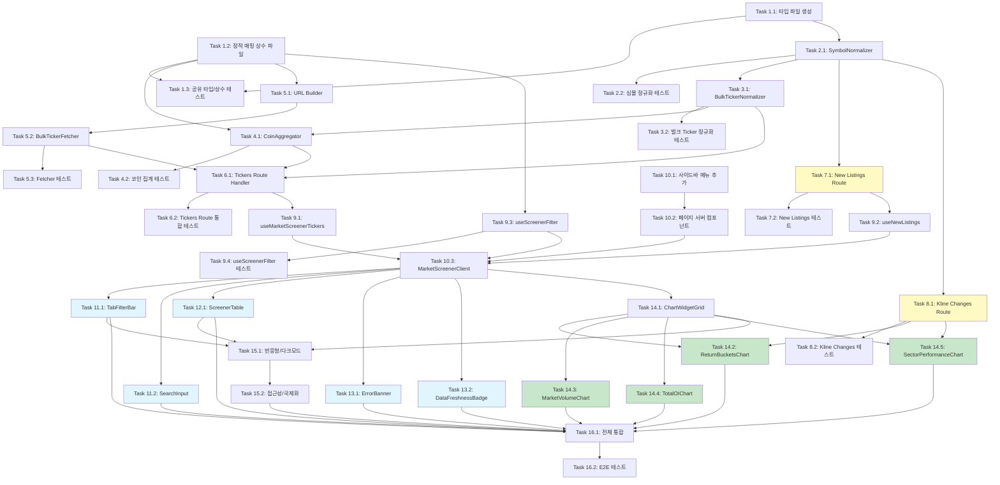

# Velo Market Screener - 구현 계획 (Implementation Plan)

> 본 문서는 requirements.md와 design.md를 기반으로 작성된 코딩 태스크 목록이다.
> 각 태스크는 테스트 주도 개발 방식으로 이전 단계를 기반으로 점진적으로 구현한다.
> 구현 시 requirements.md와 design.md를 참고 문서로 함께 제공한다.

---

- [ ] 1. 공유 타입 및 상수 정의
- [ ] 1.1 마켓 스크리너 타입 파일 생성
  - `packages/shared/src/types/market-screener.ts` 파일 생성
  - `SortTab`, `CapFilter`, `SectorFilter`, `ChartPeriod`, `MarketCapCategory`, `CoinSector`, `SortColumn` 타입 정의
  - `NormalizedTicker`, `ExchangeBreakdown`, `AggregatedCoin`, `ExchangeTotal` 인터페이스 정의
  - `MarketScreenerResponse`, `NewListingCoin`, `NewListingsResponse` 인터페이스 정의
  - `ReturnBucket`, `SectorPerformance`, `KlineChangesResponse` 인터페이스 정의
  - `packages/shared/src/types/index.ts`에 re-export 추가
  - _Requirements: 2.2, 11.3, 11.4, 14.5_

- [ ] 1.2 정적 매핑 상수 파일 생성
  - `packages/shared/src/constants/market-screener.ts` 파일 생성
  - `COIN_MARKET_CAP_MAP` (250+ 코인의 시가총액 분류: large/mid/small) 상수 정의
  - `COIN_SECTOR_MAP` (코인별 섹터 분류: DeFi/L1/L2/Metaverse/Meme/Dino/AI) 상수 정의
  - `SECTOR_LABELS` (섹터 표시 라벨) 상수 정의
  - `BULK_TICKER_CONFIGS` (6개 거래소별 벌크 API URL/method/body 설정) 상수 정의
  - `packages/shared/src/constants/index.ts`에 re-export 추가
  - _Requirements: 4.4, 5.3, 12.1~12.7, 14.1~14.6_

- [ ] 1.3 공유 타입 및 상수 단위 테스트 작성
  - `COIN_MARKET_CAP_MAP`의 키가 모두 대문자 심볼인지 검증
  - `COIN_SECTOR_MAP`의 값이 유효한 `CoinSector` 배열인지 검증
  - `BULK_TICKER_CONFIGS`가 6개 거래소를 모두 포함하는지 검증
  - 250개 이상 코인이 `COIN_MARKET_CAP_MAP`에 포함되어 있는지 검증
  - _Requirements: 14.5, 14.6_

---

- [ ] 2. 심볼 정규화 모듈 구현
- [ ] 2.1 `SymbolNormalizer` 구현
  - `apps/web/app/api/market-screener/_lib/symbol-normalizer.ts` 파일 생성
  - `normalizeSymbol(exchange, rawSymbol): string | null` 함수 구현
  - 거래소별 변환 규칙 구현: Binance/Bybit/Bitget `BTCUSDT` -> `BTC`, OKX `BTC-USDT-SWAP` -> `BTC`, Gate.io `BTC_USDT` -> `BTC`, Hyperliquid `BTC` -> `BTC`
  - USDT-마진 선물이 아닌 경우(COIN-마진 등) `null` 반환하여 필터링
  - _Requirements: 13.1, 13.2, 13.3_

- [ ] 2.2 심볼 정규화 단위 테스트 작성
  - `apps/web/app/api/market-screener/_lib/__tests__/symbol-normalizer.test.ts` 파일 생성
  - 6개 거래소별 정상 변환 케이스 테스트
  - COIN-마진 선물 필터링 테스트 (예: `BTCUSD_PERP` -> null)
  - 엣지 케이스 테스트 (빈 문자열, 알 수 없는 포맷)
  - _Requirements: 13.1, 13.2, 13.3_

---

- [ ] 3. 벌크 Ticker 정규화 모듈 구현
- [ ] 3.1 `BulkTickerNormalizer` 구현
  - `apps/web/app/api/market-screener/_lib/bulk-ticker-normalizer.ts` 파일 생성
  - `normalizeBulkTickers(exchange, rawData): NormalizedTicker[]` 함수 구현
  - Binance 정규화: `lastPrice`, `priceChangePercent`(%->소수), `quoteVolume`, OI 0, fundingRate 0
  - Bybit 정규화: `lastPrice`, `price24hPcnt`, `turnover24h`, `openInterest * lastPrice`, `fundingRate`
  - OKX 정규화: `last`, `(last-open24h)/open24h`, `volCcy24h * last`, OI 0, fundingRate 0
  - Gate.io 정규화: `last`, `change_percentage / 100`, `volume_24h_quote`, `total_size * quanto_multiplier * last`, `funding_rate`
  - Bitget 정규화: `lastPr`, `change24h`, `usdtVolume`, `openInterestUsd`, `fundingRate`
  - Hyperliquid 정규화: `markPx`, `(markPx - prevDayPx) / prevDayPx`, `dayNtlVlm`, `openInterest * markPx`, `funding`
  - 내부적으로 `normalizeSymbol()`을 호출하여 심볼 변환 + USDT-마진 필터링
  - _Requirements: 11.3, 12.1~12.7_

- [ ] 3.2 벌크 Ticker 정규화 단위 테스트 작성
  - `apps/web/app/api/market-screener/_lib/__tests__/bulk-ticker-normalizer.test.ts` 파일 생성
  - 6개 거래소별 샘플 API 응답을 fixture로 준비
  - 각 거래소의 필드 매핑 정확성 검증
  - 숫자 파싱 정확성 검증 (문자열 -> number)
  - 누락 필드 시 기본값 0 처리 검증
  - USDT-마진 선물 외 항목 필터링 검증
  - _Requirements: 11.3, 12.1~12.7, 13.3_

---

- [ ] 4. 코인 집계 모듈 구현
- [ ] 4.1 `CoinAggregator` 구현
  - `apps/web/app/api/market-screener/_lib/coin-aggregator.ts` 파일 생성
  - `aggregateCoins(allTickers: NormalizedTicker[]): AggregatedCoin[]` 함수 구현
  - 심볼별 그룹화 후 가중 평균/합산 집계 로직 구현
    - 가격: 거래량 가중 평균
    - 변화율: 거래량 가중 평균
    - 거래량/OI: 합산
    - 펀딩비율: OI 가중 평균
  - `COIN_MARKET_CAP_MAP`과 `COIN_SECTOR_MAP`으로 시가총액/섹터 분류 정보 enrichment
  - 거래소별 `ExchangeBreakdown` 배열 생성
  - _Requirements: 2.6, 11.4_

- [ ] 4.2 코인 집계 단위 테스트 작성
  - `apps/web/app/api/market-screener/_lib/__tests__/coin-aggregator.test.ts` 파일 생성
  - 복수 거래소 가중 평균 정확성 테스트
  - 단일 거래소만 있는 코인 테스트
  - 거래량 0인 경우 fallback 처리 테스트
  - OI가 0인 거래소의 펀딩비율 가중 평균 테스트
  - 시가총액/섹터 enrichment 정확성 테스트
  - _Requirements: 2.6, 11.4, 4.4, 5.3_

---

- [ ] 5. URL 빌더 및 벌크 Ticker 수집 모듈 구현
- [ ] 5.1 `bulkTickerUrlBuilder` 구현
  - `apps/web/app/api/market-screener/_lib/url-builder.ts` 파일 생성
  - `buildBulkTickerUrl(exchange): { url, method, body? }` 함수 구현
  - `BULK_TICKER_CONFIGS` 상수를 활용하여 6개 거래소 URL 반환
  - _Requirements: 12.1~12.7_

- [ ] 5.2 `BulkTickerFetcher` 구현
  - `apps/web/app/api/market-screener/_lib/bulk-ticker-fetcher.ts` 파일 생성
  - `fetchAllBulkTickers(): Promise<BulkTickerResult>` 함수 구현
  - `Promise.allSettled`로 6개 거래소 병렬 호출
  - 개별 거래소 타임아웃 5초 (`AbortSignal.timeout(5000)`)
  - 실패/타임아웃 거래소는 `errors` 맵에 기록하고 나머지 데이터 반환
  - _Requirements: 11.1, 11.2, NFR-1.2, NFR-2.1, NFR-2.4_

- [ ] 5.3 벌크 Ticker 수집 단위 테스트 작성
  - `apps/web/app/api/market-screener/_lib/__tests__/bulk-ticker-fetcher.test.ts` 파일 생성
  - 전체 성공 시나리오 테스트 (mock fetch)
  - 일부 거래소 실패 시 나머지 데이터 반환 테스트
  - 타임아웃 처리 테스트
  - 전체 실패 시나리오 테스트
  - _Requirements: 11.1, 11.2, NFR-2.1, NFR-2.4_

---

- [ ] 6. Route Handler 구현 - Tickers API
- [ ] 6.1 Tickers Route Handler 구현
  - `apps/web/app/api/market-screener/tickers/route.ts` 파일 생성
  - `GET` 핸들러 구현: BulkTickerFetcher -> BulkTickerNormalizer -> CoinAggregator 파이프라인
  - 기존 `InMemoryCache` 패턴 재사용 (TTL 30초, 스테일 유예 5분)
  - `Cache-Control: s-maxage=30, stale-while-revalidate=60` 헤더 설정
  - 응답 포맷: `MarketScreenerResponse` (coins, exchangeVolumes, exchangeOI, errors, timestamp, cached)
  - 거래소별 Volume/OI 합산 데이터(`ExchangeTotal[]`) 계산하여 응답에 포함
  - _Requirements: 11.1~11.5, NFR-2.6_

- [ ] 6.2 Tickers Route Handler 통합 테스트 작성
  - `apps/web/app/api/market-screener/tickers/__tests__/route.test.ts` 파일 생성
  - 캐시 히트(Fresh) 시 캐시 데이터 반환 테스트
  - 캐시 미스 시 6개 거래소 호출 후 집계 데이터 반환 테스트
  - 부분 실패 (3개 거래소 실패) 시 Graceful Degradation 테스트
  - 전체 실패 시 스테일 캐시 폴백 또는 500 에러 테스트
  - 응답 헤더 Cache-Control 검증
  - _Requirements: 11.1~11.5, NFR-2.1~NFR-2.6_

---

- [ ] 7. Route Handler 구현 - New Listings API
- [ ] 7.1 New Listings Route Handler 구현
  - `apps/web/app/api/market-screener/new-listings/route.ts` 파일 생성
  - Binance `exchangeInfo`, Bybit `instruments-info`, OKX `instruments` API 병렬 호출
  - 각 거래소 응답에서 상장일 정보 추출 (Binance: `onboardDate`, Bybit: `launchTime`, OKX: `listTime`)
  - 최근 30일 이내 상장된 코인 필터링
  - 심볼 정규화 + 중복 제거 (동일 코인이 여러 거래소에 상장된 경우)
  - 캐시 TTL 1시간, 스테일 유예 2시간
  - 응답 포맷: `NewListingsResponse`
  - _Requirements: 3.5~3.8, 15.1~15.4_

- [ ] 7.2 New Listings Route Handler 테스트 작성
  - 각 거래소 `exchangeInfo` 응답 파싱 테스트
  - 30일 이내 필터링 정확성 테스트
  - 심볼 정규화 및 중복 제거 테스트
  - 부분 실패 시 Graceful Degradation 테스트
  - _Requirements: 15.1~15.4_

---

- [ ] 8. Route Handler 구현 - Kline Changes API
- [ ] 8.1 Kline Changes Route Handler 구현
  - `apps/web/app/api/market-screener/kline-changes/route.ts` 파일 생성
  - `GET /api/market-screener/kline-changes?period=1w|1m` 핸들러 구현
  - Binance 단일 거래소에서 주요 코인의 Kline 데이터를 배치 호출
  - 7일/30일 전 가격 대비 현재 가격 변화율 계산
  - 서버 캐시 5분 TTL, 스테일 유예 30분
  - 응답 포맷: `KlineChangesResponse` (symbol -> 변화율 매핑)
  - _Requirements: 7.10_

- [ ] 8.2 Kline Changes Route Handler 테스트 작성
  - 1w/1m 기간 파라미터 처리 테스트
  - Kline 데이터 파싱 및 변화율 계산 테스트
  - 캐시 동작 테스트
  - _Requirements: 7.10_

---

- [ ] 9. TanStack Query 커스텀 훅 구현
- [ ] 9.1 `useMarketScreenerTickers` 훅 구현
  - `apps/web/hooks/useMarketScreenerTickers.ts` 파일 생성
  - TanStack Query `useQuery`로 `/api/market-screener/tickers` fetch
  - 설정: staleTime 30초, refetchInterval 60초, refetchOnWindowFocus true, refetchIntervalInBackground false, retry 2, placeholderData keepPreviousData
  - _Requirements: 16.1~16.5_

- [ ] 9.2 `useNewListings` 훅 구현
  - `apps/web/hooks/useNewListings.ts` 파일 생성
  - TanStack Query `useQuery`로 `/api/market-screener/new-listings` fetch
  - 설정: staleTime 10분, refetchInterval 없음
  - _Requirements: 15.4, 3.5~3.6_

- [ ] 9.3 `useScreenerFilter` 훅 구현
  - `apps/web/hooks/useScreenerFilter.ts` 파일 생성
  - `useScreenerFilter(coins, state, newListings): FilteredResult` 구현
  - 검색 필터 (대소문자 무시, symbol 매칭)
  - 시가총액 필터 (`COIN_MARKET_CAP_MAP` 기반)
  - 섹터 필터 (`COIN_SECTOR_MAP` 기반)
  - 정렬 탭 (topGainers: change DESC, topLosers: change ASC, topVolume: volume DESC, newListings: listDate DESC)
  - `useMemo`로 필터/정렬 결과 메모이제이션 (100ms 이내 완료)
  - _Requirements: 3.1~3.4, 4.1~4.5, 5.1~5.5, 6.1~6.4, 17.1~17.4_

- [ ] 9.4 `useScreenerFilter` 단위 테스트 작성
  - `apps/web/hooks/__tests__/useScreenerFilter.test.ts` 파일 생성
  - Top Gainers/Losers/Volume 정렬 테스트
  - Large/Mid/Small Cap 필터 테스트
  - 섹터별 필터 테스트
  - 탭 조합 (AND 조건) 필터 테스트
  - 검색 필터 (대소문자 무시) 테스트
  - 빈 결과 반환 테스트
  - New Listings 탭 필터 테스트
  - _Requirements: 3.1~3.4, 4.1~4.5, 5.1~5.5, 6.1~6.4, 17.1~17.4_

---

- [ ] 10. 마켓 스크리너 페이지 기본 구조 및 사이드바 메뉴 추가
- [ ] 10.1 사이드바 메뉴에 "마켓 스크리너" 항목 추가
  - 기존 사이드바 컴포넌트에서 "마켓" 섹션(`sectionMarket`)에 메뉴 항목 추가
  - 적절한 아이콘(예: BarChart3 또는 ScanSearch 아이콘) 설정
  - `/market-screener` 경로 연결 및 active 상태 스타일링
  - _Requirements: 1.1~1.4_

- [ ] 10.2 마켓 스크리너 페이지 서버 컴포넌트 생성
  - `apps/web/app/(dashboard)/market-screener/page.tsx` 파일 생성
  - 메타데이터 설정 (title: "Market Screener")
  - `MarketScreenerClient` 클라이언트 컴포넌트에 위임
  - _Requirements: 18.6_

- [ ] 10.3 `MarketScreenerClient` 클라이언트 오케스트레이터 구현
  - `apps/web/app/(dashboard)/market-screener/components/market-screener-client.tsx` 파일 생성
  - `ScreenerState` 상태 관리 (sortTab, capFilter, sectorFilter, searchQuery, chartPeriod)
  - `useMarketScreenerTickers`, `useNewListings`, `useScreenerFilter` 훅 연결
  - 로딩 상태에서 스켈레톤 UI 표시
  - 전체 레이아웃 구성: ErrorBanner -> DataFreshnessBadge -> TabFilterBar -> SearchInput -> ScreenerTable -> ChartWidgetGrid
  - _Requirements: 2.9, 18.6, NFR-1.1_

---

- [ ] 11. 탭 필터 바 및 검색 입력 컴포넌트 구현
- [ ] 11.1 `TabFilterBar` 컴포넌트 구현
  - `apps/web/app/(dashboard)/market-screener/components/tab-filter-bar.tsx` 파일 생성
  - 3개 탭 그룹을 행(row)으로 배치: (1) 정렬 탭, (2) 시가총액 탭, (3) 섹터 탭
  - shadcn/ui `Tabs` 컴포넌트 활용
  - 키보드 탐색 지원 (Tab, Enter, Arrow keys)
  - 시가총액/섹터 탭에 "All" 기본 옵션 포함
  - _Requirements: 6.1~6.4, NFR-3.3_

- [ ] 11.2 `SearchInput` 컴포넌트 구현
  - `apps/web/app/(dashboard)/market-screener/components/search-input.tsx` 파일 생성
  - 300ms debounce 적용
  - 대소문자 무시 안내 placeholder 표시
  - _Requirements: 17.1~17.4_

---

- [ ] 12. 스크리너 테이블 컴포넌트 구현
- [ ] 12.1 `ScreenerTable` 컴포넌트 구현
  - `apps/web/app/(dashboard)/market-screener/components/screener-table.tsx` 파일 생성
  - `@tanstack/react-virtual`을 사용한 가상 스크롤 테이블 구현 (250+ 행 -> 뷰포트 내 20~30행만 렌더)
  - 컬럼: 코인명(심볼+아이콘), 가격(USD), 24h 변화율(%), 24h 거래량(약식 $1.2B), OI(약식), 펀딩비율(%)
  - 양수 변화율: 녹색, 음수: 빨간색 셀 스타일링
  - 양수 펀딩비율: 녹색, 음수: 빨간색 셀 스타일링
  - 컬럼 헤더 클릭 시 오름차순/내림차순 정렬 토글
  - 코인 행 클릭 시 `onCoinClick` 콜백 -> `/futures-dashboard?coin=XXX` 이동
  - 신규 상장 코인에 "NEW" 배지 표시
  - 스켈레톤 UI (isLoading 상태)
  - 가격 변동 시 flash 애니메이션 (useRef로 이전 가격 비교, CSS transition)
  - 수평 스크롤 지원 (모바일)
  - 시맨틱 HTML 테이블 요소 사용 (table, thead, tbody, th, td)
  - 빈 결과 시 "해당 조건에 맞는 코인이 없습니다" 메시지
  - 숫자 약식 표기 유틸 함수 구현 ($1.2B, $340M 등)
  - _Requirements: 2.1~2.10, 3.7, 6.3, 16.6, NFR-1.3, NFR-1.4, NFR-3.1, NFR-4.2, 18.4_

---

- [ ] 13. 에러 배너 및 데이터 신선도 컴포넌트 구현
- [ ] 13.1 `ErrorBanner` 컴포넌트 구현
  - `apps/web/app/(dashboard)/market-screener/components/error-banner.tsx` 파일 생성
  - 일부 거래소 실패 시: 어떤 거래소 데이터가 누락되었는지 경고 배너 표시
  - 전체 거래소 실패 시: 에러 메시지 + 재시도 버튼
  - 데이터 2분 이상 경과 시: 데이터 갱신 지연 경고
  - _Requirements: 2.10, NFR-2.2, NFR-2.3, NFR-2.5_

- [ ] 13.2 `DataFreshnessBadge` 컴포넌트 구현
  - `apps/web/app/(dashboard)/market-screener/components/data-freshness-badge.tsx` 파일 생성
  - 마지막 갱신 시간 표시
  - 2분 초과 시 경고 배지 스타일 적용
  - 수동 새로고침 버튼 포함
  - _Requirements: 16.7, 16.8, 18.6_

---

- [ ] 14. 차트 위젯 구현
- [ ] 14.1 `ChartWidgetGrid` 레이아웃 컴포넌트 구현
  - `apps/web/app/(dashboard)/market-screener/components/chart-widget-grid.tsx` 파일 생성
  - 반응형 그리드 배치: 데스크톱(lg+) 2x2, 태블릿(md) 2열, 모바일(sm-) 1열
  - 4개 차트 위젯을 `next/dynamic`으로 lazy loading
  - _Requirements: 18.1~18.3, NFR-1.5_

- [ ] 14.2 `ReturnBucketsChart` 구현
  - `apps/web/app/(dashboard)/market-screener/components/charts/return-buckets-chart.tsx` 파일 생성
  - Recharts `BarChart`로 수익률 분포 히스토그램 렌더링
  - X축: 수익률 구간 (-30% ~ +30%, 5% 단위, 총 13개 구간)
  - Y축: 해당 구간 코인 수
  - 기간 선택기 (1d/1w/1m)
  - 1d: `priceChange24h` 직접 사용, 1w/1m: Kline Changes API 호출
  - 양수 구간 녹색, 음수 구간 빨간색
  - hover 시 해당 구간 코인 목록(심볼+수익률) 툴팁
  - _Requirements: 7.1~7.10_

- [ ] 14.3 `MarketVolumeChart` 구현
  - `apps/web/app/(dashboard)/market-screener/components/charts/market-volume-chart.tsx` 파일 생성
  - Recharts `BarChart`로 6개 거래소별 24h 총 선물 거래량 표시
  - 거래소별 고유 색상 구분 (EXCHANGE_COLORS 재사용)
  - 거래량 큰 순서로 정렬
  - hover 시 정확한 거래량(USD) 수치 툴팁
  - _Requirements: 8.1~8.5_

- [ ] 14.4 `TotalOIChart` 구현
  - `apps/web/app/(dashboard)/market-screener/components/charts/total-oi-chart.tsx` 파일 생성
  - Recharts `BarChart`로 6개 거래소별 현재 총 OI(USD) 표시
  - Market Volume 차트와 동일한 색상 스킴
  - OI 큰 순서로 정렬
  - hover 시 정확한 OI(USD) 수치 툴팁
  - OI 데이터 없는 거래소는 "데이터 없음" 표시
  - _Requirements: 9.1~9.6_

- [ ] 14.5 `SectorPerformanceChart` 구현
  - `apps/web/app/(dashboard)/market-screener/components/charts/sector-performance-chart.tsx` 파일 생성
  - Recharts `BarChart`로 섹터별 평균 수익률 비교 차트 렌더링
  - 기간 선택기 (1d/1w/1m)
  - 섹터별 단순 산술 평균 계산
  - 양수 녹색, 음수 빨간색
  - 성과 높은 순서로 정렬
  - hover 시 평균 수익률, 포함 코인 수, 구성 코인 목록 툴팁
  - _Requirements: 10.1~10.7_

---

- [ ] 15. 반응형 디자인 및 테마 통합
- [ ] 15.1 반응형 레이아웃 적용 및 다크 모드 통합
  - 전체 페이지 레이아웃: 테이블 상단, 차트 위젯 하단 구성
  - 기존 BitScope 다크 모드 테마와 일관된 Tailwind CSS 스타일링
  - shadcn/ui 컴포넌트 일관 적용
  - 페이지 타이틀 "Market Screener" + 마지막 갱신 시간 표시
  - _Requirements: 18.1~18.6, NFR-5.1, NFR-5.2_

- [ ] 15.2 접근성 및 국제화 적용
  - 차트에 ARIA 레이블 추가
  - 색상 대비 WCAG AA 기준 확인
  - 기존 i18n 시스템 활용하여 한국어/영어 UI 텍스트 전환 지원
  - 숫자 축약 표기 ($1.2B, $340M) 적용
  - _Requirements: NFR-3.1~NFR-3.3, NFR-4.1, NFR-4.2_

---

- [ ] 16. 전체 통합 및 엔드투엔드 테스트
- [ ] 16.1 페이지 전체 통합 연결 확인
  - `MarketScreenerClient`에서 모든 하위 컴포넌트(TabFilterBar, SearchInput, ScreenerTable, ChartWidgetGrid, ErrorBanner, DataFreshnessBadge) 정상 연결 확인
  - 사이드바 메뉴 -> 페이지 이동 -> 데이터 로드 -> 테이블/차트 렌더링 전체 흐름 통합
  - 코인 행 클릭 -> `/futures-dashboard?coin=XXX` 이동 통합
  - _Requirements: 1.2, 2.8_

- [ ] 16.2 자동화 E2E 테스트 작성
  - 페이지 로드 시 스켈레톤 -> 테이블 렌더링 흐름 테스트
  - 탭 전환 (Top Gainers/Losers/Volume) 시 정렬 변경 테스트
  - 필터 조합 (예: Top Gainers + Large Cap + DeFi) 시 정확한 필터링 테스트
  - 검색 입력 시 테이블 필터링 테스트
  - 에러 시나리오 (부분 실패 -> 경고 배너, 전체 실패 -> 에러 + 재시도) 테스트
  - _Requirements: 2.1~2.10, 3.1~3.4, 6.1~6.4, 17.1~17.4, NFR-2.1~NFR-2.5_

---

## Tasks Dependency Diagram

**범례:**
- 파란색: 페이지 구조 완료 후 병렬 실행 가능한 UI 컴포넌트
- 녹색: ChartWidgetGrid 완료 후 병렬 실행 가능한 차트 위젯
- 노란색: 심볼 정규화 완료 후 병렬 실행 가능한 보조 Route Handler
